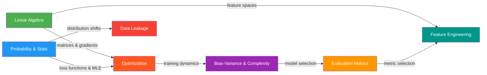

# 00 Foundations

The mathematical and conceptual bedrock that every ML interview assumes you have internalized. These are not optional. Without a solid foundation in this section, reasoning about deep learning architectures, training dynamics, and production systems becomes brittle - you can apply formulas without understanding them, which experienced interviewers detect immediately.

---

## Why Foundations Matter at Senior Level

Junior engineers are often evaluated on their ability to use tools correctly. Senior engineers are evaluated on their ability to:
- Reason about why a model fails in production
- Design training procedures for novel problem settings
- Make principled tradeoff decisions under uncertainty
- Debug unexpected behaviors in training dynamics

All of these require deep foundational knowledge. A senior candidate who cannot derive the gradient of cross-entropy loss, or who cannot explain why Adam converges faster than SGD in practice, has a ceiling on the depth of answers they can provide.

---

## Topics in This Section



---

## Navigation

| File | Core Concepts | Interview Weight |
|------|--------------|-----------------|
| [linear_algebra.md](./linear_algebra.md) | Matrices, SVD, eigendecomposition, Jacobian, Hessian | High - every DL question touches this |
| [probability_and_statistics.md](./probability_and_statistics.md) | MLE, MAP, distributions, KL divergence, cross-entropy | Critical - underpins all loss functions |
| [optimization_basics.md](./optimization_basics.md) | Gradient descent, Adam, learning rate schedules, saddle points | Critical - training IS optimization |
| [bias_variance_and_model_complexity.md](./bias_variance_and_model_complexity.md) | Bias-variance tradeoff, double descent, regularization, VC dimension | High - asked in almost every interview |
| [evaluation_metrics.md](./evaluation_metrics.md) | AUC-ROC, AUC-PR, NDCG, BLEU, perplexity, F1 | High - metric selection is a system design skill |
| [data_leakage.md](./data_leakage.md) | Target leakage, temporal leakage, train-test contamination | High - demonstrates production maturity |
| [feature_engineering.md](./feature_engineering.md) | Encoding, scaling, imputation, selection, SHAP | Medium-High - still critical for structured data |

---

## Suggested Study Approach for Foundations

### Step 1: Read Without Coding (Day 1-2 per topic)
Read through the conceptual sections without worrying about implementing anything. Build mental models. Draw diagrams by hand. The goal is to be able to explain each concept in plain English.

### Step 2: Work Through the Math (Day 2-3 per topic)
Derive the key results yourself. Do not just read the derivations - cover them up and reproduce them. If you cannot reproduce a derivation, you do not own it.

Key derivations to reproduce from memory:
- Gradient of MSE loss with respect to weights
- Gradient of cross-entropy with respect to logits
- Adam optimizer update equations
- PCA as truncated SVD
- Bias-variance decomposition of MSE
- MLE derivation of linear regression

### Step 3: Run and Modify the Code (Day 3-4 per topic)
Run every code example. Then:
- Change parameters and observe effects
- Break the code intentionally (what happens with learning rate 1000?)
- Implement variants not shown in the examples

### Step 4: Answer Interview Questions Cold (Day 4)
Cover up the answers and attempt each interview question from scratch. Time yourself. A senior candidate should give a complete, correct answer to foundational questions in under 2 minutes.

---

## Key Connections Between Foundation Topics

### Linear Algebra + Probability = Gaussian Processes
The covariance matrix (linear algebra) is the core object in multivariate Gaussian distributions. Understanding matrix operations lets you reason about correlations between features and between predictions.

### Probability + Optimization = Loss Functions
Every standard loss function is the negative log-likelihood of some probability distribution:
- MSE = -log P(y | x, w) under Gaussian noise assumption
- Binary cross-entropy = -log P(y | x, w) under Bernoulli assumption
- Categorical cross-entropy = -log P(y | x, w) under Categorical assumption

Understanding this means you can derive new loss functions for novel problem settings.

### Bias-Variance + Optimization = Training Dynamics
Why does early stopping reduce overfitting? Because gradient descent in a non-convex loss landscape explores the parameter space in a particular order - simpler solutions tend to be found first. Stopping early keeps you in the lower-complexity region of the parameter space.

### Evaluation Metrics + Data Leakage = Production Reliability
Getting your evaluation setup wrong (wrong metric, contaminated test set) is the most common reason a model that looks great in development fails in production. These two topics together tell you how to trust your evaluation results.

### Feature Engineering + Linear Algebra = Representation Learning
Feature engineering is, at its core, finding a better basis for your data. PCA finds the basis that maximizes variance. Neural networks learn a basis end-to-end. Manual feature engineering is explicit basis selection.

---

## Foundational Formulas Quick Reference

### Linear Algebra
```
Matrix multiply:    (AB)_{ij} = sum_k A_{ik} * B_{kj}
SVD:               A = U * Sigma * V^T
Eigendecomposition: A * v = lambda * v
Frobenius norm:    ||A||_F = sqrt(sum_{ij} a_{ij}^2)
Cosine similarity: cos(u, v) = (u · v) / (||u|| * ||v||)
```

### Probability
```
Bayes theorem:     P(A|B) = P(B|A) * P(A) / P(B)
Chain rule:        P(A, B, C) = P(A) * P(B|A) * P(C|A, B)
MLE:               theta* = argmax_theta sum_i log P(x_i | theta)
KL divergence:     KL(P||Q) = sum_x P(x) * log(P(x) / Q(x))
Cross-entropy:     H(P, Q) = -sum_x P(x) * log Q(x)
                   H(P, Q) = H(P) + KL(P||Q)
```

### Optimization
```
Gradient descent:  theta_{t+1} = theta_t - lr * gradient(L, theta_t)
Adam:              m_t = beta1 * m_{t-1} + (1-beta1) * g_t
                   v_t = beta2 * v_{t-1} + (1-beta2) * g_t^2
                   theta_{t+1} = theta_t - lr * m_hat_t / (sqrt(v_hat_t) + eps)
```

### Evaluation
```
Precision:         TP / (TP + FP)
Recall:            TP / (TP + FN)
F1:                2 * P * R / (P + R)
AUC-ROC:           P(score(pos) > score(neg)) for random pos/neg pair
```

---

## Common Foundation Mistakes That Fail Candidates

1. **Confusing KL divergence with cross-entropy** - they differ by H(P), the entropy of the true distribution. Cross-entropy = entropy + KL.

2. **Saying "gradient descent finds the global minimum"** - it does not in non-convex settings. It finds a local minimum or saddle point. The empirical observation is that local minima in overparameterized networks tend to generalize well.

3. **Defining overfitting as "high training accuracy"** - overfitting is specifically the gap between training and validation performance. A model with 99% training accuracy and 98% validation accuracy is not overfitting.

4. **Saying "AUC-ROC is always the right metric"** - for heavily imbalanced datasets, AUC-PR is more informative because AUC-ROC can be artificially high when the negative class is dominant.

5. **Not knowing that L1 regularization produces sparse solutions** - and being unable to explain why geometrically (the L1 ball has corners, which touch axes).

6. **Confusing bias and variance in the ensemble context** - Bagging reduces variance (parallel learners). Boosting reduces bias (sequential correction of errors). This has a direct implication on when to use each.

7. **Not checking for data leakage before celebrating high accuracy** - any time you see unexpectedly high performance, leakage is your first hypothesis to rule out.

---

## Prerequisites

This section assumes:
- Comfort with calculus (partial derivatives, chain rule)
- Basic familiarity with Python and NumPy
- Exposure to at least one ML framework (sklearn, PyTorch, or TensorFlow)

It does NOT assume prior deep knowledge of any of the topics covered - that is what this section builds.

---

*Continue to [Linear Algebra](./linear_algebra.md)*
