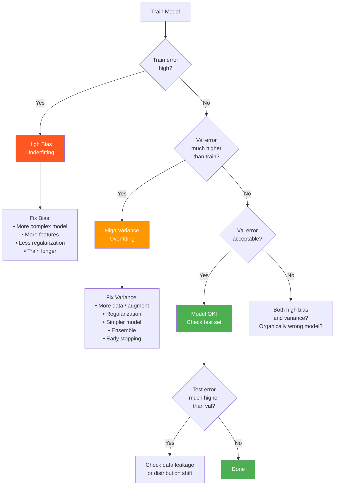

# Bias, Variance, and Model Complexity

The bias-variance tradeoff is the foundational organizing principle of statistical learning theory. It explains why all ML approaches involve tradeoffs, why regularization works, why ensembles work, and why the modern "double descent" phenomenon upends classical intuitions. Every model selection decision, every regularization choice, and every architecture decision is, at some level, a bias-variance tradeoff.

---

## 1. Derivation of the Bias-Variance Decomposition

### Setup

Consider a regression problem with:
- True function: f(x) (unknown)
- Noisy observations: y = f(x) + ε, where ε ~ N(0, σ²) (irreducible noise)
- Training set D of size n drawn from some distribution
- Learned model: f̂_D(x) (depends on the training set D)

We want to understand the expected prediction error at a new point x₀:
```
E_D[(f̂_D(x_0) - y)^2]
```
where the expectation is over:
1. The randomness in the training set D
2. The irreducible noise in y

### Full Derivation

Let f̂(x₀) denote f̂_D(x₀) for brevity, E denote E_D (expectation over training sets).

**Step 1**: Add and subtract E[f̂(x₀)]:
```
E[(f̂ - y)^2] = E[(f̂ - E[f̂] + E[f̂] - f(x_0) - ε)^2]
```

**Step 2**: Expand the square. The cross-terms involving ε vanish because E[ε] = 0 and ε is independent of f̂ and D:
```
E[(f̂ - y)^2] = E[(f̂ - E[f̂])^2]              [VARIANCE]
              + (E[f̂] - f(x_0))^2              [BIAS^2]
              + E[ε^2]                           [IRREDUCIBLE NOISE]
              = Var[f̂(x_0)] + Bias²[f̂(x_0)] + σ²
```

### Components Defined

**Bias²**: The squared difference between the average prediction of our model (across all possible training sets) and the true value:
```
Bias[f̂(x_0)] = E_D[f̂_D(x_0)] - f(x_0)
Bias^2 = (E_D[f̂_D(x_0)] - f(x_0))^2
```
Bias measures **systematic error** - how wrong the model is on average. High bias = the model consistently makes wrong predictions regardless of training data.

**Variance**: The variability of the model's predictions across different training sets:
```
Var[f̂(x_0)] = E_D[(f̂_D(x_0) - E_D[f̂_D(x_0)])^2]
```
Variance measures **sensitivity to training data**. High variance = the model changes dramatically when trained on different subsets of data.

**Irreducible noise σ²**: The inherent noise in the data generation process. Cannot be reduced by any model.

### Summary Formula

```
Expected MSE = Bias² + Variance + σ²   (irreducible)
```

**Key insight**: Minimizing expected MSE requires balancing bias and variance. Reducing one typically increases the other. The optimal model is not necessarily the one that minimizes training error.

---

## 2. Visual Intuition: Bulls-Eye Diagrams

Imagine shooting at a target where the bulls-eye is the true function value f(x₀). Each shot is a prediction from a model trained on a different dataset D.

```
High Bias, Low Variance     High Bias, High Variance
(Underfitting)              (Worst case)

    o o                        .  o  .
   o . o                     o       .
   o . o    [Target=.]       . [.]    o
   o . o                      .     o
    o o                          o


Low Bias, High Variance     Low Bias, Low Variance
(Overfitting)               (Ideal!)

    .                          .
  . . .                       ...
 . [.]. .                    .[.]..
  . . .                       ...
    .                          .

[.] = Bulls-eye (truth)     o or . = Individual predictions
```

| Model Type | Bias | Variance | Example |
|------------|------|----------|---------|
| Too simple | High | Low | Fitting a line to quadratic data |
| Too complex | Low | High | 1000-node tree on 100 samples |
| Just right | Low | Low | Correct model complexity |
| Really bad | High | High | Random forest with no data |

---

## 3. Underfitting vs Overfitting

### Underfitting (High Bias)

**Symptoms**:
- Training loss is high
- Validation loss is high and similar to training loss
- Learning curves plateau early at a high error
- Adding more data doesn't help much (model is already at its capacity)
- Model is too simple to capture the true patterns

**Causes**: Model class is too restricted (linear model for nonlinear data), too much regularization, insufficient training time.

**Fixes**: Increase model capacity (more layers/neurons, polynomial features), reduce regularization, train longer, use better features.

### Overfitting (High Variance)

**Symptoms**:
- Training loss is very low
- Validation loss is much higher than training loss
- Large gap between train and validation performance
- Performance degrades as model becomes more complex
- Model memorizes training examples instead of learning patterns

**Causes**: Too many parameters relative to data, insufficient regularization, noisy features, training too long.

**Fixes**: Regularization (L1, L2, dropout), more data, data augmentation, early stopping, simpler model, cross-validation for model selection.

### Learning Curves Interpretation

Plot training and validation error vs training set size:

```
Error
  |
  |  Training error    ----___________
  |                              ↑
  |                         Generalization gap
  |                              ↓
  |  Validation error  ----___________-----
  |
  |___________________________________ n (training size)

Good fit: Both curves converge, small gap

Error
  |
  |  Training error     _______________
  |
  |
  |  Validation error  --_______________  (barely decreasing)
  |
  |___________________________________ n (training size)

Underfitting: Both high, don't converge

Error
  |  Validation error  --______---/----
  |
  |                        large gap
  |
  |  Training error    _______________
  |
  |___________________________________ n (training size)

Overfitting: Large gap, validation may not improve
```

**Key diagnostics**:
- If both curves plateau high: underfitting → increase model capacity
- If large gap between curves: overfitting → add regularization or data
- If validation error increases as training continues: overfitting → early stopping
- If adding data consistently helps: variance problem (overfitting)
- If adding data doesn't help: bias problem (underfitting)

---

## 4. The Double Descent Phenomenon

Classical statistics predicts a "U-shaped" test error curve as model complexity increases: error decreases as we fit the data better, then increases as we overfit. The optimal model lives at the bottom of this U.

**The modern finding**: With very large models (especially neural networks), the test error curve shows a **second descent** after the classical peak. This is called "double descent" (Belkin et al., 2019).

```
Test Error
     |
     |       Classical         Double Descent
     |       Regime            Regime
     |
     |   /\
     |  /  \                  ___
     | /    \                /
     |/      \______________/
     |
     |___________________________________ Model Complexity →

     ↑         ↑           ↑
  Underfitting  Interpolation  Overparameterized
  regime        threshold      regime
                (n params = n data)
```

**What happens at the interpolation threshold?** The model can perfectly fit the training data (zero training error). At this transition, the model finds the minimum norm interpolating solution (least-norm solution to an underdetermined system), which can have high variance - hence the peak.

**Why does test error decrease again beyond the threshold?**

In the overparameterized regime, there are many solutions that perfectly fit training data. Gradient descent (and its variants) implicitly prefer "simpler" solutions in some sense:
1. **Minimum norm solutions**: With SGD, linear models find the minimum L2-norm solution that fits the data. This solution generalizes well.
2. **Implicit regularization**: Gradient descent with early stopping in large models finds solutions in a small region of parameter space near initialization, which acts as regularization.
3. **Interpolating solutions can generalize**: Contrary to classical theory, interpolating solutions in high dimensions can generalize because the data points are spread across many directions.

**Double descent in practice**:
- Observed in neural networks, random forests, linear models, and kernel methods
- Training longer can cause the double descent peak (then recovery)
- Larger models often achieve better test loss than smaller ones at the same training loss

**Implications for LLMs**: This explains why scaling (more parameters than training examples) consistently improves LLM performance. Classical ML theory would predict overfitting; modern overparameterized theory predicts continued improvement.

---

## 5. Regularization as Bias-Variance Control

Regularization adds constraints or penalties that reduce model complexity, trading some bias for reduced variance.

### L2 Regularization (Ridge)

Adding λ||w||² to the loss shrinks weights toward zero. Effects:
- **Bias**: Increases (model is constrained from fitting complex patterns)
- **Variance**: Decreases (model is less sensitive to training data)
- **Effective complexity**: Reduced - only directions with sufficient signal in the data survive regularization

For linear regression: the ridge estimator is:
```
w_ridge = (X^T X + lambda * I)^{-1} X^T y
```
As λ → 0: w_ridge → w_OLS (maximum likelihood, zero bias)
As λ → ∞: w_ridge → 0 (maximum bias, zero variance)

**Effective degrees of freedom** for ridge regression:
```
df(lambda) = sum_i sigma_i^2 / (sigma_i^2 + lambda)
```
where σᵢ are singular values of X. As λ increases, effective df decreases - the model uses fewer "degrees of freedom" for fitting.

### L1 Regularization (Lasso)

Similar bias-variance tradeoff but with an additional effect: **sparsity**. L1 regularization sets many weights exactly to zero, effectively performing feature selection.

- **Sparsity** means reduced effective complexity (few features used)
- High λ → more features zeroed → higher bias, lower variance
- Optimal λ found by cross-validation

### Dropout

Randomly zero out activations with probability p during training. At inference time, scale outputs by (1-p).

**Bias-variance interpretation**: Dropout can be interpreted as training an ensemble of 2^n different thinned networks (where n is the number of neurons). Averaging predictions of this ensemble reduces variance.

**Mathematical connection**: Dropout provides an approximation to Bayesian inference in deep networks (Gal & Ghahramani, 2016). The model uncertainty can be estimated by running multiple forward passes with dropout enabled at inference time (Monte Carlo dropout).

### Early Stopping

Stop training when validation loss starts increasing. This prevents the model from memorizing training data.

**Interpretation**: Early stopping is equivalent to L2 regularization for linear models (Bishop, 2006). The number of training steps controls effective model complexity: few steps → underfitting (high bias), many steps → overfitting (high variance).

**Connection to bias-variance**: In non-convex landscapes, gradient descent explores parameter space in an approximately increasing-complexity order. Simple patterns are learned first; complex patterns (often noise in training data) are learned later. Early stopping keeps you in the low-complexity region.

### Data Augmentation

Creating transformed copies of training data (rotations, flips, noise addition, etc.) effectively increases training set size without additional data collection.

- **Bias**: Slightly increases (model must be consistent across augmented views)
- **Variance**: Decreases substantially (more training examples reduce sensitivity)

Data augmentation also encodes domain knowledge (rotated dogs are still dogs → translation invariance).

---

## 6. Model Complexity Measures

How do we formally measure the "complexity" of a model class?

### VC Dimension

The **Vapnik-Chervonenkis (VC) dimension** of a hypothesis class H is the largest set of points that H can **shatter** (correctly classify in all possible labelings).

**Example**: For linear classifiers in ℝ²:
- Any 3 points in "general position" can be shattered (VC dim ≥ 3)
- No 4 points can always be shattered (VC dim = 3)
- In ℝⁿ, linear classifiers have VC dim = n + 1

**PAC learning bound**: With VC dimension d and sample size n, with probability ≥ 1-δ:
```
generalization_gap ≤ sqrt(2 * (d * log(en/d) + log(1/delta)) / n)
```

This bound says: to achieve a given generalization gap, you need n ~ O(d log d) examples where d is VC dimension.

**Limitations**: VC dimension gives loose bounds for neural networks (their VC dimension is enormous but they generalize much better than the bound predicts). Modern theory (Rademacher complexity, PAC-Bayes) provides tighter bounds.

### Rademacher Complexity

The **empirical Rademacher complexity** of hypothesis class H on sample S = {x₁,...,xₙ} is:
```
R_S(H) = E_sigma[sup_{h in H} (2/n) * sum_i sigma_i * h(x_i)]
```
where σᵢ are independent Rademacher random variables (uniform on {-1, +1}).

**Interpretation**: The Rademacher complexity measures how well the hypothesis class can fit **random noise labels**. If H can perfectly fit random labelings, it is very complex (high capacity).

**Generalization bound**:
```
generalization_gap ≤ 2 * R_S(H) + sqrt(log(1/delta) / (2n))
```

Rademacher complexity is empirically computable and gives tighter bounds than VC dimension for neural networks.

### Minimum Description Length (MDL)

MDL relates model complexity to the number of bits needed to describe the model + the data given the model:
```
Total description length = L(model) + L(data | model)
```

Simpler models (shorter description) with good data compression are preferred. This Occam's razor principle formalized in information theory.

**Connection to MAP estimation**: Choosing the model that minimizes description length is equivalent to MAP estimation with a prior that assigns lower probability to more complex models.

---

## 7. Cross-Validation and Its Role

Cross-validation estimates the generalization error by simulating the train/test split multiple times.

### K-Fold Cross-Validation

```
1. Split data into K equal folds
2. For each fold k:
   a. Train on all folds except k
   b. Evaluate on fold k
3. Average performance across K evaluations
```

**Why K=5 or K=10 is standard**:
- K=5: 80% train, 20% validation. Low variance in estimates, but some bias due to smaller training sets.
- K=10: 90% train, 10% validation. Lower bias, slightly higher variance.
- K=n (Leave-One-Out, LOOCV): Unbiased but high variance and expensive.

**Bias-variance of CV estimates**:
- Lower K → training sets are smaller → CV overestimates error (biased high)
- Lower K → different CV evaluations use more overlapping training data → higher correlation → higher variance of CV estimate
- K=10 is generally the sweet spot

**Stratified K-fold**: Maintain class proportions in each fold. Essential for imbalanced classification.

**Time series CV**: Cannot use random splits due to temporal leakage. Use expanding window or rolling window evaluation (forward walk-through validation).

### Nested Cross-Validation

When using CV for both model selection (hyperparameter tuning) AND model evaluation:

```
Outer loop (performance estimation):
    For each outer fold:
        Inner loop (hyperparameter selection):
            For each inner fold:
                Train with hyperparameter config on inner training set
                Evaluate on inner validation fold
        Select best hyperparameters from inner CV
        Retrain model with best hyperparameters on full outer training set
        Evaluate on outer test fold
Outer CV performance is the unbiased estimate of generalization error
```

Failing to use nested CV leads to **selection bias**: tuning hyperparameters on the validation set and then reporting performance on that same set gives an optimistic estimate.

---

## 8. Bias-Variance in Specific Algorithms

### Linear Regression

- **Bias**: Zero in-class (can represent true linear relationships exactly)
- **Variance**: O(p/n) where p is number of features, n is samples
- **Regularization**: Ridge reduces variance at cost of bias (optimal when n ~ p)

### Decision Trees

- **Full tree** (no pruning): Low bias, high variance (memorizes training data)
- **Pruned tree**: Higher bias, lower variance
- Bias increases monotonically with pruning; variance decreases
- Optimal depth by cross-validation

### Random Forests (Bagging)

- **Mechanism**: Average predictions of many high-variance, low-bias trees
- **Effect**: Dramatically reduces variance; bias slightly increases (due to subsampling)
- **Why it works**: The average of uncorrelated predictors has variance = σ²/n (n = number of predictors). Random forests decorrelate trees via random feature subsampling.
- **More trees**: Always reduces variance (diminishing returns after ~100-500 trees)

### Gradient Boosting

- **Mechanism**: Sequentially add trees to correct residuals of existing ensemble
- **Effect**: Primarily reduces bias (each tree corrects errors of the ensemble)
- **Risk**: Overfitting with too many boosting rounds → variance increases
- **Contrast with bagging**: Bagging reduces variance; boosting reduces bias

| Method | Bias Effect | Variance Effect | Primary Goal |
|--------|-------------|-----------------|--------------|
| Bagging (Random Forest) | Slight increase | Large decrease | Reduce variance |
| Boosting (XGBoost) | Large decrease | Potential increase | Reduce bias |
| Regularization | Increase | Decrease | Control variance |
| More data | Decrease | Decrease | Both (variance more) |
| Feature engineering | Decrease | Potential increase | Reduce bias |

### Neural Networks and Bias-Variance

Classical theory predicts NNs should dramatically overfit (high variance) when parameters >> data. In practice:
- **Width**: Wider networks have lower bias (more expressive) but potentially higher variance
- **Depth**: Deeper networks often have lower bias with controlled variance due to weight sharing, normalization, and regularization
- **Overparameterization regime**: Very wide/deep networks can have both low bias AND low variance (double descent)

The variance of neural networks is controlled not primarily by the number of parameters but by:
1. Early stopping
2. Weight decay (L2 regularization)
3. Dropout
4. Batch normalization (reduces covariate shift, implicit regularization)
5. Data augmentation
6. SGD implicit regularization (noise in training)

---

## 9. Practical Diagnosis Framework



---

## 10. Code: Bias-Variance Analysis

```python
import numpy as np
from sklearn.pipeline import Pipeline
from sklearn.preprocessing import PolynomialFeatures
from sklearn.linear_model import LinearRegression, Ridge
from sklearn.model_selection import train_test_split

np.random.seed(42)

# ============================================================
# 1. Bias-Variance Decomposition from Scratch
# ============================================================
def true_function(x):
    """True function: sin wave."""
    return np.sin(2 * np.pi * x)

def generate_data(n_samples, noise_std=0.3):
    x = np.sort(np.random.uniform(0, 1, n_samples))
    y = true_function(x) + noise_std * np.random.randn(n_samples)
    return x, y

def compute_bias_variance(degree, n_train=30, n_test=500, n_trials=200, noise_std=0.3):
    """Empirically compute bias and variance for polynomial regression."""
    x_test = np.linspace(0, 1, n_test)
    f_true = true_function(x_test)

    predictions = np.zeros((n_trials, n_test))

    for trial in range(n_trials):
        x_train, y_train = generate_data(n_train, noise_std)

        model = Pipeline([
            ('poly', PolynomialFeatures(degree=degree)),
            ('lr', LinearRegression())
        ])
        model.fit(x_train.reshape(-1, 1), y_train)
        predictions[trial] = model.predict(x_test.reshape(-1, 1))

    # Expected prediction (mean across trials)
    mean_pred = predictions.mean(axis=0)

    # Bias: difference between mean prediction and truth
    bias_sq = np.mean((mean_pred - f_true)**2)

    # Variance: variability of predictions across trials
    variance = np.mean(np.var(predictions, axis=0))

    # Irreducible noise
    irreducible = noise_std**2

    # Expected test MSE
    expected_mse = bias_sq + variance + irreducible

    return bias_sq, variance, irreducible, expected_mse

print("Polynomial Degree | Bias² | Variance | Irreducible | Expected MSE")
print("-" * 65)
for degree in [1, 2, 3, 5, 10, 20]:
    b2, v, irr, mse = compute_bias_variance(degree)
    print(f"  Degree {degree:2d}        | {b2:.4f} | {v:.6f} | {irr:.4f}      | {mse:.4f}")

# ============================================================
# 2. Effect of Regularization on Bias-Variance
# ============================================================
def ridge_bias_variance(lambda_val, degree=10, n_train=30, n_trials=200):
    """Compute bias-variance for Ridge regression with given lambda."""
    x_test = np.linspace(0, 1, 200)
    f_true = true_function(x_test)
    predictions = np.zeros((n_trials, len(x_test)))

    for trial in range(n_trials):
        x_train, y_train = generate_data(n_train)
        model = Pipeline([
            ('poly', PolynomialFeatures(degree=degree)),
            ('ridge', Ridge(alpha=lambda_val))
        ])
        model.fit(x_train.reshape(-1, 1), y_train)
        predictions[trial] = model.predict(x_test.reshape(-1, 1))

    mean_pred = predictions.mean(axis=0)
    bias_sq = np.mean((mean_pred - f_true)**2)
    variance = np.mean(np.var(predictions, axis=0))
    return bias_sq, variance

print("\nRidge Regularization (Degree 10) | Bias² | Variance | Sum")
print("-" * 55)
for lam in [0.0001, 0.001, 0.01, 0.1, 1.0, 10.0]:
    b2, v = ridge_bias_variance(lam)
    print(f"  lambda={lam:.4f}        | {b2:.4f} | {v:.4f}   | {b2+v:.4f}")

# ============================================================
# 3. Double Descent Demonstration (Conceptual)
# ============================================================
# Simulate double descent with random features regression
def random_features_test_error(n_features, n_train=100, n_test=500, n_trials=20):
    """Test error for random features regression (shows double descent)."""
    errors = []
    for _ in range(n_trials):
        # Generate data from random linear model
        x_train = np.random.randn(n_train, 50)
        x_test = np.random.randn(n_test, 50)
        w_true = np.random.randn(50)
        y_train = x_train @ w_true + 0.5 * np.random.randn(n_train)
        y_test = x_test @ w_true + 0.5 * np.random.randn(n_test)

        # Random feature mapping
        W_rand = np.random.randn(50, n_features) / np.sqrt(50)
        phi_train = np.maximum(x_train @ W_rand, 0)  # ReLU random features
        phi_test = np.maximum(x_test @ W_rand, 0)

        try:
            if n_features < n_train:
                # Overdetermined: use OLS
                w = np.linalg.lstsq(phi_train, y_train, rcond=None)[0]
            else:
                # Underdetermined: minimum norm solution
                w = phi_train.T @ np.linalg.solve(phi_train @ phi_train.T, y_train)

            pred_test = phi_test @ w
            error = np.mean((pred_test - y_test)**2)
            errors.append(min(error, 100))  # Cap explosion at interpolation threshold
        except np.linalg.LinAlgError:
            errors.append(100)

    return np.median(errors)

print("\nDouble Descent (Random Features, n_train=100):")
print("n_features | Test MSE")
print("-" * 25)
for n_feat in [10, 50, 80, 90, 95, 100, 105, 110, 150, 200, 500]:
    mse = random_features_test_error(n_feat)
    bar = "#" * min(int(mse * 5), 40)
    print(f"  {n_feat:4d}     | {mse:.3f} {bar}")

# ============================================================
# 4. Learning Curves
# ============================================================
def learning_curves(model_fn, X, y, train_sizes, cv_folds=5):
    """Compute learning curves: train/val error vs training set size."""
    from sklearn.model_selection import cross_val_score
    train_scores = []
    val_scores = []

    for n in train_sizes:
        X_sub = X[:n]
        y_sub = y[:n]

        model = model_fn()
        cv_scores = cross_val_score(model, X_sub, y_sub, cv=min(cv_folds, n//2),
                                     scoring='neg_mean_squared_error')
        val_mse = -cv_scores.mean()

        model.fit(X_sub, y_sub)
        train_mse = np.mean((model.predict(X_sub) - y_sub)**2)

        train_scores.append(train_mse)
        val_scores.append(val_mse)

    return train_scores, val_scores

# Generate dataset
from sklearn.datasets import make_regression
X, y = make_regression(n_samples=500, n_features=10, noise=10, random_state=42)

train_sizes = [20, 50, 100, 200, 300, 400, 500]

# Low capacity model (linear)
from sklearn.linear_model import LinearRegression
from sklearn.tree import DecisionTreeRegressor

linear_train, linear_val = learning_curves(LinearRegression, X, y, train_sizes)
tree_train, tree_val = learning_curves(
    lambda: DecisionTreeRegressor(max_depth=10), X, y, train_sizes
)

print("\nLearning Curves Summary:")
print(f"{'n_train':>8} | {'Linear Train':>12} | {'Linear Val':>10} | {'Tree Train':>10} | {'Tree Val':>10}")
for i, n in enumerate(train_sizes):
    print(f"{n:8d} | {linear_train[i]:12.2f} | {linear_val[i]:10.2f} | "
          f"{tree_train[i]:10.2f} | {tree_val[i]:10.2f}")
```

---

## 11. Interview Questions and Answers

### Q1: Explain the bias-variance tradeoff. How does it manifest in XGBoost vs linear regression?

**Answer**: The bias-variance tradeoff states that Expected Test MSE = Bias² + Variance + Irreducible Noise.

- **Bias** is the systematic error from the model's inability to capture the true pattern (underfitting).
- **Variance** is the sensitivity to training data fluctuations (overfitting).
- These are inversely related: reducing one typically increases the other.

**Linear regression**:
- High bias when the true relationship is nonlinear (model underfits)
- Low variance because the model is constrained to a hyperplane
- Bias can be reduced by adding polynomial features, which increases variance

**XGBoost (gradient-boosted trees)**:
- Low bias: can model arbitrarily complex relationships by boosting many trees
- Moderate-to-high variance for individual deep trees
- Manages variance through: regularization parameters (lambda, alpha), max_depth, subsample, learning_rate (smaller → more boosting steps needed → lower variance)
- The boosting process is sequential bias reduction: each tree corrects residuals of the ensemble

**In practice**: For a tabular dataset where the relationship is smooth and linear, linear regression can outperform XGBoost (lower bias is already achieved at lower variance). For complex nonlinear relationships with interactions, XGBoost wins by dramatically reducing bias that linear regression can't.

---

### Q2: What is double descent and how does it change our understanding of model complexity?

**Answer**: Double descent (Belkin et al., 2019) refers to the phenomenon where test error follows not a simple U-curve as model complexity increases, but rather a double U-shape: it decreases, peaks near the interpolation threshold (where model parameters ≈ training examples), then decreases again in the overparameterized regime.

**Classical view**: More complexity → overfitting → higher test error. Optimal model at the bottom of the U.

**Double descent insight**: Very overparameterized models (parameters >> data) can generalize well because:
1. Gradient descent finds the minimum norm interpolating solution (among all solutions that fit training data exactly)
2. The minimum norm solution in high dimensions is often a simple, well-generalizing solution
3. Implicit regularization from gradient descent biases toward these simple solutions

**Implications for LLMs**: This explains scaling laws - LLMs with billions of parameters trained on billions of tokens are in the highly overparameterized regime. Classical theory predicts massive overfitting; double descent theory predicts (and empirically confirms) good generalization.

**What changes**: The interpolation threshold itself can be a problem. When a model just barely fits the data (near the peak), variance is highest. Models should be trained either well below or well above this threshold.

---

### Q3: Why does cross-validation estimate generalization error? What assumptions does it rely on?

**Answer**: K-fold cross-validation splits data into K folds, training on K-1 and validating on 1, rotating through all folds. The average validation error across folds estimates generalization error.

**Why it works**: Each validation fold acts as a "new" dataset the model hasn't seen during training. By averaging K such evaluations, we get a low-variance, approximately unbiased estimate of the expected performance on new data.

**Assumptions that must hold**:
1. **i.i.d. data**: Training and test examples are drawn from the same distribution independently. Violated by time series, spatial data, or grouped data (multiple examples per user).
2. **No data leakage**: Preprocessing (scaling, imputation) must be done within each fold, not on all data before splitting. Using global statistics computed on all data leaks information into validation.
3. **Data is representative**: The K folds must be drawn from the same underlying distribution. Stratified sampling ensures class balance.

**When CV fails**:
- Time series: Use forward chaining (train on past, validate on future)
- Grouped data: Use GroupKFold (same group never in both train and validation)
- Very small datasets: Use LOOCV or bootstrapping

---

### Q4: A model has low training error but high test error. List ALL the possible causes.

**Answer**: This symptom (large train-test gap) has multiple root causes, not just overfitting:

**Overfitting (High Variance)**:
- Model too complex for the amount of data
- Insufficient regularization
- Training too long (memorized training data)

**Data Leakage**:
- Test set information leaked into training (preprocessing done on full dataset)
- Target leakage (features correlated with target in train but not at inference time)
- Temporal leakage (future information used as features)

**Distribution Shift**:
- Training and test data come from different distributions (covariate shift)
- The test set is from a different time period, geography, or user cohort
- Concept drift: the relationship between features and labels has changed

**Evaluation Bug**:
- Wrong metric being computed
- Test set is corrupted or mislabeled
- Evaluation code has a bug (off-by-one, wrong split)

**Selection Bias**:
- Hyperparameters (including model architecture) were selected using the test set
- Multiple model comparisons without correction (test set "used up")

**Systematic Debugging Order**:
1. Verify evaluation code
2. Check for data leakage (inspect features)
3. Check train and test distributions are similar
4. Check if regularization is adequate
5. Verify no hyperparameter selection on test set

---

### Q5: How do bagging and boosting differ in terms of bias-variance tradeoff?

**Answer**:

**Bagging (e.g., Random Forests)**:
- Trains B independent models on bootstrap samples (resampled training sets)
- Final prediction: average (regression) or majority vote (classification)
- **Effect**: The average of B uncorrelated models with variance σ² has variance σ²/B → dramatically reduces variance
- **Bias**: Unchanged or slightly increased (each tree sees less data due to bootstrapping)
- **Requirement**: Models must be high-variance (unstable learners) to benefit. Random forests use deep unpruned trees deliberately for high variance.

**Boosting (e.g., XGBoost, AdaBoost)**:
- Trains models sequentially, each correcting errors of the previous ensemble
- XGBoost: each new tree fits the gradient of the loss (residuals)
- **Effect**: Primarily reduces bias by iteratively improving the ensemble's predictions
- **Bias**: Decreases with each iteration
- **Variance**: Can increase with more iterations (overfitting risk)
- **Requirement**: Models should be weak (low-variance, high-bias) learners (stumps or shallow trees). Adding capacity via depth also adds variance.

**Summary table**:
| Algorithm | Primary Effect | Risk | Use When |
|-----------|---------------|------|----------|
| Random Forest | Variance reduction | None (rarely overfits) | High-variance base model |
| Gradient Boosting | Bias reduction | Overfitting | Low-variance base model, careful tuning |

**Practical implication**: For a dataset where a single deep tree overfits (high variance), use Random Forest. For a dataset where a shallow tree underfits (high bias), use Gradient Boosting. In practice, gradient boosting (XGBoost, LightGBM) with regularization often wins on tabular data because it addresses both bias and variance.

---

## 12. Common Misconceptions

1. **"More data always helps"**: More data reduces variance but not bias. If a linear model is fitting nonlinear data, adding 10× more data won't fix the systematic error.

2. **"Deep learning always overfits"**: In the modern overparameterized regime, large models can simultaneously interpolate training data AND generalize well (double descent). The classical bias-variance picture doesn't fully apply.

3. **"High training accuracy means good model"**: A model can perfectly memorize training labels (100% training accuracy) while having useless generalisation (random performance on new data). Always evaluate on held-out data.

4. **"Ensemble always improves performance"**: Ensembles reduce variance, not bias. If base models are all biased in the same direction, averaging them doesn't help.

5. **"Cross-validation gives the true generalization error"**: CV gives an estimate of generalization error with uncertainty. For small datasets, this estimate has high variance. Also, CV error can be optimistic if the model or preprocessing was chosen based on CV results without proper nesting.

6. **"L2 regularization reduces model complexity"**: It reduces effective complexity (measured by effective degrees of freedom), but the number of parameters is unchanged. Overfitting can still occur with L2 regularization if λ is too small.
