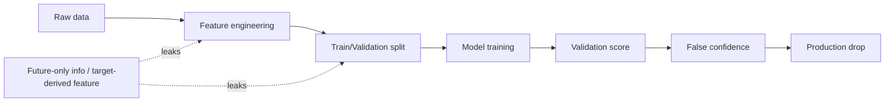

# Data Leakage in ML Systems

## What is leakage?
Data leakage is any use of information at training time that will not be available at inference time. It creates optimistic validation metrics and production failure.



## Why it is catastrophic
- Inflated offline metrics mislead roadmap decisions.
- Bad model reaches production and harms trust.
- Debugging takes weeks because the issue is in pipeline design, not model type.

## Leakage types

### 1. Target leakage
Feature directly or indirectly contains target signal.
- Example: using `actual_delivery_timestamp` to predict `delivery_delay`.
- Example: "claim_filed" feature when predicting delivery failure.

### 2. Train-test contamination
Preprocessing fitted on full data before split.
- StandardScaler fit on all rows.
- Imputer using global median across train+test.

### 3. Temporal leakage
Using future data for past predictions.
- Rolling mean that includes future days.
- Time series random split.

### 4. Group leakage
Same entity appears in both train/test in ways that transfer identity info.
- Same customer records in both splits when evaluating cold-start generalization.

## How leakage happens in real projects
- SQL joins using post-event tables.
- Window functions without time boundary filters.
- Cross-validation not grouped by entity/time.
- Feature store snapshot not point-in-time correct.

## Time-series leakage patterns
- `rolling_mean_7` computed with centered window (`center=True`).
- Backfilled missing target-related fields.
- Join weather final report published after event time.

## Leakage in cross-validation
- Standard KFold for temporal data.
- Stratified split across sessions from same user when wanting user-level generalization.

## Detection checklist
- Does every feature exist at decision time?
- Does model perform unrealistically well with little tuning?
- Does offline metric collapse online?
- Are top features suspiciously close to target semantics?

## Prevention strategies
1. Define prediction timestamp explicitly.
2. Define feature availability lag per source.
3. Enforce point-in-time joins.
4. Use sklearn `Pipeline` to avoid preprocessing leakage.
5. Use time-aware CV for temporal tasks.
6. Run "leakage ablation": remove suspicious features and compare.

## Leakage-safe pipeline pattern
```python
from sklearn.pipeline import Pipeline
from sklearn.compose import ColumnTransformer
from sklearn.preprocessing import OneHotEncoder, StandardScaler
from sklearn.impute import SimpleImputer
from sklearn.model_selection import TimeSeriesSplit, cross_val_score
from sklearn.ensemble import RandomForestClassifier

num_cols = ['weight', 'distance_km']
cat_cols = ['service_type', 'origin_zone']

preprocess = ColumnTransformer([
    ('num', Pipeline([
        ('imputer', SimpleImputer(strategy='median')),
        ('scaler', StandardScaler())
    ]), num_cols),
    ('cat', Pipeline([
        ('imputer', SimpleImputer(strategy='most_frequent')),
        ('ohe', OneHotEncoder(handle_unknown='ignore'))
    ]), cat_cols)
])

pipe = Pipeline([
    ('prep', preprocess),
    ('clf', RandomForestClassifier(n_estimators=300, random_state=42))
])

# Time-safe validation
cv = TimeSeriesSplit(n_splits=5)
```

## Leaky vs fixed example

### Leaky
```python
# WRONG: scaling before split
X_scaled = scaler.fit_transform(X)
X_train, X_test = X_scaled[:8000], X_scaled[8000:]
```

### Fixed
```python
# RIGHT: fit scaler only inside pipeline during CV/training
pipe.fit(X_train, y_train)
```

## Logistics case study: delivery ETA model

### Symptom
- Offline MAE = 2.1 hours.
- Production MAE = 9.4 hours.

### Root cause
Feature `last_scan_status` was taken from full shipment history, including events after prediction timestamp.

### Fix
- Rebuild training data with event-time cutoff.
- Recompute rolling features with strict past-only windows.
- Add data contract requiring availability timestamp for each feature.

## Interview questions
1. You got 99% accuracy and prod dropped to 65%. What happened?
2. How do you make joins point-in-time correct?
3. Why does random split fail for time series?
4. How can feature stores reduce leakage risk?

## Common pitfalls
- Treating leakage as only a modeling bug.
- No timestamp semantics in dataset schema.
- Using test data repeatedly for threshold tuning.
- Doing target encoding outside cross-validation folds.

## Senior answer template
- Define event time and prediction time.
- List available features at prediction time only.
- Use split strategy matching production rollout.
- Build pipeline that never fits transforms on evaluation data.
- Add monitoring for sudden train/serving distribution mismatch.
