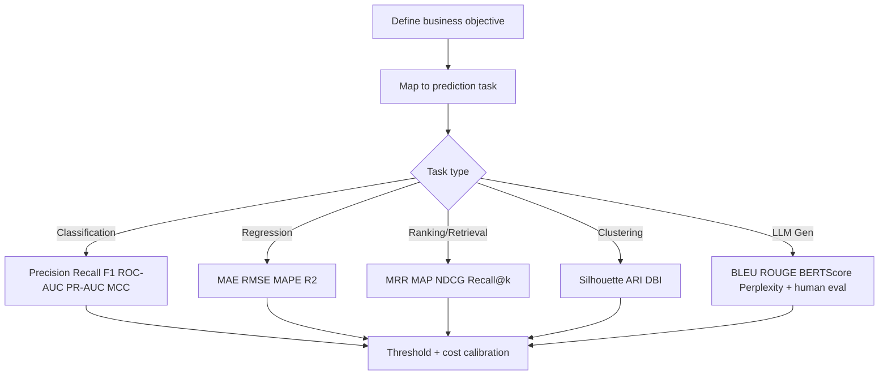
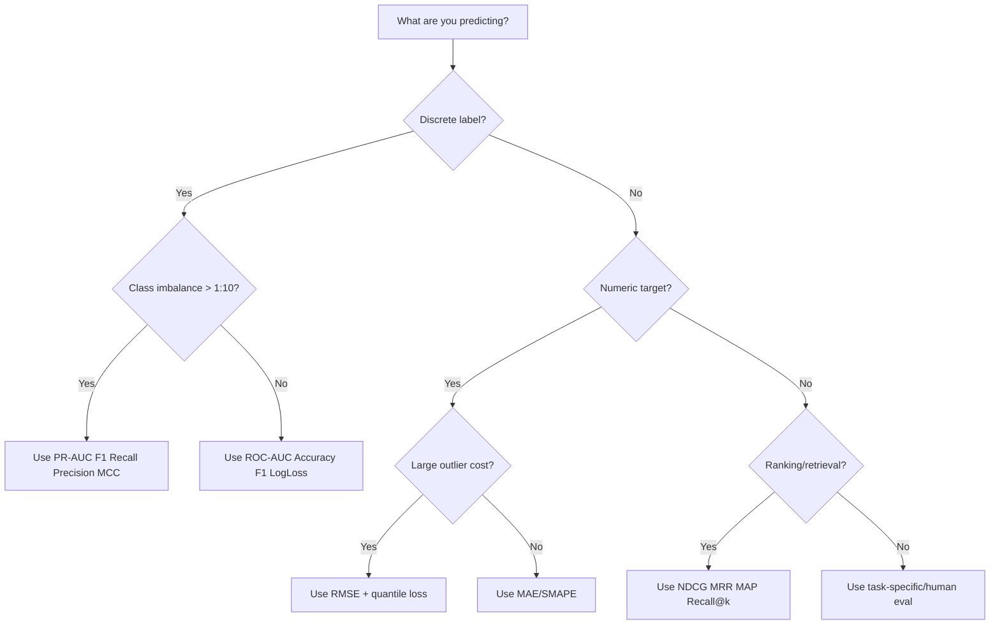

# Evaluation Metrics Taxonomy for ML and LLM Systems

## Why metrics matter
A model is only useful when its score aligns with business outcomes. A frequent interview failure is optimizing an easy metric (accuracy) while the business cares about asymmetric risk (missed fraud, delayed parcels, false alarms).



## Core taxonomy

| Family | Metrics | Best use | Major pitfall |
|---|---|---|---|
| Binary classification | Precision, Recall, F1, ROC-AUC, PR-AUC, MCC, LogLoss | risk scoring, failure prediction | threshold blindness |
| Multi-class | Macro/micro/weighted F1, top-k accuracy, log loss | route class, intent class | class imbalance hidden by micro metrics |
| Regression | MAE, MSE, RMSE, MAPE, SMAPE, R2, adjusted R2 | ETA, demand | MAPE breaks near zero |
| Ranking | MRR, MAP, NDCG, Recall@k | search, RAG retrieval | relevance labels required |
| Clustering | Silhouette, Davies-Bouldin, ARI, NMI | segmentation | internal metrics may not match utility |
| NLP/LLM | BLEU, ROUGE, BERTScore, perplexity, faithfulness | summarization, QA | lexical overlap != factual correctness |

## Classification metrics deep dive

### Confusion matrix

|  | Pred + | Pred - |
|---|---:|---:|
| Actual + | TP | FN |
| Actual - | FP | TN |

- Precision = `TP / (TP + FP)`
- Recall = `TP / (TP + FN)`
- Specificity = `TN / (TN + FP)`
- F1 = `2 * Precision * Recall / (Precision + Recall)`

### Why accuracy is misleading
If only 1% shipments fail, predicting "no failure" gets 99% accuracy and zero operational value.

### ROC-AUC vs PR-AUC
- ROC-AUC: robust when classes are balanced.
- PR-AUC: preferred for rare positive classes (fraud, failed delivery, anomalies).

### MCC (Matthews Correlation Coefficient)
Useful for severe imbalance; uses all confusion matrix cells.

## Multi-class averaging
- Macro: unweighted mean across classes (fair to minority classes).
- Micro: aggregate global TP/FP/FN (dominated by large classes).
- Weighted: weighted by class support.

## Regression metrics
- MAE: robust, interpretable in units.
- RMSE: penalizes large errors strongly.
- MAPE: `%` error, unstable when true values are near zero.
- R2: explained variance relative to baseline mean predictor.
- Adjusted R2: penalizes useless extra features.

## Ranking and retrieval metrics
- Recall@k: relevant doc appears in top-k.
- MRR: focuses on first relevant hit.
- MAP: average precision over relevant items.
- NDCG: gains discounted by rank, supports graded relevance.

## Clustering metrics
- Silhouette: cohesion vs separation.
- Davies-Bouldin: lower is better.
- ARI: external label-based agreement metric.

## LLM/NLP evaluation
- BLEU: precision-oriented n-gram overlap.
- ROUGE: recall-oriented overlap.
- BERTScore: semantic similarity via embeddings.
- Perplexity: language-model confidence on token sequence.

### Practical rule
For enterprise LLM apps, combine:
1. Task metric (e.g., exact field extraction).
2. Retrieval metric (Recall@k).
3. Faithfulness metric.
4. Human preference metric.
5. Business KPI (ticket deflection, SLA).

## Business vs ML metric disconnect
- ML team optimizes RMSE on ETA.
- Operations cares about "percent deliveries promised window met".
- Customer care cares about reduced escalations.

Always define a metric cascade:
1. Offline ML metric.
2. Online user metric.
3. Financial KPI.

## Metric choice decision tree



## Common pitfalls
- Tuning threshold on test set.
- Reporting only one metric.
- Ignoring calibration.
- Using ROC-AUC on extremely imbalanced data without PR-AUC.
- No confidence intervals.

## Interview questions
1. Why can a model with 99% accuracy still be useless?
2. PR-AUC vs ROC-AUC for rare events?
3. When is RMSE preferable to MAE?
4. Macro-F1 vs micro-F1 difference?
5. How do you evaluate an LLM support assistant end-to-end?

## Python: metrics from scratch and sklearn
```python
import numpy as np
from sklearn.metrics import (
    precision_score, recall_score, f1_score, roc_auc_score,
    average_precision_score, matthews_corrcoef, confusion_matrix,
    mean_absolute_error, mean_squared_error, r2_score
)

# Binary classification
y_true = np.array([1,0,1,0,1,0,0,1,0,0])
y_prob = np.array([0.9,0.2,0.8,0.1,0.4,0.3,0.2,0.7,0.05,0.6])
y_pred = (y_prob >= 0.5).astype(int)

print('confusion_matrix:', confusion_matrix(y_true, y_pred).tolist())
print('precision:', precision_score(y_true, y_pred))
print('recall:', recall_score(y_true, y_pred))
print('f1:', f1_score(y_true, y_pred))
print('roc_auc:', roc_auc_score(y_true, y_prob))
print('pr_auc:', average_precision_score(y_true, y_prob))
print('mcc:', matthews_corrcoef(y_true, y_pred))

# Regression
y = np.array([2.0, 3.0, 3.5, 5.2])
yhat = np.array([2.1, 2.8, 3.7, 4.9])
print('mae:', mean_absolute_error(y, yhat))
print('rmse:', mean_squared_error(y, yhat, squared=False))
print('r2:', r2_score(y, yhat))
```

## Logistics example
Use case: predict delayed delivery risk.
- Training metric: PR-AUC.
- Thresholded ops metric: Recall at fixed precision 0.8.
- Business metric: reduction in late deliveries and claim cost.

## When not to use each metric
- Accuracy: avoid with imbalance.
- MAPE: avoid near-zero actuals.
- BLEU alone: avoid for factual QA.
- Silhouette alone: avoid when cluster utility is unknown.

## Senior interview framing
A strong answer includes:
1. Metric aligned to decision cost.
2. Calibration/threshold plan.
3. Slice analysis (by region, carrier, product).
4. Online monitoring metric after launch.
