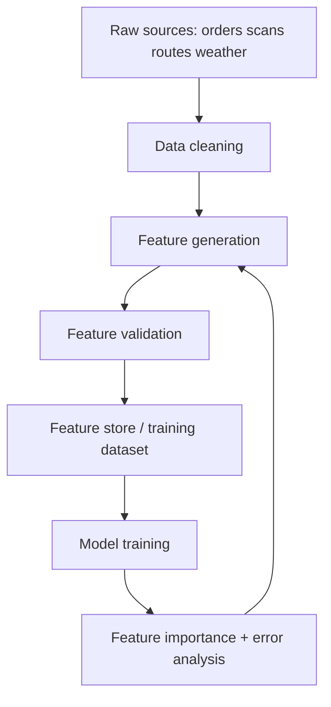

# Feature Engineering Fundamentals for Production ML

## Why feature engineering still matters in the LLM era
Even with deep models, feature quality determines reliability, sample efficiency, and interpretability. For logistics and operations, carefully designed temporal and operational features often outperform adding model complexity.



## Core principles
1. Reflect business process and constraints.
2. Encode time correctly.
3. Avoid leakage by construction.
4. Keep online/offline definitions identical.
5. Prefer stable features over brittle high-cardinality artifacts.

## Numerical features
- Standardization: `(x - mean)/std` for linear models, SVM, NN.
- Min-max normalization: `[0,1]`, useful for bounded features.
- Log transform: handles heavy right-skew (`log1p`).
- Robust scaling: median/IQR for outliers.

## Categorical encoding
- One-hot: safe baseline, can explode dimensionality.
- Ordinal: only for true ordered categories.
- Target encoding: powerful for high-cardinality; must be fold-safe.
- Hashing: constant memory, collision tradeoff.
- Embedding encoding: neural models, large cardinality.

## Date/time features for logistics
- `hour_of_day`, `day_of_week`, `week_of_year`, `is_holiday`.
- Cyclical encoding for periodic variables:
  - `sin(2*pi*hour/24)`
  - `cos(2*pi*hour/24)`
- Event proximity: days until major holiday.

## Text features (classical)
- Bag-of-words and n-grams.
- TF-IDF for sparse linear baselines.
- Character n-grams for noisy codes/IDs.

## Interaction features
- `distance_km * weather_risk` for delivery ETA.
- `carrier x service_type` interactions.
- Crossed categorical features for tree models may be unnecessary; trees learn interactions implicitly.

## Binning
- Equal-width / quantile bins.
- Useful for non-linearity in generalized linear models.
- Beware information loss when over-binning.

## Missing-value strategies
- Mean/median imputation for numeric.
- Most-frequent or constant token for categorical.
- Model-based imputation for complex missingness.
- Add missing-indicator flags when missingness is informative.

## Feature selection
- Filter methods: mutual information, ANOVA, correlation threshold.
- Wrapper methods: recursive feature elimination.
- Embedded methods: L1 regularization, tree-based importance.

## Importance and explainability
- Permutation importance: model-agnostic, robust.
- SHAP values: local + global explanations.
- Partial dependence / ICE for effect inspection.

## Automated feature engineering
- Featuretools and deep feature synthesis.
- AutoML feature transforms.
- In production, enforce governance: feature definition registry + tests.

## End-to-end sklearn example
```python
import pandas as pd
from sklearn.model_selection import train_test_split
from sklearn.compose import ColumnTransformer
from sklearn.pipeline import Pipeline
from sklearn.preprocessing import OneHotEncoder, StandardScaler, FunctionTransformer
from sklearn.impute import SimpleImputer
from sklearn.ensemble import GradientBoostingRegressor
from sklearn.metrics import mean_absolute_error
import numpy as np

# Example dataset
X = pd.DataFrame({
    'distance_km': [10, 120, 45, 8, 300, 17],
    'weight_kg': [1.2, 8.0, 3.4, 0.5, 15.0, 2.1],
    'service_type': ['express', 'economy', 'economy', 'express', 'freight', 'express'],
    'hour': [9, 14, 20, 8, 16, 7],
    'is_holiday': [0, 0, 1, 0, 1, 0]
})
y = np.array([6.5, 48.0, 22.0, 4.5, 72.0, 7.0])

# Feature transform helper
cyc = FunctionTransformer(
    lambda df: np.c_[np.sin(2*np.pi*df['hour']/24), np.cos(2*np.pi*df['hour']/24)],
    feature_names_out=lambda self, names: ['hour_sin', 'hour_cos']
)

num_cols = ['distance_km', 'weight_kg', 'is_holiday']
cat_cols = ['service_type']

preprocess = ColumnTransformer([
    ('num', Pipeline([
        ('impute', SimpleImputer(strategy='median')),
        ('scale', StandardScaler())
    ]), num_cols),
    ('cat', Pipeline([
        ('impute', SimpleImputer(strategy='most_frequent')),
        ('ohe', OneHotEncoder(handle_unknown='ignore'))
    ]), cat_cols),
    ('cyc_hour', cyc, ['hour'])
])

model = Pipeline([
    ('prep', preprocess),
    ('gbm', GradientBoostingRegressor(random_state=42))
])

X_train, X_test, y_train, y_test = train_test_split(X, y, test_size=0.33, random_state=42)
model.fit(X_train, y_train)
print('MAE:', mean_absolute_error(y_test, model.predict(X_test)))
```

## Comparison table: encoding choices

| Encoding | Works best for | Pros | Risks |
|---|---|---|---|
| One-hot | low/medium cardinality | simple, interpretable | sparse explosion |
| Target encoding | high-cardinality tabular | strong predictive power | leakage if not fold-safe |
| Hashing | very high cardinality | fixed dimensionality | collisions |
| Embeddings | deep learning pipelines | compact semantics | needs training data + tuning |

## When to use vs not use
- Use aggressive feature engineering for tabular ML and constrained compute.
- Use minimal handcrafted features when using end-to-end models with abundant data.
- Avoid adding features that cannot be served reliably online.

## Common pitfalls
- Different logic in training SQL vs serving code.
- Overfitting through fragile interactions.
- Encoding IDs that leak identity-specific outcomes.
- Ignoring data freshness and feature availability latency.

## Interview questions
1. Why can feature engineering beat larger models on tabular data?
2. How do you prevent leakage in target encoding?
3. How do you design time-based features for ETA prediction?
4. When would you choose embeddings over one-hot encoding?

## Logistics real-world examples
- Delay prediction: lagged depot congestion + weather + SLA type.
- Fraud risk: historical claim rate by merchant and route pair.
- Capacity planning: rolling 7/14/28-day parcel volume features.

## Production checklist
- Feature definition has owner and tests.
- Point-in-time correctness verified.
- Online/offline parity tests pass.
- Drift monitoring per top features.
- Backfill strategy documented.
