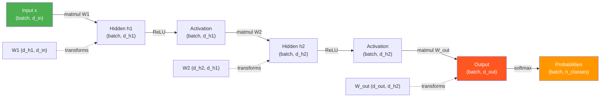
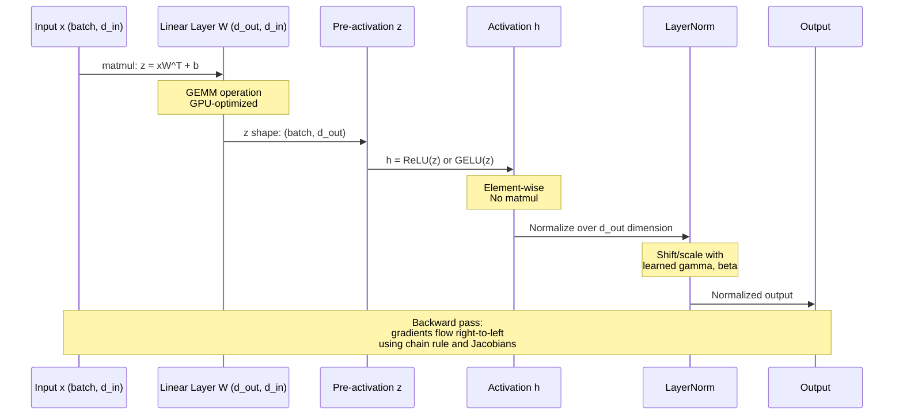

# Linear Algebra for Machine Learning

Linear algebra is not background knowledge for ML - it IS ML. Every forward pass through a neural network is a sequence of matrix multiplications and element-wise nonlinearities. Every gradient update is a vector operation in parameter space. Every dimensionality reduction is a projection onto a subspace. Understanding linear algebra at depth lets you reason about model behavior, not just apply it.

---

## 1. Vectors, Matrices, and Tensors in ML Context

### Vectors
A vector **v** ∈ ℝⁿ represents a point in n-dimensional space, or equivalently, a direction and magnitude.

In ML contexts:
- A training example with n features: **x** ∈ ℝⁿ
- A word embedding: **e** ∈ ℝᵈ (typically d = 128, 256, 768, 4096...)
- A probability distribution over classes: **p** ∈ ℝᶜ where sum = 1
- The gradient of a loss: **∇L** ∈ ℝⁿ (same space as parameters)
- A weight vector for linear regression: **w** ∈ ℝⁿ

**Column vector convention**: Unless stated otherwise, vectors are column vectors in mathematical notation, meaning **v** has shape (n, 1). NumPy defaults to 1D arrays (n,) which can cause subtle broadcasting bugs.

### Matrices
A matrix **A** ∈ ℝᵐˣⁿ represents a linear transformation from ℝⁿ to ℝᵐ.

In ML contexts:
- A weight matrix in a dense layer: **W** ∈ ℝᵈ_ᵒᵘₜ × ᵈ_ᵢₙ
- A dataset of m examples with n features: **X** ∈ ℝᵐˣⁿ
- An attention score matrix: **A** ∈ ℝˢᵉq_ˡᵉₙ × ˢᵉq_ˡᵉₙ
- A covariance matrix: **Σ** ∈ ℝⁿˣⁿ (always square, symmetric, positive semi-definite)
- An embedding table: **E** ∈ ℝ|vocab| × d

### Tensors
Tensors generalize matrices to arbitrary dimensions. In deep learning, "tensor" usually means a multi-dimensional array.

In ML contexts:
- Image: **(H, W, C)** - height, width, channels
- Batch of images: **(N, H, W, C)** or **(N, C, H, W)** (PyTorch default)
- Sequence of embeddings: **(batch, seq_len, d_model)** in transformer attention
- Conv filter: **(out_channels, in_channels, kH, kW)**
- Attention keys for all heads: **(batch, n_heads, seq_len, d_head)**

**Why shape tracking matters**: Mismatched dimensions are the most common bug in DL code. Developing the habit of tracking shapes mentally (or with comments) prevents hours of debugging.

---

## 2. Matrix Multiplication: The Core of Deep Learning

### What Matrix Multiplication Computes

Given **A** ∈ ℝᵐˣᵏ and **B** ∈ ℝᵏˣⁿ:

```
C = AB,  where C_{ij} = sum_{k} A_{ik} * B_{kj}
```

Each element C_{ij} is the **dot product** of row i of A with column j of B.

### Three Equivalent Interpretations

**Interpretation 1: Linear combination of columns**
```
AB = A * [b_1 | b_2 | ... | b_n]
       = [A*b_1 | A*b_2 | ... | A*b_n]
```
Each column of C is a linear combination of columns of A, weighted by the corresponding column of B.

**Interpretation 2: Sum of outer products**
```
AB = sum_{k} a_k * b_k^T
```
where a_k is column k of A and b_k is row k of B. This is the outer product view.

**Interpretation 3: Composition of linear transformations**
If A represents transformation f and B represents transformation g, then AB represents "first apply g, then apply f". This is why neural network layers compose: each weight matrix transforms the representation, and the composition of all layers is the network's overall function.

### Why It's the Core of Deep Learning

**Forward pass of a single dense layer:**
```
z = Wx + b
h = σ(z)
```
- W: (d_out, d_in) - weight matrix
- x: (d_in,) - input vector
- z: (d_out,) - pre-activation
- h: (d_out,) - activation

For a batch of N examples:
```
Z = XW^T + b    # (N, d_out) = (N, d_in) @ (d_in, d_out) + (d_out,)
H = σ(Z)
```

**Transformer attention (scaled dot-product):**
```
Attention(Q, K, V) = softmax(QK^T / sqrt(d_k)) * V
```
- QK^T: (seq, seq) - pairwise attention scores between all token positions
- V: (seq, d_v) - values to be aggregated
- Output: (seq, d_v) - weighted sum of values

**The GPU connection**: GPUs are optimized for matrix multiplication (GEMM - General Matrix Multiply). Modern ML is so dependent on matmul that hardware design follows ML algorithm design. This is why "can we express this as a matmul?" is a key question in efficient ML architecture design.



---

## 3. Eigenvalues and Eigenvectors

### Definition
For a square matrix **A** ∈ ℝⁿˣⁿ, a non-zero vector **v** is an eigenvector with eigenvalue λ if:

```
Av = λv
```

The matrix A transforms v by only scaling it (by λ), not rotating it. Eigenvectors define the "natural axes" of the transformation A.

### Computing Eigenvalues
The characteristic equation:
```
det(A - λI) = 0
```
Solving this polynomial in λ gives the eigenvalues. For a 2×2 matrix:
```
A = [[a, b], [c, d]]
det(A - λI) = (a-λ)(d-λ) - bc = 0
λ^2 - (a+d)λ + (ad-bc) = 0
```
Note: `a+d = trace(A)` and `ad-bc = det(A)`, so:
```
λ^2 - trace(A)*λ + det(A) = 0
```
This reveals: **sum of eigenvalues = trace(A)** and **product of eigenvalues = det(A)**.

### Eigendecomposition
For a diagonalizable matrix A:
```
A = Q Λ Q^{-1}
```
where Q is the matrix of eigenvectors (column-wise) and Λ = diag(λ_1, ..., λ_n).

For **symmetric** matrices (like covariance matrices): Q is orthogonal (Q^{-1} = Q^T):
```
A = Q Λ Q^T
```
This is the spectral theorem.

### Why This Matters for ML

**Principal Component Analysis (PCA)**: The eigenvectors of the covariance matrix **Σ** = (1/n) X^T X define the principal components. The corresponding eigenvalues tell you how much variance is explained by each direction. The top-k eigenvectors span the subspace of maximum variance.

**Understanding transformations**: Eigenvalues tell you if a matrix is:
- Positive definite: all λ > 0 (covariance matrices must satisfy this)
- Singular: at least one λ = 0 (not invertible, features are linearly dependent)
- Ill-conditioned: max(λ) / min(λ) >> 1 (numerically unstable)

**Condition number** = max eigenvalue / min eigenvalue of a matrix. High condition numbers cause gradient instability in poorly scaled features. This is why feature normalization helps optimization.

**Power method for top eigenvector**: Repeatedly apply A to a random vector and normalize. After many iterations, it converges to the eigenvector with the largest eigenvalue. This is the basis of algorithms like PageRank.

---

## 4. Singular Value Decomposition (SVD)

### Definition
Any matrix **A** ∈ ℝᵐˣⁿ (need not be square) can be decomposed as:
```
A = U Σ V^T
```
Where:
- **U** ∈ ℝᵐˣᵐ: left singular vectors (orthogonal matrix)
- **Σ** ∈ ℝᵐˣⁿ: singular values on diagonal (non-negative, sorted descending)
- **V** ∈ ℝⁿˣⁿ: right singular vectors (orthogonal matrix)

The singular values σ_1 ≥ σ_2 ≥ ... ≥ σ_min(m,n) ≥ 0 are related to eigenvalues:
```
σ_i = sqrt(eigenvalue_i of A^T A)
```
The left singular vectors are eigenvectors of AA^T; the right singular vectors are eigenvectors of A^T A.

### Truncated SVD (Low-Rank Approximation)

The best rank-k approximation to A (in Frobenius norm) is:
```
A_k = U_k Σ_k V_k^T = sum_{i=1}^{k} σ_i * u_i * v_i^T
```
where we keep only the top k singular values/vectors.

**Eckart-Young theorem**: No other rank-k matrix is closer to A in Frobenius norm. This means truncated SVD is the optimal lossy compression.

### Where SVD is Used in ML

| Application | How SVD is Used |
|-------------|-----------------|
| PCA | PCA of X is equivalent to truncated SVD of the centered data matrix |
| Matrix factorization for recommendations | Decompose user-item interaction matrix |
| Latent Semantic Analysis (LSA) | SVD of TF-IDF matrix to find latent topics |
| Low-rank adaptation (LoRA) | Fine-tune weight matrices using low-rank decomposition |
| Pseudoinverse | A⁺ = V Σ⁺ U^T, used in least squares |
| Dimensionality reduction | Keep top-k singular components |
| Noise reduction | Small singular values often correspond to noise |

**SVD and PCA Connection**:
If X is the **centered** data matrix (shape m×n), then:
```
X = U Σ V^T
```
The principal components are the columns of V (the right singular vectors).
The scores (projections) are U Σ.
The variance explained by component i is σᵢ² / (m-1).

**LoRA Connection**: Low-rank adaptation finetunes a pretrained weight matrix W by learning:
```
W_updated = W_pretrained + BA
```
where B ∈ ℝᵈˣʳ and A ∈ ℝʳˣᵈ with rank r << d. This is exactly the outer product form of a rank-r approximation - conceptually related to keeping only the top-r singular components from full finetuning.

### Numerical Stability
SVD is numerically stable even when the matrix is rank-deficient or nearly singular. It is preferred over direct matrix inversion for solving least squares problems. The condition number of A is σ_max / σ_min.

---

## 5. Norms: What They Mean for Regularization

A norm measures the "size" of a vector or matrix. Different norms measure size differently, leading to different geometric and optimization behaviors.

### Vector Norms

**L0 "norm"** (not a true norm): Number of non-zero elements.
```
||x||_0 = count(x_i != 0)
```
Directly measures sparsity, but non-convex and NP-hard to optimize.

**L1 norm** (Manhattan / Taxicab):
```
||x||_1 = sum_i |x_i|
```
The L1 ball (set of points with ||x||_1 ≤ 1) is a diamond/hyperoctahedron. Its corners lie on the coordinate axes. This geometry means that when you minimize a loss subject to ||w||_1 ≤ C, the optimal point tends to land on a corner of the L1 ball - meaning most weights are exactly zero. L1 regularization produces **sparse** solutions.

**L2 norm** (Euclidean):
```
||x||_2 = sqrt(sum_i x_i^2)
```
The L2 ball is a sphere. No corners, so the optimal point under L2 constraint is not forced to have zero components. L2 regularization produces **small but non-zero** weights - it shrinks all weights toward zero proportionally.

**L∞ norm** (Chebyshev / max norm):
```
||x||_inf = max_i |x_i|
```

**Regularization interpretation**:
- L2 regularization (weight decay): adds λ||w||₂² to loss → gradient penalty proportional to weight magnitude → all weights shrink toward 0
- L1 regularization (Lasso): adds λ||w||₁ to loss → subgradient is ±λ → weights below threshold go to exactly 0
- Elastic net: combines both L1 + L2

### Matrix Norms

**Frobenius norm** (most common in DL):
```
||A||_F = sqrt(sum_{ij} a_{ij}^2) = sqrt(trace(A^T A)) = sqrt(sum_i sigma_i^2)
```
It is the L2 norm of the vectorized matrix. Weight decay in neural networks penalizes the Frobenius norm of weight matrices.

**Spectral norm** (L2 operator norm):
```
||A||_2 = sigma_max(A)   (largest singular value)
```
Spectral normalization constrains ||W||_2 = 1, which controls the Lipschitz constant of the layer and stabilizes GAN training. The Lipschitz constant of a function bounds how much the output changes relative to input change.

**Nuclear norm** (trace norm):
```
||A||_* = sum_i sigma_i
```
The nuclear norm is the convex relaxation of the rank function. Minimizing nuclear norm encourages low-rank solutions (useful for matrix completion).

### Geometric Intuition for L1 vs L2 Regularization

```
L1 Ball (2D):           L2 Ball (2D):
      *                       *
    *   *                  *     *
  *       *              *         *
  *   [0] *              *   [0]   *
  *       *              *         *
    *   *                  *     *
      *                       *

Diamond shape             Circle shape
Corners at (±1, 0)        Smooth, no corners
and (0, ±1)

When optimization         When optimization
touches a corner,         touches the ball,
one coordinate = 0        no coordinate = 0
→ sparse solution         → dense small weights
```

---

## 6. Dot Products and Cosine Similarity

### Dot Product
```
u · v = sum_i u_i * v_i = ||u||_2 * ||v||_2 * cos(theta)
```
where theta is the angle between vectors.

The dot product measures the "alignment" of two vectors weighted by their magnitudes.

**In attention mechanisms**: The dot product QK^T scores how much each query attends to each key. High dot product = high similarity = high attention weight after softmax.

**In neural networks**: Each neuron computes w · x + b, which is the dot product of the weight vector with the input. The neuron activates when the input aligns with its weight vector.

### Cosine Similarity
```
cosine_sim(u, v) = (u · v) / (||u||_2 * ||v||_2) = cos(theta)
```
Ranges from -1 (opposite) to 0 (orthogonal) to 1 (identical direction).

**Key property**: Cosine similarity is **invariant to magnitude** - it measures only directional alignment.

**When to use cosine vs dot product**:
| Metric | Use When | Example |
|--------|----------|---------|
| Cosine similarity | Embeddings may have varying magnitudes; care about direction only | Document similarity, word embeddings |
| Dot product | Magnitude carries information; in normalized embedding spaces | Recommendation systems, attention (after L2 normalization, dot = cosine) |
| L2 distance | Want neighborhood-based similarity, metric space properties | k-NN, clustering |

**In vector databases**: Most embedding models (BERT, OpenAI text-embedding) are trained to maximize cosine similarity between semantically similar texts. Approximate nearest neighbor (ANN) search uses cosine or dot product depending on whether embeddings are normalized.

**Relationship to L2 distance**:
```
||u - v||_2^2 = ||u||^2 + ||v||^2 - 2(u · v)
```
If u and v are L2-normalized (||u|| = ||v|| = 1):
```
||u - v||_2^2 = 2 - 2 * cosine_sim(u, v)
```
So L2 distance is monotonically related to cosine similarity when vectors are normalized. ANN search with L2 distance on normalized vectors is equivalent to cosine similarity search.

---

## 7. Jacobian and Hessian for Optimization

### Jacobian
For a vector-valued function **f**: ℝⁿ → ℝᵐ, the Jacobian **J** ∈ ℝᵐˣⁿ is:
```
J_{ij} = ∂f_i / ∂x_j
```
The Jacobian generalizes the gradient to vector-valued functions.

**In backpropagation**: Each layer has a Jacobian. The chain rule for backprop is matrix multiplication of Jacobians:
```
∂L/∂x = (∂h/∂x)^T * (∂L/∂h) = J^T * delta
```
where J is the Jacobian of h with respect to x.

**Jacobian of softmax**: For softmax output p from logit vector z:
```
∂p_i/∂z_j = p_i * (delta_{ij} - p_j)
```
where delta_{ij} = 1 if i=j, else 0. This simplifies nicely when combined with cross-entropy loss:
```
∂L/∂z_i = p_i - y_i   (for one-hot label y)
```
This is why softmax + cross-entropy is so clean - the Jacobian of the combined loss is just (predicted - true).

### Hessian
For a scalar function L: ℝⁿ → ℝ, the Hessian **H** ∈ ℝⁿˣⁿ is:
```
H_{ij} = ∂²L / (∂θ_i ∂θ_j)
```
The Hessian is the matrix of second derivatives. It describes the curvature of the loss landscape.

**Interpretations of the Hessian**:
- If H is positive definite at a critical point (all eigenvalues > 0): local minimum
- If H is negative definite: local maximum
- If H has mixed sign eigenvalues: saddle point
- H = 0 or near-singular: flat region (degenerate critical point)

**Why Hessian is hard to use in DL**:
- For a model with n parameters, H has n² entries
- For GPT-3 (175B parameters), H would have 3×10²² entries - impossible to store
- Computing H requires n backward passes (one per parameter)
- Even approximate Hessian (K-FAC, Shampoo) is expensive

**Where Hessian information helps**:
- Identifying sharp vs flat minima (sharp minima generalize poorly)
- Natural gradient descent (Fisher information matrix ≈ expected Hessian)
- Second-order optimization for small models
- Influence functions (how much does removing training example i affect prediction j?)

### Gradient Computation
For scalar L(θ), the gradient:
```
∇_θ L = [∂L/∂θ_1, ∂L/∂θ_2, ..., ∂L/∂θ_n]^T
```
The gradient points in the direction of steepest ascent. We move in the negative gradient direction for minimization.

**Automatic differentiation**: Modern DL frameworks (PyTorch, JAX) compute gradients via reverse-mode autodiff, which computes all partial derivatives with a single backward pass. This is why training is roughly 2-3× the cost of a forward pass.

---

## 8. Matrix Factorization

Matrix factorization decomposes a matrix into a product of smaller matrices, each with a specific structure or interpretation.

### Collaborative Filtering (Recommendation Systems)
Decompose the user-item rating matrix R ∈ ℝᵘˣⁱ into:
```
R ≈ P * Q^T    where P ∈ ℝᵘˣᵏ, Q ∈ ℝⁱˣᵏ
```
- P: user latent factor matrix (each row is a user embedding)
- Q: item latent factor matrix (each row is an item embedding)
- k: latent dimension (hyperparameter, typically 16-512)

The predicted rating for user u on item i is:
```
r_hat_{ui} = p_u · q_i = sum_k p_{uk} * q_{ik}
```

Training minimizes:
```
L = sum_{(u,i) observed} (r_{ui} - p_u · q_i)^2 + lambda * (||P||_F^2 + ||Q||_F^2)
```

Modern recommendation systems use neural collaborative filtering and two-tower models instead of pure matrix factorization, but the latent factor concept remains central.

### Non-Negative Matrix Factorization (NMF)
For non-negative data A ∈ ℝ≥0^{m×n}:
```
A ≈ W * H    where W ∈ ℝ≥0^{m×k}, H ∈ ℝ≥0^{k×n}
```
Non-negativity constraint produces **parts-based representations** (e.g., face features, topic word loadings). Useful for interpretability.

### LU Decomposition
```
A = L * U    where L is lower triangular, U is upper triangular
```
Used for solving linear systems efficiently. Computing A⁻¹ b via LU is more stable than direct inversion.

### QR Decomposition
```
A = Q * R    where Q is orthogonal, R is upper triangular
```
Used for least squares problems and computing eigenvalues.

---

## 9. Matrix Operations in Neural Network Forward Pass



---

## 10. Code: NumPy Examples

```python
import numpy as np
from numpy.linalg import eig, svd, norm

np.random.seed(42)

# ============================================================
# 1. Basic Matrix Operations
# ============================================================
A = np.array([[1, 2, 3], [4, 5, 6], [7, 8, 9]], dtype=float)
B = np.random.randn(3, 4)

# Matrix multiplication
C = A @ B          # Preferred: uses BLAS routines
C2 = np.matmul(A, B)  # Equivalent

print(f"A shape: {A.shape}, B shape: {B.shape}, C shape: {C.shape}")

# Transpose
print(f"A.T:\n{A.T}")

# Trace and determinant
print(f"trace(A) = {np.trace(A):.2f}")  # sum of diagonal = 1+5+9 = 15
print(f"det(A) = {np.linalg.det(A):.4f}")  # = 0 (rank-deficient)

# ============================================================
# 2. Norms
# ============================================================
v = np.array([3.0, 4.0])
print(f"\nVector v = {v}")
print(f"L1 norm: {norm(v, 1):.2f}")   # 7.0
print(f"L2 norm: {norm(v, 2):.2f}")   # 5.0 (Pythagorean theorem)
print(f"Linf norm: {norm(v, np.inf):.2f}")  # 4.0

M = np.array([[1, 2], [3, 4]], dtype=float)
print(f"\nMatrix M:\n{M}")
print(f"Frobenius norm: {norm(M, 'fro'):.4f}")  # sqrt(1+4+9+16) = sqrt(30)
print(f"Spectral norm: {norm(M, 2):.4f}")  # largest singular value

# ============================================================
# 3. Eigendecomposition
# ============================================================
# Create a symmetric positive definite matrix (like a covariance matrix)
X = np.random.randn(100, 5)
cov = X.T @ X / 99  # Sample covariance matrix

eigenvalues, eigenvectors = np.linalg.eigh(cov)  # eigh for symmetric matrices
# Note: eigh returns eigenvalues in ascending order; eig is for general matrices

print(f"\nCovariance matrix eigenvalues: {eigenvalues}")
print(f"Sum of eigenvalues = trace: {eigenvalues.sum():.4f} vs {np.trace(cov):.4f}")
print(f"Eigenvectors are orthonormal: V^T V =\n{eigenvectors.T @ eigenvectors}")

# Reconstruct the matrix
reconstructed = eigenvectors @ np.diag(eigenvalues) @ eigenvectors.T
print(f"\nReconstruction error: {norm(cov - reconstructed):.2e}")

# ============================================================
# 4. SVD
# ============================================================
# Create a rectangular matrix (like a user-item rating matrix)
ratings = np.random.randn(50, 20)  # 50 users, 20 items

# Full SVD
U, sigma, Vt = np.linalg.svd(ratings, full_matrices=True)
print(f"\nSVD shapes: U={U.shape}, sigma={sigma.shape}, Vt={Vt.shape}")
print(f"Singular values (first 5): {sigma[:5]}")

# Low-rank approximation (keep top k components)
k = 5
U_k = U[:, :k]          # (50, 5) - left singular vectors
sigma_k = sigma[:k]      # (5,)    - top singular values
Vt_k = Vt[:k, :]        # (5, 20) - right singular vectors

ratings_approx = U_k @ np.diag(sigma_k) @ Vt_k
reconstruction_error = norm(ratings - ratings_approx, 'fro') / norm(ratings, 'fro')
variance_explained = (sigma_k**2).sum() / (sigma**2).sum()
print(f"\nRank-{k} approximation:")
print(f"  Relative reconstruction error: {reconstruction_error:.4f}")
print(f"  Variance explained: {variance_explained:.4f}")

# ============================================================
# 5. PCA via SVD (the correct way)
# ============================================================
def pca_via_svd(X, n_components):
    """PCA implemented using SVD."""
    # Center the data
    X_centered = X - X.mean(axis=0)

    # SVD of centered data matrix
    U, sigma, Vt = np.linalg.svd(X_centered, full_matrices=False)

    # Principal components are rows of Vt (right singular vectors)
    components = Vt[:n_components]  # (n_components, n_features)

    # Projections (scores)
    scores = U[:, :n_components] * sigma[:n_components]  # (n_samples, n_components)

    # Variance explained
    explained_variance = sigma**2 / (len(X) - 1)
    explained_variance_ratio = explained_variance / explained_variance.sum()

    return scores, components, explained_variance_ratio

X_data = np.random.randn(200, 10)
scores, components, var_ratios = pca_via_svd(X_data, n_components=3)
print(f"\nPCA via SVD:")
print(f"  Scores shape: {scores.shape}")
print(f"  Components shape: {components.shape}")
print(f"  Variance explained by top 3 components: {var_ratios[:3].sum():.4f}")

# ============================================================
# 6. Cosine Similarity
# ============================================================
def cosine_similarity(u, v):
    return np.dot(u, v) / (norm(u) * norm(v))

def cosine_similarity_matrix(A, B):
    """Compute cosine similarity between all pairs of rows."""
    A_norm = A / norm(A, axis=1, keepdims=True)
    B_norm = B / norm(B, axis=1, keepdims=True)
    return A_norm @ B_norm.T

# Simulate embedding similarity
query = np.random.randn(768)       # One query embedding
docs = np.random.randn(1000, 768)  # 1000 document embeddings

similarities = cosine_similarity_matrix(query.reshape(1, -1), docs)[0]
top_k_idx = np.argsort(similarities)[-5:][::-1]
print(f"\nTop 5 most similar documents (indices): {top_k_idx}")
print(f"Their similarities: {similarities[top_k_idx]}")

# ============================================================
# 7. Gradient of Simple Loss (manual computation)
# ============================================================
def mse_loss_and_gradient(X, y, w):
    """MSE loss and gradient for linear regression."""
    y_pred = X @ w
    residuals = y_pred - y
    loss = 0.5 * np.mean(residuals**2)
    gradient = X.T @ residuals / len(y)  # (n_features,)
    return loss, gradient

# Simulate data
n_samples, n_features = 100, 5
X_lr = np.random.randn(n_samples, n_features)
w_true = np.array([1.0, -2.0, 0.5, 0.0, 3.0])
y_lr = X_lr @ w_true + 0.1 * np.random.randn(n_samples)

w_init = np.zeros(n_features)
loss, grad = mse_loss_and_gradient(X_lr, y_lr, w_init)
print(f"\nLinear regression:")
print(f"  Initial loss: {loss:.4f}")
print(f"  Gradient: {grad}")
print(f"  True weights: {w_true}")

# Verify with numerical gradient
def numerical_gradient(f, x, eps=1e-5):
    grad = np.zeros_like(x)
    for i in range(len(x)):
        x_plus = x.copy(); x_plus[i] += eps
        x_minus = x.copy(); x_minus[i] -= eps
        grad[i] = (f(x_plus) - f(x_minus)) / (2 * eps)
    return grad

loss_fn = lambda w: mse_loss_and_gradient(X_lr, y_lr, w)[0]
numerical_grad = numerical_gradient(loss_fn, w_init)
print(f"  Numerical gradient: {numerical_grad}")
print(f"  Max gradient error: {np.abs(grad - numerical_grad).max():.2e}")
```

---

## 11. Interview Questions and Answers

### Q1: What is SVD and where is it used in ML?

**Answer**: SVD decomposes any matrix A into A = UΣV^T where U and V are orthogonal matrices (containing left and right singular vectors) and Σ is a diagonal matrix of non-negative singular values in decreasing order.

In ML, SVD appears in:
1. **PCA**: The right singular vectors of the centered data matrix are the principal components. SVD is numerically more stable for PCA than eigendecomposition of the covariance matrix.
2. **Collaborative filtering**: We factor the user-item matrix to get latent user and item representations.
3. **Latent Semantic Analysis**: SVD of TF-IDF matrices finds latent topics.
4. **LoRA**: Low-rank adaptation initializes the weight update matrices using ideas from low-rank approximation - we represent ΔW = BA where B and A are low-rank factors.
5. **Model compression**: Low-rank approximation of weight matrices reduces parameters.
6. **Pseudoinverse**: A⁺ = VΣ⁺U^T, used in solving over/under-determined systems.

The key property is the Eckart-Young theorem: the truncated SVD gives the **optimal** low-rank approximation in Frobenius norm. This justifies using it for compression and dimensionality reduction.

---

### Q2: Why is matrix multiplication so fundamental to deep learning?

**Answer**: Matrix multiplication is the core computational primitive of deep learning for several interconnected reasons:

1. **Linear transformations**: Any linear transformation between vector spaces is a matrix multiplication. Neural networks stack linear transformations (matmul) with nonlinearities. The expressive power comes from composition, not from individual matmuls.

2. **Parallelism**: Matmul is embarrassingly parallelizable across elements of the output matrix. This maps perfectly to GPU architecture where thousands of cores execute simultaneously.

3. **Hardware optimization**: The GEMM (General Matrix Multiply) kernel is the most heavily optimized routine in computing history. NVIDIA GPUs, Google TPUs, and inference chips are all designed around this operation.

4. **Batch processing**: Computing predictions for N examples simultaneously is just matmul: output = input @ W^T where input has shape (N, d_in).

5. **Attention mechanism**: Scaled dot-product attention is: softmax(QK^T / sqrt(d_k)) @ V - three matrix multiplications. The entire transformer is built on this.

6. **Gradient computation**: The gradient of a matmul is itself a matmul, so backpropagation through linear layers is efficient.

---

### Q3: What does the trace of a matrix tell us?

**Answer**: The trace of a square matrix A (sum of diagonal elements) has several important properties:

1. **Sum of eigenvalues**: trace(A) = Σᵢ λᵢ. This lets you compute the total "scale" of a transformation without computing individual eigenvalues.

2. **Variance in PCA**: trace(Σ) = total variance in the data. The fraction explained by principal components is Σᵢ₌₁ᵏ λᵢ / trace(Σ).

3. **Frobenius norm of matrix square**: ||A||_F² = trace(A^T A) = Σᵢ σᵢ² (sum of squared singular values).

4. **Gradient of log det**: d/dA log|det(A)| = A^{-T}. The trace appears in natural gradient computations.

5. **Invariance under cyclic permutation**: trace(ABC) = trace(CAB) = trace(BCA). Useful for simplifying matrix derivatives.

6. **In neural tangent kernel theory**: The trace of the NTK matrix relates to the learning speed of a neural network in the infinite-width limit.

---

### Q4: How do you compute the gradient of a matrix operation?

**Answer**: Using the matrix calculus rules. For the most common case, the loss L with respect to weight matrix W in a linear layer z = Wx:

```
∂L/∂W = ∂L/∂z * x^T
```
where ∂L/∂z is the upstream gradient (shape: d_out,), and x is the layer input (shape: d_in,), giving a (d_out, d_in) gradient matrix matching the shape of W.

For a batch: if Z = XW^T (shapes: (N, d_out) = (N, d_in) @ (d_in, d_out)^T):
```
∂L/∂W = (∂L/∂Z)^T @ X
∂L/∂X = ∂L/∂Z @ W
```

The key principle: **shape of gradient = shape of parameter**. Always check that your gradient computation gives the right shape.

---

### Q5: What's the relationship between eigenvectors of AA^T and A^TA?

**Answer**: This is the connection between SVD and eigendecomposition.

If A = UΣV^T (SVD), then:
- AA^T = UΣV^T VΣU^T = UΣ²U^T → left singular vectors U are eigenvectors of AA^T with eigenvalues σᵢ²
- A^TA = VΣU^T UΣV^T = VΣ²V^T → right singular vectors V are eigenvectors of A^TA with eigenvalues σᵢ²

In PCA: if A is the centered data matrix (m samples × n features):
- Eigenvectors of A^TA (n×n) = principal component directions (directions in feature space)
- Eigenvectors of AA^T (m×m) = principal scores (directions in sample space)

When m << n (few samples, many features - common in genomics): it's cheaper to compute eigenvectors of the m×m matrix AA^T and convert, rather than directly decomposing the n×n matrix A^TA.

---

### Q6: Explain L1 vs L2 regularization geometrically. Why does L1 produce sparse solutions?

**Answer**: Regularization adds a constraint that the solution must lie within a ball of the norm. The loss surface and the norm ball intersect, and the optimal point is where the loss contours first touch the ball.

**L2 (Ridge)**: The constraint is ||w||₂ ≤ t, which defines a **sphere**. The sphere has no corners - it is smooth everywhere. The loss contours (ellipses for quadratic losses) touch the sphere tangentially, and the tangent point is generally not on any coordinate axis. So no weights go to exactly zero.

**L1 (Lasso)**: The constraint is ||w||₁ ≤ t, which defines a **diamond** (hyperoctahedron in higher dimensions). The diamond has **corners** at points where all but one coordinate is zero. Loss contours are much more likely to first touch the L1 ball at a corner, because corners are "pointy" - the ball protrudes toward the axes. At a corner, all weights except one are exactly zero → **sparsity**.

This has practical implications:
- Use L1 when you believe few features are relevant (automatic feature selection)
- Use L2 when you believe all features matter but want to prevent extreme weights (more common in DL as weight decay)
- Elastic net combines both for datasets with correlated features

---

## 12. Common Interview Mistakes

1. **Confusing matrix multiplication order**: AB ≠ BA (matrix multiplication is not commutative). Always check shapes and intended transformation direction.

2. **Forgetting that SVD works for non-square matrices but eigendecomposition requires square matrices**: A common error is trying to find eigenvalues of a rectangular matrix.

3. **Confusing L1 and L2 regularization effects**: L1 → sparsity, L2 → small weights. Mixing these up in an interview suggests surface-level knowledge.

4. **Not knowing that the condition number affects optimization**: High condition number means gradient descent zigzags in narrow valleys. This is why feature scaling (which reduces condition number of the feature matrix) helps gradient descent converge faster.

5. **Saying PCA is just eigendecomposition**: Correct PCA uses SVD of the centered data matrix, which is numerically more stable than eigendecomposition of the empirical covariance matrix, especially when n_features >> n_samples.

6. **Not knowing gradient shapes**: In interviews, be prepared to give the shape of gradients with respect to any layer's weights. ∂L/∂W always has the same shape as W.
