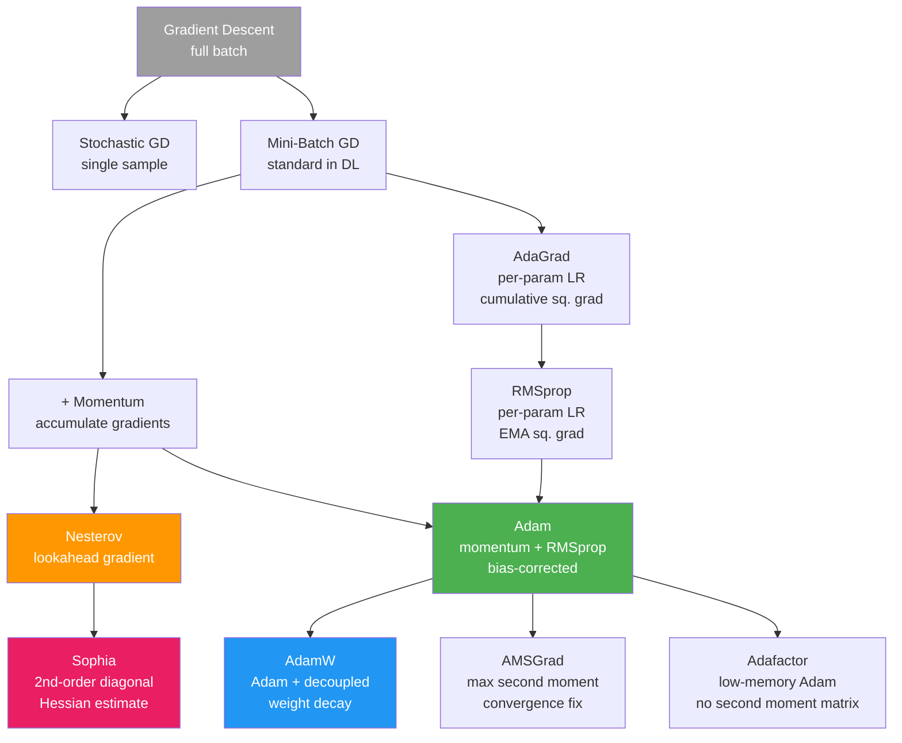

# Optimization for Machine Learning

Training a machine learning model is an optimization problem: find parameters θ that minimize a loss function L(θ) over the training data. The theory and practice of optimization determines whether training converges, how fast it converges, and whether the final solution generalizes. This section covers the mathematical foundations and practical algorithms that every ML engineer must understand.

---

## 1. Gradient Descent: Derivation and Intuition

### The Problem Setup

We want to find:
```
theta* = argmin_theta L(theta)
```

where L: ℝⁿ → ℝ is the loss function over model parameters θ ∈ ℝⁿ.

For most deep learning losses, there is no closed-form solution. We use iterative optimization.

### Taylor Series Foundation

The first-order Taylor expansion of L around current parameters θ_t:
```
L(theta_t + d) ≈ L(theta_t) + gradient(L, theta_t)^T * d
```

We want to choose direction d to decrease L. The dot product gradient^T * d is most negative when d = -gradient (opposite to gradient direction). Adding a step size constraint ||d|| ≤ ε:

The steepest descent direction is:
```
d* = -eta * gradient(L, theta_t)
```
where η (eta) is the learning rate (step size).

### Gradient Descent Update Rule

```
theta_{t+1} = theta_t - eta * gradient(L, theta_t)
```

**Intuition**: The gradient ∇L points uphill (direction of steepest increase). Moving in the negative gradient direction moves downhill. Repeat until convergence (gradient ≈ 0).

**Convergence criterion**: ||∇L(θ_t)|| < ε for some tolerance ε > 0.

### Batch (Full) Gradient Descent

```
gradient = (1/n) * sum_{i=1}^{n} gradient(L_i, theta)    [average over ALL examples]
theta ← theta - eta * gradient
```

**Pros**: Exact gradient (no noise), guaranteed convergence for convex problems
**Cons**: Requires a full pass over data for each update - impractical for n = millions

### Stochastic Gradient Descent (SGD)

```
for each example (x_i, y_i):
    gradient_i = gradient(L(x_i, y_i, theta))
    theta ← theta - eta * gradient_i    [update on single example]
```

**Pros**: Fast updates, can escape local minima due to noise, online learning (stream data)
**Cons**: Very noisy gradient estimates, may not converge to exact minimum

**Why the noise helps**: SGD noise acts as implicit regularization. Models trained with SGD often generalize better than those trained with full-batch gradient descent, possibly because SGD noise helps find flatter minima (which tend to generalize better).

### Mini-Batch Gradient Descent (The Standard)

```
for each mini-batch B of size b:
    gradient_B = (1/b) * sum_{i in B} gradient(L_i, theta)
    theta ← theta - eta * gradient_B
```

**Batch sizes in practice**: 32, 64, 128, 256 for general DL; 2048-8192+ for large-scale pretraining.

**Why mini-batch is preferred**:
1. Efficient GPU utilization: batches fill tensor cores optimally
2. Variance reduction vs SGD while remaining faster than full-batch
3. Parallelizable: each batch gradient can be computed in parallel across GPUs
4. Stability: smoother training than pure SGD

**Gradient variance**: Var[gradient_B] = Var[gradient_single] / b. Doubling batch size halves gradient variance.

---

## 2. Learning Rate Effects

The learning rate η is the single most important hyperparameter in optimization.

### Too High Learning Rate
- Gradient updates overshoot minima
- Loss oscillates or diverges
- At extreme values, loss goes to NaN
- Common symptom: loss decreases initially then spikes

### Too Low Learning Rate
- Training takes too long to converge
- Can get stuck in bad local minima or plateaus
- May never reach satisfactory performance in budget

### Just Right
- Loss decreases smoothly
- Validation loss decreases then plateaus
- Training reaches good performance in reasonable time

### The Learning Rate and Convergence Rate

For convex L with Lipschitz gradient (||∇L(x) - ∇L(y)|| ≤ L||x-y||), gradient descent with η ≤ 1/L converges at rate:
```
L(theta_T) - L(theta*) ≤ L * ||theta_0 - theta*||^2 / (2T)
```

This is O(1/T) convergence - sublinear. For strongly convex functions (μ-strongly convex), convergence is linear (geometric):
```
||theta_T - theta*||^2 ≤ (1 - eta*mu)^T * ||theta_0 - theta*||^2
```

The condition number κ = L/μ (Lipschitz constant / strong convexity constant) determines how sensitive convergence is to the learning rate. High κ → ill-conditioned → slow convergence → need adaptive methods.

---

## 3. Convex vs Non-Convex Optimization

### Convexity

A function L is **convex** if for all θ_1, θ_2 and α ∈ [0,1]:
```
L(alpha * theta_1 + (1-alpha) * theta_2) ≤ alpha * L(theta_1) + (1-alpha) * L(theta_2)
```

Geometrically: the line segment between any two points on the graph lies above the graph.

**Equivalent conditions for twice-differentiable functions**:
- L is convex ↔ Hessian is positive semi-definite everywhere
- L is strongly convex ↔ Hessian eigenvalues ≥ μ > 0 everywhere

**Convex ML losses**:
- MSE for linear regression
- Binary cross-entropy for logistic regression
- Hinge loss for linear SVM
- L1 and L2 regularization terms

**Key property of convex functions**: Any local minimum is a global minimum. Gradient descent converges to the global optimum (with appropriate learning rate).

### Non-Convexity in Deep Learning

Neural network loss landscapes are **highly non-convex**: they have many local minima, saddle points, and flat regions.

**Why training still works**:
1. **Local minima are often good**: Empirically, local minima in overparameterized networks have similar loss values. The "bad" local minima hypothesis has mostly been disproven for sufficiently wide networks.
2. **Saddle points are the real concern**: Gradient descent can slow down near saddle points (where gradient ≈ 0 but not a minimum). Noise from SGD helps escape saddle points.
3. **Overparameterization helps**: With more parameters than data points, the loss landscape has vastly more flat directions, and most critical points are not isolated local minima but extended flat regions.
4. **Implicit bias**: SGD has an implicit bias toward solutions in certain regions of the loss landscape that tend to generalize well.

### Local Minima vs Saddle Points

At a critical point (∇L = 0):
- **Local minimum**: Hessian is positive definite (all eigenvalues > 0)
- **Local maximum**: Hessian is negative definite (all eigenvalues < 0)
- **Saddle point**: Hessian has both positive and negative eigenvalues (most common in high dimensions)

In high dimensions, the probability that all Hessian eigenvalues have the same sign decreases exponentially with dimension. **Most critical points in high-dimensional loss landscapes are saddle points, not local minima**.

Saddle points are problematic because gradients are small there → slow training. Random noise in SGD perturbs the optimizer away from saddle points.

---

## 4. Momentum-Based Methods

### Momentum (Heavy Ball)

Gradient descent is like a ball rolling downhill but stopping when gradient = 0. Adding **momentum** is like giving the ball inertia - it keeps rolling even when the local gradient is small.

```
v_t = beta * v_{t-1} + (1 - beta) * gradient_t   [velocity/momentum]
theta_t = theta_{t-1} - eta * v_t
```

Or equivalently (classical form):
```
v_t = beta * v_{t-1} + gradient_t
theta_t = theta_{t-1} - eta * v_t
```

Typical: β = 0.9 (momentum coefficient).

**Why momentum helps**:
1. **Dampens oscillations**: In directions perpendicular to the optimal path (where gradients cancel), momentum averages out. In the consistent direction, gradients accumulate.
2. **Accelerates convergence**: For convex quadratics, momentum achieves O(1/T²) convergence vs O(1/T) for GD without momentum.
3. **Escapes saddle points**: Accumulated momentum carries the optimizer through regions of near-zero gradient.

**Intuition with exponential average**: v_t ≈ (1/(1-β)) × (average of recent gradients). With β=0.9, v_t is an exponential moving average of the last ~10 gradients. This smooths the trajectory.

### Nesterov Momentum (NAG)

Nesterov accelerated gradient computes the gradient at the *lookahead* position:
```
theta_lookahead = theta_t + beta * v_t           [look ahead]
gradient_nag = gradient(L, theta_lookahead)       [gradient at lookahead]
v_{t+1} = beta * v_t - eta * gradient_nag
theta_{t+1} = theta_t + v_{t+1}
```

**Why Nesterov is better**: Standard momentum computes gradient at θ_t and then overshoots. Nesterov first overshoots (by β × v_t), then computes gradient, allowing correction. It is more "predictive" - it anticipates where momentum will take it and corrects from there.

**Convergence**: For convex problems, NAG achieves the optimal O(1/T²) convergence rate, matching Polyak's theoretical lower bound.

---

## 5. Adaptive Learning Rate Methods

Adaptive methods maintain per-parameter learning rates, automatically adjusting based on historical gradient information.

### AdaGrad (Adaptive Gradient)

```
G_t = G_{t-1} + g_t^2           [accumulated squared gradients, element-wise]
theta_{t+1} = theta_t - (eta / sqrt(G_t + eps)) * g_t
```

**Intuition**: Parameters with large historical gradients get small learning rates (they've been updated a lot, need fine-tuning). Parameters with small historical gradients get large learning rates (they've been underutilized).

**Problem**: G_t only grows, so learning rates monotonically decrease to 0. Training effectively stops for parameters with many large gradients. Fatal for deep learning (which requires sustained learning).

### RMSprop

Solves AdaGrad's decaying learning rate by using an **exponential moving average** (EMA) of squared gradients instead of accumulation:
```
v_t = beta * v_{t-1} + (1 - beta) * g_t^2    [EMA of squared gradient]
theta_{t+1} = theta_t - (eta / sqrt(v_t + eps)) * g_t
```

Typical: β = 0.9.

v_t tracks the recent magnitude of gradients, not the entire history. Learning rates can increase if gradient magnitudes decrease. This makes RMSprop suitable for non-stationary problems.

**RMSprop vs momentum**: RMSprop adapts the scale of updates (how big each step is). Momentum adapts the direction of updates (accumulates consistent directions). They solve different problems and work well together.

### Adam (Adaptive Moment Estimation)

Adam combines momentum (first moment) with RMSprop (second moment):

```
m_t = beta1 * m_{t-1} + (1 - beta1) * g_t          [first moment: gradient EMA]
v_t = beta2 * v_{t-1} + (1 - beta2) * g_t^2         [second moment: squared gradient EMA]

m_hat_t = m_t / (1 - beta1^t)                        [bias correction]
v_hat_t = v_t / (1 - beta2^t)                        [bias correction]

theta_{t+1} = theta_t - eta * m_hat_t / (sqrt(v_hat_t) + eps)
```

**Standard hyperparameters**:
- β₁ = 0.9 (momentum coefficient)
- β₂ = 0.999 (RMS coefficient)
- ε = 1e-8 (numerical stability)
- η = 1e-3 or 3e-4 (learning rate)

**Why Adam dominates in practice**:
1. Works well with minimal tuning across architectures
2. Handles sparse gradients naturally (attention to rare tokens)
3. Adaptive per-parameter learning rates
4. Bias correction prevents early training instability

**Adam's issues**:
- Can converge to suboptimal solutions in some settings (AMSGRAD paper, 2018)
- Weight decay interacts badly with adaptive step sizes (→ AdamW)
- Poor generalization compared to SGD+momentum in some settings (Keskar & Socher, 2017)

### AdamW: The Standard for LLM Training

The key insight: Adam with L2 regularization is **not equivalent** to Adam with weight decay.

With L2 regularization, the gradient is: g_t = ∇L + λθ. This adds the regularization into the adaptive scaling, meaning parameters with large gradients are regularized more weakly.

**AdamW** applies weight decay directly to parameters, separately from the gradient:
```
theta_{t+1} = (1 - eta * lambda) * theta_t - eta * m_hat_t / (sqrt(v_hat_t) + eps)
```

The weight decay term (1 - ηλ)θ_t is applied uniformly, independent of gradient magnitudes. This is the correct form of weight decay for adaptive optimizers and is used in training virtually all large language models.

**Typical AdamW hyperparameters for LLM pretraining**:
- β₁ = 0.9
- β₂ = 0.95 or 0.999 (note: Chinchilla uses 0.95)
- ε = 1e-8
- Weight decay = 0.1
- Gradient clipping = 1.0

---

## 6. Optimizer Family Tree



---

## 7. Learning Rate Schedules

A fixed learning rate is rarely optimal. The strategy: use a larger learning rate early (fast exploration) and a smaller learning rate later (fine-grained convergence).

### Cosine Annealing

```
eta_t = eta_min + 0.5 * (eta_max - eta_min) * (1 + cos(pi * t / T))
```

Learning rate follows a cosine curve from η_max to η_min over T steps. The smooth decay avoids abrupt changes. Standard for LLM pretraining (e.g., GPT-3, Llama).

**With warm restarts (SGDR)**: Reset learning rate to η_max periodically. Each restart allows "exploration" before re-converging. Can help with ensemble-like effects.

### Linear Warmup

Starting with a large learning rate can cause instability when the model is randomly initialized (gradients are large and noisy). **Warmup** linearly increases the learning rate from 0 (or a small value) to the target η_max over a fixed number of steps:

```
eta_t = eta_max * (t / T_warmup)    for t ≤ T_warmup
```

Typical: T_warmup = 1000-10000 steps for LLMs.

**Why warmup is needed for Adam**: Early in training, the second moment estimate v_t is small (near 0 due to initialization). The effective learning rate η/√v̂_t can be very large. Warmup prevents destructive updates during this phase.

### Warmup + Cosine Decay (Standard LLM Schedule)

```
Phase 1 (0 to T_warmup): Linear warmup from eta_min to eta_max
Phase 2 (T_warmup to T): Cosine decay from eta_max to eta_min
```

Used by GPT-3, Llama 1/2/3, Mistral, and most large-scale pretraining runs.

### Cyclical Learning Rates (CLR)

Cycle learning rate between η_min and η_max with a fixed period. Can escape local minima by periodically increasing learning rate. Less common in LLM pretraining but useful for smaller models.

### Learning Rate Finder (Smith's method)

Increase learning rate exponentially from tiny to large while recording loss. The optimal learning rate is just before the loss starts increasing rapidly. Useful for quickly finding η_max without expensive grid search.

### Step Decay and Exponential Decay

```
Step decay:       eta_t = eta_0 * gamma^{floor(t/T_step)}
Exponential:      eta_t = eta_0 * exp(-decay_rate * t)
```

Less common in modern practice; cosine annealing is generally preferred.

---

## 8. Gradient Clipping

When gradients become very large (gradient explosion in RNNs or early training), updates can be destructively large.

**Gradient clipping by norm**:
```
if ||g|| > clip_value:
    g = g * clip_value / ||g||
```

This rescales the entire gradient vector to have norm = clip_value, preserving direction but bounding magnitude.

**Gradient clipping by value**:
```
g = clip(g, -clip_value, clip_value)    [element-wise]
```

Distorts direction, less common.

**Standard values**: clip_value = 1.0 for LLM pretraining (AdamW + cosine schedule + grad clipping is the standard recipe).

**When clipping is most important**:
- RNNs / LSTMs (high temporal depth → gradient explosion)
- Transformers during early training / warmup
- When batch contains adversarial or extreme examples

---

## 9. Constrained Optimization and Lagrange Multipliers

Some problems have explicit constraints: minimize L(θ) subject to g(θ) = 0.

### Lagrangian Method

Introduce Lagrange multiplier λ and solve the unconstrained problem:
```
Lagrangian: F(theta, lambda) = L(theta) + lambda * g(theta)
```

At a constrained optimum:
```
∂F/∂theta = 0   →   ∇L(theta) + lambda * ∇g(theta) = 0
∂F/∂lambda = 0  →   g(theta) = 0    [constraint is satisfied]
```

**Geometric interpretation**: At the optimum, ∇L and ∇g are parallel (λ is the scaling factor). The gradient of the objective is balanced by the gradient of the constraint.

**ML examples**:
- **SVM**: Maximize margin subject to classification constraints. The Lagrangian dual leads to the kernel trick and support vectors.
- **Constrained policy optimization**: TRPO constrains the KL divergence between old and new policies.
- **Projection gradient descent**: Project gradient step onto constraint set.

### KKT Conditions (Inequality Constraints)

For minimize L(θ) subject to g_i(θ) ≤ 0:
```
∇L + sum_i mu_i * ∇g_i = 0         [stationarity]
mu_i * g_i(theta) = 0 for all i     [complementary slackness]
g_i(theta) ≤ 0                      [primal feasibility]
mu_i ≥ 0                            [dual feasibility]
```

The complementary slackness condition mu_i * g_i = 0 means: either the constraint is active (g_i = 0) or the multiplier is zero (inactive constraint doesn't affect the solution). This is the basis of support vectors in SVMs.

---

## 10. Second-Order Methods

Second-order methods use the Hessian H = ∇²L to account for curvature:

**Newton's method**:
```
theta_{t+1} = theta_t - H^{-1} * ∇L(theta_t)
```

**Why Newton is faster**: The Hessian scales the gradient to account for the curvature in each direction. In a narrow valley (high curvature), it takes small steps. In a flat direction (low curvature), it takes large steps. This is automatically adaptive.

**Why Newton is rarely used in deep learning**:
1. Computing H requires O(n²) memory (175B params → n = 175B, H has 3×10²² elements)
2. Inverting H requires O(n³) operations
3. The Hessian changes at every step, requiring recomputation

### Practical Approximations

**Quasi-Newton methods (L-BFGS)**: Approximate H⁻¹ using gradient history. Requires O(k × n) memory where k is the history size. Works for moderately sized models but not billion-parameter LLMs.

**K-FAC (Kronecker-Factored Approximate Curvature)**: Approximates the Fisher information matrix (expected Hessian) as a Kronecker product of smaller matrices. Achieves 5-10× fewer steps to convergence but 3-5× higher per-step cost.

**Shampoo**: Second-order method using matrix square root of accumulated gradient matrices. Used in Google's large-scale training.

**Sophia**: Uses diagonal Hessian estimates (sampled via Hutchinson's estimator) to adaptively scale learning rates. Claims 2× speedup over Adam for LLMs.

---

## 11. Loss Landscape Visualization Intuition

The loss landscape L(θ) lives in n+1 dimensional space (n parameters + 1 loss value) - impossible to visualize directly. Researchers project onto 2D subspaces.

**Key observations from visualization studies**:
1. **Large networks have more connected flat regions**: Multiple basins are connected by low-loss pathways (mode connectivity).
2. **Sharp minima generalize poorly**: Minima in steep valleys generalize worse than those in flat basins. This is why large-batch training (which finds sharper minima) sometimes generalizes worse.
3. **Learning rate matters for which basin**: Larger learning rates tend to find flatter, better-generalizing minima (more exploration).
4. **Batch norm flattens the landscape**: Batch normalization makes the loss landscape smoother (smaller Lipschitz constant), which is one reason it speeds up training.

**Flat vs sharp minima**: A flat minimum is one where a small perturbation of θ leads to small change in loss. A sharp minimum has high curvature. The sharpness is measured by the largest eigenvalue of the Hessian at the minimum.

**PAC-Bayes perspective**: Flat minima have more "volume" in parameter space around them where the loss is low, making them more likely to be found and more robust to noise.

---

## 12. Code: Optimizer Implementations from Scratch

```python
import numpy as np
import matplotlib.pyplot as plt

np.random.seed(42)

# ============================================================
# 1. Gradient Descent from Scratch
# ============================================================
def gradient_descent(loss_fn, grad_fn, theta_init, lr=0.01, n_steps=1000, tol=1e-6):
    """Vanilla gradient descent."""
    theta = theta_init.copy()
    history = {'loss': [], 'theta': []}

    for step in range(n_steps):
        loss = loss_fn(theta)
        grad = grad_fn(theta)
        theta = theta - lr * grad

        history['loss'].append(loss)
        history['theta'].append(theta.copy())

        if np.linalg.norm(grad) < tol:
            print(f"Converged at step {step}")
            break

    return theta, history

# Test on Rosenbrock function (classic non-convex benchmark)
def rosenbrock(theta, a=1, b=100):
    x, y = theta
    return (a - x)**2 + b * (y - x**2)**2

def rosenbrock_grad(theta, a=1, b=100):
    x, y = theta
    dfdx = -2*(a - x) + b * 2*(y - x**2) * (-2*x)
    dfdy = b * 2*(y - x**2)
    return np.array([dfdx, dfdy])

theta_init = np.array([-1.5, 1.5])
theta_opt, hist = gradient_descent(rosenbrock, rosenbrock_grad, theta_init, lr=0.001, n_steps=10000)
print(f"Rosenbrock minimum (should be [1,1]): {theta_opt}")
print(f"Final loss: {hist['loss'][-1]:.6f}")

# ============================================================
# 2. Optimizers Compared on Linear Regression
# ============================================================
class Optimizer:
    def __init__(self, params, lr=0.01):
        self.params = params.copy()
        self.lr = lr

class SGD(Optimizer):
    def __init__(self, params, lr=0.01, momentum=0.0):
        super().__init__(params, lr)
        self.momentum = momentum
        self.velocity = np.zeros_like(params)

    def step(self, grad):
        self.velocity = self.momentum * self.velocity + grad
        self.params -= self.lr * self.velocity
        return self.params

class Adam(Optimizer):
    def __init__(self, params, lr=0.001, beta1=0.9, beta2=0.999, eps=1e-8):
        super().__init__(params, lr)
        self.beta1 = beta1
        self.beta2 = beta2
        self.eps = eps
        self.m = np.zeros_like(params)  # first moment
        self.v = np.zeros_like(params)  # second moment
        self.t = 0

    def step(self, grad):
        self.t += 1
        self.m = self.beta1 * self.m + (1 - self.beta1) * grad
        self.v = self.beta2 * self.v + (1 - self.beta2) * grad**2

        # Bias correction
        m_hat = self.m / (1 - self.beta1**self.t)
        v_hat = self.v / (1 - self.beta2**self.t)

        self.params -= self.lr * m_hat / (np.sqrt(v_hat) + self.eps)
        return self.params

class AdamW(Adam):
    def __init__(self, params, lr=0.001, beta1=0.9, beta2=0.999, eps=1e-8, weight_decay=0.01):
        super().__init__(params, lr, beta1, beta2, eps)
        self.weight_decay = weight_decay

    def step(self, grad):
        self.t += 1
        self.m = self.beta1 * self.m + (1 - self.beta1) * grad
        self.v = self.beta2 * self.v + (1 - self.beta2) * grad**2

        m_hat = self.m / (1 - self.beta1**self.t)
        v_hat = self.v / (1 - self.beta2**self.t)

        # Weight decay applied separately from gradient
        self.params *= (1 - self.lr * self.weight_decay)
        self.params -= self.lr * m_hat / (np.sqrt(v_hat) + self.eps)
        return self.params

# Generate regression data
n_samples, n_features = 1000, 20
X = np.random.randn(n_samples, n_features)
w_true = np.random.randn(n_features)
y = X @ w_true + 0.1 * np.random.randn(n_samples)

def mse_loss(X, y, w):
    pred = X @ w
    return 0.5 * np.mean((pred - y)**2)

def mse_grad(X, y, w, batch_size=64):
    """Mini-batch gradient."""
    idx = np.random.choice(len(X), batch_size, replace=False)
    X_b, y_b = X[idx], y[idx]
    pred = X_b @ w
    return X_b.T @ (pred - y_b) / batch_size

# Compare optimizers
optimizers = {
    'SGD': SGD(np.zeros(n_features), lr=0.1),
    'SGD+momentum': SGD(np.zeros(n_features), lr=0.1, momentum=0.9),
    'Adam': Adam(np.zeros(n_features), lr=0.01),
    'AdamW': AdamW(np.zeros(n_features), lr=0.01, weight_decay=0.01),
}

n_steps = 500
histories = {}

for name, opt in optimizers.items():
    losses = []
    for step in range(n_steps):
        grad = mse_grad(X, y, opt.params)
        opt.step(grad)
        losses.append(mse_loss(X, y, opt.params))
    histories[name] = losses
    print(f"{name}: final loss = {losses[-1]:.6f}")

# ============================================================
# 3. Learning Rate Schedules
# ============================================================
def cosine_schedule(t, T, eta_max, eta_min=0.0):
    """Cosine annealing schedule."""
    return eta_min + 0.5 * (eta_max - eta_min) * (1 + np.cos(np.pi * t / T))

def warmup_cosine_schedule(t, T_warmup, T_total, eta_max, eta_min=1e-6):
    """Linear warmup followed by cosine decay."""
    if t < T_warmup:
        return eta_max * (t / T_warmup)
    else:
        t_cos = t - T_warmup
        T_cos = T_total - T_warmup
        return cosine_schedule(t_cos, T_cos, eta_max, eta_min)

# Visualize schedules
T = 10000
T_warmup = 500
steps = np.arange(T)

eta_cosine = [cosine_schedule(t, T, eta_max=3e-4) for t in steps]
eta_warmup_cosine = [warmup_cosine_schedule(t, T_warmup, T, eta_max=3e-4) for t in steps]

print("\nLearning rate schedule examples:")
print(f"  Cosine at step 0: {eta_cosine[0]:.2e}")
print(f"  Cosine at step 5000: {eta_cosine[5000]:.2e}")
print(f"  Cosine at step 9999: {eta_cosine[-1]:.2e}")
print(f"  Warmup+Cosine at step 100: {eta_warmup_cosine[100]:.2e}")
print(f"  Warmup+Cosine at step 500: {eta_warmup_cosine[500]:.2e}")

# ============================================================
# 4. Gradient Clipping
# ============================================================
def clip_gradient_by_norm(grad, max_norm):
    """Clip gradient by global norm."""
    norm = np.linalg.norm(grad)
    if norm > max_norm:
        grad = grad * max_norm / norm
    return grad, norm

# Simulate gradient explosion
large_grad = np.random.randn(1000) * 100  # Very large gradient
norm_before = np.linalg.norm(large_grad)
clipped_grad, norm_before = clip_gradient_by_norm(large_grad, max_norm=1.0)
norm_after = np.linalg.norm(clipped_grad)

print(f"\nGradient clipping:")
print(f"  Gradient norm before: {norm_before:.4f}")
print(f"  Gradient norm after:  {norm_after:.4f}")
print(f"  Direction preserved: {np.allclose(large_grad/norm_before, clipped_grad/norm_after, atol=1e-6)}")

# ============================================================
# 5. Newton's Method (Demonstrating why not used in DL)
# ============================================================
def newtons_method_1d(f, df, d2f, x_init, n_steps=20):
    """Newton's method for 1D."""
    x = x_init
    history = [x]
    for _ in range(n_steps):
        grad = df(x)
        hess = d2f(x)
        if abs(hess) < 1e-10:
            break
        x = x - grad / hess
        history.append(x)
    return x, history

# Simple convex example: minimize f(x) = x^4 - 4x^2 + x
f = lambda x: x**4 - 4*x**2 + x
df = lambda x: 4*x**3 - 8*x + 1
d2f = lambda x: 12*x**2 - 8

x_newton, hist_newton = newtons_method_1d(f, df, d2f, x_init=2.0)
x_gd, hist_gd = gradient_descent(
    lambda x: np.array([f(x[0])]),
    lambda x: np.array([df(x[0])]),
    np.array([2.0]),
    lr=0.01,
    n_steps=1000
)

print(f"\nOptimization comparison:")
print(f"  Newton's method converged in {len(hist_newton)} steps to x={x_newton:.6f}")
print(f"  Gradient descent converged in {len(hist_gd['loss'])} steps to x={x_gd[0]:.6f}")
print(f"  (Newton quadratically faster, but requires Hessian computation)")
```

---

## 13. Interview Questions and Answers

### Q1: Why does Adam converge faster than SGD in practice but sometimes generalize worse?

**Answer**: Adam is faster because it maintains per-parameter adaptive learning rates. Parameters with large consistent gradients get small learning rates (they're in directions that need fine-tuning). Parameters with small or noisy gradients get large learning rates (they need more exploration). This automatic scaling removes the need to carefully tune a single global learning rate and handles ill-conditioned landscapes efficiently.

However, Adam can generalize worse because:
1. **Sharp minima**: Adaptive methods can find sharper minima in the loss landscape. Keskar et al. (2017) showed that large-batch training (and by extension, lower-noise methods) tends to converge to sharper minima that generalize worse.
2. **Implicit regularization**: SGD's noise acts as implicit regularization, biasing toward flatter minima. Adam's effective noise is different in character.
3. **Weight magnitudes**: Adam can allow weights to grow large if gradients are consistently small. AdamW fixes this by decoupling weight decay.

**Practical advice**: For LLM pretraining, AdamW with cosine schedule is standard. For fine-tuning or when SGD generalization advantage matters (ResNets for CV), SGD+momentum is often preferred.

---

### Q2: What is the difference between L2 regularization and weight decay in Adam?

**Answer**: They are equivalent for SGD but different for adaptive methods like Adam.

**L2 regularization** adds λ||θ||² to the loss:
```
g_t = ∇L + 2λθ    [gradient includes regularization term]
```
In Adam, this modified gradient enters the adaptive scaling. The regularization effectively gets divided by the RMS gradient, so parameters with large gradients are regularized less. This breaks the intended regularization effect.

**Weight decay** applies the decay directly to parameters:
```
θ_t = (1 - ηλ)θ_{t-1} - η * (Adam update of gradient)
```
The decay is applied uniformly to all parameters, independent of their gradient history.

AdamW = Adam + decoupled weight decay. In experiments, AdamW generalizes better than Adam+L2 because the regularization is correctly calibrated. This is why virtually all modern LLM training uses AdamW.

---

### Q3: Explain the learning rate warmup heuristic. Why is it particularly important for transformers?

**Answer**: Warmup linearly increases the learning rate from near-zero to the target learning rate over a fixed number of steps.

**Why warmup in general**: At initialization, parameters are random and gradients are large and noisy. A large initial learning rate causes destructive updates. A small initial learning rate, gradually increased, allows the optimizer to "find its footing" before taking large steps.

**Why transformers specifically need warmup**:
1. **Adam's initial instability**: At step 1, the second moment estimate v_t = (1-β₂) × g₁². For small β₂-correction, v̂_t is small, making the effective learning rate η/√v̂ potentially enormous. Warmup moderates this.
2. **Transformer gradients at initialization**: With random initialization, residual connections mean all layers start contributing similarly. Early gradient signals are large and potentially conflicting. Warmup prevents early layers from being destroyed before the network can learn meaningful representations.
3. **Empirical finding**: Warmup is critical for transformers - removing it causes training instability or divergence in most reported experiments.

Typical warmup: 1000-4000 steps for smaller models, up to 10,000+ for large-scale pretraining.

---

### Q4: What happens at a saddle point and why doesn't it stop deep learning training?

**Answer**: At a saddle point, the gradient ∇L = 0 (same as a local minimum) but the Hessian has both positive and negative eigenvalues. The loss decreases in some directions and increases in others.

**Why saddle points seem dangerous**: Gradient descent has zero gradient signal at a saddle point. Pure gradient descent with no noise could get stuck there indefinitely.

**Why they don't stop training in practice**:

1. **SGD noise**: Mini-batch noise provides perturbations that push the optimizer out of saddle points into directions where the gradient is non-zero.

2. **Exponential rarity of true saddle points**: For an exact saddle point, the gradient must be exactly zero. In practice, we pass near saddle points where the gradient is small but not zero - the optimizer slows but doesn't stop.

3. **Negative curvature helps**: Even near a saddle point, the negative curvature direction provides gradient signal that eventually pushes the optimizer through (second-order effect from momentum).

4. **Overparameterization**: In highly overparameterized networks, most critical points are saddle points or near-degenerate flat regions, not isolated local minima. The optimizer can navigate through them.

5. **Adam's adaptive step size**: By scaling each parameter's update by its gradient history, Adam can take larger steps in directions with consistent small gradients, helping escape saddle points faster.

---

### Q5: How would you debug a training run where the loss isn't decreasing?

**Answer**: A systematic debugging process:

1. **Check the loss computation**: Compute loss on a single example manually. Verify the numerical value makes sense (e.g., initial cross-entropy loss should be -log(1/n_classes)).

2. **Overfit a tiny dataset (5-10 examples)**: If the model can't overfit to 10 examples, there's a fundamental bug. The loss should go to near-zero for training examples.

3. **Check gradient flow**:
   - Compute gradient norms per layer. Zero gradients suggest dead neurons (ReLU died) or improper initialization.
   - Exploding gradients suggest missing gradient clipping or bad initialization.
   - Verify with numerical gradient check.

4. **Learning rate range**: Try learning rates over 4-5 orders of magnitude (1e-5 to 1e-1) on a small run. The loss should decrease for at least some range.

5. **Check data pipeline**: Log a few batches. Verify labels are correct, inputs are properly normalized, no NaN values.

6. **Verify model output**: Check model output before training. Initial outputs should be near random (cross-entropy ~log(n_classes)).

7. **Batch normalization / layer normalization**: These can mask initialization bugs. Temporarily remove them to debug.

8. **Learning rate schedule**: A cosine schedule that decays too quickly can starve training. Log the current learning rate.

---

### Q6: What is gradient accumulation and when would you use it?

**Answer**: Gradient accumulation simulates a larger batch size by accumulating gradients over multiple mini-batches before performing a parameter update.

```python
# Standard: update every batch
for batch in dataloader:
    loss = model(batch)
    loss.backward()
    optimizer.step()
    optimizer.zero_grad()

# Gradient accumulation: update every K batches
accumulation_steps = K
for i, batch in enumerate(dataloader):
    loss = model(batch) / K    # Scale loss
    loss.backward()            # Accumulates gradient
    if (i + 1) % K == 0:
        optimizer.step()
        optimizer.zero_grad()
```

**When to use**:
1. **GPU memory constraints**: Can't fit a large batch. Accumulate over 8 small batches to simulate a batch 8× larger.
2. **Distributed training**: Accumulation allows more flexibility in gradient synchronization across devices.
3. **Large-scale training**: LLM pretraining with effective batch size of millions of tokens is achieved through accumulation across many micro-batches across many GPUs.

**Caveats**:
- Batch normalization statistics are computed per micro-batch, not the accumulated batch - can cause inconsistency. Use layer normalization instead.
- Each forward pass still uses the same-sized micro-batch, so GPU occupancy is the same.
- Wall-clock time is proportional to number of micro-batches, not number of updates.

---

## 14. Common Optimizer Mistakes

1. **Not tuning learning rate**: The learning rate is the most important hyperparameter. Always perform at least a brief learning rate search.

2. **Using Adam when SGD would generalize better**: For image classification with ResNets, SGD+momentum+cosine schedule often beats Adam. The choice of optimizer is architecture and task dependent.

3. **Forgetting gradient clipping**: Without clipping, single bad batches can corrupt training with gradient explosion. Standard practice is clipping norm at 1.0.

4. **Wrong weight decay application (Adam vs AdamW)**: In PyTorch, `torch.optim.Adam` with `weight_decay` parameter applies L2 regularization (incorrect). Use `torch.optim.AdamW` for correct decoupled weight decay.

5. **Too short warmup**: For transformers especially, insufficient warmup leads to early instability and suboptimal convergence.

6. **Not accounting for effective batch size when scaling**: When doubling batch size, learning rate should scale (often linearly) to maintain the same training dynamics.
