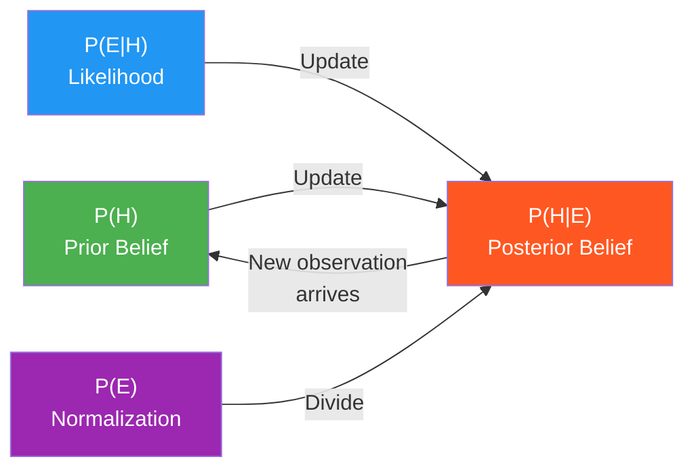

# Probability and Statistics for Machine Learning

Probability theory is the formal language of uncertainty, and machine learning is fundamentally about learning from noisy, incomplete data. Every model is a probability distribution (or implicitly assumes one). Every loss function is a log-likelihood. Every training objective is a form of parameter estimation. Understanding probability deeply lets you design appropriate models, interpret results correctly, and debug failures systematically.

---

## 1. Probability Fundamentals

### Sample Space, Events, and Probability

A **probability space** (Ω, F, P) consists of:
- **Ω**: sample space (set of all possible outcomes)
- **F**: sigma-algebra (set of measurable events)
- **P**: probability measure, mapping events to [0,1]

For our purposes, think of P(A) as the long-run frequency of event A occurring.

**Axioms of probability** (Kolmogorov):
1. P(A) ≥ 0 for all events A
2. P(Ω) = 1
3. For mutually exclusive events: P(A ∪ B) = P(A) + P(B)

From these three axioms, everything else follows.

### Conditional Probability

```
P(A | B) = P(A ∩ B) / P(B)    [provided P(B) > 0]
```

Read: "probability of A given B". The conditioning operation restricts the sample space to B and renormalizes.

**Independence**: A and B are independent iff P(A | B) = P(A), equivalently P(A ∩ B) = P(A) * P(B).

**Conditional independence**: A and C are conditionally independent given B iff:
```
P(A ∩ C | B) = P(A | B) * P(C | B)
```
This is the key assumption in **Naive Bayes** (features independent given class) and **Markov models** (future independent of past given present).

### Bayes' Theorem

```
P(H | E) = P(E | H) * P(H) / P(E)
```

- **P(H)**: Prior - belief in hypothesis H before seeing evidence
- **P(E | H)**: Likelihood - how probable is evidence E given H is true
- **P(H | E)**: Posterior - updated belief after seeing evidence
- **P(E)**: Marginal likelihood / evidence - normalizing constant



**P(E)** via the law of total probability:
```
P(E) = sum_h P(E | H=h) * P(H=h)    [discrete]
P(E) = integral P(E | H=h) * P(H=h) dh    [continuous]
```

**Bayesian ML interpretation**: Parameters θ are random variables with prior P(θ). After seeing data D:
```
P(θ | D) = P(D | θ) * P(θ) / P(D)
```
MAP estimation finds the mode of P(θ | D). Full Bayesian inference maintains the entire posterior distribution.

### Chain Rule of Probability

```
P(A, B, C) = P(A) * P(B | A) * P(C | A, B)
```

Generalizing:
```
P(x_1, x_2, ..., x_n) = prod_{i=1}^{n} P(x_i | x_1, ..., x_{i-1})
```

This is the factorization underlying **autoregressive language models**. GPT generates token x_i conditioned on all previous tokens:
```
P(x_1, ..., x_n) = prod_{i=1}^{n} P(x_i | x_1, ..., x_{i-1})
```

This is also the basis of Bayesian networks (directed graphical models): we specify a factorization of the joint distribution using conditional independence assumptions to drop some conditioning variables.

---

## 2. Common Probability Distributions

### Bernoulli Distribution
```
X ~ Bernoulli(p)
P(X=1) = p,  P(X=0) = 1-p
E[X] = p,  Var[X] = p(1-p)
```

**ML use**: Binary classification output. Logistic regression models P(y=1 | x) = sigmoid(w·x). The binary cross-entropy loss is the negative log-likelihood of the Bernoulli distribution.

### Binomial Distribution
```
X ~ Binomial(n, p)
P(X=k) = C(n,k) * p^k * (1-p)^(n-k)
E[X] = np,  Var[X] = np(1-p)
```

Sum of n independent Bernoulli(p) random variables. As n → ∞, by CLT, converges to Gaussian.

### Gaussian (Normal) Distribution
```
X ~ N(mu, sigma^2)
f(x) = (1 / sqrt(2*pi*sigma^2)) * exp(-(x-mu)^2 / (2*sigma^2))
E[X] = mu,  Var[X] = sigma^2
```

**Why Gaussian is ubiquitous**:
1. **Maximum entropy**: Among all distributions with fixed mean and variance, the Gaussian has maximum entropy. It makes the weakest assumptions about the distribution shape.
2. **Central Limit Theorem**: Sums of independent random variables converge to Gaussian.
3. **Analytical tractability**: Gaussian distributions are closed under linear transformations, marginalization, and conditioning.
4. **MSE = Gaussian MLE**: Minimizing MSE is equivalent to maximum likelihood under a Gaussian noise assumption.

**Multivariate Gaussian**:
```
X ~ N(mu, Sigma)    where X ∈ R^n, mu ∈ R^n, Sigma ∈ R^{n×n} (positive definite)
f(x) = (2*pi)^{-n/2} * |Sigma|^{-1/2} * exp(-0.5 * (x-mu)^T Sigma^{-1} (x-mu))
```
The Mahalanobis distance (x-mu)^T Σ^{-1} (x-mu) is the squared distance accounting for correlations between dimensions.

### Categorical and Multinomial Distributions
```
X ~ Categorical(p_1, ..., p_k)    where sum p_i = 1
P(X=i) = p_i
```

**ML use**: Multi-class classification. The softmax output models Categorical probabilities. Cross-entropy loss is the negative log-likelihood.

### Poisson Distribution
```
X ~ Poisson(lambda)
P(X=k) = lambda^k * exp(-lambda) / k!    k = 0, 1, 2, ...
E[X] = lambda,  Var[X] = lambda
```

**ML use**: Count data modeling (number of events per unit time/space). Neural networks for count prediction often use Poisson negative log-likelihood instead of MSE. Also appears in stochastic gradient descent analysis.

### Uniform Distribution
```
X ~ Uniform(a, b)
f(x) = 1/(b-a) for x in [a, b]
E[X] = (a+b)/2,  Var[X] = (b-a)^2/12
```

**ML use**: Weight initialization (Xavier/Glorot uses a scaled uniform distribution). Also used for random hyperparameter search.

### Beta Distribution
```
X ~ Beta(alpha, beta)    where X in (0, 1)
f(x) = x^{alpha-1} * (1-x)^{beta-1} / B(alpha, beta)
E[X] = alpha / (alpha + beta)
```

**ML use**: Natural conjugate prior for the Bernoulli parameter p. After observing k successes in n trials, the posterior is Beta(alpha + k, beta + n - k). Used in Thompson sampling for contextual bandits.

### Dirichlet Distribution
```
X ~ Dirichlet(alpha_1, ..., alpha_k)    where X is a probability vector
f(x) proportional to x_1^{alpha_1-1} * ... * x_k^{alpha_k-1}
E[X_i] = alpha_i / sum_j alpha_j
```

**ML use**: Conjugate prior for Categorical/Multinomial parameters. Foundation of Latent Dirichlet Allocation (LDA) for topic modeling. The concentration parameter α controls how spread out vs peaked the distribution is:
- α >> 1: near-uniform distributions (all topics mixed)
- α << 1: sparse distributions (few topics dominate)

---

## 3. Maximum Likelihood Estimation (MLE)

### Derivation from First Principles

Given: data D = {x_1, x_2, ..., x_n} assumed i.i.d. from P(x | θ)

The likelihood function:
```
L(θ) = P(D | θ) = prod_{i=1}^{n} P(x_i | θ)     [by i.i.d. assumption]
```

MLE finds θ* that maximizes this:
```
theta* = argmax_theta L(theta)
       = argmax_theta prod_i P(x_i | theta)
       = argmax_theta sum_i log P(x_i | theta)    [log is monotonic]
       = argmin_theta -sum_i log P(x_i | theta)   [minimize negative log-likelihood]
```

Taking log converts the product to a sum, making differentiation tractable. This is why all ML losses are ultimately sums over examples.

### MLE for Gaussian: Derives MSE Loss

Assume: y_i = f(x_i; θ) + ε_i where ε_i ~ N(0, σ²)

This means: P(y_i | x_i, θ) = N(y_i; f(x_i; θ), σ²)

Log-likelihood:
```
log L(θ) = sum_i log P(y_i | x_i, θ)
          = sum_i [-0.5 * log(2*pi*sigma^2) - (y_i - f(x_i;θ))^2 / (2*sigma^2)]
          = -n/2 * log(2*pi*sigma^2) - 1/(2*sigma^2) * sum_i (y_i - f(x_i;θ))^2
```

Maximizing this over θ (σ² is not a function of θ in the standard setup) is equivalent to:
```
argmin_theta sum_i (y_i - f(x_i; theta))^2 = MSE loss
```

**MSE loss = Gaussian MLE**. Assuming Gaussian noise implies minimizing squared error is optimal.

### MLE for Bernoulli: Derives Cross-Entropy Loss

Assume: y_i ∈ {0, 1}, P(y_i=1 | x_i) = p_i = sigmoid(f(x_i; θ))

Log-likelihood:
```
log L(θ) = sum_i [y_i * log(p_i) + (1-y_i) * log(1-p_i)]
```

Negating gives the **binary cross-entropy loss**:
```
L_BCE = -sum_i [y_i * log(p_i) + (1-y_i) * log(1-p_i)]
```

**Binary cross-entropy = Bernoulli negative log-likelihood**. This is NOT an arbitrary choice - it is the correct loss for binary classification under the assumption that labels are Bernoulli random variables.

### MLE for Categorical: Derives Softmax Cross-Entropy

Assume: y_i ∈ {1, ..., C}, P(y_i = c | x_i) = softmax(f(x_i; θ))_c

Log-likelihood:
```
log L(θ) = sum_i log P(y_i | x_i; θ)
          = sum_i log softmax(f(x_i;θ))_{y_i}
          = sum_i [f(x_i;θ)_{y_i} - log(sum_c exp(f(x_i;θ)_c))]
```

Negating gives the **categorical cross-entropy (softmax loss)**:
```
L_CE = -sum_i [z_{y_i} - log(sum_c exp(z_c))]   where z = f(x_i; θ)
```

---

## 4. Maximum A Posteriori (MAP) Estimation

MAP incorporates a prior over parameters:
```
theta_MAP = argmax_theta P(theta | D)
           = argmax_theta P(D | theta) * P(theta) / P(D)
           = argmax_theta [log P(D | theta) + log P(theta)]
           = argmin_theta [-log P(D | theta) - log P(theta)]
```

The -log P(D | θ) term is the standard MLE loss. The -log P(θ) term is the **regularizer**.

### MAP with Gaussian Prior = L2 Regularization

If P(θ) = N(0, τ²I), then:
```
-log P(theta) = ||theta||^2 / (2*tau^2) + const
```

MAP objective:
```
argmin_theta [NLL(theta) + lambda * ||theta||^2]    where lambda = 1/(2*tau^2)
```

**L2 regularization (weight decay) is MAP estimation with a Gaussian prior on weights**. Strong prior (small τ²) = large λ = more regularization.

### MAP with Laplace Prior = L1 Regularization

If P(θ) = Laplace(0, b), then:
```
-log P(theta) = |theta| / b + const
```

MAP objective:
```
argmin_theta [NLL(theta) + lambda * ||theta||_1]    where lambda = 1/b
```

**L1 regularization is MAP estimation with a Laplace prior**. The Laplace distribution has heavier tails than Gaussian and a sharper peak at 0, which encourages sparsity.

---

## 5. Central Limit Theorem and Its Importance for ML

**CLT Statement**: If X_1, ..., X_n are i.i.d. random variables with mean μ and finite variance σ², then:
```
sqrt(n) * (X_bar - mu) / sigma → N(0, 1)    as n → infinity
```

where X_bar = (1/n) * sum X_i.

**Convergence rate**: O(1/sqrt(n)). To halve the standard error of your estimate, you need 4× the data.

### Why CLT Matters for ML

1. **Gradient estimates in mini-batch SGD**: The mini-batch gradient is an unbiased estimate of the true gradient. By CLT, mini-batch gradients are approximately normally distributed around the true gradient. The variance of this estimate is proportional to σ²/batch_size. Larger batch sizes → more accurate gradient estimates → but with diminishing returns.

2. **Confidence intervals for metrics**: The sample mean of a metric (like accuracy over a test set) is approximately normally distributed by CLT. This justifies computing confidence intervals as mean ± 1.96 * std/sqrt(n).

3. **A/B testing**: When sample sizes are large enough, treatment effect estimates are approximately normal, enabling t-tests and z-tests.

4. **Convergence guarantees**: Many theoretical guarantees for SGD rely on CLT-like arguments about the noise in gradient estimates.

5. **Why Gaussian distributions appear everywhere**: Many quantities of interest are sums or averages of many small independent effects, making them approximately Gaussian by CLT. This justifies Gaussian noise models.

---

## 6. Statistical Hypothesis Testing

### Framework

1. **Null hypothesis H₀**: The default assumption (no effect, no difference)
2. **Alternative hypothesis H₁**: What we're trying to show
3. **Test statistic**: A function of the data that measures evidence against H₀
4. **p-value**: P(observing data this extreme | H₀ is true)
5. **Significance level α**: Threshold for rejecting H₀ (typically 0.05)

If p-value < α, reject H₀. But this does NOT prove H₁ is true - it only says the data is unlikely under H₀.

### t-test

Used when testing if a mean equals a specific value, or if two means are equal.

**One-sample t-statistic**:
```
t = (X_bar - mu_0) / (S / sqrt(n))
```
where S is the sample standard deviation and mu_0 is the hypothesized mean.

Under H₀, t follows a t-distribution with n-1 degrees of freedom. As n → ∞, t-distribution → N(0,1).

**Two-sample t-test** (for A/B testing):
```
t = (X_bar_A - X_bar_B) / sqrt(S_A^2/n_A + S_B^2/n_B)
```

**Assumptions**: Independence, approximate normality (relaxed for large samples by CLT), equal variance (for standard test).

### Chi-Squared Test

Used for testing independence between categorical variables, or goodness-of-fit.

**Test statistic**:
```
chi^2 = sum_i (O_i - E_i)^2 / E_i
```
where O_i = observed counts, E_i = expected counts under H₀.

**ML use**: Feature selection (test if feature is independent of label), evaluating if a predicted distribution matches the true distribution.

### Common Mistakes in Hypothesis Testing (Interviewers Love These)

1. **p-value ≠ probability that H₀ is true**: p-value is P(data | H₀), not P(H₀ | data).
2. **Multiple comparisons inflate false positive rate**: If you test 100 features at α=0.05, expect ~5 false positives. Use Bonferroni correction or FDR control.
3. **Statistical significance ≠ practical significance**: A tiny effect can be statistically significant with enough data. Always report effect size.
4. **Stopping when you see significance**: Peeking at results and stopping the experiment early inflates Type I error. Requires sequential testing corrections.

### Statistical Power and Sample Size

**Power** = P(reject H₀ | H₁ is true) = 1 - P(Type II error)

**Minimum sample size** for desired power (1-β) at significance level α, for effect size δ:
```
n = (z_{alpha/2} + z_beta)^2 * sigma^2 / delta^2
```
where z_{alpha/2} = 1.96 for α=0.05 and z_beta = 0.84 for 80% power.

This formula shows: to detect smaller effects (smaller δ), you need **quadratically more data**.

---

## 7. Confidence Intervals

A 95% CI means: if we repeated the experiment many times and computed the CI each time, 95% of those CIs would contain the true parameter value.

**Common misinterpretation**: "There's 95% probability the true value is in this interval" is wrong when speaking about a frequentist CI. The true value is fixed; the CI is random (it varies with each sample).

For a proportion p̂ with n samples:
```
CI: p_hat ± 1.96 * sqrt(p_hat * (1-p_hat) / n)
```

**For model accuracy on test set of size n**:
```
CI: accuracy ± 1.96 * sqrt(accuracy * (1-accuracy) / n)
```

With n=1000 and accuracy=0.85: CI ≈ 0.85 ± 0.022, meaning accuracy is in [0.828, 0.872] with 95% confidence.

This is important: test sets of 1000 examples give ±2% uncertainty, which matters when models differ by less than 2%.

---

## 8. KL Divergence and Jensen-Shannon Divergence

### KL Divergence

```
KL(P || Q) = sum_x P(x) * log(P(x) / Q(x))    [discrete]
           = integral P(x) * log(P(x) / Q(x)) dx    [continuous]
           = E_{x~P}[log P(x) - log Q(x)]
```

**Properties**:
- KL(P || Q) ≥ 0 (Gibbs' inequality / Jensen's inequality applied to -log)
- KL(P || Q) = 0 iff P = Q almost everywhere
- **Not symmetric**: KL(P || Q) ≠ KL(Q || P)
- **Not a metric**: Triangle inequality does not hold

**Interpretation**: KL(P || Q) is the average "surprise" you get when you assumed Q but the true distribution is P. Or: extra bits needed to encode samples from P using a code optimized for Q.

**Forward vs reverse KL**:
- KL(P || Q) - "forward" or "moment-matching": Q must cover all regions where P has mass. Zero-avoiding for Q → over-dispersed approximations. Used in variational inference.
- KL(Q || P) - "reverse": Q concentrates on modes of P. Mode-seeking → under-dispersed approximations. Used in RL (policy optimization).

**Connection to cross-entropy**:
```
KL(P || Q) = sum_x P(x) * log P(x) - sum_x P(x) * log Q(x)
           = -H(P) + H(P, Q)
```
where H(P) is the entropy of P and H(P, Q) is the cross-entropy. Minimizing KL(P || Q) over Q is equivalent to minimizing cross-entropy H(P, Q) (since H(P) is constant with respect to Q).

**This is why training with cross-entropy minimizes KL to the data distribution**.

### Jensen-Shannon Divergence

```
JSD(P || Q) = 0.5 * KL(P || M) + 0.5 * KL(Q || M)    where M = (P + Q) / 2
```

**Properties**:
- Symmetric: JSD(P || Q) = JSD(Q || P)
- Bounded: JSD ∈ [0, log 2]
- sqrt(JSD) is a metric (satisfies triangle inequality)

**ML use**: The original GAN objective is equivalent to minimizing JSD between real and generated distributions. KL divergence appears in VAE (ELBO), RLHF (KL penalty between learned and reference policy), and information-theoretic bounds.

### In LLMs and RLHF

**VAE ELBO**: The evidence lower bound includes a KL term:
```
ELBO = E_{q(z|x)}[log p(x|z)] - KL(q(z|x) || p(z))
     = reconstruction_loss - regularization
```
Training maximizes ELBO, which is equivalent to minimizing KL(q(z|x) || p(x,z)).

**RLHF KL penalty**: When fine-tuning an LLM with RL, the policy is penalized for deviating from the reference (pre-trained) model:
```
reward_adjusted = reward_model(x, y) - beta * KL(pi_RL(y|x) || pi_ref(y|x))
```
This prevents reward hacking (the model finding degenerate outputs that fool the reward model). The KL term keeps the policy close to the reference distribution.

---

## 9. Cross-Entropy Derivation

### Definition

Cross-entropy between true distribution P and predicted distribution Q:
```
H(P, Q) = -sum_x P(x) * log Q(x)
```

For discrete labels with one-hot P (P(y_i) = 1, P(y≠y_i) = 0):
```
H(P, Q) = -log Q(y_i)    [only the true class contributes]
```

For batch of n examples:
```
L_CE = -(1/n) * sum_i log Q(y_i | x_i)
     = -(1/n) * sum_i log softmax(f(x_i; theta))_{y_i}
```

### Gradient of Softmax Cross-Entropy

Let z be the logit vector, p = softmax(z), y be the one-hot label.

```
L = -sum_c y_c * log p_c = -log p_{y_true}
```

The gradient with respect to logit z_j:
```
dL/dz_j = sum_c (-y_c / p_c) * dp_c/dz_j
         = sum_c (-y_c / p_c) * p_c * (delta_{cj} - p_j)
         = -y_j + p_j * sum_c y_c
         = p_j - y_j    [since sum_c y_c = 1]
```

The gradient is simply **p - y** (predicted probabilities minus true labels). This is beautifully simple and computationally efficient.

---

## 10. Expected Value, Variance, Covariance, Correlation

### Expected Value

```
E[X] = sum_x x * P(X=x)    [discrete]
E[X] = integral x * f(x) dx    [continuous]
```

**Key properties**:
- Linearity: E[aX + bY] = a*E[X] + b*E[Y] (always, even for dependent X, Y)
- E[g(X)] ≠ g(E[X]) in general (Jensen's inequality)

**Jensen's inequality**: For convex g: E[g(X)] ≥ g(E[X])
For concave g: E[g(X)] ≤ g(E[X])

**KL ≥ 0 proof** uses Jensen's: KL(P||Q) = E_{P}[-log Q/P] ≥ -log(E_{P}[Q/P]) = -log(1) = 0

### Variance

```
Var[X] = E[(X - E[X])^2] = E[X^2] - (E[X])^2
Std[X] = sqrt(Var[X])
```

**Law of total variance** (useful for ensemble methods):
```
Var[Y] = E_X[Var[Y|X]] + Var_X[E[Y|X]]
```
Total variance = average conditional variance + variance of conditional means.

This shows: even if Y is perfectly predicted given X (Var[Y|X] = 0), variance in E[Y|X] still contributes to total variance. Ensembles reduce the second term by averaging unstable predictions.

### Covariance and Correlation

```
Cov[X, Y] = E[(X - E[X])(Y - E[Y])] = E[XY] - E[X]*E[Y]
Corr[X, Y] = Cov[X, Y] / (Std[X] * Std[Y])    ∈ [-1, 1]
```

**For a random vector X ∈ ℝⁿ**:
```
Sigma_{ij} = Cov[X_i, X_j]
Sigma = E[(X - mu)(X - mu)^T]    [positive semi-definite matrix]
```

**Sample covariance matrix**: For n observations {x_1, ..., x_n}:
```
Sigma_hat = (1/(n-1)) * sum_i (x_i - x_bar)(x_i - x_bar)^T
          = (1/(n-1)) * X_centered^T X_centered
```

The (1/(n-1)) factor gives an unbiased estimator (Bessel's correction).

**Connection to PCA**: Eigenvectors of the covariance matrix are the principal components. Eigenvalues are the variances along each component.

---

## 11. Law of Large Numbers

**Weak LLN**: For i.i.d. X_1, ..., X_n with finite mean μ:
```
X_bar_n → mu    in probability as n → infinity
```

**Strong LLN**: The above convergence holds almost surely (with probability 1).

**ML implications**:
1. Training loss converges to population loss as dataset size grows
2. Mini-batch gradient estimates converge to true gradient
3. Empirical risk minimization is justified: minimizing training loss approximates minimizing population loss
4. Monte Carlo estimates improve with more samples (used in MC dropout, MCMC, stochastic VI)

---

## 12. Code Examples

```python
import numpy as np
from scipy import stats
import matplotlib.pyplot as plt

np.random.seed(42)

# ============================================================
# 1. Bayes' Theorem: Spam Detection Example
# ============================================================
def bayes_update(prior, likelihood_spam, likelihood_ham, word_in_email):
    """Update belief about spam given observed words."""
    if word_in_email:
        numerator = likelihood_spam * prior
        denominator = likelihood_spam * prior + likelihood_ham * (1 - prior)
    else:
        numerator = (1 - likelihood_spam) * prior
        denominator = (1 - likelihood_spam) * prior + (1 - likelihood_ham) * (1 - prior)
    return numerator / denominator

prior_spam = 0.3  # 30% of emails are spam
p_word_given_spam = 0.7  # word "free" appears in 70% of spam
p_word_given_ham = 0.1   # word "free" appears in 10% of non-spam

posterior = bayes_update(prior_spam, p_word_given_spam, p_word_given_ham, True)
print(f"P(spam) = {prior_spam:.2f}")
print(f"P(spam | 'free' in email) = {posterior:.4f}")

# ============================================================
# 2. MLE: Derive optimal parameters for Gaussian
# ============================================================
def mle_gaussian(data):
    """MLE estimates for Gaussian: mu = sample mean, sigma^2 = sample variance."""
    n = len(data)
    mu_mle = np.mean(data)
    sigma2_mle = np.var(data)  # Note: biased MLE, not unbiased sample variance
    return mu_mle, sigma2_mle

data = np.random.normal(loc=5.0, scale=2.0, size=1000)
mu_hat, sigma2_hat = mle_gaussian(data)
print(f"\nMLE Gaussian estimates:")
print(f"  True: mu=5.0, sigma^2=4.0")
print(f"  Estimated: mu={mu_hat:.4f}, sigma^2={sigma2_hat:.4f}")

# ============================================================
# 3. KL Divergence
# ============================================================
def kl_divergence(p, q, eps=1e-10):
    """KL divergence KL(P||Q) for discrete distributions."""
    p = np.array(p, dtype=float)
    q = np.array(q, dtype=float)
    # Clip to avoid log(0)
    p = np.clip(p, eps, None)
    q = np.clip(q, eps, None)
    return np.sum(p * np.log(p / q))

def cross_entropy(p, q, eps=1e-10):
    """Cross-entropy H(P, Q)."""
    p = np.clip(p, eps, None)
    q = np.clip(q, eps, None)
    return -np.sum(p * np.log(q))

def entropy(p, eps=1e-10):
    """Entropy H(P)."""
    p = np.clip(p, eps, None)
    return -np.sum(p * np.log(p))

# True distribution P and approximation Q
P = np.array([0.3, 0.4, 0.2, 0.1])
Q = np.array([0.25, 0.35, 0.25, 0.15])

kl_pq = kl_divergence(P, Q)
kl_qp = kl_divergence(Q, P)
ce_pq = cross_entropy(P, Q)
h_p = entropy(P)

print(f"\nKL Divergence:")
print(f"  KL(P||Q) = {kl_pq:.6f}")
print(f"  KL(Q||P) = {kl_qp:.6f}  (asymmetric!)")
print(f"\nCross-entropy H(P,Q) = {ce_pq:.6f}")
print(f"Entropy H(P) = {h_p:.6f}")
print(f"H(P,Q) = H(P) + KL(P||Q): {h_p + kl_pq:.6f} == {ce_pq:.6f}")

# JSD (symmetric)
M = (P + Q) / 2
jsd = 0.5 * kl_divergence(P, M) + 0.5 * kl_divergence(Q, M)
print(f"JSD(P||Q) = {jsd:.6f}  (symmetric, bounded by log(2)={np.log(2):.4f})")

# ============================================================
# 4. Binary Cross-Entropy (Logistic Regression MLE)
# ============================================================
def sigmoid(z):
    return 1 / (1 + np.exp(-z))

def binary_cross_entropy(y_true, y_pred_logits):
    """Binary cross-entropy from logits (numerically stable)."""
    # Numerically stable: log(sigmoid(z)) = -log(1 + exp(-z)) for z > 0
    # and z - log(1 + exp(z)) for z <= 0
    y_pred = sigmoid(y_pred_logits)
    eps = 1e-7
    y_pred = np.clip(y_pred, eps, 1 - eps)
    return -np.mean(y_true * np.log(y_pred) + (1 - y_true) * np.log(1 - y_pred))

# Simulate binary classification
n = 1000
X = np.random.randn(n, 5)
w_true = np.array([0.5, -1.0, 0.3, 0.0, 0.8])
logits_true = X @ w_true
y = (np.random.rand(n) < sigmoid(logits_true)).astype(float)

# Test with random weights vs true weights
w_random = np.random.randn(5) * 0.1
bce_random = binary_cross_entropy(y, X @ w_random)
bce_true = binary_cross_entropy(y, logits_true)
print(f"\nBinary cross-entropy:")
print(f"  Random weights: {bce_random:.4f}")
print(f"  True weights: {bce_true:.4f}")

# ============================================================
# 5. Central Limit Theorem Demonstration
# ============================================================
# Start with highly non-Gaussian (exponential) distribution
n_samples_per_trial = 30
n_trials = 5000

means = np.array([np.random.exponential(1.0, n_samples_per_trial).mean()
                  for _ in range(n_trials)])

# True mean and standard error
true_mean = 1.0  # E[Exp(1)] = 1
theoretical_se = 1.0 / np.sqrt(n_samples_per_trial)  # std/sqrt(n)

print(f"\nCentral Limit Theorem (Exponential distribution, n={n_samples_per_trial}):")
print(f"  True mean: {true_mean:.4f}")
print(f"  Sample mean of means: {means.mean():.4f}")
print(f"  Theoretical SE: {theoretical_se:.4f}")
print(f"  Empirical SE: {means.std():.4f}")
# The distribution of means is approximately N(1, 1/30) by CLT
ks_stat, ks_p = stats.kstest((means - means.mean()) / means.std(), 'norm')
print(f"  KS test p-value for normality: {ks_p:.4f} (larger = more normal)")

# ============================================================
# 6. Statistical Test for A/B Testing
# ============================================================
def ab_test(control_successes, control_trials, treatment_successes, treatment_trials,
            alpha=0.05):
    """Two-proportion z-test for A/B testing."""
    p_control = control_successes / control_trials
    p_treatment = treatment_successes / treatment_trials

    p_pooled = (control_successes + treatment_successes) / (control_trials + treatment_trials)
    se = np.sqrt(p_pooled * (1 - p_pooled) * (1/control_trials + 1/treatment_trials))

    z_stat = (p_treatment - p_control) / se
    p_value = 2 * (1 - stats.norm.cdf(abs(z_stat)))  # two-sided

    ci_95 = (p_treatment - p_control) ± 1.96 * np.sqrt(
        p_control*(1-p_control)/control_trials + p_treatment*(1-p_treatment)/treatment_trials
    )

    return {
        'z_stat': z_stat,
        'p_value': p_value,
        'significant': p_value < alpha,
        'effect': p_treatment - p_control,
        'control_rate': p_control,
        'treatment_rate': p_treatment,
    }

# Simulate: control 12% CTR, treatment 13.5% CTR, 10K users each
result = ab_test(1200, 10000, 1350, 10000)
print(f"\nA/B Test Results:")
print(f"  Control CTR: {result['control_rate']:.4f}")
print(f"  Treatment CTR: {result['treatment_rate']:.4f}")
print(f"  Effect size: {result['effect']:.4f} ({result['effect']/result['control_rate']*100:.1f}% relative)")
print(f"  Z-statistic: {result['z_stat']:.4f}")
print(f"  P-value: {result['p_value']:.4f}")
print(f"  Significant at alpha=0.05: {result['significant']}")

# ============================================================
# 7. MAP Estimation: L2 Regularization is Gaussian Prior
# ============================================================
def map_linear_regression(X, y, lambda_reg):
    """MAP estimation = ridge regression = Gaussian prior on weights."""
    n, d = X.shape
    # Analytical solution: w_MAP = (X^T X + lambda * I)^{-1} X^T y
    w_map = np.linalg.solve(X.T @ X + lambda_reg * np.eye(d), X.T @ y)
    return w_map

def mle_linear_regression(X, y):
    """MLE = OLS: w_MLE = (X^T X)^{-1} X^T y"""
    return np.linalg.solve(X.T @ X, X.T @ y)

# Small dataset where regularization matters
n, d = 50, 20  # n < d: underdetermined, MLE is unstable
X_reg = np.random.randn(n, d)
w_truth = np.random.randn(d) * 0.5
y_reg = X_reg @ w_truth + 0.5 * np.random.randn(n)

w_mle = mle_linear_regression(X_reg, y_reg)
w_map_strong = map_linear_regression(X_reg, y_reg, lambda_reg=1.0)
w_map_weak = map_linear_regression(X_reg, y_reg, lambda_reg=0.01)

print(f"\nMAP vs MLE (underdetermined system, n={n}, d={d}):")
print(f"  ||w_true||  = {np.linalg.norm(w_truth):.4f}")
print(f"  ||w_MLE||   = {np.linalg.norm(w_mle):.4f}  (can be large, unstable)")
print(f"  ||w_MAP_weak||   = {np.linalg.norm(w_map_weak):.4f}")
print(f"  ||w_MAP_strong|| = {np.linalg.norm(w_map_strong):.4f}  (shrunk toward 0)")
```

---

## 13. Interview Questions and Answers

### Q1: What is the difference between MLE and MAP? When would you use each?

**Answer**:

MLE (Maximum Likelihood Estimation) finds parameters that maximize P(data | θ). It treats parameters as fixed unknowns and uses only the data.

MAP (Maximum A Posteriori) finds parameters that maximize P(θ | data) = P(data | θ) × P(θ). It incorporates prior beliefs about parameter values.

**Mathematically**: MAP = MLE + regularization term from the prior's negative log.
- Gaussian prior → L2 regularization (ridge)
- Laplace prior → L1 regularization (lasso)

**When to use MLE**: Large datasets (prior becomes negligible), when you have no principled prior beliefs, frequentist settings.

**When to use MAP/Bayesian**: Small datasets (prior acts as regularization), when domain knowledge provides meaningful priors, when you need uncertainty quantification (full Bayesian inference is best here, MAP is a compromise).

---

### Q2: Explain KL divergence. Why is it asymmetric and what does that mean in practice?

**Answer**: KL(P||Q) = Σ P(x) log(P(x)/Q(x)) measures how much information is lost when Q is used to approximate P. It is asymmetric because it weights the log ratio by P's probabilities, not Q's.

**Forward KL** KL(P||Q): Minimizing over Q → Q must put mass wherever P has mass (zero-avoiding). Q will be over-dispersed if P is multimodal. Used in variational inference where P = true posterior and Q = variational approximation. Results in mean-seeking behavior.

**Reverse KL** KL(Q||P): Minimizing over Q → Q concentrates on modes of P where Q has mass. Q will under-represent modes that it doesn't focus on (mode-seeking). Used in expectation propagation and RL policy optimization.

**In practice**: In VAEs, we minimize KL(q(z|x) || p(z)) in the ELBO - this is reverse KL, encouraging the encoder to concentrate on regions where the prior assigns mass. In training language models, we minimize forward KL (cross-entropy), which requires the model to assign non-zero probability to all tokens the true distribution assigns mass to.

---

### Q3: Why does minimizing cross-entropy equal minimizing KL divergence?

**Answer**: Cross-entropy H(P, Q) = H(P) + KL(P || Q).

H(P) is the entropy of the true distribution, which is constant with respect to model parameters Q. Therefore:

minimizing H(P, Q) over Q = minimizing KL(P || Q) over Q

The practical consequence: training with cross-entropy loss (which approximates H(P_data, P_model)) is equivalent to minimizing KL from the data distribution to the model distribution. This is why cross-entropy is the canonical loss for generative and classification models - it has a principled information-theoretic justification.

---

### Q4: A model achieves 97% accuracy on a dataset. Is that good?

**Answer**: This question is about class imbalance and metric selection - accuracy alone tells you almost nothing without knowing the class distribution.

If 97% of the data belongs to one class, a model that always predicts that class achieves 97% accuracy without learning anything.

Better questions to ask:
1. What is the base rate? If majority class is 97%, the model is trivial.
2. What is the precision and recall for the minority class?
3. What is the AUC-ROC / AUC-PR?
4. What are the costs of false positives vs false negatives?

For medical diagnosis: false negatives (missing disease) may be catastrophically expensive. A model with 97% accuracy but 0% recall on positive class is worthless.

For spam detection: false positives (legitimate email marked as spam) may be more important to minimize.

**The right answer**: Report precision, recall, F1, and AUC-PR, especially for imbalanced datasets. Accuracy is a valid metric only when classes are balanced and all errors are equally costly.

---

### Q5: Explain the Central Limit Theorem and why it matters for mini-batch gradient descent.

**Answer**: CLT states that the sum (or average) of n i.i.d. random variables with finite variance converges to a Gaussian distribution as n → ∞, regardless of the original distribution.

For mini-batch SGD: the mini-batch gradient g_t = (1/B) Σ_{i in batch} ∇L_i is an average of B individual sample gradients. By CLT:
- g_t is approximately Gaussian distributed with mean = true gradient g* and variance = σ²/B
- Larger batch size B → lower variance in gradient estimate → more stable training
- Smaller batch size → higher variance → more "exploration" in optimization (can escape local minima, but also noisier convergence)

**Practical implications**:
1. Mini-batch noise can be beneficial (regularization effect, escaping sharp minima)
2. Very large batches (1024+) converge faster per step but may generalize worse (Keskar et al. 2017)
3. When scaling batch size, learning rate often scales proportionally (linear scaling rule)
4. The standard error of gradient estimate scales as 1/√B, so 4× batch size only halves the noise

---

### Q6: What is the bias-corrected Adam estimator and why is it needed?

**Answer**: Adam maintains exponential moving averages (EMAs) of the gradient and squared gradient:
```
m_t = beta1 * m_{t-1} + (1 - beta1) * g_t    [first moment EMA]
v_t = beta2 * v_{t-1} + (1 - beta2) * g_t^2  [second moment EMA]
```

At initialization, m_0 = v_0 = 0. Early in training (small t), these estimates are biased toward zero because:
```
E[m_t] = (1 - beta1^t) * E[g_t]    [not equal to E[g_t] for small t]
```

The bias-corrected estimates:
```
m_hat_t = m_t / (1 - beta1^t)
v_hat_t = v_t / (1 - beta2^t)
```

As t → ∞, beta1^t → 0 and beta2^t → 0, so the correction approaches 1 (no correction needed). The correction is most important in the first few hundred steps. Without it, initial learning steps are scaled down, slowing initial convergence. This is especially important with large beta2 (e.g., 0.999), where the correction factor is significant for hundreds of steps.

---

## 14. Common Statistical Mistakes in ML

1. **Using test set for hyperparameter tuning**: Destroys test set independence. Use validation set or cross-validation for tuning; test set is a one-shot final evaluation.

2. **Not accounting for temporal ordering in time series splits**: Random train/test split on time series causes data leakage (future predicts past).

3. **Ignoring multiple comparisons in model selection**: Testing 20 models at α=0.05 means ~1 spuriously significant result expected. Use correction methods.

4. **Reporting mean performance without confidence intervals**: Always report standard error or confidence intervals. A 1% improvement on a 100-example test set is not statistically meaningful.

5. **Assuming Gaussian residuals without checking**: MSE is optimal under Gaussian noise; MAE is optimal under Laplace noise (more robust to outliers). Always verify the noise distribution assumption.

6. **Confusing correlation with causation**: A feature highly correlated with the target in training data may not be causal - it may be a proxy for a hidden confounding variable. Correlation-based feature importance can be misleading.
