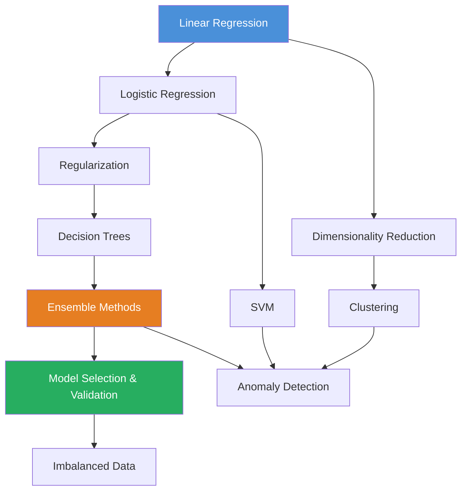

# Machine Learning - Interview Preparation Guide

> Senior-level technical depth for ML engineering and data science interviews at top-tier companies. Every file in this section is written to the standard expected in system design rounds, technical screens, and ML research discussions.

---

## Navigation

| # | Topic | Core Concepts | Difficulty |
|---|-------|---------------|------------|
| 1 | [Linear Regression](./linear_regression.md) | OLS, Gauss-Markov, Ridge/Lasso preview | Foundational |
| 2 | [Logistic Regression](./logistic_regression.md) | Sigmoid, MLE, Softmax | Foundational |
| 3 | [Regularization](./regularization.md) | L1/L2, ElasticNet, Bayesian interpretation | Intermediate |
| 4 | [Decision Trees](./decision_trees.md) | Entropy, Information Gain, Gini, Pruning | Intermediate |
| 5 | [Ensemble Methods](./ensemble_methods.md) | RF, XGBoost, LightGBM, CatBoost, Stacking | Advanced |
| 6 | [Support Vector Machines](./svm.md) | Max Margin, Kernel Trick, SVR | Advanced |
| 7 | [Clustering](./clustering.md) | K-Means, DBSCAN, GMM, Hierarchical | Intermediate |
| 8 | [Dimensionality Reduction](./dimensionality_reduction.md) | PCA, t-SNE, UMAP | Intermediate |
| 9 | [Anomaly Detection](./anomaly_detection.md) | Isolation Forest, LOF, Autoencoders | Advanced |
| 10 | [Model Selection & Validation](./model_selection_and_validation.md) | CV, Bayesian Opt, Nested CV | Advanced |
| 11 | [Imbalanced Data](./imbalanced_data.md) | SMOTE, Class Weights, PR-AUC | Advanced |

---

## Recommended Learning Order



**Phase 1 - Foundations (Week 1-2):**
Linear Regression -> Logistic Regression -> Regularization

**Phase 2 - Tree Methods (Week 2-3):**
Decision Trees -> Ensemble Methods

**Phase 3 - Advanced Techniques (Week 3-4):**
SVM -> Clustering -> Dimensionality Reduction -> Anomaly Detection

**Phase 4 - Production Concerns (Week 4):**
Model Selection & Validation -> Imbalanced Data

---

## Key Themes Across All Topics

### The Bias-Variance Tradeoff

This is the central tension in all of machine learning. Every algorithm, every regularization decision, every hyperparameter choice is fundamentally about navigating this tradeoff.

```
Total Error = Bias² + Variance + Irreducible Noise
```

| Model | Bias | Variance | Example |
|-------|------|----------|---------|
| Linear Regression (no regularization) | Low-Moderate | Moderate | Underfits if data is nonlinear |
| Decision Tree (max depth=1) | High | Low | Stump: extreme underfitting |
| Decision Tree (unlimited depth) | Low | High | Memorizes training data |
| Random Forest | Low | Lower than single tree | Variance reduction via averaging |
| Ridge Regression | Slightly higher | Lower | L2 regularization trades bias for variance |
| Deep Neural Network (no regularization) | Very low | Very high | Needs dropout, weight decay |

### The Generalization Problem

Every model in this section is attempting to solve one fundamental problem: learn a function `f` from a finite sample of data such that it generalizes to unseen data drawn from the same distribution.

The steps to production-quality model development:

1. **Understand the data distribution** - Is it i.i.d.? Temporal? Multi-modal?
2. **Choose the right inductive bias** - Linear models assume linearity. Trees assume axis-aligned splits. SVMs assume margin maximization.
3. **Control complexity** - Regularization, early stopping, ensemble averaging.
4. **Evaluate honestly** - Proper cross-validation, held-out test sets, correct metrics.
5. **Monitor in production** - Distribution shift, concept drift.

### Evaluation Metrics - When to Use What

| Metric | Use When | Avoid When |
|--------|----------|------------|
| Accuracy | Balanced classes | Imbalanced (1% positive rate makes 99% trivially achievable) |
| ROC-AUC | Binary classification, comparing models | Severe class imbalance |
| PR-AUC | Imbalanced binary classification | Not needed when classes balanced |
| F1 Score | Need single metric for imbalanced | When FP and FN have very different costs |
| Log Loss | Probability calibration matters | Just need ranking |
| R² | Regression | Non-linear relationships (can be negative) |
| RMSE | Regression, penalize large errors | Robust evaluation (use MAE instead) |
| MAE | Regression, robust to outliers | When large errors are disproportionately bad |

### Feature Engineering Mental Model

Before reaching for a complex model, ask:

```
Raw Data
    |
    v
Exploratory Data Analysis (distributions, correlations, missingness)
    |
    v
Feature Engineering
    - Transformations (log, sqrt for skewed)
    - Interactions (product features)
    - Encoding (ordinal, one-hot, target encoding)
    - Temporal features (lag, rolling stats)
    |
    v
Feature Selection
    - Correlation analysis
    - Variance inflation factor
    - Recursive feature elimination
    - LASSO path
    |
    v
Model Selection
```

---

## Senior Interview Expectations

At the senior level, interviewers expect you to:

1. **Derive from first principles** - Know the math behind OLS, MLE, maximum margin, eigendecomposition.
2. **Understand failure modes** - When does each algorithm break? What assumptions does it violate?
3. **Make principled comparisons** - "I'd choose XGBoost over Random Forest here because the data is tabular with mixed types, we have limited data, and I need to control overfitting precisely."
4. **Connect to production** - Cross-validation protocol, data leakage prevention, monitoring strategy.
5. **Know the literature** - Reference key papers (CART, Gradient Boosting Machine, XGBoost, SMOTE, Isolation Forest).

### Common Interview Patterns

**"Explain X to me"** - Start with intuition, move to math, give example, state limitations.

**"When would you use X vs Y?"** - Compare on: assumptions, data size, interpretability, training speed, prediction speed, memory, handles missing values, handles categoricals natively, overfitting behavior.

**"What happens when..."** - Trace through the algorithm. What objective changes? What constraint is violated? What breaks?

**"How would you improve this model?"** - Think: more data, better features, better algorithm, better regularization, better evaluation, better preprocessing.

---

## Cross-Cutting Mathematical Tools

Every topic in this section uses concepts from:

### Linear Algebra
- Matrix multiplication: `XW` in linear models
- Eigendecomposition: PCA
- Singular Value Decomposition: PCA, matrix factorization
- Positive definite matrices: covariance, `X'X` in OLS

### Probability & Statistics
- Maximum Likelihood Estimation: logistic regression, GMM
- Bayes' theorem: Naive Bayes, Bayesian regularization
- Hypothesis testing: model comparison
- Distributions: Gaussian (Ridge prior), Laplace (Lasso prior), Bernoulli (logistic)

### Optimization
- Gradient descent: all iterative methods
- Convexity: OLS, logistic regression, SVM (convex); tree ensembles (non-convex)
- Lagrangian optimization: SVM dual problem
- Newton's method: second-order methods in XGBoost

### Information Theory
- Entropy: decision tree splitting
- KL Divergence: model evaluation, variational inference
- Mutual Information: feature selection

---

## Logistics Domain Context

Throughout this section, examples are grounded in logistics and supply chain, a domain rich with tabular data, imbalanced outcomes, time series patterns, and anomalies:

- **Linear Regression**: Predict shipment weight from package dimensions
- **Logistic Regression**: Predict delivery success/failure
- **Decision Trees**: Route classification
- **Ensemble Methods**: Demand forecasting
- **Clustering**: Customer segmentation by delivery patterns
- **Anomaly Detection**: Unusual shipment patterns, supply chain disruptions
- **Imbalanced Data**: Predicting rare delivery failures

This domain-specific grounding makes answers concrete and memorable in interviews.

---

## Quick Reference: Algorithm Properties

| Algorithm | Interpretable | Handles Missing | Handles Cats | Online Learning | Parallelizable |
|-----------|---------------|-----------------|--------------|-----------------|----------------|
| Linear Regression | Yes | No (needs imputation) | No (needs encoding) | Yes (SGD) | Yes |
| Logistic Regression | Moderate | No | No | Yes (SGD) | Yes |
| Decision Tree | Yes | Yes (some impls) | Yes (ordinal) | No | No |
| Random Forest | Partial (feature imp) | Yes | No | No | Yes (per tree) |
| XGBoost | Partial | Yes | No | No | Yes |
| LightGBM | Partial | Yes | Yes | No | Yes |
| SVM | Low | No | No | Yes (SGD kernel) | Limited |
| K-Means | Moderate | No | No | Yes (mini-batch) | Partial |
| PCA | Low | No | No | Yes (incremental) | Yes |

---

## How to Use This Repository

Each file follows this structure:
1. **Conceptual Foundation** - Intuition before math
2. **Mathematical Derivation** - First-principles derivation
3. **Algorithm Details** - Implementation mechanics
4. **Assumptions and Failure Modes** - When it breaks
5. **Comparison Tables** - vs competing approaches
6. **Code Examples** - Runnable, production-quality Python
7. **Logistics Use Case** - Domain-specific application
8. **Mermaid Diagrams** - Visual representations
9. **Interview Questions** - Senior-level Q&A

Start with the topic most relevant to your interview, but return to the fundamentals repeatedly - deep interviewers often start with "derive OLS for me" before asking about XGBoost.

---

*Last updated: February 2026 | Aligned with FAANG/ML-intensive company interview standards*
