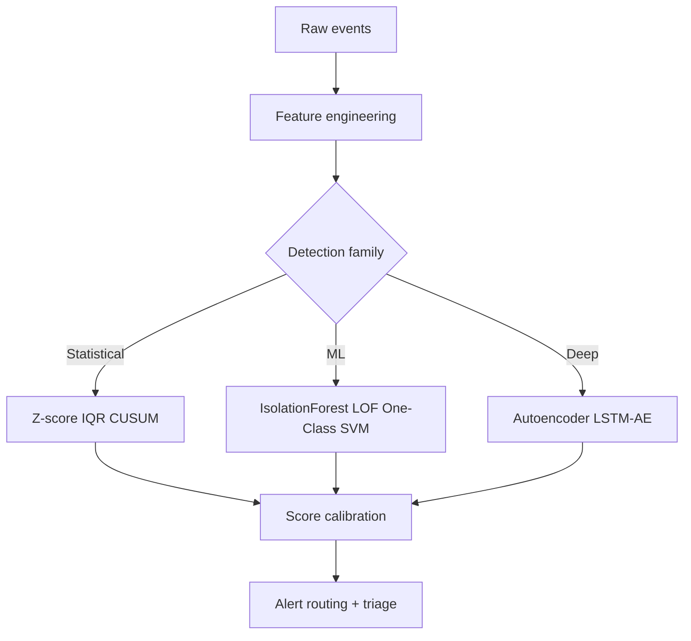

# Anomaly Detection in Enterprise ML

## Types of anomalies
- Point anomalies: single unusual instance.
- Contextual anomalies: unusual given context (e.g., volume spike on weekday vs holiday).
- Collective anomalies: unusual sequence pattern.



## Statistical methods
- Z-score for approximately normal features.
- IQR rule for robust univariate outliers.
- CUSUM for shift detection in time series.

## ML methods
- Isolation Forest: isolates anomalies with short tree paths.
- One-Class SVM: learns boundary around normal class.
- LOF: local density deviation.

## Deep methods
- Autoencoders: high reconstruction error indicates anomaly.
- LSTM autoencoders for sequence anomalies.

## Evaluation challenge
Labeled anomalies are rare and noisy.
Use:
- Precision@k for investigation queues.
- PR curve when labels available.
- Time-to-detection and analyst feedback loops.

## Isolation Forest at scale
Why often preferred:
- Efficient on large tabular datasets.
- Minimal assumptions.
- Works with mixed signals after encoding/scaling.

## Logistics use case
Detect unusual shipment flows indicating fraud or routing disruption.
Features:
- origin-destination frequency deviation
- claim rate spikes
- unexpected scan sequence patterns

## Interview questions
1. How evaluate anomaly detector with few labels?
2. Why Isolation Forest scales better than LOF?
3. How reduce alert fatigue?

## Code example
```python
from sklearn.ensemble import IsolationForest
from sklearn.preprocessing import StandardScaler
import numpy as np

X = np.random.randn(5000, 8)
X[:50] += 6.0  # synthetic anomalies
X = StandardScaler().fit_transform(X)

iso = IsolationForest(
    n_estimators=300,
    contamination=0.01,
    random_state=42,
    n_jobs=-1
)
iso.fit(X)

scores = -iso.decision_function(X)  # higher => more anomalous
labels = iso.predict(X)             # -1 anomaly, 1 normal
print('Anomalies flagged:', (labels == -1).sum())
```

## Common pitfalls
- Fixed thresholds without seasonality context.
- No post-alert prioritization.
- Training on contaminated "normal" data.
- Ignoring concept drift in normal behavior.
