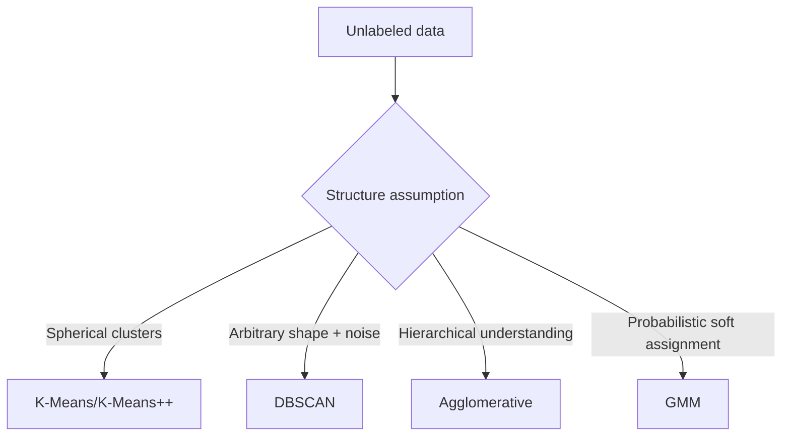

# Clustering Methods for Interview and Production Practice

## Why clustering
Clustering groups similar samples without labels. In logistics, it helps segment customers, routes, depots, and incident patterns.



## K-Means
Objective: minimize within-cluster SSE.
1. Initialize centroids.
2. Assign points to nearest centroid.
3. Recompute centroids.
4. Repeat until convergence.

### K selection
- Elbow method.
- Silhouette score.
- Stability across seeds.

### Limitations
- Sensitive to initialization/outliers.
- Assumes roughly spherical/equal-variance clusters.

## K-Means++
Improved centroid initialization; reduces poor local minima risk.

## DBSCAN
Density-based clustering.
- Parameters: `eps`, `min_samples`.
- Finds core/border/noise points.
- Handles non-convex clusters and explicit outliers.

## Hierarchical clustering
Agglomerative process with linkage options:
- Single
- Complete
- Average
- Ward

Dendrogram supports exploratory cluster granularity decisions.

## Gaussian Mixture Models (GMM)
Soft clustering with probabilities:
`p(x) = Σ pi_k * N(x | mu_k, Sigma_k)`
Fit with EM algorithm.

## Metrics
- Silhouette (higher better).
- Davies-Bouldin (lower better).
- Calinski-Harabasz (higher better).
- ARI/NMI when labels exist.

## When clustering fails
- No natural cluster structure.
- Features not scaled/engineered.
- Distance metric mismatch.
- High-dimensional sparse data without reduction.

## Logistics example
Customer segmentation by shipping behavior:
- Frequency, average parcel weight, service mix, seasonal peaks.
- Use clusters to design differentiated SLA and pricing strategy.

## Interview questions
1. What happens to K-Means with outliers?
2. When use DBSCAN over K-Means?
3. Why GMM over K-Means?
4. How do you validate clustering quality without labels?

## sklearn pipeline example
```python
import numpy as np
from sklearn.preprocessing import StandardScaler
from sklearn.cluster import KMeans, DBSCAN
from sklearn.mixture import GaussianMixture
from sklearn.metrics import silhouette_score

X = np.random.randn(2000, 6)
X = StandardScaler().fit_transform(X)

kmeans = KMeans(n_clusters=4, n_init='auto', random_state=42)
labels_km = kmeans.fit_predict(X)
print('KMeans silhouette:', silhouette_score(X, labels_km))

db = DBSCAN(eps=0.7, min_samples=10)
labels_db = db.fit_predict(X)
# DBSCAN may assign -1 for noise
valid = labels_db != -1
if valid.sum() > 10 and len(set(labels_db[valid])) > 1:
    print('DBSCAN silhouette:', silhouette_score(X[valid], labels_db[valid]))

gmm = GaussianMixture(n_components=4, covariance_type='full', random_state=42)
labels_gmm = gmm.fit_predict(X)
print('GMM silhouette:', silhouette_score(X, labels_gmm))
```

## Practical checklist
- Scale numeric features.
- Remove leakage/ID-like columns.
- Try multiple algorithms.
- Analyze cluster profiles for business meaning.
- Validate stability under bootstrap/subsampling.
