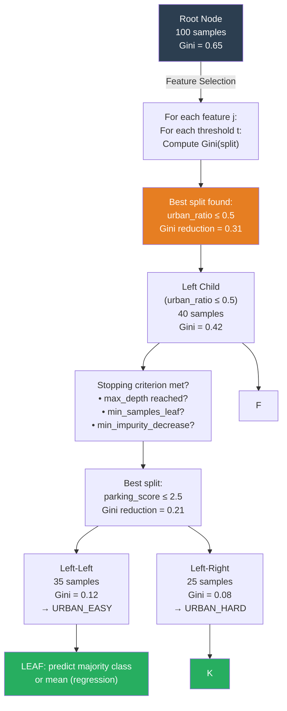
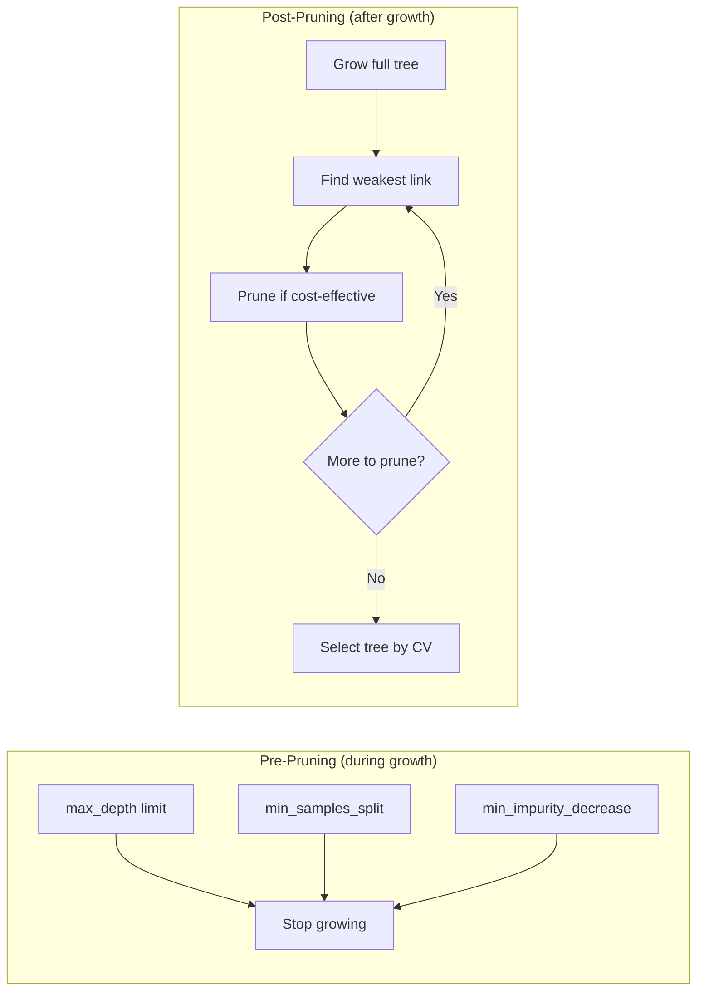

# Decision Trees - Complete Interview Guide

> Decision trees are the foundation of the most powerful tabular ML algorithms in production: Random Forest, XGBoost, LightGBM, and CatBoost. Understanding the tree construction algorithm, splitting criteria, and pruning is essential before tackling ensemble methods.

---

## Table of Contents
1. [Information Theory Foundations](#information-theory)
2. [Tree Construction Algorithms: ID3, C4.5, CART](#algorithms)
3. [Splitting Criteria: Classification](#classification-splits)
4. [Regression Trees](#regression-trees)
5. [Stopping Criteria and Pruning](#pruning)
6. [Feature Importance in Trees](#feature-importance)
7. [Strengths and Weaknesses](#strengths-weaknesses)
8. [Logistics Use Case: Route Classification](#use-case)
9. [Mermaid Diagram: Tree Splitting Process](#diagram)
10. [Code Examples](#code)
11. [Interview Questions](#interview-questions)

---

## 1. Information Theory Foundations {#information-theory}

### Entropy

**Shannon Entropy** measures the expected amount of information (surprise) in a random variable's outcome:

```
H(Y) = -Σₖ p(Y=k) log₂ p(Y=k)
```

**Properties:**
- H(Y) = 0: Perfect predictability (all observations in one class) — no surprise
- H(Y) = log₂(K): Maximum uncertainty for K equally probable classes
- For binary classification: H = -p log₂(p) - (1-p) log₂(1-p)
  - Maximum at p = 0.5: H = 1 bit (maximum uncertainty)
  - At p = 0 or p = 1: H = 0 (pure node)

**Intuition:** A fair coin has entropy 1 bit (you need 1 bit to encode the outcome). A biased coin (90% heads) has lower entropy — you're less surprised by heads.

### Conditional Entropy

Given a split on feature X into two subsets L (left) and R (right):

```
H(Y | X) = (nL/n) H(YL) + (nR/n) H(YR)
```

The weighted average entropy of the children, weighted by their sample proportions.

### Information Gain

How much does splitting on X reduce uncertainty?

```
IG(Y, X) = H(Y) - H(Y | X)
         = H(Y) - [(nL/n) H(YL) + (nR/n) H(YR)]
```

We want to find the split (feature + threshold) that **maximizes Information Gain** — the reduction in entropy.

**Example (binary classification, n=100, 50 positive, 50 negative):**
- Parent entropy: H = -0.5 log₂(0.5) - 0.5 log₂(0.5) = 1.0 bit
- Split A: Left(40+, 10-), Right(10+, 40-)
  - H(left) = -0.8 log₂(0.8) - 0.2 log₂(0.2) = 0.722 bits
  - H(right) = 0.722 bits
  - IG_A = 1.0 - 0.5(0.722) - 0.5(0.722) = 0.278 bits
- Split B: Left(50+, 0-), Right(0+, 50-)
  - H(left) = H(right) = 0 bits
  - IG_B = 1.0 - 0 = 1.0 bits ← perfect split!

### Gini Impurity

An alternative to entropy, computationally simpler (no logarithms):

```
Gini(Y) = 1 - Σₖ p(Y=k)²  = Σₖ p(Y=k)(1 - p(Y=k))
```

**Properties:**
- Gini = 0: Pure node (all one class)
- Gini = 0.5: Maximum impurity for binary classification (p = 0.5)
- Gini = (K-1)/K: Maximum for K classes

**Gini split criterion:**
```
Gini_split(Y, X) = (nL/n) Gini(YL) + (nR/n) Gini(YR)
```

Minimize the weighted Gini after the split.

### Entropy vs Gini: Which to Use?

| Property | Entropy | Gini |
|----------|---------|------|
| Computational cost | Slightly higher (log computations) | Lower |
| Sensitivity to pure nodes | Creates exactly 0 at pure nodes | Also 0 at pure nodes |
| Split behavior | Slightly different due to shape | — |
| Default in sklearn | Gini (criterion='gini') | — |
| Theoretical justification | Information theory | Probability of misclassification |

**In practice:** Entropy and Gini give nearly identical results. The choice rarely matters. Use entropy when theoretical grounding matters; Gini for speed.

### Information Gain Ratio (GainRatio)

**Problem with IG:** Biased toward features with many unique values (e.g., a unique ID feature splits perfectly, IG = 1, but it's useless for generalization).

**Gain Ratio (C4.5):**
```
GainRatio(Y, X) = IG(Y, X) / H(X)
```

Where `H(X) = -Σⱼ (nⱼ/n) log₂(nⱼ/n)` is the entropy of the split itself. Features with many splits have high H(X), which penalizes their Gain Ratio.

---

## 2. Tree Construction Algorithms: ID3, C4.5, CART {#algorithms}

### Algorithm Comparison

| Property | ID3 | C4.5 | CART |
|----------|-----|------|------|
| Year | 1986 | 1993 | 1984 |
| Split criterion | Information Gain | Gain Ratio | Gini / MSE |
| Feature types | Categorical only | Categorical + continuous | Both |
| Missing values | Cannot handle | Fractional assignment | Surrogate splits |
| Pruning | None | Post-pruning (error-based) | Cost-complexity |
| Tree type | Multi-way | Multi-way | Binary only |
| Used in | Historical | Weka, some research | sklearn, XGBoost base |

**CART (Classification and Regression Trees)** is the most important for modern ML:
- Always binary splits (`feature ≤ threshold` vs `feature > threshold`)
- For classification: minimizes Gini impurity
- For regression: minimizes MSE (or MAE)
- Finds the globally optimal binary split at each node (greedy)

### CART Algorithm (Pseudocode)

```
CART_BUILD(data D, features F, max_depth, min_samples):
    if STOPPING_CRITERION(D, max_depth, min_samples):
        return LEAF_NODE(majority_class(D) or mean(D))

    best_feature, best_threshold = None, None
    best_impurity = ∞

    for feature j in F:
        for threshold t in CANDIDATE_THRESHOLDS(D, j):
            DL = D[D[j] <= t]
            DR = D[D[j] > t]
            impurity = (|DL|/|D|) × Gini(DL) + (|DR|/|D|) × Gini(DR)
            if impurity < best_impurity:
                best_feature, best_threshold, best_impurity = j, t, impurity

    DL = D[D[best_feature] <= best_threshold]
    DR = D[D[best_feature] > best_threshold]

    left_subtree  = CART_BUILD(DL, F, max_depth-1, min_samples)
    right_subtree = CART_BUILD(DR, F, max_depth-1, min_samples)

    return INTERNAL_NODE(best_feature, best_threshold, left_subtree, right_subtree)
```

### Finding Optimal Thresholds

For a continuous feature with n values, naively checking all n-1 midpoints is O(n). CART optimizes this:
1. Sort values: O(n log n)
2. Sweep through sorted values, maintaining running counts: O(n)
3. Only consider thresholds between different class labels (for classification)
4. Total per feature per node: O(n log n)
5. Total tree construction: O(p × n log n × number of nodes) = O(p × n² log n) worst case

**Candidate thresholds:** Only midpoints between adjacent distinct values need to be considered. This is because the optimal threshold for any feature is always one of these midpoints.

---

## 3. Splitting Criteria: Classification {#classification-splits}

### Detailed Gini Computation Example

**Node:** 100 samples, 3 classes: A(40), B(35), C(25)

```
Gini = 1 - [(40/100)² + (35/100)² + (25/100)²]
     = 1 - [0.16 + 0.1225 + 0.0625]
     = 1 - 0.345
     = 0.655
```

**Split on Feature X ≤ 5:**
- Left (60 samples): A(38), B(12), C(10)
  - Gini_L = 1 - [(38/60)² + (12/60)² + (10/60)²] = 1 - [0.401 + 0.04 + 0.028] = 0.531
- Right (40 samples): A(2), B(23), C(15)
  - Gini_R = 1 - [(2/40)² + (23/40)² + (15/40)²] = 1 - [0.0025 + 0.33 + 0.141] = 0.527

**Weighted Gini after split:** (60/100)(0.531) + (40/100)(0.527) = 0.319 + 0.211 = 0.530

**Gini reduction:** 0.655 - 0.530 = 0.125

We compare this across all features and thresholds, selecting the split with maximum Gini reduction.

### Impurity Measures Compared

```
         1.0 ┤                 ░░
             │              ░░░  ░░░
             │           ░░░       ░░░  ← Entropy (scaled)
             │        ░░░             ░░░
    0.5 ──── ┤ ─ ─ ─░─ ─ ─ ─ ─ ─ ─ ─░─ ─ ─── Gini max
             │     ░░░                 ░░░
             │   ░░░                     ░░░
             │ ░░░                         ░░░
         0.0 ┼─────────────────────────────────
             0.0       0.5             1.0
                   p (probability of positive class)
```

Entropy and Gini both achieve maximum at p=0.5 and zero at p=0 or p=1. Entropy is slightly more "curved" (penalizes impurity more at intermediate values).

---

## 4. Regression Trees {#regression-trees}

For regression (continuous y), CART replaces Gini with variance reduction:

**Impurity measure:** Variance of y in node:
```
MSE(D) = (1/|D|) Σᵢ∈D (yᵢ - ȳ_D)²
```

**Split criterion:** Find split minimizing:
```
(|DL|/|D|) MSE(DL) + (|DR|/|D|) MSE(DR)
```

**Leaf prediction:** Mean of y values in the leaf node.

**Example:** Predicting shipment weight from dimensions.
- Root node: MSE = 25 kg² (variance of all weights)
- Best split: `volume > 50,000 cm³`
  - Left (small packages): MSE_L = 4 kg²
  - Right (large packages): MSE_R = 8 kg²
  - Weighted: (0.6)(4) + (0.4)(8) = 2.4 + 3.2 = 5.6 kg²
  - Variance reduction: 25 - 5.6 = 19.4 kg² ← excellent split!

**Deeper trees for regression:**
- Each leaf covers a local region of feature space
- Leaf prediction is the local mean
- A very deep tree essentially does nearest-neighbor interpolation
- Risk: overfitting → high variance

---

## 5. Stopping Criteria and Pruning {#pruning}

### Pre-Pruning (Stopping Criteria)

Stop growing the tree before it fully fits the training data:

| Hyperparameter | Effect | Typical Values |
|----------------|--------|----------------|
| `max_depth` | Maximum path from root to leaf | 3-15 |
| `min_samples_split` | Min samples to split a node | 10-100 |
| `min_samples_leaf` | Min samples in each child | 5-50 |
| `min_impurity_decrease` | Min Gini/entropy reduction to split | 0.001-0.01 |
| `max_features` | Features considered per split | sqrt(p), log2(p) |
| `max_leaf_nodes` | Maximum total leaves | 10-100 |

**How to set them:** Cross-validation. Generally:
- Start with depth 3-5 to visualize and understand the tree
- For production use in an ensemble, use deeper trees (depth 6-10)
- `min_samples_leaf` is often more interpretable than `max_depth`

### Post-Pruning (Cost-Complexity Pruning)

CART's **cost-complexity pruning** (also called weakest link pruning):

**Objective:** Find the subtree `T` of the full tree `T_full` that minimizes:
```
C_α(T) = RSS(T) + α × |T|
```

Where `|T|` = number of leaves, α = regularization parameter (the "complexity parameter" or `ccp_alpha` in sklearn).

**Algorithm:**
1. Grow the full tree `T_full`
2. For the weakest internal node (the one whose pruning causes smallest increase in RSS per leaf removed):
   ```
   g(t) = (RSS(T with t pruned) - RSS(T)) / (|T| - |T with t pruned|)
   ```
3. Prune this node, repeat
4. This generates a sequence of progressively smaller trees
5. Use cross-validation to select the best α

**Key insight:** Post-pruning often produces better results than pre-pruning because it sees the full tree and makes globally informed pruning decisions.

### Reduced-Error Pruning (C4.5)

Simpler approach:
1. Hold out a validation set
2. For each internal node (bottom-up):
   - Compare accuracy of subtree vs. replacing node with leaf
   - Prune if leaf ≥ subtree accuracy
3. Repeat until no improvement

---

## 6. Feature Importance in Trees {#feature-importance}

### Mean Decrease in Impurity (MDI)

The default sklearn feature importance:

```
Importance(j) = Σ_{splits using feature j} [nNode/nTotal × (impurity_parent - wL × impurity_L - wR × impurity_R)]
```

Sums the (weighted) impurity reduction from all splits that use feature j.

**Advantages:**
- Fast to compute (already computed during training)
- No additional data needed

**Disadvantages (critical for interviews):**
- **Biased toward high-cardinality features:** A continuous feature with many unique values gets more split opportunities than a binary feature → inflated importance.
- **Not robust:** Can be unstable across random seeds.
- **Measured on training data:** Doesn't reflect out-of-sample importance.

### Permutation Importance (MDA - Mean Decrease in Accuracy)

The preferred method for model interpretation:

1. Compute baseline metric on validation set
2. For each feature j:
   a. Randomly shuffle feature j (break its relationship with y)
   b. Compute metric with shuffled feature j
   c. Importance = baseline - shuffled performance
3. Average over multiple shuffles

**Advantages:**
- Unbiased: Same scaling for all features
- Measures out-of-sample importance
- Works with any model, not just trees

**Disadvantages:**
- Computationally expensive
- Can be misleading with correlated features (shuffling X₁ is less impactful if X₂ is correlated and still present)

### SHAP Values

Best practice for modern model interpretation. SHAP (SHapley Additive exPlanations) values decompose predictions:

```
f(x) = E[f(X)] + Σⱼ φⱼ(x)
```

Where `φⱼ` is the contribution of feature j to this specific prediction. SHAP is the only feature importance method satisfying all axioms: efficiency, symmetry, dummy, and additivity.

TreeSHAP computes exact Shapley values for tree ensembles in polynomial time.

---

## 7. Strengths and Weaknesses {#strengths-weaknesses}

### Strengths

| Strength | Why It Matters |
|----------|----------------|
| Interpretability | White-box model; can explain any prediction |
| No feature scaling needed | Distance-based metrics don't apply |
| Handles mixed types | Can split on both continuous and categorical (ordinal) |
| Handles nonlinear relationships | Axis-aligned splits can approximate nonlinearity |
| Handles interactions | Natural through successive splits |
| Robust to outliers in X | Splits are rank-based, not distance-based |
| Missing values (some implementations) | Surrogate splits in CART |
| Fast prediction | O(depth) = O(log n) per sample |

### Weaknesses

| Weakness | Why It Matters | Fix |
|----------|----------------|-----|
| High variance | Small data changes → very different tree | Ensembles (Random Forest) |
| Biased toward features with more levels | MDI importance is biased | Permutation importance, SHAP |
| Cannot extrapolate | Predictions bounded by training y range | Boost tree with linear leaf |
| Axis-aligned boundaries only | Cannot find diagonal boundaries efficiently | Random Forest or many splits |
| Discontinuous predictions | Step functions, not smooth | Smooth alternatives |
| Global optimum not guaranteed | Greedy splits, not globally optimal | Expensive alternatives exist |
| Overfitting with deep trees | High variance | Pruning, early stopping, ensembles |

---

## 8. Logistics Use Case: Route Classification {#use-case}

**Problem:** Classify delivery routes into categories: URBAN_EASY, URBAN_HARD, RURAL_EASY, RURAL_HARD for driver assignment and vehicle selection.

**Features:**
- `distance_km`: Total route distance
- `num_stops`: Number of delivery stops
- `avg_stop_distance_km`: Average distance between stops
- `urban_ratio`: Fraction of stops in urban areas
- `parking_difficulty_score`: 1-5 scale
- `package_weight_avg_kg`: Average package weight

**A shallow decision tree provides a transparent decision rule:**

```
ROOT: urban_ratio <= 0.5?
├── YES (Rural): avg_stop_distance_km <= 3.0?
│   ├── YES (Rural, dense): → RURAL_EASY
│   └── NO (Rural, spread out): distance_km <= 100?
│       ├── YES: → RURAL_EASY
│       └── NO: → RURAL_HARD
└── NO (Urban): parking_difficulty_score <= 2.5?
    ├── YES (Easy parking): → URBAN_EASY
    └── NO (Hard parking): num_stops <= 15?
        ├── YES: → URBAN_HARD (manageable)
        └── NO: → URBAN_HARD (high difficulty)
```

**Why a decision tree here?**
- Dispatchers need to understand the routing logic (interpretability)
- Features have natural threshold semantics (urban/rural boundary makes intuitive sense)
- Business rules can be validated against existing human expertise
- Easy to update one branch without retraining the entire model

---

## 9. Mermaid Diagram: Tree Splitting Process {#diagram}





---

## 10. Code Examples {#code}

### Complete Decision Tree Pipeline

```python
import numpy as np
import pandas as pd
import matplotlib.pyplot as plt
from sklearn.tree import DecisionTreeClassifier, DecisionTreeRegressor, export_text, plot_tree
from sklearn.model_selection import train_test_split, cross_val_score, GridSearchCV
from sklearn.metrics import classification_report, confusion_matrix
from sklearn.inspection import permutation_importance
import warnings
warnings.filterwarnings('ignore')

# ──────────────────────────────────────────────
# 1. Generate logistics route data
# ──────────────────────────────────────────────
np.random.seed(42)
n = 1000

# Features
distance_km = np.random.exponential(50, n)
num_stops   = np.random.poisson(12, n)
urban_ratio = np.random.beta(2, 2, n)
parking_score = np.random.uniform(1, 5, n)
avg_package_weight = np.random.exponential(5, n)

# Route classification: 0=URBAN_EASY, 1=URBAN_HARD, 2=RURAL_EASY, 3=RURAL_HARD
labels = []
for i in range(n):
    if urban_ratio[i] > 0.5:      # Urban
        if parking_score[i] < 2.5:
            labels.append(0)      # URBAN_EASY
        else:
            labels.append(1)      # URBAN_HARD
    else:                          # Rural
        if distance_km[i] < 60:
            labels.append(2)      # RURAL_EASY
        else:
            labels.append(3)      # RURAL_HARD

labels = np.array(labels)
# Add some noise
noise_idx = np.random.choice(n, size=int(0.1*n), replace=False)
labels[noise_idx] = np.random.randint(0, 4, size=len(noise_idx))

df = pd.DataFrame({
    'distance_km': distance_km,
    'num_stops': num_stops,
    'urban_ratio': urban_ratio,
    'parking_score': parking_score,
    'avg_package_weight': avg_package_weight,
    'route_type': labels
})

class_names = ['URBAN_EASY', 'URBAN_HARD', 'RURAL_EASY', 'RURAL_HARD']
feature_names = ['distance_km', 'num_stops', 'urban_ratio', 'parking_score', 'avg_package_weight']

X = df[feature_names].values
y = df['route_type'].values

X_train, X_test, y_train, y_test = train_test_split(X, y, test_size=0.2, stratify=y, random_state=42)

# ──────────────────────────────────────────────
# 2. Train unpruned tree (baseline, will overfit)
# ──────────────────────────────────────────────
tree_full = DecisionTreeClassifier(criterion='gini', random_state=42)
tree_full.fit(X_train, y_train)

print("Full (unpruned) tree:")
print(f"  Train accuracy: {tree_full.score(X_train, y_train):.4f}")
print(f"  Test accuracy:  {tree_full.score(X_test, y_test):.4f}")
print(f"  Max depth:      {tree_full.get_depth()}")
print(f"  Total leaves:   {tree_full.get_n_leaves()}")

# ──────────────────────────────────────────────
# 3. Cost-complexity pruning path
# ──────────────────────────────────────────────
path = tree_full.cost_complexity_pruning_path(X_train, y_train)
ccp_alphas = path.ccp_alphas[:-1]  # Exclude trivial root tree

train_accs, test_accs, n_leaves = [], [], []
for alpha in ccp_alphas:
    t = DecisionTreeClassifier(criterion='gini', ccp_alpha=alpha, random_state=42)
    t.fit(X_train, y_train)
    train_accs.append(t.score(X_train, y_train))
    test_accs.append(t.score(X_test, y_test))
    n_leaves.append(t.get_n_leaves())

# Find optimal alpha
best_alpha = ccp_alphas[np.argmax(test_accs)]
print(f"\nOptimal ccp_alpha (post-pruning): {best_alpha:.6f}")

fig, axes = plt.subplots(1, 2, figsize=(12, 4))
axes[0].plot(ccp_alphas, train_accs, label='Train', marker='o', markersize=3)
axes[0].plot(ccp_alphas, test_accs, label='Test', marker='o', markersize=3)
axes[0].set_xlabel('ccp_alpha')
axes[0].set_ylabel('Accuracy')
axes[0].set_title('Accuracy vs Alpha (Cost-Complexity Pruning)')
axes[0].legend()
axes[0].axvline(x=best_alpha, color='red', linestyle='--', label=f'Best α={best_alpha:.4f}')

axes[1].plot(ccp_alphas, n_leaves, marker='o', markersize=3, color='green')
axes[1].set_xlabel('ccp_alpha')
axes[1].set_ylabel('Number of Leaves')
axes[1].set_title('Tree Size vs Alpha')
plt.tight_layout()
plt.savefig('pruning_path.png', dpi=150, bbox_inches='tight')

# ──────────────────────────────────────────────
# 4. Best pruned tree
# ──────────────────────────────────────────────
tree_pruned = DecisionTreeClassifier(
    criterion='gini',
    ccp_alpha=best_alpha,
    random_state=42
)
tree_pruned.fit(X_train, y_train)

print("\nPruned tree:")
print(f"  Train accuracy: {tree_pruned.score(X_train, y_train):.4f}")
print(f"  Test accuracy:  {tree_pruned.score(X_test, y_test):.4f}")
print(f"  Max depth:      {tree_pruned.get_depth()}")
print(f"  Total leaves:   {tree_pruned.get_n_leaves()}")

print("\nClassification Report (Pruned Tree):")
y_pred = tree_pruned.predict(X_test)
print(classification_report(y_test, y_pred, target_names=class_names))

# ──────────────────────────────────────────────
# 5. Tree text representation
# ──────────────────────────────────────────────
print("\nTree Structure:")
print(export_text(tree_pruned, feature_names=feature_names))

# ──────────────────────────────────────────────
# 6. Tree visualization
# ──────────────────────────────────────────────
fig, ax = plt.subplots(figsize=(20, 10))
plot_tree(
    tree_pruned,
    feature_names=feature_names,
    class_names=class_names,
    filled=True,
    rounded=True,
    fontsize=10,
    ax=ax
)
plt.title('Pruned Decision Tree: Route Classification')
plt.savefig('decision_tree_visualization.png', dpi=150, bbox_inches='tight')

# ──────────────────────────────────────────────
# 7. Feature importance comparison: MDI vs Permutation
# ──────────────────────────────────────────────
# MDI importance (built-in)
mdi_importance = tree_pruned.feature_importances_

# Permutation importance
perm_result = permutation_importance(
    tree_pruned, X_test, y_test,
    n_repeats=30, random_state=42, scoring='accuracy'
)
perm_importance = perm_result.importances_mean
perm_std = perm_result.importances_std

importance_df = pd.DataFrame({
    'Feature': feature_names,
    'MDI Importance': mdi_importance.round(4),
    'Permutation Importance': perm_importance.round(4),
    'Perm Std': perm_std.round(4)
}).sort_values('MDI Importance', ascending=False)

print("\nFeature Importance Comparison:")
print(importance_df.to_string(index=False))

# ──────────────────────────────────────────────
# 8. Hyperparameter optimization with GridSearch
# ──────────────────────────────────────────────
param_grid = {
    'max_depth': [2, 3, 4, 5, 6, 8, 10, None],
    'min_samples_leaf': [1, 5, 10, 20, 50],
    'criterion': ['gini', 'entropy']
}

grid_search = GridSearchCV(
    DecisionTreeClassifier(random_state=42),
    param_grid,
    cv=5,
    scoring='accuracy',
    n_jobs=-1
)
grid_search.fit(X_train, y_train)

print(f"\nBest hyperparameters: {grid_search.best_params_}")
print(f"Best CV accuracy:     {grid_search.best_score_:.4f}")
print(f"Test accuracy:        {grid_search.best_estimator_.score(X_test, y_test):.4f}")

# ──────────────────────────────────────────────
# 9. Regression Tree Example
# ──────────────────────────────────────────────
# Predict delivery time from route features
y_reg = 20 + 0.3 * distance_km[:n] + 2 * num_stops[:n] - 3 * urban_ratio[:n] + np.random.normal(0, 5, n)
X_reg_train, X_reg_test, y_reg_train, y_reg_test = train_test_split(X, y_reg, test_size=0.2, random_state=42)

tree_reg = DecisionTreeRegressor(max_depth=5, min_samples_leaf=10, random_state=42)
tree_reg.fit(X_reg_train, y_reg_train)

y_reg_pred = tree_reg.predict(X_reg_test)
rmse = np.sqrt(np.mean((y_reg_test - y_reg_pred)**2))
mae  = np.mean(np.abs(y_reg_test - y_reg_pred))
r2   = 1 - np.sum((y_reg_test - y_reg_pred)**2) / np.sum((y_reg_test - y_reg_test.mean())**2)

print(f"\nRegression Tree (delivery time prediction):")
print(f"  RMSE: {rmse:.2f} minutes")
print(f"  MAE:  {mae:.2f} minutes")
print(f"  R²:   {r2:.4f}")
```

---

## 11. Interview Questions {#interview-questions}

### Q1: "When would you prefer a decision tree over logistic regression?"

**Answer framework:**

Prefer **decision trees** when:
1. **Nonlinear decision boundaries:** Features interact multiplicatively (e.g., "package is heavy AND fragile AND oversized" → special handling). Trees naturally capture interaction terms; logistic regression requires manually adding them.
2. **Mixed feature types:** You have numerical and categorical features with complex ordinal relationships. Trees split on thresholds without needing encoding.
3. **Interpretability for non-technical stakeholders:** Dispatchers and operations staff can follow a tree's decision logic ("if urban_ratio > 0.5 AND parking_score > 3...") but may struggle with logistic regression coefficients and log-odds.
4. **Missing values:** Some tree implementations handle missing values directly via surrogate splits.
5. **Features have natural threshold semantics:** When the domain suggests clear cut-points (a weight above 30 kg requires a lift gate).

Prefer **logistic regression** when:
1. You need probability calibration
2. The relationship is approximately linear in log-odds
3. You have a very large dataset and need fast training
4. You need coefficient significance testing (p-values)

**The honest answer:** In production, neither alone is used for tabular data — ensemble methods (XGBoost, LightGBM, Random Forest) nearly always outperform a single tree or logistic regression on structured data.

### Q2: "What is the effect of max_depth on bias and variance?"

**Answer:**

- **max_depth = 1 (stump):** Very high bias, low variance. Can only make one binary decision — too simple for most problems.
- **max_depth = 3-5:** Moderate bias, moderate variance. Often interpretable and captures main effects and a few interactions.
- **max_depth = 10-15:** Low bias, high variance. Likely overfitting training data. Good as base learners in ensembles (where variance is averaged out).
- **max_depth = None (unlimited):** Near-zero training error (pure leaves), very high variance. Only appropriate as base learners in strong regularized ensembles.

**Mathematical connection to bias-variance tradeoff:**
```
Test MSE = Bias²(depth) + Variance(depth) + σ²
```
- As depth increases, bias decreases (better fit to true function)
- As depth increases, variance increases (more sensitive to training data)
- Optimal depth is where the sum is minimized

### Q3: "Explain information gain and why it can be misleading."

**Answer:** Information gain measures how much a split reduces entropy (uncertainty) in the target variable. The issue: IG is biased toward features with many unique values. Consider:
- Feature A: Customer ID (10,000 unique values) → IG ≈ 1.0 (perfect split, useless)
- Feature B: Time window category (4 values) → IG ≈ 0.3 (useful signal)

Customer ID achieves near-perfect IG by splitting each observation into its own leaf — but it memorizes, doesn't generalize.

**Solution:** Use Gain Ratio (C4.5) which normalizes by H(X) — features with many splits have high H(X), reducing their adjusted gain.

**Or:** Use Gini impurity, which is slightly less biased toward high-cardinality features. But the better solution is to never give the tree access to ID-type features in the first place, and use proper cross-validation.

### Q4: "How does CART handle continuous features?"

**Answer:** CART sorts the unique values of each continuous feature, then evaluates candidate thresholds between consecutive distinct values. For a feature with n unique values, there are n-1 possible thresholds. Sorting costs O(n log n) per feature per node. For a continuous feature with 1000 samples, CART evaluates up to 999 thresholds.

**Optimization:** Only consider thresholds between points of different class labels (in classification). If 10 consecutive sorted points all have class A, there's no useful split among them — you can skip 9 of those 10 midpoints.

**This is why:**
- Tree training is O(p × n log n) per node
- For deep trees with n nodes total, training is O(p × n² log n) worst case
- LightGBM's histogram-based approach reduces this to O(p × n × bins) with fixed bins (typically 256)

### Q5: "What is the difference between pre-pruning and post-pruning? Which is better?"

**Answer:**

**Pre-pruning** (early stopping): Stop growing when a criterion is met (max_depth, min_samples_leaf). Fast but can miss important splits that appear later. "Greedy" - can't look ahead.

**Post-pruning** (cost-complexity): Grow the full tree, then prune back. Can consider the entire tree context when making pruning decisions. Generally produces better results because:
- Can see all possible splits before deciding which to prune
- Makes globally informed decisions (not just local greedy decisions)
- CART's cost-complexity pruning generates a nested sequence of trees and selects the best via CV

**Why post-pruning wins in theory:** Pre-pruning can miss a split that looks bad individually but enables a much better split in the next level (the "complementary splits" problem). Post-pruning doesn't have this limitation.

**In practice:** For single trees, post-pruning is preferred. For ensemble base learners, shallow pre-pruning (max_depth = 4-8) is used for speed since variance is handled by the ensemble.

### Q6: "Why is feature importance from decision trees biased?"

**Answer:** Mean Decrease in Impurity (MDI) feature importance is biased toward:
1. **High-cardinality features:** Features with more unique values get more chances to split, systematically receiving higher importance scores. A random ID feature often appears important.
2. **Features used early (near root):** These receive higher importance because they affect more samples.
3. **Training data:** MDI is computed on training data, not validation data — it measures what the tree used, not what's actually useful for generalization.

**The fix:** Permutation importance (sklearn's `permutation_importance`):
- Shuffle each feature on held-out validation data
- Importance = performance decrease when feature is shuffled
- Unbiased to cardinality
- Measures generalization importance, not training importance
- More computationally expensive

**Best practice:** Use SHAP values for production feature importance analysis. TreeSHAP provides locally accurate decompositions that are both unbiased and additive.

---

## Summary Cheat Sheet

| Concept | Key Formula/Rule | When Critical |
|---------|-----------------|---------------|
| Entropy | `-Σ p log₂ p` | Understanding IG |
| Gini Impurity | `1 - Σ p²` | CART classification splits |
| Information Gain | `H(parent) - Σ wᵢH(childᵢ)` | ID3 splitting |
| Gain Ratio | `IG / H(feature)` | C4.5, high-cardinality features |
| MSE split | `n_L × MSE_L + n_R × MSE_R` | Regression trees |
| Complexity | `C_α = RSS + α × |leaves|` | Post-pruning |
| MDI importance | `Σ_{splits j} Δimpurity` | Default sklearn |
| Permutation importance | `Δmetric when feature shuffled` | Production importance |

---

*Next: [Ensemble Methods](./ensemble_methods.md) - Random Forest, XGBoost, LightGBM, CatBoost*
