# Ensemble Methods - Complete Interview Guide

> Ensemble methods consistently dominate tabular ML competitions and production systems. XGBoost, LightGBM, and Random Forest are the most commonly deployed algorithms. Understanding the mathematical differences—not just the API—is expected at the senior level.

---

## Table of Contents
1. [Ensemble Theory: Why Combining Works](#ensemble-theory)
2. [Bagging](#bagging)
3. [Random Forest](#random-forest)
4. [Boosting Theory](#boosting-theory)
5. [AdaBoost](#adaboost)
6. [Gradient Boosting](#gradient-boosting)
7. [XGBoost](#xgboost)
8. [LightGBM](#lightgbm)
9. [CatBoost](#catboost)
10. [Comparison Table](#comparison-table)
11. [Stacking and Blending](#stacking)
12. [Logistics Use Case: Demand Forecasting](#use-case)
13. [Code Examples](#code)
14. [Interview Questions](#interview-questions)

---

## 1. Ensemble Theory: Why Combining Works {#ensemble-theory}

### Bias-Variance Decomposition for Ensembles

For a single model, the expected test error decomposes as:
```
E[(y - f̂(x))²] = Bias²(f̂) + Var(f̂) + σ²
```

**For an ensemble of M models:**
```
f̂_ensemble(x) = (1/M) Σᵢ fᵢ(x)
```

**If models are identically distributed with variance σ² and pairwise correlation ρ:**
```
Var(f̂_ensemble) = ρσ² + (1-ρ)σ²/M
```

**Key insight:**
- **First term** `ρσ²`: Irreducible correlation floor — can't go below this no matter how many models
- **Second term** `(1-ρ)σ²/M`: Goes to 0 as M → ∞

**Therefore:**
- With ρ = 1 (identical models): No variance reduction from ensembling (useless)
- With ρ = 0 (independent models): Variance reduces as 1/M (unlimited improvement)
- Goal: Make models as **diverse** and **accurate** as possible

This motivates two strategies:
1. **Bagging:** Diversity through different training subsets (reduces correlation)
2. **Boosting:** Each model corrects predecessors' errors (reduces bias)

### Bias Reduction vs. Variance Reduction

| Method | Primary Effect | Mechanism |
|--------|---------------|-----------|
| Bagging | Variance reduction | Average uncorrelated predictions |
| Boosting | Bias reduction | Sequential error correction |
| Stacking | Both | Meta-learner captures residual patterns |

---

## 2. Bagging (Bootstrap AGGregation) {#bagging}

### Bootstrap Sampling

For a dataset D with n observations:
1. Sample n observations **with replacement** → bootstrap sample D*
2. Each original observation appears ~63.2% of the time on average
3. Remaining ~36.8% are **out-of-bag (OOB)** samples

**Why 63.2%?** The probability of not being selected in n draws from n observations:
```
P(not selected) = (1 - 1/n)^n → e^(-1) ≈ 0.368 as n → ∞
P(selected at least once) ≈ 0.632
```

### Bagging Algorithm

```
BAGGING(data D, M models):
    for m = 1 to M:
        D_m = BOOTSTRAP(D)          # sample with replacement
        f_m = TRAIN(model, D_m)     # fit base learner on bootstrap sample

    f_ensemble(x) = (1/M) Σₘ fₘ(x)    # regression: average
                  = MAJORITY_VOTE(fₘ(x))  # classification: vote
```

### Variance Reduction Intuition

Why does averaging independent noisy estimators reduce variance?

If `f₁, ..., fₘ` are i.i.d. with mean μ and variance σ²:
```
Var((1/M) Σᵢ fᵢ) = σ²/M
```

Bootstrapping creates approximately independent samples from the same distribution. Each bootstrap model has similar bias but different variance. Averaging reduces variance by ~1/M (reduced by correlation).

---

## 3. Random Forest {#random-forest}

Random Forest extends bagging with an additional decorrelation mechanism: **random feature subsampling**.

### Algorithm

```
RANDOM_FOREST(data D, M trees, mtry features):
    for m = 1 to M:
        D_m = BOOTSTRAP(D)
        Build tree T_m with CART:
            At EACH SPLIT: sample mtry features randomly
            Find best split among only those mtry features

    f_RF(x) = (1/M) Σₘ Tₘ(x)     # regression
            = MAJORITY_VOTE(Tₘ(x)) # classification
```

**Feature subsampling (mtry):**
- Default for classification: `mtry = √p`
- Default for regression: `mtry = p/3`
- Range: 1 (maximum randomness) to p (equals bagging)

**Why feature subsampling helps more than bagging alone:**
- Without feature subsampling, all trees tend to split on the same strong features near the root → highly correlated trees
- With feature subsampling, strong features are excluded from some splits, giving weaker features chances to create splits → lower correlation between trees
- Lower correlation → larger variance reduction from averaging

### Out-of-Bag (OOB) Error

Because each tree is trained on ~63.2% of data, the remaining ~36.8% OOB observations can be used for evaluation:

```
OOB_error(xᵢ) = AVERAGE({fₘ(xᵢ) : m such that xᵢ ∉ D_m})
```

**OOB error is a free cross-validation estimate** — no separate validation set needed!

Properties:
- Approximately equivalent to n-fold cross-validation
- Slightly pessimistic (each observation is OOB for ~37% of trees, not all M)
- Useful for monitoring training progress and early stopping

### Random Forest Hyperparameters

| Parameter | Effect | Typical Values |
|-----------|--------|----------------|
| `n_estimators` | More trees = lower variance, diminishing returns | 100-1000 |
| `max_depth` | Depth of each tree; None = full tree | 10-None |
| `min_samples_leaf` | Prevents tiny leaves | 1-10 |
| `max_features` | mtry; lower = more randomness, less correlation | 'sqrt', 'log2', 0.3-0.8 |
| `bootstrap` | Use bagging or full data | True |
| `oob_score` | Enable OOB evaluation | True |
| `max_samples` | Subsample fraction | 0.5-1.0 |

### Feature Importance in Random Forest

**MDI:** Average over all trees of the impurity reduction at splits using feature j.

**MDI limitations** (same as single tree, amplified by scale):
- Biased toward high-cardinality features
- Computed on training data

**Recommendation:** Use `permutation_importance` or SHAP for production feature analysis.

---

## 4. Boosting Theory {#boosting-theory}

Boosting builds an **additive model** sequentially:

```
F_M(x) = Σₘ₌₁^M αₘ fₘ(x)
```

Each new model `fₘ` focuses on the **errors** of the previous ensemble `F_{m-1}`.

**Key distinction from bagging:**
- Bagging: Parallel, independent learners, equal weights
- Boosting: Sequential, dependent learners, adaptive weights or additive residuals

**Why boosting reduces bias:**
The final model is a weighted sum of many "weak learners" (usually shallow trees). While each individual tree has high bias (simple model), the sequential correction mechanism enables the ensemble to approximate complex functions with low bias.

---

## 5. AdaBoost {#adaboost}

### Algorithm

```
ADABOOST(data {(xᵢ, yᵢ)}, M boosting rounds):
    Initialize weights: wᵢ = 1/n for all i

    for m = 1 to M:
        1. Fit classifier fₘ to (X, y) weighted by w
        2. Compute weighted error:
           εₘ = Σᵢ wᵢ × 𝟙[yᵢ ≠ fₘ(xᵢ)] / Σᵢ wᵢ
        3. Compute model weight:
           αₘ = (1/2) log((1 - εₘ) / εₘ)
        4. Update sample weights:
           wᵢ ← wᵢ × exp(-αₘ yᵢ fₘ(xᵢ))
           Normalize: wᵢ ← wᵢ / Σⱼ wⱼ

    F(x) = sign(Σₘ αₘ fₘ(x))
```

**Intuition:**
- Correctly classified samples: weights decrease (model already handles these)
- Misclassified samples: weights increase (force next model to focus here)
- High-accuracy models (low εₘ): get high weight αₘ
- Low-accuracy models (high εₘ): get low weight αₘ

**Loss function:** AdaBoost minimizes the exponential loss:
```
L_exp = Σᵢ exp(-yᵢ F(xᵢ))
```

The exponential loss is sensitive to outliers — incorrectly labeled points receive exponentially growing weights, destabilizing training. This is a known weakness.

---

## 6. Gradient Boosting {#gradient-boosting}

### Gradient Descent in Function Space

Friedman's Gradient Boosting Machine (GBM) is the key insight: **reframe boosting as gradient descent in function space**.

In parameter space, gradient descent minimizes `L(θ)` by updating:
```
θ_t = θ_{t-1} - η ∇_θ L(θ_{t-1})
```

In **function space**, we minimize `L(F)` over functions F(x), not parameters. The "gradient" is the functional gradient:
```
-∂L(F)/∂F(xᵢ) = -∂L(yᵢ, F(xᵢ))/∂F(xᵢ)
```

This is the **negative pseudo-residual** — the direction in which to move each prediction `F(xᵢ)` to decrease loss.

**For MSE loss** `L(y, F) = (y - F)²/2`:
```
-∂L/∂F(xᵢ) = yᵢ - F(xᵢ) = residual
```

So for MSE, functional gradient = ordinary residuals! This gives the intuition: each tree fits the residuals of the previous ensemble.

**For any loss function:**

| Loss | Residual (pseudo-residual) | Use case |
|------|---------------------------|----------|
| MSE | `yᵢ - F(xᵢ)` | Regression |
| MAE | `sign(yᵢ - F(xᵢ))` | Robust regression |
| Log-loss | `yᵢ - p̂ᵢ` | Binary classification |
| Poisson | `yᵢ - exp(F(xᵢ))` | Count data |
| Huber | Hybrid MSE/MAE | Robust regression |

### Gradient Boosting Algorithm (GBM)

```
GRADIENT_BOOSTING(data {(xᵢ, yᵢ)}, M trees, learning rate η, loss L):
    1. Initialize: F₀(x) = argmin_γ Σᵢ L(yᵢ, γ)
                          = mean(y) for MSE

    for m = 1 to M:
        2. Compute pseudo-residuals (negative gradient):
           rᵢₘ = -[∂L(yᵢ, F(xᵢ))/∂F(xᵢ)]_{F=F_{m-1}}

        3. Fit a regression tree hₘ to {(xᵢ, rᵢₘ)} predicting rᵢₘ from X

        4. Find optimal leaf values by line search:
           γₘ = argmin_γ Σᵢ L(yᵢ, F_{m-1}(xᵢ) + γ hₘ(xᵢ))

        5. Update model:
           Fₘ(x) = F_{m-1}(x) + η × γₘ × hₘ(x)

    Return F_M(x)
```

**Learning rate (shrinkage):** η ∈ (0, 1]. Lower η → need more trees, but better generalization. The classic tradeoff: small η + large M > large η + small M.

---

## 7. XGBoost {#xgboost}

XGBoost (Chen & Guestrin, 2016) is gradient boosting with key innovations:

### Regularized Objective

```
Obj = Σᵢ L(yᵢ, ŷᵢ) + Σₖ Ω(fₖ)
```

Where the regularization term:
```
Ω(f) = γT + (1/2)λ||w||²
```

- `T` = number of leaves in tree f
- `γ` = minimum gain required to split (leaf count penalty)
- `λ` = L2 regularization on leaf weights w
- `α` = L1 regularization on leaf weights (optional)

### Second-Order Taylor Expansion

XGBoost uses a second-order approximation of the loss:

```
L̃(m) = Σᵢ [gᵢ fₘ(xᵢ) + (1/2) hᵢ fₘ(xᵢ)²] + Ω(fₘ)
```

Where:
- `gᵢ = ∂L(yᵢ, ŷᵢ^(m-1))/∂ŷᵢ^(m-1)` = first derivative (gradient)
- `hᵢ = ∂²L(yᵢ, ŷᵢ^(m-1))/∂(ŷᵢ^(m-1))²` = second derivative (Hessian)

**Optimal leaf weight for leaf j:**
```
w*ⱼ = -Gⱼ / (Hⱼ + λ)
```

Where `Gⱼ = Σᵢ∈j gᵢ` and `Hⱼ = Σᵢ∈j hᵢ`.

**Optimal objective value (score for this tree):**
```
Obj* = -(1/2) Σⱼ Gⱼ² / (Hⱼ + λ) + γT
```

**Split gain (whether to split a node):**
```
Gain = (1/2) [GL²/(HL+λ) + GR²/(HR+λ) - (GL+GR)²/(HL+HR+λ)] - γ
```

Split only if Gain > 0. This is the exact criterion XGBoost uses to decide every split.

**Why second-order helps:**
- Newton's method uses curvature information → much faster convergence than first-order gradient descent
- The Hessian `hᵢ` tells us how "confident" we should be in each pseudo-residual `gᵢ`
- For log-loss: `gᵢ = p̂ᵢ - yᵢ`, `hᵢ = p̂ᵢ(1-p̂ᵢ)`. Near the decision boundary (p̂ = 0.5), hᵢ is largest — we weight these residuals more heavily.

### System Optimizations

XGBoost was also a systems achievement:

1. **Column block for parallel learning:** Pre-sort features and store in CSC format. Each split evaluation is O(n) after sorting, parallelizable across features.

2. **Cache-aware access:** Block-based algorithm reduces cache misses during gradient computation.

3. **Out-of-core computation:** Compress data blocks and process from disk for datasets larger than RAM.

4. **Sparsity-aware split finding:** Efficiently handles missing values and zero entries (sparse data). Default direction for missing values learned from data.

5. **Approximate greedy algorithm:** Instead of exact greedy (evaluating all thresholds), uses quantile sketch to propose candidate split points. Controlled by `tree_method='approx'` or `'hist'`.

### Key Hyperparameters

| Parameter | Effect | Typical Range |
|-----------|--------|---------------|
| `n_estimators` | Number of trees | 100-3000 |
| `max_depth` | Tree depth | 3-10 |
| `learning_rate` (η) | Shrinkage | 0.01-0.3 |
| `subsample` | Row subsampling | 0.5-1.0 |
| `colsample_bytree` | Column subsampling per tree | 0.5-1.0 |
| `colsample_bylevel` | Column subsampling per level | 0.5-1.0 |
| `lambda` | L2 regularization on weights | 0.1-10 |
| `alpha` | L1 regularization on weights | 0-1 |
| `gamma` | Min gain to split | 0-5 |
| `min_child_weight` | Min sum of Hessians in leaf | 1-10 |
| `early_stopping_rounds` | Stop when val metric doesn't improve | 50-100 |

---

## 8. LightGBM {#lightgbm}

LightGBM (Ke et al., 2017) improves XGBoost with three key innovations focused on speed and memory:

### Innovation 1: Leaf-Wise (Best-First) Tree Growth

**XGBoost / traditional:** Level-wise (breadth-first) growth. All nodes at depth d are expanded before depth d+1.

**LightGBM:** Leaf-wise (depth-first) growth. Always expand the leaf with maximum reduction in loss.

```mermaid
graph TD
    subgraph Level-wise["Level-Wise (XGBoost default)"]
        A1[Root] --> B1[L1]
        A1 --> C1[R1]
        B1 --> D1[L2]
        B1 --> E1[R2]
        C1 --> F1[L3]
        C1 --> G1[R3]
    end

    subgraph Leaf-wise["Leaf-Wise (LightGBM)"]
        A2[Root] --> B2[L1: -0.3 gain]
        A2 --> C2[R1: -0.8 gain ← expand this]
        C2 --> D2[RL: -0.5 gain ← expand this]
        C2 --> E2[RR: -0.2 gain]
        D2 --> F2[RLL: -0.6 gain ← expand this]
    end
```



**Advantage:** Same number of leaves, but deeper asymmetric trees that better model complex patterns.
**Risk:** Can overfit on small datasets. Use `min_data_in_leaf` to prevent tiny leaves.

### Innovation 2: GOSS (Gradient-based One-Side Sampling)

**Observation:** Instances with large gradients contribute more to information gain. Instances with small gradients are well-trained and less informative for growing the next tree.

**GOSS Algorithm:**
1. Sort all instances by |gradient| in descending order
2. Keep the top `a × 100%` instances (large gradients) — always included
3. Randomly sample `b × 100%` from the remaining instances (small gradients)
4. Amplify the small-gradient samples by `(1-a)/b` to maintain the distribution

**Result:** Train on a subset of data but maintain statistically valid gradient statistics. Dramatically reduces computation without sacrificing accuracy.

### Innovation 3: EFB (Exclusive Feature Bundling)

**Observation:** In high-dimensional sparse data, many features are mutually exclusive (rarely take nonzero values simultaneously). These can be bundled into a single feature.

**Example:** One-hot encoded categorical features → only one is nonzero at a time → bundle them into a single integer feature.

**EFB Algorithm:**
1. Build a graph where features conflict (have overlapping nonzero values) — fewer conflicts = easier to bundle
2. Use a greedy algorithm to find bundles (similar to graph coloring)
3. Merge bundled features with offset to preserve uniqueness

**Result:** Reduces number of features from O(p) to O(bundles), dramatically speeding up histogram computation.

### Histogram-Based Splits

LightGBM bins continuous features into at most `max_bin` bins (default 255):
1. Build histograms of gradients/Hessians per bin
2. Find best split by sweeping histogram bins
3. Complexity: O(n × p) per level → O(bins × p) = much smaller constant

**vs XGBoost exact:** XGBoost's exact algorithm: O(n log n × p) per level (sort + scan).

**Memory:** Histograms use O(bins × p) memory vs O(n × p) for XGBoost's column blocks.

### Key LightGBM Hyperparameters

| Parameter | Effect | Typical Range |
|-----------|--------|---------------|
| `num_leaves` | Max leaves per tree (controls complexity) | 20-300 |
| `max_depth` | Safety cap (set with num_leaves) | -1 (unlimited) to 15 |
| `learning_rate` | Step size | 0.01-0.1 |
| `n_estimators` | Number of trees | 100-3000 |
| `min_data_in_leaf` | Prevents tiny leaves | 20-100 |
| `feature_fraction` | Column subsampling | 0.6-1.0 |
| `bagging_fraction` | Row subsampling | 0.6-1.0 |
| `bagging_freq` | How often to subsample | 1-5 |
| `lambda_l1` / `lambda_l2` | Regularization | 0-10 |
| `cat_smooth` | Smoothing for categorical | 10-100 |

**Native categorical support:** Pass `categorical_feature` parameter. LightGBM uses optimal split-by-value (not just thresholding) for categoricals.

---

## 9. CatBoost {#catboost}

CatBoost (Prokhorenkova et al., 2018) addresses a fundamental bias in gradient boosting.

### The Target Leakage Problem in Traditional GBM

**Problem:** When computing gradients/residuals for training examples, traditional GBM uses the model trained on all data, including those training examples. This causes **target leakage**: the residuals are "contaminated" by the target information the model already saw.

This leads to **prediction shift**: the distribution of base learner predictions at training time differs from the distribution at test time, causing subtle overfitting.

### Ordered Boosting (CatBoost's Solution)

**Key idea:** For each training example `(xᵢ, yᵢ)`, compute its residual using a model trained on examples **before it in a random permutation** — never on the example itself.

```
Algorithm:
1. Define a random permutation of training examples: σ
2. For round m:
   a. For each example i (processed in order σ):
      - Compute residual using model trained on {σ(1), ..., σ(i-1)}
      - This model has NEVER seen example i → unbiased gradient
   b. Fit tree using these unbiased residuals
```

**Result:** Each training example's gradient is computed using only information from other examples → no prediction shift → better generalization.

**Cost:** This requires maintaining multiple models (one per "history"), making training more complex but the final model is unbiased.

### Native Categorical Feature Handling

CatBoost uses **ordered target statistics** (OTS) for categoricals:

For category value c:
```
OTS_i(c) = (Σⱼ<i 𝟙[xⱼ=c] × yⱼ + a × p) / (Σⱼ<i 𝟙[xⱼ=c] + a)
```

Where:
- Sum is over examples **before** i in the permutation (causal, no leakage)
- `a` = regularization parameter
- `p` = prior probability

**This is essentially leave-one-out target encoding, but done causally to avoid leakage.**

CatBoost also supports:
- **Feature combinations:** Automatically creates combinations of categorical features
- **Multiple categorical types:** cat_features, text_features, embedding_features

---

## 10. Comparison Table {#comparison-table}

| Property | Random Forest | XGBoost | LightGBM | CatBoost |
|----------|--------------|---------|---------|---------|
| **Training paradigm** | Bagging | Boosting (2nd order) | Boosting (hist-based) | Boosting (ordered) |
| **Tree growth** | Level-wise | Level-wise | Leaf-wise | Level-wise |
| **Training speed** | Fast (parallelizable) | Medium | Very fast | Medium-slow |
| **Memory usage** | High (M full trees) | Medium | Low (histograms) | Medium |
| **Categorical handling** | No (need encoding) | No (need encoding) | Yes (native) | Yes (best-in-class) |
| **Missing values** | No (needs imputation) | Yes (learned direction) | Yes | Yes |
| **Overfitting tendency** | Low (variance reduction) | Medium | Higher (leaf-wise) | Lower (ordered boosting) |
| **Hyperparameter sensitivity** | Low | Medium | Medium | Low |
| **Performance on small data** | Good | Medium | Lower | Better (ordered) |
| **Performance on large data** | Good | Good | Excellent | Good |
| **Interpretability** | Medium (feature imp) | Medium | Medium | Medium |
| **GPU support** | No (typically) | Yes | Yes | Yes |
| **High-cardinality cats** | Bad | Bad | Medium | Best |
| **Paper** | Breiman 2001 | Chen 2016 | Ke 2017 | Prokhorenkova 2018 |

### When to Choose Each

**Choose Random Forest when:**
- You need a baseline quickly (easy to tune, hard to badly overfit)
- You have wide datasets and can afford memory
- Prediction speed doesn't matter (forests are slow to predict, each sample traverses all M trees)
- You want OOB evaluation without a separate validation set

**Choose XGBoost when:**
- Tabular data with moderate size
- You want a proven, well-understood algorithm
- You need good GPU support
- Competition baseline with solid defaults

**Choose LightGBM when:**
- Large datasets (millions of rows)
- Many categorical features (use native support)
- Speed is critical (2-10x faster than XGBoost on large data)
- Memory is limited (histograms are compact)

**Choose CatBoost when:**
- Many high-cardinality categorical features
- Small-to-medium datasets where overfitting is a concern
- You want a model that works well with minimal tuning
- You have structured text or embeddings as features

---

## 11. Stacking and Blending {#stacking}

### Stacking (Stacked Generalization)

Train a **meta-learner** on the predictions of base models:


**Key: Out-of-Fold (OOF) Predictions**
- Must use cross-validation to generate meta-features
- Never use predictions on training data (data leakage!)
- For each fold k: train base models on all other folds, predict on fold k

**Implementation:**
```
1. Split training data into K folds
2. For each base model m:
   For each fold k:
       Train model m on all folds except k
       Predict on fold k → OOF_predictions[k]
   OOF_m = concatenate OOF_predictions
3. Stack OOF predictions as features: [OOF_1, OOF_2, ..., OOF_M]
4. Train meta-learner on stacked OOF features
5. Final model: base models trained on full training data, predictions fed to meta-learner
```

### Blending (Simpler Alternative)

Use a held-out **blending set** instead of OOF:
1. Split data: train_set, blend_set, test_set
2. Train base models on train_set
3. Predict on blend_set → blend predictions
4. Train meta-learner on blend predictions
5. Final: base model predictions on test_set → meta-learner → final prediction

**Blending vs Stacking:**
- Blending: Simpler, less data efficient (wastes blend_set)
- Stacking: Uses all training data via CV, better but more complex

### Meta-Learner Choice

| Meta-learner | When to Use |
|--------------|-------------|
| Linear/Logistic Regression | Captures linear combination of model strengths |
| Ridge Regression | When base models are correlated |
| Gradient Boosting | Captures nonlinear model interactions |
| Simple average | When models have similar accuracy |
| Weighted average | When models have different accuracy levels |

---

## 12. Logistics Use Case: Demand Forecasting {#use-case}

**Problem:** Predict weekly parcel volume at each depot (1-4 weeks ahead) to optimize staffing, vehicle allocation, and warehouse space.

**Why ensembles?** Demand is driven by many interacting factors:
- Season/week-of-year (Gini impurity splits on time features)
- Promotions and events (categorical features)
- Economic indicators (continuous, possibly noisy)
- Historical demand patterns (lag features, rolling averages)
- Weather forecasts (complex interactions)

**Feature Engineering for Demand Forecasting:**
```python
# Lag features
df['demand_lag_1w'] = df['demand'].shift(1)
df['demand_lag_2w'] = df['demand'].shift(2)
df['demand_lag_52w'] = df['demand'].shift(52)  # Year-ago

# Rolling statistics
df['demand_roll_4w_mean'] = df['demand'].shift(1).rolling(4).mean()
df['demand_roll_13w_std']  = df['demand'].shift(1).rolling(13).std()

# Temporal features
df['week_of_year'] = df['date'].dt.isocalendar().week
df['month']        = df['date'].dt.month
df['is_pre_holiday'] = (df['weeks_to_holiday'] <= 2).astype(int)
```

**Model Comparison on Demand Forecasting:**

| Metric | Random Forest | XGBoost | LightGBM | CatBoost |
|--------|--------------|---------|---------|---------|
| MAPE (%) | 8.2 | 7.1 | 7.3 | 7.8 |
| RMSE | 1250 | 1080 | 1120 | 1180 |
| Training time (1M rows) | 45s | 120s | 15s | 90s |
| Feature engineering needed | Extensive | Extensive | Less (native cats) | Minimal |

**Practical finding:** LightGBM with categorical depot features and temporal encoding wins on speed; XGBoost often wins on accuracy with careful feature engineering; stacking XGBoost + LightGBM + RF typically improves MAPE by 0.5-1.5% over the best single model.

---

## 13. Code Examples {#code}

### XGBoost with Early Stopping

```python
import numpy as np
import pandas as pd
import xgboost as xgb
import lightgbm as lgb
from sklearn.model_selection import train_test_split, StratifiedKFold
from sklearn.metrics import roc_auc_score, mean_squared_error
from sklearn.datasets import make_classification
import matplotlib.pyplot as plt
import warnings
warnings.filterwarnings('ignore')

# ──────────────────────────────────────────────
# 1. Generate logistics demand data
# ──────────────────────────────────────────────
np.random.seed(42)
n, p = 5000, 20

# Features: mix of continuous, categorical
X_cont = np.random.randn(n, 15)
X_cat  = np.random.randint(0, 5, (n, 5))  # 5 categorical features
X      = np.hstack([X_cont, X_cat])

# Binary target: delivery failure prediction
true_logits = 0.5*X[:,0] - 0.3*X[:,1] + 0.7*X[:,2] - 0.2*X[:,15] + np.random.randn(n) * 0.5
y = (true_logits > 0).astype(int)
y_proba = 1 / (1 + np.exp(-true_logits))

feature_names = [f'feat_{i}' for i in range(15)] + [f'cat_{i}' for i in range(5)]

X_train, X_test, y_train, y_test = train_test_split(
    X, y, test_size=0.2, stratify=y, random_state=42
)
X_train, X_val, y_train, y_val = train_test_split(
    X_train, y_train, test_size=0.2, stratify=y_train, random_state=42
)

# ──────────────────────────────────────────────
# 2. XGBoost with early stopping
# ──────────────────────────────────────────────
xgb_model = xgb.XGBClassifier(
    n_estimators=1000,          # will use early stopping
    max_depth=6,
    learning_rate=0.05,
    subsample=0.8,
    colsample_bytree=0.8,
    colsample_bylevel=0.6,
    reg_lambda=1.0,             # L2
    reg_alpha=0.1,              # L1
    gamma=0.1,                  # min gain to split
    min_child_weight=5,
    scale_pos_weight=1,         # for imbalance: sum(neg)/sum(pos)
    use_label_encoder=False,
    eval_metric='auc',
    early_stopping_rounds=50,
    random_state=42
)

xgb_model.fit(
    X_train, y_train,
    eval_set=[(X_train, y_train), (X_val, y_val)],
    verbose=100
)

xgb_proba_test = xgb_model.predict_proba(X_test)[:, 1]
xgb_auc = roc_auc_score(y_test, xgb_proba_test)
print(f"\nXGBoost Test ROC-AUC: {xgb_auc:.4f}")
print(f"Best iteration: {xgb_model.best_iteration}")

# ──────────────────────────────────────────────
# 3. LightGBM with categorical features
# ──────────────────────────────────────────────
# Create proper DataFrame for LightGBM
df_train = pd.DataFrame(X_train, columns=feature_names)
df_val   = pd.DataFrame(X_val,   columns=feature_names)
df_test  = pd.DataFrame(X_test,  columns=feature_names)

# Ensure categorical columns are integers
cat_features = [f'cat_{i}' for i in range(5)]
for col in cat_features:
    df_train[col] = df_train[col].astype(int)
    df_val[col]   = df_val[col].astype(int)
    df_test[col]  = df_test[col].astype(int)

lgb_train = lgb.Dataset(df_train, label=y_train, categorical_feature=cat_features)
lgb_val   = lgb.Dataset(df_val,   label=y_val,   reference=lgb_train, categorical_feature=cat_features)

lgb_params = {
    'objective': 'binary',
    'metric': ['binary_logloss', 'auc'],
    'num_leaves': 63,
    'max_depth': -1,
    'learning_rate': 0.05,
    'feature_fraction': 0.8,
    'bagging_fraction': 0.8,
    'bagging_freq': 5,
    'lambda_l1': 0.1,
    'lambda_l2': 1.0,
    'min_data_in_leaf': 20,
    'cat_smooth': 20,          # smoothing for categorical
    'verbose': -1,
    'random_state': 42
}

callbacks = [
    lgb.early_stopping(stopping_rounds=50, verbose=False),
    lgb.log_evaluation(period=100)
]

lgb_model = lgb.train(
    lgb_params,
    lgb_train,
    num_boost_round=1000,
    valid_sets=[lgb_train, lgb_val],
    valid_names=['train', 'val'],
    callbacks=callbacks
)

lgb_proba_test = lgb_model.predict(df_test)
lgb_auc = roc_auc_score(y_test, lgb_proba_test)
print(f"\nLightGBM Test ROC-AUC: {lgb_auc:.4f}")
print(f"Best iteration: {lgb_model.best_iteration}")

# ──────────────────────────────────────────────
# 4. Feature importance comparison
# ──────────────────────────────────────────────
xgb_importance = xgb_model.get_booster().get_score(importance_type='gain')
lgb_importance = lgb_model.feature_importance(importance_type='gain')

fig, axes = plt.subplots(1, 2, figsize=(14, 6))

# XGBoost importance
xgb_imp_df = pd.DataFrame(list(xgb_importance.items()), columns=['Feature', 'Gain']).sort_values('Gain', ascending=True).tail(10)
axes[0].barh(xgb_imp_df['Feature'], xgb_imp_df['Gain'])
axes[0].set_title('XGBoost Feature Importance (Gain)')

# LightGBM importance
lgb_imp_df = pd.DataFrame({'Feature': feature_names, 'Gain': lgb_importance}).sort_values('Gain', ascending=True).tail(10)
axes[1].barh(lgb_imp_df['Feature'], lgb_imp_df['Gain'])
axes[1].set_title('LightGBM Feature Importance (Gain)')

plt.tight_layout()
plt.savefig('ensemble_feature_importance.png', dpi=150, bbox_inches='tight')

# ──────────────────────────────────────────────
# 5. Stacking: OOF predictions
# ──────────────────────────────────────────────
from sklearn.ensemble import RandomForestClassifier
from sklearn.linear_model import LogisticRegression

# Full training set for stacking
X_full_train = np.vstack([X_train, X_val])
y_full_train = np.concatenate([y_train, y_val])

K = 5
skf = StratifiedKFold(n_splits=K, shuffle=True, random_state=42)

# Base models for stacking
base_models = {
    'xgb': xgb.XGBClassifier(n_estimators=300, max_depth=6, learning_rate=0.05,
                               subsample=0.8, colsample_bytree=0.8, use_label_encoder=False,
                               eval_metric='logloss', random_state=42),
    'lgb': lgb.LGBMClassifier(n_estimators=300, num_leaves=63, learning_rate=0.05,
                                feature_fraction=0.8, bagging_fraction=0.8, bagging_freq=5,
                                verbose=-1, random_state=42),
    'rf':  RandomForestClassifier(n_estimators=200, max_depth=10, min_samples_leaf=5,
                                   max_features='sqrt', random_state=42)
}

# Out-of-fold predictions
oof_preds = np.zeros((len(X_full_train), len(base_models)))
test_preds = np.zeros((len(X_test), len(base_models)))

for model_idx, (name, model) in enumerate(base_models.items()):
    test_fold_preds = np.zeros((len(X_test), K))

    for fold_idx, (train_idx, val_idx) in enumerate(skf.split(X_full_train, y_full_train)):
        X_fold_train, X_fold_val = X_full_train[train_idx], X_full_train[val_idx]
        y_fold_train, y_fold_val = y_full_train[train_idx], y_full_train[val_idx]

        model.fit(X_fold_train, y_fold_train)
        oof_preds[val_idx, model_idx] = model.predict_proba(X_fold_val)[:, 1]
        test_fold_preds[:, fold_idx]  = model.predict_proba(X_test)[:, 1]

    test_preds[:, model_idx] = test_fold_preds.mean(axis=1)
    oof_auc = roc_auc_score(y_full_train, oof_preds[:, model_idx])
    print(f"{name}: OOF AUC = {oof_auc:.4f}, Test AUC = {roc_auc_score(y_test, test_preds[:, model_idx]):.4f}")

# Meta-learner
meta_learner = LogisticRegression(C=1.0)
meta_learner.fit(oof_preds, y_full_train)
meta_pred = meta_learner.predict_proba(test_preds)[:, 1]
stack_auc = roc_auc_score(y_test, meta_pred)

print(f"\nStacked Ensemble Test AUC: {stack_auc:.4f}")
print(f"Individual model meta-weights: {dict(zip(base_models.keys(), meta_learner.coef_[0].round(3)))}")
```

---

## 14. Interview Questions {#interview-questions}

### Q1: "Why does XGBoost outperform Random Forest on tabular data?"

**Answer (multi-part):**

1. **Bias vs variance:** Random Forest primarily reduces variance by averaging; it doesn't reduce bias. XGBoost reduces bias through sequential error correction (boosting). For most tabular datasets, the limiting factor is bias (the models are too simple), not variance.

2. **Second-order optimization:** XGBoost uses Newton's method with Hessian information, which converges faster and is more stable than first-order gradient descent (standard GBM) or the heuristic weighting of AdaBoost.

3. **Regularization:** XGBoost explicitly regularizes leaf weights (L1, L2) and the tree structure (γ for minimum gain). Random Forest has no comparable explicit regularization beyond tree depth limits.

4. **Feature utilization:** XGBoost's sequential nature means each tree can focus on specific regions of feature space where the previous ensemble fails. Random Forest treats all regions equally via bagging.

**Caveat:** Random Forest can outperform XGBoost when:
- Very small datasets (XGBoost overfits more easily)
- When variance is the dominant error source
- When training speed matters (RF trains faster in parallel)

### Q2: "Explain gradient boosting in one sentence."

**Answer:** Gradient boosting builds an additive ensemble by sequentially fitting each new model to the negative gradient of the loss function with respect to the current ensemble's predictions — effectively performing gradient descent in function space.

**Longer version for technical depth:** At each step m, compute pseudo-residuals (negative gradients of the loss), fit a tree to these pseudo-residuals, find the optimal step size via line search, and add the scaled tree to the ensemble. This procedure minimizes the training loss in the direction of steepest functional descent.

### Q3: "When would you choose LightGBM over XGBoost?"

**Answer:**

Choose **LightGBM** when:
1. **Large datasets (>500K rows):** LightGBM's histogram-based splits and GOSS sampling make it 2-10x faster than XGBoost exact greedy.
2. **Many categorical features:** Native categorical support without one-hot encoding; handles high-cardinality categoricals efficiently.
3. **Memory constraints:** Histograms use O(bins × p) memory; XGBoost column blocks use O(n × p).
4. **Speed is the primary constraint:** Production systems with frequent retraining cycles.

Choose **XGBoost** when:
1. **Small-medium datasets (<100K rows):** Exact greedy is competitive in accuracy.
2. **When you've heavily tuned XGBoost:** Proven pipelines.
3. **Specific GPU optimization needs:** XGBoost GPU is highly optimized.
4. **When leaf-wise growth causes instability:** On noisy small datasets, level-wise growth (XGBoost default) can be more stable.

### Q4: "What is the difference between bagging and boosting?"

**Answer:**

| Aspect | Bagging | Boosting |
|--------|---------|---------|
| Training | Parallel, independent | Sequential, dependent |
| Sample weighting | Equal (bootstrap) | Adaptive (focus on errors) |
| Error type reduced | Variance | Bias |
| Correlation between models | Low (desired) | High (sequential) |
| Overfitting | Resistant | Prone to with too many rounds |
| Example | Random Forest | XGBoost, LightGBM |

**Deep insight:** Bagging works by averaging models that have low bias (complex base learners like deep trees) — it can't reduce bias. Boosting works by iteratively reducing bias — the ensemble becomes complex even though each individual model is weak (shallow trees).

### Q5: "How does XGBoost handle missing values?"

**Answer:** XGBoost handles missing values natively through **default direction learning**. When building a tree:
1. For each candidate split, try sending missing values to the left child or right child
2. Choose the direction that yields better split gain
3. This "default direction" is learned and stored with each split

At prediction time, missing values follow the learned default direction. This is elegant: the optimal handling of missingness is determined from the data, not via imputation heuristics. XGBoost also uses sparse-aware algorithms that skip missing values efficiently in the split-finding procedure.

### Q6: "What is ordered boosting in CatBoost and why does it matter?"

**Answer:** Standard gradient boosting computes gradients for each training example using the model trained on all training data — including that example. This creates a subtle data leakage: the model "knows" something about example i because it was included in training. The resulting gradients are biased estimates of the true gradient.

CatBoost's ordered boosting uses a random permutation and computes the gradient for example i using only a model trained on examples that appear **before** i in the permutation. This ensures each gradient is computed on "unseen" data, eliminating prediction shift.

**Why it matters:** On small to medium datasets, this leads to better generalization, especially for categorical features. The improvement is less pronounced on large datasets (n > 100K) where the bias per example is small.

---

## Summary Cheat Sheet

| Algorithm | Best Hyperparameter to Tune First | Common Mistake |
|-----------|----------------------------------|----------------|
| Random Forest | `n_estimators`, `max_features` | Too shallow trees (need full depth) |
| XGBoost | `learning_rate` + `n_estimators` together | Too high learning rate |
| LightGBM | `num_leaves`, `min_data_in_leaf` | `num_leaves` too high without `min_data_in_leaf` |
| CatBoost | `depth`, `l2_leaf_reg` | Forgetting to pass `cat_features` parameter |

**Universal boosting rules:**
1. Small learning rate (0.01-0.05) + many trees (1000+) + early stopping > large learning rate + few trees
2. Always use validation set with early stopping
3. Feature engineering matters as much as algorithm choice
4. Stacking XGBoost + LightGBM + RF almost always beats any single model

---

*Next: [Support Vector Machines](./svm.md) - maximum margin classifiers and kernel methods*
