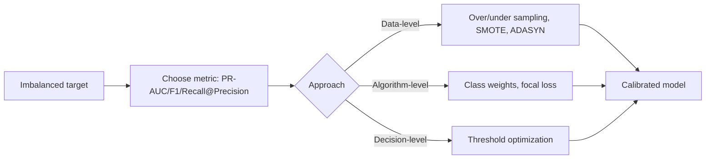

# Imbalanced Data Handling for Real-World ML

## Why imbalance hurts
Most standard learners optimize average error and ignore minority class utility. In logistics, failures/fraud are rare but operationally costly.

## First principle
Before balancing data, align objective and threshold to business costs.



## Evaluation: PR-AUC over ROC-AUC
ROC-AUC may look high even with poor positive-class precision at useful thresholds.
PR-AUC focuses on positive class quality.

## Resampling techniques
- Random oversampling: duplicates minority examples.
- Random undersampling: drops majority examples.
- SMOTE: synthetic minority interpolation.
- ADASYN: focuses synthesis near hard regions.

### Why SMOTE can hurt
- Creates unrealistic synthetic samples.
- Amplifies overlap/noise near class boundary.
- Breaks temporal/entity structure if misapplied.

## Algorithmic approaches
- Class weights (`class_weight='balanced'`).
- Cost-sensitive loss.
- Balanced ensemble variants.
- Focal loss in deep models.

## Threshold optimization
Train with probability output, choose threshold based on:
- minimum recall requirement
- precision constraint
- expected cost curve

## When not to balance
If class imbalance reflects true prior and ranking quality is good, reweighting may distort calibration.
Sometimes threshold tuning on unbalanced training is better.

## Logistics example
Predict rare delivery failures (2%).
- Model: LightGBM with class weights.
- Metric: PR-AUC + recall at precision 0.75.
- Business action: proactive intervention on top-risk 5% shipments.

## Interview questions
1. Why PR-AUC for imbalance?
2. When does SMOTE make performance worse?
3. What is threshold optimization and when use it?

## imbalanced-learn pipeline
```python
from imblearn.pipeline import Pipeline
from imblearn.over_sampling import SMOTE
from sklearn.preprocessing import StandardScaler
from sklearn.linear_model import LogisticRegression
from sklearn.metrics import average_precision_score

pipe = Pipeline([
    ('scaler', StandardScaler()),
    ('smote', SMOTE(random_state=42)),
    ('clf', LogisticRegression(max_iter=2000, class_weight='balanced'))
])

pipe.fit(X_train, y_train)
prob = pipe.predict_proba(X_valid)[:, 1]
print('PR-AUC:', average_precision_score(y_valid, prob))
```

## Cost-based threshold snippet
```python
import numpy as np

def best_threshold(y_true, y_prob, fp_cost=1.0, fn_cost=10.0):
    best_t, best_cost = 0.5, float('inf')
    for t in np.linspace(0.01, 0.99, 99):
        y_hat = (y_prob >= t).astype(int)
        fp = ((y_hat == 1) & (y_true == 0)).sum()
        fn = ((y_hat == 0) & (y_true == 1)).sum()
        cost = fp_cost * fp + fn_cost * fn
        if cost < best_cost:
            best_cost, best_t = cost, t
    return best_t, best_cost
```

## Common pitfalls
- Balancing validation/test sets artificially.
- Reporting only accuracy.
- Ignoring calibration after reweighting/sampling.
- Not checking minority-class performance across subgroups.
