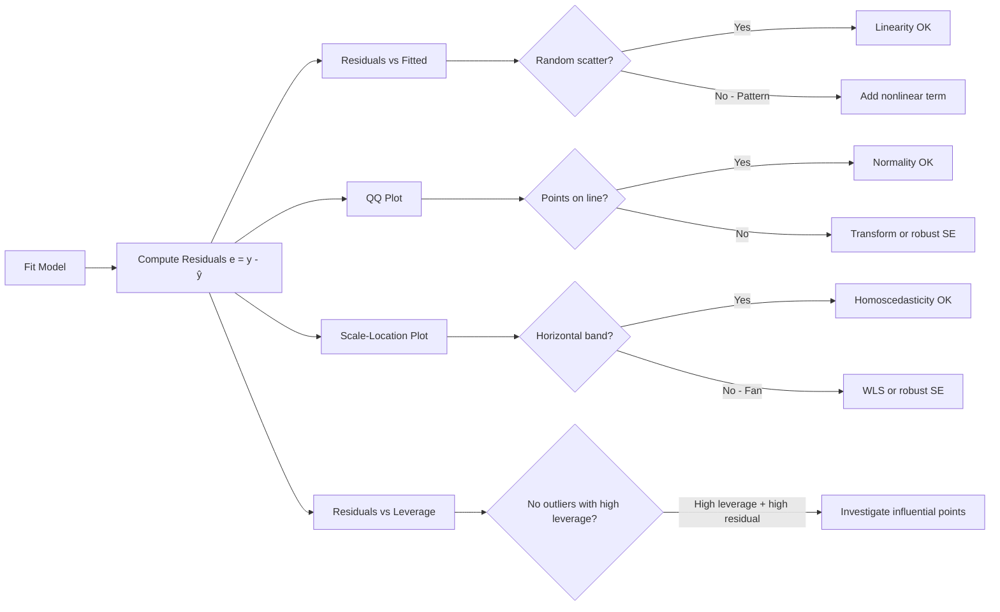
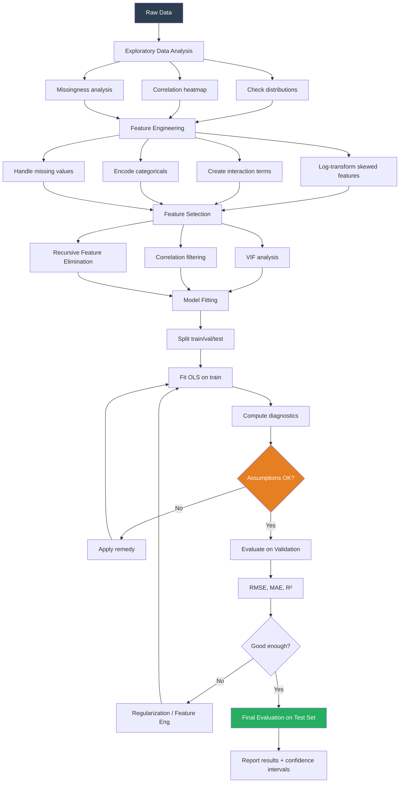

# Linear Regression - Complete Interview Guide

> Mastery of linear regression signals mathematical maturity. Interviewers use it to probe your understanding of optimization, statistics, and the assumptions underlying all of supervised learning.

---

## Table of Contents
1. [Intuition and Setup](#intuition)
2. [OLS Derivation - Matrix Form](#ols-derivation)
3. [Gauss-Markov Theorem and Assumptions](#gauss-markov)
4. [Assumption Violations and Remedies](#violations)
5. [Coefficient Interpretation](#interpretation)
6. [Multiple Regression and Collinearity](#collinearity)
7. [Polynomial Regression](#polynomial)
8. [R² and Adjusted R²](#r-squared)
9. [Residual Analysis](#residuals)
10. [Ridge, Lasso, ElasticNet Preview](#regularization-preview)
11. [Regression Pipeline Diagram](#diagram)
12. [Logistics Use Case](#use-case)
13. [Code Examples](#code)
14. [Interview Questions](#interview-questions)

---

## 1. Intuition and Setup {#intuition}

Linear regression seeks a hyperplane in feature space that minimizes the sum of squared vertical distances (residuals) from each data point to that hyperplane.

**The Model:**
```
y = Xβ + ε
```

Where:
- `y ∈ R^n` is the response vector (n observations)
- `X ∈ R^(n×p)` is the design matrix (n observations, p features including intercept)
- `β ∈ R^p` is the coefficient vector we want to estimate
- `ε ∈ R^n` is the error vector (unobservable)

**Why minimize squared error?**

Several justifications exist, and knowing all of them signals depth:

1. **Mathematical convenience**: Squared error is differentiable everywhere. Absolute error has a subgradient at zero.
2. **Gaussian MLE**: If errors are i.i.d. Gaussian, minimizing SSR is equivalent to maximum likelihood estimation (shown below).
3. **BLUE property**: Under Gauss-Markov conditions, OLS is the Best Linear Unbiased Estimator.
4. **Penalizes large errors more**: A residual of 10 contributes 100 to the objective; a residual of 1 contributes 1. This sensitivity to outliers is both a feature (no large errors tolerated) and a weakness (sensitive to outliers).

**Connection to MLE:** If `ε ~ N(0, σ²I)`, then:
```
p(y | X, β) = ∏ᵢ (1/√(2πσ²)) exp(-(yᵢ - xᵢ'β)² / (2σ²))
```

Taking the log and maximizing:
```
log L(β) = -n/2 log(2πσ²) - 1/(2σ²) Σᵢ (yᵢ - xᵢ'β)²
```

Maximizing log-likelihood is equivalent to minimizing `Σᵢ (yᵢ - xᵢ'β)²`. OLS = MLE under Gaussian errors.

---

## 2. OLS Derivation - Matrix Form {#ols-derivation}

**Objective:** Minimize the Residual Sum of Squares (RSS):

```
RSS(β) = ||y - Xβ||² = (y - Xβ)'(y - Xβ)
```

**Expanding:**
```
RSS(β) = y'y - 2β'X'y + β'X'Xβ
```

**Taking the gradient with respect to β and setting to zero:**
```
∂RSS/∂β = -2X'y + 2X'Xβ = 0
```

**Solving:**
```
X'Xβ = X'y
```
This is the **Normal Equation**.

**If X'X is invertible:**
```
β̂ = (X'X)⁻¹X'y
```

This is the **Ordinary Least Squares estimator**.

**Checking it's a minimum (second derivative):**
```
∂²RSS/∂β∂β' = 2X'X
```

`X'X` is positive semidefinite by construction (`v'X'Xv = ||Xv||² ≥ 0`). If X has full column rank, `X'X` is positive definite, confirming a unique global minimum.

**Geometric Interpretation:**

The OLS estimator projects `y` onto the column space of `X`. The fitted values `ŷ = Xβ̂ = X(X'X)⁻¹X'y = Hy` where `H = X(X'X)⁻¹X'` is the **hat matrix** (projection matrix). The residuals `e = y - ŷ = (I - H)y` are orthogonal to the column space of X:

```
X'e = X'(y - Xβ̂) = X'y - X'Xβ̂ = X'y - X'y = 0
```

This orthogonality is why OLS works: the residuals contain no information about the predictors - all predictable variation has been captured.

**Properties of β̂:**

1. **Unbiasedness:** `E[β̂] = E[(X'X)⁻¹X'y] = (X'X)⁻¹X'E[y] = (X'X)⁻¹X'Xβ = β`
2. **Variance:** `Var(β̂) = σ²(X'X)⁻¹`
3. **Estimating σ²:** `s² = RSS/(n-p) = e'e/(n-p)` is unbiased for σ²

---

## 3. Gauss-Markov Theorem and Assumptions {#gauss-markov}

The **Gauss-Markov theorem** states: Under the classical linear regression assumptions, OLS is the **Best Linear Unbiased Estimator (BLUE)** - it has the smallest variance among all linear unbiased estimators.

### The Classical Assumptions

| # | Assumption | Mathematical Form | What It Means |
|---|-----------|-------------------|---------------|
| GM1 | Linearity | `y = Xβ + ε` | True relationship is linear in parameters |
| GM2 | Strict Exogeneity | `E[ε | X] = 0` | Errors have zero conditional mean |
| GM3 | No Perfect Multicollinearity | `rank(X) = p` | X has full column rank; X'X is invertible |
| GM4 | Homoscedasticity | `Var(ε | X) = σ²I` | Constant error variance |
| GM5 | No Autocorrelation | `Cov(εᵢ, εⱼ | X) = 0, i ≠ j` | Errors are uncorrelated |

**Note:** Normality of errors is NOT required for BLUE. Normality is required for:
- Exact finite-sample inference (t-tests, F-tests)
- Confidence intervals with correct coverage in small samples

In large samples, CLT gives us asymptotic normality regardless.

### Why These Assumptions Enable BLUE

The proof of Gauss-Markov is a constraint optimization: find the linear estimator `β̃ = Cy` that is unbiased (`CE[y] = β` for all β, meaning `CX = I`) and minimizes `trace(Var(β̃))`.

Any linear unbiased estimator can be written as `β̃ = (C₀ + D)y` where `C₀ = (X'X)⁻¹X'` is the OLS solution and `DX = 0`.

Then `Var(β̃) = σ²(C₀ + D)(C₀ + D)' = σ²C₀C₀' + σ²DD'` (cross terms vanish due to `DX=0`).

Since `DD'` is positive semidefinite: `Var(β̃) ≥ Var(β̂)` in the matrix sense.

---

## 4. Assumption Violations and Remedies {#violations}

### Violation 1: Non-linearity (GM1)

**Detection:** Residual vs. fitted plot shows curvature; RESET test.

**Consequences:** Biased estimates; model systematically wrong in certain regions.

**Remedies:**
- Add polynomial terms: `X, X², X³`
- Log-transform skewed features: `log(X)`
- Use interaction terms: `X₁ × X₂`
- Switch to a non-linear model (trees, GAMs)

### Violation 2: Endogeneity (GM2)

**Detection:** Difficult to detect directly. Hausman test for IV models.

**Causes:**
- Omitted variable bias (confounders in error term)
- Measurement error in X (attenuates coefficients toward zero)
- Simultaneity (X causes Y and Y causes X)

**Consequences:** Biased AND inconsistent estimates (bias doesn't vanish with more data).

**Remedies:** Instrumental Variables (IV/2SLS), propensity score matching, RDD, DiD.

### Violation 3: Heteroscedasticity (GM4)

**Detection:**
- Residuals vs. fitted: fan shape (increasing or decreasing spread)
- Breusch-Pagan test, White test

**Consequences:** OLS is still unbiased, but standard errors are wrong. Confidence intervals and hypothesis tests are invalid. Efficiency is lost.

**Remedies:**
- WLS (Weighted Least Squares): weight observations by 1/Var(εᵢ)
- Heteroscedasticity-Robust Standard Errors (HC3, the "sandwich estimator")
- Log-transform the response

### Violation 4: Autocorrelation (GM5)

**Common in:** Time series data, panel data, spatial data.

**Detection:** Durbin-Watson test, Ljung-Box test, ACF/PACF plots of residuals.

**Consequences:** OLS is still unbiased but inefficient; standard errors underestimated (artificially small p-values).

**Remedies:**
- GLS (Generalized Least Squares)
- Newey-West standard errors (HAC)
- Include lagged variables
- Time series models (ARIMA)

### Violation 5: Multicollinearity (GM3 near-violation)

**Note:** Perfect multicollinearity makes X'X singular (not invertible). Near-multicollinearity is more common.

Covered in depth in the [Collinearity section](#collinearity).

---

## 5. Coefficient Interpretation {#interpretation}

### Simple Linear Regression

```
y = β₀ + β₁X₁ + ε
```

- **β₀ (intercept):** Expected value of y when X₁ = 0. Often not meaningful (extrapolation).
- **β₁ (slope):** Expected change in y for a one-unit increase in X₁, holding everything else constant.

### Log Transformations

| Model | Interpretation of β₁ |
|-------|----------------------|
| `y = β₀ + β₁X` | +1 unit X → +β₁ units y |
| `log(y) = β₀ + β₁X` | +1 unit X → ×e^β₁ in y (multiplicative, ≈ β₁×100% change) |
| `y = β₀ + β₁log(X)` | +1% in X → +β₁/100 units in y |
| `log(y) = β₀ + β₁log(X)` | +1% in X → +β₁% in y (elasticity) |

### Categorical Variables

For a binary indicator X₁ ∈ {0,1}:
- β₁ is the expected difference in y between the two groups, holding other variables constant.

For a k-level categorical with k-1 dummies (one reference level):
- Each dummy coefficient is the expected difference vs. the reference group.
- **Do not include all k dummies** (perfect multicollinearity with intercept - "dummy variable trap").

### Interaction Terms

```
y = β₀ + β₁X₁ + β₂X₂ + β₃(X₁ × X₂) + ε
```

Marginal effect of X₁: `∂y/∂X₁ = β₁ + β₃X₂`

The effect of X₁ depends on X₂. Cannot interpret β₁ or β₂ in isolation when interaction is present.

---

## 6. Multiple Regression, Collinearity, VIF {#collinearity}

### The Collinearity Problem

When predictors are highly correlated, `X'X` becomes nearly singular, causing:
1. **Large variance in estimates:** `Var(β̂) = σ²(X'X)⁻¹` - small eigenvalues of X'X inflate variance.
2. **Numerical instability:** Tiny changes in data → large changes in coefficients.
3. **Sign flips:** Coefficients may have counterintuitive signs.
4. **Individual tests insignificant but F-test is:** Classic pattern.

**Important:** Collinearity does NOT affect the model's predictive power on the training set. `Ŷ = Xβ̂` remains accurate. Only individual coefficient interpretation suffers.

### Variance Inflation Factor (VIF)

For predictor j, VIF measures how much multicollinearity inflates its variance:

```
VIF_j = 1 / (1 - R²_j)
```

Where `R²_j` is the R² from regressing Xⱼ on all other predictors.

- VIF = 1: No correlation with other predictors
- VIF = 5: R²_j = 0.8 (moderate concern)
- VIF = 10: R²_j = 0.9 (serious concern, commonly used threshold)
- VIF → ∞: Perfect multicollinearity

**Condition Number** as alternative: ratio of largest to smallest eigenvalue of X'X. > 30 signals moderate, > 100 signals severe collinearity.

### Remedies for Collinearity

| Remedy | When to Use | Trade-off |
|--------|-------------|-----------|
| Remove one predictor | Redundant features | Lose information if not truly redundant |
| Ridge regression (L2) | Keep all features needed | Biased estimates, stable |
| PCA before regression | Many correlated features | Lose interpretability |
| Collect more data | Sampling limitation | Not always possible |
| Center and scale features | Reduces numerical issues | Doesn't fix true collinearity |

---

## 7. Polynomial Regression {#polynomial}

Linear regression is linear in **parameters**, not necessarily features. We can include nonlinear feature transformations:

```
y = β₀ + β₁X + β₂X² + β₃X³ + ε
```

This is still linear regression - the design matrix just includes columns `[1, X, X², X³]`.

**Degree Selection:**
- Cross-validation is preferred
- AIC/BIC penalize model complexity
- Adjusted R² penalizes for number of parameters

**Dangers:**
- **Runge's phenomenon:** High-degree polynomials oscillate wildly at the boundaries
- Prefer splines (restricted cubic splines, B-splines) over high-degree polynomials
- Polynomial features generate O(p^d) terms for degree d, p features

**Natural Cubic Splines:** Piecewise cubic polynomials with continuity constraints at knots. Linear beyond boundary knots (prevents extreme extrapolation). Preferred in production over raw polynomials.

---

## 8. R² and Adjusted R² {#r-squared}

### R² - Coefficient of Determination

```
R² = 1 - RSS/TSS = 1 - Σ(yᵢ - ŷᵢ)² / Σ(yᵢ - ȳ)²
```

Where:
- **RSS** = Residual Sum of Squares (unexplained variation)
- **TSS** = Total Sum of Squares (total variation in y)
- **ESS** = Explained Sum of Squares = TSS - RSS

**Interpretation:** Fraction of variance in y explained by the model.

**Properties:**
- R² ∈ [0, 1] for models with an intercept (can be negative for models without intercept)
- R² never decreases when adding predictors (even noise predictors)
- R² = correlation(y, ŷ)² in simple linear regression

### Why R² Is Not Enough

1. **Adding noise predictors always increases R²:** A model with 50 random noise features can have R² = 0.9 on training data and generalize terribly.
2. **High R² with bad predictions:** Possible if scale of y is large.
3. **Low R² doesn't mean bad model:** In noisy domains (e.g., social sciences), R² = 0.3 might be excellent.
4. **R² says nothing about causation.**
5. **R² cannot compare models with different y transforms** (log-y vs. y).
6. **Anscombe's Quartet:** Four datasets with identical R² but completely different patterns.

### Adjusted R²

Penalizes for number of predictors:

```
R²_adj = 1 - (1 - R²)(n - 1)/(n - p - 1)
```

Where n = observations, p = number of predictors (excluding intercept).

- Increases only if added predictor improves model more than expected by chance
- Decreases when adding irrelevant predictors
- Use for comparing models with different numbers of predictors

**Better alternatives for model selection:** AIC, BIC, cross-validated RMSE.

### AIC and BIC

```
AIC = n × log(RSS/n) + 2p
BIC = n × log(RSS/n) + p × log(n)
```

BIC penalizes model complexity more heavily than AIC (preferred when n > 7 and true model is in consideration set). Lower is better.

---

## 9. Residual Analysis {#residuals}

Residual plots are the primary diagnostic tool. **Always plot residuals before trusting any inference.**

### Key Diagnostic Plots



### Influential Points: Cook's Distance

Cook's distance measures how much all fitted values change when observation i is removed:

```
Dᵢ = (β̂₍₋ᵢ₎ - β̂)' X'X (β̂₍₋ᵢ₎ - β̂) / (p × s²)
```

**Rule of thumb:** Dᵢ > 4/n or Dᵢ > 1 flags influential observations.

**Leverage vs. Influence:**
- **Leverage** = hᵢᵢ (diagonal of hat matrix H). Measures how far observation i is from the mean of X. High leverage can influence estimates without necessarily being an outlier in y.
- **Influence** = high leverage AND high residual.

### Studentized Residuals

```
tᵢ = eᵢ / (s₍₋ᵢ₎ √(1 - hᵢᵢ))
```

Follows a t-distribution with n-p-1 degrees of freedom under the null. Values |tᵢ| > 3 warrant investigation.

---

## 10. Ridge, Lasso, ElasticNet Preview {#regularization-preview}

When OLS assumptions are violated (especially collinearity) or when we seek better generalization, regularization helps. Full treatment in [regularization.md](./regularization.md).

**Ridge Regression:**
```
β̂_ridge = argmin_β ||y - Xβ||² + λ||β||²
           = (X'X + λI)⁻¹X'y
```
Adding λI to X'X makes it invertible even with perfect collinearity. Always has a closed-form solution.

**Lasso:**
```
β̂_lasso = argmin_β ||y - Xβ||² + λ||β||₁
```
No closed form. Coordinate descent. Produces sparse solutions (some β = exactly 0).

**ElasticNet:**
```
β̂_en = argmin_β ||y - Xβ||² + λ₁||β||₁ + λ₂||β||²
```
Combines L1 and L2. Useful when groups of correlated features should be selected together.

---

## 11. Regression Pipeline Diagram {#diagram}



---

## 12. Logistics Use Case: Predicting Shipment Weight {#use-case}

**Business Problem:** A logistics company wants to predict shipment weight from package dimensions to optimize truck loading and freight billing. Inaccurate weight estimates lead to overloaded trucks (safety/compliance issues) or underloaded trucks (revenue loss).

**Features:**
- `length_cm`, `width_cm`, `height_cm`: Physical dimensions
- `package_type`: Box, envelope, pallet (categorical)
- `declared_weight_kg`: Customer-declared weight (often inaccurate)
- `origin_region`: Geographic origin (proxy for product type mix)
- `month`: Seasonality

**Key Regression Considerations:**
1. **Volume** (`l × w × h`) is a natural feature - creates collinearity with individual dimensions if both included. Use VIF.
2. **Weight has a physical lower bound** (0 kg) - check if log(weight) is better distributed.
3. **Heteroscedasticity likely:** Heavier packages have more variable actual weight.
4. **Outliers:** Mislabeled packages, measurement errors.

**A reasonable model:**
```
log(actual_weight) = β₀ + β₁log(volume) + β₂package_type + β₃declared_weight + ε
```

The log-log relationship for volume exploits the volumetric weight formula used in freight (`volume/5000` in aviation).

---

## 13. Code Examples {#code}

### Setup and Basic OLS

```python
import numpy as np
import pandas as pd
import matplotlib.pyplot as plt
import seaborn as sns
from sklearn.linear_model import LinearRegression
from sklearn.model_selection import train_test_split
from sklearn.metrics import r2_score, mean_squared_error, mean_absolute_error
from sklearn.preprocessing import StandardScaler
import statsmodels.api as sm
from statsmodels.stats.outliers_influence import variance_inflation_factor
from statsmodels.stats.diagnostic import het_breuschpagan
import warnings
warnings.filterwarnings('ignore')

# ──────────────────────────────────────────────
# 1. Generate synthetic logistics data
# ──────────────────────────────────────────────
np.random.seed(42)
n = 1000

length = np.random.uniform(10, 120, n)
width  = np.random.uniform(8, 80, n)
height = np.random.uniform(5, 60, n)
volume = length * width * height

declared_weight = 0.3 * volume / 1000 + np.random.normal(0, 2, n)
declared_weight = np.clip(declared_weight, 0.1, None)

# True weight follows a physics-based law + noise
true_weight = 0.28 * volume / 1000 + 0.5 * declared_weight + np.random.normal(0, 1.5, n)
true_weight = np.clip(true_weight, 0.1, None)

df = pd.DataFrame({
    'length': length,
    'width': width,
    'height': height,
    'volume': volume,
    'declared_weight': declared_weight,
    'actual_weight': true_weight
})

# ──────────────────────────────────────────────
# 2. Multicollinearity check - VIF
# ──────────────────────────────────────────────
feature_cols = ['length', 'width', 'height', 'volume', 'declared_weight']
X_vif = sm.add_constant(df[feature_cols])

vif_data = pd.DataFrame({
    'Feature': feature_cols,
    'VIF': [variance_inflation_factor(X_vif.values, i+1) for i in range(len(feature_cols))]
})
print("VIF Analysis:")
print(vif_data.to_string(index=False))
# Expected: length/width/height/volume will have HIGH VIF (>10)
# volume is a deterministic combination of the others!

# Fix: drop individual dimensions, keep volume
feature_cols_clean = ['volume', 'declared_weight']

# ──────────────────────────────────────────────
# 3. Log-transform for better distribution
# ──────────────────────────────────────────────
df['log_volume'] = np.log(df['volume'])
df['log_declared'] = np.log(df['declared_weight'])
df['log_weight'] = np.log(df['actual_weight'])

feature_cols_log = ['log_volume', 'log_declared']

# ──────────────────────────────────────────────
# 4. Train/test split
# ──────────────────────────────────────────────
X = df[feature_cols_log]
y = df['log_weight']

X_train, X_test, y_train, y_test = train_test_split(X, y, test_size=0.2, random_state=42)

# ──────────────────────────────────────────────
# 5. Statsmodels for inference (p-values, CIs)
# ──────────────────────────────────────────────
X_train_sm = sm.add_constant(X_train)
model_sm = sm.OLS(y_train, X_train_sm).fit()
print("\nStatsmodels OLS Summary:")
print(model_sm.summary())
```

### Residual Diagnostics

```python
# ──────────────────────────────────────────────
# 6. Residual diagnostics
# ──────────────────────────────────────────────
fig, axes = plt.subplots(2, 2, figsize=(12, 10))

residuals = model_sm.resid
fitted_values = model_sm.fittedvalues

# Plot 1: Residuals vs Fitted
axes[0, 0].scatter(fitted_values, residuals, alpha=0.4, s=15)
axes[0, 0].axhline(y=0, color='red', linestyle='--')
axes[0, 0].set_xlabel('Fitted Values')
axes[0, 0].set_ylabel('Residuals')
axes[0, 0].set_title('Residuals vs Fitted')

# Plot 2: QQ Plot (normality check)
sm.qqplot(residuals, line='45', ax=axes[0, 1], alpha=0.4)
axes[0, 1].set_title('Normal Q-Q Plot')

# Plot 3: Scale-Location (homoscedasticity check)
standardized_residuals = np.sqrt(np.abs(residuals / residuals.std()))
axes[1, 0].scatter(fitted_values, standardized_residuals, alpha=0.4, s=15)
axes[1, 0].set_xlabel('Fitted Values')
axes[1, 0].set_ylabel('√|Standardized Residuals|')
axes[1, 0].set_title('Scale-Location Plot')

# Plot 4: Cook's Distance
influence = model_sm.get_influence()
cooks_d = influence.cooks_distance[0]
axes[1, 1].stem(range(len(cooks_d)), cooks_d, markerfmt='o', basefmt=' ')
axes[1, 1].axhline(y=4/len(y_train), color='red', linestyle='--', label=f'4/n threshold')
axes[1, 1].set_xlabel('Observation Index')
axes[1, 1].set_ylabel("Cook's Distance")
axes[1, 1].set_title("Cook's Distance (Influential Points)")
axes[1, 1].legend()

plt.tight_layout()
plt.savefig('residual_diagnostics.png', dpi=150, bbox_inches='tight')

# ──────────────────────────────────────────────
# 7. Breusch-Pagan test for heteroscedasticity
# ──────────────────────────────────────────────
bp_stat, bp_pvalue, _, _ = het_breuschpagan(residuals, X_train_sm)
print(f"\nBreusch-Pagan Test:")
print(f"  Statistic: {bp_stat:.4f}")
print(f"  P-value: {bp_pvalue:.4f}")
print(f"  {'Reject H0: Heteroscedasticity detected' if bp_pvalue < 0.05 else 'Fail to reject H0: Homoscedasticity assumed'}")
```

### Full Pipeline with sklearn

```python
# ──────────────────────────────────────────────
# 8. sklearn pipeline with cross-validation
# ──────────────────────────────────────────────
from sklearn.pipeline import Pipeline
from sklearn.model_selection import cross_val_score, KFold
from sklearn.linear_model import Ridge

# Build pipeline
pipeline = Pipeline([
    ('scaler', StandardScaler()),
    ('ridge', Ridge(alpha=1.0))
])

# Cross-validate
kf = KFold(n_splits=5, shuffle=True, random_state=42)
cv_scores = cross_val_score(
    pipeline, X, y,
    cv=kf,
    scoring='r2'
)

print(f"\n5-Fold CV R² scores: {cv_scores.round(4)}")
print(f"Mean R²: {cv_scores.mean():.4f} ± {cv_scores.std():.4f}")

# Final evaluation on test set
pipeline.fit(X_train, y_train)
y_pred_log = pipeline.predict(X_test)

# Back-transform from log space
y_pred_actual = np.exp(y_pred_log)
y_test_actual = np.exp(y_test)

print(f"\nTest Set Performance (actual weight scale):")
print(f"  RMSE: {np.sqrt(mean_squared_error(y_test_actual, y_pred_actual)):.3f} kg")
print(f"  MAE:  {mean_absolute_error(y_test_actual, y_pred_actual):.3f} kg")
print(f"  R²:   {r2_score(y_test_actual, y_pred_actual):.4f}")

# ──────────────────────────────────────────────
# 9. Coefficient interpretation with confidence intervals
# ──────────────────────────────────────────────
X_test_sm = sm.add_constant(X_test)
predictions = model_sm.get_prediction(X_test_sm)
pred_df = predictions.summary_frame(alpha=0.05)

print("\nFirst 5 predictions with 95% CI:")
print(pred_df[['mean', 'mean_ci_lower', 'mean_ci_upper', 'obs_ci_lower', 'obs_ci_upper']].head())

# Interpret log-log coefficients as elasticities:
print("\nCoefficient Interpretation (log-log model):")
for name, coef in zip(['Intercept', 'log_volume', 'log_declared'], model_sm.params):
    if name != 'Intercept':
        print(f"  {name}: A 1% increase in {name.replace('log_','')} → {coef:.3f}% change in actual_weight")
```

---

## 14. Interview Questions {#interview-questions}

### Q1: "Derive the OLS estimator from scratch."

**Answer framework:**
1. State the model: `y = Xβ + ε`
2. State the objective: minimize `RSS = (y-Xβ)'(y-Xβ)`
3. Expand, differentiate with respect to β, set to zero: `X'Xβ = X'y`
4. Solve: `β̂ = (X'X)⁻¹X'y` (assuming X'X invertible)
5. Verify it's a minimum via second derivative: `∂²RSS/∂β∂β' = 2X'X`, positive definite when X has full rank.

### Q2: "What happens to OLS when features are correlated?"

**Answer:**
Near-multicollinearity means X'X has eigenvalues close to zero. Since `Var(β̂) = σ²(X'X)⁻¹`, small eigenvalues create large variances. Specifically:
- Standard errors inflate dramatically
- Coefficient estimates become unstable (sensitive to small data changes)
- Individual t-tests show insignificance while F-test is significant
- Signs may flip compared to simple regressions

**Key insight:** Predictions `ŷ = Xβ̂` remain accurate within the training distribution. Only coefficient interpretation suffers. If you only need predictions (not interpretation), collinearity is less concerning.

**Remedies:** Ridge regression adds λI to X'X, making all eigenvalues at least λ, bounding variance. VIF > 10 is the common threshold for concern.

### Q3: "Why is R² not enough to evaluate a regression model?"

**Answer (cover at least 3 points):**
1. **Never decreases with added predictors** - use adjusted R² or cross-validated RMSE instead
2. **Can be high with model misspecification** - always plot residuals (Anscombe's Quartet)
3. **No information about practical significance** - R² = 0.95 but RMSE = 50 kg when acceptable error is 2 kg is useless
4. **Doesn't tell you about prediction uncertainty** - need confidence/prediction intervals
5. **Cannot compare models with different y transformations** - log(y) vs y have incomparable R²
6. **Sample size dependent** - R² inflates in small samples

### Q4: "When would you use WLS instead of OLS?"

**Answer:** When the variance of errors is proportional to a known function of X (heteroscedasticity). WLS minimizes `Σ wᵢ(yᵢ - xᵢ'β)²` where `wᵢ = 1/Var(εᵢ)`. This restores efficiency (BLUE) when variance is non-constant. In practice, we often use HC3 robust standard errors instead of WLS when we're uncertain about the variance structure, because WLS requires knowing the variance function.

### Q5: "Explain the geometric interpretation of OLS."

**Answer:** OLS projects the response vector y onto the column space of X. The fitted values `ŷ = Hy` where `H = X(X'X)⁻¹X'` is the orthogonal projection matrix (hat matrix). The residuals `e = y - ŷ = (I-H)y` lie in the null space of X', meaning `X'e = 0` - residuals are orthogonal to every column of X. This orthogonality is what makes OLS optimal: all predictable variation is extracted.

### Q6: "What is the Gauss-Markov theorem and what does BLUE mean?"

**Answer:** Under the classical linear regression assumptions (linearity, exogeneity, no perfect multicollinearity, homoscedasticity, no autocorrelation), OLS is the **Best Linear Unbiased Estimator**:
- **Linear:** estimator is a linear function of y
- **Unbiased:** `E[β̂] = β`
- **Best:** smallest variance among all linear unbiased estimators

Important: "best" means minimum variance, not minimum MSE. A biased estimator (like Ridge) can have lower MSE if the bias reduction is small and variance reduction is large. This is the bias-variance tradeoff in action.

### Q7: "What is Cook's Distance and how do you use it?"

**Answer:** Cook's distance measures how much the vector of all fitted values changes when observation i is removed. It combines leverage (how far X is from center) and residual (how far y is from fitted value). `Dᵢ > 4/n` or `Dᵢ > 1` flags potentially influential points. The appropriate response is not to automatically delete them, but to: (1) verify the data point is correct, (2) understand why it's influential (is it a real phenomenon or an error?), (3) report results with and without the point if it has outsized impact.

### Q8: "How do you know if the linearity assumption is violated?"

**Answer:** Primary tool: **residuals vs. fitted values plot**. Under correct specification, residuals should scatter randomly around zero with no pattern. Systematic curvature (U-shape, S-shape) indicates nonlinearity. The formal test is the **RESET test** (Ramsey Regression Equation Specification Error Test), which adds powers of fitted values as regressors and tests their joint significance.

---

## Summary Cheat Sheet

| Concept | Key Formula | When to Apply |
|---------|-------------|---------------|
| OLS Estimator | `β̂ = (X'X)⁻¹X'y` | Always for standard linear regression |
| VIF | `1/(1-R²ⱼ)` | Check before trusting coefficients |
| Cook's Distance | `Dᵢ > 4/n` | Identify influential observations |
| Adjusted R² | `1-(1-R²)(n-1)/(n-p-1)` | Compare models with different # features |
| Breusch-Pagan test | p < 0.05 → heteroscedasticity | Always run on residuals |
| Ridge closed form | `(X'X + λI)⁻¹X'y` | When X'X is ill-conditioned |

---

*Next: [Logistic Regression](./logistic_regression.md) - extending to classification*
