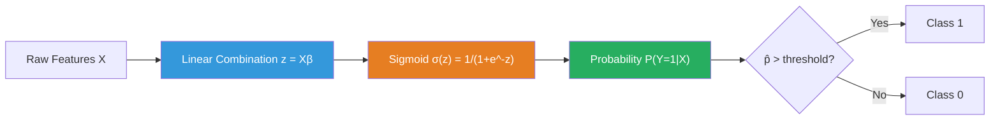

# Logistic Regression - Complete Interview Guide

> The conceptual bridge between linear models and classification. Understanding logistic regression's MLE derivation, probabilistic interpretation, and decision boundary is fundamental to understanding neural networks, generalized linear models, and modern classification systems.

---

## Table of Contents
1. [From Linear to Logistic: The Problem with Linear Probability Models](#motivation)
2. [The Sigmoid Function](#sigmoid)
3. [Log-Odds Interpretation](#log-odds)
4. [Maximum Likelihood Estimation](#mle)
5. [Decision Boundary](#decision-boundary)
6. [Regularization in Logistic Regression](#regularization)
7. [Multiclass: Softmax Regression](#multiclass)
8. [Model Evaluation Metrics](#evaluation)
9. [Comparison Table vs Linear Regression](#comparison)
10. [Logistics Use Case: Predicting Delivery Success](#use-case)
11. [Code Examples](#code)
12. [Interview Questions](#interview-questions)

---

## 1. From Linear to Logistic: The Problem with Linear Probability Models {#motivation}

**The naive approach:** Apply linear regression directly to a binary outcome (0/1).

```
P(Y=1 | X) = Xβ
```

**Why this fails:**

1. **Probability range violation:** Linear regression predicts values in `(-∞, +∞)`, but probabilities must be in `[0, 1]`. We can predict `P(Y=1) = 1.7` or `P(Y=1) = -0.3`, which is nonsensical.

2. **Heteroscedasticity by construction:** For a binary outcome, `Var(Y|X) = P(Y=1|X)(1-P(Y=1|X))`, which is a function of X. This violates homoscedasticity, invalidating OLS standard errors.

3. **Non-linearity of the true relationship:** Near probabilities of 0 or 1, the effect of X on probability should diminish (S-curve), not remain constant.

**The linear probability model (LPM) is still used in econometrics** when:
- Probabilities are far from 0/1 (interior of the distribution)
- Interpretability is paramount (coefficients are direct probability changes)
- Running an IV regression (2SLS works with LPM)

**But for production ML systems, logistic regression is always preferred.**

---

## 2. The Sigmoid Function {#sigmoid}

We need a function that maps `(-∞, +∞)` → `(0, 1)`. The logistic (sigmoid) function is:

```
σ(z) = 1 / (1 + e^(-z)) = e^z / (1 + e^z)
```

**Key properties:**

- `σ(0) = 0.5`
- `σ(z) → 1` as `z → +∞`
- `σ(z) → 0` as `z → -∞`
- `σ(-z) = 1 - σ(z)` (symmetry)
- Derivative: `σ'(z) = σ(z)(1 - σ(z))` (crucial for backpropagation)

**Why sigmoid specifically?**

The sigmoid emerges naturally from the **exponential family** framework. If we assume:
```
P(Y=1|X) / P(Y=0|X) = e^(Xβ)  (linear model for log-odds)
```

Then solving for `P(Y=1|X)` gives exactly the sigmoid. The sigmoid is not an arbitrary choice—it's the canonical link function for the Bernoulli distribution in GLMs.

**The full model:**
```
P(Y=1 | X) = σ(Xβ) = 1 / (1 + e^(-Xβ))
```

Where `Xβ = β₀ + β₁X₁ + β₂X₂ + ... + βₚXₚ`

---

## 3. Log-Odds Interpretation {#log-odds}

The logit function is the inverse of sigmoid:

```
logit(p) = log(p / (1-p)) = Xβ
```

**Odds:** `p / (1-p)` — the ratio of success to failure probability.
- If P(Y=1) = 0.75, odds = 3:1 (3 successes per failure)
- If P(Y=1) = 0.5, odds = 1:1
- If P(Y=1) = 0.2, odds = 0.25 (1 success per 4 failures)

**Log-odds (logit):** `log(odds)`, which is linear in the features.

### Coefficient Interpretation

For predictor Xⱼ with coefficient βⱼ:

**Log-odds interpretation:** A one-unit increase in Xⱼ changes the log-odds of success by βⱼ, holding all other features constant.

**Odds ratio interpretation:** A one-unit increase in Xⱼ multiplies the odds by `e^βⱼ`.

| βⱼ value | e^βⱼ | Interpretation |
|----------|-------|----------------|
| 0 | 1.0 | No effect |
| 0.5 | 1.65 | 65% increase in odds |
| -0.5 | 0.61 | 39% decrease in odds |
| 1.0 | 2.72 | Odds double |
| -1.0 | 0.37 | Odds cut by 63% |

**Critical nuance:** The effect on **probability** is not constant—it depends on the base probability. When P is near 0.5, a unit change in X has the largest effect on probability. Near 0 or 1, the probability effect is small even if the log-odds effect is constant.

**Marginal effect at the mean:**
```
∂P/∂Xⱼ = βⱼ × σ(Xβ̄)(1 - σ(Xβ̄))
```

This is the marginal effect evaluated at mean feature values. In logistic regression, marginal effects must always be computed at specific feature values.

---

## 4. Maximum Likelihood Estimation {#mle}

Logistic regression is fit by maximizing the **log-likelihood**, not minimizing squared error.

### Why Not MSE?

For binary outcomes, MSE is a non-convex objective for logistic regression. The log-likelihood (cross-entropy) is **convex**, guaranteeing a unique global optimum.

**The likelihood for a single observation:**
```
P(yᵢ | xᵢ, β) = p̂ᵢ^yᵢ × (1 - p̂ᵢ)^(1-yᵢ)
```

Where `p̂ᵢ = σ(xᵢ'β)`. This elegantly handles both cases:
- If `yᵢ = 1`: likelihood = `p̂ᵢ`
- If `yᵢ = 0`: likelihood = `1 - p̂ᵢ`

**Joint likelihood (assuming i.i.d.):**
```
L(β) = ∏ᵢ p̂ᵢ^yᵢ (1 - p̂ᵢ)^(1-yᵢ)
```

**Log-likelihood (easier to work with):**
```
ℓ(β) = Σᵢ [yᵢ log(p̂ᵢ) + (1-yᵢ) log(1-p̂ᵢ)]
```

This is the **negative binary cross-entropy** (negated). We maximize this (or equivalently minimize the cross-entropy loss).

**The Gradient:**
```
∂ℓ/∂β = Σᵢ (yᵢ - p̂ᵢ) xᵢ = X'(y - p̂)
```

This has the same form as OLS: `X'(y - ŷ)`. Elegant! The gradient is the sum of residuals weighted by features.

**The Hessian (for Newton's method):**
```
∂²ℓ/∂β∂β' = -Σᵢ p̂ᵢ(1-p̂ᵢ) xᵢxᵢ' = -X'WX
```

Where `W = diag(p̂ᵢ(1-p̂ᵢ))`. This is negative definite (since `p̂ᵢ(1-p̂ᵢ) > 0`), confirming log-likelihood is strictly concave → unique global maximum.

**No closed-form solution:** Unlike OLS, the gradient equation `X'(y - σ(Xβ)) = 0` cannot be solved analytically due to the nonlinear σ. We use:
- **Newton-Raphson (IRLS):** Iteratively Reweighted Least Squares - the gold standard
- **Gradient Descent:** Standard for large datasets
- **L-BFGS:** Quasi-Newton method, good for medium-sized problems

### IRLS Update Rule

```
β^(t+1) = β^(t) + (X'WX)⁻¹ X'(y - p̂)
```

This is equivalent to fitting weighted least squares at each iteration, which is why statsmodels reports a weighted R² for logistic regression.

### Complete Loss Function with Regularization

```
Loss = -ℓ(β) + λ × Penalty(β)
     = Σᵢ [−yᵢ log(p̂ᵢ) − (1−yᵢ) log(1−p̂ᵢ)] + λ||β||²
```

---

## 5. Decision Boundary {#decision-boundary}

The decision boundary is the set of points where `P(Y=1|X) = 0.5`, i.e., where `Xβ = 0`.

**For two features (X₁, X₂):**
```
β₀ + β₁X₁ + β₂X₂ = 0
X₂ = -(β₀/β₂) - (β₁/β₂)X₁
```

This is a **straight line** in 2D feature space. Logistic regression always has a linear decision boundary.

**Nonlinear decision boundaries:**
- Add polynomial features: `X₁², X₂², X₁X₂`
- The decision boundary becomes quadratic
- Same principle as polynomial regression

**Impact of the threshold:**
- Default threshold = 0.5 (maximize accuracy)
- Threshold < 0.5: More positives classified, higher recall, lower precision
- Threshold > 0.5: Fewer positives classified, lower recall, higher precision
- Optimal threshold depends on business costs: tune using precision-recall curve



### Separation (Perfect Separation Problem)

When classes are **perfectly linearly separable**, MLE does not converge. The log-likelihood can be made arbitrarily large by sending `||β|| → ∞` (coefficients blow up). Solutions:
- L2 regularization (most common fix)
- Firth's penalized likelihood
- Bayesian logistic regression

---

## 6. Regularization in Logistic Regression {#regularization}

| Parameter | sklearn | Effect |
|-----------|---------|--------|
| `penalty='l2'` | C = 1/λ | Shrinks all coefficients, never zero |
| `penalty='l1'` | C = 1/λ | Sparse coefficients (feature selection) |
| `penalty='elasticnet'` | C, l1_ratio | Combination of L1 and L2 |
| `penalty=None` | - | No regularization (dangerous if separable) |

**Note on sklearn's C parameter:** sklearn uses C = 1/λ, so **smaller C = stronger regularization**. This is the opposite of the λ convention. Common source of confusion.

```python
# Stronger regularization: smaller C
lr_strong = LogisticRegression(C=0.01, penalty='l2')

# Weaker regularization: larger C
lr_weak   = LogisticRegression(C=100, penalty='l2')
```

---

## 7. Multiclass: Softmax Regression {#multiclass}

### One-vs-Rest (OvR)

Train K binary classifiers, one for each class. Predict the class with the highest probability. Requires K models; classes are treated independently.

**Issue:** Probabilities from K classifiers don't necessarily sum to 1.

### Softmax Regression (Multinomial Logistic Regression)

A single model for K classes. Uses the **softmax function**:

```
P(Y=k | X) = exp(Xβₖ) / Σⱼ exp(Xβⱼ)
```

Where `βₖ` is the coefficient vector for class k.

**Properties:**
- All probabilities sum to 1: `Σₖ P(Y=k|X) = 1`
- Reduces to logistic regression when K=2
- Parameters are not uniquely identified (can set βₖ = 0 for reference class)

**Loss function (Categorical Cross-Entropy):**
```
Loss = -Σᵢ Σₖ yᵢₖ log(P(Y=k | xᵢ))
```

Where `yᵢₖ = 1` if observation i belongs to class k (one-hot encoding).

**Gradient (for class k):**
```
∂Loss/∂βₖ = -Σᵢ (yᵢₖ - P(Y=k|xᵢ)) xᵢ
```

Same elegant structure as binary logistic regression.

### OvR vs. Softmax Comparison

| Aspect | One-vs-Rest | Softmax (Multinomial) |
|--------|-------------|----------------------|
| Training | K independent problems | One joint problem |
| Probabilities | Don't sum to 1 | Sum to 1 (proper) |
| Class relationships | Ignored | Captured jointly |
| Speed | Parallelizable | Sequential |
| Preferred when | K large, GPU available | K small, probability calibration needed |

---

## 8. Model Evaluation Metrics {#evaluation}

### Confusion Matrix and Derived Metrics

```
                    Predicted
                    Pos    Neg
Actual  Pos    |   TP  |   FN  |
        Neg    |   FP  |   TN  |
```

| Metric | Formula | Meaning |
|--------|---------|---------|
| Accuracy | (TP+TN)/(TP+TN+FP+FN) | Overall correct rate |
| Precision | TP/(TP+FP) | Of predicted positives, how many are correct? |
| Recall (Sensitivity) | TP/(TP+FN) | Of actual positives, how many did we catch? |
| Specificity | TN/(TN+FP) | Of actual negatives, how many did we classify correctly? |
| F1 Score | 2×(P×R)/(P+R) | Harmonic mean of precision and recall |
| ROC-AUC | Area under ROC | Rank-ordering ability across all thresholds |
| Log Loss | -ℓ(β)/n | Measures probability calibration |

### ROC Curve

Plots **True Positive Rate (Recall)** vs **False Positive Rate (1-Specificity)** at all decision thresholds.

- AUC = 1.0: Perfect classifier
- AUC = 0.5: Random classifier (diagonal line)
- AUC < 0.5: Worse than random (flip predictions)

**Key insight:** ROC-AUC is invariant to class imbalance (it evaluates ranking, not probability). For this reason, it's better than accuracy when classes are imbalanced. However, for severely imbalanced data (1% positive rate), use **PR-AUC** instead.

### Calibration

A well-calibrated model has the property that when it predicts P=0.7, the actual positive rate among those predictions is 70%.

**Calibration plot:** Plot predicted probability bins vs. actual positive rate. Perfectly calibrated = diagonal line.

**Calibration methods:**
- Platt scaling: Logistic regression on predicted scores
- Isotonic regression: Non-parametric, more flexible

---

## 9. Comparison: Logistic vs Linear Regression {#comparison}

| Aspect | Linear Regression | Logistic Regression |
|--------|-------------------|---------------------|
| Output type | Continuous (-∞, +∞) | Probability [0, 1] |
| Response variable | Continuous | Binary (or multiclass) |
| Link function | Identity (z = Xβ) | Sigmoid (p = σ(Xβ)) |
| Loss function | Squared error (MSE) | Binary cross-entropy (log-loss) |
| Optimization | Closed form (normal equations) | Iterative (IRLS, gradient descent) |
| Error distribution | Gaussian | Bernoulli |
| Coefficients interpret as | Change in y per unit X | Change in log-odds per unit X |
| GLM family | Gaussian | Binomial |
| Link function name | Identity | Logit |
| Outlier sensitivity | High (squared loss) | Lower (log loss) |
| Class imbalance impact | N/A | High - threshold tuning needed |
| Assumptions violated by | Non-constant variance | Perfect separation |

---

## 10. Logistics Use Case: Predicting Delivery Success {#use-case}

**Business Problem:** A logistics company wants to predict whether a delivery will succeed on the first attempt. Failed deliveries are expensive: re-delivery costs, customer dissatisfaction, and SLA breaches.

**Target Variable:** `delivery_success` ∈ {0, 1}

**Features:**
- `distance_km`: Distance from depot to delivery address
- `time_window_hours`: Delivery time window width (narrow windows → harder)
- `package_type`: Envelope, small parcel, large parcel (requires assistance)
- `customer_home_during_day`: Boolean (from historical patterns)
- `day_of_week`: Weekday vs weekend
- `driver_experience_days`: How long the assigned driver has been on route
- `weather_severity`: 0-3 scale (0=clear, 3=severe)
- `prior_failed_attempts`: Number of previous failed attempts at this address

**Key logistic regression considerations:**

1. **Class imbalance:** If 85% of deliveries succeed, a naive model predicts 1 always. Use stratified sampling, class weights, and PR-AUC for evaluation.

2. **Coefficient interpretation matters:** Stakeholders want to know "what makes deliveries fail?" Logistic regression provides this directly.

3. **Calibration matters:** Operations team wants `P(failure) = 0.3` to mean roughly 30% chance, not just a ranking score.

4. **Decision threshold:** Setting threshold to 0.3 (not 0.5) might trigger proactive actions (customer call, reschedule) even for moderate-risk deliveries.

**Example coefficient interpretation:**
- `weather_severity`: β = -0.8 → e^(-0.8) = 0.45 → each unit increase in weather severity reduces delivery success odds by 55%
- `prior_failed_attempts`: β = -1.2 → e^(-1.2) = 0.30 → each previous failed attempt reduces odds by 70%

---

## 11. Code Examples {#code}

### Full Pipeline with Coefficient Interpretation

```python
import numpy as np
import pandas as pd
import matplotlib.pyplot as plt
import seaborn as sns
from sklearn.linear_model import LogisticRegression
from sklearn.model_selection import train_test_split, cross_val_score, StratifiedKFold
from sklearn.preprocessing import StandardScaler, LabelEncoder
from sklearn.metrics import (
    classification_report, confusion_matrix, roc_auc_score,
    roc_curve, precision_recall_curve, average_precision_score,
    log_loss, brier_score_loss
)
from sklearn.pipeline import Pipeline
from sklearn.calibration import calibration_curve, CalibratedClassifierCV
import warnings
warnings.filterwarnings('ignore')

# ──────────────────────────────────────────────
# 1. Generate synthetic delivery data
# ──────────────────────────────────────────────
np.random.seed(42)
n = 5000

distance_km = np.random.exponential(15, n)
time_window_hours = np.random.uniform(1, 8, n)
customer_home = np.random.binomial(1, 0.4, n)
driver_experience = np.random.exponential(180, n)
weather_severity = np.random.randint(0, 4, n)
prior_failed = np.random.poisson(0.3, n)
is_weekend = np.random.binomial(1, 0.28, n)

# True log-odds
log_odds = (
    2.0                              # intercept
    - 0.03 * distance_km             # farther = harder
    + 0.20 * time_window_hours       # wider window = easier
    + 1.20 * customer_home           # customer home = much easier
    + 0.003 * driver_experience      # experience helps
    - 0.80 * weather_severity        # bad weather hurts
    - 1.20 * prior_failed            # history of failure matters
    + 0.30 * is_weekend              # slightly easier on weekends (less traffic)
    + np.random.normal(0, 0.5, n)    # individual variation
)

delivery_success = (np.random.uniform(0, 1, n) < 1/(1+np.exp(-log_odds))).astype(int)
positive_rate = delivery_success.mean()
print(f"Delivery success rate: {positive_rate:.2%}")

df = pd.DataFrame({
    'distance_km': distance_km,
    'time_window_hours': time_window_hours,
    'customer_home': customer_home,
    'driver_experience_days': driver_experience,
    'weather_severity': weather_severity,
    'prior_failed_attempts': prior_failed,
    'is_weekend': is_weekend,
    'delivery_success': delivery_success
})

# ──────────────────────────────────────────────
# 2. Train/test split (stratified for imbalance)
# ──────────────────────────────────────────────
feature_cols = [c for c in df.columns if c != 'delivery_success']
X = df[feature_cols]
y = df['delivery_success']

X_train, X_test, y_train, y_test = train_test_split(
    X, y, test_size=0.2, stratify=y, random_state=42
)

# ──────────────────────────────────────────────
# 3. Build pipeline
# ──────────────────────────────────────────────
pipeline = Pipeline([
    ('scaler', StandardScaler()),
    ('lr', LogisticRegression(
        C=1.0,
        penalty='l2',
        solver='lbfgs',
        max_iter=1000,
        class_weight='balanced',  # handles class imbalance
        random_state=42
    ))
])

# ──────────────────────────────────────────────
# 4. Cross-validation
# ──────────────────────────────────────────────
skf = StratifiedKFold(n_splits=5, shuffle=True, random_state=42)
cv_roc_auc = cross_val_score(pipeline, X_train, y_train, cv=skf, scoring='roc_auc')
cv_logloss = cross_val_score(pipeline, X_train, y_train, cv=skf, scoring='neg_log_loss')

print(f"\n5-Fold Stratified CV Results:")
print(f"  ROC-AUC: {cv_roc_auc.mean():.4f} ± {cv_roc_auc.std():.4f}")
print(f"  Log-Loss: {-cv_logloss.mean():.4f} ± {cv_logloss.std():.4f}")

# ──────────────────────────────────────────────
# 5. Fit final model
# ──────────────────────────────────────────────
pipeline.fit(X_train, y_train)
y_pred_proba = pipeline.predict_proba(X_test)[:, 1]
y_pred = (y_pred_proba > 0.5).astype(int)

# ──────────────────────────────────────────────
# 6. Evaluation
# ──────────────────────────────────────────────
print(f"\nTest Set Performance:")
print(f"  ROC-AUC:         {roc_auc_score(y_test, y_pred_proba):.4f}")
print(f"  PR-AUC:          {average_precision_score(y_test, y_pred_proba):.4f}")
print(f"  Log Loss:        {log_loss(y_test, y_pred_proba):.4f}")
print(f"  Brier Score:     {brier_score_loss(y_test, y_pred_proba):.4f}")
print(f"\nClassification Report:")
print(classification_report(y_test, y_pred, target_names=['Failure', 'Success']))

# ──────────────────────────────────────────────
# 7. Coefficient interpretation
# ──────────────────────────────────────────────
lr_model = pipeline.named_steps['lr']
scaler   = pipeline.named_steps['scaler']

# Coefficients in standardized space
coef_std = lr_model.coef_[0]

# Convert to odds ratios for original scale
# Note: Need to account for standardization
# For unit change in original feature: divide coefficient by feature std
coef_orig_scale = coef_std / scaler.scale_

coef_df = pd.DataFrame({
    'Feature': feature_cols,
    'Coef (std scale)': coef_std.round(4),
    'Odds Ratio (orig scale)': np.exp(coef_orig_scale).round(4),
    'Effect (%)': ((np.exp(coef_orig_scale) - 1) * 100).round(1)
}).sort_values('Odds Ratio (orig scale)', ascending=False)

print(f"\nCoefficient Interpretation:")
print(coef_df.to_string(index=False))
print("\nInterpretation example:")
print("  Odds Ratio > 1: Feature INCREASES delivery success odds")
print("  Odds Ratio < 1: Feature DECREASES delivery success odds")
```

### Threshold Optimization

```python
# ──────────────────────────────────────────────
# 8. Threshold optimization for business objective
# ──────────────────────────────────────────────
# Business: missed failure = costs $30, false alarm (unnecessary call) = $5
cost_missed_failure = 30   # FN cost
cost_false_alarm    = 5    # FP cost

thresholds = np.arange(0.1, 0.9, 0.01)
costs = []

for threshold in thresholds:
    y_pred_t = (y_pred_proba > threshold).astype(int)
    cm = confusion_matrix(y_test, y_pred_t)
    tn, fp, fn, tp = cm.ravel()
    total_cost = fn * cost_missed_failure + fp * cost_false_alarm
    costs.append(total_cost)

optimal_threshold = thresholds[np.argmin(costs)]
print(f"\nOptimal threshold (cost-based): {optimal_threshold:.2f}")
print(f"Minimum total cost: ${min(costs):.0f}")

# Apply optimal threshold
y_pred_optimal = (y_pred_proba > optimal_threshold).astype(int)
print(f"\nResults at optimal threshold ({optimal_threshold:.2f}):")
print(classification_report(y_test, y_pred_optimal, target_names=['Failure', 'Success']))
```

### Multiclass Softmax Example

```python
# ──────────────────────────────────────────────
# 9. Multiclass: delivery outcome with 3 classes
# ──────────────────────────────────────────────
# Classes: 0=Success, 1=Failed-customer-not-home, 2=Failed-access-issue
from sklearn.preprocessing import label_binarize
from sklearn.metrics import roc_auc_score

np.random.seed(42)
n_multi = 3000

X_multi = np.random.randn(n_multi, 5)
# Simple softmax generating process
B = np.array([
    [0.5, -0.3, 0.2, 0.1, -0.1],   # class 0
    [-0.2, 0.8, -0.1, 0.3, 0.2],   # class 1
    [-0.3, -0.5, -0.1, -0.4, 0.9]  # class 2
])

logits = X_multi @ B.T
exp_logits = np.exp(logits - logits.max(axis=1, keepdims=True))
probs = exp_logits / exp_logits.sum(axis=1, keepdims=True)
y_multi = np.array([np.random.choice(3, p=p) for p in probs])

X_tr, X_te, y_tr, y_te = train_test_split(X_multi, y_multi, test_size=0.2, stratify=y_multi)

lr_multi = LogisticRegression(
    multi_class='multinomial',   # Use softmax, not OvR
    solver='lbfgs',
    C=1.0,
    max_iter=500
)
lr_multi.fit(X_tr, y_tr)

y_proba_multi = lr_multi.predict_proba(X_te)
macro_auc = roc_auc_score(y_te, y_proba_multi, multi_class='ovr', average='macro')
print(f"\nMulticlass Model - Macro ROC-AUC: {macro_auc:.4f}")
print(classification_report(y_te, lr_multi.predict(X_te)))
```

---

## 12. Interview Questions {#interview-questions}

### Q1: "Why can't you use MSE as the loss function for logistic regression?"

**Answer (three distinct reasons):**

1. **Non-convexity:** With the sigmoid function, `MSE(β) = (1/n)Σ(yᵢ - σ(xᵢ'β))²` is **not convex** in β. It has multiple local minima, making optimization unreliable and results non-reproducible with different initializations.

2. **Incorrect probability model:** MSE implicitly assumes Gaussian noise. Binary outcomes follow a Bernoulli distribution. Log-likelihood for Bernoulli is cross-entropy. Using MSE is statistically inconsistent—it estimates the wrong thing.

3. **Weak gradient signal:** When σ(z) is near 0 or 1, the MSE gradient `σ'(z)(y - σ(z)) = σ(z)(1-σ(z))(y-σ(z))` is nearly zero even if the prediction is wrong (sigmoid saturation). Cross-entropy gradient `(y - σ(z))` remains large when predictions are confidently wrong—much better for learning.

### Q2: "What does a coefficient of 0.5 mean in logistic regression?"

**Answer:**

A coefficient of β = 0.5 on feature Xⱼ means:

- A **one-unit increase in Xⱼ** (holding all other features constant) increases the **log-odds** of the positive class by 0.5.
- Equivalently, the **odds ratio** is `e^0.5 ≈ 1.65` — odds increase by 65%.
- The **effect on probability** is NOT constant — it depends on the base probability. At P=0.5, the probability increases by about 0.5×0.25 = 0.125 (12.5%). At P=0.9, it barely changes.

**Common mistake:** Saying "the probability increases by 0.5." This is wrong — it's the log-odds that increases by 0.5.

**Follow-up:** If a recruiter asks "so what IS the probability change?", give the marginal effect: `∂P/∂Xⱼ = βⱼ × p̂(1-p̂)`, evaluated at mean p̂.

### Q3: "How is logistic regression related to neural networks?"

**Answer:** Logistic regression is a neural network with zero hidden layers — a single neuron with a sigmoid activation. When we add hidden layers (linear combinations followed by nonlinear activations), we get a multi-layer perceptron. The training algorithm (backpropagation) generalizes the gradient `∂ℓ/∂β = X'(y - p̂)` through the chain rule. The cross-entropy loss is the same. Understanding logistic regression is a prerequisite for understanding how every node in a neural network learns.

### Q4: "Explain the problem of perfect separation and how to fix it."

**Answer:** Perfect separation occurs when a linear combination of features perfectly predicts the class label on training data (e.g., all shipments with weight > 5kg succeed). In this case, the log-likelihood is maximized by sending the corresponding coefficient to infinity — MLE diverges. sklearn will issue a ConvergenceWarning and coefficients will be large with inflated standard errors.

**Solutions:**
1. **L2 regularization** (most common): The L2 penalty `λ||β||²` acts as a Gaussian prior, keeping coefficients finite. This is the default fix.
2. **Firth's penalized likelihood**: Adds a term equivalent to Jeffreys prior. Used in clinical statistics for small samples.
3. **Bayesian logistic regression**: Puts proper priors on β.
4. **Increase data**: More data rarely eliminates perfect separation but makes it less extreme.

### Q5: "When would you use logistic regression vs a tree-based model?"

**Answer framework:**

Prefer **logistic regression** when:
- You need probability calibration (trees can give poor calibration without post-processing)
- You need coefficient interpretability for stakeholders
- You have relatively few features that are roughly linearly related to log-odds
- You have a very large dataset where training a forest is expensive
- You need a fast prediction latency (single dot product + sigmoid)
- Features are mostly continuous and numerical

Prefer **tree-based model** when:
- You have complex nonlinear interactions
- You have categorical features with many levels
- You have missing values (trees handle natively)
- You don't need probability interpretation, just good ranking
- You have a medium-sized dataset and prediction accuracy is primary concern

### Q6: "What is the difference between ROC-AUC and PR-AUC and when do you use each?"

**Answer:**

- **ROC-AUC** measures the probability that a randomly chosen positive is ranked higher than a randomly chosen negative. It's insensitive to class imbalance because it evaluates TPR vs FPR symmetrically.
- **PR-AUC** (Average Precision) measures precision at each recall level. When negatives dominate (e.g., 99:1 ratio), a classifier that achieves TPR=0.5 with FPR=0.01 looks great on ROC (AUC ≈ 0.99) but might have terrible precision (of 100 predicted positives, 50 are true positives and 50 are false positives if the population has 1% positives).

**Rule:** Use PR-AUC when the positive class is rare and the cost of false positives is high (fraud detection, rare disease, anomaly detection). Use ROC-AUC when class balance is reasonable or you need a single number that's invariant to threshold and prevalence.

### Q7: "Derive the gradient of the logistic regression log-likelihood."

**Answer:**

Log-likelihood:
```
ℓ(β) = Σᵢ [yᵢ log σ(xᵢ'β) + (1-yᵢ) log(1-σ(xᵢ'β))]
```

Derivative of sigmoid: `σ'(z) = σ(z)(1-σ(z))`

Chain rule:
```
∂ℓ/∂β = Σᵢ [yᵢ × σ'(xᵢ'β)/σ(xᵢ'β) × xᵢ - (1-yᵢ) × σ'(xᵢ'β)/(1-σ(xᵢ'β)) × xᵢ]
       = Σᵢ [yᵢ(1-σᵢ) - (1-yᵢ)σᵢ] xᵢ
       = Σᵢ [yᵢ - σᵢ] xᵢ
       = X'(y - p̂)
```

This is elegant: the gradient is proportional to the sum of prediction errors weighted by features, identical in form to OLS.

---

## Summary Cheat Sheet

| Concept | Key Formula | When Critical |
|---------|-------------|---------------|
| Sigmoid | `σ(z) = 1/(1+e^-z)` | Every prediction |
| Log-odds | `log(p/1-p) = Xβ` | Coefficient interpretation |
| Gradient | `X'(y-p̂)` | Understanding optimization |
| Odds ratio | `e^βⱼ` | Stakeholder communication |
| Log-loss | `-Σ[y log p̂ + (1-y) log(1-p̂)]` | Loss function |
| ROC-AUC | Rank-order ability | Model comparison |
| PR-AUC | Precision at recall | Imbalanced evaluation |
| IRLS update | `β = β + (X'WX)⁻¹X'(y-p̂)` | Understanding solvers |

---

*Next: [Regularization](./regularization.md) - Ridge, Lasso, ElasticNet from first principles*
