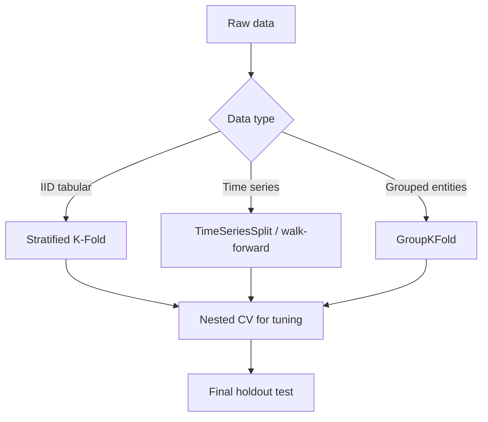

# Model Selection and Validation Strategies

## Objective
Choose a model and hyperparameters that generalize to future production data, not just historical validation slices.

## Split strategy first, model second
Wrong split invalidates all downstream conclusions.



## Cross-validation options
- K-Fold: generic IID.
- Stratified K-Fold: preserves class ratios.
- GroupKFold: entity leakage prevention.
- Leave-One-Out: high variance/cost, niche.
- TimeSeriesSplit: order-respecting temporal validation.

## Why random splits fail for time series
Future leaks into train folds. Offline score becomes optimistic and non-causal.

## Nested CV
- Inner loop: hyperparameter tuning.
- Outer loop: unbiased performance estimate.
Best for fair model comparison when search space is large.

## Train/val/test best practices
1. Keep untouched final test set.
2. Use validation only for tuning/early stopping.
3. Refit best config on train+val, evaluate once on test.

## Hyperparameter optimization
- Grid search: exhaustive but expensive.
- Random search: better coverage for same budget.
- Bayesian optimization (Optuna): sample-efficient guided search.

## Statistical comparison
Use paired tests or bootstrap CIs for model differences.
Avoid overclaiming tiny score gaps without uncertainty.

## Bias in model selection
- Repeated peeking at test set.
- Winner’s curse from many experiments.
- Publication bias inside team reporting.

## Interview questions
1. Validation vs test set difference?
2. When does K-Fold fail?
3. Why nested CV?
4. How compare models statistically?

## Code: nested CV with Optuna (compact)
```python
import optuna
import numpy as np
from sklearn.model_selection import StratifiedKFold
from sklearn.metrics import average_precision_score
from sklearn.ensemble import RandomForestClassifier


def objective(trial, X, y):
    params = {
        'n_estimators': trial.suggest_int('n_estimators', 100, 600),
        'max_depth': trial.suggest_int('max_depth', 3, 20),
        'min_samples_leaf': trial.suggest_int('min_samples_leaf', 1, 10),
        'random_state': 42,
        'n_jobs': -1,
    }
    cv = StratifiedKFold(n_splits=5, shuffle=True, random_state=42)
    scores = []
    for tr, va in cv.split(X, y):
        model = RandomForestClassifier(**params)
        model.fit(X[tr], y[tr])
        prob = model.predict_proba(X[va])[:, 1]
        scores.append(average_precision_score(y[va], prob))
    return float(np.mean(scores))

# study = optuna.create_study(direction='maximize')
# study.optimize(lambda t: objective(t, X_train, y_train), n_trials=50)
```

## Practical logistics recipe
- Delay-risk model with monthly drift.
- Use rolling time-based validation windows.
- Score by PR-AUC + calibration error.
- Compare champion vs challenger with confidence intervals.
