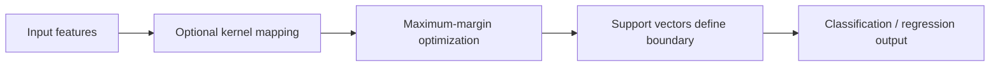

# Support Vector Machines (SVM) and SVR

## Intuition
SVM finds the separating hyperplane that maximizes margin between classes. Only a subset of points (support vectors) determine this boundary.



## Hard margin vs soft margin
- Hard margin: perfectly separable data.
- Soft margin: allows violations with slack variables `xi_i`.

Optimization form (soft-margin primal):
- Minimize `0.5 ||w||^2 + C * Σ xi_i`
- Subject to `y_i(w^T x_i + b) >= 1 - xi_i`, `xi_i >= 0`

`C` controls penalty for violations:
- High `C`: low bias, high variance, narrow margin.
- Low `C`: high bias, more regularized, wider margin.

## Support vectors
Points lying on/inside margin. Removing non-support vectors usually doesn't change decision boundary.

## Kernel trick
Instead of explicit high-dimensional mapping `phi(x)`, compute inner product via kernel `K(x_i, x_j) = phi(x_i)^T phi(x_j)`.

Common kernels:
- Linear: high-dimensional sparse features (e.g., TF-IDF).
- RBF: non-linear boundary, most common default.
- Polynomial: explicit interaction-like boundaries.

## SVM complexity and tradeoffs
- Training can be expensive on very large datasets.
- Sensitive to feature scaling.
- Works very well on medium-size, high-dimensional, clean datasets.

## SVR (Support Vector Regression)
SVR uses epsilon-insensitive loss:
- Errors inside tube `|y - y_hat| <= epsilon` not penalized.
- Good for robust regression with margin concept.

## When to use vs not use
Use when:
- Dataset is small-to-medium.
- Features are high dimensional.
- Need strong margin-based generalization.

Avoid when:
- Very large training sets (millions rows).
- Need fast training iteration.
- Need highly interpretable coefficients for stakeholders.

## Comparison with neural networks
- SVM: strong on smaller structured datasets, less tuning breadth.
- NN: scales with data and compute, better for unstructured modalities.

## Logistics use case
Anomaly screening in shipment behavior:
- Features: weight deviations, route variance, claim frequency.
- One-Class SVM flags unusual shipment patterns for manual review.

## Interview questions
1. What are support vectors and why are they important?
2. How does the kernel trick avoid explicit mapping?
3. What is the role of `C` in soft-margin SVM?
4. When use SVM over neural networks?

## sklearn example
```python
from sklearn.datasets import make_classification
from sklearn.model_selection import train_test_split
from sklearn.pipeline import Pipeline
from sklearn.preprocessing import StandardScaler
from sklearn.svm import SVC
from sklearn.metrics import classification_report

X, y = make_classification(n_samples=3000, n_features=20, n_informative=8,
                           n_redundant=3, class_sep=1.2, random_state=42)

X_train, X_test, y_train, y_test = train_test_split(
    X, y, test_size=0.2, random_state=42, stratify=y
)

clf = Pipeline([
    ('scaler', StandardScaler()),
    ('svm', SVC(kernel='rbf', C=3.0, gamma='scale', probability=True))
])

clf.fit(X_train, y_train)
print(classification_report(y_test, clf.predict(X_test)))
```

## Kernel comparison snippet
```python
for k in ['linear', 'rbf', 'poly']:
    model = Pipeline([
        ('scaler', StandardScaler()),
        ('svm', SVC(kernel=k, degree=3, C=1.0))
    ])
    model.fit(X_train, y_train)
    print(k, model.score(X_test, y_test))
```

## Common pitfalls
- Not scaling features before SVM.
- Overusing RBF with poorly tuned `C` and `gamma`.
- Assuming probability outputs are calibrated.
- Using SVM where tree-based models are clearly superior for tabular scale.
