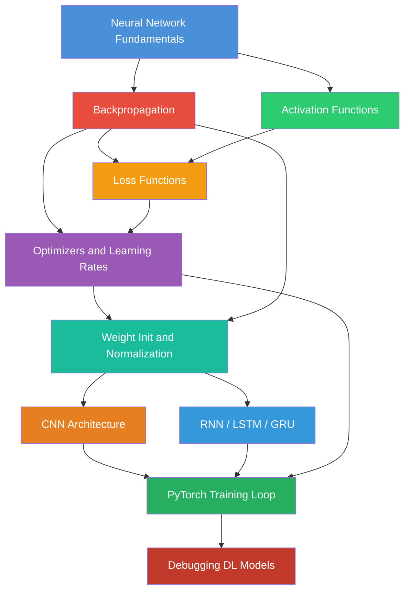
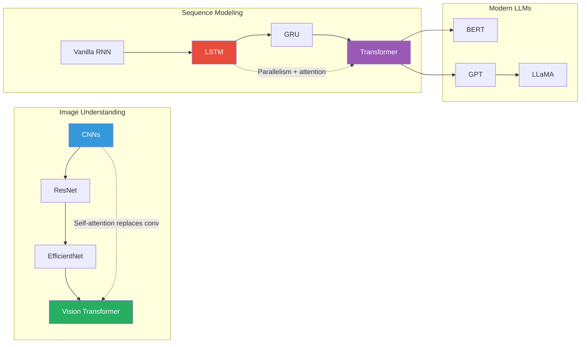
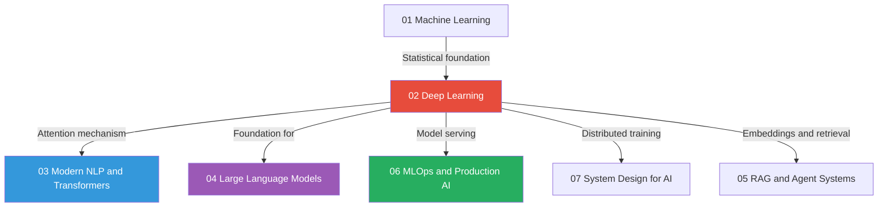

# Deep Learning: Interview Preparation Guide

> **Target audience:** Candidates interviewing for Senior ML Engineer, Research Scientist, or Applied Scientist roles at top-tier companies. This section assumes familiarity with basic calculus, linear algebra, and Python.

---

## Table of Contents

| # | Topic | Core Concepts | Difficulty |
|---|-------|--------------|------------|
| 1 | [Neural Network Fundamentals](./neural_network_fundamentals.md) | Perceptron, MLP, UAT, capacity | Intermediate |
| 2 | [Backpropagation](./backpropagation.md) | Chain rule, autograd, vanishing gradients | Advanced |
| 3 | [Activation Functions](./activation_functions.md) | ReLU, GELU, Softmax, saturation | Intermediate |
| 4 | [Loss Functions](./loss_functions.md) | Cross-entropy, focal loss, MLE connection | Intermediate |
| 5 | [Optimizers and Learning Rates](./optimizers_and_learning_rates.md) | Adam, AdamW, warmup, schedules | Advanced |
| 6 | [Weight Init and Normalization](./weight_initialization_and_normalization.md) | Xavier, He, BatchNorm, LayerNorm | Advanced |
| 7 | [CNN Architecture](./cnn_architecture.md) | Convolution, ResNet, receptive field | Intermediate |
| 8 | [RNNs, LSTMs, and GRUs](./rnn_lstm_gru.md) | BPTT, gates, seq2seq | Advanced |
| 9 | [PyTorch Training Loop](./pytorch_training_loop.md) | Full pipeline, mixed precision, DDP | Practical |
| 10 | [Debugging DL Models](./debugging_dl_models.md) | Diagnosis, gradient flow, tools | Practical |

---

## Recommended Learning Order

If you are new to deep learning or refreshing fundamentals, follow this order:

```
Foundations → Architecture → Training → Practical
```

**Week 1 - Foundations:**
1. Neural Network Fundamentals
2. Backpropagation
3. Activation Functions

**Week 2 - Building Blocks:**
4. Loss Functions
5. Optimizers and Learning Rates
6. Weight Init and Normalization

**Week 3 - Architectures:**
7. CNN Architecture
8. RNNs, LSTMs, and GRUs

**Week 4 - Systems and Practice:**
9. PyTorch Training Loop
10. Debugging DL Models

---

## Topic Dependency Graph



---

## Deep Learning Interview Cheat Sheet

### Most Commonly Asked Interview Topics

**Tier 1 (Almost Certain to Appear):**
- Explain backpropagation and the chain rule
- Why does sigmoid cause vanishing gradients?
- Why Adam over SGD?
- BatchNorm vs LayerNorm - when to use each?
- ResNet skip connections - motivation and effect

**Tier 2 (Frequently Asked at Senior Level):**
- Derive the Adam update rule from scratch
- Why is warmup needed for transformer training?
- LSTM gate math and intuition
- Focal loss motivation and formula
- He vs Xavier initialization - derive from first principles

**Tier 3 (Research-Level / Principal):**
- Why does AdamW fix Adam's weight decay?
- RMSNorm vs LayerNorm in LLaMA
- Gradient checkpointing tradeoffs
- Quantization-aware training

---

## Architecture Landscape



---

## Key Mathematical Prerequisites

| Concept | Used In | Quick Reference |
|---------|---------|----------------|
| Chain rule | Backpropagation | `d(f∘g)/dx = f'(g(x)) · g'(x)` |
| Matrix calculus | Weight gradients | Jacobian matrices |
| Probability | Loss functions | MLE, KL divergence |
| Linear algebra | Forward pass | Matrix multiply = linear transform |
| Optimization | Gradient descent | First-order methods |

---

## How to Use This Section

### For Coding Interviews
Focus on `pytorch_training_loop.md` and `debugging_dl_models.md`. Know how to implement from scratch:
- A complete training loop
- Custom dataset and dataloader
- Gradient accumulation
- Mixed precision training

### For Theory/System Design Interviews
Master `backpropagation.md`, `optimizers_and_learning_rates.md`, and `weight_initialization_and_normalization.md`. Be able to derive:
- The Adam update equations
- Xavier initialization formula
- Why LayerNorm is preferred in transformers

### For Research Scientist Roles
Deep-dive into all files. Be prepared to discuss tradeoffs between architectural choices, loss function design, and training stability.

---

## Connections to Other Sections



---

## Common Interview Red Flags to Avoid

1. **"Backprop just computes gradients"** - Always explain the chain rule, computational graph, and directionality
2. **"Adam is always better than SGD"** - SGD with momentum still wins on many image tasks; know when each is preferred
3. **"BatchNorm normalizes the data"** - It normalizes *activations*, not input data, and has learnable parameters
4. **"ReLU always works"** - Know about dying ReLU, when to use GELU/SiLU for transformers
5. **"More parameters = better model"** - Discuss generalization, inductive bias, and computational cost

---

*This section is part of the [AI/ML/LLM Interview Preparation](../../README.md) repository.*
