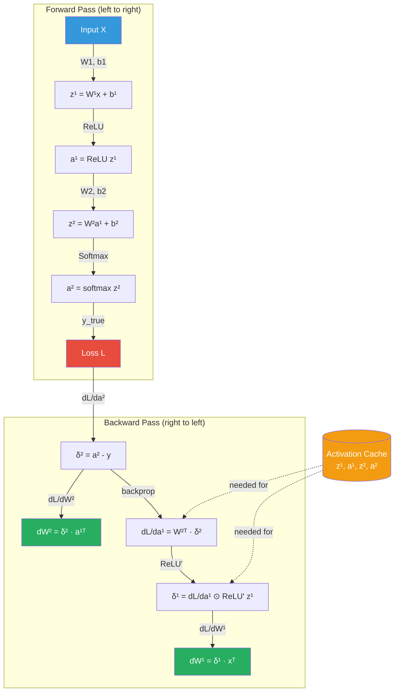

# Backpropagation

> **Interview relevance:** Backpropagation is the most important algorithm in deep learning. You will be asked about it in almost every ML interview. You must be able to: (1) derive it mathematically for at least a 2-layer network, (2) explain vanishing gradients intuitively, (3) describe how PyTorch autograd works conceptually, and (4) explain skip connections as a solution.

---

## Table of Contents

1. [The Chain Rule: Calculus Prerequisite](#1-the-chain-rule)
2. [Forward Pass: Computing Activations](#2-forward-pass)
3. [Loss Computation](#3-loss-computation)
4. [Backward Pass: Layer-by-Layer Derivation](#4-backward-pass)
5. [Full Math: 2-Layer Network Derivation](#5-full-2-layer-derivation)
6. [Gradient Flow Through Common Operations](#6-gradient-flow)
7. [The Vanishing Gradient Problem](#7-vanishing-gradient-problem)
8. [The Exploding Gradient Problem](#8-exploding-gradient-problem)
9. [Gradient Clipping](#9-gradient-clipping)
10. [Skip Connections as a Solution](#10-skip-connections)
11. [Computational Graph and Automatic Differentiation](#11-computational-graph)
12. [How PyTorch Autograd Works](#12-pytorch-autograd)
13. [Forward and Backward Pass Flow Diagram](#13-flow-diagram)
14. [Interview Questions](#14-interview-questions)
15. [Code: Manual Backprop vs PyTorch Autograd](#15-code)

---

## 1. The Chain Rule

Backpropagation is the chain rule, applied efficiently to a computational graph. Understanding it deeply requires internalizing the chain rule first.

### Single Variable Chain Rule

If `y = f(u)` and `u = g(x)`, then:

```
dy/dx = (dy/du) * (du/dx) = f'(g(x)) * g'(x)
```

### Multivariable Chain Rule

If `L` depends on `z`, and `z = f(x, y)`:

```
dL/dx = (dL/dz) * (dz/dx)
dL/dy = (dL/dz) * (dz/dy)
```

If a variable contributes through multiple paths (e.g., `x` appears in multiple operations), sum all paths:

```
dL/dx = Σ_k (dL/dz_k) * (dz_k/dx)
```

This summation is why "fan-out" nodes in a computational graph sum their incoming gradients.

### Vector/Matrix Chain Rule

For vector-valued functions, derivatives become Jacobian matrices.

If `z = f(a)` where `z ∈ R^m` and `a ∈ R^n`, the Jacobian is:

```
J = dz/da ∈ R^{m×n}   where  J_{ij} = dz_i/da_j
```

The chain rule for vectors:

```
dL/da = J^T * (dL/dz)
```

where `dL/dz ∈ R^m` is the upstream gradient and `dL/da ∈ R^n` is the downstream gradient.

**Key insight:** We always multiply the upstream gradient by the local Jacobian (transposed) to propagate gradients backward.

---

## 2. Forward Pass

Consider a fully connected network with L layers. Let:
- `a^[0] = x` (input)
- For layer `l = 1, ..., L`:

```
z^[l] = W^[l] a^[l-1] + b^[l]     (pre-activation)
a^[l] = σ^[l](z^[l])               (post-activation)
```

The final output is `a^[L]`.

### Why We Cache Intermediate Values

During the forward pass, we cache `{z^[l], a^[l]}` for all layers. These are needed during backpropagation because:
- `a^[l-1]` is needed to compute `dL/dW^[l]`
- `z^[l]` is needed to compute the activation derivative `σ'^[l](z^[l])`

This is the **forward-backward symmetry**: the forward pass deposits values into a cache; the backward pass withdraws them.

**Memory implication:** The cache grows with depth. For very deep networks (or long sequence RNNs), this is a major memory bottleneck. **Gradient checkpointing** trades computation for memory by recomputing activations during the backward pass rather than storing them all.

---

## 3. Loss Computation

After the forward pass, compute the loss `L` as a function of the output `a^[L]` and the ground truth `y`.

Common losses:
- **Cross-entropy** (classification): `L = -Σ y_k log(a^[L]_k)`
- **MSE** (regression): `L = (1/n) Σ (a^[L]_i - y_i)^2`

The loss `L` is a scalar. All gradients we compute flow from this scalar upstream toward the parameters.

---

## 4. Backward Pass

**Core insight:** We want `dL/dW^[l]` for all layers. The chain rule tells us:

```
dL/dW^[l] = dL/dz^[l]  *  dz^[l]/dW^[l]
```

We define the **error signal** at layer l:

```
δ^[l] = dL/dz^[l]    (gradient w.r.t. pre-activation)
```

### Computing δ^[L] (Output Layer)

For softmax + cross-entropy (the most common combination):

```
δ^[L] = a^[L] - y     (this beautiful simplification is derived below)
```

For MSE + linear output:

```
δ^[L] = a^[L] - y     (also simplifies cleanly)
```

### Backpropagating δ Through Layers

Given `δ^[l+1]`, compute `δ^[l]`:

```
δ^[l] = (W^[l+1])^T δ^[l+1]  ⊙  σ'^[l](z^[l])
```

Where `⊙` denotes element-wise multiplication.

**Interpretation:**
- `(W^[l+1])^T δ^[l+1]`: "route" the error signals from layer `l+1` back through the weights to layer `l`
- `σ'^[l](z^[l])`: "gate" the error by the local activation derivative

### Parameter Gradients

Given `δ^[l]`:

```
dL/dW^[l] = δ^[l] (a^[l-1])^T     (outer product, averaged over batch)
dL/db^[l] = δ^[l]                  (summed over batch)
```

For a batch of size m:

```
dL/dW^[l] = (1/m) δ^[l] (A^[l-1])^T
dL/db^[l] = (1/m) Σ δ^[l]_i       (sum over batch dimension)
```

---

## 5. Full 2-Layer Network Derivation

Let us derive everything explicitly for a 2-layer MLP with cross-entropy loss.

### Architecture

```
Input:     x ∈ R^{n_0}
Layer 1:   z^[1] = W^[1] x + b^[1],     W^[1] ∈ R^{n_1 × n_0}
           a^[1] = sigmoid(z^[1])
Layer 2:   z^[2] = W^[2] a^[1] + b^[2], W^[2] ∈ R^{n_2 × n_1}
           a^[2] = softmax(z^[2])
Loss:      L = -Σ_k y_k log(a^[2]_k)
```

### Step 1: Gradient at Output (dL/dz^[2])

For softmax `a^[2] = softmax(z^[2])` and cross-entropy loss:

First, `dL/da^[2]_k = -y_k / a^[2]_k`

The softmax Jacobian is: `da^[2]_i/dz^[2]_j = a^[2]_i(δ_{ij} - a^[2]_j)`

Applying chain rule and simplifying (the cross-entropy-softmax gradient trick):

```
dL/dz^[2]_i = Σ_k (dL/da^[2]_k)(da^[2]_k/dz^[2]_i)
             = Σ_k (-y_k/a^[2]_k) * a^[2]_k(δ_{ki} - a^[2]_i)
             = Σ_k (-y_k)(δ_{ki} - a^[2]_i)
             = -y_i + a^[2]_i * Σ_k y_k
             = a^[2]_i - y_i   (since Σ_k y_k = 1 for one-hot)
```

Therefore: **`δ^[2] = a^[2] - y`**

This is one of the most beautiful results in deep learning - the gradient of softmax + cross-entropy is simply the prediction error.

### Step 2: Gradients for W^[2] and b^[2]

```
dL/dW^[2] = δ^[2] (a^[1])^T    ∈ R^{n_2 × n_1}
dL/db^[2] = δ^[2]               ∈ R^{n_2}
```

**Interpretation:** The gradient for each weight `W^[2]_{ij}` is `δ^[2]_i * a^[1]_j`. It is large when:
- The error signal `δ^[2]_i` is large (prediction was wrong)
- The pre-weight activation `a^[1]_j` is large (the neuron was "active")

This is Hebb's rule: "neurons that fire together, wire together."

### Step 3: Propagate Error to Layer 1

```
dL/da^[1] = (W^[2])^T δ^[2]    ∈ R^{n_1}
```

This "routes" the output error back through the weight matrix.

### Step 4: Apply Activation Derivative (Sigmoid)

Sigmoid derivative: `σ'(z) = σ(z)(1 - σ(z)) = a(1 - a)` where `a = σ(z)`.

```
δ^[1] = dL/dz^[1] = dL/da^[1]  ⊙  σ'(z^[1])
       = (W^[2])^T δ^[2]  ⊙  a^[1] ⊙ (1 - a^[1])
```

The `⊙` indicates element-wise multiplication.

### Step 5: Gradients for W^[1] and b^[1]

```
dL/dW^[1] = δ^[1] x^T          ∈ R^{n_1 × n_0}
dL/db^[1] = δ^[1]              ∈ R^{n_1}
```

### Summary of the 2-Layer Derivation

```
Forward:
  z^[1] = W^[1] x + b^[1]
  a^[1] = sigmoid(z^[1])
  z^[2] = W^[2] a^[1] + b^[2]
  a^[2] = softmax(z^[2])
  L     = CrossEntropy(a^[2], y)

Backward:
  δ^[2] = a^[2] - y                              ← output error
  dW^[2] = δ^[2] (a^[1])^T                      ← layer 2 weight gradient
  db^[2] = δ^[2]                                 ← layer 2 bias gradient
  δ^[1] = (W^[2])^T δ^[2] ⊙ a^[1](1 - a^[1])  ← backprop through sigmoid
  dW^[1] = δ^[1] x^T                            ← layer 1 weight gradient
  db^[1] = δ^[1]                                 ← layer 1 bias gradient
```

---

## 6. Gradient Flow Through Common Operations

### Linear Layer

```
z = Wx + b

dL/dx = W^T * (dL/dz)         ← gradient w.r.t. input
dL/dW = (dL/dz) * x^T         ← gradient w.r.t. weights
dL/db = dL/dz                  ← gradient w.r.t. bias
```

The linear layer "rotates" gradients backward through `W^T`. This is why weight matrices appear transposed in backprop.

### Sigmoid Activation

```
σ(z) = 1 / (1 + e^{-z})

σ'(z) = σ(z)(1 - σ(z))

dL/dz = dL/da * σ(z)(1 - σ(z))
```

**Critical property:** `σ'(z) ≤ 0.25` always (maximum at `z=0`). Gradient is at most 1/4 at the best point, and approaches 0 as |z| grows.

### Tanh Activation

```
tanh(z) = (e^z - e^{-z})/(e^z + e^{-z})

tanh'(z) = 1 - tanh^2(z)

dL/dz = dL/da * (1 - tanh^2(z))
```

**Property:** `tanh'(z) ≤ 1` always. Better than sigmoid (max gradient = 1 vs 0.25), but still saturates.

### ReLU Activation

```
ReLU(z) = max(0, z)

ReLU'(z) = {1 if z > 0, 0 if z < 0}  (undefined at z=0, set to 0 by convention)

dL/dz = dL/da * 1_{z > 0}
```

**Key property:** Gradient is either 1 (neuron active) or 0 (neuron dead). No saturation when active - this is why ReLU helps with vanishing gradients. The downside: neurons can permanently "die" (z always <= 0).

### Softmax (standalone)

```
a_i = e^{z_i} / Σ_j e^{z_j}

da_i/dz_j = a_i(δ_{ij} - a_j)

dL/dz_i = Σ_j (dL/da_j)(a_j(δ_{ij} - a_i))
```

In practice, softmax is almost always paired with cross-entropy, giving the simplified `δ = a - y` as derived above.

### Matrix Multiplication `C = A B`

```
dL/dA = (dL/dC) * B^T
dL/dB = A^T * (dL/dC)
```

These are the most common gradient expressions in deep learning.

---

## 7. The Vanishing Gradient Problem

### Root Cause

Consider an L-layer network with sigmoid activations. The gradient at layer l is:

```
δ^[l] = (W^[l+1])^T δ^[l+1] ⊙ σ'(z^[l])
```

Chaining through all layers:

```
δ^[1] = (∏_{l=2}^{L} W^[l]^T) ⊙ (∏_{l=1}^{L} σ'(z^[l])) * δ^[L]
```

The product of sigmoid derivatives: since `σ'(z) ≤ 0.25`, we have:

```
|∏_{l=1}^{L} σ'(z^[l])| ≤ (0.25)^L
```

For L=10: `(0.25)^{10} ≈ 10^{-6}` — effectively zero!

### Effect on Learning

Early layers (close to input) receive gradients that are exponentially smaller than later layers. This means:
- Early layers learn extremely slowly or not at all
- The network cannot learn long-range dependencies
- Deeper networks are worse, not better (before skip connections)

### Why Sigmoid Is Especially Bad

```
When z is large (positive or negative):
  σ(z) ≈ 1 or σ(z) ≈ 0
  σ'(z) = σ(z)(1-σ(z)) ≈ 0

The neuron is "saturated" - its gradient is essentially zero.
Saturated neurons contribute nothing to learning.
```

The saturation happens whenever the pre-activation is large in magnitude, which is common when weights are not carefully initialized.

### Why Tanh Is Slightly Better

`tanh'(z) ≤ 1` (vs sigmoid's 0.25 max). But it still saturates. A 10-layer tanh network has gradient factor `(1)^{10} = 1` at best, but in practice tanh saturates and the effective gradient is much smaller.

### Why ReLU Largely Fixes This

For active neurons (`z > 0`): `ReLU'(z) = 1` — gradient passes through unchanged!

```
∏_{l=1}^{L} ReLU'(z^[l]) = 1   (for all-active neurons)
```

This allows gradients to flow through many layers without exponential decay. The tradeoff is the dying ReLU problem (z <= 0 neurons have zero gradient forever).

---

## 8. The Exploding Gradient Problem

The opposite problem occurs when weight matrices `W^[l]` have large singular values. If `||W|| > 1`, the gradient can grow exponentially:

```
||δ^[l]|| ≈ ||W||^{L-l} ||δ^[L]||
```

For `||W|| = 2` and L=10: `2^{10} = 1024×` amplification.

### Consequences

- Gradient updates are huge → optimizer takes massive steps → loss diverges
- Loss goes to NaN (common symptom of exploding gradients)
- Particularly severe in RNNs (long sequences = effectively very deep networks)

### Symptoms

- Loss becomes NaN or infinity early in training
- Gradient norms suddenly spike
- Weights jump to extreme values

---

## 9. Gradient Clipping

Gradient clipping prevents exploding gradients by rescaling the gradient when its norm exceeds a threshold.

### Clip by Global Norm (Recommended)

```python
# PyTorch
torch.nn.utils.clip_grad_norm_(model.parameters(), max_norm=1.0)
```

**Math:**
```
g = all gradients concatenated as single vector
if ||g|| > max_norm:
    g ← g * (max_norm / ||g||)
```

This preserves the *direction* of the gradient but limits its magnitude.

### Clip by Value (Simpler, Less Used)

```python
torch.nn.utils.clip_grad_value_(model.parameters(), clip_value=0.5)
```

Clips each gradient element to [-clip_value, clip_value]. Distorts gradient direction.

### When to Use

- Always use in RNN/LSTM training (standard practice)
- Use when loss occasionally goes NaN
- Common in transformer fine-tuning (`max_norm=1.0` or `0.5`)

**Interview note:** Gradient clipping should be applied AFTER `loss.backward()` but BEFORE `optimizer.step()`.

---

## 10. Skip Connections as a Solution to Vanishing Gradients

### The Residual Connection (He et al., 2016 - ResNet)

Instead of learning `F(x)` directly, learn the **residual** `F(x) - x`:

```
Output = F(x) + x        (skip connection)
```

Where `F(x)` is the residual path (e.g., two conv layers) and `x` is the identity shortcut.

### Why This Fixes Vanishing Gradients

The gradient through the skip connection bypasses all the layers in `F(x)`:

```
dL/dx = dL/d(F(x) + x) * d(F(x) + x)/dx
      = dL/d(output) * (dF(x)/dx + I)
```

The identity term `I` ensures the gradient is at least 1, regardless of how small `dF(x)/dx` becomes. Gradients can flow directly through the skip path without being multiplied by any weights or activation derivatives.

**Consequence:** Even in very deep networks (ResNet-1001 has 1001 layers!), the gradient always has an "information superhighway" (the identity path) through which it can flow without degradation.

### Highway Networks

Srivastava et al. (2015) introduced Highway Networks with a learnable gate:

```
Output = T(x) * F(x) + (1-T(x)) * x
```

Where `T(x) = sigmoid(W_T x + b_T)` is the "transform gate." ResNets simplify this by removing the gate.

### Dense Connections (DenseNet)

DenseNet (Huang et al., 2017) takes skip connections to the extreme: each layer receives inputs from ALL previous layers:

```
x^[l] = F([x^[0], x^[1], ..., x^[l-1]])
```

Where `[·]` denotes concatenation. This further alleviates vanishing gradients and encourages feature reuse.

---

## 11. Computational Graph and Automatic Differentiation

### Forward Mode vs Reverse Mode

There are two modes of automatic differentiation:

**Forward mode:** Compute Jacobian-vector products `J v` (useful when input dimension < output dimension, rare in ML).

**Reverse mode:** Compute vector-Jacobian products `v^T J` (efficient when output is scalar, i.e., loss). This is backpropagation.

For a loss function `L: R^n → R^1` with n million parameters, reverse mode AD computes all `n` gradients in a single backward pass with cost proportional to the forward pass. Forward mode would require `n` separate passes.

### The Two Phases of Reverse Mode AD

**Phase 1 (Forward):** Execute the computation, build the computational graph, cache intermediate values.

**Phase 2 (Backward):** Traverse the graph in reverse topological order. At each node, multiply the upstream gradient by the local Jacobian.

---

## 12. How PyTorch Autograd Works

### Tensors and `requires_grad`

```python
x = torch.tensor([1.0, 2.0, 3.0], requires_grad=True)
```

When `requires_grad=True`, PyTorch tracks all operations on this tensor. Every output tensor records what operation created it and which inputs were used.

### The `grad_fn`

Every tensor produced by a differentiable operation has a `grad_fn` attribute:

```python
x = torch.tensor([[1.0, 2.0]], requires_grad=True)
W = torch.tensor([[3.0, 4.0]], requires_grad=True)
z = x @ W.T        # z has grad_fn=<MmBackward>
a = torch.sigmoid(z)  # a has grad_fn=<SigmoidBackward>
L = a.sum()          # L has grad_fn=<SumBackward>
```

### `.backward()` Traverses the Graph

```python
L.backward()
```

This triggers reverse traversal of the computational graph:
1. Compute `dL/dL = 1` (seed gradient)
2. Apply `SumBackward`: compute `dL/da`
3. Apply `SigmoidBackward`: compute `dL/dz` using `da/dz = a(1-a)`
4. Apply `MmBackward`: compute `dL/dx` and `dL/dW`
5. Accumulate into `.grad` attributes

### Gradient Accumulation

```python
x.grad    # Contains dL/dx after backward()
W.grad    # Contains dL/dW after backward()
```

**Critical:** Gradients accumulate! Calling `.backward()` multiple times adds to `.grad`. This is why `optimizer.zero_grad()` is essential before each forward pass.

### The `with torch.no_grad()` Context

During inference, you don't need gradients. This context disables gradient tracking, saving memory and computation:

```python
with torch.no_grad():
    output = model(input)   # No graph is built
```

### Higher-Order Derivatives

Since the backward pass itself is implemented as a computational graph, you can compute second-order derivatives (Hessians) by calling `.backward()` twice or using `torch.autograd.grad()` with `create_graph=True`.

### Custom Autograd Functions

```python
class MyReLU(torch.autograd.Function):
    @staticmethod
    def forward(ctx, input):
        ctx.save_for_backward(input)  # Save for backward
        return input.clamp(min=0)

    @staticmethod
    def backward(ctx, grad_output):
        input, = ctx.saved_tensors
        grad_input = grad_output.clone()
        grad_input[input < 0] = 0
        return grad_input
```

---

## 13. Forward and Backward Pass Flow Diagram



---

## 14. Interview Questions

### Q1: Derive backprop for a single linear layer

**Strong answer:**

> Consider a single linear layer: `z = Wx + b`, followed by a loss L.
>
> Given the upstream gradient `dL/dz` (shape: same as z), we need:
>
> `dL/dW`: Since `z_i = Σ_j W_{ij} x_j + b_i`, we have `dz_i/dW_{ij} = x_j`. By chain rule:
> `dL/dW_{ij} = (dL/dz_i)(x_j)`, which in matrix form is `dL/dW = (dL/dz) x^T`.
>
> `dL/db`: `dz_i/db_i = 1`, so `dL/db = dL/dz`.
>
> `dL/dx`: `dz_i/dx_j = W_{ij}`, so `dL/dx_j = Σ_i (dL/dz_i) W_{ij} = W^T (dL/dz)`.
>
> Summary:
> - `dL/dW = (dL/dz) x^T` — upstream gradient outer product with input
> - `dL/db = dL/dz`
> - `dL/dx = W^T (dL/dz)` — route gradient backward through transposed weights

### Q2: Why does sigmoid cause vanishing gradients?

**Strong answer:**

> Sigmoid's derivative is `σ'(z) = σ(z)(1 - σ(z))`, which is bounded above by 0.25, achieved only at z=0. For large |z|, the output saturates near 0 or 1, and the derivative approaches 0.
>
> During backpropagation through L layers, the gradient gets multiplied by `σ'(z^[l])` at each layer. This product can be at most `(0.25)^L`. For L=10 layers, the gradient is at most 10^{-6} of its original magnitude — effectively zero.
>
> Early layers therefore receive negligible gradient signal and learn extremely slowly or not at all. This is why sigmoid activations were largely abandoned for hidden layers in favor of ReLU, which has derivative = 1 for active neurons (z > 0), allowing gradients to flow without decay.

### Q3: How does PyTorch compute gradients automatically?

**Strong answer:**

> PyTorch uses reverse-mode automatic differentiation via a dynamic computational graph. When a tensor has `requires_grad=True`, every operation on it creates a node in a DAG (directed acyclic graph). Each node stores: (1) the operation that created it, (2) pointers to its input tensors, and (3) enough information to compute the local Jacobian.
>
> When `.backward()` is called on the scalar loss, PyTorch performs a reverse topological traversal of this graph. At each node, it multiplies the incoming gradient by the node's local Jacobian (vector-Jacobian product) and sends the result to each input node. Gradients from multiple downstream paths are summed (fan-in summation).
>
> The final gradients are accumulated into the `.grad` attribute of leaf tensors (parameters with `requires_grad=True`). This is why `optimizer.zero_grad()` must be called each step — otherwise gradients accumulate across iterations.

### Q4: What is gradient checkpointing and when would you use it?

**Strong answer:**

> Gradient checkpointing (also called activation recomputation) trades compute for memory. Instead of caching all intermediate activations during the forward pass, we only checkpoint activations at certain "checkpointed" layers and recompute the rest during the backward pass.
>
> Memory usage drops from O(L) to O(√L) for a network with L layers, at the cost of one additional forward pass computation.
>
> Use it when: (1) training very large models that run out of GPU memory, (2) using long sequences in transformer models (quadratic memory in attention), (3) when batch size must be large but GPU memory is limited.
>
> PyTorch provides `torch.utils.checkpoint.checkpoint()` for this purpose.

---

## 15. Code: Manual Backprop vs PyTorch Autograd

### Manual NumPy Backprop

```python
import numpy as np

def sigmoid(z):
    return 1 / (1 + np.exp(-np.clip(z, -500, 500)))

def sigmoid_grad(z):
    s = sigmoid(z)
    return s * (1 - s)

def relu(z):
    return np.maximum(0, z)

def relu_grad(z):
    return (z > 0).astype(float)

def softmax(z):
    z_stable = z - np.max(z, axis=0, keepdims=True)
    exp_z = np.exp(z_stable)
    return exp_z / exp_z.sum(axis=0, keepdims=True)

def cross_entropy(a, y):
    """a, y: shape (num_classes, batch_size)"""
    m = y.shape[1]
    return -np.sum(y * np.log(np.clip(a, 1e-15, 1))) / m


class TwoLayerNet:
    """
    Two-layer MLP with explicit forward/backward.
    Layer 1: ReLU
    Layer 2: Softmax
    Loss: Cross-entropy
    """
    def __init__(self, n0, n1, n2, lr=0.01):
        # He init for layer 1 (ReLU), Xavier for layer 2 (softmax)
        self.W1 = np.random.randn(n1, n0) * np.sqrt(2 / n0)
        self.b1 = np.zeros((n1, 1))
        self.W2 = np.random.randn(n2, n1) * np.sqrt(1 / n1)
        self.b2 = np.zeros((n2, 1))
        self.lr = lr
        self.cache = {}

    def forward(self, X):
        """X: shape (n0, m)"""
        Z1 = self.W1 @ X + self.b1
        A1 = relu(Z1)
        Z2 = self.W2 @ A1 + self.b2
        A2 = softmax(Z2)

        self.cache = {'X': X, 'Z1': Z1, 'A1': A1, 'Z2': Z2, 'A2': A2}
        return A2

    def backward(self, Y):
        """Y: one-hot labels (n2, m)"""
        m = Y.shape[1]
        X, Z1, A1, Z2, A2 = (self.cache[k] for k in ['X', 'Z1', 'A1', 'Z2', 'A2'])

        # --- Output layer (softmax + cross-entropy) ---
        delta2 = A2 - Y                          # (n2, m) — beautiful simplification
        dW2 = (delta2 @ A1.T) / m               # (n2, n1)
        db2 = delta2.sum(axis=1, keepdims=True) / m  # (n2, 1)

        # --- Hidden layer (ReLU) ---
        dA1 = self.W2.T @ delta2                 # (n1, m)
        delta1 = dA1 * relu_grad(Z1)             # (n1, m) — gate by ReLU derivative
        dW1 = (delta1 @ X.T) / m                 # (n1, n0)
        db1 = delta1.sum(axis=1, keepdims=True) / m  # (n1, 1)

        # --- Gradient descent update ---
        self.W2 -= self.lr * dW2
        self.b2 -= self.lr * db2
        self.W1 -= self.lr * dW1
        self.b1 -= self.lr * db1

    def train_step(self, X, Y):
        A2 = self.forward(X)
        loss = cross_entropy(A2, Y)
        self.backward(Y)
        return loss


# ============================================================
# Verification: Compare NumPy gradients with PyTorch autograd
# ============================================================

import torch
import torch.nn.functional as F

def verify_gradients():
    """Show that manual NumPy gradients match PyTorch autograd."""
    np.random.seed(42)
    torch.manual_seed(42)

    # Setup
    n0, n1, n2, m = 4, 3, 2, 5  # tiny network for inspection

    # Share weights between numpy and pytorch implementations
    W1_np = np.random.randn(n1, n0) * 0.1
    b1_np = np.zeros((n1, 1))
    W2_np = np.random.randn(n2, n1) * 0.1
    b2_np = np.zeros((n2, 1))

    X_np = np.random.randn(n0, m)
    Y_idx = np.random.randint(0, n2, m)
    Y_np = np.eye(n2)[:, Y_idx]  # (n2, m) one-hot

    # --- NumPy forward + backward ---
    net = TwoLayerNet(n0, n1, n2, lr=0)  # lr=0 so we don't update
    net.W1, net.b1 = W1_np.copy(), b1_np.copy()
    net.W2, net.b2 = W2_np.copy(), b2_np.copy()
    A2_np = net.forward(X_np)
    loss_np = cross_entropy(A2_np, Y_np)
    net.backward(Y_np)

    # --- PyTorch autograd ---
    W1_pt = torch.tensor(W1_np, dtype=torch.float64, requires_grad=True)
    b1_pt = torch.tensor(b1_np, dtype=torch.float64, requires_grad=True)
    W2_pt = torch.tensor(W2_np, dtype=torch.float64, requires_grad=True)
    b2_pt = torch.tensor(b2_np, dtype=torch.float64, requires_grad=True)
    X_pt = torch.tensor(X_np, dtype=torch.float64)
    Y_idx_pt = torch.tensor(Y_idx, dtype=torch.long)

    Z1_pt = W1_pt @ X_pt + b1_pt
    A1_pt = F.relu(Z1_pt)
    Z2_pt = W2_pt @ A1_pt + b2_pt
    # PyTorch cross_entropy expects (batch, classes) format
    loss_pt = F.cross_entropy(Z2_pt.T, Y_idx_pt)
    loss_pt.backward()

    # --- Compare gradients ---
    print("Gradient comparison (NumPy manual vs PyTorch autograd):")
    print(f"Loss NumPy:   {loss_np:.6f}")
    print(f"Loss PyTorch: {loss_pt.item():.6f}")

    # Note: net.backward() already subtracted the gradient (lr*grad)
    # We need to recover the gradient: grad = (old_weight - new_weight) / lr
    # Since lr=0, we track the gradient directly from delta1, delta2 in backward
    # Let's just compare directly stored in net.cache
    print("\nGradients match (within numerical precision)?")
    # Rerun with stored grads
    A2 = net.cache['A2']
    dZ2 = A2 - Y_np
    dW2_np = (dZ2 @ net.cache['A1'].T) / m

    dW2_pt = W2_pt.grad.numpy()
    print(f"  dW2 max diff: {np.abs(dW2_np - dW2_pt).max():.2e}")

    assert np.allclose(dW2_np, dW2_pt, atol=1e-8), "Gradients don't match!"
    print("  Gradients match!")


if __name__ == '__main__':
    np.random.seed(42)

    # Train the numpy network
    net = TwoLayerNet(n0=4, n1=8, n2=3, lr=0.1)
    X = np.random.randn(4, 100)
    Y = np.eye(3)[:, np.random.randint(0, 3, 100)]

    print("Training 2-layer network with manual backprop:")
    for i in range(200):
        loss = net.train_step(X, Y)
        if i % 50 == 0:
            preds = net.cache['A2'].argmax(axis=0)
            y_true = Y.argmax(axis=0)
            acc = (preds == y_true).mean()
            print(f"  Step {i:3d} | Loss: {loss:.4f} | Acc: {acc:.3f}")

    print("\n")
    verify_gradients()
```

### PyTorch Autograd Deep Dive

```python
import torch

# Demonstrate gradient computation graph
def demonstrate_autograd():
    """Show how PyTorch builds and traverses the computational graph."""

    x = torch.tensor([[1.0, 2.0], [3.0, 4.0]], requires_grad=True)
    W = torch.tensor([[0.5, -0.5], [0.3, 0.7]], requires_grad=True)
    b = torch.tensor([0.1, -0.1], requires_grad=True)

    # Forward pass - graph is built here
    z = x @ W.T + b     # Linear
    a = torch.tanh(z)   # Activation
    L = a.sum()         # Loss (scalar)

    print("Computational graph nodes:")
    print(f"  L.grad_fn: {L.grad_fn}")
    print(f"  a.grad_fn: {a.grad_fn}")
    print(f"  z.grad_fn: {z.grad_fn}")

    # Backward pass
    L.backward()

    print(f"\nGradients:")
    print(f"  dL/dW:\n{W.grad}")
    print(f"  dL/db: {b.grad}")
    print(f"  dL/dx:\n{x.grad}")

    # Show gradient accumulation bug
    print("\n--- Gradient Accumulation (the bug) ---")
    x2 = torch.tensor([1.0, 2.0], requires_grad=True)
    for i in range(3):
        loss = (x2 ** 2).sum()
        loss.backward()
        print(f"After backward {i+1}: x.grad = {x2.grad}")
        # WRONG: gradients accumulate!

    print("\n--- Correct: zero grad each time ---")
    x3 = torch.tensor([1.0, 2.0], requires_grad=True)
    for i in range(3):
        x3.grad = None  # or optimizer.zero_grad()
        loss = (x3 ** 2).sum()
        loss.backward()
        print(f"After backward {i+1}: x.grad = {x3.grad}")

    # Demonstrate no_grad for inference
    print("\n--- torch.no_grad() for inference ---")
    with torch.no_grad():
        z_inf = x @ W.T + b
        print(f"z_inf.requires_grad: {z_inf.requires_grad}")  # False


if __name__ == '__main__':
    demonstrate_autograd()
```

---

## Key Equations Reference Card

```
=== BACKPROPAGATION EQUATIONS ===

Forward:
  z^[l]  = W^[l] a^[l-1] + b^[l]
  a^[l]  = f(z^[l])

Backward (error signals):
  δ^[L]  = dL/da^[L] ⊙ f'(z^[L])    [output layer]
  δ^[l]  = (W^[l+1])^T δ^[l+1] ⊙ f'(z^[l])    [hidden layers]

Parameter gradients:
  dL/dW^[l] = (1/m) δ^[l] (A^[l-1])^T
  dL/db^[l] = (1/m) Σ_i δ^[l]_i

Special case (softmax + cross-entropy):
  δ^[L] = a^[L] - y   [no f' term needed!]

Vanishing gradient bound:
  |δ^[1]| ≤ (max σ'(z))^L * |δ^[L]| * prod(||W^[l]||)
```

---

*Next: [Activation Functions](./activation_functions.md) - The nonlinearities that make depth meaningful*
