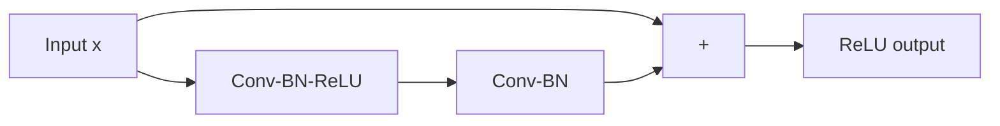

# CNN Architecture Essentials

## Convolution basics
A convolution applies learned kernels over spatial neighborhoods.

Key parameters:
- kernel size `k`
- stride `s`
- padding `p`
- dilation `d`

Output size (1D form):
`out = floor((in + 2p - d*(k-1) - 1)/s + 1)`

## Why CNNs work
- Local connectivity captures spatial locality.
- Parameter sharing improves sample efficiency.
- Hierarchical features: edges -> textures -> parts -> objects.

## Pooling
- Max pooling: keeps strongest activation.
- Average pooling: smooth summary.
- Global average pooling: parameter-light classifier head.

## Receptive field
Region of input influencing a feature. Deeper layers increase receptive field.

## Classic models
- LeNet: early digit recognition.
- AlexNet: GPU-scaled deep CNN breakthrough.
- VGG: very deep with 3x3 conv blocks.
- ResNet: residual connections solve degradation.
- EfficientNet: compound scaling depth/width/resolution.

## ResNet skip connections



Residual mapping: `y = F(x) + x`
Improves gradient flow in deep networks.

## Depthwise separable convolution
Used in MobileNet for efficient inference:
- depthwise conv per channel
- pointwise 1x1 conv for channel mixing

## 1D CNN for time series
Use temporal kernels to capture local sequential patterns with parallel computation.

## Interview questions
1. What is receptive field and why important?
2. How do skip connections help training?
3. When use CNN over ViT for constrained datasets?

## PyTorch code: simple CNN and residual block
```python
import torch
import torch.nn as nn

class ResBlock(nn.Module):
    def __init__(self, channels):
        super().__init__()
        self.block = nn.Sequential(
            nn.Conv2d(channels, channels, 3, padding=1, bias=False),
            nn.BatchNorm2d(channels),
            nn.ReLU(inplace=True),
            nn.Conv2d(channels, channels, 3, padding=1, bias=False),
            nn.BatchNorm2d(channels)
        )
        self.act = nn.ReLU(inplace=True)

    def forward(self, x):
        return self.act(self.block(x) + x)

class SmallCNN(nn.Module):
    def __init__(self, n_classes=10):
        super().__init__()
        self.features = nn.Sequential(
            nn.Conv2d(3, 32, 3, padding=1), nn.ReLU(),
            nn.MaxPool2d(2),
            nn.Conv2d(32, 64, 3, padding=1), nn.ReLU(),
            nn.MaxPool2d(2),
            ResBlock(64)
        )
        self.classifier = nn.Sequential(
            nn.AdaptiveAvgPool2d((1,1)),
            nn.Flatten(),
            nn.Linear(64, n_classes)
        )

    def forward(self, x):
        return self.classifier(self.features(x))
```
