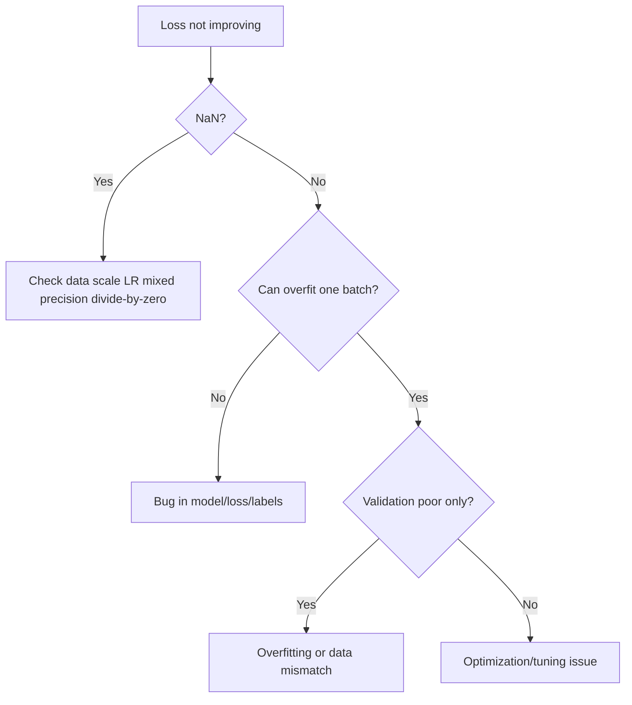

# Debugging Deep Learning Models

## Debugging philosophy
Start with the smallest reproducible setup and verify each stage: data -> model -> loss -> gradients -> optimization.



## Loss not decreasing checklist
- Verify labels align with objective (e.g., class ids for cross-entropy).
- Try overfitting one mini-batch to near-zero loss.
- Lower learning rate 10x.
- Ensure gradients are non-zero.

## NaN loss causes
- Too high LR.
- Exploding gradients.
- Invalid operations (log(0), division by 0).
- Mixed precision instability.

Fixes:
- gradient clipping
- safe epsilon terms
- lower LR
- disable AMP temporarily

## Overfitting symptoms/remedies
Symptoms:
- train loss down, val loss up.
Remedies:
- regularization, augmentation, early stopping, more data.

## Underfitting symptoms/remedies
Symptoms:
- both train/val poor.
Remedies:
- larger model, longer training, better features.

## Gradient flow debugging
```python
for name, p in model.named_parameters():
    if p.grad is not None:
        print(name, p.grad.norm().item())
```

Use hooks for deeper diagnostics.

## Useful techniques
- Fixed seed for determinism.
- Inspect batch statistics.
- Plot prediction histogram.
- Check class imbalance and label noise.

## Tools
- TensorBoard for curves/histograms.
- Weights & Biases for experiment comparisons.

## Interview questions
1. Your loss is NaN after 200 steps. What do you do first?
2. Why overfit-one-batch test is powerful?
3. How debug vanishing gradients?

## Practical logistics example
If ETA model suddenly fails after data pipeline change:
- check feature schema drift
- compare train/serve feature distributions
- replay prior good dataset through current code
