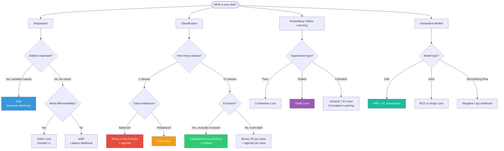

# Loss Functions

> **Interview relevance:** Interviewers expect you to connect loss functions to probability theory (MLE) and know when each applies. The critical questions are: "Why cross-entropy over MSE for classification?" and "What is focal loss?" Know how to implement custom losses in PyTorch.

---

## Table of Contents

1. [Mean Squared Error (MSE)](#1-mean-squared-error-mse)
2. [Mean Absolute Error (MAE)](#2-mean-absolute-error-mae)
3. [Huber Loss](#3-huber-loss)
4. [Binary Cross-Entropy](#4-binary-cross-entropy)
5. [Categorical Cross-Entropy](#5-categorical-cross-entropy)
6. [Sparse Categorical Cross-Entropy](#6-sparse-categorical-cross-entropy)
7. [KL Divergence](#7-kl-divergence)
8. [Contrastive Loss](#8-contrastive-loss)
9. [Triplet Loss](#9-triplet-loss)
10. [Focal Loss](#10-focal-loss)
11. [Hinge Loss](#11-hinge-loss)
12. [Custom Loss Functions in PyTorch](#12-custom-loss-functions-in-pytorch)
13. [Loss Selection Guide Diagram](#13-loss-selection-guide-diagram)
14. [Interview Questions](#14-interview-questions)
15. [Code: Implementing Custom Losses](#15-code)

---

## 1. Mean Squared Error (MSE)

### Formula

```
MSE = (1/n) Σ_{i=1}^{n} (ŷ_i - y_i)²

Per-sample loss: L_i = (ŷ_i - y_i)²
```

### Connection to Gaussian Likelihood (MLE Derivation)

Assume the true labels are generated as:
```
y = f(x) + ε,   ε ~ N(0, σ²)
```

The likelihood of observing y given prediction ŷ:
```
P(y | ŷ) = (1/√(2πσ²)) * exp(-(y - ŷ)²/(2σ²))
```

Log-likelihood:
```
log P(y | ŷ) = -log(√(2πσ²)) - (y - ŷ)²/(2σ²)
```

Maximizing log-likelihood = minimizing `(y - ŷ)²` = minimizing MSE.

**Key insight:** MSE is the maximum likelihood estimator for a Gaussian noise model. This is why MSE is natural for regression tasks.

### Gradient

```
dMSE/dŷ_i = (2/n)(ŷ_i - y_i)
```

The gradient is proportional to the prediction error. Large errors → large gradient updates.

### Sensitivity to Outliers

Since errors are squared, an outlier with error 10 contributes 100 to the loss, while one with error 1 contributes only 1. MSE is heavily influenced by outliers.

**Example:** Predictions: [1, 2, 100], True: [1, 2, 3]
- MSE = (0 + 0 + 97²)/3 ≈ 3136 — dominated by the outlier!
- MAE = (0 + 0 + 97)/3 ≈ 32 — more robust

### When to Use MSE

- Regression tasks with Gaussian noise assumption
- When all errors should be penalized uniformly
- When outliers are genuine signal (not noise), so you want to penalize them heavily
- Physics-informed models where Gaussian noise is physically motivated

---

## 2. Mean Absolute Error (MAE)

### Formula

```
MAE = (1/n) Σ_{i=1}^{n} |ŷ_i - y_i|
```

### Connection to Laplace Likelihood (MLE Derivation)

Assume:
```
y = f(x) + ε,   ε ~ Laplace(0, b)
```

Laplace distribution PDF: `P(ε) = (1/2b) exp(-|ε|/b)`

Log-likelihood:
```
log P(y | ŷ) = -log(2b) - |y - ŷ|/b
```

Maximizing log-likelihood = minimizing `|y - ŷ|` = minimizing MAE.

**Key insight:** MAE assumes a Laplacian (double exponential) noise model, which has heavier tails than Gaussian. Optimizing MAE is equivalent to estimating the median (not mean) of the conditional distribution.

### Gradient

```
dMAE/dŷ_i = sign(ŷ_i - y_i) / n   (= +1/n or -1/n)
```

The gradient has constant magnitude regardless of error size. Large errors get the same gradient as small errors — this is what makes MAE robust to outliers.

### The Non-Differentiability Problem

MAE is not differentiable at `ŷ = y`. In practice, use the subgradient (set to 0 or any value in [-1,1]). This is handled automatically in frameworks.

### When to Use MAE

- Regression when outliers should be ignored/downweighted
- Financial forecasting (where extreme events shouldn't dominate)
- When the conditional distribution of y is asymmetric or heavy-tailed

---

## 3. Huber Loss

### Formula

```
L_δ(y, ŷ) = {(1/2)(y - ŷ)²           if |y - ŷ| ≤ δ
            {δ|y - ŷ| - (1/2)δ²       if |y - ŷ| > δ
```

The parameter `δ` controls the transition between MSE and MAE behavior.

### Intuition

- **For small errors (|error| ≤ δ):** Behaves like MSE — smooth, differentiable everywhere
- **For large errors (|error| > δ):** Behaves like MAE — linear, robust to outliers

### Gradient

```
dL_δ/dŷ = {(ŷ - y)         if |y - ŷ| ≤ δ
           {δ * sign(ŷ - y) if |y - ŷ| > δ
```

### Advantages

- Differentiable everywhere (unlike MAE)
- Robust to outliers (unlike MSE)
- One hyperparameter δ to tune
- Also known as "smooth L1 loss" (used in Faster R-CNN object detection)

### When to Use

- Robust regression
- Object detection (bounding box regression)
- Reinforcement learning (Q-value regression)
- Any regression task where you want outlier robustness with smooth optimization

---

## 4. Binary Cross-Entropy

### Formula

For binary classification with label `y ∈ {0, 1}` and prediction `p = σ(logit) ∈ (0,1)`:

```
BCE = -(1/n) Σ [y_i log(p_i) + (1 - y_i) log(1 - p_i)]
```

### MLE Derivation

Assume labels are Bernoulli distributed:
```
y ~ Bernoulli(p)   where  p = σ(ŷ)
```

The likelihood:
```
P(y | p) = p^y * (1-p)^{1-y}
```

Log-likelihood:
```
log P(y | p) = y log(p) + (1-y) log(1-p)
```

Negative log-likelihood = Binary Cross-Entropy. **This is where BCE comes from.**

### Gradient w.r.t. Logit (Before Sigmoid)

If we work with logit `z` where `p = σ(z)`:

```
dBCE/dz = p - y   (the same beautiful gradient as softmax + cross-entropy!)
```

This is why frameworks provide `BCEWithLogitsLoss` (works on logits directly) instead of applying sigmoid then BCE. It's numerically more stable.

### Numerical Stability

Direct computation: `-(y log(σ(z)) + (1-y) log(1-σ(z)))` can overflow for large |z|.

Stable version (in code):
```
max(z, 0) - z*y + log(1 + exp(-|z|))
```

PyTorch `F.binary_cross_entropy_with_logits` uses this internally.

### When to Use

- Binary classification (sigmoid output)
- Multi-label classification (independent sigmoid per class)
- Generative model training (image reconstruction with pixel in [0,1])

---

## 5. Categorical Cross-Entropy

### Formula

For C-class classification with one-hot label `y ∈ R^C` and probabilities `p = softmax(z)`:

```
CCE = -(1/n) Σ_i Σ_k y_{ik} log(p_{ik})
     = -(1/n) Σ_i log(p_{i, true_class_i})
```

The second form holds because `y` is one-hot (only one term is nonzero).

### MLE Derivation

Labels follow a Categorical distribution:
```
y ~ Categorical(p_1, ..., p_C)
```

The log-likelihood of a single example with true class c:
```
log P(y | p) = log p_c = log softmax(z)_c = z_c - log Σ_k exp(z_k)
```

Negative log-likelihood sum over examples = Categorical Cross-Entropy.

### Gradient w.r.t. Logits

```
dCCE/dz_k = p_k - y_k   (for all k)
```

Or in vector form: `dCCE/dz = p - y`

This is the softmax + cross-entropy gradient we derived in backpropagation.

### Why CCE Outperforms MSE for Classification

Suppose true class is 0, and we have two predictions:
- Prediction A: `p = [0.5, 0.3, 0.2]` → CCE = -log(0.5) ≈ 0.69
- Prediction B: `p = [0.8, 0.1, 0.1]` → CCE = -log(0.8) ≈ 0.22

With MSE (treating as regression on one-hot):
- Prediction A: `((0.5-1)² + (0.3-0)² + (0.2-0)²)/3 = (0.25+0.09+0.04)/3 ≈ 0.127`
- Prediction B: `((0.8-1)² + (0.1-0)² + (0.1-0)²)/3 = (0.04+0.01+0.01)/3 ≈ 0.020`

MSE difference: 0.127 vs 0.020 (ratio 6.3x)
CCE difference: 0.69 vs 0.22 (ratio 3.1x)

**The deeper reason:** CCE gradient signal scales correctly with prediction confidence. When the model is very wrong (p → 0 for true class), CCE gradient is large (→ ∞ as p → 0). MSE gradient is bounded.

---

## 6. Sparse Categorical Cross-Entropy

### When to Use

When labels are integer class indices rather than one-hot vectors:
- Labels: `y = [2, 0, 1, 4, ...]` (class indices)
- Not: `y = [[0,0,1,0,0], [1,0,0,0,0], ...]` (one-hot)

Identical mathematical formulation to CCE, just with different input format. Used to save memory when number of classes is large (e.g., vocabulary in language models).

```python
# PyTorch: cross_entropy expects class indices (sparse)
loss = F.cross_entropy(logits, targets)  # targets: LongTensor of class indices
```

---

## 7. KL Divergence

### Formula

```
KL(P || Q) = Σ_x P(x) log(P(x) / Q(x))
           = Σ_x P(x) log P(x) - Σ_x P(x) log Q(x)
           = -H(P) + H(P, Q)
```

Where `H(P)` is the entropy of P and `H(P, Q)` is the cross-entropy.

**Alternative form:**
```
KL(P || Q) = E_{x~P} [log P(x) - log Q(x)]
```

### Properties

- Always `≥ 0` (Gibbs' inequality)
- `= 0` if and only if P = Q
- **Not symmetric:** `KL(P || Q) ≠ KL(Q || P)` in general
- Not a true metric (triangle inequality doesn't hold)

### Forward vs Reverse KL

**Forward KL: `KL(P || Q)` (minimize Q to match P)**
- "Mean-seeking": Q must cover all modes of P
- If P has mass where Q has none: infinite penalty
- Used in: maximum likelihood training of variational models

**Reverse KL: `KL(Q || P)` (minimize Q to be covered by P)**
- "Mode-seeking": Q concentrates on a single mode of P
- Used in: variational inference, RL (KL regularization from reference policy)

### Use in Variational Autoencoders (VAE)

The VAE ELBO (Evidence Lower BOund) loss:
```
L_VAE = E[log P(x|z)] - KL(Q(z|x) || P(z))
```

Where:
- `Q(z|x) = N(μ(x), σ²(x))` — encoder output (approximate posterior)
- `P(z) = N(0, I)` — prior
- The KL term regularizes the latent space to be Gaussian

**Closed form for Gaussian KL:**
```
KL(N(μ, σ²) || N(0,1)) = (1/2) Σ_j (μ_j² + σ_j² - log σ_j² - 1)
```

### Connection to Cross-Entropy

When P is fixed (true distribution):
```
KL(P || Q) = H(P, Q) - H(P)
```

Minimizing KL is equivalent to minimizing cross-entropy H(P, Q) when P is fixed.

---

## 8. Contrastive Loss

### Formula

For a pair of samples `(x_1, x_2)` with label `y = 0` (similar) or `y = 1` (dissimilar):

```
L_contrastive = (1-y) * (1/2) d² + y * (1/2) max(0, m - d)²
```

Where:
- `d = ||f(x_1) - f(x_2)||` — Euclidean distance between embeddings
- `m` — margin (hyperparameter, e.g., m=1.0)

### Intuition

- **For similar pairs (y=0):** Minimize distance `d`. Pull embeddings together.
- **For dissimilar pairs (y=1):** Push apart, but only if `d < m`. Once the distance exceeds the margin, no penalty.

### Limitation

Requires pair construction. With N samples, O(N²) pairs. Some pairs are uninformative (easy negatives), leading to slow training.

### Used In

Siamese networks, face verification (DeepFace), sentence embeddings. Largely superseded by triplet loss and InfoNCE.

---

## 9. Triplet Loss

### Formula

For anchor `a`, positive `p` (same class), and negative `n` (different class):

```
L_triplet = max(0, ||f(a) - f(p)||² - ||f(a) - f(n)||² + margin)
```

### Intuition

Force: `distance(anchor, positive) + margin < distance(anchor, negative)`

The embedding space should pull same-class samples together and push different-class samples apart by at least `margin`.

### Mining Strategies

The quality of training depends critically on which triplets you choose:

| Strategy | Definition | Effectiveness |
|---------|-----------|--------------|
| Easy triplets | Negative already far enough | No gradient! Zero loss |
| Semi-hard negatives | Positive closer than negative, but within margin | Good gradient signal |
| Hard negatives | Negative closer than positive | Can cause instability |

**In practice:** Semi-hard negative mining (Google FaceNet) or online mining within each batch.

### Used In

FaceNet (face recognition), image retrieval, metric learning, embedding training.

---

## 10. Focal Loss

### Formula

For binary classification with prediction `p_t` (probability of the true class):

```
FL(p_t) = -(1 - p_t)^γ log(p_t)

Standard cross-entropy:  CE(p_t) = -log(p_t)
Focal loss:              FL(p_t) = -(1 - p_t)^γ log(p_t)
```

Where `γ ≥ 0` is the focusing parameter (typically `γ = 2`).

### Intuition: Addressing Class Imbalance

In object detection, there can be 10,000 background anchors vs 10 foreground objects (1000:1 imbalance). Standard cross-entropy is dominated by the easy negative examples (confident background predictions).

**Focal loss down-weights easy examples:**
- Easy example (p_t = 0.9): FL factor = `(1-0.9)^2 = 0.01` → 100x reduction
- Hard example (p_t = 0.1): FL factor = `(1-0.1)^2 = 0.81` → small reduction

Easy examples, even with large count, contribute negligibly to training. Hard examples dominate learning.

### Complete Formula with α

```
FL(p_t) = -α_t (1 - p_t)^γ log(p_t)
```

Where `α_t` is the class balancing factor (like inverse class frequency). Typical: `α = 0.25` for foreground.

### Effect of γ

| γ | Behavior |
|---|---------|
| 0 | Standard cross-entropy |
| 0.5 | Mild down-weighting of easy examples |
| 2 | Standard focal loss setting (Lin et al., RetinaNet) |
| 5 | Extreme focus on hardest examples |

### Used In

RetinaNet (one-stage object detection), any highly imbalanced classification task. Also applied to NLP tasks with class imbalance.

---

## 11. Hinge Loss

### Formula

For binary classification with label `y ∈ {-1, +1}` and raw score `f(x)`:

```
L_hinge = max(0, 1 - y * f(x))
```

Multiclass (Crammer-Singer):
```
L_hinge = Σ_{j≠y} max(0, 1 - f(x)_y + f(x)_j)
```

### Intuition

- **Correct and confident:** `y * f(x) ≥ 1` → zero loss (you're already correct with margin)
- **Correct but not confident:** `0 < y * f(x) < 1` → positive loss, encourage stronger confidence
- **Incorrect:** `y * f(x) < 0` → positive loss, large penalty

### SVM Connection

The SVM objective is `min (1/2)||w||² + C Σ max(0, 1 - y_i(w^T x_i + b))`. The second term is exactly the hinge loss. The first term is L2 regularization. SVMs minimize hinge loss + L2 regularization.

### When to Use in Deep Learning

- Historically important, but mostly replaced by cross-entropy in deep learning
- Can be useful for structured prediction tasks
- WGAN (Wasserstein GAN) uses a variant of hinge loss for the discriminator

---

## 12. Custom Loss Functions in PyTorch

### Method 1: Functional Approach

```python
def focal_loss(logits, targets, gamma=2.0, alpha=0.25, reduction='mean'):
    """
    Focal loss for binary classification.
    logits: raw model outputs (before sigmoid)
    targets: binary labels {0, 1}
    """
    # Compute BCE loss element-wise
    bce = F.binary_cross_entropy_with_logits(logits, targets.float(), reduction='none')
    # p_t = probability of the true class
    p_t = torch.exp(-bce)
    # Apply focusing factor
    focal_weight = (1 - p_t) ** gamma
    # Apply class balancing factor alpha
    alpha_t = alpha * targets + (1 - alpha) * (1 - targets)
    loss = alpha_t * focal_weight * bce

    if reduction == 'mean':
        return loss.mean()
    elif reduction == 'sum':
        return loss.sum()
    return loss
```

### Method 2: nn.Module Approach (Recommended for Complex Losses)

```python
class TripletLoss(nn.Module):
    def __init__(self, margin: float = 1.0):
        super().__init__()
        self.margin = margin

    def forward(self, anchor: torch.Tensor,
                positive: torch.Tensor,
                negative: torch.Tensor) -> torch.Tensor:
        """
        anchor, positive, negative: embedding vectors (batch_size, embed_dim)
        """
        dist_pos = F.pairwise_distance(anchor, positive, p=2)
        dist_neg = F.pairwise_distance(anchor, negative, p=2)
        # max(0, d(a,p) - d(a,n) + margin)
        losses = F.relu(dist_pos - dist_neg + self.margin)
        return losses.mean()
```

---

## 13. Loss Selection Guide Diagram



---

## 14. Interview Questions

### Q1: Why is cross-entropy preferred over MSE for classification?

**Strong answer:**

> Three interconnected reasons:
>
> **1. Probabilistic interpretation:** Cross-entropy is the negative log-likelihood under a Categorical distribution. By minimizing it, we're doing maximum likelihood estimation of a probabilistic classifier. MSE corresponds to a Gaussian likelihood, which is wrong for classification.
>
> **2. Gradient behavior:** The gradient of softmax + cross-entropy w.r.t. logits is `p - y`. When the model is confident and wrong (p → 0 for the true class), the gradient is large, causing strong updates. MSE gradient with softmax is more complex and typically smaller for confident but wrong predictions.
>
> **3. Loss surface:** Cross-entropy creates a smoother, better-conditioned loss surface for classification. MSE on softmax outputs can create flat regions where the model is confidently wrong but receives tiny gradient.
>
> A concrete example: if true class is 0 and model outputs logit -10 (extremely wrong), BCE loss → large gradient, quick correction. MSE between softmax output (≈0) and one-hot (1) → small loss (they differ by ~1), slow correction.

### Q2: What is focal loss and when do you use it?

**Strong answer:**

> Focal loss is `FL(p_t) = -(1-p_t)^γ log(p_t)`. It modifies cross-entropy by down-weighting easy examples.
>
> The term `(1-p_t)^γ` is the focusing factor. When a sample is easy (high p_t), this factor is small, suppressing its contribution to the loss. When a sample is hard (low p_t), the factor is close to 1.
>
> It was introduced by Lin et al. for RetinaNet object detection, where the foreground/background imbalance can be 1:10,000. Without focal loss, the model learns mainly to say "background" on all proposals. Focal loss forces the model to focus on the rare, hard foreground examples.
>
> I'd use it when: (1) training data is highly imbalanced, (2) there are many easy examples drowning out the hard ones, (3) standard class weighting is insufficient.

### Q3: What is the KL divergence and how does it appear in VAEs?

**Strong answer:**

> KL divergence `KL(P || Q) = E_{P}[log P/Q]` measures how much one distribution P differs from another Q. It's always non-negative and equals zero only when P = Q exactly.
>
> In VAEs, we want to learn a latent representation z for input x. The encoder produces approximate posterior `Q(z|x) = N(μ(x), σ²(x))`. The VAE loss has two terms:
>
> 1. **Reconstruction term** `E[log P(x|z)]`: the decoder should reconstruct x well
> 2. **KL term** `-KL(Q(z|x) || P(z))` where P(z)=N(0,I) is the prior
>
> The KL term regularizes the latent space to be Gaussian-like, enabling interpolation and sampling. Without it, the encoder would just memorize, not learn a meaningful latent structure.
>
> The KL term has a closed form for Gaussian distributions: `(1/2)(μ² + σ² - log σ² - 1)`.

---

## 15. Code: Implementing Custom Losses

```python
import torch
import torch.nn as nn
import torch.nn.functional as F
import numpy as np
from typing import Optional


# ============================================================
# 1. Loss Functions from Scratch
# ============================================================

class MSELoss(nn.Module):
    """MSE loss with optional sample weights."""
    def forward(self, pred: torch.Tensor, target: torch.Tensor,
                weights: Optional[torch.Tensor] = None) -> torch.Tensor:
        errors = (pred - target) ** 2
        if weights is not None:
            errors = errors * weights
        return errors.mean()


class HuberLoss(nn.Module):
    """Huber loss (smooth L1). delta controls transition point."""
    def __init__(self, delta: float = 1.0):
        super().__init__()
        self.delta = delta

    def forward(self, pred: torch.Tensor, target: torch.Tensor) -> torch.Tensor:
        error = torch.abs(pred - target)
        quadratic = torch.clamp(error, max=self.delta)
        linear = error - quadratic
        loss = 0.5 * quadratic ** 2 + self.delta * linear
        return loss.mean()


class FocalLoss(nn.Module):
    """
    Focal Loss for binary classification (Lin et al., 2017).
    Works with logits (before sigmoid).
    """
    def __init__(self, gamma: float = 2.0, alpha: float = 0.25,
                 reduction: str = 'mean'):
        super().__init__()
        self.gamma = gamma
        self.alpha = alpha
        self.reduction = reduction

    def forward(self, logits: torch.Tensor, targets: torch.Tensor) -> torch.Tensor:
        """
        logits: shape (N,) — raw model outputs before sigmoid
        targets: shape (N,) — binary labels {0, 1}
        """
        # Numerically stable BCE: p_t = probability of true class
        bce = F.binary_cross_entropy_with_logits(
            logits, targets.float(), reduction='none'
        )
        p_t = torch.exp(-bce)  # p_t = sigmoid(logits) for y=1, 1-sigmoid for y=0

        # Focusing factor
        focal_factor = (1.0 - p_t) ** self.gamma

        # Class balancing
        alpha_t = self.alpha * targets + (1 - self.alpha) * (1 - targets)

        focal_loss = alpha_t * focal_factor * bce

        if self.reduction == 'mean':
            return focal_loss.mean()
        elif self.reduction == 'sum':
            return focal_loss.sum()
        return focal_loss


class MulticlassFocalLoss(nn.Module):
    """Focal loss for multi-class classification."""
    def __init__(self, gamma: float = 2.0, weight: Optional[torch.Tensor] = None):
        super().__init__()
        self.gamma = gamma
        self.weight = weight

    def forward(self, logits: torch.Tensor, targets: torch.Tensor) -> torch.Tensor:
        """
        logits: shape (N, C)
        targets: shape (N,) — class indices
        """
        log_probs = F.log_softmax(logits, dim=1)
        probs = torch.exp(log_probs)

        # Gather probability of true class
        target_log_probs = log_probs.gather(1, targets.unsqueeze(1)).squeeze(1)
        target_probs = probs.gather(1, targets.unsqueeze(1)).squeeze(1)

        # Focal weight
        focal_weight = (1 - target_probs) ** self.gamma

        loss = -focal_weight * target_log_probs

        if self.weight is not None:
            loss = loss * self.weight[targets]

        return loss.mean()


class TripletLoss(nn.Module):
    """
    Triplet loss for metric learning.
    Can use offline or online (within-batch) mining.
    """
    def __init__(self, margin: float = 1.0, p: float = 2.0,
                 mining: str = 'online'):
        super().__init__()
        self.margin = margin
        self.p = p
        self.mining = mining

    def forward(self,
                anchor: Optional[torch.Tensor] = None,
                positive: Optional[torch.Tensor] = None,
                negative: Optional[torch.Tensor] = None,
                embeddings: Optional[torch.Tensor] = None,
                labels: Optional[torch.Tensor] = None) -> torch.Tensor:

        if self.mining == 'offline':
            assert anchor is not None and positive is not None and negative is not None
            return self._offline_triplet_loss(anchor, positive, negative)
        elif self.mining == 'online':
            assert embeddings is not None and labels is not None
            return self._online_triplet_loss(embeddings, labels)
        raise ValueError(f"Unknown mining strategy: {self.mining}")

    def _offline_triplet_loss(self, anchor, positive, negative):
        d_pos = F.pairwise_distance(anchor, positive, p=self.p)
        d_neg = F.pairwise_distance(anchor, negative, p=self.p)
        loss = F.relu(d_pos - d_neg + self.margin)
        return loss.mean()

    def _online_triplet_loss(self, embeddings, labels):
        """
        Semi-hard negative mining within a batch.
        For each (anchor, positive) pair, find negatives that are
        farther than positive but within margin.
        """
        n = len(embeddings)
        # Pairwise distance matrix
        dist_matrix = torch.cdist(embeddings, embeddings, p=self.p)

        losses = []
        for i in range(n):
            for j in range(n):
                if labels[i] != labels[j]:
                    continue
                if i == j:
                    continue
                # (i, j) is an anchor-positive pair
                d_pos = dist_matrix[i, j]

                # Find semi-hard negatives: d_pos < d_neg < d_pos + margin
                for k in range(n):
                    if labels[k] == labels[i]:
                        continue
                    d_neg = dist_matrix[i, k]
                    if d_pos < d_neg < d_pos + self.margin:
                        losses.append(F.relu(d_pos - d_neg + self.margin))

        if len(losses) == 0:
            return torch.tensor(0.0, requires_grad=True)
        return torch.stack(losses).mean()


class ContrastiveLoss(nn.Module):
    """Contrastive loss for siamese networks."""
    def __init__(self, margin: float = 1.0):
        super().__init__()
        self.margin = margin

    def forward(self, embed1: torch.Tensor, embed2: torch.Tensor,
                labels: torch.Tensor) -> torch.Tensor:
        """
        labels: 0 = similar, 1 = dissimilar
        """
        distances = F.pairwise_distance(embed1, embed2, p=2)
        similar_loss = (1 - labels) * 0.5 * distances ** 2
        dissimilar_loss = labels * 0.5 * F.relu(self.margin - distances) ** 2
        return (similar_loss + dissimilar_loss).mean()


class VAELoss(nn.Module):
    """
    VAE ELBO loss = Reconstruction + KL divergence.
    beta parameter for beta-VAE (disentanglement).
    """
    def __init__(self, beta: float = 1.0, reconstruction: str = 'bce'):
        super().__init__()
        self.beta = beta
        self.reconstruction = reconstruction

    def forward(self, recon_x: torch.Tensor, x: torch.Tensor,
                mu: torch.Tensor, log_var: torch.Tensor) -> dict:
        """
        recon_x: reconstructed input
        x: original input
        mu, log_var: encoder outputs
        """
        # Reconstruction loss
        if self.reconstruction == 'bce':
            recon_loss = F.binary_cross_entropy(
                recon_x, x, reduction='sum'
            ) / x.size(0)
        else:  # mse
            recon_loss = F.mse_loss(recon_x, x, reduction='sum') / x.size(0)

        # KL divergence: KL(N(mu, sigma^2) || N(0, 1))
        # Closed form: (1/2) * sum(mu^2 + sigma^2 - log(sigma^2) - 1)
        kl_loss = -0.5 * torch.sum(
            1 + log_var - mu ** 2 - log_var.exp()
        ) / x.size(0)

        total_loss = recon_loss + self.beta * kl_loss

        return {
            'total': total_loss,
            'reconstruction': recon_loss,
            'kl': kl_loss
        }


class LabelSmoothingCrossEntropy(nn.Module):
    """
    Label smoothing reduces overconfidence.
    Instead of hard {0,1} targets, use {ε/(C-1), 1-ε}.
    Helps calibration and generalization (Szegedy et al., 2016).
    """
    def __init__(self, smoothing: float = 0.1, num_classes: int = None):
        super().__init__()
        self.smoothing = smoothing
        self.num_classes = num_classes

    def forward(self, logits: torch.Tensor, targets: torch.Tensor) -> torch.Tensor:
        n_classes = logits.size(-1)
        log_probs = F.log_softmax(logits, dim=-1)

        # Smooth targets
        with torch.no_grad():
            smooth_targets = torch.full_like(log_probs, self.smoothing / (n_classes - 1))
            smooth_targets.scatter_(1, targets.unsqueeze(1), 1.0 - self.smoothing)

        loss = -(smooth_targets * log_probs).sum(dim=-1)
        return loss.mean()


# ============================================================
# 2. Verification and Testing
# ============================================================

def verify_losses():
    """Verify custom losses match PyTorch built-ins."""
    torch.manual_seed(42)
    print("=== Loss Function Verification ===\n")

    # --- MSE ---
    pred = torch.randn(10, 1)
    target = torch.randn(10, 1)
    custom_mse = MSELoss()(pred, target)
    pytorch_mse = F.mse_loss(pred, target)
    print(f"MSE - Custom: {custom_mse:.6f}, PyTorch: {pytorch_mse:.6f}, "
          f"Match: {torch.allclose(custom_mse, pytorch_mse)}")

    # --- Huber ---
    custom_huber = HuberLoss(delta=1.0)(pred, target)
    pytorch_huber = F.smooth_l1_loss(pred, target)
    # Note: PyTorch smooth_l1_loss uses delta=1 but different formulation
    print(f"Huber - Custom: {custom_huber:.6f}, PyTorch: {pytorch_huber:.6f}")

    # --- Focal Loss ---
    logits = torch.randn(32)
    targets = torch.randint(0, 2, (32,))
    custom_focal = FocalLoss(gamma=2.0, alpha=0.25)(logits, targets)
    print(f"Focal Loss (gamma=2): {custom_focal:.6f}")

    # Verify: gamma=0, alpha=0.5 should match BCE
    focal_as_bce = FocalLoss(gamma=0, alpha=0.5)(logits, targets)
    bce = F.binary_cross_entropy_with_logits(logits, targets.float())
    print(f"Focal (gamma=0, alpha=0.5): {focal_as_bce:.6f}, BCE: {bce:.6f}, "
          f"Close: {abs(focal_as_bce.item() - bce.item()) < 0.01}")

    # --- Triplet Loss ---
    embed_dim = 16
    a = F.normalize(torch.randn(8, embed_dim), dim=1)
    p = F.normalize(torch.randn(8, embed_dim), dim=1)
    n = F.normalize(torch.randn(8, embed_dim), dim=1)
    triplet = TripletLoss(margin=0.5, mining='offline')(anchor=a, positive=p, negative=n)
    pytorch_triplet = F.triplet_margin_loss(a, p, n, margin=0.5)
    print(f"Triplet - Custom: {triplet:.6f}, PyTorch: {pytorch_triplet:.6f}, "
          f"Match: {torch.allclose(triplet, pytorch_triplet, atol=1e-5)}")

    # --- VAE Loss ---
    batch_size, latent_dim = 16, 8
    recon = torch.sigmoid(torch.randn(batch_size, 784))
    x = torch.sigmoid(torch.randn(batch_size, 784))
    mu = torch.randn(batch_size, latent_dim)
    log_var = torch.randn(batch_size, latent_dim)
    vae_loss = VAELoss(beta=1.0)(recon, x, mu, log_var)
    print(f"\nVAE Loss - Total: {vae_loss['total']:.4f}, "
          f"Recon: {vae_loss['reconstruction']:.4f}, "
          f"KL: {vae_loss['kl']:.4f}")

    # --- Label Smoothing ---
    logits_clf = torch.randn(16, 10)
    targets_clf = torch.randint(0, 10, (16,))
    ls_loss = LabelSmoothingCrossEntropy(smoothing=0.1)(logits_clf, targets_clf)
    ce_loss = F.cross_entropy(logits_clf, targets_clf)
    pytorch_ls = nn.CrossEntropyLoss(label_smoothing=0.1)(logits_clf, targets_clf)
    print(f"\nLabel Smoothing - Custom: {ls_loss:.6f}, CE: {ce_loss:.6f}, "
          f"PyTorch LS: {pytorch_ls:.6f}")
    print("  (LS loss should be >= CE loss due to smoothed targets being harder to achieve)")


def demonstrate_focal_vs_bce():
    """Show how focal loss up-weights hard examples."""
    print("\n=== Focal Loss: Effect on Easy vs Hard Examples ===")

    # Easy example: model is very confident and correct (p_t = 0.9)
    # Hard example: model is uncertain (p_t = 0.2)

    p_t_values = [0.05, 0.1, 0.2, 0.5, 0.7, 0.9, 0.95]
    gammas = [0, 0.5, 1, 2, 5]

    print(f"{'p_t':>6} " + " ".join(f"{'γ='+str(g):>10}" for g in gammas))
    print("-" * 70)

    for p_t in p_t_values:
        ce = -np.log(p_t + 1e-10)
        focal_values = [-(1 - p_t)**gamma * np.log(p_t + 1e-10) for gamma in gammas]
        row = f"{p_t:>6.2f} " + " ".join(f"{v:>10.4f}" for v in focal_values)
        row += f"  (CE={ce:.4f})"
        print(row)

    print("\nKey: For easy examples (high p_t), higher γ → much lower loss weight")
    print("     For hard examples (low p_t), γ has little effect")


if __name__ == '__main__':
    verify_losses()
    demonstrate_focal_vs_bce()
```

---

## Quick Reference: Loss Function Selection

```
Task                        Loss Function              Output Activation
─────────────────────────────────────────────────────────────────────────
Binary classification       BCEWithLogitsLoss          Sigmoid (or logit)
Multi-class (exclusive)     CrossEntropyLoss           Softmax (or logit)
Multi-label                 BCEWithLogitsLoss per-cls  Sigmoid per class
Class imbalance             FocalLoss                  Sigmoid/Softmax
Regression                  MSELoss                    Linear
Robust regression           HuberLoss                  Linear
Ranking / metric            TripletMarginLoss           L2-normalized
VAE generative              MSE + KL_divergence        Sigmoid / Linear
GAN discriminator           BCELoss / HingeLoss        Sigmoid / Linear
Calibration                 CrossEntropy + LabelSmooth Softmax
```

---

*Next: [Optimizers and Learning Rates](./optimizers_and_learning_rates.md) - How we minimize these losses efficiently*
