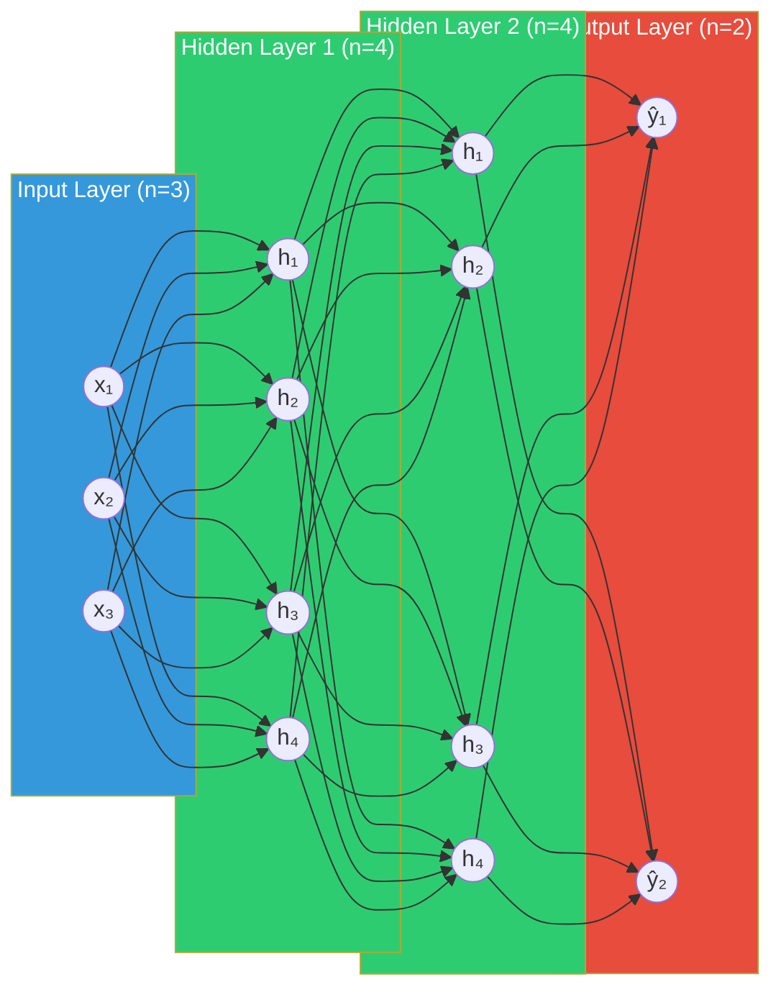

# Neural Network Fundamentals

> **Interview relevance:** This is the bedrock. Interviewers expect you to move quickly from high-level intuition to precise mathematical statements. Know the Universal Approximation Theorem cold, understand why depth matters more than width in practice, and be able to write an MLP from scratch.

---

## Table of Contents

1. [Biological Neuron Analogy](#1-biological-neuron-analogy)
2. [The Perceptron](#2-the-perceptron)
3. [Multi-Layer Perceptron (MLP)](#3-multi-layer-perceptron)
4. [Forward Pass: The Math](#4-forward-pass-the-math)
5. [Computational Graphs](#5-computational-graphs)
6. [Why Depth Matters](#6-why-depth-matters)
7. [Network Capacity: Width vs Depth](#7-network-capacity-width-vs-depth)
8. [Parameters vs Hyperparameters](#8-parameters-vs-hyperparameters)
9. [MLP Architecture Diagram](#9-mlp-architecture-diagram)
10. [Interview Questions](#10-interview-questions)
11. [Code: MLP from Scratch](#11-code-mlp-from-scratch)

---

## 1. Biological Neuron Analogy

A biological neuron receives electrical signals from dendrites, integrates them in the soma (cell body), and fires an action potential down the axon if the integrated signal exceeds a threshold. Synaptic weights determine how strongly one neuron influences another.

**The analogy to artificial neurons:**

| Biological | Artificial |
|-----------|-----------|
| Dendrite input | Input features `x_i` |
| Synaptic strength | Weight `w_i` |
| Soma integration | Weighted sum `Σ w_i x_i + b` |
| Action potential threshold | Activation function `f(z)` |
| Axon output | Neuron output `a` |

**Critical caveat:** The analogy is useful for intuition but should not be taken literally. Real neurons are vastly more complex, use spike timing, and operate on different principles. Modern deep learning draws more from signal processing and optimization theory than neuroscience.

---

## 2. The Perceptron

### History

Frank Rosenblatt introduced the perceptron in 1958. It was the first trainable artificial neural network and sparked enormous excitement. In 1969, Marvin Minsky and Seymour Papert published "Perceptrons," proving that a single-layer perceptron cannot solve linearly inseparable problems like XOR. This triggered the first "AI winter."

### Mathematical Definition

A perceptron computes:

```
z = w^T x + b = Σ(i=1 to n) w_i * x_i + b

output = {
    1   if z >= 0
    0   if z < 0
}
```

Where:
- `x ∈ R^n` is the input vector
- `w ∈ R^n` is the weight vector
- `b ∈ R` is the bias (threshold offset)
- The output is a hard step function (Heaviside)

### Perceptron Learning Rule

For each training example `(x, y)`:
1. Compute prediction: `y_hat = step(w^T x + b)`
2. Update: `w ← w + η(y - y_hat)x`
3. Update: `b ← b + η(y - y_hat)`

Where `η` (eta) is the learning rate.

**Guarantee:** The perceptron convergence theorem states that if the data is linearly separable, the perceptron will converge to a separating hyperplane in finite steps.

### The XOR Problem: Why Single-Layer Fails

XOR truth table:

| x1 | x2 | XOR |
|----|----|----|
| 0  | 0  | 0  |
| 0  | 1  | 1  |
| 1  | 0  | 1  |
| 1  | 1  | 0  |

If you plot these four points, the two class-1 points (0,1) and (1,0) cannot be separated from class-0 points (0,0) and (1,1) by any single straight line. The XOR function is not linearly separable.

**The fix:** Add a hidden layer. With one hidden layer and nonlinear activations, XOR becomes trivially solvable. This is the key motivation for deep learning.

---

## 3. Multi-Layer Perceptron (MLP)

An MLP stacks multiple layers of perceptrons (neurons) with nonlinear activations between them.

### Structure

- **Input layer:** Raw features (no computation, just data ingestion)
- **Hidden layers:** Transform representations; where learning happens
- **Output layer:** Produces final predictions

### Universal Approximation Theorem (UAT)

**Statement (Cybenko, 1989; Hornik et al., 1989):**

> A feedforward network with a single hidden layer containing a finite number of neurons can approximate any continuous function on a compact subset of R^n to arbitrary precision, provided the activation function is non-constant, bounded, and continuous (i.e., a sigmoid-like function).

**More modern statement (Barron, 1993; with ReLU):**

For any continuous function f on a compact domain, and any ε > 0, there exists a ReLU network with one hidden layer and sufficient width such that the approximation error is less than ε.

**What UAT does NOT say:**
- It does not tell you how many neurons you need (could be exponential)
- It does not say learning is easy or that you will find the right weights
- It does not say shallow networks are as efficient as deep networks
- It says nothing about generalization

**The depth efficiency argument:** Deep networks can represent certain functions exponentially more efficiently than shallow networks. A function requiring 2^n neurons in 1 layer may only need O(n) neurons in O(log n) layers.

---

## 4. Forward Pass: The Math

### Notation

- `L`: number of layers (not counting input)
- `W^[l]`: weight matrix at layer l, shape `(n_l, n_{l-1})`
- `b^[l]`: bias vector at layer l, shape `(n_l,)`
- `a^[l]`: activation vector at layer l
- `z^[l]`: pre-activation (linear combination) at layer l
- `f`: activation function

### Layer-by-Layer Computation

For each layer `l = 1, 2, ..., L`:

```
z^[l] = W^[l] * a^[l-1] + b^[l]      # Linear transformation
a^[l] = f(z^[l])                        # Nonlinear activation
```

With `a^[0] = x` (the input).

### Concrete 2-Layer MLP Example

**Architecture:** 3 inputs → 4 hidden units → 2 outputs

```
Input:       x ∈ R^3
Hidden:      z^[1] = W^[1] x + b^[1],   W^[1] ∈ R^{4×3}, b^[1] ∈ R^4
             a^[1] = ReLU(z^[1])         a^[1] ∈ R^4
Output:      z^[2] = W^[2] a^[1] + b^[2], W^[2] ∈ R^{2×4}, b^[2] ∈ R^2
             a^[2] = softmax(z^[2])       a^[2] ∈ R^2
```

**Parameter count:**
- Layer 1 weights: `4 × 3 = 12`
- Layer 1 biases: `4`
- Layer 2 weights: `2 × 4 = 8`
- Layer 2 biases: `2`
- **Total: 26 parameters**

### Batched Forward Pass

In practice, we process batches of `m` examples simultaneously:

```
X ∈ R^{m × n_0}      (m examples, n_0 features each)
Z^[l] = X W^[l]^T + b^[l]    (broadcasting the bias)
A^[l] = f(Z^[l])
```

This leverages highly optimized BLAS/cuBLAS matrix multiplication routines.

### Why Nonlinearity Is Mandatory

Without activation functions, the entire network collapses to a single linear transformation:

```
a^[2] = W^[2](W^[1]x + b^[1]) + b^[2]
      = (W^[2]W^[1])x + (W^[2]b^[1] + b^[2])
      = W_eff * x + b_eff    ← single linear layer!
```

A composition of linear functions is linear. No depth of purely linear layers can represent nonlinear relationships. The activation function is what makes depth meaningful.

---

## 5. Computational Graphs

A computational graph is a directed acyclic graph (DAG) where:
- **Nodes** represent operations or variables
- **Edges** represent data flow (tensors)

For the expression `L = (w*x - y)^2`:

```
    w    x
     \  /
      ×        (multiply)
      |
      -    y
       \  /
        -      (subtract)
        |
       (·)²    (square)
        |
        L
```

### Why Computational Graphs Matter

1. **Automatic differentiation:** The graph structure tells us exactly how to apply the chain rule. Each node needs only to know its local derivative. The system computes global gradients by traversing the graph in reverse (backpropagation).

2. **Modularity:** You can compose arbitrarily complex models from simple building blocks, and gradient computation is automatic.

3. **Optimization:** Graph compilers (XLA, TorchScript) can optimize execution by fusing operations, reordering computations, and parallelizing independent branches.

### PyTorch's Dynamic Computational Graph

PyTorch builds the graph at runtime (eager mode) as operations execute. This is called **define-by-run** (vs TensorFlow 1.x's define-then-run). The advantage: Python control flow (if statements, loops) naturally becomes part of the graph.

---

## 6. Why Depth Matters

### Feature Hierarchy Intuition

In a deep network for image recognition:

```
Pixels → Edges → Textures → Object Parts → Objects → Scenes
  L1        L2       L3            L4          L5       L6
```

Each layer learns increasingly abstract representations. Lower layers detect low-level features (Gabor-like edge detectors, color blobs). Higher layers compose these into semantic concepts.

### The Depth Efficiency Theorem (informal)

Some functions can be computed by a depth-k circuit of polynomial size that require exponential size at depth k-1. Deep networks can represent exponentially more complex functions than shallow ones with the same parameter count.

**Practical example:** Parity function on n bits:
- Shallow network (1 hidden layer): needs O(2^n) neurons
- Deep network (log n layers): needs O(n) neurons

### Empirical Evidence

The success of networks like ResNet-152, VGG-19, and GPT (which has 96+ layers of transformer blocks) shows that depth is essential. Attempting to match their performance with a single hidden layer would require an astronomically large network.

### The Compositionality Argument

Real-world data has compositional structure:
- Language: words → phrases → sentences → discourse
- Audio: frequency components → phonemes → words → sentences
- Images: pixels → edges → parts → objects → scenes

Deep networks naturally implement hierarchical composition through their layered structure.

---

## 7. Network Capacity: Width vs Depth

### Width (more neurons per layer)

- Increases the number of basis functions the layer can represent
- Larger weight matrices, more parameters
- Easier to parallelize (GPU-friendly)
- Diminishing returns: doubling width does not double capability

### Depth (more layers)

- Enables compositional representations
- More efficient representation of certain function classes
- Harder to train (vanishing/exploding gradients)
- Requires careful initialization and normalization

### Practical Guidelines

| Scenario | Recommendation |
|---------|----------------|
| Tabular data, small dataset | Wider, shallower (2-3 layers) |
| Image data | Deep CNNs (ResNet) |
| Language modeling | Very deep transformer (96+ layers for GPT-3) |
| Time-critical inference | Shallower, wider (trade accuracy for speed) |
| Resource-constrained | Depth-wise separable convolutions, pruning |

### The Depth vs Width Debate in Practice

**Zagoruyko and Komodakis (2016)** showed "Wide ResNets" can match deep ResNets with fewer layers but more channels. This suggests the answer is task-dependent.

**The consensus:** For most tasks, depth is more parameter-efficient, but extremely deep networks require architectural innovations (skip connections, normalization) to train successfully.

---

## 8. Parameters vs Hyperparameters

### Parameters (learned from data)

- **Weights** `W^[l]`: the actual numbers the network learns
- **Biases** `b^[l]`: offsets per neuron
- **Normalization parameters** `γ, β` (in BatchNorm/LayerNorm)
- These are updated by the optimizer during training

### Hyperparameters (set before training)

| Category | Examples |
|---------|---------|
| Architecture | Number of layers, hidden size, activation function |
| Training | Learning rate, batch size, number of epochs |
| Regularization | Dropout rate, weight decay, gradient clip value |
| Optimization | Optimizer type, momentum, β1, β2 (Adam) |
| Data | Augmentation strategy, train/val split |

### Hyperparameter Tuning Strategies

1. **Manual search:** Expert intuition, start with known-good configs
2. **Grid search:** Exhaustive over a discretized hyperparameter space
3. **Random search:** Often better than grid search in high dimensions (Bergstra & Bengio, 2012)
4. **Bayesian optimization:** Use a surrogate model to guide search (Optuna, SigOpt)
5. **Population-based training:** Evolutionary strategies on multiple runs

**Interview insight:** When asked about hyperparameter tuning, mention that learning rate is the single most important hyperparameter, and describe learning rate finder methods.

---

## 9. MLP Architecture Diagram



**Annotations:**
- Each arrow represents a learnable weight
- Every neuron in a hidden layer applies: `a = f(W^T x_prev + b)`
- "Fully connected" = every neuron connects to all neurons in adjacent layers
- Parameters: `(3×4 + 4) + (4×4 + 4) + (4×2 + 2) = 16 + 20 + 10 = 46`

---

## 10. Interview Questions

### Q1: What is the Universal Approximation Theorem? What are its limitations?

**Strong answer:**
> The UAT states that a feedforward network with a single hidden layer of sufficient width can approximate any continuous function on a compact domain to arbitrary precision. This was proven for sigmoid activations by Cybenko (1989) and later extended to ReLU.
>
> However, the UAT has critical limitations: (1) it says nothing about how many neurons are needed (could be exponential), (2) it gives no guarantee that gradient descent will find the right weights, and (3) it says nothing about generalization to unseen data. The theorem tells us that the function class of neural networks is expressive, but tells us nothing about learning efficiency.

### Q2: Is a wider network or deeper network better?

**Strong answer:**
> It depends on the task and data. Depth is generally more parameter-efficient because deep networks can represent compositional functions exponentially more compactly than wide shallow networks. For structured data with hierarchical features (images, text), depth is essential.
>
> However, depth introduces training challenges: vanishing/exploding gradients, optimization landscape issues. Modern architectures solve this with skip connections (ResNet), careful initialization, and normalization layers.
>
> Width increases parallel computation, which is GPU-friendly. "Wide ResNets" showed that wider layers can sometimes compensate for less depth. In practice, for transformers, increasing hidden dimension (width) is often more effective than depth at larger scales.

### Q3: Why do we need nonlinear activation functions?

**Strong answer:**
> Without nonlinear activations, any depth of linear layers collapses to a single linear transformation: W_L * (W_{L-1} * ... * (W_1 * x)) = W_eff * x. The composition of linear functions is linear. You cannot model any nonlinear relationship, which makes deep learning pointless. Nonlinear activations are what give neural networks their expressive power to approximate complex functions.

### Q4: How do you count parameters in an MLP?

**Answer:**
> For each layer l with n_l neurons and n_{l-1} inputs:
> - Weights: n_l × n_{l-1}
> - Biases: n_l
> - Total per layer: n_l × (n_{l-1} + 1)
>
> Sum across all layers. For a network with sizes [784, 512, 256, 10]:
> - Layer 1: 512 × (784 + 1) = 401,920
> - Layer 2: 256 × (512 + 1) = 131,328
> - Layer 3: 10 × (256 + 1) = 2,570
> - Total: ~535,818 parameters

---

## 11. Code: MLP from Scratch

### NumPy Implementation (Manual, Educational)

```python
import numpy as np

class NumpyMLP:
    """
    A simple 2-layer MLP implemented in pure NumPy.
    Architecture: input_size -> hidden_size -> output_size
    Activations: ReLU (hidden), Softmax (output)
    Loss: Cross-entropy
    """

    def __init__(self, input_size: int, hidden_size: int, output_size: int,
                 lr: float = 0.01):
        self.lr = lr

        # He initialization for ReLU layers
        self.W1 = np.random.randn(hidden_size, input_size) * np.sqrt(2.0 / input_size)
        self.b1 = np.zeros((hidden_size, 1))

        # Xavier initialization for output layer
        self.W2 = np.random.randn(output_size, hidden_size) * np.sqrt(1.0 / hidden_size)
        self.b2 = np.zeros((output_size, 1))

    def relu(self, z: np.ndarray) -> np.ndarray:
        return np.maximum(0, z)

    def relu_derivative(self, z: np.ndarray) -> np.ndarray:
        return (z > 0).astype(float)

    def softmax(self, z: np.ndarray) -> np.ndarray:
        # Numerically stable softmax: subtract max before exp
        z_shifted = z - np.max(z, axis=0, keepdims=True)
        exp_z = np.exp(z_shifted)
        return exp_z / np.sum(exp_z, axis=0, keepdims=True)

    def forward(self, X: np.ndarray) -> tuple:
        """
        Forward pass.
        X: shape (input_size, batch_size)
        Returns: predictions and cache for backward pass
        """
        # Layer 1
        Z1 = self.W1 @ X + self.b1       # (hidden_size, batch_size)
        A1 = self.relu(Z1)                 # (hidden_size, batch_size)

        # Layer 2 (output)
        Z2 = self.W2 @ A1 + self.b2       # (output_size, batch_size)
        A2 = self.softmax(Z2)              # (output_size, batch_size)

        cache = {'X': X, 'Z1': Z1, 'A1': A1, 'Z2': Z2, 'A2': A2}
        return A2, cache

    def compute_loss(self, A2: np.ndarray, Y: np.ndarray) -> float:
        """
        Cross-entropy loss.
        A2: predictions (output_size, batch_size)
        Y: one-hot labels (output_size, batch_size)
        """
        m = Y.shape[1]
        # Clip to prevent log(0)
        A2_clipped = np.clip(A2, 1e-15, 1 - 1e-15)
        loss = -np.sum(Y * np.log(A2_clipped)) / m
        return loss

    def backward(self, cache: dict, Y: np.ndarray) -> dict:
        """
        Backward pass using chain rule.
        Returns gradients for all parameters.
        """
        m = Y.shape[1]
        X, Z1, A1, Z2, A2 = cache['X'], cache['Z1'], cache['A1'], cache['Z2'], cache['A2']

        # Output layer gradients
        # For softmax + cross-entropy, the gradient simplifies beautifully:
        # dL/dZ2 = A2 - Y  (this is the "softmax gradient trick")
        dZ2 = A2 - Y                            # (output_size, batch_size)
        dW2 = (dZ2 @ A1.T) / m                  # (output_size, hidden_size)
        db2 = np.sum(dZ2, axis=1, keepdims=True) / m  # (output_size, 1)

        # Hidden layer gradients
        dA1 = self.W2.T @ dZ2                   # (hidden_size, batch_size)
        dZ1 = dA1 * self.relu_derivative(Z1)    # Element-wise multiply
        dW1 = (dZ1 @ X.T) / m                   # (hidden_size, input_size)
        db1 = np.sum(dZ1, axis=1, keepdims=True) / m  # (hidden_size, 1)

        return {'dW1': dW1, 'db1': db1, 'dW2': dW2, 'db2': db2}

    def update_params(self, grads: dict):
        """Gradient descent update."""
        self.W1 -= self.lr * grads['dW1']
        self.b1 -= self.lr * grads['db1']
        self.W2 -= self.lr * grads['dW2']
        self.b2 -= self.lr * grads['db2']

    def train_step(self, X: np.ndarray, Y: np.ndarray) -> float:
        A2, cache = self.forward(X)
        loss = self.compute_loss(A2, Y)
        grads = self.backward(cache, Y)
        self.update_params(grads)
        return loss

    def predict(self, X: np.ndarray) -> np.ndarray:
        A2, _ = self.forward(X)
        return np.argmax(A2, axis=0)


# Training example on XOR (to demonstrate the MLP can solve what perceptron cannot)
def train_xor_example():
    # XOR data
    X = np.array([[0, 0, 1, 1],
                  [0, 1, 0, 1]], dtype=float)  # (2, 4)
    Y = np.array([[1, 0, 0, 1],
                  [0, 1, 1, 0]], dtype=float)  # (2, 4) one-hot

    mlp = NumpyMLP(input_size=2, hidden_size=4, output_size=2, lr=0.1)

    losses = []
    for epoch in range(5000):
        loss = mlp.train_step(X, Y)
        if epoch % 500 == 0:
            preds = mlp.predict(X)
            acc = np.mean(preds == np.argmax(Y, axis=0))
            print(f"Epoch {epoch:4d} | Loss: {loss:.4f} | Acc: {acc:.2f}")
        losses.append(loss)

    print("\nFinal predictions on XOR:")
    preds = mlp.predict(X)
    for i in range(4):
        x1, x2 = X[:, i]
        print(f"  XOR({int(x1)}, {int(x2)}) = {preds[i]}")

    return losses


if __name__ == '__main__':
    np.random.seed(42)
    losses = train_xor_example()
```

### PyTorch Implementation

```python
import torch
import torch.nn as nn
import torch.optim as optim
from torch.utils.data import DataLoader, TensorDataset
import torch.nn.functional as F

class MLP(nn.Module):
    """
    Flexible MLP with configurable depth and width.
    Uses He initialization, ReLU activations, and optional dropout.
    """

    def __init__(self,
                 layer_sizes: list[int],
                 activation: nn.Module = nn.ReLU(),
                 dropout_rate: float = 0.0,
                 use_batchnorm: bool = False):
        """
        Args:
            layer_sizes: List of layer sizes including input and output.
                         E.g., [784, 512, 256, 10] for MNIST classifier.
            activation: Activation function module (applied after each hidden layer).
            dropout_rate: Dropout probability (0 = disabled).
            use_batchnorm: Whether to add BatchNorm after each hidden layer.
        """
        super().__init__()

        layers = []
        for i in range(len(layer_sizes) - 1):
            layers.append(nn.Linear(layer_sizes[i], layer_sizes[i+1]))

            # Add normalization + activation + dropout for all but last layer
            if i < len(layer_sizes) - 2:
                if use_batchnorm:
                    layers.append(nn.BatchNorm1d(layer_sizes[i+1]))
                layers.append(activation)
                if dropout_rate > 0:
                    layers.append(nn.Dropout(dropout_rate))

        self.network = nn.Sequential(*layers)

        # Initialize weights
        self._initialize_weights()

    def _initialize_weights(self):
        """Apply He initialization to all linear layers."""
        for module in self.modules():
            if isinstance(module, nn.Linear):
                nn.init.kaiming_normal_(module.weight, mode='fan_in',
                                         nonlinearity='relu')
                nn.init.zeros_(module.bias)

    def forward(self, x: torch.Tensor) -> torch.Tensor:
        return self.network(x)


def train_pytorch_mlp():
    """Complete training example for MLP on synthetic classification data."""
    torch.manual_seed(42)
    device = torch.device('cuda' if torch.cuda.is_available() else 'cpu')
    print(f"Using device: {device}")

    # Generate synthetic data: 2D points from 3 Gaussian clusters
    n_samples_per_class = 200
    n_classes = 3

    X_list, y_list = [], []
    centers = [(0, 0), (3, 3), (-3, 3)]
    for cls, (cx, cy) in enumerate(centers):
        X_cls = torch.randn(n_samples_per_class, 2) + torch.tensor([cx, cy])
        y_cls = torch.full((n_samples_per_class,), cls, dtype=torch.long)
        X_list.append(X_cls)
        y_list.append(y_cls)

    X = torch.cat(X_list)
    y = torch.cat(y_list)

    # Shuffle
    perm = torch.randperm(len(X))
    X, y = X[perm], y[perm]

    # Train/val split
    n_train = int(0.8 * len(X))
    X_train, X_val = X[:n_train], X[n_train:]
    y_train, y_val = y[:n_train], y[n_train:]

    # DataLoaders
    train_ds = TensorDataset(X_train, y_train)
    val_ds = TensorDataset(X_val, y_val)
    train_loader = DataLoader(train_ds, batch_size=32, shuffle=True)
    val_loader = DataLoader(val_ds, batch_size=64, shuffle=False)

    # Model
    model = MLP(
        layer_sizes=[2, 64, 64, n_classes],
        activation=nn.ReLU(),
        dropout_rate=0.2,
        use_batchnorm=True
    ).to(device)

    print(f"\nModel architecture:")
    print(model)
    total_params = sum(p.numel() for p in model.parameters())
    print(f"Total parameters: {total_params:,}")

    # Optimizer and loss
    optimizer = optim.Adam(model.parameters(), lr=1e-3, weight_decay=1e-4)
    scheduler = optim.lr_scheduler.CosineAnnealingLR(optimizer, T_max=50)
    criterion = nn.CrossEntropyLoss()

    # Training loop
    best_val_acc = 0.0
    history = {'train_loss': [], 'val_loss': [], 'val_acc': []}

    for epoch in range(50):
        # --- Training phase ---
        model.train()
        train_loss = 0.0

        for X_batch, y_batch in train_loader:
            X_batch, y_batch = X_batch.to(device), y_batch.to(device)

            optimizer.zero_grad()
            logits = model(X_batch)
            loss = criterion(logits, y_batch)
            loss.backward()

            # Gradient clipping
            torch.nn.utils.clip_grad_norm_(model.parameters(), max_norm=1.0)

            optimizer.step()
            train_loss += loss.item() * len(X_batch)

        train_loss /= len(train_ds)
        scheduler.step()

        # --- Validation phase ---
        model.eval()
        val_loss = 0.0
        correct = 0

        with torch.no_grad():
            for X_batch, y_batch in val_loader:
                X_batch, y_batch = X_batch.to(device), y_batch.to(device)
                logits = model(X_batch)
                loss = criterion(logits, y_batch)
                val_loss += loss.item() * len(X_batch)
                preds = logits.argmax(dim=1)
                correct += (preds == y_batch).sum().item()

        val_loss /= len(val_ds)
        val_acc = correct / len(val_ds)

        history['train_loss'].append(train_loss)
        history['val_loss'].append(val_loss)
        history['val_acc'].append(val_acc)

        if val_acc > best_val_acc:
            best_val_acc = val_acc
            torch.save(model.state_dict(), 'best_mlp.pt')

        if (epoch + 1) % 10 == 0:
            print(f"Epoch {epoch+1:3d} | "
                  f"Train Loss: {train_loss:.4f} | "
                  f"Val Loss: {val_loss:.4f} | "
                  f"Val Acc: {val_acc:.3f}")

    print(f"\nBest validation accuracy: {best_val_acc:.3f}")

    # Load best model and evaluate
    model.load_state_dict(torch.load('best_mlp.pt'))
    model.eval()

    return model, history


# Inspect model structure and parameter count
def model_summary(model: nn.Module, input_size: tuple):
    """Print detailed model summary."""
    print("=" * 60)
    print(f"{'Layer':<20} {'Output Shape':<20} {'Params':<10}")
    print("=" * 60)

    total_params = 0
    trainable_params = 0

    def hook_fn(module, input, output):
        params = sum(p.numel() for p in module.parameters())
        trainable = sum(p.numel() for p in module.parameters() if p.requires_grad)
        print(f"{type(module).__name__:<20} {str(list(output.shape)):<20} {params:<10,}")
        nonlocal total_params, trainable_params
        total_params += params
        trainable_params += trainable

    hooks = []
    for layer in model.modules():
        if not isinstance(layer, nn.Sequential) and layer != model:
            hooks.append(layer.register_forward_hook(hook_fn))

    x = torch.zeros(1, *input_size)
    model(x)

    for hook in hooks:
        hook.remove()

    print("=" * 60)
    print(f"Total params: {total_params:,}")
    print(f"Trainable params: {trainable_params:,}")


if __name__ == '__main__':
    model, history = train_pytorch_mlp()
    model_summary(model, (2,))
```

### Key Takeaways

```
Perceptron     → Binary linear classifier, fails on XOR
MLP            → Stack perceptrons with nonlinear activations
Forward pass   → Matrix multiply + activation, repeated per layer
UAT            → Any continuous function approximable, but efficiency is the real story
Depth          → Compositional representations, exponential parameter efficiency
Width          → More parallel computation, less compositional
```

---

*Next: [Backpropagation](./backpropagation.md) - How neural networks actually learn*
