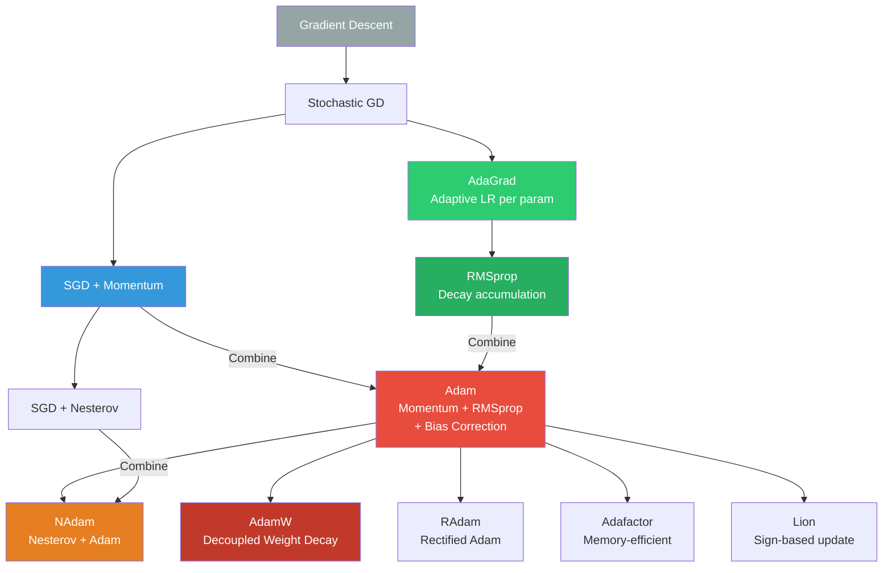

# Optimizers and Learning Rates

> **Interview relevance:** Understanding optimizers is critical at senior level. Know the Adam derivation cold. Be able to explain why AdamW matters for LLM fine-tuning and why learning rate warmup is essential for transformers. These are frequent senior-level questions.

---

## Table of Contents

1. [SGD with Momentum](#1-sgd-with-momentum)
2. [AdaGrad](#2-adagrad)
3. [RMSprop](#3-rmsprop)
4. [Adam](#4-adam)
5. [AdamW](#5-adamw)
6. [NAdam](#6-nadam)
7. [Learning Rate Schedules](#7-learning-rate-schedules)
8. [Learning Rate Finder](#8-learning-rate-finder)
9. [Gradient Accumulation](#9-gradient-accumulation)
10. [Mixed Precision Training](#10-mixed-precision-training)
11. [Optimizer Comparison Table](#11-optimizer-comparison-table)
12. [Optimizer Family Tree Diagram](#12-optimizer-family-tree)
13. [Interview Questions](#13-interview-questions)
14. [Code: Compare Optimizers](#14-code)

---

## 1. SGD with Momentum

### Basic SGD

```
θ_{t+1} = θ_t - η * ∇_θ L(θ_t)
```

Where `η` is the learning rate and `∇_θ L` is the gradient of the loss.

**Problems with vanilla SGD:**
- Oscillates in ravines (narrow directions)
- Slow along flat dimensions
- Can be stuck in saddle points
- High variance with mini-batch noise

### SGD with Momentum

Accumulate an exponential moving average of gradients (velocity vector `v`):

```
v_t = β * v_{t-1} + (1-β) * ∇_θ L(θ_t)     [PyTorch default: β * v_{t-1} + g_t]
θ_{t+1} = θ_t - η * v_t
```

**PyTorch convention** (slightly different from the math above):
```
v_t = β * v_{t-1} + g_t      (no (1-β) factor)
θ_{t+1} = θ_t - η * v_t
```

### Physical Intuition

Think of a ball rolling down a hill:
- `v_t` is the velocity of the ball
- `g_t` is the force (gradient)
- `β` (typically 0.9) is the "friction" that prevents the velocity from growing indefinitely
- The ball accelerates in consistent gradient directions and decelerates in oscillating directions

### Effect on Convergence

With momentum, the effective learning rate in consistent gradient directions is:
```
η / (1 - β)   e.g., η/(1-0.9) = 10η
```

This means momentum effectively increases the learning rate in "easy" directions while averaging out noise in noisy directions.

### Nesterov Momentum (NAG)

Nesterov Accelerated Gradient takes the gradient at a "lookahead" position:

```
v_t = β * v_{t-1} + η * ∇L(θ_t - β * v_{t-1})
θ_{t+1} = θ_t - v_t
```

The gradient is computed at the approximated future position rather than current position. This provides a "correction" that improves convergence rate theoretically and empirically.

---

## 2. AdaGrad

### Motivation

In NLP and sparse feature tasks, some features appear rarely but are highly informative (e.g., rare words). SGD with a fixed learning rate treats all features equally — it wastes steps on frequent features and makes too-small steps on rare ones.

**Goal:** Give each parameter its own learning rate, adapted based on historical gradient magnitude.

### Update Rule

```
G_t = G_{t-1} + g_t²      (accumulate squared gradients, element-wise)
θ_{t+1} = θ_t - (η / √(G_t + ε)) * g_t
```

Where:
- `G_t ∈ R^d`: diagonal of the gradient outer product, accumulated
- `ε ≈ 1e-8`: small constant for numerical stability
- The effective learning rate for parameter i is `η / √(G_t[i] + ε)`

### Intuition

- **Frequently updated parameters:** Large `G_t[i]` → small effective learning rate → fine-grained updates
- **Rarely updated parameters:** Small `G_t[i]` → large effective learning rate → catch up faster

### The Accumulation Problem

`G_t` only increases over time (sum of non-negative values). Eventually, the effective learning rate shrinks to nearly zero for all parameters, and learning stops. This is catastrophic for non-convex optimization with deep networks.

**AdaGrad works well for:** Convex problems, sparse NLP features (word2vec era), shallow models.
**AdaGrad fails for:** Deep networks trained for many iterations.

---

## 3. RMSprop

### Motivation

Fix AdaGrad's accumulation problem using an exponential moving average instead of a cumulative sum.

### Update Rule

```
v_t = β * v_{t-1} + (1-β) * g_t²      (EMA of squared gradients)
θ_{t+1} = θ_t - (η / √(v_t + ε)) * g_t
```

Where `β` (typically 0.9 or 0.99) controls the memory window.

### Key Improvement Over AdaGrad

- `v_t` is a "windowed" average: recent gradients count more than old ones
- The effective learning rate does not monotonically decrease to zero
- Learning can continue indefinitely

### Origin

RMSprop was proposed by Hinton in a Coursera lecture (unpublished). It became widely used before Adam was introduced.

### Weakness

RMSprop still has high variance early in training when `v_t` is initialized to 0. The denominator starts small, leading to unstable large steps early on.

---

## 4. Adam

### Overview

Adam = Adaptive Moment Estimation. Combines:
- **Momentum** (first moment of gradients, like momentum SGD)
- **RMSprop** (second moment of squared gradients)
- **Bias correction** (critical for stability early in training)

### Update Rule (Full Derivation)

Initialize: `m_0 = 0, v_0 = 0`

**Step 1: Compute biased moment estimates**
```
m_t = β₁ * m_{t-1} + (1 - β₁) * g_t         (biased 1st moment: EMA of gradients)
v_t = β₂ * v_{t-1} + (1 - β₂) * g_t²        (biased 2nd moment: EMA of squared grads)
```

**Step 2: Bias correction**
```
m̂_t = m_t / (1 - β₁^t)       (corrected 1st moment)
v̂_t = v_t / (1 - β₂^t)       (corrected 2nd moment)
```

**Step 3: Parameter update**
```
θ_{t+1} = θ_t - η * m̂_t / (√v̂_t + ε)
```

### Why Bias Correction Is Critical

At `t=1`:
```
m_1 = β₁ * 0 + (1-β₁) * g_1 = (1-β₁) * g_1
```

With `β₁ = 0.9`: `m_1 = 0.1 * g_1` — a ten-fold underestimate of the true gradient!

The bias correction `m̂_1 = m_1 / (1-0.9^1) = m_1 / 0.1 = g_1` corrects this.

**As `t → ∞`**: `β₁^t → 0`, so `1/(1 - β₁^t) → 1`, and the correction becomes negligible.

**Without bias correction:** Early steps are too small (moments are underestimated), causing slow warmup. This is why uncorrected Adam is called "Adam without bias correction" and performs noticeably worse in early training.

### Hyperparameters

| Parameter | Default | Meaning |
|-----------|---------|---------|
| η (lr) | 1e-3 | Base learning rate |
| β₁ | 0.9 | Momentum coefficient (1st moment decay) |
| β₂ | 0.999 | RMSprop coefficient (2nd moment decay) |
| ε | 1e-8 | Numerical stability (avoid divide by zero) |

### Why Adam Works

- **Momentum** (β₁): Smooths out gradient noise, accelerates in consistent directions
- **Adaptive rates** (β₂): Larger steps for parameters with small historical gradients
- **Bias correction**: Ensures stable, correct updates from step 1

### When to Prefer SGD over Adam

For image classification with proper tuning, SGD+Momentum often generalizes slightly better than Adam. The theory: Adam's adaptive learning rates can lead to "sharp minima" that generalize worse. See Wilson et al. (2017), "The Marginal Value of Momentum for Small Learning Rate SGD."

**Practical rule:**
- Adam for NLP, transformers, generative models, quick experimentation
- SGD+Momentum for vision tasks when you have time to tune

---

## 5. AdamW

### The Problem with Adam's Weight Decay

Standard Adam with L2 regularization:

```python
# Standard Adam "with weight decay" — THIS IS WRONG
loss = task_loss + λ * ||θ||²  # L2 regularization added to loss
grad = ∇loss                    # gradient includes L2 gradient = λθ
```

When you add L2 regularization to the loss, the gradient becomes:
```
g_t = ∇L_task + λθ
```

This `g_t` is then used to update both `m_t` and `v_t`. The L2 gradient `λθ` gets absorbed into the adaptive learning rate, scaled by `1/√v_t`. This means **the effective weight decay depends on the gradient history** — it's not truly decoupled.

### AdamW: Decoupled Weight Decay

Loshchilov and Hutter (2017) showed the correct way:

```
m_t = β₁ * m_{t-1} + (1-β₁) * ∇L_task        (only task gradient in moments)
v_t = β₂ * v_{t-1} + (1-β₂) * (∇L_task)²
m̂_t = m_t / (1 - β₁^t)
v̂_t = v_t / (1 - β₂^t)
θ_{t+1} = θ_t - η * m̂_t/(√v̂_t + ε) - η * λ * θ_t    ← weight decay applied separately!
```

The weight decay `λθ` is subtracted directly from the parameter, not routed through the adaptive moment estimates.

### Why This Matters (Especially for LLMs)

In standard Adam + L2:
- The effective weight decay on parameter i is `λ / √v̂_t[i]`
- Parameters with large gradients (high v̂) get less effective weight decay
- Parameters with small gradients get more effective weight decay
- This is backwards! Frequently updated parameters need regularization most.

In AdamW:
- Weight decay is `λθ` applied directly, regardless of gradient history
- All parameters are regularized equally by the same λ
- This matches what we intuitively want from L2 regularization

**Empirical result:** AdamW consistently outperforms Adam on LLM pre-training and fine-tuning. It is the default optimizer for GPT-2, GPT-3, BERT fine-tuning, and essentially all modern large models.

---

## 6. NAdam

### Formula

Nadam = Nesterov + Adam. The 1st moment estimate uses the Nesterov lookahead:

```
θ_{t+1} = θ_t - η / (√v̂_t + ε) * (β₁ m̂_t + (1-β₁)g_t / (1-β₁^t))
```

The key difference: instead of using `m̂_t` (past momentum), we use a lookahead estimate that incorporates the current gradient.

**When to use:** NLP tasks, often marginally better than Adam. Commonly used in Keras with its `nadam` optimizer.

---

## 7. Learning Rate Schedules

The learning rate is the most important hyperparameter. A fixed learning rate is almost never optimal:
- Too high early → instability
- Too low late → slow convergence

### Step Decay

```
η_t = η_0 * γ^{floor(t / step_size)}
```

Example: Reduce by 0.1 every 30 epochs.

**Pros:** Simple, interpretable.
**Cons:** Requires manual schedule selection; discontinuous.

```python
scheduler = torch.optim.lr_scheduler.StepLR(optimizer, step_size=30, gamma=0.1)
# OR
scheduler = torch.optim.lr_scheduler.MultiStepLR(optimizer, milestones=[30, 60, 90], gamma=0.1)
```

### Exponential Decay

```
η_t = η_0 * γ^t
```

Continuous version of step decay. Decays smoothly every step.

```python
scheduler = torch.optim.lr_scheduler.ExponentialLR(optimizer, gamma=0.95)
```

### Cosine Annealing

```
η_t = η_min + (1/2)(η_max - η_min)(1 + cos(πt/T))
```

Where T is the number of steps in one cycle.

The LR starts high, smoothly decreases following a cosine curve, and optionally restarts (SGDR). The smooth decrease avoids the abrupt changes of step decay and can escape sharp minima near the end of training.

```python
scheduler = torch.optim.lr_scheduler.CosineAnnealingLR(optimizer, T_max=100, eta_min=1e-6)
# With warm restarts:
scheduler = torch.optim.lr_scheduler.CosineAnnealingWarmRestarts(optimizer, T_0=10, T_mult=2)
```

### Warmup Schedules (Critical for Transformers)

**Linear warmup followed by decay:**
```
η_t = {η_max * t/t_warmup           for t ≤ t_warmup
      {η_max * f(t)                  for t > t_warmup
```

Where f(t) is typically cosine or inverse square root decay.

**Why warmup is essential for transformers:**

1. **Unstable initial parameters:** At initialization, attention weights and layer norms are not well-calibrated. Large learning rates cause explosive initial updates that destroy the embedding representations.

2. **Adaptive optimizer cold start:** Adam's moment estimates `m_t` and `v_t` are initialized to 0. Even with bias correction, the effective learning rate can be large at step 1 because `v_t` (the denominator) is underestimated. Warmup mitigates this.

3. **Empirical evidence:** Popel and Bojar (2018) showed that transformers fail to train without warmup. The gradient norms in transformers are very large initially (especially in the early layers), requiring a gentle start.

4. **The norm growth problem:** In transformer training, the norm of layer outputs grows rapidly in early steps. Warmup allows the model to "settle" before receiving large gradient updates.

**BERT warmup schedule:**
```python
# First 10,000 steps: linear warmup
# Remaining steps: linear decay to 0
from transformers import get_linear_schedule_with_warmup
scheduler = get_linear_schedule_with_warmup(
    optimizer,
    num_warmup_steps=10000,
    num_training_steps=total_steps
)
```

### Cyclical Learning Rates (CLR)

Smith (2017) proposed cycling the LR between a minimum and maximum value in a triangular pattern:

```
cycle = floor(1 + step / (2 * step_size))
x = abs(step/step_size - 2*cycle + 1)
η = η_min + (η_max - η_min) * max(0, 1-x)
```

**The superconvergence phenomenon:** CLR with large max LR can train networks in a fraction of the normal time (10x speedup observed). The high LR acts as regularization, the low LR provides fine-tuning.

```python
scheduler = torch.optim.lr_scheduler.CyclicLR(
    optimizer,
    base_lr=1e-4,
    max_lr=1e-2,
    step_size_up=2000,
    mode='triangular'
)
```

### One-Cycle Policy

A simplified version of CLR (Howard and Ruder, fast.ai):
1. LR increases linearly from `base_lr/div` to `max_lr` (warmup phase, 30% of steps)
2. LR decreases from `max_lr` to `base_lr/div` (annealing phase, 70% of steps)
3. LR decreases from `base_lr/div` to `base_lr/(div*100)` (final phase)
4. Momentum follows the inverse schedule (high when LR is low)

This is often the fastest way to train a model from scratch.

```python
scheduler = torch.optim.lr_scheduler.OneCycleLR(
    optimizer,
    max_lr=0.01,
    steps_per_epoch=len(train_loader),
    epochs=10,
    pct_start=0.3,           # 30% for warmup
    div_factor=25,            # initial lr = max_lr/25
    final_div_factor=1e4      # final lr = max_lr/10000
)
```

---

## 8. Learning Rate Finder

The LR finder (Smith, 2015; popularized by fast.ai) systematically finds a good learning rate range:

### Algorithm

1. Start with a very small LR (e.g., `1e-7`)
2. Train for one mini-batch, record the loss
3. Increase LR geometrically (multiply by a factor each step)
4. Repeat until loss explodes or diverges
5. Plot LR vs loss

### Reading the LR Finder Plot

- **Find the steepest negative slope:** The LR where loss is decreasing fastest
- **Use 10% of the loss-explosion LR** as a safe upper bound
- For one-cycle policy: use the found LR as `max_lr`

```python
from torch_lr_finder import LRFinder

model = ...
optimizer = optim.Adam(model.parameters(), lr=1e-7)
criterion = nn.CrossEntropyLoss()

lr_finder = LRFinder(model, optimizer, criterion)
lr_finder.range_test(train_loader, end_lr=100, num_iter=100)
lr_finder.plot()  # Shows the LR vs loss curve
lr_finder.reset()  # Restore model and optimizer states
```

---

## 9. Gradient Accumulation

### Problem

Large batch sizes often improve training stability (especially for NLP), but GPU memory limits batch size. Gradient accumulation simulates a large batch with a small GPU.

### How It Works

Accumulate gradients over N "micro-batches" before updating:

```python
optimizer.zero_grad()
for i, (inputs, labels) in enumerate(data_loader):
    outputs = model(inputs)
    loss = criterion(outputs, labels) / accumulation_steps
    loss.backward()   # Gradient accumulates in .grad

    if (i + 1) % accumulation_steps == 0:
        optimizer.step()
        optimizer.zero_grad()
```

**Effective batch size = micro_batch_size × accumulation_steps × num_gpus**

### When to Use

- LLM fine-tuning where batch size > 1 doesn't fit in memory
- Any scenario where effective batch size matters but GPU is limited
- Important: some normalization layers (BatchNorm) behave differently with accumulated gradients — LayerNorm is unaffected

### Caveats

1. `loss.backward()` accumulates gradients — dividing loss by `accumulation_steps` gives the same gradient as computing the mean over the full batch
2. Dropout and batch normalization may behave differently with small micro-batches
3. `torch.cuda.amp.GradScaler` needs to be told about accumulation for mixed precision

---

## 10. Mixed Precision Training

### Motivation

FP32 (float32) uses 4 bytes per value. FP16 (float16) uses 2 bytes — 2x memory savings and faster GPU compute (Tensor Cores on NVIDIA Volta+ can do 8x more FP16 FLOPS vs FP32).

### FP16 vs BF16

| Format | Range | Precision | Used In |
|--------|-------|-----------|---------|
| FP32 | ±3.4e38 | 7 decimal digits | Default everywhere |
| FP16 | ±65504 | 3 decimal digits | Inference, training (care needed) |
| BF16 | ±3.4e38 | 2 decimal digits | TPUs, Ampere+ GPUs (preferred for training) |

**BF16 advantages:**
- Same exponent range as FP32 (avoids overflow!)
- Less precision, but gradients don't need high precision
- No loss scaling needed (unlike FP16)
- Default in Google TPUs and NVIDIA Ampere GPUs

### FP16 Training: Automatic Mixed Precision (AMP)

Three key techniques:
1. **Forward + backward in FP16**: Speed up matrix multiplication
2. **Loss scaling**: FP16 gradients can underflow (too small to represent). Scale the loss before backward, then unscale before optimizer step.
3. **Master weights in FP32**: Store a FP32 copy of weights for the optimizer step. Cast to FP16 only for forward/backward.

```python
from torch.cuda.amp import autocast, GradScaler

scaler = GradScaler()

for inputs, labels in data_loader:
    optimizer.zero_grad()

    # Forward pass in FP16
    with autocast():
        outputs = model(inputs)
        loss = criterion(outputs, labels)

    # Backward in FP16 with scaled loss
    scaler.scale(loss).backward()

    # Gradient clipping (unscale first)
    scaler.unscale_(optimizer)
    torch.nn.utils.clip_grad_norm_(model.parameters(), max_norm=1.0)

    # Update (unscale + optimizer step)
    scaler.step(optimizer)
    scaler.update()  # Adjusts scale factor based on overflow detection
```

### Why Loss Scaling Works

FP16 can represent values down to ~`6e-8` (with denormals). Many gradients are smaller than this → they become 0 ("underflow"). Scaling the loss by, e.g., 1024 scales all gradients up by 1024, making them representable. The scaler automatically adjusts this scale factor.

---

## 11. Optimizer Comparison Table

| Optimizer | Memory | Adaptive LR | Momentum | Weight Decay | Best For |
|-----------|--------|-------------|----------|-------------|---------|
| SGD | 1x | No | Optional | Yes (correct) | Vision (tuned) |
| SGD+Momentum | 2x | No | Yes | Yes | Vision, convex |
| AdaGrad | 2x | Yes | No | Yes | Sparse features, NLP (old) |
| RMSprop | 2x | Yes | Optional | Yes | RNNs, non-stationary |
| Adam | 3x | Yes | Yes | Coupled (wrong!) | Quick experiments, NLP |
| AdamW | 3x | Yes | Yes | Decoupled (correct) | LLMs, transformers |
| NAdam | 3x | Yes | Nesterov | Decoupled | Slight improvement over Adam |
| Adafactor | ~1x | Yes | Optional | Yes | Memory-efficient (T5, BLOOM) |

**Memory column:** Relative to SGD (which stores 1 gradient copy). Adam stores m_t, v_t → 3x.

---

## 12. Optimizer Family Tree



---

## 13. Interview Questions

### Q1: Why does AdamW outperform Adam for LLM fine-tuning?

**Strong answer:**

> Standard Adam implements weight decay by adding L2 regularization to the loss: `L_total = L_task + λ||θ||²`. This means the regularization gradient `λθ` gets incorporated into the gradient `g_t`, which is then used to update the adaptive moment estimates `m_t` and `v_t`.
>
> The problem: the effective weight decay for parameter i becomes `λ / √v̂_t[i]`. Parameters with large historical gradients (large v̂) get less weight decay, and parameters with small gradients get more. This is precisely backwards from what we want — heavily used parameters typically need more regularization, not less.
>
> AdamW applies weight decay directly to the parameter: `θ_{t+1} = θ_t - η * m̂_t/(√v̂_t + ε) - η * λ * θ_t`. The weight decay is completely decoupled from the gradient-based adaptive update.
>
> For LLMs with billions of parameters, proper regularization is critical for generalization. AdamW provides the theoretically correct L2 regularization, which consistently outperforms Adam, especially for models trained for many steps.

### Q2: What is learning rate warmup and why is it needed for transformers?

**Strong answer:**

> Learning rate warmup linearly increases the learning rate from near 0 to the target value over the first N steps (e.g., 10,000 steps for BERT).
>
> It's critical for transformers for several reasons:
>
> 1. **Adam cold start:** Adam's second moment v_t is initialized to 0. Early in training, v̂_t is underestimated despite bias correction, leading to effectively high learning rates. Warmup counteracts this by explicitly keeping the LR small early on.
>
> 2. **Untrained attention:** Transformer attention weights start random. A high initial LR can cause attention to collapse to degenerate patterns (attending to only one position) that are hard to recover from.
>
> 3. **Gradient norm spikes:** Transformer training exhibits very large gradient norms in the first few steps due to random initialization. Warmup prevents these spikes from causing large parameter updates.
>
> 4. **Empirically demonstrated:** Popel and Bojar (2018) showed transformers consistently fail to train without warmup. This was a surprising finding that still isn't fully theoretically understood.

### Q3: Explain the Adam update rule from scratch, including why bias correction is needed.

**Strong answer:**

> Adam maintains two running estimates:
>
> m_t = β₁ m_{t-1} + (1-β₁) g_t — an EMA of gradients (momentum)
> v_t = β₂ v_{t-1} + (1-β₂) g_t² — an EMA of squared gradients (adaptive scale)
>
> Both are initialized to 0. The bias problem: at step 1, m_1 = (1-β₁)g_1. With β₁=0.9, this is just 0.1g_1 — ten times smaller than the true gradient. We're underestimating the moment.
>
> Bias correction: m̂_t = m_t/(1-β₁^t). At t=1: m̂_1 = 0.1g_1/0.1 = g_1. Correct! As t grows, β₁^t → 0, so 1/(1-β₁^t) → 1, and the correction vanishes.
>
> The final update: θ_{t+1} = θ_t - η * m̂_t/(√v̂_t + ε). The denominator normalizes the update by the historical gradient magnitude — parameters that historically had large gradients get smaller effective learning rates.

### Q4: When would you use SGD over Adam?

**Strong answer:**

> For image classification benchmarks (CIFAR, ImageNet) with sufficient tuning, SGD with momentum often achieves slightly better final accuracy than Adam. The current theory is that Adam's adaptive learning rates can converge to "sharp minima" in the loss landscape that generalize worse than the "flat minima" found by SGD.
>
> However, this difference is small and disappears with proper AdamW + weight decay + LR schedule. In practice, I'd use Adam/AdamW for:
> - Any NLP/transformer task (clear winner)
> - When training time is limited (Adam converges faster early)
> - When tuning resources are limited (Adam is less sensitive to LR)
>
> I'd use SGD for:
> - Vision tasks where I have time to tune the LR schedule carefully
> - When I have strong prior knowledge of a good LR range
> - Reproducing papers that trained with SGD

---

## 14. Code: Compare Optimizers

```python
import torch
import torch.nn as nn
import torch.optim as optim
import numpy as np
import matplotlib
matplotlib.use('Agg')
import matplotlib.pyplot as plt
from torch.optim.lr_scheduler import (
    StepLR, CosineAnnealingLR, OneCycleLR, CosineAnnealingWarmRestarts
)


# ============================================================
# 1. Manual Optimizer Implementations (Educational)
# ============================================================

class SGDWithMomentum:
    """SGD with momentum, implemented from scratch."""
    def __init__(self, params, lr=0.01, momentum=0.9, weight_decay=0.0):
        self.params = list(params)
        self.lr = lr
        self.momentum = momentum
        self.weight_decay = weight_decay
        self.velocities = [torch.zeros_like(p) for p in self.params]

    def zero_grad(self):
        for p in self.params:
            if p.grad is not None:
                p.grad.zero_()

    def step(self):
        with torch.no_grad():
            for p, v in zip(self.params, self.velocities):
                if p.grad is None:
                    continue
                g = p.grad + self.weight_decay * p  # L2 regularization
                v.mul_(self.momentum).add_(g)        # v = β*v + g
                p.sub_(self.lr * v)                  # θ = θ - lr*v


class AdamOptimizer:
    """Adam optimizer implemented from scratch."""
    def __init__(self, params, lr=1e-3, betas=(0.9, 0.999), eps=1e-8,
                 weight_decay=0.0, correct_bias=True):
        self.params = list(params)
        self.lr = lr
        self.beta1, self.beta2 = betas
        self.eps = eps
        self.weight_decay = weight_decay
        self.correct_bias = correct_bias

        self.m = [torch.zeros_like(p) for p in self.params]  # 1st moment
        self.v = [torch.zeros_like(p) for p in self.params]  # 2nd moment
        self.t = 0

    def zero_grad(self):
        for p in self.params:
            if p.grad is not None:
                p.grad.zero_()

    def step(self):
        self.t += 1
        with torch.no_grad():
            for p, m, v in zip(self.params, self.m, self.v):
                if p.grad is None:
                    continue
                g = p.grad

                # Update biased moment estimates
                m.mul_(self.beta1).add_((1 - self.beta1) * g)
                v.mul_(self.beta2).add_((1 - self.beta2) * g * g)

                if self.correct_bias:
                    # Bias-corrected estimates
                    m_hat = m / (1 - self.beta1 ** self.t)
                    v_hat = v / (1 - self.beta2 ** self.t)
                else:
                    m_hat, v_hat = m, v

                # Parameter update
                update = m_hat / (v_hat.sqrt() + self.eps)
                p.sub_(self.lr * update)

                # Decoupled weight decay (AdamW style if weight_decay > 0)
                if self.weight_decay > 0:
                    p.sub_(self.lr * self.weight_decay * p)


class AdamWOptimizer(AdamOptimizer):
    """AdamW: Adam with decoupled weight decay."""
    # Identical to AdamOptimizer with the weight_decay already applied correctly
    pass


# ============================================================
# 2. Compare Adam with and without Bias Correction
# ============================================================

def compare_bias_correction():
    """Demonstrate the importance of bias correction in Adam."""
    print("=== Adam Bias Correction Effect ===\n")

    torch.manual_seed(42)
    n_steps = 50

    for use_correction in [True, False]:
        # Simple quadratic loss: L(θ) = θ²
        theta = torch.tensor([10.0], requires_grad=True)
        opt = AdamOptimizer([theta], lr=0.1, correct_bias=use_correction)

        values = [theta.item()]
        for step in range(n_steps):
            opt.zero_grad()
            loss = theta ** 2
            loss.backward()
            opt.step()
            values.append(theta.item())

        label = "With bias correction" if use_correction else "Without bias correction"
        print(f"  {label}:")
        print(f"    Step 1: θ = {values[1]:.6f}")
        print(f"    Step 5: θ = {values[5]:.6f}")
        print(f"    Step 50: θ = {values[50]:.6f}")
        print()


# ============================================================
# 3. Learning Rate Schedule Visualizer
# ============================================================

def visualize_lr_schedules(save_path='lr_schedules.png'):
    """Generate a comparison plot of different LR schedules."""
    n_steps = 1000

    def get_lr_history(scheduler_fn):
        """Get LR values for all steps."""
        # Dummy model and optimizer
        model = nn.Linear(2, 2)
        optimizer = optim.SGD(model.parameters(), lr=0.1)
        scheduler = scheduler_fn(optimizer)
        lrs = []
        for _ in range(n_steps):
            lrs.append(optimizer.param_groups[0]['lr'])
            scheduler.step()
        return lrs

    schedules = {
        'Constant': lambda opt: optim.lr_scheduler.LambdaLR(opt, lambda _: 1.0),
        'Step Decay': lambda opt: StepLR(opt, step_size=200, gamma=0.5),
        'Cosine Annealing': lambda opt: CosineAnnealingLR(opt, T_max=1000, eta_min=1e-4),
        'Cosine with Restarts': lambda opt: CosineAnnealingWarmRestarts(opt, T_0=200, T_mult=2),
        'Exponential': lambda opt: optim.lr_scheduler.ExponentialLR(opt, gamma=0.995),
    }

    # Add One-Cycle separately (needs steps_per_epoch)
    model = nn.Linear(2, 2)
    opt = optim.SGD(model.parameters(), lr=1e-4)
    one_cycle = OneCycleLR(opt, max_lr=0.1, total_steps=n_steps, pct_start=0.3)
    lrs_one_cycle = []
    for _ in range(n_steps):
        lrs_one_cycle.append(opt.param_groups[0]['lr'])
        one_cycle.step()

    fig, ax = plt.subplots(figsize=(14, 6))
    steps = range(n_steps)
    colors = ['#3498DB', '#E74C3C', '#2ECC71', '#F39C12', '#9B59B6', '#1ABC9C']

    for (name, fn), color in zip(schedules.items(), colors):
        lrs = get_lr_history(fn)
        ax.plot(steps, lrs, label=name, linewidth=2, color=color)

    ax.plot(steps, lrs_one_cycle, label='One-Cycle', linewidth=2, color='#E67E22')

    ax.set_xlabel('Training Steps', fontsize=12)
    ax.set_ylabel('Learning Rate', fontsize=12)
    ax.set_title('Learning Rate Schedule Comparison', fontsize=14, fontweight='bold')
    ax.legend(fontsize=10)
    ax.grid(True, alpha=0.3)
    plt.tight_layout()
    plt.savefig(save_path, dpi=150, bbox_inches='tight')
    print(f"LR schedule plot saved to {save_path}")
    plt.close()


# ============================================================
# 4. Warmup Schedule Implementation
# ============================================================

class WarmupCosineSchedule:
    """
    Linear warmup followed by cosine decay.
    This is the standard schedule for transformer training.
    """
    def __init__(self, optimizer, warmup_steps: int, total_steps: int,
                 min_lr_ratio: float = 0.0):
        self.optimizer = optimizer
        self.warmup_steps = warmup_steps
        self.total_steps = total_steps
        self.min_lr_ratio = min_lr_ratio
        self.base_lrs = [g['lr'] for g in optimizer.param_groups]
        self._step = 0

    def step(self):
        self._step += 1
        t = self._step

        for group, base_lr in zip(self.optimizer.param_groups, self.base_lrs):
            if t <= self.warmup_steps:
                # Linear warmup
                lr = base_lr * t / self.warmup_steps
            else:
                # Cosine decay
                progress = (t - self.warmup_steps) / (self.total_steps - self.warmup_steps)
                cosine_factor = 0.5 * (1 + np.cos(np.pi * progress))
                lr = base_lr * (self.min_lr_ratio + (1 - self.min_lr_ratio) * cosine_factor)
            group['lr'] = lr

    def get_last_lr(self):
        return [g['lr'] for g in self.optimizer.param_groups]


# ============================================================
# 5. Optimizer Comparison on Rosenbrock Function
# ============================================================

def compare_optimizers_rosenbrock(n_steps=2000, save_path='optimizer_comparison.png'):
    """
    Compare optimizer trajectories on the Rosenbrock function.
    f(x, y) = (1-x)^2 + 100*(y-x^2)^2
    Minimum at (1, 1). This is a classic hard optimization problem.
    """
    def rosenbrock(xy):
        x, y = xy[0], xy[1]
        return (1 - x)**2 + 100 * (y - x**2)**2

    optimizers_config = {
        'SGD (lr=0.001)': lambda p: optim.SGD(p, lr=0.001),
        'SGD+Momentum': lambda p: optim.SGD(p, lr=0.001, momentum=0.9),
        'Adam': lambda p: optim.Adam(p, lr=0.01),
        'AdamW': lambda p: optim.AdamW(p, lr=0.01, weight_decay=0.01),
        'RMSprop': lambda p: optim.RMSprop(p, lr=0.01),
    }

    results = {}
    start = torch.tensor([-1.0, 1.0])

    for name, opt_fn in optimizers_config.items():
        xy = nn.Parameter(start.clone())
        optimizer = opt_fn([xy])
        losses = []

        for step in range(n_steps):
            optimizer.zero_grad()
            loss = rosenbrock(xy)
            loss.backward()
            torch.nn.utils.clip_grad_norm_([xy], max_norm=10.0)
            optimizer.step()
            losses.append(loss.item())

        final = xy.detach().numpy()
        results[name] = {
            'losses': losses,
            'final': final,
            'final_loss': losses[-1]
        }
        print(f"{name:<20}: final=({final[0]:.4f}, {final[1]:.4f}), "
              f"loss={losses[-1]:.6f}")

    # Plot loss curves
    fig, (ax1, ax2) = plt.subplots(1, 2, figsize=(16, 6))
    colors = ['#3498DB', '#E74C3C', '#2ECC71', '#F39C12', '#9B59B6']

    for (name, data), color in zip(results.items(), colors):
        ax1.semilogy(data['losses'], label=name, linewidth=2, color=color)

    ax1.set_xlabel('Steps', fontsize=12)
    ax1.set_ylabel('Loss (log scale)', fontsize=12)
    ax1.set_title('Rosenbrock Optimization: Loss Curves', fontsize=13)
    ax1.legend(fontsize=9)
    ax1.grid(True, alpha=0.3)

    # Plot final losses as bar chart
    names = list(results.keys())
    final_losses = [results[n]['final_loss'] for n in names]
    bars = ax2.bar(names, final_losses, color=colors[:len(names)])
    ax2.set_ylabel('Final Loss', fontsize=12)
    ax2.set_title(f'Final Loss After {n_steps} Steps', fontsize=13)
    ax2.tick_params(axis='x', rotation=20)
    ax2.grid(True, alpha=0.3, axis='y')

    for bar, loss in zip(bars, final_losses):
        ax2.text(bar.get_x() + bar.get_width()/2, bar.get_height(),
                f'{loss:.4f}', ha='center', va='bottom', fontsize=9)

    plt.tight_layout()
    plt.savefig(save_path, dpi=150, bbox_inches='tight')
    print(f"\nComparison plot saved to {save_path}")
    plt.close()

    return results


# ============================================================
# 6. Mixed Precision Training Example
# ============================================================

def mixed_precision_training_example():
    """Demonstrate AMP (Automatic Mixed Precision) training."""
    if not torch.cuda.is_available():
        print("CUDA not available, skipping mixed precision demo")
        return

    device = torch.device('cuda')
    print("=== Mixed Precision Training (AMP) ===")

    # Large model to see memory savings
    model = nn.Sequential(
        nn.Linear(1024, 2048),
        nn.GELU(),
        nn.Linear(2048, 2048),
        nn.GELU(),
        nn.Linear(2048, 256),
    ).to(device)

    optimizer = optim.AdamW(model.parameters(), lr=1e-3, weight_decay=0.01)
    criterion = nn.MSELoss()
    scaler = torch.cuda.amp.GradScaler()
    accumulation_steps = 4

    X = torch.randn(32, 1024, device=device)
    y = torch.randn(32, 256, device=device)

    optimizer.zero_grad()
    for step in range(10):
        # Mixed precision forward pass
        with torch.cuda.amp.autocast(dtype=torch.float16):
            out = model(X)
            loss = criterion(out, y) / accumulation_steps

        # Scaled backward
        scaler.scale(loss).backward()

        if (step + 1) % accumulation_steps == 0:
            # Unscale before gradient clipping
            scaler.unscale_(optimizer)
            grad_norm = torch.nn.utils.clip_grad_norm_(model.parameters(), 1.0)

            # Optimizer step
            scaler.step(optimizer)
            scaler.update()
            optimizer.zero_grad()

            print(f"Step {step+1}: loss={loss.item()*accumulation_steps:.4f}, "
                  f"grad_norm={grad_norm:.4f}, "
                  f"scale={scaler.get_scale():.0f}")


if __name__ == '__main__':
    print("1. Bias correction comparison:")
    compare_bias_correction()

    print("2. Visualizing LR schedules...")
    visualize_lr_schedules()

    print("\n3. Comparing optimizers on Rosenbrock function:")
    results = compare_optimizers_rosenbrock(n_steps=1000)

    print("\n4. Warmup schedule example:")
    model = nn.Linear(10, 2)
    optimizer = optim.AdamW(model.parameters(), lr=1e-3)
    scheduler = WarmupCosineSchedule(optimizer, warmup_steps=100, total_steps=1000)
    for step in range(10):
        scheduler.step()
        print(f"  Step {step+1}: lr = {scheduler.get_last_lr()[0]:.6f}")

    print("\n5. Mixed precision (if CUDA available):")
    mixed_precision_training_example()
```

---

## Quick Reference

```
Optimizer  | Update Rule (simplified)
───────────────────────────────────────────────────────────────
SGD        | θ = θ - lr * g
SGD+Mom    | v = β*v + g;  θ = θ - lr*v
AdaGrad    | G += g²;  θ = θ - lr/√G * g
RMSprop    | v = β*v + (1-β)*g²;  θ = θ - lr/√v * g
Adam       | m = β₁m+(1-β₁)g;  v = β₂v+(1-β₂)g²
           | θ = θ - lr * m̂/√v̂   [bias-corrected]
AdamW      | Adam but: θ = θ - lr*m̂/√v̂ - lr*λ*θ  [decoupled WD]

LR Schedule    | Use Case
────────────────────────────────────────────
Step Decay     | Classic vision training
Cosine         | General purpose, smooth
Warmup+Cosine  | MANDATORY for transformers
One-Cycle      | Fast training, superconvergence
CLR            | Exploration, avoids local minima
```

---

*Next: [Weight Initialization and Normalization](./weight_initialization_and_normalization.md)*
