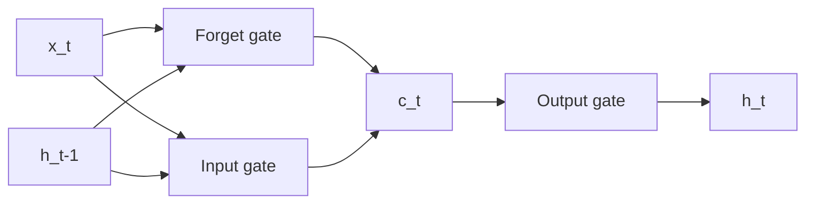

# RNN, LSTM, and GRU

## Why sequence models
Many tasks depend on ordered context: text, scan events, sensor signals.

## Vanilla RNN
Hidden update:
`h_t = tanh(W_x x_t + W_h h_{t-1} + b)`

Backprop through time (BPTT) chains gradients across many timesteps, causing vanishing/exploding problems.

## LSTM
Adds memory cell and gates:
- Forget gate `f_t`
- Input gate `i_t`
- Candidate `g_t`
- Output gate `o_t`

Equations:
- `f_t = sigma(W_f [h_{t-1}, x_t] + b_f)`
- `i_t = sigma(W_i [h_{t-1}, x_t] + b_i)`
- `g_t = tanh(W_g [h_{t-1}, x_t] + b_g)`
- `c_t = f_t * c_{t-1} + i_t * g_t`
- `o_t = sigma(W_o [h_{t-1}, x_t] + b_o)`
- `h_t = o_t * tanh(c_t)`

## GRU
Simpler than LSTM with update/reset gates; fewer parameters, often similar quality.

## Bidirectional and stacked variants
- BiRNN uses past+future context (not for strict autoregressive generation).
- Stacked layers increase abstraction capacity.

## Teacher forcing
During training, feed ground-truth previous token to decoder to stabilize learning.

## Why transformers replaced RNNs at scale
- RNN sequential dependency limits parallelism.
- Attention captures long-range dependencies directly.
- Better hardware utilization.

Still useful:
- very small models
- streaming low-latency edge applications
- simple sequence tasks with small data



## Interview questions
1. Explain LSTM gates and purpose.
2. Why transformers replaced RNNs?
3. When would you still choose GRU/LSTM?

## PyTorch example
```python
import torch
import torch.nn as nn

class LSTMClassifier(nn.Module):
    def __init__(self, input_dim, hidden_dim, num_layers, num_classes):
        super().__init__()
        self.lstm = nn.LSTM(input_dim, hidden_dim, num_layers=num_layers,
                            batch_first=True, bidirectional=True)
        self.fc = nn.Linear(hidden_dim * 2, num_classes)

    def forward(self, x):
        out, _ = self.lstm(x)
        # last timestep
        logits = self.fc(out[:, -1, :])
        return logits
```
