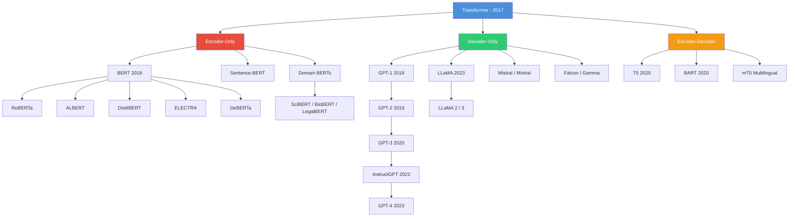

# 03 — Modern NLP and Transformers

A comprehensive guide to modern NLP, from the failure modes of RNNs through the full Transformer architecture, BERT, GPT, tokenization, embeddings, and fine-tuning. Written at senior interview depth.

---

## Navigation

| # | File | Core Topic | Interview Weight |
|---|------|------------|-----------------|
| 1 | [why_rnns_failed_at_scale.md](./why_rnns_failed_at_scale.md) | RNN limitations, vanishing gradients, the bottleneck | Medium |
| 2 | [attention_mechanism_deep_dive.md](./attention_mechanism_deep_dive.md) | Q/K/V framework, scaled dot-product, complexity | High |
| 3 | [transformer_architecture_complete.md](./transformer_architecture_complete.md) | Full encoder/decoder, multi-head attention, positional encoding | Critical |
| 4 | [bert_family.md](./bert_family.md) | MLM, BERT variants, fine-tuning paradigm | High |
| 5 | [gpt_family.md](./gpt_family.md) | Autoregressive LMs, in-context learning, sampling | High |
| 6 | [tokenization.md](./tokenization.md) | BPE, WordPiece, SentencePiece, failure modes | Medium |
| 7 | [word_embeddings_and_vector_representations.md](./word_embeddings_and_vector_representations.md) | Word2Vec, GloVe, contextual embeddings, RAG embeddings | Critical |
| 8 | [fine_tuning_transformers.md](./fine_tuning_transformers.md) | Full fine-tuning, LoRA, PEFT, catastrophic forgetting | High |
| 9 | [building_mini_transformer.md](./building_mini_transformer.md) | From-scratch PyTorch implementation | Critical |

---

## Recommended Study Order

```
1. why_rnns_failed_at_scale.md        ← Understand the problem that was solved
2. attention_mechanism_deep_dive.md   ← Core mechanism, derive the math
3. transformer_architecture_complete.md ← Full architecture, deepest file
4. tokenization.md                    ← Understand how text becomes tokens
5. bert_family.md                     ← Encoder-only models, classification
6. gpt_family.md                      ← Decoder-only models, generation
7. word_embeddings_and_vector_representations.md ← Embeddings for retrieval
8. fine_tuning_transformers.md        ← Adapt models to new tasks
9. building_mini_transformer.md       ← Implement it all from scratch
```

---

## NLP Evolution Timeline

```mermaid
timeline
    title Evolution of NLP — Bag-of-Words to GPT-4

    section Classic Era (1990s–2010)
        1996 : Bag of Words
             : Sparse count vectors
             : No semantics, no order
        2003 : Neural Language Models (Bengio)
             : First neural n-gram LMs
             : Learned word embeddings
        2008 : Stanford NLP pipelines
             : Rule-based + statistical
             : CRF, MaxEnt, SVM

    section Embedding Era (2013–2017)
        2013 : Word2Vec (Mikolov et al.)
             : Skip-gram and CBOW
             : Semantic vector arithmetic
        2014 : GloVe (Pennington et al.)
             : Global co-occurrence factorization
             : Competitive with Word2Vec
        2014 : Seq2Seq with RNNs
             : Encoder-decoder for translation
             : LSTM/GRU based
        2015 : Bahdanau Attention
             : First attention mechanism
             : Solved fixed-context bottleneck
        2016 : FastText (Facebook)
             : Character n-gram subwords
             : OOV handling

    section Transformer Era (2017–2019)
        2017 : Attention Is All You Need
             : Full self-attention architecture
             : Replaced RNNs entirely
        2018 : ELMo (AllenAI)
             : Contextual embeddings from biLSTM
             : Context-dependent word vectors
        2018 : GPT-1 (OpenAI)
             : Decoder-only transformer
             : Unsupervised pre-training + fine-tuning
        2018 : BERT (Google)
             : Encoder-only transformer
             : Masked LM + NSP objectives
             : Transfer learning revolution
        2019 : GPT-2 (OpenAI)
             : 1.5B parameters
             : Emergent few-shot behaviors
        2019 : RoBERTa, XLNet, ALBERT
             : BERT improvements
             : Training data and objectives

    section Scale Era (2020–2022)
        2020 : GPT-3 (OpenAI)
             : 175B parameters
             : In-context learning breakthrough
             : Few-shot without fine-tuning
        2020 : T5 (Google)
             : Text-to-text unified framework
             : Encoder-decoder architecture
        2021 : Codex (OpenAI)
             : Code generation from GPT-3
             : GitHub Copilot backend
        2022 : InstructGPT / ChatGPT
             : RLHF alignment
             : Instruction following
        2022 : LLaMA, PaLM, Chinchilla
             : Efficient scaling laws
             : Open source LLMs

    section Foundation Model Era (2023–Present)
        2023 : GPT-4 (OpenAI)
             : Multimodal, RLHF
             : Strong reasoning capabilities
        2023 : LLaMA 2, Mistral, Falcon
             : Open source competitive models
             : RLHF and RLAIF variants
        2024 : Gemini, Claude 3, Llama 3
             : Long context windows
             : Improved multimodal
        2025 : Claude 3.5, GPT-4o, Gemini 2
             : Reasoning models (o1, R1)
             : Agentic capabilities
```



---

## Architecture Family Tree



---

## Key Concepts Quick Reference

### Complexity Summary

| Model Type | Training Parallelism | Attention Complexity | Context Access |
|------------|---------------------|---------------------|---------------|
| RNN | Sequential O(n) | Implicit via hidden state | Limited (vanishing gradients) |
| LSTM/GRU | Sequential O(n) | Gated hidden state | Better but still limited |
| Transformer Encoder | Fully parallel | O(n² · d) | Full bidirectional |
| Transformer Decoder | Parallel (training), sequential (inference) | O(n² · d) causal | Left-to-right causal |
| Sparse Attention | Parallel | O(n · sqrt(n) · d) | Sparse/local patterns |
| Linear Attention | Parallel | O(n · d²) | Approximate full |

### Positional Encoding Comparison

| Method | Model | Handles Long Context | Relative Positions | Trainable |
|--------|-------|---------------------|-------------------|-----------|
| Sinusoidal | Original Transformer | No (fixed max length) | Implicitly | No |
| Learned Absolute | BERT, GPT-2 | No (fixed max) | No | Yes |
| Relative (T5 bias) | T5, T5-v1.1 | Yes | Yes | Yes |
| ALiBi | MPT, BLOOM | Yes (extrapolates) | Yes | No |
| RoPE | LLaMA, Falcon, GPT-NeoX | Yes (with scaling) | Yes | No |

---

## Interview Quick-Fire Topics

**Must-know derivations:**
- Scaled dot-product attention: `Attention(Q,K,V) = softmax(QK^T / sqrt(d_k)) * V`
- Why divide by `sqrt(d_k)`: dot product variance grows with dimension
- Multi-head: `MultiHead(Q,K,V) = Concat(head_1,...,head_h) W^O`
- Sinusoidal PE: `PE(pos, 2i) = sin(pos / 10000^(2i/d_model))`
- Word2Vec negative sampling objective
- BERT masked language model loss

**Must-know architectural decisions:**
- Pre-LN vs Post-LN (GPT uses Pre-LN for stability)
- Why ReLU in FFN → why GELU is now preferred
- Why [CLS] token aggregates sequence representation
- Why causal masking is needed in decoder
- Why residual connections prevent vanishing gradients in deep transformers

**Must-know failure modes:**
- Attention quadratic bottleneck at long sequences
- BERT cannot do generation (bidirectional = sees future)
- Static embeddings fail for polysemous words
- Tokenization arithmetic failures ("9.11 > 9.9")
- Embedding anisotropy — why raw BERT embeddings are bad for similarity

---

## Prerequisites

Before diving into this section, ensure you understand:

- **Matrix multiplication and linear algebra**: All attention is matrix operations
- **Softmax and probability distributions**: Core to attention weighting
- **Backpropagation and gradient flow**: Needed to understand why RNNs fail
- **Neural network fundamentals**: From `02_Deep_Learning/`
- **Python and basic PyTorch**: Code examples throughout

---

## How to Use This Section for Interview Prep

1. **First pass**: Read each file top to bottom, don't skip the math
2. **Derive it yourself**: Cover the formula, derive `Attention(Q,K,V)` from scratch
3. **Code it**: Don't just read the code — type it out and run it
4. **Practice explaining**: Record yourself explaining multi-head attention out loud
5. **Common interview formats**:
   - "Walk me through X" → needs full narrative (transformer_architecture_complete.md)
   - "Why did Y fail?" → needs historical context (why_rnns_failed_at_scale.md)
   - "How would you implement Z?" → needs code fluency (building_mini_transformer.md)
   - "Compare A vs B" → needs comparison tables (bert_family.md, gpt_family.md)

---

*Part of the [AI/ML/LLM Interview Prep](../../README.md) repository.*
