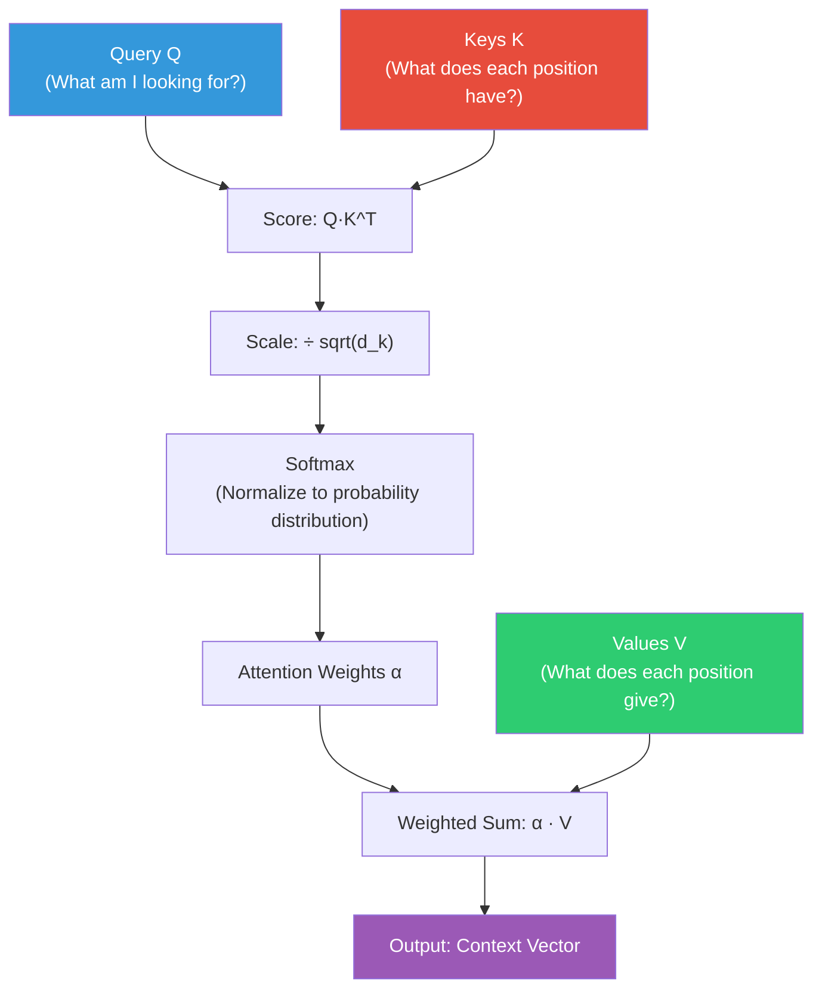
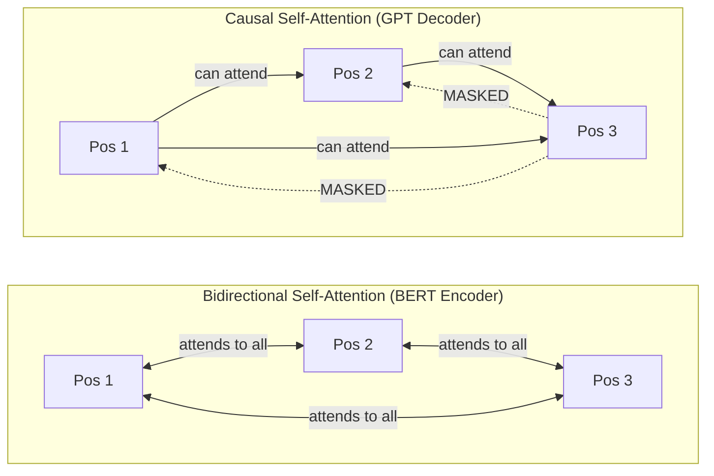

# Attention Mechanism Deep Dive

The attention mechanism is the single most important concept in modern NLP. Every large language model — BERT, GPT, T5, LLaMA — is built on this foundation. This file derives the mechanism from first principles, covers every variant, and provides complete PyTorch implementations.

---

## Table of Contents

1. [Intuition: What Is Attention?](#intuition-what-is-attention)
2. [The Query-Key-Value Framework](#the-query-key-value-framework)
3. [Scaled Dot-Product Attention: Full Derivation](#scaled-dot-product-attention-full-derivation)
4. [Why Divide by sqrt(d_k)?](#why-divide-by-sqrtdk)
5. [Additive vs. Multiplicative Attention](#additive-vs-multiplicative-attention)
6. [Varieties of Attention](#varieties-of-attention)
7. [Causal (Masked) Self-Attention](#causal-masked-self-attention)
8. [Worked Example: 3-Token Sequence](#worked-example-3-token-sequence)
9. [Attention Complexity: The Quadratic Bottleneck](#attention-complexity-the-quadratic-bottleneck)
10. [Efficient Attention Variants](#efficient-attention-variants)
11. [PyTorch Implementation](#pytorch-implementation)
12. [Interview Questions](#interview-questions)

---

## Intuition: What Is Attention?

### The Human Analogy

When you read the sentence "The animal didn't cross the street because **it** was too tired," you instantly understand that "it" refers to "animal," not "street." You didn't re-read the entire sentence from the beginning — your attention jumped directly from "it" to "animal."

This is the core intuition behind attention mechanisms: **when producing an output, look at the most relevant parts of the input, not all parts equally.**

### The Translation Analogy

In machine translation of "The cat sat on the mat" → "Le chat était assis sur le tapis":

When generating "chat" (cat), the model should attend heavily to "cat" in the English.
When generating "assis" (sat), the model should attend heavily to "sat."
When generating "tapis" (mat), the model should attend heavily to "mat."

The attention weights create a soft alignment between source and target tokens.

### The Database Query Analogy

A more formal analogy: attention is like a soft database lookup.

- **Query (Q)**: What you're looking for ("Show me cat-related information")
- **Keys (K)**: The labels/indexes of items in the database ("cat", "sat", "mat", etc.)
- **Values (V)**: The actual content associated with each label

You compute how well your query matches each key, use those match scores to weight the values, and return a weighted sum of values. This is **differentiable** — unlike a hard database lookup, so you can train it end-to-end.



---

## The Query-Key-Value Framework

### Where Q, K, V Come From

In self-attention, the queries, keys, and values are all derived from the **same input sequence** `X` through learned linear projections:

```
Q = X · W_Q    (X: n × d_model,  W_Q: d_model × d_k)
K = X · W_K    (X: n × d_model,  W_K: d_model × d_k)
V = X · W_V    (X: n × d_model,  W_V: d_model × d_v)
```

Where:
- `n` = sequence length
- `d_model` = model dimension (e.g., 512)
- `d_k` = key/query dimension (e.g., 64)
- `d_v` = value dimension (e.g., 64)

The key insight: even though Q, K, V all come from the same input X, the **different projection matrices** `W_Q, W_K, W_V` allow them to learn different roles.

### Semantic Interpretation of Each

**Query (Q)**: "What information am I trying to find right now?"
- When processing the word "it" in "The cat was tired because it...", the query for "it" should encode something like "what noun does this pronoun refer to?"

**Key (K)**: "What information do I offer to others who might query me?"
- The key for "cat" should encode that it is a noun, a potential antecedent for pronouns, an animate entity.

**Value (V)**: "What actual information do I provide when someone attends to me?"
- The value for "cat" should contain the rich semantic representation of cat-ness: furry, animate, subject of the sentence, etc.

The separation of Key and Value is important: the **key** determines relevance (who gets attention) while the **value** determines what information is retrieved. A token might be highly relevant (high key-query match) but have relatively simple value content, or vice versa.

### The W_O Projection

After computing the attention output `A = softmax(QK^T / sqrt(d_k)) · V`, there is typically a final output projection:

```
Output = A · W_O    (A: n × d_v,  W_O: d_v × d_model)
```

This maps the attention output back to `d_model` dimensions and provides an additional learned transformation.

---

## Scaled Dot-Product Attention: Full Derivation

### Step 1: Compute Similarity Scores

For each pair of positions (i, j), compute the similarity between query `q_i` and key `k_j`:

```
score(q_i, k_j) = q_i · k_j = Σ_d q_{i,d} · k_{j,d}
```

This is the dot product. It is high when the query and key vectors point in similar directions (small angle), and low or negative when they point in different directions.

In matrix form, all pairwise scores at once:

```
Scores = Q · K^T       (shape: n × n)
```

Row `i` of `Scores` contains the similarities between query `q_i` and all keys `k_1, ..., k_n`.

### Step 2: Scale

Divide by `sqrt(d_k)`:

```
Scaled_Scores = Q · K^T / sqrt(d_k)
```

(Why this scaling is necessary is explained in depth in the next section.)

### Step 3: Optional Masking

For causal (decoder) attention, add a mask to prevent position `i` from attending to positions `j > i`:

```
Masked_Scores = Scaled_Scores + M
```

Where `M_{ij} = 0` if `j ≤ i`, and `M_{ij} = -∞` (implemented as a very large negative number like `-1e9`) if `j > i`.

### Step 4: Softmax

Apply softmax row-wise to convert scores to probability distributions:

```
α = softmax(Scaled_Scores)       (shape: n × n)
```

For row `i`:
```
α_{ij} = exp(Scaled_Scores_{ij}) / Σ_k exp(Scaled_Scores_{ik})
```

This ensures that for each query position `i`, the attention weights over all key positions sum to 1. `α_{ij}` is "how much position `i` attends to position `j`."

### Step 5: Weighted Sum of Values

```
Output = α · V                    (shape: n × d_v)
```

Row `i` of the output is a weighted sum of all value vectors:
```
Output_i = Σ_j α_{ij} · v_j
```

If `α_{i3} = 0.7` and `α_{i7} = 0.2` (with other small values), then position `i`'s output is dominated 70% by position 3's value and 20% by position 7's value.

### The Complete Formula

```
Attention(Q, K, V) = softmax(Q K^T / sqrt(d_k)) · V
```

This is the core equation of the Transformer. Every variant of attention is a modification of this formula.

---

## Why Divide by sqrt(d_k)?

This is one of the most common interview questions. The answer requires understanding how dot products scale with dimension.

### The Variance Argument

Assume `q_i` and `k_j` are independent random vectors with components drawn from `N(0, 1)` (zero mean, unit variance).

The dot product is:
```
q · k = Σ_{l=1}^{d_k} q_l · k_l
```

Each term `q_l · k_l` has:
- `E[q_l · k_l] = E[q_l] · E[k_l] = 0 · 0 = 0`
- `Var[q_l · k_l] = E[q_l²] · E[k_l²] = 1 · 1 = 1` (for independent zero-mean unit-variance variables)

Summing `d_k` independent terms:
- `E[q · k] = 0`
- `Var[q · k] = d_k`
- `Std[q · k] = sqrt(d_k)`

So the standard deviation of dot products **grows with the square root of the dimension**. For `d_k = 64`, the standard deviation is 8. For `d_k = 512`, it's about 22.7.

### Why Large Variance Is a Problem for Softmax

Softmax with large input magnitudes:

```python
import torch
import torch.nn.functional as F

# Small d_k: softmax is a reasonable distribution
scores_small = torch.tensor([1.0, 2.0, 0.5, 1.5])
print(F.softmax(scores_small, dim=-1))
# tensor([0.1863, 0.5064, 0.1130, 0.2943])

# Large d_k: scores are 8x larger on average
scores_large = scores_small * 8
print(F.softmax(scores_large, dim=-1))
# tensor([0.0003, 0.9993, 0.0000, 0.0004])
```

When input values are large, softmax **saturates**: one value dominates and the distribution becomes almost one-hot. All gradient flows through that one maximum value; all other positions receive near-zero gradient.

**Effect**: The model degenerates into hard attention (only one position gets almost all attention), losing the ability to aggregate information from multiple positions. Gradient flow is blocked for most positions, making training unstable.

### The Fix: Divide by sqrt(d_k)

Dividing by `sqrt(d_k)` brings the variance of the scaled scores back to `O(1)`:

```
Var[q · k / sqrt(d_k)] = Var[q · k] / d_k = d_k / d_k = 1
```

This keeps softmax in its well-behaved region (gradients flow to all positions, not just the maximum).

### Why Not Divide by d_k?

Dividing by `d_k` instead of `sqrt(d_k)` would make the variance `1/d_k` — too small. The dot products would be near zero, softmax would return a near-uniform distribution (paying equal attention to everything), and the attention mechanism would fail to be selective. The right scaling preserves unit variance.

---

## Additive vs. Multiplicative Attention

Both compute an attention score between a query and a key, but differ in how.

### Additive Attention (Bahdanau, 2015)

```
score(q, k) = v^T · tanh(W_q · q + W_k · k)
```

Where `v`, `W_q`, `W_k` are learned parameters. The query and key are linearly transformed, added together, passed through tanh, and projected to a scalar.

**Properties**:
- Has its own parameters (`W_q`, `W_k`, `v`) — more expressive per-comparison
- Works well even without scaling (tanh bounds the output to [-1, 1])
- Slower: requires extra matrix multiplications per score
- Was the original attention (Bahdanau et al.)

### Multiplicative (Dot-Product) Attention (Luong, 2015)

```
score(q, k) = q^T · k                           # basic dot product
score(q, k) = q^T · k / sqrt(d_k)              # scaled (Vaswani 2017)
score(q, k) = q^T · W · k                      # general (with weight matrix)
```

**Properties**:
- No extra parameters (beyond Q, K projections already computed)
- Fast: implemented as matrix multiplication (`Q · K^T`)
- Hardware-optimized: GPUs/TPUs are very fast at GEMM (General Matrix Multiply)
- Requires scaling to prevent saturation

### Comparison

| Property | Additive | Multiplicative Scaled |
|----------|----------|----------------------|
| Parameters | Yes (W_q, W_k, v) | No (beyond Q/K projections) |
| Speed | Slower | Fast (GEMM) |
| Expressivity | Slightly higher per-comparison | Lower per-comparison |
| Scaling needed | No (tanh bounds) | Yes (sqrt(d_k)) |
| Used in | Bahdanau attention, most RNN attention | All Transformers |
| Practical performance | Similar | Similar (with scaling) |

In practice, scaled dot-product attention is universally preferred in Transformers due to its speed and hardware efficiency.

---

## Varieties of Attention

### Self-Attention

**Definition**: The sequence attends to itself. Q, K, V all come from the same sequence.

```
X_input = [x_1, x_2, ..., x_n]
Q = X_input · W_Q
K = X_input · W_K
V = X_input · W_V
Output = Attention(Q, K, V)
```

**Effect**: Each token's representation is updated based on the weighted sum of all other tokens. A token about "cat" might attend to "the" (for definiteness) and "sat" (for the action it's performing).

**Where used**: Transformer encoder (bidirectional self-attention), Transformer decoder (causal self-attention)

### Cross-Attention (Encoder-Decoder Attention)

**Definition**: Queries come from one sequence, Keys and Values come from another.

```
Q = X_decoder · W_Q      (from the sequence being generated)
K = X_encoder · W_K      (from the encoded source)
V = X_encoder · W_V      (from the encoded source)
Output = Attention(Q, K, V)
```

**Effect**: Each decoder position can look at any encoder position. This is how the decoder "reads" the input when generating output. The query from the decoder asks "what part of the source should I attend to right now?", and the encoder keys/values answer.

**Where used**: Transformer decoder's second attention sublayer, attention in seq2seq models

### Causal Self-Attention

Same as self-attention but with a **causal mask** preventing any position from attending to future positions. Covered in detail in the next section.

### Bidirectional vs. Causal Attention



---

## Causal (Masked) Self-Attention

### Why Masking Is Needed

In language model training, we want the model to predict each token given only the previous tokens. During training, we have the full target sequence, so we feed it all in at once for efficiency. But we must prevent position `i` from "cheating" by looking at position `i+1, i+2, ...` when predicting position `i+1`.

The solution: **add a large negative number to all future positions' attention scores before softmax**.

```python
# Upper triangular mask (positions i cannot attend to j > i)
mask = torch.triu(torch.ones(n, n), diagonal=1).bool()
scores = scores.masked_fill(mask, float('-inf'))
# After softmax, -inf becomes 0.0 → no attention to future tokens
attention_weights = F.softmax(scores, dim=-1)
```

### The Causal Mask Visualized

For a 4-token sequence, the mask (1 = allowed, 0 = blocked):

```
Position: 1  2  3  4
Pos 1:   [1  0  0  0]   # Pos 1 can only attend to pos 1 (itself)
Pos 2:   [1  1  0  0]   # Pos 2 can attend to pos 1 and 2
Pos 3:   [1  1  1  0]   # Pos 3 can attend to pos 1, 2, 3
Pos 4:   [1  1  1  1]   # Pos 4 can attend to all positions
```

This lower-triangular structure is the **causal mask**. It's computed once and applied to every attention layer.

### Why -inf Instead of 0?

Setting scores to 0 before softmax doesn't work — softmax would still assign some non-zero probability to those positions. Setting to `-inf` ensures `exp(-inf) = 0`, so those positions receive exactly 0 attention weight after softmax.

```python
# WRONG: setting scores to 0 (softmax still attends to future)
scores[mask] = 0.0
# softmax([1.0, 2.0, 0.0, 0.0]) = [0.091, 0.247, 0.091, 0.091] -- nonzero for pos 3,4!

# CORRECT: setting scores to -inf
scores[mask] = float('-inf')
# softmax([1.0, 2.0, -inf, -inf]) = [0.269, 0.731, 0.0, 0.0] -- zero for pos 3,4
```

---

## Worked Example: 3-Token Sequence

Let's compute attention step by step for a 3-token sequence ["The", "cat", "sat"] with `d_k = 2` for simplicity.

### Setup

Input embeddings (already projected to Q, K, V for this example):

```
Q = [[1.0, 0.5],   # Query for "The"
     [0.3, 1.2],   # Query for "cat"
     [0.8, 0.6]]   # Query for "sat"

K = [[1.0, 0.5],   # Key for "The"
     [0.4, 1.0],   # Key for "cat"
     [0.9, 0.3]]   # Key for "sat"

V = [[0.1, 0.2],   # Value for "The"
     [0.5, 0.8],   # Value for "cat"
     [0.3, 0.1]]   # Value for "sat"
```

### Step 1: Compute Raw Scores `QK^T`

```
Scores = Q · K^T

For Q[0] = [1.0, 0.5] (The's query):
  score(The, The) = 1.0*1.0 + 0.5*0.5 = 1.0 + 0.25 = 1.25
  score(The, cat) = 1.0*0.4 + 0.5*1.0 = 0.4 + 0.5  = 0.90
  score(The, sat) = 1.0*0.9 + 0.5*0.3 = 0.9 + 0.15 = 1.05

For Q[1] = [0.3, 1.2] (cat's query):
  score(cat, The) = 0.3*1.0 + 1.2*0.5 = 0.3 + 0.6  = 0.90
  score(cat, cat) = 0.3*0.4 + 1.2*1.0 = 0.12 + 1.2 = 1.32
  score(cat, sat) = 0.3*0.9 + 1.2*0.3 = 0.27 + 0.36 = 0.63

For Q[2] = [0.8, 0.6] (sat's query):
  score(sat, The) = 0.8*1.0 + 0.6*0.5 = 0.8 + 0.3  = 1.10
  score(sat, cat) = 0.8*0.4 + 0.6*1.0 = 0.32 + 0.6 = 0.92
  score(sat, sat) = 0.8*0.9 + 0.6*0.3 = 0.72 + 0.18 = 0.90

Scores = [[1.25, 0.90, 1.05],
          [0.90, 1.32, 0.63],
          [1.10, 0.92, 0.90]]
```

### Step 2: Scale by `1/sqrt(d_k) = 1/sqrt(2) ≈ 0.707`

```
Scaled = Scores / sqrt(2) = Scores * 0.707

Scaled = [[0.884, 0.636, 0.742],
          [0.636, 0.933, 0.446],
          [0.778, 0.651, 0.636]]
```

### Step 3: Softmax (Row-Wise)

For row 0 (The's attention):
```
exp([0.884, 0.636, 0.742]) = [2.421, 1.889, 2.100]
sum = 6.410
α[0] = [2.421/6.410, 1.889/6.410, 2.100/6.410]
     = [0.378,       0.295,       0.327]
```

For row 1 (cat's attention):
```
exp([0.636, 0.933, 0.446]) = [1.889, 2.543, 1.562]
sum = 5.994
α[1] = [1.889/5.994, 2.543/5.994, 1.562/5.994]
     = [0.315,       0.424,       0.260]
```

For row 2 (sat's attention):
```
exp([0.778, 0.651, 0.636]) = [2.177, 1.917, 1.889]
sum = 5.983
α[2] = [2.177/5.983, 1.917/5.983, 1.889/5.983]
     = [0.364,       0.320,       0.316]
```

Attention weight matrix:
```
α = [[0.378, 0.295, 0.327],   # "The" attends mostly to itself
     [0.315, 0.424, 0.260],   # "cat" attends most to itself
     [0.364, 0.320, 0.316]]   # "sat" attends roughly uniformly
```

### Step 4: Weighted Sum of Values

```
V = [[0.1, 0.2],
     [0.5, 0.8],
     [0.3, 0.1]]

Output[0] = α[0,0]*V[0] + α[0,1]*V[1] + α[0,2]*V[2]
          = 0.378*[0.1, 0.2] + 0.295*[0.5, 0.8] + 0.327*[0.3, 0.1]
          = [0.038, 0.076] + [0.148, 0.236] + [0.098, 0.033]
          = [0.284, 0.345]

Output[1] = 0.315*[0.1, 0.2] + 0.424*[0.5, 0.8] + 0.260*[0.3, 0.1]
          = [0.032, 0.063] + [0.212, 0.339] + [0.078, 0.026]
          = [0.322, 0.428]

Output[2] = 0.364*[0.1, 0.2] + 0.320*[0.5, 0.8] + 0.316*[0.3, 0.1]
          = [0.036, 0.073] + [0.160, 0.256] + [0.095, 0.032]
          = [0.291, 0.361]
```

Final output:
```
Output = [[0.284, 0.345],   # Updated representation of "The"
          [0.322, 0.428],   # Updated representation of "cat"
          [0.291, 0.361]]   # Updated representation of "sat"
```

Each token now has a representation that is a weighted mixture of all tokens' value vectors, weighted by attention. This is how context flows between tokens.

---

## Attention Complexity: The Quadratic Bottleneck

### Time Complexity

| Operation | Shape | Cost |
|-----------|-------|------|
| Compute Q, K, V | n × d_k | O(n · d_model · d_k) |
| Compute QK^T | n × n | O(n² · d_k) |
| Softmax | n × n | O(n²) |
| Multiply by V | n × d_v | O(n² · d_v) |

Total: **O(n² · d)** where d = d_k or d_v.

The `n²` term is the bottleneck. For:
- `n = 512` (original Transformer): 512² = 262,144 pairs — manageable
- `n = 2048` (GPT-2): 2048² ≈ 4.2M pairs — heavy
- `n = 8192` (LLaMA-2): 8192² ≈ 67M pairs — expensive
- `n = 128,000` (Claude 3): 128,000² ≈ 16.4B pairs — requires special techniques
- `n = 1,000,000` (hypothetical): 1T pairs — infeasible without approximation

### Space Complexity

The attention matrix itself is `n × n` — for `n = 128,000` in float16, this is `128,000² × 2 bytes ≈ 32GB` per attention head. This exceeds GPU VRAM for large context windows.

### The Fundamental Tradeoff

Attention gives every token **direct access** to every other token (O(1) path length), but at the cost of O(n²) computation. This is the core tradeoff:

- **RNNs**: O(n) sequential steps, O(1) memory per step, O(n) path length
- **Attention**: O(1) sequential steps, O(n²) memory, O(1) path length

For sequences shorter than ~2048 tokens, attention is clearly better. For very long sequences, approximations are needed.

---

## Efficient Attention Variants

### Sparse Attention (Longformer, BigBird)

Instead of attending to all `n` tokens, attend to a subset:

- **Local window attention**: each token attends to `w` nearest neighbors → O(n·w)
- **Global tokens**: special tokens attend to all others → O(n·g) where g is number of global tokens
- **Random attention**: each token attends to r random tokens → O(n·r)

BigBird combines all three. Total complexity: O(n) instead of O(n²).

**Trade-off**: Cannot model arbitrary long-range dependencies. Works well if most relevant context is local.

### Linear Attention (Performer, Linformer)

Reformulate attention to avoid computing the full n×n matrix:

**Key insight**: `softmax(QK^T) · V` can be approximated with kernel functions:
```
Attention(Q, K, V) ≈ φ(Q) · (φ(K)^T · V)
```

By applying the associativity of matrix multiplication differently, compute `φ(K)^T · V` first (d × d), then multiply by `φ(Q)`. This is O(n · d²) instead of O(n²).

**Trade-off**: Approximation quality depends on kernel choice. Less expressive than full attention.

### FlashAttention (Dao et al., 2022)

FlashAttention achieves the same **exact** output as standard attention but with:
- **Memory**: O(n) instead of O(n²) — avoids materializing the full n×n attention matrix
- **Speed**: 2–4x faster on modern hardware

**How it works**: Tiles the computation into blocks that fit in GPU SRAM (fast cache), computes attention in blocks using the online softmax trick, avoids reading/writing the large attention matrix to HBM (slow memory). The bottleneck in attention is **memory bandwidth**, not compute — FlashAttention is IO-aware.

```python
# Using FlashAttention via PyTorch 2.0 (built-in)
from torch.nn.functional import scaled_dot_product_attention

# PyTorch will automatically use FlashAttention when available
output = scaled_dot_product_attention(
    query, key, value,
    attn_mask=None,
    dropout_p=0.0,
    is_causal=True
)
```

**FlashAttention 2 and 3** have further optimizations for A100/H100 GPUs with better thread distribution and FP8 support.

### Grouped Query Attention (GQA) and Multi-Query Attention (MQA)

A different optimization for inference:
- **Multi-Head Attention (MHA)**: h separate Q, K, V heads
- **Multi-Query Attention (MQA)**: h query heads, but only 1 K and V head (shared)
- **Grouped Query Attention (GQA)**: h query heads, g groups of K/V heads (h > g > 1)

MQA/GQA drastically reduce KV-cache memory at inference time. Used in LLaMA 2/3, Mistral, Gemma.

| Method | Q heads | K heads | V heads | KV Cache Size | Quality |
|--------|---------|---------|---------|---------------|---------|
| MHA | h | h | h | Full | Best |
| GQA | h | h/g | h/g | 1/g | Near-MHA |
| MQA | h | 1 | 1 | Minimal | Slightly lower |

---

## PyTorch Implementation

### Scaled Dot-Product Attention (From Scratch)

```python
import torch
import torch.nn as nn
import torch.nn.functional as F
import math


def scaled_dot_product_attention(
    query: torch.Tensor,
    key: torch.Tensor,
    value: torch.Tensor,
    mask: torch.Tensor = None,
    dropout_p: float = 0.0,
) -> tuple[torch.Tensor, torch.Tensor]:
    """
    Compute scaled dot-product attention.

    Args:
        query: (batch, heads, seq_len_q, d_k)
        key:   (batch, heads, seq_len_k, d_k)
        value: (batch, heads, seq_len_k, d_v)
        mask:  (batch, 1, seq_len_q, seq_len_k) or (batch, heads, seq_len_q, seq_len_k)
               True/1 means "mask this position" (set to -inf)
        dropout_p: attention dropout probability

    Returns:
        output:          (batch, heads, seq_len_q, d_v)
        attention_weights: (batch, heads, seq_len_q, seq_len_k)
    """
    d_k = query.size(-1)

    # Step 1: Compute raw attention scores
    # (batch, heads, seq_q, d_k) @ (batch, heads, d_k, seq_k) → (batch, heads, seq_q, seq_k)
    scores = torch.matmul(query, key.transpose(-2, -1))

    # Step 2: Scale to prevent softmax saturation
    scores = scores / math.sqrt(d_k)

    # Step 3: Apply mask if provided
    if mask is not None:
        # mask: True → position should be ignored (set to -inf)
        scores = scores.masked_fill(mask, float('-inf'))

    # Step 4: Softmax to get attention weights
    # Each row sums to 1 (or 0 if all -inf after masking)
    attention_weights = F.softmax(scores, dim=-1)

    # Handle case where entire row is -inf (avoid NaN from 0/0)
    attention_weights = torch.nan_to_num(attention_weights, nan=0.0)

    # Step 5: Optional dropout on attention weights
    if dropout_p > 0.0:
        attention_weights = F.dropout(attention_weights, p=dropout_p)

    # Step 6: Weighted sum of values
    # (batch, heads, seq_q, seq_k) @ (batch, heads, seq_k, d_v) → (batch, heads, seq_q, d_v)
    output = torch.matmul(attention_weights, value)

    return output, attention_weights


# Verify with our worked example
if __name__ == "__main__":
    Q = torch.tensor([[[1.0, 0.5],
                        [0.3, 1.2],
                        [0.8, 0.6]]])  # (1, 3, 2)

    K = torch.tensor([[[1.0, 0.5],
                        [0.4, 1.0],
                        [0.9, 0.3]]])  # (1, 3, 2)

    V = torch.tensor([[[0.1, 0.2],
                        [0.5, 0.8],
                        [0.3, 0.1]]])  # (1, 3, 2)

    # Add head dimension: (batch=1, heads=1, seq=3, d_k=2)
    Q = Q.unsqueeze(1)
    K = K.unsqueeze(1)
    V = V.unsqueeze(1)

    output, weights = scaled_dot_product_attention(Q, K, V)
    print("Attention weights:")
    print(weights.squeeze())
    print("\nOutput:")
    print(output.squeeze())
```

### Multi-Head Attention (From Scratch)

```python
class MultiHeadAttention(nn.Module):
    """
    Multi-Head Attention as described in 'Attention Is All You Need'.

    Splits d_model into h heads, each computing attention in a d_k-dimensional subspace.
    Heads can specialize: one may track syntax, another semantics, etc.
    """

    def __init__(self, d_model: int, num_heads: int, dropout: float = 0.0):
        super().__init__()
        assert d_model % num_heads == 0, "d_model must be divisible by num_heads"

        self.d_model = d_model
        self.num_heads = num_heads
        self.d_k = d_model // num_heads   # dimension per head
        self.d_v = d_model // num_heads

        # Linear projections for Q, K, V, and output
        # Combined as one large matrix for efficiency
        self.W_q = nn.Linear(d_model, d_model, bias=False)  # projects to h*d_k = d_model
        self.W_k = nn.Linear(d_model, d_model, bias=False)
        self.W_v = nn.Linear(d_model, d_model, bias=False)
        self.W_o = nn.Linear(d_model, d_model, bias=False)

        self.dropout = dropout

    def split_heads(self, x: torch.Tensor) -> torch.Tensor:
        """
        Reshape from (batch, seq, d_model) to (batch, heads, seq, d_k).
        This is the "splitting into heads" operation.
        """
        batch_size, seq_len, d_model = x.size()
        # Reshape to (batch, seq, heads, d_k)
        x = x.view(batch_size, seq_len, self.num_heads, self.d_k)
        # Transpose to (batch, heads, seq, d_k) for parallel head computation
        return x.transpose(1, 2)

    def merge_heads(self, x: torch.Tensor) -> torch.Tensor:
        """
        Reverse of split_heads: (batch, heads, seq, d_k) → (batch, seq, d_model).
        This is the "concatenate heads" operation (Concat in the paper).
        """
        batch_size, num_heads, seq_len, d_k = x.size()
        # Transpose back to (batch, seq, heads, d_k)
        x = x.transpose(1, 2).contiguous()
        # Reshape to (batch, seq, d_model) — this is the concatenation
        return x.view(batch_size, seq_len, self.d_model)

    def forward(
        self,
        query: torch.Tensor,    # (batch, seq_q, d_model)
        key: torch.Tensor,      # (batch, seq_k, d_model)
        value: torch.Tensor,    # (batch, seq_k, d_model)
        mask: torch.Tensor = None,
    ) -> tuple[torch.Tensor, torch.Tensor]:
        """
        For self-attention: query = key = value = x
        For cross-attention: query from decoder, key/value from encoder
        """
        batch_size = query.size(0)

        # Step 1: Project Q, K, V
        Q = self.W_q(query)   # (batch, seq_q, d_model)
        K = self.W_k(key)     # (batch, seq_k, d_model)
        V = self.W_v(value)   # (batch, seq_k, d_model)

        # Step 2: Split into multiple heads
        Q = self.split_heads(Q)   # (batch, heads, seq_q, d_k)
        K = self.split_heads(K)   # (batch, heads, seq_k, d_k)
        V = self.split_heads(V)   # (batch, heads, seq_k, d_v)

        # Step 3: Apply scaled dot-product attention for all heads in parallel
        # PyTorch matmul broadcasts over the heads dimension automatically
        dropout_p = self.dropout if self.training else 0.0
        attn_output, attn_weights = scaled_dot_product_attention(
            Q, K, V, mask=mask, dropout_p=dropout_p
        )
        # attn_output: (batch, heads, seq_q, d_v)

        # Step 4: Concatenate heads
        attn_output = self.merge_heads(attn_output)  # (batch, seq_q, d_model)

        # Step 5: Final output projection
        output = self.W_o(attn_output)   # (batch, seq_q, d_model)

        return output, attn_weights


# Demo
if __name__ == "__main__":
    batch_size, seq_len, d_model, num_heads = 2, 10, 512, 8

    mha = MultiHeadAttention(d_model=d_model, num_heads=num_heads, dropout=0.1)

    x = torch.randn(batch_size, seq_len, d_model)

    # Self-attention
    output, weights = mha(query=x, key=x, value=x)
    print(f"Self-attention output shape: {output.shape}")  # (2, 10, 512)
    print(f"Attention weights shape: {weights.shape}")     # (2, 8, 10, 10)

    # With causal mask (for decoder)
    causal_mask = torch.triu(
        torch.ones(seq_len, seq_len, dtype=torch.bool),
        diagonal=1
    ).unsqueeze(0).unsqueeze(0)  # (1, 1, seq_len, seq_len)

    causal_output, causal_weights = mha(query=x, key=x, value=x, mask=causal_mask)
    print(f"\nCausal attention output shape: {causal_output.shape}")
    # Verify: upper triangle should be zero
    print(f"Upper triangle is all zeros: {(causal_weights[0, 0].triu(diagonal=1).abs().max() < 1e-6).item()}")
```

### Attention Weight Visualization

```python
import matplotlib.pyplot as plt
import seaborn as sns

def visualize_attention(tokens: list, attention_weights: torch.Tensor, head: int = 0):
    """
    Visualize attention weights as a heatmap.

    Args:
        tokens: list of token strings
        attention_weights: (batch, heads, seq, seq)
        head: which head to visualize
    """
    weights = attention_weights[0, head].detach().numpy()  # (seq, seq)

    fig, ax = plt.subplots(figsize=(8, 6))
    sns.heatmap(
        weights,
        xticklabels=tokens,
        yticklabels=tokens,
        annot=True,
        fmt='.3f',
        cmap='Blues',
        ax=ax,
        vmin=0,
        vmax=1
    )
    ax.set_xlabel('Keys (attended to)')
    ax.set_ylabel('Queries (attending from)')
    ax.set_title(f'Attention Head {head + 1}')
    plt.tight_layout()
    return fig
```

---

## Interview Questions

### Q1: "Why scale by sqrt(d_k)?"

**Strong answer**: When queries and keys are random unit-variance vectors of dimension `d_k`, their dot product has variance `d_k`. With large `d_k` (e.g., 64), the dot products can have standard deviation 8, meaning the pre-softmax scores might span ranges like [-20, +20]. Softmax with such large inputs saturates — one element gets nearly all the probability mass, and almost zero gradient flows to the other positions. This makes learning unstable and prevents the model from attending to multiple positions simultaneously. Dividing by `sqrt(d_k)` normalizes the variance back to 1, keeping softmax in its well-behaved, non-saturated regime.

---

### Q2: "What is the difference between self-attention and cross-attention?"

**Strong answer**: In self-attention, the queries, keys, and values all come from the same sequence — each token can attend to all other tokens in the same sequence. This lets the encoder build contextual representations where each token's embedding reflects the entire context. In cross-attention (encoder-decoder attention), the queries come from the decoder sequence while the keys and values come from the encoder's output. This lets each decoder token "read" the encoded source sequence when deciding what to generate next. Self-attention modifies a representation within a sequence; cross-attention bridges two different sequences.

---

### Q3: "What is the computational complexity of attention and why is it a problem?"

**Strong answer**: Scaled dot-product attention has O(n² · d) time complexity and O(n²) memory complexity, where `n` is sequence length and `d` is the head dimension. The bottleneck is computing the n×n attention matrix QK^T — every pair of positions must interact. For n=512, this is 262K pairs — fine. For n=128,000 (long-context models), this is 16 billion pairs per layer per head, requiring tens of GB just to store the attention matrix. This is why long-context models require specialized techniques: FlashAttention (IO-aware computation that avoids materializing the full matrix), sparse attention (only compute a subset of pairs), or linear attention (approximate attention in O(n·d²)).

---

### Q4: "What happens if you forget the sqrt(d_k) scaling?"

**Strong answer**: Without scaling, on initialization with random weights and `d_k = 64`, the pre-softmax scores will typically have standard deviation around 8. Softmax will produce near-one-hot distributions (one dominant token gets ~1.0, all others ~0.0). Gradients will flow only through the single attended-to position, and all other attention weights will have near-zero gradient. Training will be slow, unstable, and may collapse to degenerate solutions where the model ignores most of the context. This is not a theoretical concern — in practice, removing the scaling reliably causes training instability.

---

### Q5: "How does Flash Attention work and why is it faster?"

**Strong answer**: Standard attention has O(n²) memory because it materializes the full n×n attention matrix in GPU HBM (high-bandwidth memory). The real bottleneck isn't FLOPs — it's memory bandwidth: reading and writing the large attention matrix. FlashAttention is IO-aware: it tiles Q, K, V into blocks small enough to fit in SRAM (on-chip cache, 100x faster than HBM), computes attention in blocks using the numerically stable online softmax trick, and accumulates the result without ever writing the full n×n matrix to HBM. The result is identical to standard attention (exact, not approximate), but uses O(n) memory and achieves 2–4x speedup by avoiding the memory bandwidth bottleneck.

---

### Q6: "What is the role of multiple heads in multi-head attention?"

**Strong answer**: Different attention heads can specialize in attending to different types of relationships within the same layer. Empirically, heads have been shown to specialize: some track syntactic dependencies (subject-verb agreement), others track coreference (pronouns to antecedents), others focus on local context (adjacent tokens), and others on position-relative patterns. By running `h` parallel attention operations in smaller d_k-dimensional subspaces and concatenating, the model can jointly attend to information from multiple representation subspaces. A single attention head with the full d_model would have to somehow combine all these functions into one attention pattern per layer, which is more constrained.

---

*Next: [Transformer Architecture Complete](./transformer_architecture_complete.md) — the full architecture built from attention blocks.*
