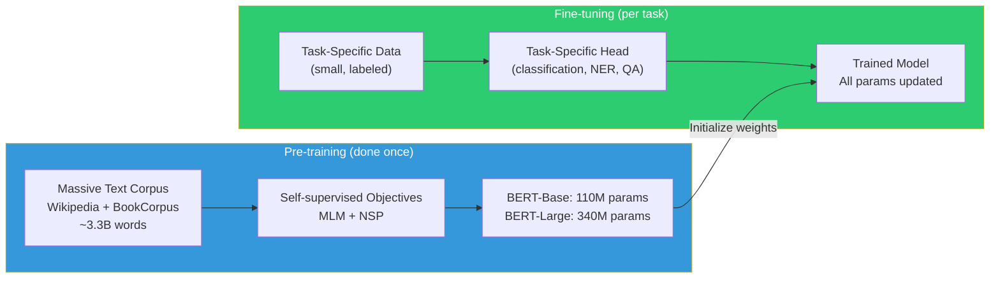

# BERT Family — Encoder-Only Pre-trained Language Models

BERT (Bidirectional Encoder Representations from Transformers, Devlin et al., 2018) launched the modern era of transfer learning in NLP. Understanding BERT deeply — its objectives, architecture, variants, and limitations — is essential for every NLP interview.

---

## Table of Contents

1. [BERT Overview and Motivation](#bert-overview-and-motivation)
2. [Pre-training Objectives](#pre-training-objectives)
3. [BERT Architecture Details](#bert-architecture-details)
4. [Special Tokens and Input Format](#special-tokens-and-input-format)
5. [WordPiece Tokenization](#wordpiece-tokenization)
6. [Pre-training vs. Fine-tuning Paradigm](#pre-training-vs-fine-tuning-paradigm)
7. [Task-Specific Fine-tuning](#task-specific-fine-tuning)
8. [BERT Variants](#bert-variants)
9. [Domain-Specific BERTs](#domain-specific-berts)
10. [Sentence-BERT (SBERT)](#sentence-bert-sbert)
11. [When to Use BERT-Family Models](#when-to-use-bert-family-models)
12. [Comparison Table](#comparison-table)
13. [PyTorch: Fine-tuning BERT for Classification](#pytorch-fine-tuning-bert)
14. [Interview Questions](#interview-questions)

---

## BERT Overview and Motivation

### The Problem BERT Solved

Before BERT, the state of the art for NLP tasks followed one of two approaches:

1. **Feature-based**: Use pre-trained representations (Word2Vec, ELMo) as fixed features, train task-specific model on top
2. **Fine-tuning shallow**: Fine-tune pre-trained models (GPT-1) but only unidirectionally

The critical limitation: **ELMo was bidirectional but used shallow concatenation of forward/backward LSTMs**, not deep bidirectional attention. **GPT was deep Transformer but unidirectional** (can only see past tokens). Neither combined deep Transformer representations with full bidirectional context.

BERT's innovation: **deep bidirectional Transformer pre-training**. Every layer, every token can attend to all other tokens in both directions. This produces much richer contextual representations than any previous model.

### Why Bidirectionality Matters

Consider "bank" in:
- "He deposited money at the **bank**."
- "The river **bank** was muddy."

A unidirectional model (GPT-1) only sees context from the left when encoding "bank." A bidirectional model can use both "money" and "river" to disambiguate. For understanding tasks (classification, QA, NER), bidirectional context is clearly better.

---

## Pre-training Objectives

### 1. Masked Language Model (MLM)

**The core innovation**: instead of predicting the next token (which requires left-to-right attention), mask some input tokens and predict the masked tokens. This allows bidirectional context.

**Procedure**:
1. Take a sentence: "The cat sat on the mat"
2. Randomly mask 15% of tokens:
   - 80% of the time: replace with [MASK] → "The [MASK] sat on the mat"
   - 10% of the time: replace with a random token → "The dog sat on the mat"
   - 10% of the time: keep the original → "The cat sat on the mat"
3. Predict the original token at masked positions using cross-entropy loss

**Why the 80/10/10 split?**
- If you only used [MASK], the model would see [MASK] during pre-training but never during fine-tuning (creates a pre-train/fine-tune mismatch). The 10% random and 10% unchanged encourage the model to keep useful representations for all tokens, not just masked ones.

**Loss**: Only compute cross-entropy at masked positions:
```
L_MLM = -Σ_{i ∈ masked} log P(x_i | context)
```

**Effect**: The model must use the full bidirectional context to predict masked tokens. To predict [MASK] in "The [MASK] sat on the mat," the model must understand both "The" (left) and "sat on the mat" (right) to predict "cat."

### 2. Next Sentence Prediction (NSP)

**The (eventually controversial) objective**: given two sentences A and B, predict whether B actually follows A in the original document.

**Procedure**:
- 50% of the time: B is the actual next sentence (label: IsNext)
- 50% of the time: B is a random sentence from the corpus (label: NotNext)

**Input format**:
```
[CLS] Sentence A [SEP] Sentence B [SEP]
```

Use the [CLS] token representation for binary classification.

**Why it was included**: The authors believed NSP would help tasks requiring sentence-pair understanding (NLI, QA).

**Why it was criticized**: RoBERTa (2019) showed that removing NSP and training with more data on MLM alone consistently outperforms BERT. NSP is too easy — the model can solve it by detecting distribution shift (random sentences are from different domains) rather than true semantic coherence.

---

## BERT Architecture Details

BERT uses a Transformer encoder (bidirectional, no causal masking).

### BERT-Base vs. BERT-Large

| Component | BERT-Base | BERT-Large |
|-----------|-----------|------------|
| Layers (N) | 12 | 24 |
| Hidden size (d_model) | 768 | 1024 |
| Attention heads (h) | 12 | 16 |
| FFN dimension (d_ff) | 3072 (4×) | 4096 (4×) |
| d_k = d_v | 64 | 64 |
| Total parameters | 110M | 340M |
| Pre-training hardware | 16 TPU days | 64 TPU days |

### Activation Function

BERT uses **GELU** activation in the FFN, not ReLU (a departure from the original Transformer). GELU was shown to work better in NLP tasks.

### Token Type Embeddings

In addition to token embeddings and position embeddings, BERT adds **token type embeddings** (also called segment embeddings):
- Segment A tokens: get segment embedding A
- Segment B tokens: get segment embedding B

This lets the model distinguish which sentence each token belongs to.

```
Input = TokenEmbedding + PositionalEmbedding + SegmentEmbedding
```

---

## Special Tokens and Input Format

### [CLS] Token

The first token is always `[CLS]` (classification). Its final hidden state is used as the aggregate sequence representation for classification tasks.

**Why the first position?** Technically arbitrary — in bidirectional attention, every position has full context. [CLS] was chosen by convention and the model learns to aggregate information there because that's where the classification head is attached during fine-tuning.

### [SEP] Token

Separator between sentence A and sentence B, and at the end of the input. Helps the model identify sentence boundaries.

### [PAD] Token

Used to pad shorter sequences to the maximum batch length. Positions with [PAD] are masked in attention (attention mask = 0).

### [MASK] Token

Used during MLM pre-training. At fine-tuning time, this token is never used (only during pre-training).

### Input Structure

```
Single sentence:
[CLS] The cat sat on the mat [SEP]

Sentence pair:
[CLS] What is the capital of France? [SEP] Paris is the capital. [SEP]
```

---

## WordPiece Tokenization

BERT uses WordPiece tokenization, a subword tokenization method:

**Algorithm**: Start with character vocabulary. Repeatedly merge the pair of symbols that maximizes the likelihood of the training data under a language model (greedy likelihood optimization).

**In practice**: Splits unknown words into known subword pieces marked with `##`:
```
"unbelievable" → ["un", "##believ", "##able"]
"playing"      → ["play", "##ing"]
"GPT-4"        → ["GP", "##T", "-", "4"]
```

**BERT vocabulary size**: 30,522 tokens (English)

**Why subword tokenization?**
- No OOV words (unknown words split into characters if necessary)
- Handles morphological variants ("running," "runs," "runner" share "run")
- Vocabulary size is manageable (30K vs. millions of words)

See [tokenization.md](./tokenization.md) for detailed comparison of BPE, WordPiece, and SentencePiece.

---

## Pre-training vs. Fine-tuning Paradigm

### The Paradigm Shift

Before BERT: train models from scratch for each task. You needed task-specific architectures, task-specific data, and extensive training for each new problem.

After BERT: pre-train once on massive unlabeled text, then fine-tune on small labeled datasets for specific tasks.



### Why Pre-training Works

**The distributional hypothesis**: Words that appear in similar contexts have similar meanings. By training on massive text with MLM, BERT learns:
- Syntactic knowledge (what grammatical patterns look like)
- Semantic knowledge (word meanings, relationships)
- World knowledge (basic factual associations from text)
- Discourse knowledge (how sentences relate)

Fine-tuning then adapts these rich representations to the specific task with small amounts of labeled data. The representations are so good that even a linear classifier on top of frozen BERT features outperforms many task-specific models trained from scratch.

### Fine-tuning Recommendations (from the BERT paper)

- **Learning rate**: 2e-5 to 5e-5 (very small, to not destroy pre-trained knowledge)
- **Batch size**: 16 or 32
- **Epochs**: 3–4 (rarely need more)
- **Warmup**: 10% of training steps
- **Max sequence length**: 128 for most tasks, 512 for QA

---

## Task-Specific Fine-tuning

### Text Classification

Use the [CLS] token representation, add a linear layer:

```python
# BERT output: (batch, seq_len, 768)
cls_output = bert_output[:, 0, :]    # (batch, 768)
logits = nn.Linear(768, num_classes)(cls_output)
loss = nn.CrossEntropyLoss()(logits, labels)
```

Tasks: sentiment analysis, topic classification, NLI, document classification.

### Token Classification (NER, POS Tagging)

Use every token's representation, add a token-level linear classifier:

```python
# BERT output: (batch, seq_len, 768)
token_outputs = bert_output    # (batch, seq_len, 768)
logits = nn.Linear(768, num_labels)(token_outputs)  # (batch, seq_len, num_labels)
# CRF optional for NER to enforce valid label sequences
```

Tasks: Named Entity Recognition, Part-of-Speech tagging, chunking.

**Note on subword tokens**: BERT tokenizes to subwords, but NER labels are word-level. Convention: only predict on the **first subword** of each word, ignore predictions for `##` tokens.

### Extractive Question Answering

For SQuAD-style QA (answer is a span in the passage):

```
Input: [CLS] Question [SEP] Passage [SEP]
Output: Start position + End position (in passage)
```

```python
# Two linear heads: one for start position, one for end
start_logits = nn.Linear(768, 1)(bert_output).squeeze(-1)  # (batch, seq)
end_logits = nn.Linear(768, 1)(bert_output).squeeze(-1)    # (batch, seq)
# Find span with highest start_logit[i] + end_logit[j] where j >= i
```

Tasks: SQuAD, Natural Questions, TriviaQA (extractive).

---

## BERT Variants

### RoBERTa (Facebook AI, 2019)

**Paper**: "RoBERTa: A Robustly Optimized BERT Pretraining Approach"

**Changes from BERT**:
1. **No NSP**: Removed Next Sentence Prediction (shown to be unhelpful or harmful)
2. **More data**: 160GB text (vs. BERT's 16GB — Wikipedia + Books)
3. **Longer training**: 10× more updates
4. **Dynamic masking**: Masking pattern changes each epoch (BERT used static masking)
5. **Larger mini-batches**: 8K instead of 256
6. **Longer sequences**: Full sequences up to 512 tokens

**Results**: +1–5 GLUE points over BERT-Large on most tasks.

**Lesson**: BERT was significantly undertrained. Architecture was correct, training recipe needed improvement.

### ALBERT (Google, 2019)

**Paper**: "ALBERT: A Lite BERT for Self-supervised Learning of Language Representations"

**Changes from BERT**:
1. **Factorized embedding parameterization**: Separate vocab embedding size from hidden size. Use small embedding (128-dim), project up to hidden size (768+). Reduces embedding parameters from `V × H` to `V × E + E × H`.
2. **Cross-layer parameter sharing**: All encoder layers share the same weights. Massively reduces total parameters.
3. **SOP instead of NSP**: Sentence Order Prediction — predict whether two consecutive sentences are in correct or reversed order. Much harder than NSP, more useful.

**Results**:
- ALBERT-xxlarge (235M params) outperforms BERT-Large (340M params)
- Parameter efficient but **slower at inference** — same number of layers, fewer params per layer, but same compute
- "Fewer parameters" does not mean "faster" — it means less memory, same FLOPs

**Common misconception**: ALBERT is "smaller and faster." It's smaller in parameters but not faster at inference (same number of layers = same FLOPs).

### DistilBERT (HuggingFace, 2019)

**Paper**: "DistilBERT, a distilled version of BERT: smaller, faster, cheaper and lighter"

**Method**: Knowledge distillation from BERT-Base.

**Changes**:
1. 6 layers instead of 12 (50% fewer)
2. Removes token type embeddings
3. Trained with soft targets from BERT-Base + MLM + cosine similarity loss on hidden states
4. Same hidden size (768)

**Results**:
- 40% smaller than BERT-Base
- 60% faster at inference
- Retains 97% of BERT-Base performance on GLUE

**When to use**: Production deployments with latency constraints, mobile/edge applications, API cost reduction.

### ELECTRA (Google, 2020)

**Paper**: "ELECTRA: Pre-training Text Encoders as Discriminators Rather Than Generators"

**The key innovation**: Instead of MLM (predict masked tokens), use **Replaced Token Detection (RTD)**:

1. Train a small "generator" (MLM model) to replace some tokens
2. Train the large "discriminator" to detect which tokens were replaced

```
Input:  "The chef [MASK] the [MASK]"
Generator replaces: "The chef cooked the meal"
Discriminator predicts: original/replaced for each token
```

**Why this is better than MLM**:
- MLM only trains on the 15% masked positions (85% of tokens get no gradient signal)
- RTD trains on **every token** (is it original or replaced?)
- Same training compute, much more efficient learning signal

**Results**: ELECTRA-Base outperforms BERT-Large despite being the same size as BERT-Base. At equivalent compute, ELECTRA-Large outperforms RoBERTa.

### DeBERTa (Microsoft, 2020)

**Paper**: "DeBERTa: Decoding-Enhanced BERT with Disentangled Attention"

**Key innovations**:
1. **Disentangled attention**: Separate attention matrices for content and position, then combine. More expressive than BERT's single attention over sum of content+position embeddings.
2. **Enhanced mask decoder**: Uses absolute position encodings only in the final softmax layer, not throughout the network. Better performance on token classification.
3. **Virtual adversarial training**: Adversarial perturbations during fine-tuning for regularization.

**Results**: State-of-the-art on SuperGLUE (outperformed human baselines briefly in 2021).

---

## Domain-Specific BERTs

General-domain BERT is pre-trained on Wikipedia and Books. For specialized domains, domain-specific pre-training consistently outperforms.

### SciBERT (Allen Institute, 2019)

- Pre-trained on 1.14M scientific papers from Semantic Scholar
- Separate scientific vocabulary (SciVocab)
- Outperforms BERT on biomedical/computer science NLP tasks
- Tasks: NER in scientific papers, citation intent, relation extraction

### BioBERT (DMIS Lab, 2019)

- Initialized from BERT, continued pre-training on PubMed abstracts + PMC full text
- ~18B tokens from biomedical literature
- State-of-the-art on biomedical NER, relation extraction, QA
- Widely used in clinical NLP, drug discovery

### ClinicalBERT, PubMedBERT

- ClinicalBERT: pre-trained on clinical notes (MIMIC-III)
- PubMedBERT: pre-trained from scratch on PubMed only (vs. BioBERT which starts from BERT)
- PubMedBERT often outperforms BioBERT — in-domain pre-training from scratch can beat general → domain adaptation

### LegalBERT

- Pre-trained on legal texts: EU legislation, court cases, contracts
- Better performance on legal NER, contract clause classification
- Legal language has very different distribution from Wikipedia

### FinBERT

- Pre-trained on financial news and filings
- Better for financial sentiment analysis, NER in financial documents

**General principle**: If your target domain has significantly different vocabulary, syntax, or concepts from Wikipedia, consider domain-specific pre-training or continued pre-training on domain data.

---

## Sentence-BERT (SBERT)

### Why Raw BERT Embeddings Are Bad for Sentence Similarity

A common mistake: use BERT to encode two sentences, compute cosine similarity of [CLS] embeddings, use as a sentence similarity score. This works poorly, and here's why:

1. **BERT was not trained for sentence-level similarity**. It was trained to predict masked tokens, not to produce semantically meaningful sentence embeddings.

2. **Anisotropy problem**: BERT's token embeddings occupy a narrow cone in high-dimensional space (most pairs have high cosine similarity ≥ 0.9). Random sentences appear more similar than they should. This is because all BERT embeddings cluster near a dominant direction (related to word frequency effects in the embedding space).

3. **Cross-encoder is correct but slow**: To compare two sentences with BERT correctly, you should encode them together: `[CLS] sentence_A [SEP] sentence_B [SEP]` and let them attend to each other. This is accurate but requires O(n²) comparisons for n sentences — unusable for retrieval at scale.

### SBERT Solution: Siamese Bi-encoders

Sentence-BERT (Reimers & Gurevych, 2019) fine-tunes BERT to produce sentence embeddings that are:
1. Semantically meaningful (similar sentences → similar vectors)
2. Computed independently (each sentence encoded separately, no cross-attention)
3. Fast for retrieval (encode query once, compare with all document embeddings via dot product/cosine)

**Architecture**: Siamese network — same BERT model applied independently to two sentences.

**Pooling**: Mean pooling of all token embeddings (not [CLS]) — consistently outperforms [CLS] pooling.

**Training objectives**:

```python
# Objective 1: Natural Language Inference (NLI) with classification loss
# For each (sentence_A, sentence_B, label) triple:
u = mean_pool(BERT(sentence_A))      # (768,)
v = mean_pool(BERT(sentence_B))      # (768,)
features = concat(u, v, |u-v|)       # (768*3 = 2304,)
logits = Linear(2304, 3)(features)   # (3,) for entailment/neutral/contradiction

# Objective 2: Semantic Textual Similarity (regression loss)
similarity = cosine_similarity(u, v)
loss = MSE(similarity, gold_score)   # gold_score ∈ [0, 1]

# Objective 3: Triplet loss (most common for modern models)
# anchor, positive (similar), negative (dissimilar)
loss = max(0, cosine_distance(anchor, positive) - cosine_distance(anchor, negative) + margin)
```

### SBERT Models

| Model | Embedding Size | Params | Speed | Quality |
|-------|---------------|--------|-------|---------|
| all-MiniLM-L6-v2 | 384 | 22M | Very fast | Good |
| all-MiniLM-L12-v2 | 384 | 33M | Fast | Better |
| all-mpnet-base-v2 | 768 | 109M | Medium | Best general |
| paraphrase-multilingual-MiniLM-L12-v2 | 384 | 118M | Fast | Good multilingual |

**all-mpnet-base-v2** is the default recommendation for most English similarity tasks.

### Embedding Pooling Strategies

| Strategy | Description | When to use |
|----------|-------------|-------------|
| [CLS] token | Use first token's embedding | When specifically fine-tuned for CLS |
| Mean pooling | Average all token embeddings | **Default, usually best** |
| Max pooling | Elementwise maximum | When you want the "peak" activation |
| Weighted mean | Weight by attention | When some tokens matter more |

Mean pooling tends to work best because it aggregates all token information without being dominated by any single token. [CLS] works well only when the model was fine-tuned to aggregate information there.

---

## When to Use BERT-Family Models

### Use BERT When:

1. **Bidirectional context is critical**: Classification, NER, QA where you need full understanding of the input
2. **Limited labeled data**: Fine-tuned BERT outperforms training from scratch with <10K examples
3. **Latency allows it**: Inference is ~10-100ms per sequence for BERT-Base on GPU
4. **Sentence similarity at scale**: Use SBERT for retrieval, semantic search
5. **Domain-specific task**: Use BioBERT, SciBERT, etc. for specialized domains

### Don't Use BERT When:

1. **You need text generation**: BERT cannot autoregressively generate text (bidirectional attention sees future tokens)
2. **Extreme latency constraints**: Use DistilBERT or smaller models
3. **Very long documents**: BERT is limited to 512 tokens (though Longformer and BigBird extend this)
4. **In-context learning / zero-shot prompting**: Use GPT-family for these
5. **Tasks well-served by GPT with prompting**: Often simpler to use a generative model with a good prompt

---

## Comparison Table

| Property | BERT | RoBERTa | ALBERT | DistilBERT | ELECTRA |
|----------|------|---------|--------|------------|---------|
| Architecture | Encoder | Encoder | Encoder | Encoder | Encoder (disc) |
| Layers | 12/24 | 12/24 | 12/24 | 6 | 12/24 |
| Parameters | 110M/340M | 125M/355M | 12M–235M | 66M | 14M–335M |
| Pre-train objective | MLM + NSP | MLM | MLM + SOP | Distillation | Replaced Token Detection |
| Training data | 16GB | 160GB | Same as BERT | From BERT-Base | Same as BERT |
| GLUE score (base) | 79.6 | 83.7 | 82.3 | ~77 | 85.1 |
| Inference speed | 1x | 1x | 1x | 1.6x faster | 1x |
| Best use case | General baseline | Best general | Param efficient | Fast inference | Best quality/compute |

---

## PyTorch: Fine-tuning BERT for Classification

```python
"""
Fine-tuning BERT for binary text classification using HuggingFace Transformers.
Dataset: IMDb sentiment analysis.
"""

import torch
import torch.nn as nn
from torch.utils.data import Dataset, DataLoader
from transformers import (
    BertTokenizer,
    BertModel,
    BertForSequenceClassification,
    AdamW,
    get_linear_schedule_with_warmup,
)
from sklearn.metrics import accuracy_score, classification_report
import numpy as np


# ============================================================
# 1. Dataset
# ============================================================

class SentimentDataset(Dataset):
    def __init__(
        self,
        texts: list[str],
        labels: list[int],
        tokenizer: BertTokenizer,
        max_length: int = 128
    ):
        self.texts = texts
        self.labels = labels
        self.tokenizer = tokenizer
        self.max_length = max_length

    def __len__(self):
        return len(self.texts)

    def __getitem__(self, idx):
        encoding = self.tokenizer(
            self.texts[idx],
            max_length=self.max_length,
            padding='max_length',         # Pad to max_length
            truncation=True,              # Truncate longer sequences
            return_attention_mask=True,
            return_tensors='pt'           # Return PyTorch tensors
        )

        return {
            'input_ids': encoding['input_ids'].squeeze(0),          # (max_length,)
            'attention_mask': encoding['attention_mask'].squeeze(0), # (max_length,)
            'token_type_ids': encoding.get('token_type_ids',
                torch.zeros(self.max_length, dtype=torch.long)).squeeze(0),
            'labels': torch.tensor(self.labels[idx], dtype=torch.long)
        }


# ============================================================
# 2. Custom BERT Classifier (manual implementation)
# ============================================================

class BertClassifier(nn.Module):
    """
    BERT encoder + classification head.
    Demonstrates how to use BERT as a backbone manually.
    """

    def __init__(
        self,
        model_name: str = 'bert-base-uncased',
        num_classes: int = 2,
        dropout: float = 0.1,
        freeze_bert: bool = False
    ):
        super().__init__()
        self.bert = BertModel.from_pretrained(model_name)

        if freeze_bert:
            # Feature extraction: freeze BERT, train only the head
            for param in self.bert.parameters():
                param.requires_grad = False

        hidden_size = self.bert.config.hidden_size  # 768 for bert-base

        self.classifier = nn.Sequential(
            nn.Dropout(dropout),
            nn.Linear(hidden_size, hidden_size // 2),
            nn.GELU(),
            nn.Dropout(dropout),
            nn.Linear(hidden_size // 2, num_classes)
        )

    def forward(
        self,
        input_ids: torch.Tensor,
        attention_mask: torch.Tensor,
        token_type_ids: torch.Tensor = None,
    ) -> torch.Tensor:

        outputs = self.bert(
            input_ids=input_ids,
            attention_mask=attention_mask,
            token_type_ids=token_type_ids,
        )

        # Use [CLS] token representation (first position)
        cls_output = outputs.last_hidden_state[:, 0, :]  # (batch, 768)

        # Alternative: use pooler output (BERT's built-in CLS pooler)
        # cls_output = outputs.pooler_output  # (batch, 768)

        logits = self.classifier(cls_output)   # (batch, num_classes)
        return logits


# ============================================================
# 3. Training Loop
# ============================================================

def train_epoch(model, dataloader, optimizer, scheduler, device):
    model.train()
    total_loss = 0
    all_preds = []
    all_labels = []

    criterion = nn.CrossEntropyLoss()

    for batch in dataloader:
        input_ids = batch['input_ids'].to(device)
        attention_mask = batch['attention_mask'].to(device)
        token_type_ids = batch['token_type_ids'].to(device)
        labels = batch['labels'].to(device)

        optimizer.zero_grad()

        logits = model(input_ids, attention_mask, token_type_ids)
        loss = criterion(logits, labels)

        loss.backward()

        # Gradient clipping: critical for stable BERT fine-tuning
        torch.nn.utils.clip_grad_norm_(model.parameters(), max_norm=1.0)

        optimizer.step()
        scheduler.step()

        total_loss += loss.item()
        preds = torch.argmax(logits, dim=-1).cpu().numpy()
        all_preds.extend(preds)
        all_labels.extend(labels.cpu().numpy())

    avg_loss = total_loss / len(dataloader)
    accuracy = accuracy_score(all_labels, all_preds)
    return avg_loss, accuracy


def evaluate(model, dataloader, device):
    model.eval()
    total_loss = 0
    all_preds = []
    all_labels = []

    criterion = nn.CrossEntropyLoss()

    with torch.no_grad():
        for batch in dataloader:
            input_ids = batch['input_ids'].to(device)
            attention_mask = batch['attention_mask'].to(device)
            token_type_ids = batch['token_type_ids'].to(device)
            labels = batch['labels'].to(device)

            logits = model(input_ids, attention_mask, token_type_ids)
            loss = criterion(logits, labels)

            total_loss += loss.item()
            preds = torch.argmax(logits, dim=-1).cpu().numpy()
            all_preds.extend(preds)
            all_labels.extend(labels.cpu().numpy())

    avg_loss = total_loss / len(dataloader)
    accuracy = accuracy_score(all_labels, all_preds)
    return avg_loss, accuracy, all_preds, all_labels


# ============================================================
# 4. Using HuggingFace BertForSequenceClassification (simpler)
# ============================================================

def train_with_hf_trainer():
    """
    Using HuggingFace's built-in BertForSequenceClassification.
    This is cleaner and recommended for production fine-tuning.
    """
    from transformers import Trainer, TrainingArguments
    import evaluate

    model = BertForSequenceClassification.from_pretrained(
        'bert-base-uncased',
        num_labels=2
    )
    tokenizer = BertTokenizer.from_pretrained('bert-base-uncased')

    # Training arguments
    training_args = TrainingArguments(
        output_dir='./bert-sentiment',
        num_train_epochs=3,
        per_device_train_batch_size=16,
        per_device_eval_batch_size=32,
        learning_rate=2e-5,
        warmup_ratio=0.1,             # 10% warmup steps
        weight_decay=0.01,             # L2 regularization
        evaluation_strategy='epoch',
        save_strategy='epoch',
        load_best_model_at_end=True,
        metric_for_best_model='accuracy',
        fp16=True,                     # Mixed precision for speed
        dataloader_num_workers=4,
        logging_steps=100,
    )

    # Metric computation
    accuracy_metric = evaluate.load('accuracy')
    def compute_metrics(eval_pred):
        logits, labels = eval_pred
        predictions = np.argmax(logits, axis=-1)
        return accuracy_metric.compute(predictions=predictions, references=labels)

    # Trainer handles training loop, evaluation, checkpointing
    trainer = Trainer(
        model=model,
        args=training_args,
        train_dataset=None,   # your train dataset here
        eval_dataset=None,    # your eval dataset here
        compute_metrics=compute_metrics,
    )

    return trainer


# ============================================================
# 5. Full Training Script
# ============================================================

def main():
    # Configuration
    MODEL_NAME = 'bert-base-uncased'
    MAX_LENGTH = 128
    BATCH_SIZE = 16
    NUM_EPOCHS = 3
    LEARNING_RATE = 2e-5
    WARMUP_RATIO = 0.1
    NUM_CLASSES = 2

    device = torch.device('cuda' if torch.cuda.is_available() else 'cpu')
    print(f"Using device: {device}")

    # Load tokenizer
    tokenizer = BertTokenizer.from_pretrained(MODEL_NAME)

    # Example data (replace with real dataset)
    train_texts = [
        "This movie was absolutely fantastic!",
        "Terrible film, complete waste of time.",
        "I loved every minute of it.",
        "The worst movie I've ever seen.",
    ] * 100  # Expand for example
    train_labels = [1, 0, 1, 0] * 100

    val_texts = train_texts[:20]
    val_labels = train_labels[:20]

    # Create datasets
    train_dataset = SentimentDataset(train_texts, train_labels, tokenizer, MAX_LENGTH)
    val_dataset = SentimentDataset(val_texts, val_labels, tokenizer, MAX_LENGTH)

    train_loader = DataLoader(train_dataset, batch_size=BATCH_SIZE, shuffle=True)
    val_loader = DataLoader(val_dataset, batch_size=BATCH_SIZE, shuffle=False)

    # Initialize model
    model = BertClassifier(MODEL_NAME, NUM_CLASSES).to(device)

    # Optimizer with weight decay (don't decay biases or LayerNorm weights)
    no_decay = ['bias', 'LayerNorm.weight']
    optimizer_grouped_parameters = [
        {
            'params': [p for n, p in model.named_parameters()
                      if not any(nd in n for nd in no_decay)],
            'weight_decay': 0.01
        },
        {
            'params': [p for n, p in model.named_parameters()
                      if any(nd in n for nd in no_decay)],
            'weight_decay': 0.0
        },
    ]
    optimizer = AdamW(optimizer_grouped_parameters, lr=LEARNING_RATE)

    # Learning rate scheduler with warmup
    total_steps = len(train_loader) * NUM_EPOCHS
    warmup_steps = int(total_steps * WARMUP_RATIO)
    scheduler = get_linear_schedule_with_warmup(
        optimizer,
        num_warmup_steps=warmup_steps,
        num_training_steps=total_steps
    )

    # Training loop
    best_val_accuracy = 0
    for epoch in range(NUM_EPOCHS):
        train_loss, train_acc = train_epoch(
            model, train_loader, optimizer, scheduler, device
        )
        val_loss, val_acc, val_preds, val_labels_list = evaluate(
            model, val_loader, device
        )

        print(f"Epoch {epoch + 1}/{NUM_EPOCHS}")
        print(f"  Train Loss: {train_loss:.4f}, Train Acc: {train_acc:.4f}")
        print(f"  Val Loss:   {val_loss:.4f}, Val Acc:   {val_acc:.4f}")

        if val_acc > best_val_accuracy:
            best_val_accuracy = val_acc
            torch.save(model.state_dict(), 'best_bert_model.pt')

    print(f"\nBest validation accuracy: {best_val_accuracy:.4f}")


if __name__ == "__main__":
    main()
```

---

## Interview Questions

### Q1: "Why can't you use BERT for text generation?"

**Strong answer**: BERT uses bidirectional attention — every token can attend to all other tokens, including future tokens. This is perfect for understanding tasks: to classify "The cat sat on the mat," BERT can look at the entire sentence from the beginning. But for generation, you need to produce tokens autoregressively — predict token `t+1` given tokens `1` through `t`. If you use BERT to generate, the model would be able to "see" the tokens it's supposed to predict, which would make the task trivial and the model would learn nothing about generating text. The solution is either to use a decoder-only model (GPT) with causal masking, or an encoder-decoder model (T5) where the decoder has causal masking. BERT's bidirectional attention fundamentally prevents it from performing autoregressive generation.

---

### Q2: "What is the difference between BERT and GPT architecturally?"

**Strong answer**: Both use Transformer blocks, but with fundamental differences. BERT is encoder-only with **bidirectional self-attention** — every token attends to all other tokens simultaneously. This is enabled by the MLM pre-training objective: masking tokens and predicting them from both left and right context. The result is rich contextual representations suitable for understanding tasks. GPT is decoder-only with **causal (unidirectional) self-attention** — each token can only attend to itself and previous tokens. This is enabled by the causal language modeling objective: predict the next token given all previous tokens. The result is a model that can generate coherent text autoregressively. Architecturally, BERT uses Post-LN in the original, GELU activation, and segment embeddings; GPT uses Pre-LN in GPT-2 onwards, also GELU, but no segment embeddings (no sentence pairs). The choice of objective drives everything: MLM gives bidirectionality, CLM forces causal masking.

---

### Q3: "Why did RoBERTa outperform BERT without architectural changes?"

**Strong answer**: BERT was significantly undertrained. The original BERT paper used static masking (same mask pattern for all epochs), a relatively small dataset (16GB), shorter training (1M steps), small batches (256), and the NSP objective. RoBERTa's ablation studies showed: (1) Dynamic masking adds ~0.5–1 GLUE points — the model sees more diverse masked patterns. (2) Removing NSP adds another ~0.5–1 points — NSP was actually hurting by forcing shorter sequences (sentence pairs truncated to fit). (3) Training on 10× more data and 10× more steps each add several more points. Together, these purely training-recipe changes yield 4+ GLUE points improvement. The lesson for practitioners: before trying a new architecture, make sure you've exhausted training improvements on the existing one.

---

### Q4: "What is the NSP pre-training task and why was it removed in later models?"

**Strong answer**: NSP (Next Sentence Prediction) trains BERT to predict whether two input sentences actually appear consecutively in text (50%) or are random pairs (50%), using the [CLS] token representation. It was designed to help tasks like NLI and QA that require understanding sentence relationships. However, RoBERTa's ablations showed NSP either hurts or has no effect: the NSP objective is too easy to solve using domain-level cues (random sentences often come from different domains, topics, or even languages) rather than semantic coherence. More critically, NSP required sentence-pair inputs, forcing BERT to use shorter sequences (splitting a document into pairs) rather than training on full long documents. Training on longer sequences with MLM only consistently outperforms BERT. Subsequent models (ALBERT replaced NSP with SOP — Sentence Order Prediction, which is much harder) and most modern models simply dropped NSP entirely.

---

### Q5: "Explain the ELECTRA approach and why it is more sample efficient than BERT."

**Strong answer**: BERT's MLM trains on only 15% of tokens per forward pass — 85% of the sequence gets no gradient signal from the primary objective. ELECTRA uses Replaced Token Detection: a small generator model (trained with MLM) produces plausible replacements for some tokens, and the discriminator (the main ELECTRA model) predicts whether each token is original or replaced. Since RTD operates on every token in every position, the discriminator gets gradient signal from 100% of tokens per forward pass — approximately 6.7× more learning signal per step than BERT's MLM. This makes ELECTRA dramatically more sample efficient: ELECTRA-Base outperforms BERT-Large using the same compute as BERT-Base. The trade-off is training complexity (need to jointly train generator and discriminator) and the discriminator loses the ability to generate text (it's trained to discriminate, not to predict token distributions).

---

*Next: [GPT Family](./gpt_family.md) — decoder-only language models and in-context learning.*
