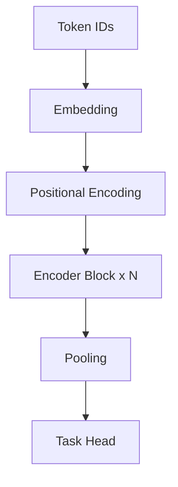

# Building a Mini Transformer Encoder from Scratch (PyTorch)

This file provides a minimal but correct educational implementation of transformer encoder components.

## Components we implement
- Scaled dot-product attention
- Multi-head attention
- Positional encoding
- Feed-forward network
- Encoder block
- Encoder stack + classifier head



## Full code
```python
import math
import torch
import torch.nn as nn
import torch.nn.functional as F

class ScaledDotProductAttention(nn.Module):
    def __init__(self, dropout=0.1):
        super().__init__()
        self.dropout = nn.Dropout(dropout)

    def forward(self, q, k, v, mask=None):
        # q, k, v: [B, H, T, D]
        d_k = q.size(-1)
        scores = torch.matmul(q, k.transpose(-2, -1)) / math.sqrt(d_k)
        if mask is not None:
            scores = scores.masked_fill(mask == 0, float('-inf'))
        attn = torch.softmax(scores, dim=-1)
        attn = self.dropout(attn)
        out = torch.matmul(attn, v)
        return out, attn

class MultiHeadAttention(nn.Module):
    def __init__(self, d_model, n_heads, dropout=0.1):
        super().__init__()
        assert d_model % n_heads == 0
        self.d_model = d_model
        self.n_heads = n_heads
        self.d_head = d_model // n_heads

        self.w_q = nn.Linear(d_model, d_model)
        self.w_k = nn.Linear(d_model, d_model)
        self.w_v = nn.Linear(d_model, d_model)
        self.w_o = nn.Linear(d_model, d_model)

        self.attn = ScaledDotProductAttention(dropout)
        self.dropout = nn.Dropout(dropout)

    def split_heads(self, x):
        B, T, D = x.shape
        x = x.view(B, T, self.n_heads, self.d_head).transpose(1, 2)
        return x

    def combine_heads(self, x):
        B, H, T, Dh = x.shape
        return x.transpose(1, 2).contiguous().view(B, T, H * Dh)

    def forward(self, x, mask=None):
        q = self.split_heads(self.w_q(x))
        k = self.split_heads(self.w_k(x))
        v = self.split_heads(self.w_v(x))
        out, attn = self.attn(q, k, v, mask)
        out = self.combine_heads(out)
        out = self.w_o(self.dropout(out))
        return out, attn

class PositionwiseFFN(nn.Module):
    def __init__(self, d_model, d_ff, dropout=0.1):
        super().__init__()
        self.net = nn.Sequential(
            nn.Linear(d_model, d_ff),
            nn.GELU(),
            nn.Dropout(dropout),
            nn.Linear(d_ff, d_model)
        )

    def forward(self, x):
        return self.net(x)

class PositionalEncoding(nn.Module):
    def __init__(self, d_model, max_len=4096):
        super().__init__()
        pe = torch.zeros(max_len, d_model)
        pos = torch.arange(0, max_len).unsqueeze(1)
        div = torch.exp(torch.arange(0, d_model, 2) * (-math.log(10000.0) / d_model))
        pe[:, 0::2] = torch.sin(pos * div)
        pe[:, 1::2] = torch.cos(pos * div)
        self.register_buffer('pe', pe.unsqueeze(0))  # [1, T, D]

    def forward(self, x):
        T = x.size(1)
        return x + self.pe[:, :T]

class EncoderBlock(nn.Module):
    def __init__(self, d_model, n_heads, d_ff, dropout=0.1):
        super().__init__()
        self.mha = MultiHeadAttention(d_model, n_heads, dropout)
        self.ffn = PositionwiseFFN(d_model, d_ff, dropout)
        self.ln1 = nn.LayerNorm(d_model)
        self.ln2 = nn.LayerNorm(d_model)
        self.dropout = nn.Dropout(dropout)

    def forward(self, x, mask=None):
        attn_out, _ = self.mha(x, mask)
        x = self.ln1(x + self.dropout(attn_out))
        ffn_out = self.ffn(x)
        x = self.ln2(x + self.dropout(ffn_out))
        return x

class MiniTransformerEncoder(nn.Module):
    def __init__(self, vocab_size, d_model=128, n_heads=4, d_ff=256, n_layers=2, n_classes=2, max_len=512):
        super().__init__()
        self.embed = nn.Embedding(vocab_size, d_model)
        self.pos = PositionalEncoding(d_model, max_len=max_len)
        self.layers = nn.ModuleList([
            EncoderBlock(d_model, n_heads, d_ff) for _ in range(n_layers)
        ])
        self.classifier = nn.Linear(d_model, n_classes)

    def forward(self, input_ids, mask=None):
        x = self.embed(input_ids)
        x = self.pos(x)
        for layer in self.layers:
            x = layer(x, mask)
        pooled = x.mean(dim=1)
        return self.classifier(pooled)

# Toy forward
if __name__ == '__main__':
    model = MiniTransformerEncoder(vocab_size=10000)
    ids = torch.randint(0, 10000, (8, 64))
    logits = model(ids)
    print(logits.shape)  # [8, 2]
```

## Interview discussion points
1. Why split into multiple heads?
2. Why residual + LayerNorm at each sub-layer?
3. Why `1/sqrt(d_k)` scaling in attention scores?
4. How would you add causal masking for decoder behavior?
