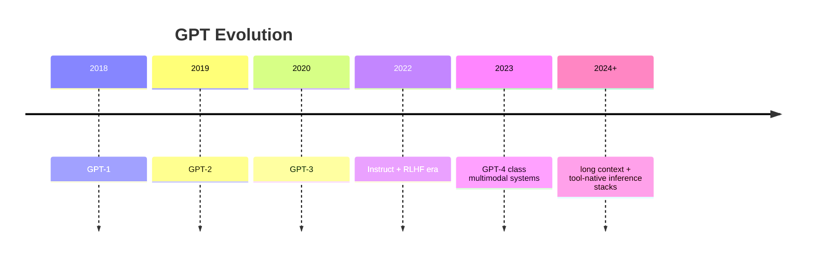

# GPT Family: Decoder-Only Transformers and Autoregressive Learning

## Core objective
GPT models optimize next-token likelihood:
`max_theta Σ_t log P_theta(x_t | x_<t)`

## Evolution summary
- GPT-1: proof that generative pretraining + task fine-tuning works.
- GPT-2: larger scale showed zero/few-shot transfer.
- GPT-3: in-context learning emerged strongly at scale.
- GPT-4 class models: stronger reasoning, tool use, multimodality (provider-dependent).



## Architecture vs BERT
- GPT: decoder-only, causal mask, generation-first.
- BERT: encoder-only, bidirectional context, understanding-first.

## In-context learning
Model adapts behavior from prompt examples without gradient updates. It is not parameter update; it is conditional computation over context.

## Decoding strategies
- Greedy: deterministic, often bland.
- Beam search: higher likelihood, can reduce diversity.
- Top-k: sample from top k candidates.
- Top-p (nucleus): sample from smallest set with cumulative prob p.
- Temperature: controls entropy.

## Interview questions
1. Why can GPT generate but BERT cannot do open-ended generation directly?
2. What is in-context learning?
3. Greedy vs nucleus sampling tradeoff?

## Python sampling sketch
```python
import torch

def top_p_sample(logits, p=0.9, temperature=0.8):
    probs = torch.softmax(logits / temperature, dim=-1)
    sorted_probs, sorted_idx = torch.sort(probs, descending=True)
    csum = torch.cumsum(sorted_probs, dim=-1)
    mask = csum > p
    mask[..., 1:] = mask[..., :-1].clone()
    mask[..., 0] = False
    sorted_probs[mask] = 0
    sorted_probs = sorted_probs / sorted_probs.sum(dim=-1, keepdim=True)
    next_id = torch.multinomial(sorted_probs, num_samples=1)
    return sorted_idx.gather(-1, next_id)
```
