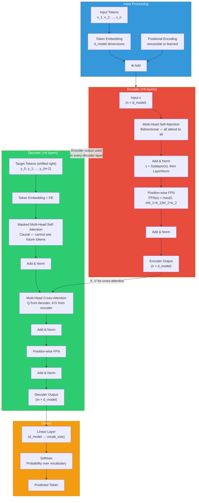
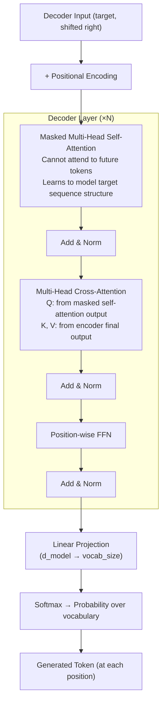
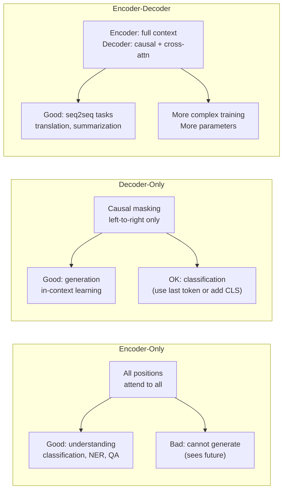

# Transformer Architecture — Complete Reference

This is the most important file in this section. The Transformer architecture (Vaswani et al., "Attention Is All You Need," 2017) is the foundation of every modern LLM. Master every component here.

---

## Table of Contents

1. [Big Picture: What the Transformer Does](#big-picture)
2. [Full Architecture Diagram](#full-architecture-diagram)
3. [Input Representation](#input-representation)
4. [Positional Encoding](#positional-encoding)
5. [Encoder Architecture](#encoder-architecture)
6. [Multi-Head Attention (Detailed)](#multi-head-attention-detailed)
7. [Feed-Forward Network](#feed-forward-network)
8. [Residual Connections and Layer Normalization](#residual-connections-and-layer-normalization)
9. [Decoder Architecture](#decoder-architecture)
10. [Transformer Variants](#transformer-variants)
11. [Complete PyTorch Encoder Implementation](#complete-pytorch-encoder-implementation)
12. [Interview Questions](#interview-questions)

---

## Big Picture: What the Transformer Does

The Transformer is a sequence-to-sequence model. Given an input sequence of tokens `(x_1, ..., x_n)`, it produces an output sequence `(y_1, ..., y_m)`.

The key architectural innovations over previous models:
1. **Self-attention** replaces recurrence — direct token-to-token interaction
2. **Parallelism** — all positions processed simultaneously during training
3. **Stacked layers** — each layer builds richer representations
4. **Residual connections** — allow very deep networks to train stably
5. **Layer normalization** — stabilizes activations across the network

The original Transformer (for translation) had:
- `N = 6` encoder layers and `N = 6` decoder layers
- `d_model = 512`, `h = 8` heads, `d_ff = 2048` (FFN inner dimension)
- `d_k = d_v = 64` (512 / 8 heads)

Modern variants change many of these numbers but keep the core structure.

---

## Full Architecture Diagram



---

## Input Representation

### Token Embeddings

Each token in the vocabulary is mapped to a `d_model`-dimensional embedding vector via a learned embedding matrix `E` of shape `(vocab_size, d_model)`.

```python
token_ids = tokenizer("The cat sat")  # [1423, 8765, 4231]
embeddings = E[token_ids]             # (3, d_model=512)
```

In the original Transformer paper, the embedding weights are **shared** between the input embedding, output embedding, and the final linear layer. This reduces parameters and improves performance (the intuition: related tokens have similar embeddings, making the output projection more sensible).

The embeddings are scaled by `sqrt(d_model)` to prevent them from being too small relative to the positional encodings:
```
X = E[token_ids] * sqrt(d_model)
```

### Why Scale the Embeddings?

Positional encodings have values in [-1, 1] (sin/cos functions). If embeddings are initialized with small values (standard initialization), the positional signal would dominate. Scaling by `sqrt(d_model)` makes the embedding magnitude comparable to the positional encoding magnitude. This is a minor detail but appears in careful implementations.

---

## Positional Encoding

### Why Positional Encoding Is Necessary

Self-attention is **permutation equivariant** without positional encoding. If you shuffle the input tokens, you get the same attention outputs, just in a different order. The model has no way to know that token 1 comes before token 2.

To see why: attention computes `softmax(QK^T/sqrt(d_k)) · V`. If you permute the rows of K and V simultaneously, the output changes only in the same permutation — no ordering information is implicitly encoded.

RNNs have order built in (token 2 is processed after token 1). Transformers process all tokens in parallel, so order must be injected explicitly.

### Sinusoidal Positional Encoding (Original Transformer)

The positional encoding for position `pos` and dimension `i` is:

```
PE(pos, 2i)   = sin(pos / 10000^(2i/d_model))
PE(pos, 2i+1) = cos(pos / 10000^(2i/d_model))
```

Where `pos` is the position (0-indexed) and `i` ranges from `0` to `d_model/2 - 1`.

**Intuition**: Each dimension oscillates at a different frequency. Dimension 0 oscillates very quickly (period 2π). Dimension d_model-1 oscillates very slowly (period 2π × 10000). The combination of all frequencies gives a unique binary-like encoding for each position.

Think of it like a thermometer readout at different timescales — some digits change every millisecond, some every second, some every minute, some every hour. Together they uniquely identify the time.

**Properties of sinusoidal PE**:
1. **Unique encoding**: Each position has a distinct vector
2. **Relative positions learnable**: PE(pos + k) can be expressed as a linear function of PE(pos) — the model can learn to attend to "3 positions ahead" via learned linear transformations
3. **Generalizes to unseen lengths**: A model trained on sequences up to length 512 can still process length 600 (the PE formula works for any pos)
4. **Fixed, not learned**: No extra parameters

```python
import torch
import math

def sinusoidal_positional_encoding(seq_len: int, d_model: int) -> torch.Tensor:
    """
    Compute sinusoidal positional encodings.

    Returns: (1, seq_len, d_model) tensor of positional encodings
    """
    # Position indices: (seq_len, 1)
    position = torch.arange(seq_len, dtype=torch.float).unsqueeze(1)

    # Dimension scaling factors: (d_model/2,)
    # div_term[i] = 1 / 10000^(2i/d_model) = exp(-2i/d_model * log(10000))
    div_term = torch.exp(
        torch.arange(0, d_model, 2, dtype=torch.float) *
        (-math.log(10000.0) / d_model)
    )

    # Initialize PE matrix
    pe = torch.zeros(seq_len, d_model)

    # Even dimensions: sin
    pe[:, 0::2] = torch.sin(position * div_term)

    # Odd dimensions: cos
    pe[:, 1::2] = torch.cos(position * div_term)

    # Add batch dimension
    return pe.unsqueeze(0)  # (1, seq_len, d_model)
```

### Learned Positional Embeddings (BERT, GPT-2)

Instead of the fixed sinusoidal formula, learn a separate embedding for each position:

```python
self.pos_embedding = nn.Embedding(max_seq_len, d_model)
# Usage:
positions = torch.arange(seq_len, device=x.device).unsqueeze(0)
pos_emb = self.pos_embedding(positions)  # (1, seq_len, d_model)
```

**Pros**: More expressive — the model can learn whatever positional signal is useful.
**Cons**: Cannot generalize to lengths longer than `max_seq_len` seen during training.

### Relative Positional Encoding (T5)

Instead of encoding absolute positions, encode relative distances between tokens. T5 adds learned biases to the attention logits based on the relative position `(i - j)` between query `i` and key `j`:

```
Attention_score(i, j) = Q_i · K_j / sqrt(d_k) + bias(i - j)
```

The bias is a learned scalar for each relative distance, bucketed for large distances. This allows the model to reason about "how far apart are these tokens?" rather than "what absolute position am I at?" — more generalizable.

### ALiBi (Attention with Linear Biases)

ALiBi (Press et al., 2021) adds a fixed linear penalty based on distance:

```
Attention_score(i, j) = Q_i · K_j / sqrt(d_k) - m * (i - j)
```

Where `m` is a head-specific slope (different for each attention head). The penalty is linear in distance — the farther away, the lower the attention score. No learned parameters, no absolute positions.

**Key advantage**: Models trained with ALiBi extrapolate well to sequences longer than those seen during training. If trained on 1024 tokens, still works on 2048+ at test time (with some degradation). Used in MPT, BLOOM.

### Rotary Positional Embeddings (RoPE)

RoPE (Su et al., 2021) is used in LLaMA, Falcon, GPT-NeoX, PaLM, and most modern open-source LLMs.

**Key idea**: Instead of adding positional information to token embeddings, rotate the query and key vectors before computing attention. The rotation angle depends on position, and the dot product of a rotated query with a rotated key naturally encodes relative position.

```
q_m = R(m) · q        # Rotate query at position m
k_n = R(n) · k        # Rotate key at position n
q_m · k_n = q · R(n-m) · k   # Dot product depends only on relative position (n-m)
```

Where `R(θ)` is a 2D rotation matrix applied to pairs of dimensions.

**Why RoPE is better**:
1. Encodes relative position (like T5's relative bias), not absolute
2. More parameter-efficient than T5 biases
3. Can be extended to longer contexts with RoPE scaling (YaRN, LongRoPE, etc.)
4. Works naturally with causal attention

```python
def apply_rope(x: torch.Tensor, seq_len: int) -> torch.Tensor:
    """
    Apply Rotary Position Embedding to queries or keys.
    x: (batch, heads, seq_len, d_k)
    """
    d_k = x.shape[-1]
    # Compute rotation frequencies
    theta = 1.0 / (10000 ** (torch.arange(0, d_k, 2).float() / d_k))
    positions = torch.arange(seq_len, device=x.device).float()

    # Outer product: (seq_len, d_k/2)
    freqs = torch.outer(positions, theta)

    # Create cos/sin encodings
    cos = freqs.cos().unsqueeze(0).unsqueeze(0)  # (1, 1, seq_len, d_k/2)
    sin = freqs.sin().unsqueeze(0).unsqueeze(0)

    # Rotate pairs of dimensions
    x1 = x[..., 0::2]   # even dimensions
    x2 = x[..., 1::2]   # odd dimensions
    x_rotated = torch.stack([
        x1 * cos - x2 * sin,
        x1 * sin + x2 * cos
    ], dim=-1)

    return x_rotated.flatten(-2)
```

### Positional Encoding Comparison

| Method | Models | Absolute/Relative | Trainable | Long-Context Extrapolation |
|--------|--------|------------------|-----------|--------------------------|
| Sinusoidal | Original Transformer | Absolute | No | Moderate |
| Learned Absolute | BERT, GPT-2 | Absolute | Yes | Poor (hard cutoff) |
| Relative (T5 bias) | T5 | Relative | Yes (bucketed) | Good |
| ALiBi | MPT, BLOOM | Relative | No (fixed slopes) | Very good |
| RoPE | LLaMA, Falcon, Gemma | Relative | No | Good (with scaling) |

---

## Encoder Architecture

### Single Encoder Layer

Each of the `N` encoder layers contains two sublayers:

```
1. Multi-Head Self-Attention (bidirectional — all tokens attend to all)
2. Position-wise Feed-Forward Network

After each sublayer: Add & Norm (residual + LayerNorm)
```

The output of layer `l` is the input to layer `l+1`. The encoder builds progressively richer contextual representations over `N` layers.

### Layer-by-Layer Computation

**Notation**: Let `x` be the input to a single encoder layer, shape `(batch, seq_len, d_model)`.

**Step 1: Multi-Head Self-Attention sublayer**
```
attn_out = MultiHeadSelfAttention(x)    # (batch, seq_len, d_model)
x = LayerNorm(x + attn_out)             # Residual + normalize
```

**Step 2: Feed-Forward sublayer**
```
ffn_out = FFN(x)                        # (batch, seq_len, d_model)
x = LayerNorm(x + ffn_out)             # Residual + normalize
```

The output `x` becomes the input to the next encoder layer.

### Post-LN vs. Pre-LN

The original Transformer paper uses **Post-LN** (LayerNorm after adding the residual):
```
x = LayerNorm(x + Sublayer(x))    # Post-LN (original paper)
```

Many modern models use **Pre-LN** (LayerNorm before the sublayer):
```
x = x + Sublayer(LayerNorm(x))    # Pre-LN (GPT-2, PaLM, most modern LLMs)
```

**Why Pre-LN is now preferred**:
- More stable training for deep networks (gradients flow more cleanly)
- Does not require warmup as carefully
- Convergence is faster and more predictable
- The residual path is "clean" — gradient flows through the residual connection without any normalization modifying it

**Trade-off**: Pre-LN can underperform Post-LN at the same model size if trained carefully (Post-LN's final output is normalized, which is sometimes beneficial). But for large-scale training stability, Pre-LN wins.

---

## Multi-Head Attention (Detailed)

The multi-head attention formula from the paper:

```
MultiHead(Q, K, V) = Concat(head_1, ..., head_h) · W^O

where head_i = Attention(Q · W_i^Q, K · W_i^K, V · W_i^V)
```

Dimensions in the original paper (d_model=512, h=8):
- `W_i^Q`: (d_model, d_k) = (512, 64)
- `W_i^K`: (d_model, d_k) = (512, 64)
- `W_i^V`: (d_model, d_v) = (512, 64)
- `W^O`: (h · d_v, d_model) = (512, 512)
- Total: 8 × (3 × 512×64) + 512×512 = 786,432 + 262,144 = ~1M params per MHA

### Why Multiple Heads?

**Parameter efficiency**: Total parameters are the same as one big attention with `d_model` dimensions (roughly), but split across 8 subspaces.

**Diverse representations**: Each head learns different W_Q, W_K, W_V projections. In practice, heads specialize:

From "Are Sixteen Heads Really Better than One?" (Michel et al., 2019) — most heads are redundant, but a few are critical:
- Some heads track syntactic dependencies (subject → verb)
- Some track semantic roles (agent → action)
- Some implement shallow patterns (attend to previous token, next token)
- Some handle coreference (pronoun → antecedent)
- In vision transformers, some heads track local textures, others global structure

**Expressivity**: Multiple subspaces can capture multiple simultaneous relationships. A single head can only produce one attention pattern per query; multiple heads can attend to multiple distinct parts of the input simultaneously.

### How Dimension Splitting Works

```
d_model = 512, h = 8
d_k = d_v = 512 / 8 = 64

# In practice, all heads computed simultaneously via reshaping:
Q_all = x @ W_Q                       # (batch, seq, d_model=512)
Q_all = Q_all.view(batch, seq, 8, 64) # (batch, seq, heads, d_k)
Q_all = Q_all.transpose(1, 2)         # (batch, heads, seq, d_k)

# All 8 heads computed in parallel as batched matrix multiplication:
scores = Q_all @ K_all.transpose(-2, -1)  # (batch, 8, seq, seq)
```

This implementation detail is crucial for GPU efficiency — never loop over heads, always batch.

---

## Feed-Forward Network

### The FFN Computation

Each position passes through the same FFN independently:

```
FFN(x) = max(0, x · W_1 + b_1) · W_2 + b_2
```

With dimensions (original paper):
- `x`: (batch, seq, d_model=512)
- `W_1`: (d_model, d_ff) = (512, 2048)   — 4× expansion
- `W_2`: (d_ff, d_model) = (2048, 512)
- `b_1`: (d_ff,) = (2048,)
- `b_2`: (d_model,) = (512,)

The FFN in a standard Transformer layer has ~4× more parameters than the MHA sublayer.

### Why 4× Expansion?

Empirically, `d_ff = 4 × d_model` consistently outperforms smaller or larger ratios. The expanded intermediate dimension gives the network capacity to store "knowledge" — factual associations, linguistic patterns, etc. The bottleneck structure (expand then contract) is similar to a bottleneck residual block in ResNets.

### ReLU vs. GELU vs. SwiGLU

**ReLU** (original Transformer): `max(0, x)` — hard threshold at 0

**GELU** (BERT, GPT-2): `x · Φ(x)` where Φ is the CDF of the standard normal. Smooth approximation of ReLU. Better empirically for NLP tasks.

```
GELU(x) ≈ 0.5 · x · (1 + tanh(sqrt(2/π) · (x + 0.044715 · x³)))
```

**SwiGLU** (PaLM, LLaMA): A gated variant that has become dominant in large models:
```
SwiGLU(x, W, V, W_2) = (Swish(xW) ⊙ xV) · W_2
```
where `Swish(x) = x · σ(x)`. Requires 3 weight matrices instead of 2.

Most modern LLMs (LLaMA, Mistral, Gemma) use SwiGLU because it consistently outperforms GELU by a small but reproducible margin.

### The FFN as "Memory"

A key insight from Geva et al. (2021) "Transformer Feed-Forward Layers Are Key-Value Memories": the FFN can be understood as a key-value memory:

- `W_1` rows are "keys" — learned patterns that activate on specific input patterns
- `W_2` columns are "values" — the information retrieved when a key activates
- ReLU gates whether each memory slot is activated

This suggests the FFN is where much of the factual knowledge in LLMs is stored, while attention handles routing and contextual computation. Mechanistic interpretability work supports this: factual knowledge (e.g., "The Eiffel Tower is in Paris") can be localized to specific neurons in the FFN.

---

## Residual Connections and Layer Normalization

### Residual Connections

Every sublayer (attention, FFN) is wrapped with a residual connection:

```
output = x + Sublayer(x)
```

**Why residual connections are critical**:

1. **Gradient flow**: The gradient passes through the "+" operation unchanged along the residual path. Even if `Sublayer(x)` has vanishing gradients, the residual path provides a direct gradient highway from loss to early layers.

2. **Identity initialization**: At initialization, if all weights are small, `Sublayer(x) ≈ 0`, so `output ≈ x`. The network starts as approximately an identity function and gradually learns deviations. This is much more stable than starting with random transformations.

3. **Depth without degradation**: Without residuals, very deep networks (12+ layers) suffer from degradation — training error actually increases with depth. Residuals solve this by allowing each layer to learn "what to add" to a good existing representation rather than "what the next representation should be."

```
# Without residuals: degradation for deep networks
x = layer_1(x)
x = layer_2(x)
...
x = layer_24(x)  # Often worse than layer_12(x)

# With residuals: no degradation
x = x + layer_1(x)
x = x + layer_2(x)
...
x = x + layer_24(x)  # Always at least as good as earlier layers
```

### Layer Normalization

LayerNorm normalizes across the feature dimension (d_model) for each token independently:

```
LayerNorm(x) = γ · (x - μ) / (σ + ε) + β
```

Where:
- `μ = mean(x)` along d_model dimension
- `σ = std(x)` along d_model dimension
- `γ, β` are learned scale and shift parameters (shape: d_model)
- `ε` is a small constant for numerical stability (typically 1e-5)

**LayerNorm vs. BatchNorm**:

| Property | BatchNorm | LayerNorm |
|----------|-----------|-----------|
| Normalizes over | Batch dimension | Feature dimension |
| Requires large batch? | Yes | No |
| Works for variable-length sequences? | Poorly | Yes |
| Statistics at inference | Use running stats | Compute per sample |
| Common in | CNNs | Transformers, RNNs |

LayerNorm is preferred for transformers because:
- Sequences have variable length (batch statistics would be meaningless)
- Works well with small batch sizes
- Each token's normalization is independent (suitable for autoregressive generation)

### RMSNorm (Root Mean Square Layer Norm)

Modern LLMs (LLaMA, Mistral, T5) use RMSNorm instead of standard LayerNorm:

```
RMSNorm(x) = γ · x / RMS(x)   where RMS(x) = sqrt(mean(x²) + ε)
```

RMSNorm removes the mean-centering step (no `μ` computation, no `β` parameter). It's slightly faster and equally effective — the centering operation in standard LayerNorm turns out not to be important for quality.

---

## Decoder Architecture

### What Makes the Decoder Different

The decoder has **three sublayers** per layer instead of two:

1. **Masked Multi-Head Self-Attention**: Causal — position `i` can only attend to positions 1 through `i`
2. **Multi-Head Cross-Attention**: Q from decoder current state, K and V from encoder output
3. **Position-wise FFN**: Same as encoder

After each: Add & Norm.



### Why Masked Self-Attention in the Decoder?

During training, we have the full target sequence. To predict token `t`, we provide tokens `0, 1, ..., t-1` and compute a probability over the vocabulary for position `t`. We want to train all positions simultaneously (efficiency), but token `t`'s prediction must not see token `t` itself or tokens `t+1, t+2, ...` (that would be cheating).

The causal mask enforces this constraint. When applied to the decoder self-attention:
```
Position 0 attends to: [pos 0 only]
Position 1 attends to: [pos 0, pos 1]
Position 2 attends to: [pos 0, pos 1, pos 2]
...
Position t attends to: [pos 0, ..., pos t]
```

This makes the training analogous to running the autoregressive decoding loop `m` times simultaneously — one per target position.

### Cross-Attention: The Encoder-Decoder Bridge

The cross-attention layer lets the decoder "read" the encoder output:

```python
# Query: from the current decoder state (what am I generating?)
Q = decoder_hidden_state @ W_Q

# Key, Value: from the encoder output (what was the source?)
K = encoder_output @ W_K
V = encoder_output @ W_V

# Attention: decoder queries encoder for relevant information
cross_attn_output = Attention(Q, K, V)
```

The encoder output `K` and `V` are computed once and reused at every decoder layer and every decoding step. This is the mechanism by which source information flows into the generation process.

For machine translation: when generating "chat" (French for cat), the decoder's query at that position will have high attention weights on the "cat" encoder hidden state.

### Teacher Forcing vs. Autoregressive Inference

**Training (teacher forcing)**:
- Feed the entire target sequence shifted right: `<bos> y_1 y_2 ... y_{m-1}`
- Apply causal mask
- Train to predict: `y_1 y_2 ... y_m <eos>`
- Compute cross-entropy loss at all positions simultaneously
- Fully parallel — fast training

**Inference (autoregressive)**:
- Start with just `<bos>`
- Predict y_1, sample or argmax
- Append y_1, predict y_2 given `<bos> y_1`
- Continue until `<eos>` or max length
- Sequential — slow (n decoding steps for n output tokens)
- Accelerated with KV-cache (cache K and V from past steps)

---

## Transformer Variants

### Encoder-Only (BERT family)

Architecture: Only the encoder stack. No decoder.

| Property | Value |
|----------|-------|
| Attention type | Bidirectional (all-to-all) |
| Pre-training task | Masked Language Modeling, NSP |
| Input/Output | Text → Contextual embeddings |
| Good for | Classification, NER, QA, embedding |
| Bad for | Generation (bidirectional = cheating at generation) |

**Why BERT cannot generate**: To generate token at position `i`, BERT would need to see the full context including positions after `i` (it has bidirectional attention). This is useful for understanding tasks but impossible for autoregressive generation.

**Models**: BERT, RoBERTa, ALBERT, DistilBERT, ELECTRA, DeBERTa

### Decoder-Only (GPT family)

Architecture: Only the decoder self-attention stack (causal). No encoder, no cross-attention.

| Property | Value |
|----------|-------|
| Attention type | Causal (lower-triangular) |
| Pre-training task | Causal Language Modeling |
| Input/Output | Tokens so far → Next token probability |
| Good for | Text generation, in-context learning, reasoning |
| Bad for | Tasks requiring bidirectional context as features |

**Why GPT is so powerful for generation**: The causal LM objective trains on every token in the dataset with a single forward pass — extremely data-efficient. The model learns to predict the next token in any context, which requires understanding language deeply.

**Models**: GPT-1/2/3/4, LLaMA 1/2/3, Mistral, Falcon, Claude, Gemma, Phi

### Encoder-Decoder (T5 family)

Architecture: Full encoder + full decoder with cross-attention.

| Property | Value |
|----------|-------|
| Attention type | Enc: bidirectional; Dec: causal + cross |
| Pre-training task | Various (T5: "span corruption") |
| Input/Output | Text → Text (unified seq2seq) |
| Good for | Translation, summarization, any seq2seq task |
| Parameters | More efficient: encoder processes input once |

**Why still relevant**: For tasks with a clear input-output structure (translation, summarization), encoder-decoder can be more efficient than decoder-only — the encoder processes the input once, and the decoder generates output conditioned on that rich bidirectional encoding.

**Models**: T5 (all variants), BART, mT5, UL2, Flan-T5

### Summary Comparison



---

## Complete PyTorch Encoder Implementation

```python
"""
Complete Transformer Encoder implementation from scratch.
Every component is implemented with careful attention to shape and correctness.
"""

import torch
import torch.nn as nn
import torch.nn.functional as F
import math


class ScaledDotProductAttention(nn.Module):
    """Scaled dot-product attention with optional masking."""

    def __init__(self, dropout: float = 0.0):
        super().__init__()
        self.dropout = nn.Dropout(p=dropout)

    def forward(
        self,
        query: torch.Tensor,   # (batch, heads, seq_q, d_k)
        key: torch.Tensor,     # (batch, heads, seq_k, d_k)
        value: torch.Tensor,   # (batch, heads, seq_k, d_v)
        mask: torch.Tensor = None,   # (batch, 1, seq_q, seq_k), bool
    ) -> tuple[torch.Tensor, torch.Tensor]:

        d_k = query.size(-1)
        # Scores: (batch, heads, seq_q, seq_k)
        scores = torch.matmul(query, key.transpose(-2, -1)) / math.sqrt(d_k)

        if mask is not None:
            scores = scores.masked_fill(mask, float('-inf'))

        attn_weights = F.softmax(scores, dim=-1)
        attn_weights = torch.nan_to_num(attn_weights)  # handle all-masked rows
        attn_weights = self.dropout(attn_weights)

        output = torch.matmul(attn_weights, value)
        return output, attn_weights


class MultiHeadAttention(nn.Module):
    """
    Multi-Head Attention.
    Splits d_model into h heads, computes attention in parallel, concatenates.
    """

    def __init__(self, d_model: int, num_heads: int, dropout: float = 0.0):
        super().__init__()
        assert d_model % num_heads == 0

        self.num_heads = num_heads
        self.d_k = d_model // num_heads

        # Fused QKV projection for efficiency
        self.W_q = nn.Linear(d_model, d_model, bias=False)
        self.W_k = nn.Linear(d_model, d_model, bias=False)
        self.W_v = nn.Linear(d_model, d_model, bias=False)
        self.W_o = nn.Linear(d_model, d_model, bias=False)

        self.attention = ScaledDotProductAttention(dropout=dropout)

    def split_heads(self, x: torch.Tensor, batch_size: int) -> torch.Tensor:
        # (batch, seq, d_model) → (batch, heads, seq, d_k)
        x = x.view(batch_size, -1, self.num_heads, self.d_k)
        return x.transpose(1, 2)

    def forward(
        self,
        query: torch.Tensor,
        key: torch.Tensor,
        value: torch.Tensor,
        mask: torch.Tensor = None,
    ) -> tuple[torch.Tensor, torch.Tensor]:
        batch_size = query.size(0)

        Q = self.split_heads(self.W_q(query), batch_size)  # (B, H, Sq, Dk)
        K = self.split_heads(self.W_k(key), batch_size)    # (B, H, Sk, Dk)
        V = self.split_heads(self.W_v(value), batch_size)  # (B, H, Sk, Dv)

        attn_out, attn_weights = self.attention(Q, K, V, mask)

        # Merge heads: (B, H, Sq, Dk) → (B, Sq, D_model)
        attn_out = attn_out.transpose(1, 2).contiguous()
        attn_out = attn_out.view(batch_size, -1, self.num_heads * self.d_k)

        return self.W_o(attn_out), attn_weights


class PositionwiseFeedForward(nn.Module):
    """
    Two-layer position-wise FFN with configurable activation.
    Applied identically to each position — like a 1D convolution with kernel=1.
    """

    def __init__(
        self,
        d_model: int,
        d_ff: int,
        activation: str = 'relu',
        dropout: float = 0.0
    ):
        super().__init__()
        self.linear1 = nn.Linear(d_model, d_ff)
        self.linear2 = nn.Linear(d_ff, d_model)
        self.dropout = nn.Dropout(p=dropout)

        if activation == 'relu':
            self.activation = F.relu
        elif activation == 'gelu':
            self.activation = F.gelu
        else:
            raise ValueError(f"Unknown activation: {activation}")

    def forward(self, x: torch.Tensor) -> torch.Tensor:
        # (batch, seq, d_model) → (batch, seq, d_ff) → (batch, seq, d_model)
        return self.linear2(self.dropout(self.activation(self.linear1(x))))


class PositionalEncoding(nn.Module):
    """
    Sinusoidal positional encoding (fixed, not learned).
    Add to input embeddings to inject position information.
    """

    def __init__(self, d_model: int, max_seq_len: int = 5000, dropout: float = 0.1):
        super().__init__()
        self.dropout = nn.Dropout(p=dropout)

        # Compute sinusoidal PE matrix
        pe = torch.zeros(max_seq_len, d_model)
        position = torch.arange(0, max_seq_len, dtype=torch.float).unsqueeze(1)
        div_term = torch.exp(
            torch.arange(0, d_model, 2, dtype=torch.float) *
            (-math.log(10000.0) / d_model)
        )
        pe[:, 0::2] = torch.sin(position * div_term)
        pe[:, 1::2] = torch.cos(position * div_term)
        pe = pe.unsqueeze(0)  # (1, max_seq_len, d_model)

        # Register as buffer (not a parameter, but part of model state)
        self.register_buffer('pe', pe)

    def forward(self, x: torch.Tensor) -> torch.Tensor:
        """x: (batch, seq_len, d_model)"""
        # Add positional encoding to embedding
        x = x + self.pe[:, :x.size(1), :]
        return self.dropout(x)


class EncoderLayer(nn.Module):
    """
    Single Transformer encoder layer.

    Post-LN variant (original paper):
        x = LayerNorm(x + Sublayer(x))

    Pre-LN variant (modern, more stable):
        x = x + Sublayer(LayerNorm(x))
    """

    def __init__(
        self,
        d_model: int,
        num_heads: int,
        d_ff: int,
        dropout: float = 0.1,
        pre_ln: bool = False,  # True = Pre-LN (modern), False = Post-LN (original)
        activation: str = 'relu',
    ):
        super().__init__()
        self.pre_ln = pre_ln

        self.self_attn = MultiHeadAttention(d_model, num_heads, dropout)
        self.ffn = PositionwiseFeedForward(d_model, d_ff, activation, dropout)

        self.norm1 = nn.LayerNorm(d_model)
        self.norm2 = nn.LayerNorm(d_model)
        self.dropout = nn.Dropout(p=dropout)

    def forward(
        self,
        x: torch.Tensor,          # (batch, seq, d_model)
        src_mask: torch.Tensor = None,  # (batch, 1, 1, seq) or None
    ) -> torch.Tensor:

        if self.pre_ln:
            # Pre-LN: normalize before sublayer
            attn_out, _ = self.self_attn(
                self.norm1(x), self.norm1(x), self.norm1(x), src_mask
            )
            x = x + self.dropout(attn_out)

            ffn_out = self.ffn(self.norm2(x))
            x = x + self.dropout(ffn_out)
        else:
            # Post-LN: normalize after adding residual (original paper)
            attn_out, _ = self.self_attn(x, x, x, src_mask)
            x = self.norm1(x + self.dropout(attn_out))

            ffn_out = self.ffn(x)
            x = self.norm2(x + self.dropout(ffn_out))

        return x


class TransformerEncoder(nn.Module):
    """
    Full Transformer encoder stack.

    Stack of N EncoderLayers, each refining the contextual representations.
    """

    def __init__(
        self,
        vocab_size: int,
        d_model: int = 512,
        num_heads: int = 8,
        num_layers: int = 6,
        d_ff: int = 2048,
        max_seq_len: int = 512,
        dropout: float = 0.1,
        pre_ln: bool = False,
        activation: str = 'relu',
    ):
        super().__init__()

        self.d_model = d_model

        # Token embedding
        self.embedding = nn.Embedding(vocab_size, d_model, padding_idx=0)

        # Positional encoding
        self.pos_encoding = PositionalEncoding(d_model, max_seq_len, dropout)

        # Stack of encoder layers
        self.layers = nn.ModuleList([
            EncoderLayer(d_model, num_heads, d_ff, dropout, pre_ln, activation)
            for _ in range(num_layers)
        ])

        # Final layer norm (for Pre-LN variant — needed after last layer)
        self.final_norm = nn.LayerNorm(d_model) if pre_ln else nn.Identity()

        # Initialize weights
        self._init_weights()

    def _init_weights(self):
        """Xavier initialization for linear layers, normal for embeddings."""
        for module in self.modules():
            if isinstance(module, nn.Linear):
                nn.init.xavier_uniform_(module.weight)
                if module.bias is not None:
                    nn.init.zeros_(module.bias)
            elif isinstance(module, nn.Embedding):
                nn.init.normal_(module.weight, mean=0, std=self.d_model ** -0.5)
            elif isinstance(module, nn.LayerNorm):
                nn.init.ones_(module.weight)
                nn.init.zeros_(module.bias)

    def make_src_mask(self, src: torch.Tensor) -> torch.Tensor:
        """
        Create padding mask for source sequence.
        Positions with token_id=0 (padding) are masked.

        Returns: (batch, 1, 1, seq_len) bool tensor
        """
        # True where token is padding (should be masked)
        mask = (src == 0).unsqueeze(1).unsqueeze(2)
        return mask

    def forward(
        self,
        src: torch.Tensor,          # (batch, seq_len) token ids
        src_mask: torch.Tensor = None,
    ) -> torch.Tensor:
        """
        Args:
            src: (batch, seq_len) integer token IDs
            src_mask: optional (batch, 1, 1, seq_len) padding mask

        Returns:
            encoder_output: (batch, seq_len, d_model) contextual representations
        """
        # Create padding mask if not provided
        if src_mask is None:
            src_mask = self.make_src_mask(src)

        # Step 1: Embed tokens and add positional encoding
        # Scale embeddings by sqrt(d_model)
        x = self.embedding(src) * math.sqrt(self.d_model)
        x = self.pos_encoding(x)   # (batch, seq, d_model)

        # Step 2: Pass through N encoder layers
        for layer in self.layers:
            x = layer(x, src_mask)

        # Step 3: Final normalization (for Pre-LN variant)
        x = self.final_norm(x)

        return x  # (batch, seq, d_model)


# ============================================================
# Sequence Classification Head
# ============================================================

class TransformerClassifier(nn.Module):
    """
    Transformer encoder + classification head.
    Uses the [CLS] token (first position) representation for classification.
    """

    def __init__(
        self,
        vocab_size: int,
        num_classes: int,
        d_model: int = 256,
        num_heads: int = 4,
        num_layers: int = 4,
        d_ff: int = 1024,
        max_seq_len: int = 512,
        dropout: float = 0.1,
    ):
        super().__init__()
        self.encoder = TransformerEncoder(
            vocab_size=vocab_size,
            d_model=d_model,
            num_heads=num_heads,
            num_layers=num_layers,
            d_ff=d_ff,
            max_seq_len=max_seq_len,
            dropout=dropout,
        )
        self.classifier = nn.Sequential(
            nn.Linear(d_model, d_model // 2),
            nn.GELU(),
            nn.Dropout(dropout),
            nn.Linear(d_model // 2, num_classes)
        )

    def forward(self, src: torch.Tensor) -> torch.Tensor:
        # (batch, seq, d_model)
        encoder_out = self.encoder(src)

        # Take [CLS] token representation (position 0)
        cls_repr = encoder_out[:, 0, :]  # (batch, d_model)

        # Classify
        logits = self.classifier(cls_repr)  # (batch, num_classes)
        return logits


# ============================================================
# Demo and Parameter Count
# ============================================================

if __name__ == "__main__":
    # Model configuration (GPT-2 small scale for demo)
    config = dict(
        vocab_size=10000,
        d_model=256,
        num_heads=4,
        num_layers=4,
        d_ff=1024,
        max_seq_len=128,
        dropout=0.1,
        pre_ln=False,
        activation='relu',
    )

    encoder = TransformerEncoder(**config)

    # Count parameters
    total_params = sum(p.numel() for p in encoder.parameters())
    trainable_params = sum(p.numel() for p in encoder.parameters() if p.requires_grad)
    print(f"Total parameters: {total_params:,}")
    print(f"Trainable parameters: {trainable_params:,}")

    # Forward pass
    batch_size, seq_len = 4, 64
    src = torch.randint(1, 10000, (batch_size, seq_len))  # Random token IDs
    src[0, 50:] = 0  # Add some padding to first sample

    output = encoder(src)
    print(f"\nInput shape: {src.shape}")
    print(f"Output shape: {output.shape}")  # (4, 64, 256)

    # Classifier demo
    classifier = TransformerClassifier(
        vocab_size=10000,
        num_classes=5,
        d_model=256,
        num_heads=4,
        num_layers=4,
    )

    logits = classifier(src)
    print(f"\nClassifier output shape: {logits.shape}")  # (4, 5)
    probs = F.softmax(logits, dim=-1)
    print(f"Class probabilities:\n{probs.detach()}")
```

---

## Interview Questions

### Q1: "Walk me through a token passing through the full Transformer"

**Strong answer**: Let's trace a single token "cat" in position 2 of "The cat sat."

First, "cat" is looked up in the embedding matrix to get a 512-dim vector, scaled by sqrt(512), and added to the sinusoidal positional encoding for position 2. This is the input to the first encoder layer.

In the first encoder layer: "cat"'s embedding is projected into queries, keys, and values via W_Q, W_K, W_V. The query for "cat" computes dot products with all tokens' keys (including itself), scales by 1/sqrt(64), applies softmax. "cat" might attend strongly to "The" (for the determiner) and itself. The weighted sum of all value vectors gives a new representation blending information from the whole sentence. Add the residual (original embedding), LayerNorm, then pass through the FFN (expand to 2048 dims, ReLU, contract back to 512), add residual, LayerNorm. This is the output of layer 1 — a contextually enriched "cat" representation.

This repeats for 6 encoder layers. By layer 6, "cat"'s representation encodes not just "cat" semantics, but its grammatical role (subject), its relationship to "sat" (it's the one doing the sitting), and any other contextual information the model learned is relevant. This final representation is the encoder output for position 2.

---

### Q2: "Why are residual connections critical in Transformers?"

**Strong answer**: Three reasons. First, gradient flow: during backpropagation, the gradient of the loss with respect to early layers must flow through all intermediate layers. With residuals, there's a direct path: the gradient flows unchanged along the `x` path of `x + Sublayer(x)`, bypassing the potentially vanishing `Sublayer`. This is why you can train 24+ layer Transformers without gradient vanishing. Second, identity initialization: at initialization with small weights, `Sublayer(x) ≈ 0`, so each layer starts as an approximate identity. The network starts from a well-behaved baseline and learns incremental improvements. Third, ensemble effect: a deep residual network can be viewed as an ensemble of all possible paths through the network (paths that skip some layers via residuals), which provides regularization.

---

### Q3: "What is the role of the FFN in a Transformer block?"

**Strong answer**: The FFN serves multiple roles. First, it provides nonlinearity — attention is a linear operation (weighted sum), so the FFN introduces the nonlinear capacity needed for complex function approximation. Second, it provides capacity for storing factual knowledge. Research (Geva et al. 2021) shows the FFN acts as a key-value memory: the W_1 rows are keys that activate on specific input patterns (e.g., the pattern for "France is in"), and the W_2 columns are values retrieved when those keys activate (e.g., the representation for "Europe"). Third, it processes each position independently (position-wise), allowing different positions to transform their representations without attending to neighbors. The 4× expansion (d_ff = 4 × d_model) gives the network much more representational capacity than the attention sublayer alone.

---

### Q4: "Why does LayerNorm come before attention in some models and after in others?"

**Strong answer**: The original paper uses Post-LN: `x = LayerNorm(x + Sublayer(x))`. This means the residual connection adds an un-normalized signal to the normalized output. While this works with careful training (learning rate warmup is critical), it can be unstable for very deep models. Modern large LLMs (GPT-2, PaLM, LLaMA) use Pre-LN: `x = x + Sublayer(LayerNorm(x))`. With Pre-LN, the residual path is "clean" — the gradient flows directly through the residual without going through any normalization. Training is more stable, requires less warmup, and scales better to 100+ layers. The trade-off is that Pre-LN models sometimes need a final LayerNorm after the last layer (since the last layer's output is unnormalized), while Post-LN does not. In practice, Pre-LN is now dominant in large models due to training stability.

---

### Q5: "How does the KV-cache work at inference time?"

**Strong answer**: During autoregressive decoding, at each step we feed the model the sequence generated so far and predict the next token. Without caching, we would recompute the key and value projections for all past tokens at every step — for a sequence of length `n`, the total compute would be O(n²). The KV-cache stores the K and V tensors for all past tokens from previous decoding steps. When generating token at position `t`, we only need to compute Q, K, V for position `t`, then concatenate the new K and V with the cached K and V from positions 0 to t-1. Attention is then computed over the concatenated K and V. This reduces per-step compute from O(n²) to O(n) (linear in sequence so far), but at the cost of O(n · d_model · num_layers) memory. For GPT-3 at sequence length 2048, the KV-cache is ~200MB per sample — significant but manageable.

---

*Next: [BERT Family](./bert_family.md) — encoder-only pre-trained models.*
