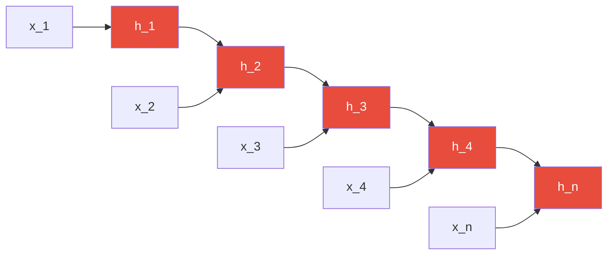
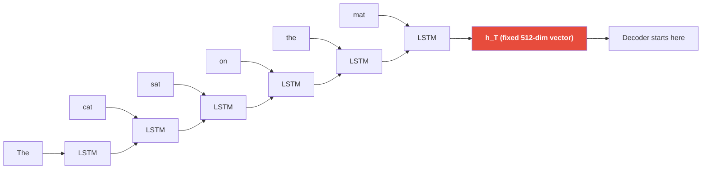
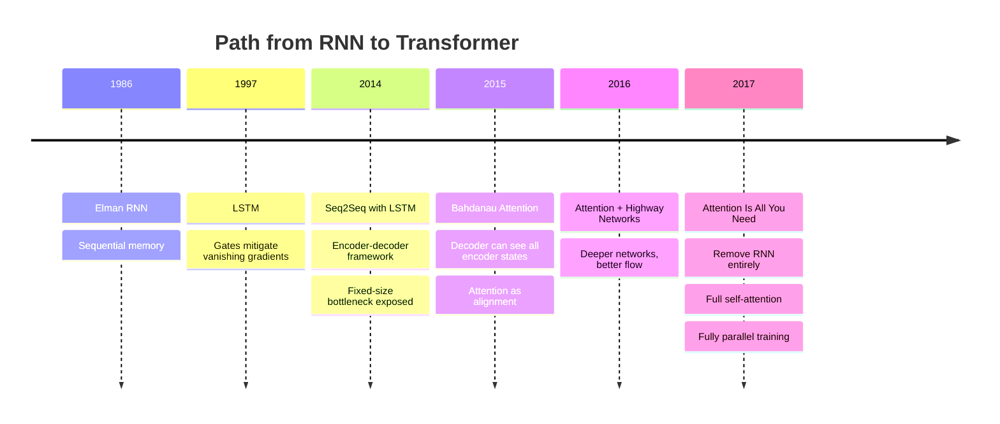

# Why RNNs Failed at Scale

Understanding the failure modes of recurrent neural networks is not academic history — it is the prerequisite for understanding *why* every design decision in the Transformer architecture exists. Each Transformer feature is a direct answer to an RNN failure mode.

---

## Table of Contents

1. [What RNNs Promised](#what-rnns-promised)
2. [Sequential Computation Bottleneck](#sequential-computation-bottleneck)
3. [Vanishing and Exploding Gradients](#vanishing-and-exploding-gradients)
4. [The Fixed-Size Hidden State Bottleneck](#the-fixed-size-hidden-state-bottleneck)
5. [The Forgetting Problem](#the-forgetting-problem)
6. [Long-Range Dependency Failures](#long-range-dependency-failures)
7. [LSTMs and GRUs: Incremental Fixes, Not Solutions](#lstms-and-grus-incremental-fixes-not-solutions)
8. [Computational Complexity](#computational-complexity)
9. [Benchmark Failures at Scale](#benchmark-failures-at-scale)
10. [What Was Actually Needed](#what-was-actually-needed)
11. [Transition to Attention](#transition-to-attention)
12. [Interview Questions](#interview-questions)

---

## What RNNs Promised

Recurrent Neural Networks were the dominant architecture for sequence modeling from the mid-1980s through 2017. The core idea was elegant: maintain a hidden state `h_t` that summarizes all information seen up to time step `t`.

```
h_t = tanh(W_h * h_{t-1} + W_x * x_t + b)
y_t = W_y * h_t + b_y
```

The promise: an arbitrarily long sequence compressed into a fixed-size vector that the model could use to make predictions. The hidden state was the model's "memory."

This worked reasonably well for:
- Short sequences (sentiment on brief sentences)
- Simple pattern recognition (POS tagging)
- Character-level generation of short spans

It catastrophically failed for:
- Long document understanding
- Machine translation of complex sentences
- Anything requiring long-range dependencies

---

## Sequential Computation Bottleneck

### The Core Problem

An RNN must process tokens **one at a time**, left to right. To compute `h_t`, you need `h_{t-1}`. To compute `h_{t-1}`, you need `h_{t-2}`. The dependency chain is strict and sequential.



**You cannot compute `h_3` until `h_2` is done. You cannot compute `h_2` until `h_1` is done.** This is a hard sequential dependency that blocks parallelism.

### Why This Kills Training Speed

Modern hardware (GPUs, TPUs) achieves its speed through **massive parallelism**. A GPU can perform thousands of floating-point operations simultaneously. But if your computation graph has a chain of sequential dependencies of length `n`, you can only use `O(1)` parallelism regardless of how many GPU cores you have.

For a sequence of length `n = 512`:
- **RNN**: 512 sequential time steps, each waiting for the previous
- **Transformer**: All positions computed in parallel in a single matrix multiplication

In practice (circa 2017–2018), a Transformer trained on the same data could converge **10x faster** than an LSTM because of this parallelism advantage.

### Wall-Clock Training Time Comparison

For machine translation (WMT 2014 En-De):

| Model | Architecture | Training Time | BLEU |
|-------|-------------|---------------|------|
| ByteNet | Dilated CNN | ~3 days | 23.7 |
| GNMT | Bidirectional LSTM | ~7 days (4 GPUs) | 26.3 |
| Transformer (base) | Self-attention | ~12 hours (8 GPUs) | 27.3 |
| Transformer (big) | Self-attention | ~3.5 days (8 GPUs) | 28.4 |

The Transformer base model *outperforms* all RNN models while training *faster*. This is the signature of a fundamental architectural improvement, not just a parameter-count advantage.

---

## Vanishing and Exploding Gradients

### The Mathematics of Gradient Flow

During backpropagation through time (BPTT), gradients must flow backward through every time step. At each step, the gradient is multiplied by the Jacobian of the recurrent transformation.

For a simple RNN:

```
h_t = tanh(W_h * h_{t-1} + W_x * x_t)
```

The gradient with respect to a parameter at time step `k`, when computing loss at step `T`, involves the product:

```
∂L/∂h_k = (∂L/∂h_T) * Π_{t=k+1}^{T} (∂h_t/∂h_{t-1})
```

Each term in the product is:

```
∂h_t/∂h_{t-1} = W_h^T * diag(1 - tanh²(W_h * h_{t-1} + W_x * x_t))
```

The Jacobian `∂h_t/∂h_{t-1}` has eigenvalues that, when repeatedly multiplied:

- **If |λ| < 1**: Product → 0 exponentially. **Vanishing gradient.**
- **If |λ| > 1**: Product → ∞ exponentially. **Exploding gradient.**

For a sequence of length `n = 100`, you are taking a product of 100 matrices. Unless those matrices have singular values exactly equal to 1 (which they don't in practice), the gradient either vanishes or explodes.

### Vanishing Gradient Consequences

When gradients vanish:
- Parameters early in the sequence receive **near-zero gradient updates**
- The model cannot learn long-range dependencies
- Effectively, the model only "sees" the last few tokens during training
- Information from 50+ steps ago becomes invisible to the optimizer

### Exploding Gradient "Fix"

Exploding gradients can be stabilized with **gradient clipping** — scaling the gradient when its norm exceeds a threshold:

```python
torch.nn.utils.clip_grad_norm_(model.parameters(), max_norm=1.0)
```

This is a band-aid, not a cure. It prevents NaN weights but does not help gradients flow backward through long sequences.

### Vanishing Gradient: No Fix

There is no equivalent fix for vanishing gradients in plain RNNs. The tanh activation saturates, and the weight matrix eigenvalue issue is structural. LSTMs attempted to address this, but the fundamental problem remained.

---

## The Fixed-Size Hidden State Bottleneck

### Information Bottleneck

The encoder in an RNN seq2seq model must compress an entire input sequence into a **single fixed-size vector** `h_T` — the final hidden state. This vector is then used to initialize the decoder.



For a sentence like "The cat sat on the mat," a 512-dimensional vector is probably sufficient. But consider:

- A 500-word legal document
- A multi-paragraph technical explanation
- A long conversation history

Compressing 500 words of semantic content into a 512-dimensional vector is a fundamentally lossy operation. Regardless of the network's capacity, the information bottleneck is a structural constraint. Information about early tokens is overwritten as later tokens are processed.

### The Sentence Length vs. BLEU Score Collapse

In the original seq2seq paper (Sutskever et al., 2014), the authors noted a dramatic performance degradation on long sentences:

| Sentence Length | BLEU Score |
|----------------|-----------|
| 1–10 tokens | ~30+ |
| 11–20 tokens | ~27 |
| 21–30 tokens | ~24 |
| 31–40 tokens | ~20 |
| 40+ tokens | ~15 |

This is the information bottleneck in action. The longer the sentence, the more information that needs to fit in the fixed-size vector, and the more it degrades.

This is exactly the problem that **Bahdanau attention** was designed to solve in 2015 — allowing the decoder to look back at all encoder hidden states, not just the final one.

---

## The Forgetting Problem

### Even With LSTM/GRU, Information Decays

LSTM (Long Short-Term Memory) introduced a cell state with explicit gates:

```
f_t = σ(W_f · [h_{t-1}, x_t] + b_f)    # Forget gate
i_t = σ(W_i · [h_{t-1}, x_t] + b_i)    # Input gate
C̃_t = tanh(W_C · [h_{t-1}, x_t] + b_C) # Candidate cell
C_t = f_t * C_{t-1} + i_t * C̃_t        # Cell state update
o_t = σ(W_o · [h_{t-1}, x_t] + b_o)    # Output gate
h_t = o_t * tanh(C_t)                   # Hidden state
```

The cell state `C_t` provides a gradient highway. In theory, the forget gate `f_t` can be set near 1 (never forget) or near 0 (always forget). This helps.

But in practice:
- The forget gate is a function of the current input and hidden state — it can't know at step `t` what from 200 steps ago will matter at step `t + 300`
- Information must still travel through a chain of gates to survive
- Each gate multiplication is a lossy operation over very long distances
- For sequences of 500+ tokens, LSTMs still catastrophically forget

### Empirical Evidence of Forgetting

The "distant dependency" test: given a sentence where the correct prediction depends on a token 100+ positions earlier:

```
"The key to the cabinets [100 words of filler] are on the table."
```

Correct: "are" (plural subject "keys")
LSTM prediction: "is" (last seen entity near "table" is singular)

LSTMs trained at scale showed consistent failures on this type of coreference and agreement across long distances.

---

## Long-Range Dependency Failures

### The Garden Path Sentence Problem

```
"The horse raced past the barn fell."
```

Humans eventually parse this correctly (the horse that was raced past the barn fell). LSTMs consistently fail at the resolution step because they have already "forgotten" the subject by the time they reach the verb.

### Coreference Resolution Across Paragraphs

```
"Maria told Jane that she was going to win. Jane replied that she was wrong.
Maria laughed. She had been right about her friend all along."
```

Who does "she" refer to in each sentence? Humans track this through the entire passage. LSTMs lose this information across paragraph boundaries. The hidden state simply does not have enough capacity to maintain pronoun-entity bindings across hundreds of tokens.

### Long-Document QA Failures

On early long-document reading comprehension benchmarks (WikiReading, TriviaQA):

- Questions requiring the answer from the **first paragraph** when the question was asked at the **end** showed 40–60% accuracy drop with LSTMs vs. transformers
- The LSTM had effectively written over the first-paragraph information

### Subject-Verb Agreement at Distance

```
"The number of cars in the parking lots outside the stadium [that we visited last summer] are..."
```

Correct verb: "is" (subject is "number," singular)
LSTM bias: "are" (last noun before verb is "summer," but more critically the model loses track of the head noun)

LSTMs show ~85% accuracy at distance 1, dropping to ~60% at distance 10+. Transformers show ~95%+ at all distances because they can attend directly to the subject token.

---

## LSTMs and GRUs: Incremental Improvements, Not Solutions

### What LSTMs Fixed

| Problem | Plain RNN | LSTM |
|---------|-----------|------|
| Vanishing gradients | Severe | Mitigated (not eliminated) |
| Short-term memory | Poor | Good |
| Medium-range (10–50 tokens) | Poor | Acceptable |
| Long-range (100+ tokens) | Fails | Still struggles |
| Training stability | Poor | Better |
| Parallelism | None | None |
| Fixed-size hidden state | Yes | Yes (still a bottleneck) |

### Why LSTMs Are Not a Fundamental Fix

LSTMs are an engineering improvement on the same flawed paradigm. The fundamental constraints remain:

1. **Still sequential**: `C_t` and `h_t` still depend on `C_{t-1}` and `h_{t-1}`. No parallelism.
2. **Still a fixed bottleneck**: The hidden state and cell state are fixed-dimensional. Compressing a 1000-token document into 512 dimensions is still lossy.
3. **Still multiplicative gradient decay**: The forget gate `f_t` multiplied repeatedly still causes exponential decay of gradients from distant time steps.
4. **Gates require training to converge**: The forget gate must learn to open and close correctly, which requires observing many examples, which requires gradients to flow — circular dependency.

### GRU: Simpler But Same Problems

GRU (Gated Recurrent Unit, Cho et al. 2014) simplifies LSTM by merging the forget/input gates:

```
z_t = σ(W_z · [h_{t-1}, x_t])       # Update gate
r_t = σ(W_r · [h_{t-1}, x_t])       # Reset gate
h̃_t = tanh(W · [r_t * h_{t-1}, x_t]) # Candidate
h_t = (1 - z_t) * h_{t-1} + z_t * h̃_t
```

GRU has fewer parameters and trains faster, but suffers the **same fundamental limitations**: sequential computation, fixed-size state, and gradient decay at long ranges.

### The Bidirectional "Fix"

Bidirectional RNNs process the sequence in both directions, concatenating forward and backward hidden states. This helps for understanding tasks (both past and future context available). But:
- Inference is no longer autoregressive for generation
- Training is still sequential (two passes, not one parallel one)
- The bottleneck of not accessing all context directly remains
- Double the compute, but not double the quality

---

## Computational Complexity

### RNN Time Complexity

For a sequence of length `n` with hidden size `d`:

| Operation | Complexity | Parallelizable? |
|-----------|-----------|----------------|
| Sequential steps | O(n) | No |
| Work per step | O(d²) | Yes (within a step) |
| Total compute | O(n · d²) | Only within each step |
| Total wall-clock time | O(n) steps minimum | Hard sequential limit |
| Gradient flow path length | O(n) | No |

**The key constraint**: minimum `O(n)` sequential operations regardless of hardware.

### Transformer Time Complexity (Preview)

For comparison, a Transformer's self-attention:

| Operation | Complexity | Parallelizable? |
|-----------|-----------|----------------|
| Attention computation | O(n² · d) | Yes (fully) |
| Sequential operations | O(1) | N/A |
| Gradient flow path | O(1) | N/A |
| Parallelism over sequence | Full | Yes |

The Transformer's O(n²) memory cost is a real problem for very long sequences, but its **O(1) sequential steps** mean it can fully exploit parallel hardware, making it dramatically faster in practice.

---

## Benchmark Failures at Scale

### Machine Translation

On WMT English-German (2016 state of the art):

| Model | BLEU | Params | Training |
|-------|------|--------|----------|
| Deep LSTM (Sutskever 2014) | 24.1 | ~380M | Weeks |
| GNMT (Wu et al. 2016) | 26.3 | ~380M | Days/weeks |
| ConvS2S (Gehring 2017) | 26.4 | ~268M | Days |
| Transformer Base (Vaswani 2017) | 27.3 | 65M | 12 hours |
| Transformer Big (Vaswani 2017) | 28.4 | 213M | 3.5 days |

The Transformer **base** model outperforms GNMT with 6x fewer parameters and 10x less training time.

### Language Modeling

On Penn Treebank (word-level perplexity, lower is better):

| Model | Perplexity |
|-------|-----------|
| LSTM (Zaremba 2014) | 78.4 |
| Zoneout LSTM | 77.4 |
| AWD-LSTM (Merity 2017) | 58.8 |
| Transformer-XL | 54.5 |

And on WikiText-103 (much larger, exposes long-range failure more clearly):

| Model | Perplexity |
|-------|-----------|
| LSTM | ~48 |
| Transformer-XL | 18.3 |

The gap widens dramatically on longer documents — exactly where long-range dependencies matter most.

### Reading Comprehension

On QuALITY (long document QA, 5000+ token documents):

- BiDAF (BiLSTM-based): ~40% accuracy
- Longformer (sparse attention Transformer): ~55% accuracy
- GPT-4 (dense attention, RLHF): ~85%+ accuracy

The performance gap is not about model capacity — it is about the architectural ability to relate distant tokens.

---

## What Was Actually Needed

The failures of RNNs point to exactly four requirements that a better architecture must satisfy:

### 1. Full Context Access Without Degradation

Every output token must be able to **directly attend** to every input token, with no distance penalty. The path length between any two positions must be O(1), not O(n).

### 2. Full Parallelism During Training

The computation of different positions must be independent (at training time) so that modern hardware can be fully utilized. No sequential dependency chains.

### 3. No Fixed-Size Bottleneck

The context must not be compressed into a fixed-size vector. All input representations must remain accessible at full resolution.

### 4. Gradient Flow With Constant Path Length

Gradients must flow with constant path length from any output to any input. This eliminates the vanishing gradient problem for long-range dependencies.

The Transformer satisfies **all four requirements**:

| Requirement | RNN | LSTM | Transformer |
|-------------|-----|------|-------------|
| Direct token-to-token access | No | No | Yes (attention) |
| Training parallelism | No | No | Yes |
| No fixed bottleneck | No | No | Yes (all positions available) |
| O(1) gradient path | No | No | Yes |

---

## Transition to Attention

### Bahdanau Attention (2015): The Bridge

Before the full Transformer, Bahdanau et al. (2015) added attention to the seq2seq LSTM as a "decoder side" module. The decoder could query all encoder hidden states at each decoding step:

```
e_{t,s} = v^T · tanh(W_d · h_t^dec + W_e · h_s^enc)
α_{t,s} = softmax(e_{t,s})
c_t = Σ_s α_{t,s} · h_s^enc
```

This was transformative for machine translation. By allowing the decoder to look at **all encoder states** (not just the last one), it:
- Solved the fixed-size bottleneck for decoding
- Let the model align source and target words
- Improved BLEU by 2–3 points on long sentences

But it still had LSTMs generating the encoder states. Training was still sequential.

### "Attention Is All You Need" (2017): Remove the RNN Entirely

Vaswani et al.'s insight: if attention alone can relate any two positions, why keep the RNN at all? Remove it. Use **only self-attention and feed-forward layers**. The result is the Transformer — a fully parallel architecture where every position can attend to every other position in a single layer.



---

## Interview Questions

### Q1: "Why did RNNs fail for machine translation?"

**Strong answer**: RNNs fail for machine translation due to three compounding problems. First, the encoder must compress the entire source sentence into a fixed-size hidden state vector, creating an information bottleneck that degrades severely as sentence length grows. Second, vanishing gradients prevent the decoder from receiving useful gradient signal about early source tokens — it effectively can't learn long-range alignments between source and target words. Third, training is sequential, meaning you cannot parallelize across positions, making it prohibitively slow to train on the large datasets that good translation requires. The attention mechanism (Bahdanau 2015) solved the bottleneck by allowing the decoder to look at all encoder states, and the Transformer (Vaswani 2017) then eliminated the RNN entirely, making training fully parallel.

---

### Q2: "What fundamental limitations did LSTMs not solve?"

**Strong answer**: LSTMs solved the vanishing gradient problem for short-to-medium sequences by introducing gated cell states that provide a gradient highway. But three fundamental problems remained. First, computation is still sequential — the LSTM still requires `O(n)` sequential steps to process a sequence of length `n`, which blocks GPU parallelism. Second, even the LSTM cell state is a fixed-size vector that must compress all past context, creating an information bottleneck at very long sequences. Third, gradients still must flow through a chain of gate multiplications over long distances — the forget gate `f_t` appears repeatedly in the gradient computation, and if it is consistently less than 1 (which it often is), gradients still decay exponentially over hundreds of steps. LSTMs are a significant engineering improvement over plain RNNs but operate within the same sequential paradigm.

---

### Q3: "Why can't we just make the hidden state bigger?"

**Strong answer**: This is a common intuition but it doesn't work. Making the hidden state bigger (say 4096 dimensions instead of 512) increases the model's capacity within a single time step, but it doesn't fix the structural problems. The gradient path length is still `O(n)`. Training is still sequential. The fundamental question is not "how much can I store in the hidden state" but "can I relate token i directly to token j without degradation" — and no matter the size of the hidden state, an RNN still requires information to flow through `i-j` intermediate steps to do so. Additionally, larger hidden states increase the `O(d²)` compute per step, making the already-slow sequential processing even more expensive.

---

### Q4: "How did the attention mechanism in Bahdanau 2015 differ from the Transformer?"

**Strong answer**: Bahdanau attention was a module attached to an LSTM seq2seq model — specifically, it let the decoder at each time step query all encoder hidden states and compute a weighted sum. The encoder was still an LSTM (sequential, vanishing gradients), and the decoder was still an LSTM (sequential generation). The attention mechanism only operated on the decoder side and only allowed cross-attention between decoder states and encoder states. It did not enable self-attention (a token attending to other tokens in the same sequence), and it did not remove the sequential computation bottleneck. The Transformer replaced the LSTM entirely with self-attention layers, making the encoder fully parallel and enabling both self-attention (within a sequence) and cross-attention (between encoder and decoder). It's the difference between using attention as an add-on to an RNN vs. using attention as the primary computation primitive.

---

### Q5: "What is BPTT and why is it problematic?"

**Strong answer**: BPTT (Backpropagation Through Time) is the algorithm used to train RNNs. Because an RNN's computation graph is a chain of operations unrolled over time, you backpropagate through every time step from the loss at `t=T` all the way back to `t=1`. The problem is that gradients are multiplied by the Jacobian `∂h_t/∂h_{t-1}` at each step. If the eigenvalues of this Jacobian are consistently less than 1 in magnitude, the gradient product approaches zero exponentially — vanishing. If they exceed 1, the product approaches infinity — exploding. For a sequence of length 100, you're taking a product of 100 Jacobians, which is almost guaranteed to either vanish or explode. Truncated BPTT (only backpropagating through the last `k` steps) is a practical fix that prevents vanishing gradients, but at the cost of not learning dependencies longer than `k` steps.

---

*Next: [Attention Mechanism Deep Dive](./attention_mechanism_deep_dive.md) — the solution to all these problems.*
