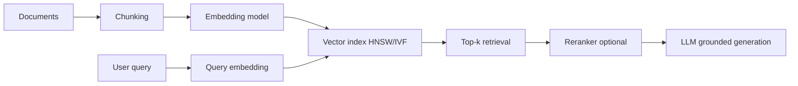

# Word Embeddings and Vector Representations (Interview Deep-Dive)

## 1. Classical embeddings

### Bag of Words vs TF-IDF
- BoW: sparse count vector, no semantics, orderless.
- TF-IDF: downweights frequent terms and upweights discriminative terms.

`tfidf(t,d) = tf(t,d) * log(N / df(t))`

### Word2Vec
Two objectives:
- CBOW: predict center word from context.
- Skip-gram: predict context words from center word.

#### Skip-gram with negative sampling
For center word `w` and context `c`:
`log sigma(v_c^T v_w) + Σ_{neg} log sigma(-v_neg^T v_w)`

Why negative sampling: full softmax over huge vocab is expensive.

#### Subsampling frequent words
Downsample stopwords to improve semantic quality and speed.

### GloVe
Uses global co-occurrence counts `X_ij`.
Optimizes weighted least-squares so dot products approximate log co-occurrence.

### FastText
Represents words as sum of character n-gram embeddings.
Handles OOV and morphology better.

### Static embedding limitations
- One vector per word regardless of context.
- Fails polysemy: "bank" (river vs finance).

## 2. Contextual embeddings

### Why static failed
Meaning depends on context; static vectors cannot condition on sentence semantics.

### ELMo
BiLSTM language model; context-aware token vectors from internal states.

### BERT embeddings
Contextual token representations from transformer layers.
- Early layers: syntax.
- Middle layers: semantic composition.
- Late layers: task-specialized pretraining signals.

### Sentence Transformers (SBERT)
BERT alone poorly suited for sentence similarity due to anisotropy.
SBERT uses siamese training with contrastive/triplet/cosine objectives for semantically aligned sentence space.

### Pooling strategies
- CLS pooling: easy, often weaker for retrieval.
- Mean pooling: strong default.
- Max pooling: sparse signal emphasis.
- Weighted pooling (attention or IDF-weighted).

### Cross-encoder vs bi-encoder
- Cross-encoder: joint encoding(query, doc), high quality reranking, expensive O(n) per candidate.
- Bi-encoder: independent embeddings, ANN-friendly retrieval, lower precision than cross-encoder.

## 3. Modern embedding model families
- General text: `text-embedding-3-large/small` style APIs.
- Instruction-tuned: E5/BGE/GTE require task prefixing for best quality.
- Multilingual: multilingual-e5, LaBSE.
- Domain-specific: finance, legal, biomedical, logistics vocabulary adaptation.
- Code embeddings: CodeBERT, UniXcoder.

## 4. Embeddings for RAG



### Chunking strategies
- Fixed-size with overlap.
- Structure-aware by headers/sections.
- Parent-child chunking.

### Dimensionality tradeoffs
- Higher dims: richer representation, more memory and slower ANN.
- Lower dims: cheaper, may reduce recall.
- Matryoshka/truncatable embeddings can support dynamic tradeoff.

### Similarity metrics
- Cosine similarity: angle, scale-invariant.
- Dot product: magnitude-sensitive unless normalized.
- L2: geometric distance.

Why cosine can fail:
- Hubness in high dimensions.
- Anisotropy causing crowded angular space.

### ANN fundamentals
- Exact search is O(Nd) and expensive at scale.
- HNSW: graph traversal, high recall/low latency tradeoff.
- IVF: cluster then probe limited cells.
- PQ: compress vectors for memory savings.

### Index choices
- HNSW: strong recall, higher memory.
- IVF-PQ: lower memory, tuning-sensitive recall.

### Retrieval evaluation metrics
- Recall@k
- MRR
- NDCG
- domain task accuracy with retrieved context

### Common failure modes
- Semantic mismatch between query and documents.
- Overly coarse chunks losing detail.
- Multilingual query/doc mismatch.
- Embedding drift after model upgrade.

## 5. Practical engineering concerns

### Batching embeddings
Batch API/model calls for throughput and cost efficiency.

### Caching
- Chunk embedding cache by document hash.
- Query semantic cache for repeated intents.

### Embedding drift
If model changes, old/new vectors may be incompatible.
Plan re-embedding and gradual index migration.

### Updating embeddings in production
- Delta ingestion for changed docs.
- Full re-index on major model switch.
- Dual-read and A/B retrieval quality validation.

### Cost optimization
- Smaller local embedding model for high-volume ingestion.
- Larger model for critical collections.
- Reduce chunk count via structure-aware splitting.

## 6. Interview questions and strong answers
1. **When fine-tune embeddings vs off-the-shelf?**
   - Fine-tune when domain vocabulary/intent mismatch causes low retrieval recall and you have quality labeled pairs.
2. **Why might cosine fail?**
   - Hubness/aniso + normalization issues; hybrid retrieval and reranking mitigate.
3. **How evaluate embedding model?**
   - Offline retrieval benchmark (Recall@k/MRR/NDCG), then end-to-end answer quality and business KPI.
4. **What breaks in multilingual retrieval?**
   - Domain terminology translation gaps, script/tokenization issues, mixed-language corpora imbalance.

## 7. Hands-on examples

### Sentence-transformers similarity
```python
from sentence_transformers import SentenceTransformer, util

model = SentenceTransformer('sentence-transformers/all-mpnet-base-v2')
texts = [
    'Package delayed at customs in Frankfurt',
    'Shipment held by customs at FRA hub',
    'How to reset my account password?'
]
emb = model.encode(texts, normalize_embeddings=True)
print(util.cos_sim(emb[0], emb[1]).item())
print(util.cos_sim(emb[0], emb[2]).item())
```

### FAISS index build/search
```python
import faiss
import numpy as np

vecs = np.array(emb, dtype='float32')
index = faiss.IndexFlatIP(vecs.shape[1])  # cosine if vectors normalized
index.add(vecs)
q = vecs[0:1]
scores, ids = index.search(q, k=2)
print(ids, scores)
```

### Hugging Face embedding model usage
```python
from transformers import AutoTokenizer, AutoModel
import torch

tok = AutoTokenizer.from_pretrained('intfloat/e5-base-v2')
mdl = AutoModel.from_pretrained('intfloat/e5-base-v2')

sentences = ['query: where is my parcel?', 'passage: track shipment status in support portal']
inputs = tok(sentences, return_tensors='pt', padding=True, truncation=True)
with torch.no_grad():
    out = mdl(**inputs).last_hidden_state
emb = out.mean(dim=1)
emb = torch.nn.functional.normalize(emb, p=2, dim=1)
print(emb.shape)
```

### Fine-tuning sketch (sentence-transformers)
```python
from sentence_transformers import SentenceTransformer, InputExample, losses
from torch.utils.data import DataLoader

model = SentenceTransformer('sentence-transformers/all-MiniLM-L6-v2')
train_examples = [
    InputExample(texts=['query: shipment delayed', 'passage: parcel delay due to weather'], label=1.0),
    InputExample(texts=['query: shipment delayed', 'passage: how to change password'], label=0.0)
]
loader = DataLoader(train_examples, batch_size=16, shuffle=True)
train_loss = losses.CosineSimilarityLoss(model)
# model.fit(train_objectives=[(loader, train_loss)], epochs=1)
```

## 8. Enterprise retrieval design checklist
- Choose embedding model by language/domain + latency budget.
- Define chunk strategy and metadata schema.
- Select ANN index with measurable recall targets.
- Add reranking for top candidate refinement.
- Monitor retrieval drift and index freshness.

## 9. Logistics-focused example
Use case: internal knowledge assistant for customs SOP.
- multilingual queries
- long policy docs with structured sections
- hybrid retrieval + cross-encoder reranking
- mandatory citations in response

## 10. Summary map
Static -> contextual -> sentence-level -> retrieval-optimized embeddings represents the practical evolution for interview and production use.
