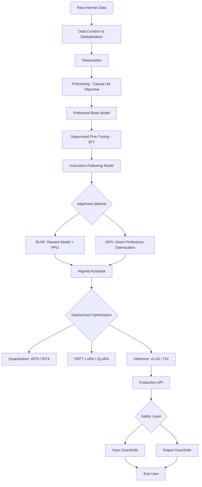

# 04 - Large Language Models

This section covers the full lifecycle of modern large language models (LLMs), from pretraining through alignment, deployment optimization, and production safety. The content is written at senior ML engineer / research scientist interview depth, with mathematical derivations, systems-level tradeoffs, and production engineering patterns.

---

## Why This Section Matters

LLMs have become the dominant paradigm in NLP and are increasingly central to all of ML engineering. Senior interviews at companies like Google DeepMind, OpenAI, Anthropic, Meta AI, Mistral, Cohere, and AI-native product companies routinely include:

- Deep architectural questions about transformers and attention
- Systems questions about training infrastructure at scale
- Alignment questions about RLHF, DPO, and safety
- Deployment questions about inference optimization, quantization, and cost
- Applied questions about RAG, fine-tuning strategy, and evaluation

Understanding LLMs at this depth separates candidates who have used the APIs from those who can build, fine-tune, and deploy them responsibly.

---

## Key Themes

### 1. Scaling
Scale is the central organizing principle of the LLM era. Understanding how performance scales with parameters, data, and compute — and the practical limits of scaling — is foundational.

**Key question:** What does it mean to train compute-optimally?

### 2. Alignment
Raw pretrained models are not the same as aligned assistants. The pipeline from pretraining to a usable product involves SFT, reward modeling, and preference optimization (RLHF or DPO). Understanding this pipeline is critical for any role working with LLMs.

**Key question:** Why is RLHF needed, and what problem does DPO solve?

### 3. Deployment Efficiency
Running LLMs in production at scale is a systems engineering challenge. Techniques like quantization, continuous batching, speculative decoding, and PagedAttention determine the economics of your AI product.

**Key question:** How do you serve a 70B model to 10,000 concurrent users?

---

## Recommended Study Order

Study these files in order. Each builds on the previous.

| # | File | Core Topic | Difficulty |
|---|------|-----------|------------|
| 1 | [llm_training_pipeline.md](./llm_training_pipeline.md) | Pretraining, SFT, RLHF, DPO | High |
| 2 | [scaling_laws.md](./scaling_laws.md) | Kaplan, Chinchilla, emergent abilities | High |
| 3 | [context_windows.md](./context_windows.md) | KV cache, long-context extensions | Medium |
| 4 | [hallucinations_and_reliability.md](./hallucinations_and_reliability.md) | Failure modes, detection, mitigation | Medium |
| 5 | [prompt_engineering_deep_dive.md](./prompt_engineering_deep_dive.md) | CoT, ReAct, DSPy, production patterns | Medium |
| 6 | [llm_evaluation.md](./llm_evaluation.md) | Benchmarks, LLM-as-judge, custom evals | Medium |
| 7 | [fine_tuning/full_finetune_vs_peft.md](./fine_tuning/full_finetune_vs_peft.md) | LoRA, QLoRA, adapter methods | High |
| 8 | [quantization.md](./quantization.md) | GPTQ, AWQ, GGUF, bitsandbytes | High |
| 9 | [inference_optimization.md](./inference_optimization.md) | vLLM, continuous batching, Flash Attention | High |
| 10 | [safety_and_guardrails.md](./safety_and_guardrails.md) | Jailbreaks, Constitutional AI, production safety | Medium |

---

## Prerequisite Knowledge

Before diving into this section, ensure you are solid on:

- **Transformer architecture**: attention mechanism, positional encoding, feed-forward layers, layer norm — covered in `03_Transformers_and_Attention/`
- **Optimization**: SGD, Adam, learning rate schedules, gradient clipping — covered in `02_Training_and_Optimization/`
- **Python and PyTorch**: you should be able to write and read training loops, implement custom layers, and debug CUDA errors

---

## How the LLM Stack Fits Together



---

## High-Priority Interview Topics by Role

### ML Research Scientist
- Scaling laws (Chinchilla, emergent abilities)
- RLHF and DPO derivations
- Attention complexity and long-context extensions
- Hallucination root causes and calibration

### ML Engineer / LLM Engineer
- Fine-tuning strategy: full FT vs LoRA vs QLoRA
- Inference optimization: vLLM, continuous batching, speculative decoding
- Quantization: GPTQ vs AWQ vs GGUF
- Evaluation pipeline design

### Applied AI / Solutions Engineer
- Prompt engineering patterns (CoT, ReAct, self-consistency)
- RAG vs fine-tuning decision framework
- Production evaluation and monitoring
- Safety and guardrails for enterprise applications

### AI Safety / Alignment Researcher
- RLHF reward hacking
- Constitutional AI
- Red teaming methods
- Calibration and uncertainty

---

## Key Papers to Know

| Paper | Year | Contribution |
|-------|------|-------------|
| Attention is All You Need (Vaswani et al.) | 2017 | Transformer architecture |
| GPT-3 (Brown et al.) | 2020 | Few-shot learning via scale |
| Scaling Laws (Kaplan et al.) | 2020 | Power-law scaling of loss |
| InstructGPT (Ouyang et al.) | 2022 | RLHF for alignment |
| Chinchilla (Hoffmann et al.) | 2022 | Compute-optimal training |
| LoRA (Hu et al.) | 2022 | Low-rank adaptation |
| Flash Attention (Dao et al.) | 2022 | Memory-efficient attention |
| LLaMA (Touvron et al.) | 2023 | Open, inference-optimized models |
| DPO (Rafailov et al.) | 2023 | Preference optimization without RL |
| QLoRA (Dettmers et al.) | 2023 | 4-bit fine-tuning |
| Mamba (Gu & Dao) | 2023 | State space model alternative |
| LLaMA 3 (Meta) | 2024 | Scaling with quality data |
| DeepSeek-R1 | 2025 | RL-based reasoning without SFT |

---

## Conceptual Map: What Connects What

```
PRETRAINING
    |-- determines base capabilities
    |-- scaling laws predict quality
    |-- data quality > data quantity (beyond a point)

FINE-TUNING
    |-- SFT: teaches format and instruction following
    |-- RLHF/DPO: teaches values and preferences
    |-- LoRA: makes fine-tuning memory efficient

INFERENCE
    |-- KV cache: makes generation fast but memory expensive
    |-- Quantization: reduces memory footprint
    |-- Continuous batching: maximizes GPU utilization
    |-- Speculative decoding: reduces latency

EVALUATION
    |-- Benchmarks: standardized capability measurement
    |-- LLM-as-judge: scalable quality evaluation
    |-- Custom evals: domain-specific quality gates

SAFETY
    |-- Guardrails: prevent harmful outputs
    |-- Red teaming: find failure modes before users do
    |-- Monitoring: catch problems in production
```

---

## Quick Reference: Critical Numbers to Know

| Fact | Value |
|------|-------|
| Chinchilla optimal ratio | ~20 tokens per parameter |
| GPT-3 parameters | 175B |
| GPT-3 training tokens | 300B (undertrained per Chinchilla) |
| LLaMA 3 70B training tokens | ~15T tokens |
| Typical LoRA rank | 4–64 |
| BF16 memory per parameter | 2 bytes |
| INT4 memory per parameter | 0.5 bytes |
| Attention complexity | O(n²) in sequence length |
| GPT-4 context window | 128k tokens |
| Claude 3.5 context window | 200k tokens |
| Gemini 1.5 Pro context window | 1M tokens |

---

## Using This Section for Interview Prep

1. **Read each file end-to-end once** to build a complete mental model
2. **Practice the interview questions** at the end of each file — say your answers out loud
3. **Draw the diagrams from memory** — if you can sketch the RLHF pipeline on a whiteboard, you know it
4. **Run the code examples** in a Colab notebook to build hands-on intuition
5. **Revisit scaling laws and fine-tuning** — these appear in nearly every senior LLM interview

Good luck. The goal is not memorization but genuine deep understanding.
