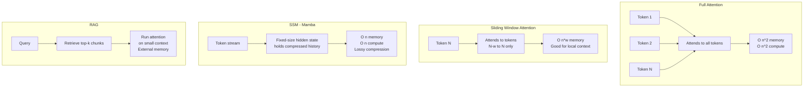

# Context Windows, KV Cache, and Long-Context Extensions

The context window is the fundamental constraint on what an LLM can "see" and "think about" at any given time. Understanding its mechanics, limitations, and extension strategies is essential for both system design and senior-level interviews.

---

## What Is a Context Window?

The **context window** (also called context length or sequence length) is the maximum number of tokens an LLM can process in a single forward pass. It defines:

- How much text the model can "read" when generating a response
- How long a conversation history can be maintained
- How long a document can be analyzed in one shot
- The length of structured output the model can plan ahead for

**Practical context window sizes (as of 2025):**

| Model | Context Window | Notes |
|-------|---------------|-------|
| GPT-3.5 (original) | 4,096 tokens | ~3,000 words |
| GPT-4 | 8,192 / 128,000 tokens | GPT-4-128k variant |
| GPT-4o | 128,000 tokens | Multimodal |
| Claude 3.5 Sonnet | 200,000 tokens | ~150,000 words |
| Gemini 1.5 Pro | 1,000,000 tokens | 1M context |
| Gemini 1.5 Flash | 1,000,000 tokens | Faster, cheaper |
| LLaMA 3 70B | 8,192 tokens | Base; extended with RoPE scaling |
| Mistral 7B | 32,768 tokens | Sliding window attention |
| Qwen2 72B | 131,072 tokens | |

A token is approximately 0.75 words in English. 128k tokens ≈ 100,000 words ≈ a medium-length novel.

---

## Part 1: Why Context Length Is Hard — Memory Requirements

### Attention Is O(n²)

Standard transformer self-attention has quadratic time and memory complexity in sequence length:

$$\text{Attention}(Q, K, V) = \text{softmax}\left(\frac{QK^T}{\sqrt{d_k}}\right) V$$

The $QK^T$ product has shape $(n, n)$ where $n$ is sequence length. For $n = 128,000$ tokens:

$$128,000^2 = 1.6384 \times 10^{10} \text{ elements}$$

At FP16 (2 bytes each), the attention matrix alone would require ~32 GB. For a model with 32 attention heads, this becomes infeasible without tricks.

**FlashAttention** (Dao et al., 2022) solves this by tiling the computation to avoid materializing the full matrix — see `inference_optimization.md`.

### The KV Cache: Memory Cost of Generation

During autoregressive generation (inference), the model generates tokens one at a time. At each step $t$, the model computes attention over all previous tokens $1, \ldots, t-1$.

**Without KV cache:** Recompute all key and value projections from scratch at every step. Cost: $O(n^2)$ per token, $O(n^3)$ total.

**With KV cache:** Cache the key ($K$) and value ($V$) matrices from all previous tokens. At step $t$, only compute $K_t$, $V_t$ for the new token, then append to cache and attend over all cached $K$, $V$.

**KV cache memory formula:**

$$\text{KV cache size} = 2 \times n_\text{layers} \times n_\text{heads} \times d_\text{head} \times n_\text{tokens} \times \text{bytes\_per\_element}$$

The factor of 2 is for both K and V.

**Example (LLaMA 3 70B):**
- 80 layers, 8 KV heads (GQA), head dimension 128
- At 128k context, FP16:
$$2 \times 80 \times 8 \times 128 \times 128,000 \times 2 \text{ bytes} = 42 \text{ GB}$$

The KV cache alone requires 42 GB — more than the model weights for a 13B model! This is why long context is expensive.

**Grouped Query Attention (GQA):** Instead of one K, V head per Q head, multiple Q heads share a single K, V head. Reduces KV cache by a factor equal to the GQA ratio. LLaMA 3 uses 8 KV heads for 64 Q heads — an 8× reduction in KV cache size.

**Multi-Query Attention (MQA):** Extreme case of GQA — all Q heads share a single K, V head. Used in Falcon. Further reduces KV cache but may hurt quality slightly.

---

## Part 2: Positional Encoding and Context Length

To extend context length, we must first understand how position information is encoded in transformers.

### Absolute Positional Embeddings (APE)

Original transformer: add a learned or sinusoidal embedding vector to each token's embedding, indexed by its position.

**Problem with APE:** The model is trained with positions $0, 1, \ldots, n_\text{max}-1$. At inference with positions beyond $n_\text{max}$, the embeddings are undefined — the model has never seen those position indices. Performance degrades catastrophically.

### Rotary Positional Embeddings (RoPE)

**RoPE (Su et al., 2021):** Rather than adding position embeddings, rotate query and key vectors by a position-dependent angle before attention.

For a query vector at position $m$ and key vector at position $n$:

$$\text{Attention}(q_m, k_n) = (R_\theta^m q) \cdot (R_\theta^n k) = q \cdot R_\theta^{n-m} k$$

Where $R_\theta^m$ is a rotation matrix with angle proportional to position $m$. The key property: the attention between two tokens depends only on their **relative position** $n-m$, not their absolute positions.

**RoPE advantages:**
- Encodes relative positions naturally
- Better extrapolation than APE
- Used in LLaMA, Mistral, GPT-NeoX, Qwen, and most modern models

**RoPE base parameter:** The angles are determined by:
$$\theta_i = b^{-2i/d}, \quad i = 0, 1, \ldots, d/2-1$$

Where $b$ is the base (typically 10,000). Higher base = slower angle rotation = better long-context handling.

---

## Part 3: Techniques to Extend Context Windows

### 3.1 RoPE Scaling (YaRN, LongRoPE)

**Position Interpolation (PI, Chen et al., 2023):**
Scale the position indices to fit within the trained range.

If the model was trained with max position $L_\text{train}$, and you want to extend to $L_\text{extend}$, rescale positions:
$$\text{position} \leftarrow \text{position} \times \frac{L_\text{train}}{L_\text{extend}}$$

This "squeezes" positions into the trained range. Works with fine-tuning, but interpolated positions are slightly novel and some degradation occurs.

**YaRN (Yet Another RoPE Extension, Peng et al., 2023):**
- More sophisticated interpolation: different scaling factors for different frequency components
- Low-frequency dimensions (long-range dependencies) need more scaling
- High-frequency dimensions (local dependencies) need less or no scaling
- Ramp function to smoothly transition between scaled and unscaled frequencies
- Fine-tune with YaRN interpolation for ~1000 steps on long-context data
- Achieves near-zero degradation up to 64k-128k context

```python
# YaRN: frequency-dependent scaling
def yarn_scaling_factor(dim_idx, d_model, alpha=1, beta=32, scale=2):
    """
    alpha: high-frequency cutoff (no scaling below this)
    beta: low-frequency cutoff (full NTK scaling above this)
    """
    wavelength = 2 * math.pi * (10000 ** (2 * dim_idx / d_model))
    if wavelength < alpha:
        return 1.0  # No scaling for high frequency
    elif wavelength > beta:
        return scale  # Full NTK scaling for low frequency
    else:
        # Smooth ramp between alpha and beta
        return 1 + (scale - 1) * (wavelength - alpha) / (beta - alpha)
```

**LongRoPE (Microsoft, 2024):**
- Non-uniform positional interpolation found via evolutionary search
- Each RoPE dimension has its own optimal scaling factor
- Extended LLaMA to 2M context length
- Fine-tuning required but minimal

**Extending RoPE base (LLaMA 3 approach):**
LLaMA 3 increased the RoPE base from 10,000 to 500,000 during pretraining. Higher base means slower angle rotation, which naturally supports longer sequences. LLaMA 3 70B was trained at 8k context but can be extended to 128k with this higher base.

### 3.2 Sliding Window Attention (Mistral)

**Motivation:** Full attention is O(n²). But locally, the most relevant tokens are nearby. Can we restrict attention to a local window?

**Sliding window attention (SWA):**
- Each token attends to only the $w$ most recent tokens ($w$ = window size, e.g., 4096)
- Reduces memory and compute from $O(n^2)$ to $O(n \cdot w)$
- Long-range information propagates through multiple layers

**Mistral 7B implementation:**
- Window size: 4096 tokens per layer
- With 32 layers, information from a token 131,072 positions ago can theoretically reach the current token (through the layer stack)
- In practice: effective receptive field is around 8,192-16,384 tokens

**Limitations of SWA:**
- Tokens beyond the window are truly invisible at that layer
- Information propagates through the stack, but degrades
- Works for tasks where nearby context is sufficient; fails for tasks requiring global memory

**Rolling buffer KV cache:** With SWA, the KV cache only needs to store the last $w$ tokens' keys/values, making the cache size constant (not growing with sequence length). Mistral's 4k window = 8GB cache for 7B model instead of growing to 100GB+.

### 3.3 StreamingLLM

**Problem:** Attention sink phenomenon. The model assigns disproportionate attention to the first few tokens (especially the initial token, often an attention sink like BOS). This seems to be how the model maintains a "stable" attention distribution.

**StreamingLLM (Xiao et al., 2023):**
- Keep the attention sink tokens (first 4) in the KV cache always
- Use a sliding window for the rest
- Enables infinite streaming generation without model modification
- Performance on tasks requiring information from far in the past is degraded, but streaming coherence is maintained

```
KV Cache: [BOS, tok1, tok2, tok3] | [tok_{n-w}, ..., tok_{n-1}] | tok_n
           ^--- attention sinks ---^    ^--- sliding window ---^
```

### 3.4 Retrieval-Augmented Generation (RAG) as Context Extension

Rather than putting all relevant text in the context window, retrieve only what's needed:

1. **Index:** Chunk documents → embed → store in vector database
2. **Retrieve:** For a query, embed it → find top-k similar chunks
3. **Generate:** Inject retrieved chunks into context → generate answer

RAG effectively provides access to an unlimited "extended memory" while keeping the actual context window small and cheap.

Detailed coverage in the RAG-specific files. For context window purposes: RAG is the primary alternative to long context when documents exceed the context window.

### 3.5 State Space Models (Mamba) as an Alternative Architecture

**SSMs (Mamba, Gu & Dao, 2023):**
- Replaces attention with a selective state space mechanism
- Processes sequences in linear time $O(n)$ instead of quadratic $O(n^2)$
- Constant memory during generation (fixed-size state, no growing KV cache)
- Theoretically supports infinite context length
- In practice: strong at tasks with smooth long-range dependencies, weaker at tasks requiring precise retrieval from arbitrary positions

**Mamba architecture:**
$$h_{t+1} = \bar{A} h_t + \bar{B} x_t$$
$$y_t = C h_t$$

Where $h$ is the hidden state (fixed-size), $A$, $B$, $C$ are learned (and in selective SSMs, input-dependent).

**The selectivity mechanism:** Mamba allows $A$, $B$ to depend on the input, enabling the model to selectively remember or forget information. This is analogous to LSTM gating but much more efficient.

**Hybrid models (Jamba, Zamba):** Interleave Mamba and attention layers. Get O(n) efficiency for most of the sequence while maintaining the retrieval capability of attention for critical positions.

---

## Part 4: Long Context vs. RAG — The Practical Tradeoff

This is one of the most important architectural decisions in applied LLM systems.

### When to Use Long Context

**Advantages:**
- Simpler pipeline: no indexing, no retrieval, no chunking logic
- Zero retrieval errors: all information is guaranteed visible
- Better cross-document reasoning: the model can see relationships across all documents simultaneously
- Better for tasks requiring synthesis, not just retrieval

**Disadvantages:**
- Cost: token cost is typically linear in context length (some APIs charge per token)
- Latency: longer context = slower time-to-first-token (TTFT)
- The "lost in the middle" problem (see below)
- KV cache memory: infeasible for very long documents at scale

**Best use cases for long context:**
- Analyzing a single long document (legal contract, research paper)
- Code repository analysis (fits in 128k)
- Long-running conversations with rich history
- Tasks requiring holistic understanding (not just fact retrieval)

### When to Use RAG

**Advantages:**
- Handles documents that exceed any context window (books, large codebases)
- Updated knowledge: retrieval from live databases = no knowledge cutoff
- Verifiable sources: cite which chunks were used
- Cost-efficient: only pay for relevant portions
- Scalable to millions of documents

**Disadvantages:**
- Retrieval errors: if the right chunk is not retrieved, the model cannot answer
- Chunking artifacts: splitting documents at arbitrary points loses context
- Multi-hop reasoning difficulty: if the answer requires two retrieved chunks to be combined
- Pipeline complexity: embeddings, vector databases, rerankers, chunking strategy

**Best use cases for RAG:**
- Large document corpora (enterprise knowledge bases)
- Up-to-date information (current events, live databases)
- When source attribution matters (legal, medical)
- When context would be 90%+ irrelevant to the query

### The Decision Matrix

| Factor | Use Long Context | Use RAG |
|--------|-----------------|---------|
| Document size | Fits in context (<100k tokens) | Exceeds context window |
| # documents | Few (1-10) | Many (1,000+) |
| Freshness required | No | Yes |
| Source attribution | Not critical | Important |
| Cross-document reasoning | Complex | Simple retrieval |
| Cost sensitivity | Low | High |
| Pipeline simplicity | Priority | Acceptable complexity |
| Query type | Holistic/analytical | Fact retrieval |

### Hybrid Approach: RAG + Long Context

The best production systems often use both:
1. RAG narrows down the relevant corpus (millions of docs → top 20 chunks)
2. Long context provides sufficient room to include all 20 chunks + conversation history

This uses RAG to handle scale and long context to handle quality within the retrieved set.

---

## Part 5: The "Lost in the Middle" Problem

**Paper:** "Lost in the Middle: How Language Models Use Long Contexts" (Liu et al., 2023)

### The Finding

When relevant information is placed at different positions within a long context, LLMs perform significantly worse when the relevant information is in the **middle** of the context compared to the **beginning or end**.

**Results on multi-document QA:** Placing the answer document at position 1 or position N (last) gives highest accuracy. Placing it in positions 5-15 gives substantially lower accuracy, with performance degrading roughly in a U-shaped curve.

### Why Does This Happen?

**Hypothesis 1 (Attention sink):** Transformers pay disproportionate attention to early tokens (attention sinks) and recent tokens (recency bias). Middle tokens receive less attention weight.

**Hypothesis 2 (Training distribution):** Most training documents have key information at the beginning (abstracts, introductions, topic sentences) or end (conclusions). The model learns these positional priors.

**Hypothesis 3 (Gradient propagation):** During training, gradient signal for correct predictions is stronger when the supporting information is nearby (recency effect in the loss landscape).

### Practical Mitigations

1. **Put critical information at the beginning or end of context:** When constructing prompts with retrieved chunks, place the most relevant chunks first (or last).

2. **Reorder retrieved chunks:** Instead of inserting chunks in chronological or similarity order, use a retrieval ordering that places highest-relevance chunks at context extremes.

3. **Query-aware context organization:** Preprocess long documents to put query-relevant sections first.

4. **Multiple queries with different orderings:** Run the query multiple times with different chunk orderings, then aggregate (expensive but more reliable).

5. **Summarization preprocessing:** Summarize the middle of long documents before inserting into context.

6. **Instruction tuning for context utilization:** Models like Claude 3 are specifically instruction-tuned to better utilize middle context (Anthropic reports improvements here).

---

## Part 6: Cost Implications of Context Length

Understanding costs is critical for production system design.

### Token Cost Analysis

**OpenAI GPT-4o pricing (approximate):**
- Input: $2.50 per million tokens
- Output: $10.00 per million tokens

**For a 128k context call:**
- Input cost: 128,000 × $2.50 / 1,000,000 = $0.32 per call
- At 10,000 calls/day: $3,200/day = $96,000/month just in context costs

**For a 4k context call:**
- Input cost: 4,000 × $2.50 / 1,000,000 = $0.01 per call
- 32× cheaper per call

**The economics:** Long context is 10-100× more expensive than RAG for production workloads at scale.

### Latency Impact

**Time to First Token (TTFT)** scales roughly linearly with context length during the prefill phase:
- Prefill: process all input tokens in parallel (attention over full context)
- Prefill compute: O(n²) in sequence length → long contexts take much longer to prefill

**Example:**
- 2k context: 100ms TTFT
- 128k context: ~5-10 seconds TTFT (before generating first output token)

For user-facing applications with 128k context, TTFT is often unacceptably long. Solutions:
- Asynchronous processing (prefill while user reads previous response)
- Prompt caching (reuse prefill computation for fixed system prompts)
- Speculative prefill (draft and verify approaches)

### KV Cache at Inference Scale

For a serving system with 1,000 concurrent users, each with 128k context:
- KV cache per user (LLaMA 3 70B with GQA): ~5.3 GB
- Total KV cache: 5,300 GB = ~5.3 TB of GPU memory just for KV caches

This is why PagedAttention (vLLM) is critical — see `inference_optimization.md`.

---

## Part 7: Architectural Comparison



---

## Interview Questions

### "What is the KV cache?"

**Strong answer:**
- During autoregressive generation, the model needs to attend over all previous tokens at each generation step
- The KV cache stores the key (K) and value (V) projections for all previous tokens
- Without it: O(n²) computation per step (recomputing all keys/values); with it: O(n) per step (only compute K, V for new token)
- Memory cost: 2 × n_layers × n_heads × d_head × n_tokens × bytes_per_element
- For a 70B model at 128k context, KV cache = ~42 GB (before GQA)
- This is why long context is expensive: KV cache memory scales linearly with context length
- GQA (Grouped Query Attention) reduces KV cache by 8× by sharing K, V heads across Q heads

### "When would you use long context vs. RAG?"

**Strong answer:**
- Long context when: few documents (<10), all documents needed for holistic reasoning, document fits in context, cost is not the primary constraint, source attribution not needed
- RAG when: many documents, primarily fact retrieval (not synthesis), documents exceed context window, cost/latency sensitive, freshness required, source attribution needed
- Production reality: use RAG to retrieve top-20 relevant chunks, then use long context (32k-128k) to fit all retrieved chunks + conversation history
- The "lost in the middle" problem favors RAG: retrieved chunks are placed at context boundaries where the model attends well

### "What is the lost in the middle problem?"

**Strong answer:**
- Liu et al. (2023): LLMs perform significantly worse when relevant information is in the middle of a long context compared to the beginning or end
- U-shaped performance curve: high at position 1, drops significantly through middle, recovers at last position
- Causes: attention sink bias toward early tokens, recency bias toward recent tokens, training data priors (important info at document boundaries)
- Practical mitigations: put most relevant chunks first/last, use multiple orderings with aggregation, query-aware context structuring
- Implication for RAG: order retrieved chunks by relevance with most relevant at beginning and end, not by original document order

### "How does RoPE scaling extend context length?"

**Strong answer:**
- RoPE encodes position via rotation of query/key vectors; attention is sensitive to relative position
- Trained with base 10,000, RoPE angles are undefined/out-of-distribution for long contexts
- Position interpolation: compress positions from [0, L_extend] to [0, L_train] by dividing by L_extend/L_train
- YaRN: non-uniform interpolation — high-frequency RoPE dimensions (local patterns) are not scaled; low-frequency dimensions (global patterns) are scaled
- Fine-tune with long-context data after scaling for minimal degradation
- Alternative: increase RoPE base (LLaMA 3 uses base 500,000 vs 10,000) during pretraining
