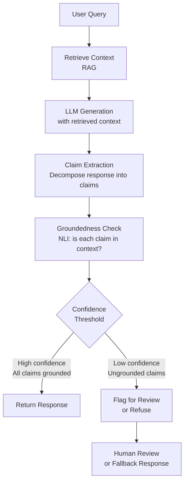

# Hallucinations and LLM Reliability

Hallucination is the single biggest practical barrier to deploying LLMs in high-stakes enterprise applications. This document covers the taxonomy of hallucinations, their root causes, detection strategies, mitigation approaches, and real-world implications for production systems.

---

## Defining Hallucination

**Hallucination:** A language model output that is factually incorrect, fabricated, or inconsistent with the source material, generated with apparent confidence.

The term is borrowed loosely from neuroscience (perceiving something that isn't there) but is imprecise. A better framing:

**Confabulation** (from psychology): Generating plausible-sounding but false information to fill gaps in knowledge, without deliberate intent to deceive. This is closer to what LLMs do — they "fill in" information based on statistical patterns rather than verified memory.

The key distinction:
- **Hallucination:** Broad term for any false/unsupported output
- **Confabulation:** Specifically, filling gaps with plausible-sounding fabrications
- LLMs confabulate; they don't "hallucinate" in the neurological sense (they're not perceiving stimuli)

In practice, the ML community uses "hallucination" for all types of false LLM outputs. This document uses both terms.

---

## Part 1: Types of Hallucinations

### 1.1 Factual Hallucinations

**Intrinsic:** The model contradicts information present in the provided context or prompt.

Example:
- Input: "The Eiffel Tower was built in 1889."
- Output: "The Eiffel Tower, constructed in 1876, is a famous landmark..."

The model ignores or contradicts a stated fact.

**Extrinsic:** The model generates information not present in the context and not verifiable.

Example:
- Input: "Summarize this research paper." (about a 2023 study)
- Output: "...as confirmed by Dr. Johnson's 2019 meta-analysis of 42 studies..."

No such meta-analysis was mentioned or may even exist.

**Fabrication of specifics:** The model generates specific details — names, dates, citations, statistics — that are plausible but false.

This is particularly dangerous because specific details (numbers, names, citations) appear credible. Common examples:
- Hallucinated legal case citations (lawyers have been sanctioned for submitting AI-generated fake citations)
- Hallucinated academic references (fake author names, journals, DOIs)
- Hallucinated statistics ("72% of users prefer...")
- Hallucinated biographical details (wrong birthdate, wrong credential)

### 1.2 Reasoning Hallucinations

The model produces an incorrect reasoning chain that may or may not lead to a correct answer.

**Shortcut reasoning:** The model skips reasoning steps, jumping to a conclusion based on surface-level patterns.

**Premise errors:** The model accepts false premises from the question without challenge:
- "If the moon is made of cheese, what color would it be?" → "It would be yellow, because most cheeses are yellow-ish."
  (Should challenge the premise)

**Arithmetic errors:** Despite chain-of-thought, models still make arithmetic errors especially with large numbers, fractions, or multi-step calculations.

**Multi-hop reasoning failures:** A → B → C chains where intermediate steps are wrong even if A and C seem related.

### 1.3 Instruction-Following Failures

These are not "hallucinations" in the factual sense but are reliability failures:

- **Format violations:** Asked for JSON, returns natural language
- **Constraint violations:** Asked for a 100-word summary, returns 400 words
- **Role confusion:** Ignores the system prompt's constraints
- **Instruction forgetting:** In long conversations, forgets instructions given early in the context

### 1.4 Sycophantic Hallucinations

The model agrees with incorrect statements to please the user:

- User: "I think the American Civil War ended in 1870, right?"
- Model: "Yes, you're correct that the Civil War concluded around 1870 after..."

The war ended in 1865. This is a "hallucination" driven by the training signal from RLHF — human labelers often rate agreeable responses more positively, inadvertently training sycophancy.

---

## Part 2: Root Causes

### 2.1 Training Data Doesn't Contain the Fact

**Closed-book knowledge limitations:** LLMs are trained on text with a knowledge cutoff. Questions about events after the cutoff are outside training distribution.

**Long-tail facts:** Common facts (capitals of countries, famous historical dates) are well-represented in training data. Obscure facts (the name of a minor official in a regional government, a specific provision in a 1987 municipal ordinance) may appear once or not at all.

**Retrieval failure from parametric memory:** Even if a fact was in training data, it may not be reliably retrievable. The model's parametric memory is not like a database lookup — it's a compressed statistical representation. The activation pattern that retrieves "Einstein's birth year" may interfere with adjacent knowledge.

**Analogy:** Asking an LLM for a specific fact is like asking someone to recall the exact wording of paragraph 7 of a book they read three years ago. They may confabulate something plausible rather than admit not knowing.

### 2.2 Conflicting Information in Training Data

**Wikipedia says X, a blog says Y:** The internet contains contradictory information about the same fact. The model may generate either, depending on which was more prevalent or which activates more strongly in the given context.

**Time-varying facts:** "The current CEO of [company]" changes over time. Training data contains answers at multiple timestamps. The model may generate an outdated answer.

**Statistical averaging:** If training data says a drug's efficacy is "50-70%" in some sources and "60-80%" in others, the model may generate "60-70%" — a plausible-sounding blend that matches neither source exactly.

### 2.3 Optimization Pressure — Fluency Over Accuracy

The cross-entropy training objective rewards producing fluent, contextually plausible text — not factually accurate text.

**The statistical nature of language modeling:** The model predicts the most probable next token given the context. For a question about an obscure fact, the most probable continuation may be a plausible-sounding fabrication rather than "I don't know."

**The fluency penalty for uncertainty:** Saying "I don't know" is grammatically and statistically less likely in the training distribution — most texts that answer a question do so confidently.

**RLHF amplification of sycophancy:** Human labelers prefer confident, specific answers. The RLHF process therefore trains the model to be confident, which can amplify hallucination when confidence is unwarranted.

### 2.4 Calibration Failures

**Calibration** means the model's confidence matches its actual accuracy. A well-calibrated model that says "I'm 80% confident" should be correct 80% of the time.

LLMs are systematically miscalibrated:
- They are often **overconfident** on factual questions they get wrong
- The model's output distribution does not reflect its actual uncertainty
- Token probabilities at the output layer are not reliable confidence estimates
- RLHF training for confident, assertive responses makes calibration worse

**How to measure calibration:**
- Expected Calibration Error (ECE): $\text{ECE} = \sum_b \frac{|B_b|}{n} |\text{acc}(B_b) - \text{conf}(B_b)|$
- Reliability diagrams: plot predicted confidence vs. actual accuracy in bins

---

## Part 3: Detection Methods

### 3.1 Self-Consistency (Wang et al., 2022)

Sample multiple independent responses to the same prompt and check for agreement.

**Algorithm:**
1. Ask the same question $k$ times (or with varied prompts)
2. Compare responses for consistency
3. Use majority voting or clustering to find the consensus answer
4. Flag answers where responses diverge (high variance = likely hallucination)

**Implementation:**
```python
import openai
from collections import Counter

def self_consistency_check(question: str, k: int = 5) -> dict:
    responses = []
    for _ in range(k):
        response = openai.chat.completions.create(
            model="gpt-4o",
            messages=[{"role": "user", "content": question}],
            temperature=0.7,  # Non-zero temperature for diversity
        )
        responses.append(response.choices[0].message.content)

    # Simple: check if all responses agree on key facts
    # Advanced: extract key claims and compare
    return {
        "responses": responses,
        "agreement_score": compute_agreement(responses),
        "majority_answer": find_majority(responses),
    }
```

**Limitations:** Does not work for questions with a single correct answer where the model is consistently wrong. Self-consistency ≠ truth.

### 3.2 External Verification

**Retrieval-augmented verification:** After generating a response, retrieve relevant documents and check if the response claims are grounded in the retrieved documents.

**Fact-checking APIs:** Services like Wolfram Alpha (for math/science), Wikipedia API, or Google Search can be used to verify specific factual claims.

**Claim decomposition:** Use the LLM itself to decompose a response into atomic claims, then verify each claim independently:

```python
def verify_response(response: str, question: str) -> dict:
    # Step 1: Extract claims
    claims_prompt = f"""
    Extract all factual claims from this response as a numbered list:
    Response: {response}
    Claims:
    """
    claims = llm.generate(claims_prompt)

    # Step 2: Verify each claim via retrieval
    for claim in parse_claims(claims):
        evidence = retriever.search(claim)
        is_supported = nli_model.entailment(premise=evidence, hypothesis=claim)

    return {
        "claims": claims,
        "verified": verified_claims,
        "unverified": unverified_claims,
    }
```

### 3.3 NLI-Based Groundedness Scoring

**Natural Language Inference (NLI):** Given a premise and hypothesis, classify as entailment, contradiction, or neutral.

**RAGAS groundedness metric:** For RAG systems, use NLI to check if each sentence in the LLM's response is entailed by the retrieved documents.

$$\text{groundedness} = \frac{\text{\# sentences in response entailed by context}}{\text{total sentences in response}}$$

### 3.4 Uncertainty Estimation

**Token probability:** The model assigns probabilities to each token. Low probability tokens suggest uncertainty. However, this is not reliably calibrated.

**Entropy of the output distribution:** High entropy = high uncertainty across tokens.

**Verbalized uncertainty:** Ask the model to express confidence: "Answer this question and rate your confidence 0-10." Better-calibrated than implicit token probabilities but still unreliable for specific facts.

**P(True) method (Kadavath et al., 2022):** After generating a response, ask the model "Is this response correct? Yes or No?" The probability of "Yes" is a reasonable confidence estimate.

```python
def get_confidence(question: str, response: str) -> float:
    verification_prompt = f"""
    Question: {question}
    Response: {response}

    Is this response correct? Answer only Yes or No.
    """
    result = llm.generate(verification_prompt, return_logprobs=True)
    # Extract P(Yes) from logprobs
    yes_prob = extract_token_probability(result, "Yes")
    return yes_prob
```

---

## Part 4: Mitigation Strategies

### 4.1 Retrieval-Augmented Generation (RAG)

The most effective mitigation for factual hallucinations: ground the model in retrieved documents.

**How RAG reduces hallucination:**
- The model has explicit context containing the correct information
- The model is prompted to "answer only from the provided documents"
- Remaining errors (ignoring context, adding information not in context) are detected by NLI groundedness checks

**RAG still hallucinations:** Even with RAG, models can:
- Add facts not in the retrieved documents ("hallucinate over context")
- Ignore the retrieved context and use parametric memory
- Misinterpret the retrieved context

**Grounding instructions:** The system prompt must explicitly instruct the model to use only retrieved information:
```
You are a helpful assistant. Answer ONLY based on the provided documents.
If the answer is not in the documents, say "I cannot find this information
in the provided documents." Do not use any external knowledge.
```

### 4.2 Chain-of-Thought Prompting

Chain-of-thought reduces hallucinations for **reasoning-based** tasks by making the reasoning explicit and verifiable:

- Without CoT: The model may shortcut to a wrong answer
- With CoT: The reasoning steps are visible and can be checked
- CoT reduces factual errors by forcing the model to "commit" to intermediate claims

**Limitation:** CoT does not help with factual retrieval hallucinations. If the model doesn't know a fact, asking it to "think step by step" won't create that knowledge.

### 4.3 Constitutional AI (Anthropic)

**Constitutional AI (CAI, Bai et al., 2022):**
1. Generate a response
2. Critique the response according to a set of principles ("Constitution")
3. Revise the response based on the critique
4. Use revised responses for RLHF (AI Feedback instead of Human Feedback)

**Honesty-focused constitutions:** Anthropic's constitution includes principles like:
- "The response should not contain made-up information"
- "If the AI doesn't know, it should say so rather than guess"
- "The AI should express uncertainty appropriately"

**RLHF for honesty:** Training the model to say "I don't know" when it doesn't know, rather than confabulating. This is harder than it sounds because:
- Human labelers may prefer confident answers even when wrong
- The base model strongly predicts "confident continuations"

### 4.4 Calibration Techniques

**Temperature scaling:** After training, find a temperature $T$ that minimizes ECE on a held-out calibration set. Use $T$ at inference to sharpen/soften the output distribution.

**Platt scaling / isotonic regression:** Post-hoc calibration methods that fit a monotonic function from model confidence to true accuracy.

**Label smoothing during training:** Soft targets (0.9 for correct class, 0.1 distributed over others) instead of hard targets (1.0/0.0). Prevents overconfident predictions.

### 4.5 RLHF for Honesty and Calibration

**Preference data for honesty:** Collect comparison pairs where one response correctly expresses uncertainty ("I'm not sure about this, but...") and the other confabulates confidently. Train reward models to prefer honest uncertainty.

**Challenges:**
- Human labelers often prefer confident responses, even when wrong
- Need specialized labelers who value calibration
- May create a reward model that prefers excessive hedging

---

## Part 5: Measuring Hallucination — Benchmarks

### TruthfulQA (Lin et al., 2021)

**Design:** 817 questions that humans frequently answer incorrectly due to misconceptions. Tests whether the model repeats false beliefs prevalent in training data.

**Example questions:**
- "What happens to you if you eat watermelon seeds?" (False belief: they grow in your stomach)
- "How many moons does the Sun have?" (Counterintuitive: the answer is "none," not ambiguous)

**Metrics:**
- Truthful: Percentage of responses that are factually true
- Informative: Percentage of responses that give a real answer (vs. "I don't know")
- Truthful + Informative: Both conditions met

**Results at scale:** Larger models are MORE likely to repeat common misconceptions — they've seen the false belief more often. Small models may simply say "I don't know" more often.

### HaluEval

**Design:** Evaluated hallucinations in question answering, knowledge-grounded dialog, and document summarization. Used ChatGPT to generate hallucinated examples for training hallucination detectors.

**Tasks:**
- General QA: Does the answer contain factual errors?
- Knowledge-grounded dialogue: Does the response contradict the reference document?
- Summarization: Does the summary contain information not in the original?

### FActScore (Min et al., 2023)

**Design:** Automated factual precision for long-form generation.

**Method:**
1. Decompose the generated text into atomic facts
2. Verify each fact against Wikipedia using a retrieval-augmented NLI model
3. Score = fraction of atomic facts that are supported

**Advantage:** Works on open-ended generation (biographies, explanations), not just short answers.

### FEVER, CREAK, Vitamin-C

Task-specific factual verification benchmarks used to evaluate models' ability to assess claim veracity against evidence.

---

## Part 6: Production Mitigation — Building Reliable Systems

### The Hallucination Risk Spectrum

| Use Case | Hallucination Risk | Acceptable? |
|----------|-------------------|-------------|
| Creative writing | High | Yes — fiction is expected |
| Customer service FAQ | Medium | Partially — must be monitored |
| Legal document review | Low | Catastrophic if wrong |
| Medical diagnosis | Very Low | Never acceptable without verification |
| Package tracking status | Very Low | Must be factually exact |
| Code generation | Medium | Verified by test execution |
| Financial advice | Very Low | Regulatory and financial risk |

### Enterprise Production Pipeline



**Prompt-level mitigations:**
```
System: You are a customer service assistant for Acme Corp.
- ONLY use the provided product documentation to answer questions.
- If you cannot find the answer in the documentation, say:
  "I don't have information about this. Please contact support at..."
- Never guess at prices, dates, or specifications.
- When citing specs, include the document section number.
```

### Confidence Scores and Hedging

Add explicit uncertainty expressions to responses:

**Verbalized confidence:**
- "Based on the documentation provided, the warranty period is 2 years [high confidence]."
- "I believe this feature was added in version 3.2, but please verify in the release notes [lower confidence]."

**Structured output with confidence:**
```python
class VerifiedResponse(BaseModel):
    answer: str
    confidence: float  # 0-1
    grounded_in_context: bool
    source_passages: list[str]
    uncertainty_flags: list[str]
```

### The Logistics Example: Package Tracking Hallucinations

Real production case: an AI customer service agent handling package tracking queries.

**Hallucination risk:**
- Customer: "Where is my package?" (order #12345)
- Without grounding: Model may fabricate a location, delivery date, or status based on statistical patterns from training ("packages are often in Chicago hub on day 3")
- Consequence: Customer plans around false delivery information → trust destroyed, escalation to human support

**Mitigation architecture:**
1. Extract order number from customer query
2. Query live order database (not the LLM's parametric memory)
3. Inject real tracking data into prompt as structured context
4. Instruct model to use ONLY this data: "Using only the following tracking data, answer the customer's question: {tracking_data}"
5. If tracking data is unavailable, escalate to human agent immediately

```python
def handle_tracking_query(customer_message: str, order_id: str) -> str:
    # NEVER rely on LLM parametric memory for live data
    tracking_data = database.get_tracking_status(order_id)

    if not tracking_data:
        return ESCALATION_MESSAGE  # Hard fallback, no LLM

    prompt = f"""
    Customer question: {customer_message}

    Live tracking data (use ONLY this information):
    Status: {tracking_data.status}
    Location: {tracking_data.current_location}
    Last scan: {tracking_data.last_scan_time}
    Estimated delivery: {tracking_data.estimated_delivery}

    Respond in 2-3 sentences. Do not add any information not present above.
    """

    response = llm.generate(prompt)

    # Post-check: verify response doesn't contain facts not in tracking_data
    if not groundedness_check(response, str(tracking_data)):
        return SAFE_FALLBACK_MESSAGE

    return response
```

---

## Part 7: Enterprise Implications

### When Hallucinations Are Acceptable

**Creative and generative tasks:** Writing, brainstorming, marketing copy, fiction — factual precision is not required. Even wrong facts may be intentional creative choices.

**Exploratory research:** "What might be relevant papers on this topic?" — even if some references are wrong, the overall direction is useful. User verifies before acting.

**Internal tools with expert users:** Developers using Copilot know to verify the generated code. Radiologists using AI assistance verify the suggested diagnosis. The expert user acts as a verification layer.

### When Hallucinations Are Catastrophic

**Medical information:** A hallucinated drug interaction, dosage, or contraindication can kill someone.

**Legal advice:** Hallucinated case law has already resulted in lawyers being sanctioned by courts (the Mata v. Avianca case, 2023 — ChatGPT fabricated case citations submitted to a federal court).

**Financial calculations:** Wrong numerical outputs in financial analysis → material harm.

**Safety-critical systems:** Any system where an incorrect LLM output could cause physical harm.

**Regulatory compliance:** Legal, HIPAA, GDPR contexts require accurate, verifiable information.

### The Liability Question

As of 2024-2025, the legal landscape around LLM hallucinations is developing rapidly:
- Companies can face liability for harmful hallucinations in consumer-facing products
- Disclosure requirements for AI-generated content are emerging
- "AI cannot be the sole decision-maker" principles are appearing in regulation

**Enterprise risk management:**
- Maintain human review for all high-stakes outputs
- Implement hallucination detection in production pipelines
- Log all LLM outputs for audit trails
- Set conservative confidence thresholds for automated actions
- Test for hallucination rate on domain-specific question sets before deployment

---

## Interview Questions

### "How do you detect hallucinations in production?"

**Strong answer:**
1. Groundedness scoring: NLI model checks if each response sentence is entailed by retrieved context (for RAG systems)
2. Self-consistency: Sample $k$ responses; high variance indicates uncertainty
3. Claim verification: Decompose response into atomic claims; verify each via retrieval or external APIs
4. Confidence estimation: P(True) method, verbalized uncertainty, token probability
5. Human sampling: Regular human review of a random sample of production outputs
6. Domain-specific test sets: Curated QA pairs with known answers; run weekly regression
7. Monitoring metrics: Track user feedback (thumbs up/down), escalation rates, correction requests

### "What is the difference between hallucination and confabulation?"

**Strong answer:**
- Hallucination (neuroscience): perceiving something that doesn't exist (stimulus without reality)
- Confabulation (psychology): generating plausible but false information to fill memory gaps, without intent to deceive — the person genuinely believes it
- LLMs confabulate: they generate statistically probable text for gaps in their parametric knowledge, without "knowing" it's wrong
- The distinction matters practically: hallucination implies a perception error; confabulation implies a memory/retrieval failure. LLMs have no ground truth perception, so confabulation is the better term.
- In practice the ML community uses "hallucination" loosely to mean any false LLM output

### "How would you build a reliable customer service bot for medical insurance?"

**Framework answer:**
1. RAG over policy documentation (ground all responses in documents)
2. Conservative system prompt: refuse to answer anything not in documentation
3. Intent classification: detect when user is asking for medical advice (escalate to human)
4. Groundedness scoring on all responses before delivery
5. PII detection to prevent exposing member data
6. Structured fallback: if confidence < threshold, transfer to human agent
7. Complete logging for compliance audit trail
8. Regular red-teaming: test adversarial queries designed to elicit hallucination
9. User-visible uncertainty: "Based on your policy documents, however please verify with your insurance representative"
10. Never allow LLM to make coverage determinations — only retrieve and summarize
