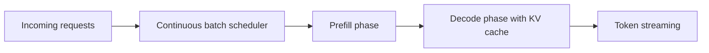

# LLM Inference Optimization

## Bottlenecks
Autoregressive decoding is memory-bandwidth bound and sequential per token.

## KV cache
Stores key/value tensors from previous tokens to avoid recomputation.
Tradeoff: large memory growth with long contexts and many concurrent requests.

## Batching strategies
- Static batching: fixed windows, simple but inefficient.
- Dynamic/continuous batching: merge requests continuously for higher utilization.

## vLLM and PagedAttention
PagedAttention manages KV cache in blocks to reduce fragmentation and support high concurrency.

## Other optimizations
- FlashAttention kernels.
- Speculative decoding (draft + verify).
- Quantized inference.
- Tensor parallelism for large models.
- Prompt caching.

## Throughput vs latency
- Larger batch improves throughput but can hurt tail latency.
- Split endpoints by SLA tiers (fast-small model vs slow-large model).

## Framework comparison
- vLLM: high-throughput API serving.
- TGI: mature HF integration.
- llama.cpp/Ollama: local and CPU-first scenarios.

## Interview questions
1. What is continuous batching?
2. Why KV cache can become bottleneck?
3. When use speculative decoding?
