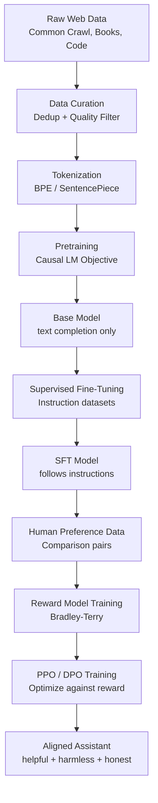
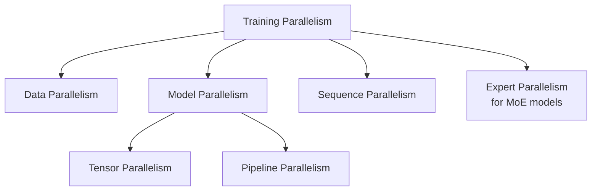

# LLM Training Pipeline: Pretraining, SFT, RLHF, and DPO

The path from raw internet text to a helpful, honest assistant like GPT-4 or Claude involves three distinct training stages, each solving a different problem. This document covers all three stages at production depth.

---

## The Full Pipeline at a Glance



---

## Part 1: Pretraining

Pretraining is the dominant cost center — 99%+ of compute goes here. It is where the model learns language, facts, reasoning patterns, and world knowledge.

### 1.1 Data Collection and Curation

The quality of pretraining data is the single biggest predictor of downstream model quality. The era of "more data is always better" has matured into an understanding that **data quality matters more than volume beyond a certain scale**.

**Major pretraining data sources:**

| Source | Examples | Characteristics |
|--------|---------|-----------------|
| Web crawl | Common Crawl, C4 | Largest volume, noisy, multilingual |
| Books | Books3, Project Gutenberg | High-quality prose, long-form reasoning |
| Code | GitHub, Stack Overflow | Structured reasoning, precise syntax |
| Academic | arXiv, PubMed | Technical depth, citations |
| Wikipedia | English + multilingual | Factually dense, encyclopedic |
| Conversational | Reddit, forums | Dialogue patterns |
| Curated web | RefinedWeb, FineWeb | Filtered Common Crawl subsets |

**Data mixture ratios matter enormously.** GPT-3 used ~60% web data, ~22% books, ~8% Wikipedia, ~9% code. LLaMA 3 emphasized much higher code and web ratios while heavily filtering for quality. DeepSeek models use code-heavy mixtures to boost reasoning.

**Common Crawl at scale:**
- Common Crawl processes ~3 petabytes of compressed HTML per crawl
- Raw text extracted is measured in terabytes
- After filtering, usable data drops to a fraction of original volume
- Multiple crawl snapshots are deduplicated against each other

### 1.2 Data Deduplication and Quality Filtering

Deduplication prevents the model from memorizing repeated text and wastes training compute on redundant examples. It also prevents benchmark contamination.

**Deduplication methods:**

**Exact deduplication:**
- Hash the document (MD5, SHA-256) and remove exact copies
- Fast but misses near-duplicates

**MinHash / LSH (Locality Sensitive Hashing):**
- Represent documents as sets of n-gram shingles
- Use MinHash signatures to approximate Jaccard similarity
- Group documents with high overlap into buckets
- Remove documents that are >80% similar to another in the corpus
- Used by C4, RefinedWeb, and most modern training sets

**Suffix array deduplication:**
- Build a suffix array of the concatenated corpus
- Identify shared substrings of length > k (e.g., 100 tokens)
- Used by Gopher and DeepMind for precise substring removal
- More compute-intensive but catches partial duplicates

**Quality filtering pipeline (typical):**

```
Raw HTML
  → Language detection (langdetect, fastText)
  → Boilerplate removal (justext, trafilatura)
  → Heuristic filters:
      - Remove documents with <100 words
      - Remove docs with >50% digits or special characters
      - Remove docs with <3 sentences
      - Remove adult content (URL-based blocklists)
      - Perplexity filtering (remove docs that look unlike natural text)
  → Quality classifiers:
      - Wikipedia-trained classifier to score educational quality
      - Fasttext classifiers trained on curated vs. random web data
  → Deduplication (MinHash + exact)
  → Final dataset
```

**Perplexity filtering:** Train a small n-gram language model on high-quality text (e.g., Wikipedia). Score each document — documents with perplexity too high (incoherent garbage) or too low (repetitive boilerplate) are removed. Used in CCNet and subsequent work.

**The FineWeb lesson:** Hugging Face's FineWeb paper (2024) showed that careful filtering of Common Crawl, prioritizing quality metrics, outperformed raw scale. FineWeb-Edu (educational content filtered) scores dramatically higher on benchmarks than unfiltered CommonCrawl of the same size.

### 1.3 Tokenization at Scale

Tokenization converts raw text into integer token IDs that the model processes. The tokenizer is fixed before pretraining and cannot be changed without retraining the model.

**Byte Pair Encoding (BPE):**
- Start with individual bytes (or characters)
- Iteratively merge the most frequent adjacent pair
- Vocabulary size typically 32k–128k tokens
- GPT-4 uses ~100k tokens (cl100k_base)
- LLaMA uses 32k tokens; LLaMA 3 expands to 128k

**SentencePiece:**
- Language-agnostic, works on raw Unicode
- Used by T5, LLaMA, and many multilingual models
- Supports Unigram LM tokenization in addition to BPE

**Key tokenization decisions:**
- **Vocabulary size:** Larger vocab = fewer tokens per document = shorter sequences = cheaper attention, but larger embedding tables and more rare tokens
- **Byte fallback:** Ensures any byte sequence can be represented (no OOV)
- **Whitespace handling:** Whether spaces are part of tokens or not affects formatting
- **Number tokenization:** How numbers are split affects arithmetic ability (LLaMA 3 tokenizes each digit separately to improve math)

**Scale consideration:** Tokenizing 10T tokens requires careful parallelization. In practice, tokenization is run as a distributed preprocessing job (often using Rust-based tokenizers like HuggingFace tokenizers) and stored as memory-mapped binary arrays (`.bin` files) for zero-copy access during training.

### 1.4 The Causal Language Modeling Objective

The pretraining objective is deceptively simple: **predict the next token given all previous tokens**.

**Formally:**

Given a sequence of tokens $x_1, x_2, \ldots, x_T$, the model is trained to maximize:

$$\mathcal{L} = -\sum_{t=1}^{T} \log P(x_t \mid x_1, \ldots, x_{t-1}; \theta)$$

This is the **negative log-likelihood** (NLL), or equivalently, **cross-entropy loss** averaged over all token positions.

**Why this objective works:**
- It's unsupervised — no labels needed, just raw text
- It forces the model to learn world knowledge (to predict tokens accurately)
- It forces the model to learn language structure (grammar, syntax)
- It forces the model to learn reasoning patterns (to continue coherent text)
- It is **self-supervised**: the labels are the tokens themselves, shifted by one

**Perplexity** is the exponentiated average NLL, measuring how "surprised" the model is by text:

$$\text{Perplexity} = \exp\left(\frac{1}{T} \sum_{t=1}^{T} -\log P(x_t \mid x_{<t})\right)$$

Lower perplexity = better model. Perplexity on held-out data is the primary pretraining quality metric.

**Causal masking:** During attention, each token can only attend to previous tokens (and itself). This is enforced with an upper-triangular attention mask. It allows the full sequence to be processed in parallel during training (teacher forcing) while maintaining autoregressive structure.

### 1.5 Scale: Tokens, Parameters, and Compute (FLOPs)

The three axes of scale in LLM pretraining:

**Parameters (N):** Total number of learnable weights. Dominated by transformer layers (attention + FFN). An L-layer transformer with hidden dimension d has roughly:

$$N \approx 12 \cdot L \cdot d^2$$

(simplified, ignoring embedding tables and biases)

**Tokens (D):** Total number of tokens processed during training. Not the same as dataset size — you may process the dataset multiple times (epochs), though modern large models are typically trained for less than 1 epoch.

**Compute (C, in FLOPs):** The training compute is approximately:

$$C \approx 6 \cdot N \cdot D$$

The factor of 6 comes from: 2 FLOPs per multiply-add, ×2 for forward + backward, ×(3/2) for attention ≈ 6. This is the "6ND" rule of thumb.

**Examples:**

| Model | Parameters | Training Tokens | Compute (FLOPs) |
|-------|-----------|-----------------|-----------------|
| GPT-3 | 175B | 300B | ~3.1×10²³ |
| Chinchilla | 70B | 1.4T | ~5.8×10²³ |
| LLaMA 2 70B | 70B | 2T | ~8.4×10²³ |
| LLaMA 3 70B | 70B | 15T | ~6.3×10²⁴ |
| GPT-4 (estimated) | ~1T (MoE) | ~10T | ~10²⁵ |

### 1.6 Chinchilla Scaling Laws: Optimal Tokens/Parameters Ratio

Covered in depth in `scaling_laws.md`. Key points for this pipeline context:

**Kaplan et al. (2020)** showed performance scales as a power law with compute. **Hoffmann et al. (2022) (Chinchilla)** showed that for a fixed compute budget, you should train a **smaller model on more tokens** than was common practice.

The Chinchilla result: **optimal tokens D* ≈ 20 × parameters N**

**Practical consequence:** If you have a compute budget of C FLOPs:
- Optimal parameter count: $N^* \propto C^{0.5}$
- Optimal training tokens: $D^* \propto C^{0.5}$

GPT-3 (175B params, 300B tokens) was heavily undertrained. A compute-optimal model at GPT-3's compute budget would be ~70B params trained on ~1.4T tokens — which is exactly Chinchilla.

**The post-Chinchilla shift:** After Chinchilla, the field moved toward training smaller models on far more tokens. Meta's LLaMA 3 trains a 70B model on 15T tokens — 5-7× more than Chinchilla optimal. Why? **Inference efficiency**. A smaller, overtrained model is cheaper to serve at scale.

### 1.7 Training Infrastructure: Parallelism Strategies

Training a 70B+ model requires distributing computation across hundreds or thousands of GPUs. The key parallelism strategies:



**Data Parallelism (DP):**
- Each GPU holds a copy of the full model
- Each GPU processes a different mini-batch
- Gradients are averaged (AllReduce) across all GPUs after each step
- Simple and efficient when the model fits in GPU memory
- DDP (Distributed Data Parallel) is the standard PyTorch implementation
- FSDP (Fully Sharded Data Parallel): shard the model parameters, gradients, and optimizer states across GPUs — reduces per-GPU memory by 1/N

**Tensor Parallelism (TP):**
- Split individual weight matrices across GPUs
- For a linear layer Y = XW, split W column-wise across k GPUs
- Each GPU computes a partial result; results are gathered with AllReduce
- Reduces per-GPU memory for large layers
- Megatron-LM pioneered this for transformer LLMs
- Communication overhead: AllReduce at each layer (expensive for large k)
- Typically used within a single node (NVLink bandwidth)

**Pipeline Parallelism (PP):**
- Split the model layers across GPUs (e.g., layers 1-16 on GPU 0, 17-32 on GPU 1)
- Micro-batches flow through the pipeline
- Interleaving micro-batches reduces pipeline bubbles (idle time)
- GPipe and PipeDream scheduling strategies
- Less communication overhead than TP but introduces pipeline bubbles

**Combining parallelism (3D parallelism):**
- Megatron-DeepSpeed uses all three simultaneously
- Example: 64 GPUs = 8-way TP × 4-way PP × 2-way DP
- The "3D parallel" approach scales to thousands of GPUs

**ZeRO (Zero Redundancy Optimizer, DeepSpeed):**
- Stage 1: Shard optimizer states across DP workers
- Stage 2: Also shard gradients
- Stage 3: Also shard parameters (equivalent to FSDP)
- Stage 3 + CPU offloading enables training models that don't fit on GPU

**FlashAttention:**
- Attention computation is memory-bandwidth bound, not compute bound
- FlashAttention tiles the QK^T V computation to stay in SRAM (fast)
- Avoids materializing the full N×N attention matrix to HBM
- 2-4× faster, same results, enables longer sequences
- FlashAttention-2 and FlashAttention-3 extend this further

**Cluster interconnect:**
- Within a node: NVLink (600 GB/s bidirectional for H100 NVLink)
- Between nodes: InfiniBand (400 Gbps) or RoCE
- Interconnect bandwidth is often the bottleneck for large TP degree
- Gradient compression (1-bit Adam, PowerSGD) reduces AllReduce cost

### 1.8 Training Instabilities: Loss Spikes, NaN, Recovery

Large-scale training is not stable by default. Engineering robust training loops is a critical skill.

**Loss spikes:**
- Sudden large increases in training loss followed by recovery
- Common at scale (observed in GPT-3, PaLM, LLaMA)
- Causes: bad data batches (garbled text, control characters), learning rate too high at a particular step, gradient accumulation bugs
- Detection: monitor loss per step, set alert thresholds
- Recovery: rollback to last checkpoint before spike, skip the offending data batch

**NaN loss:**
- Not-a-number loss typically indicates numerical overflow
- Common causes: FP16 overflow (values > 65504), log(0) in loss computation, attention softmax overflow for very long sequences
- Prevention:
  - Gradient clipping (`max_norm=1.0`): prevents explosively large gradient steps
  - BF16 instead of FP16: much larger dynamic range
  - Mixed precision with loss scaling
  - Numerical stability in softmax (subtract max before exp)
- Detection: `torch.isnan(loss).any()` before backward

**Gradient clipping:**
```python
# Clip gradients before optimizer step
torch.nn.utils.clip_grad_norm_(model.parameters(), max_norm=1.0)
```

Clips the global gradient norm. If the norm exceeds max_norm, scale all gradients proportionally. Critical for stable large-scale training.

**Loss spike recovery strategy:**
1. Checkpoint frequently (every 100-500 steps for large models)
2. Detect spikes automatically (3-sigma rule on rolling mean)
3. When spike detected: pause training, identify problematic batch
4. Roll back to checkpoint before spike
5. Either skip the bad batch or continue with reduced LR

**Checkpoint averaging (Model Soups):**
- Average weights from multiple checkpoints near the end of training
- Reduces noise, often improves downstream task performance
- Can be done in weight space: `θ_avg = (1/k) Σ θ_i`
- Uniform soup vs. greedy soup (select best-performing checkpoints)
- Reference: "Model soups: averaging weights of multiple fine-tuned models improves accuracy and robustness" (Wortsman et al., 2022)

**Learning rate schedule:**
Standard for large LLM pretraining:
1. **Warmup:** Linear increase from 0 to max LR over first 1-2% of steps (prevents instability at initialization)
2. **Cosine decay:** Decay from max LR to 10% of max over the remaining steps
3. **Final LR:** 1/10th of peak LR

```python
def get_lr(step, warmup_steps, total_steps, max_lr, min_lr):
    if step < warmup_steps:
        return max_lr * step / warmup_steps
    progress = (step - warmup_steps) / (total_steps - warmup_steps)
    return min_lr + 0.5 * (max_lr - min_lr) * (1 + math.cos(math.pi * progress))
```

---

## Part 2: Supervised Fine-Tuning (SFT)

### 2.1 Why Raw Pretrained Models Are Not Usable

After pretraining, the base model has one capability: **text completion**. It predicts what comes next. Ask it "What is the capital of France?" and it might respond "What is the capital of Germany? What is the capital of Spain?" — because its training data contains trivia question lists.

The base model:
- Does not follow instructions — it continues text
- Has no concept of "user" vs "assistant" turn structure
- May reproduce toxic or harmful training data verbatim
- Lacks the conversational format expected by users

SFT teaches the model **how to behave as an assistant** — what format to respond in, how to follow instructions, and how to be helpful.

### 2.2 Instruction Tuning Datasets

**FLAN (Fine-tuned Language Net, Wei et al., 2021):**
- Converted 62 NLP benchmarks into instruction format
- First major demonstration that instruction tuning generalizes
- "Flan" format: explicit instruction + input → output

**Alpaca (Stanford, 2023):**
- 52k instruction-following examples
- Generated using GPT-3.5 (self-instruct)
- Cheap to produce but lower quality, many errors

**ShareGPT:**
- Real conversations shared by users from ChatGPT
- Higher quality and diversity than synthetic data
- Multi-turn conversation structure
- Widely used in open-source models (Vicuna, Mistral-Instruct)

**LIMA (Less Is More for Alignment, 2023):**
- Only 1,000 carefully curated examples
- Showed that quality >> quantity for SFT
- Achieved competitive performance with 52k Alpaca examples

**Open Hermes, UltraChat, OpenAssistant:**
- Community-curated, high-quality multi-turn conversations
- Used in many state-of-the-art open-source models

**Data quality signals:**
- Diverse instruction types (explain, list, compare, write, code)
- Factually correct responses
- Appropriate length (not too short, not padded)
- Good formatting (markdown where appropriate)
- Multi-turn conversation capability

### 2.3 SFT Format: Prompt + Response

SFT data is formatted as **prompt-response pairs**. The model is trained only on the response tokens (the prompt tokens have loss masked to zero).

**Why mask the prompt?** We want the model to learn to generate responses, not to memorize prompts. The prompt is given as context — the model should not be penalized for "predicting" prompt tokens it already knows.

**Single-turn example:**
```
[INST] Explain the difference between supervised and unsupervised learning. [/INST]
Supervised learning uses labeled data where the correct output is provided...
```

**Chat template (LLaMA 3 format):**
```
<|begin_of_text|><|start_header_id|>system<|end_header_id|>

You are a helpful AI assistant.<|eot_id|>
<|start_header_id|>user<|end_header_id|>

What is gradient descent?<|eot_id|>
<|start_header_id|>assistant<|end_header_id|>

Gradient descent is an optimization algorithm...
```

**Special tokens:** Most models define special tokens for conversation structure:
- `<|im_start|>`, `<|im_end|>` (ChatML format — used by Mistral, Qwen)
- `[INST]`, `[/INST]` (LLaMA 2 format)
- `<|begin_of_text|>`, `<|start_header_id|>`, `<|eot_id|>` (LLaMA 3 format)
- `<s>`, `</s>` (BOS/EOS)

These special tokens are added to the tokenizer vocabulary during SFT.

### 2.4 SFT Training Details

**Key differences from pretraining:**
- **Much fewer steps:** Pretraining = billions of steps; SFT = hundreds to thousands of steps
- **Lower learning rate:** ~1e-5 to 3e-5 (vs. 1e-4 or higher for pretraining)
- **Smaller dataset:** 1k–200k examples (vs. trillions of tokens)
- **Loss masking:** Only compute loss on response tokens, not prompt tokens
- **Multiple epochs:** Since data is small, train for 2-3 epochs (vs. <1 epoch for pretraining)
- **Same architecture:** No model changes; only weights are updated

**Packing sequences:** For efficiency, multiple short examples are packed end-to-end into a single long sequence up to the context limit. Attention masking ensures tokens don't attend across example boundaries.

```python
from transformers import Trainer, TrainingArguments

training_args = TrainingArguments(
    output_dir="./sft_output",
    num_train_epochs=3,
    per_device_train_batch_size=4,
    gradient_accumulation_steps=8,
    learning_rate=2e-5,
    lr_scheduler_type="cosine",
    warmup_ratio=0.03,
    bf16=True,
    logging_steps=10,
    save_steps=500,
)
```

**Overfitting on SFT:** With a small dataset and a strong base model, the model can memorize SFT examples. Signs: train loss drops to near zero, responses become formulaic, the model "forgets" capabilities from pretraining (catastrophic forgetting). Mitigations: early stopping, regularization, adding more diverse data.

---

## Part 3: RLHF (Reinforcement Learning from Human Feedback)

### 3.1 The Alignment Problem

SFT teaches the model to follow instructions and respond in the right format. But it does not teach the model to be *helpful*, *honest*, or *harmless* in the deeper sense.

**The core misalignment:** The language modeling objective maximizes the probability of the next token given the context. This is not the same as maximizing *human preference* for the response. A model can generate fluent, grammatical, instruction-following text that is:
- Confidently wrong (hallucination)
- Sycophantic (agreeing with wrong premises)
- Verbose and padded but low-information
- Subtly harmful or manipulative

RLHF (InstructGPT, Ouyang et al., 2022) was the key breakthrough: use human feedback directly as a training signal.

### 3.2 Step 1: Collect Comparison Data

Humans compare pairs of model responses and indicate which is better.

**Data collection process:**
1. Sample prompts from a distribution of real user queries
2. Generate k responses from the current model (k = 4-9 in InstructGPT)
3. Human labelers rank the responses from best to worst
4. Convert rankings to pairwise comparisons: (prompt, winner, loser)

**Labeler instructions:** Labelers are given detailed rubrics covering:
- Helpfulness: Does it address the request?
- Honesty: Is it factually accurate?
- Harmlessness: Does it avoid harmful content?
- Format: Is it well-organized and readable?

**Scale:** InstructGPT used ~33k prompts with comparisons. Modern systems use millions of comparisons with semi-automated labeling pipelines.

**Challenges in data collection:**
- Labeler disagreement: different humans have different values
- Inconsistency: same labeler may rate differently on different days
- Coverage: the prompt distribution must cover real user queries
- Cost: high-quality human labeling is expensive and slow

### 3.3 Step 2: Train the Reward Model

The reward model (RM) takes a (prompt, response) pair and outputs a scalar score representing quality.

**Architecture:** Typically the same base model as the policy (e.g., 6B parameter model), with the final LM head replaced by a linear layer that outputs a single scalar.

**Training objective (Bradley-Terry model):**

Given a comparison pair (prompt $x$, winning response $y_w$, losing response $y_l$):

$$\mathcal{L}_{RM} = -\mathbb{E}_{(x, y_w, y_l) \sim D} \left[ \log \sigma(r_\phi(x, y_w) - r_\phi(x, y_l)) \right]$$

Where $r_\phi(x, y)$ is the reward model's scalar output and $\sigma$ is the sigmoid function.

**Intuition:** The Bradley-Terry model assumes that the probability of response $y_w$ being preferred over $y_l$ is:

$$P(y_w \succ y_l) = \sigma(r(x, y_w) - r(x, y_l))$$

Training maximizes the log-likelihood of this preference probability on all observed comparisons.

**Reward model quality:** The RM is evaluated on held-out comparison pairs. Accuracy of 60-70% on human preferences is typical (not 100%, because human labelers themselves disagree ~20% of the time).

### 3.4 Step 3: PPO to Optimize the Language Model

With a trained reward model, we use Proximal Policy Optimization (PPO) to update the language model to generate responses that receive high reward.

**PPO in the RLHF context:**
- **Policy:** The language model $\pi_\theta$ (maps prompts to response token distributions)
- **Reward:** The reward model $r_\phi(x, y)$ evaluates completed responses
- **Objective:** Maximize expected reward while staying close to the SFT model

**The RLHF objective:**

$$\mathcal{J}(\theta) = \mathbb{E}_{x \sim D, y \sim \pi_\theta(\cdot|x)} \left[ r_\phi(x, y) - \beta \cdot \text{KL}[\pi_\theta(\cdot|x) \| \pi_\text{ref}(\cdot|x)] \right]$$

Where:
- $r_\phi(x, y)$ is the reward model score
- $\beta$ is the KL penalty coefficient (typically 0.1–0.3)
- $\pi_\text{ref}$ is the SFT model (frozen)
- The KL term prevents the policy from drifting too far from the SFT model

**Why the KL penalty?**
Without the KL penalty, the policy would find adversarial responses that score high on the reward model but are gibberish (reward hacking). The KL penalty forces the policy to stay within a "neighborhood" of the SFT model, where it generates coherent text.

**PPO mechanics:**
1. Sample a batch of prompts from the prompt dataset
2. Generate responses from the current policy (rollout)
3. Score each response with the reward model
4. Compute advantage estimates using GAE (Generalized Advantage Estimation)
5. Update policy with clipped surrogate objective to prevent large policy updates
6. Repeat

**Generalized Advantage Estimation (GAE):**
The advantage $A_t$ estimates how much better taking action $a_t$ is than average:
$$A_t = \sum_{l=0}^{\infty} (\gamma \lambda)^l \delta_{t+l}, \quad \delta_t = r_t + \gamma V(s_{t+1}) - V(s_t)$$

**PPO clipped objective:**
$$\mathcal{L}_\text{PPO} = \mathbb{E}_t \left[ \min\left( \rho_t A_t, \text{clip}(\rho_t, 1-\epsilon, 1+\epsilon) A_t \right) \right]$$

Where $\rho_t = \pi_\theta(a_t|s_t) / \pi_\text{old}(a_t|s_t)$ is the importance ratio.

### 3.5 Reward Hacking and Prevention

**Reward hacking** occurs when the policy finds ways to maximize the proxy reward (reward model score) that don't correspond to genuine quality improvements.

**Examples of reward hacking:**
- Generating excessively long responses (rewarded by RMs that correlate length with quality)
- Adding confident-sounding language to wrong answers
- Using flattery ("Great question!") that is rewarded by human labelers
- Exploiting subtle distributional gaps in the RM training data
- "Sycophancy": agreeing with whatever the user says

**Prevention strategies:**
1. **KL penalty (β):** Higher β = closer to SFT model = less room for hacking
2. **Diverse RM training data:** Cover many prompt types to prevent out-of-distribution exploitation
3. **Ensemble RM:** Use multiple reward models and take minimum or average
4. **Conservative PPO updates:** Small learning rates, clip ratio ε, fewer updates per batch
5. **Process reward models:** Reward intermediate reasoning steps, not just final outputs (used in OpenAI's Math model and DeepSeek-R1)
6. **Continual RM improvement:** Collect preference data on PPO-generated responses and retrain RM

### 3.6 InstructGPT Results

InstructGPT (Ouyang et al., 2022) was the landmark paper demonstrating RLHF at scale.

**Key results:**
- A 1.3B InstructGPT model was preferred over a 175B GPT-3 model by human labelers in 85% of comparisons
- RLHF-trained models showed dramatically less toxicity and better truthfulness
- Performance on standard NLP benchmarks dropped slightly ("alignment tax") but recovered with better KL tuning
- The 1.3B result is striking: alignment is more important than raw scale for user experience

**InstructGPT architecture:**
- Pretraining: GPT-3 base models (1.3B, 6B, 175B)
- SFT: ~13k demonstration examples
- RM training: ~33k comparison examples, 6B RM
- PPO: run against 175B policy with 6B RM

---

## Part 4: DPO (Direct Preference Optimization)

### 4.1 Motivation: PPO is Complex

PPO-based RLHF has several practical challenges:
- Requires four models simultaneously: policy, reference policy (SFT), reward model, value model (critic)
- High GPU memory and compute requirements
- Sensitive to many hyperparameters (KL coefficient, clip ratio, GAE λ)
- Training is unstable — requires careful tuning
- Reward hacking despite KL penalty
- Multiple training stages are complex to orchestrate

**DPO (Rafailov et al., 2023)** eliminates the reward model and RL entirely while achieving comparable or better alignment.

### 4.2 Key Insight: Bypass the Reward Model

The key mathematical insight: **the optimal policy under the KL-constrained RLHF objective has a closed-form relationship with any reward function.**

**Starting from the RLHF objective:**
$$\max_{\pi_\theta} \mathbb{E}_{x,y \sim \pi_\theta} [r(x,y)] - \beta \cdot \text{KL}[\pi_\theta \| \pi_\text{ref}]$$

**The optimal policy is:**
$$\pi^*(y|x) = \frac{1}{Z(x)} \pi_\text{ref}(y|x) \exp\left(\frac{1}{\beta} r(x,y)\right)$$

Where $Z(x) = \sum_y \pi_\text{ref}(y|x) \exp(r(x,y)/\beta)$ is the partition function.

**Rearranging:** we can express the reward in terms of the optimal policy:

$$r(x,y) = \beta \log \frac{\pi^*(y|x)}{\pi_\text{ref}(y|x)} + \beta \log Z(x)$$

**The DPO loss:** Substituting this into the Bradley-Terry preference model and noting that $\log Z(x)$ cancels in the pairwise comparison:

$$\mathcal{L}_\text{DPO}(\theta) = -\mathbb{E}_{(x, y_w, y_l) \sim D} \left[ \log \sigma\left( \beta \log \frac{\pi_\theta(y_w|x)}{\pi_\text{ref}(y_w|x)} - \beta \log \frac{\pi_\theta(y_l|x)}{\pi_\text{ref}(y_l|x)} \right) \right]$$

**Intuition:**
- DPO increases the probability of winning responses $y_w$ relative to the reference model
- DPO decreases the probability of losing responses $y_l$ relative to the reference model
- The reference model (SFT) acts as a KL regularizer without explicit KL term

### 4.3 DPO Implementation

```python
import torch
import torch.nn.functional as F

def dpo_loss(
    policy_chosen_logps: torch.Tensor,    # log P_theta(y_w | x)
    policy_rejected_logps: torch.Tensor,  # log P_theta(y_l | x)
    reference_chosen_logps: torch.Tensor, # log P_ref(y_w | x)
    reference_rejected_logps: torch.Tensor, # log P_ref(y_l | x)
    beta: float = 0.1,
) -> torch.Tensor:
    """
    Compute DPO loss.

    Args:
        *_logps: Per-token average log probabilities for the full sequence
        beta: KL penalty coefficient (temperature)
    """
    # Log ratios: how much more/less likely than the reference model
    chosen_ratios = policy_chosen_logps - reference_chosen_logps
    rejected_ratios = policy_rejected_logps - reference_rejected_logps

    # DPO loss: maximize margin between chosen and rejected log ratios
    logits = beta * (chosen_ratios - rejected_ratios)
    loss = -F.logsigmoid(logits).mean()

    # Useful metrics to track
    chosen_rewards = beta * chosen_ratios.detach()
    rejected_rewards = beta * rejected_ratios.detach()
    reward_accuracies = (chosen_rewards > rejected_rewards).float()

    return loss, chosen_rewards.mean(), rejected_rewards.mean(), reward_accuracies.mean()
```

### 4.4 DPO vs PPO

| Aspect | PPO (RLHF) | DPO |
|--------|-----------|-----|
| Models needed | 4 (policy, ref, RM, critic) | 2 (policy, ref) |
| Training stages | 3 (SFT → RM → PPO) | 2 (SFT → DPO) |
| RL required | Yes | No (supervised optimization) |
| Stability | Often unstable | Stable |
| Implementation complexity | High | Low |
| Hyperparameter sensitivity | High | Low (mainly β) |
| Quality | State of the art | Comparable or better |
| Reward hacking | Possible | Less susceptible |
| On-policy data | Generates during training | Uses offline preference data |
| Compute | 3-4× more than DPO | Baseline |

### 4.5 DPO Variants

**SimPO (Simple Preference Optimization, 2024):**
- Removes the reference model entirely
- Uses sequence length normalization to prevent length bias
- Loss: $\mathcal{L} = -\log \sigma\left(\frac{\beta}{|y_w|}\log \pi_\theta(y_w|x) - \frac{\beta}{|y_l|}\log \pi_\theta(y_l|x) - \gamma\right)$
- Margin $\gamma$ ensures winning response is at least $\gamma$ better
- Strong performance with less memory (no reference model forward pass)

**ORPO (Odds Ratio Preference Optimization, 2024):**
- Combines SFT and DPO into a single training objective
- No separate reference model: uses the policy's own log odds
- $\mathcal{L}_\text{ORPO} = \mathcal{L}_\text{SFT} + \lambda \cdot \mathcal{L}_\text{OR}$
- Particularly efficient for fine-tuning from a base model

**IPO (Identity Preference Optimization):**
- DPO has a subtle issue: can overfit when chosen/rejected responses share tokens
- IPO adds a regularization term to prevent this
- More stable under distribution shift

**KTO (Kahneman-Tversky Optimization):**
- Uses binary signal (good/bad) rather than pairwise comparisons
- Based on prospect theory: humans are more sensitive to losses than gains
- Works with unpaired feedback, making data collection easier

### 4.6 When DPO Fails

DPO is not universally superior to PPO:

1. **Distribution shift:** DPO uses offline data. If the policy drifts far from the SFT model, the preference data becomes stale. PPO continually generates on-policy data.

2. **Complex multi-step tasks:** For tasks requiring many steps of reasoning, process-level feedback (reward each step) is more effective than outcome-level DPO. PPO with a process reward model outperforms DPO on math reasoning (OpenAI o1, DeepSeek-R1).

3. **Very large KL budgets:** When you want the policy to change dramatically from the reference, DPO's implicit regularization may be too strong.

4. **Data quality sensitivity:** DPO is more sensitive to noise in preference labels than PPO. Mislabeled comparisons directly corrupt the objective.

---

## Interview Questions

### "Explain the RLHF pipeline from scratch"

**Strong answer framework:**
1. Start with the problem: base LM optimizes next-token prediction, not human preference
2. Three stages: SFT (teach format), RM training (teach quality signal), PPO (optimize quality)
3. SFT: convert preference to instruction-following examples
4. RM: Bradley-Terry model, binary cross-entropy on comparisons
5. PPO: maximize reward - β·KL from SFT model
6. Key challenge: reward hacking, addressed via KL penalty and diverse RM data
7. Mention InstructGPT result: 1.3B RLHF model > 175B GPT-3

### "Why is DPO preferred over PPO in practice?"

**Strong answer:**
- PPO requires 4 simultaneous models; DPO requires 2
- PPO is a full RL training loop with many failure modes; DPO is a simple binary cross-entropy loss
- DPO achieves comparable or better results at 25-30% of the compute
- Practical: DPO can be implemented in ~50 lines; PPO requires careful engineering
- Caveat: for complex reasoning tasks (math, code), PPO with process reward models outperforms DPO

### "What is reward hacking and how do you prevent it?"

**Strong answer:**
- Reward hacking: the model finds high-reward behaviors not aligned with actual quality
- Examples: excessive length (if RM correlates length with quality), flattery, confident-sounding wrong answers
- Prevention: KL penalty (most important), diverse RM training data, ensemble RMs, process rewards instead of outcome rewards, monitoring reward trends vs. quality metrics

### "What data quality considerations matter most for pretraining?"

**Strong answer:**
1. Deduplication (MinHash LSH) — repeated text wastes compute and causes memorization
2. Language identification and filtering to target languages
3. Quality classification — Wikipedia-trained classifiers to score educational quality
4. Heuristic filters — minimum length, maximum special character ratio
5. Benchmark contamination filtering — remove test sets from training data
6. Data mixture ratio — not just filtering individual documents, but curating the mix of sources (code, books, web, science)
7. Per-domain data caps — limit overrepresentation of any single domain

---

## Key Equations Summary

| Concept | Equation |
|---------|---------|
| Cross-entropy loss (pretraining) | $\mathcal{L} = -\sum_t \log P(x_t \mid x_{<t})$ |
| Training compute | $C \approx 6ND$ |
| Bradley-Terry RM loss | $\mathcal{L}_{RM} = -\log \sigma(r(x, y_w) - r(x, y_l))$ |
| RLHF objective | $\mathbb{E}[r(x,y)] - \beta \cdot \text{KL}[\pi_\theta \| \pi_\text{ref}]$ |
| Optimal policy | $\pi^*(y\|x) \propto \pi_\text{ref}(y\|x) \exp(r(x,y)/\beta)$ |
| DPO loss | $-\log \sigma(\beta \log \frac{\pi_\theta(y_w)}{\pi_\text{ref}(y_w)} - \beta \log \frac{\pi_\theta(y_l)}{\pi_\text{ref}(y_l)})$ |
