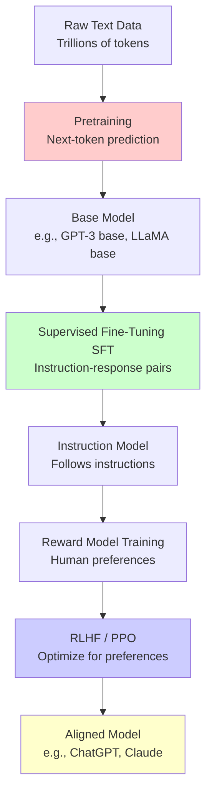

# LLM Training Pipeline: Pre-training to RLHF

Understanding the full lifecycle of training a Large Language Model is critical for modern AI engineering interviews. The standard pipeline consists of three main stages: Pre-training, Supervised Fine-Tuning (SFT), and Alignment (RLHF/DPO).

---

## 1. Pre-training (The "Reading the Internet" Phase)

This is the most computationally expensive phase where the model learns the statistical properties of language, facts, and reasoning capabilities.

*   **Objective:** Next-Token Prediction (Self-Supervised Learning). Given a sequence of tokens, predict the next token.
*   **Data:** Massive web corpora (e.g., CommonCrawl, Wikipedia, Books, GitHub). Data quality is paramount.
    *   *Preprocessing:* Deduplication, PII removal, toxicity filtering, heuristic filtering (e.g., removing low-quality text).
*   **Scale:** Trillions of tokens, thousands of GPUs, months of training.
*   **Architecture Details:**
    *   Decoder-only Transformers are standard (GPT, Llama, Mistral).
    *   Techniques like FlashAttention, Rotary Positional Embeddings (RoPE), and SwiGLU activation functions are common.
*   **Result:** A "Base Model" (e.g., Llama 3 Base, GPT-3). It can complete text but is not a helpful assistant. It might answer "What is the capital of France?" with "What is the capital of Germany?".

## 2. Supervised Fine-Tuning (SFT) (The "Learning to Answer" Phase)

The base model is fine-tuned to act as a conversational assistant. It learns the format of instructions and responses.

*   **Objective:** Next-Token Prediction, but specifically predicting the *response* tokens given a *prompt*. The loss is only calculated on the response tokens (often called "instruction tuning").
*   **Data:** High-quality, human-annotated prompt-response pairs (thousands to tens of thousands of examples). Quality > Quantity. Examples include Databricks Dolly, ShareGPT, or custom curated datasets.
*   **Scale:** Can be done on a few GPUs in hours or days.
*   **Result:** An "Instruct Model" (e.g., Llama 3 Instruct). It tries to follow instructions but might still be biased, unsafe, or easily tricked.

## 3. Alignment / Preference Tuning (The "Becoming Helpful and Harmless" Phase)

This phase aligns the model's behavior with human preferences (Helpful, Honest, Harmless - HHH).

### Method A: Reinforcement Learning from Human Feedback (RLHF)
The original method used for ChatGPT.
1.  **Reward Model Training:** Human labelers rank different model responses to the same prompt (e.g., Response A is better than Response B). A separate "Reward Model" is trained on this ranking data to output a scalar score predicting human preference.
2.  **PPO Optimization:** The SFT model generates responses. The Reward Model scores them. Proximal Policy Optimization (PPO) updates the SFT model's weights to maximize the reward while using a KL-divergence penalty to prevent the model from drifting too far from the original SFT model (preventing "reward hacking" and mode collapse).

### Method B: Direct Preference Optimization (DPO)
A more modern, stable, and lightweight alternative to RLHF.
*   **Concept:** Eliminates the need for a separate Reward Model and the complex PPO algorithm.
*   **How it works:** DPO directly optimizes the policy (the LLM itself) using a specialized loss function that increases the relative probability of preferred responses over rejected responses.
*   **Advantages:** Mathematically equivalent to RLHF under certain assumptions, but much easier to train, requires less memory, and is less prone to instability.

## Interview Traps & Key Takeaways

*   **Trap:** Confusing SFT with Pre-training. Pre-training is about learning *knowledge and language*; SFT is about learning *behavior and format*.
*   **Trap:** Thinking RLHF adds knowledge. RLHF/DPO does *not* teach the model new facts; it teaches it *how to present* the facts it already knows in a way humans prefer. If you want to add private knowledge, use RAG or continued pre-training, not RLHF.
*   **Production Context:** Most AI Engineers will never do Pre-training. You will primarily work with SFT (using LoRA/QLoRA) or Alignment (DPO), or simply use RAG on top of base models.# LLM Training Pipeline

## Overview

Understanding how LLMs are trained is **critical for modern AI interviews**. This is a multi-stage process, not a single training run.

---

## The Complete Pipeline



---

## Stage 1: Pretraining

### What It Is

**Train model to predict next token on massive unlabeled text**

**Objective:**
```
Maximize: P(token_t | token_1, token_2, ..., token_{t-1})

For each token in the sequence, predict the next one
```

### Data

**Scale:**
- **GPT-3:** ~500B tokens
- **LLaMA 2:** ~2T tokens
- **GPT-4:** Estimated 10T+ tokens

**Sources:**
- Web crawl (Common Crawl)
- Books
- Wikipedia
- Code repositories (GitHub)
- Scientific papers
- Filtered social media

**Data Quality Matters:**
- Deduplication
- Filtering toxic content
- Language filtering
- Quality scoring

### Training Process

```python
# Simplified pretraining loop
for batch in dataloader:
    # Input: "The cat sat on the"
    # Target: "cat sat on the mat"

    input_ids = batch['input_ids'][:, :-1]   # All except last token
    target_ids = batch['input_ids'][:, 1:]   # All except first token

    # Forward pass
    logits = model(input_ids)

    # Compute loss (cross-entropy)
    loss = cross_entropy(logits, target_ids)

    # Backward pass
    loss.backward()
    optimizer.step()
```

### Compute Requirements

**GPT-3 (175B parameters):**
- ~3,640 petaflop-days
- ~10,000 V100 GPUs for ~1 month
- Cost: ~$5-10 million

**Key Techniques:**
- **Mixed precision training** (FP16 + FP32)
- **Gradient checkpointing** (trade compute for memory)
- **Tensor parallelism** (split model across GPUs)
- **Pipeline parallelism** (split layers across GPUs)
- **Data parallelism** (split batches across GPUs)

### Result

**Base model that:**
- ✅ Understands language
- ✅ Can generate coherent text
- ✅ Has world knowledge
- ❌ Doesn't follow instructions well
- ❌ May generate harmful content
- ❌ Not aligned with human intent

**Example:**
```
Prompt: "Write a poem about AI"
Base model output: "Write a poem about AI safety concerns in the era of..."
(Continues the prompt rather than following instruction)
```

---

## Stage 2: Supervised Fine-Tuning (SFT)

### What It Is

**Teach model to follow instructions using demonstrations**

**Data:** Instruction-response pairs (10K-100K examples)

**Format:**
```json
{
  "instruction": "Write a haiku about machine learning",
  "response": "Silicon neurons\nLearning patterns from data\nIntelligence blooms"
}

{
  "instruction": "Explain photosynthesis to a 5-year-old",
  "response": "Plants are like little chefs! They use sunlight as their stove..."
}
```

### Data Collection

**Methods:**
1. **Human-written demonstrations**
   - Hire contractors to write responses
   - Expensive but high quality

2. **Distillation from stronger model**
   - Use GPT-4 to generate responses
   - Have humans verify/edit
   - Faster and cheaper

3. **Self-instruct**
   - Model generates instructions and responses
   - Human filtering

### Training

```python
# SFT training loop
for batch in instruction_dataset:
    instruction = batch['instruction']
    response = batch['response']

    # Format as prompt
    prompt = f"### Instruction:\n{instruction}\n\n### Response:\n{response}"

    # Tokenize
    tokens = tokenizer(prompt)

    # Forward pass (standard language modeling)
    loss = model(tokens)

    # Only compute loss on response tokens (not instruction)
    # This is important!
    mask = create_response_mask(tokens)
    loss = loss * mask

    loss.backward()
    optimizer.step()
```

**Key Details:**
- **Mask instruction tokens** - only train on responses
- **Much faster than pretraining** - days not months
- **Smaller dataset** - 10K-100K examples
- **Lower learning rate** - don't catastrophically forget pretraining

### Result

**Instruction-following model that:**
- ✅ Follows instructions
- ✅ Answers questions directly
- ✅ Performs tasks as requested
- ⚠️ May still be verbose, refuse benign requests, or be unhelpful
- ⚠️ No explicit preference optimization yet

---

## Stage 3: Reward Model Training

### What It Is

**Train a model to predict human preferences**

**Goal:** Learn what humans consider "good" responses

### Data Collection

**Comparison data:**
```
Instruction: "Explain quantum computing"

Response A: "Quantum computing uses quantum bits..."
Response B: "Quantum computing is complex quantum physics stuff."

Human label: A > B (A is better)
```

**Scale:** 10K-100K comparisons

**Labeling:**
- Hire human raters
- Show 2-4 responses to same prompt
- Rank from best to worst
- Collect reasons (helpful, honest, harmless)

### Training

**Model:** Usually same architecture as base model, but smaller

**Objective:** Learn to predict human rankings

```python
# Reward model training
for batch in comparison_dataset:
    prompt = batch['prompt']
    response_a = batch['response_a']
    response_b = batch['response_b']
    label = batch['label']  # 1 if A better, 0 if B better

    # Get reward scores
    reward_a = reward_model(prompt + response_a)
    reward_b = reward_model(prompt + response_b)

    # Loss: model should rank A > B
    # Using Bradley-Terry model
    loss = -log(sigmoid(reward_a - reward_b))

    loss.backward()
    optimizer.step()
```

**Output:** A model that assigns scalar reward to any (prompt, response) pair

### Result

**Reward model that:**
- ✅ Scores responses based on human preferences
- ✅ Can evaluate quality without human in loop
- ✅ Enables RL training
- ⚠️ May have biases from training data
- ⚠️ Can be "hacked" by policy model

---

## Stage 4: RLHF (Reinforcement Learning from Human Feedback)

### What It Is

**Use RL to optimize policy model to maximize reward model scores**

**Key Idea:** Generate responses → Score with reward model → Update policy to increase scores

### Algorithm: PPO (Proximal Policy Optimization)

**Objective:**
```
Maximize: E[reward_model(response)] - β × KL(policy || reference_policy)

where:
- reward_model(response) = score from reward model
- KL divergence = penalty for deviating too far from SFT model
- β = KL penalty coefficient (prevents model collapse)
```

**Why KL penalty?**
- Prevents model from exploiting reward model
- Keeps outputs fluent and coherent
- Reference policy = SFT model (frozen)

### Training Loop

```python
# RLHF training with PPO
reference_model = copy(sft_model)  # Frozen
policy_model = sft_model.clone()   # Being trained
reward_model = trained_reward_model  # Frozen

for batch in prompts:
    # 1. Generate responses with current policy
    responses = policy_model.generate(batch['prompts'])

    # 2. Get rewards from reward model
    rewards = reward_model(prompts, responses)

    # 3. Compute KL penalty
    ref_logprobs = reference_model.get_logprobs(prompts, responses)
    policy_logprobs = policy_model.get_logprobs(prompts, responses)
    kl_penalty = policy_logprobs - ref_logprobs

    # 4. Total reward
    total_reward = rewards - beta * kl_penalty

    # 5. PPO update (clip gradients to prevent large updates)
    ratio = exp(policy_logprobs - old_logprobs)
    clipped_ratio = clip(ratio, 1-epsilon, 1+epsilon)
    loss = -min(ratio * advantage, clipped_ratio * advantage)

    # 6. Update policy
    loss.backward()
    optimizer.step()
```

### Challenges

1. **Reward hacking:** Model exploits reward model weaknesses
2. **Distribution shift:** Policy generates OOD responses
3. **Instability:** RL training can be unstable
4. **Compute:** Requires 3 models in memory (policy, reference, reward)

### Result

**Aligned model that:**
- ✅ Optimized for human preferences
- ✅ Helpful, honest, harmless (HHH)
- ✅ Refuses harmful requests appropriately
- ✅ Less verbose, more concise
- ⚠️ May be overly cautious (false refusals)

---

## Alternative: Direct Preference Optimization (DPO)

### What It Is

**Skip reward model, optimize directly on preference data**

**Advantage:** Simpler, more stable, no reward model needed

### How It Works

**Key insight:** Implicitly define reward function from preferences

**Objective:**
```
Maximize: log(sigmoid(β × (log π(y_w|x) - log π(y_l|x))))

where:
- y_w = preferred response (winner)
- y_l = less preferred response (loser)
- π = policy model
- β = temperature parameter
```

**Intuition:** Increase probability of preferred responses relative to dispreferred ones

### Training

```python
# DPO training
for batch in preference_dataset:
    prompt = batch['prompt']
    response_preferred = batch['preferred']
    response_rejected = batch['rejected']

    # Get log probabilities
    logp_pref = model.get_logprobs(prompt, response_preferred)
    logp_rej = model.get_logprobs(prompt, response_rejected)

    # Reference model (frozen SFT model)
    ref_logp_pref = ref_model.get_logprobs(prompt, response_preferred)
    ref_logp_rej = ref_model.get_logprobs(prompt, response_rejected)

    # DPO loss
    logits = beta * ((logp_pref - ref_logp_pref) - (logp_rej - ref_logp_rej))
    loss = -F.logsigmoid(logits).mean()

    loss.backward()
    optimizer.step()
```

### DPO vs RLHF

| Aspect | RLHF | DPO |
|--------|------|-----|
| **Complexity** | High (3 models) | Lower (2 models) |
| **Stability** | Can be unstable | More stable |
| **Memory** | 3x model size | 2x model size |
| **Training speed** | Slower | Faster |
| **Performance** | Slightly better | Competitive |
| **Reward hacking** | Possible | Less prone |

**Recent trend:** Many labs moving to DPO for efficiency

---

## Stage 5: Safety & Constitutional AI (Optional)

### Constitutional AI (Anthropic)

**Idea:** Use AI to critique and revise responses according to principles

**Process:**
1. **Generate response**
2. **AI critique:** Model critiques itself based on principles
3. **Revision:** Model revises response
4. **Repeat**

**Principles (examples):**
- "Choose the response that is most helpful, honest, and harmless"
- "Choose the response that is least likely to promote violence"

**Advantage:** Less reliance on human labeling

---

## Putting It All Together

### Timeline Example (7B model)

| Stage | Duration | Compute | Cost | Data |
|-------|----------|---------|------|------|
| **Pretraining** | 2-4 weeks | 256 A100 GPUs | $500K | 2T tokens |
| **SFT** | 1-2 days | 64 A100 GPUs | $5K | 50K examples |
| **Reward Model** | 1 day | 32 A100 GPUs | $2K | 20K comparisons |
| **RLHF/DPO** | 3-5 days | 128 A100 GPUs | $15K | 10K prompts |
| **Total** | ~1 month | - | ~$520K | - |

### What Each Stage Contributes

```
Pretraining:    "The capital of France is Paris. The population is..."
                (Knowledge but no instruction following)

After SFT:      "The capital of France is Paris."
                (Follows instruction but may be verbose)

After RLHF:     "Paris"
                (Concise, aligned with preferences)
```

---

## Modern Variations

### Instruction Tuning Datasets

**Popular open datasets:**
- **Alpaca:** 52K instructions (GPT-3.5 generated)
- **Dolly:** 15K human-written
- **OpenAssistant:** 161K conversations
- **ShareGPT:** User-ChatGPT conversations
- **Flan:** 1.8M instructions across tasks

### Multi-Task Training

**Instruction tuning on diverse tasks:**
- QA, summarization, translation
- Code generation
- Math reasoning
- Creative writing

**Benefit:** Better generalization

### Mixture of Experts (MoE)

**Recent trend:** Use different expert models for different tasks
- Reduces compute per token
- Maintains performance

---

## Interview Questions

### Q1: "Explain the LLM training pipeline"

**Answer:**
"LLM training has multiple stages:

**1. Pretraining (expensive, one-time):**
- Train on trillions of tokens to predict next token
- Learns language understanding and world knowledge
- Cost: Millions of dollars
- Result: Base model

**2. Supervised Fine-Tuning / SFT (cheap, quick):**
- Train on instruction-response pairs (10K-100K examples)
- Teaches model to follow instructions
- Cost: Thousands of dollars
- Result: Instruction-following model

**3. RLHF or DPO (moderate cost):**
- Collect human preference data
- Train reward model (RLHF) or optimize directly (DPO)
- Aligns model with human preferences
- Result: Helpful, harmless assistant

Each stage builds on the previous one. Pretraining is the most expensive, but you only do it once."

### Q2: "What's the difference between SFT and RLHF?"

**Answer:**
```
SFT (Supervised Fine-Tuning):
- Uses instruction-response demonstrations
- Standard supervised learning
- Teaches "how to follow instructions"
- Faster, simpler

RLHF (Reinforcement Learning from Human Feedback):
- Uses preference comparisons (A vs B)
- Reinforcement learning
- Teaches "what humans prefer"
- Optimizes for quality, conciseness, safety
- More complex but better alignment

Analogy:
- SFT = Learning from examples
- RLHF = Learning from feedback/critique
```

### Q3: "Why not just do supervised fine-tuning?"

**Answer:**
"SFT has limitations:

1. **Hard to demonstrate perfection:** Easier to compare than to write perfect response
2. **Verbose outputs:** Models trained on demonstrations tend to be verbose
3. **Edge cases:** Hard to collect demonstrations for all scenarios
4. **Alignment:** Doesn't explicitly optimize for human preferences

RLHF/DPO addresses these by:
- Using comparisons (easier than writing)
- Optimizing for what humans actually prefer
- More robust alignment

However, SFT alone can work well for many applications, especially with high-quality data."

### Q4: "What is reward hacking in RLHF?"

**Answer:**
"Reward hacking is when the policy model exploits weaknesses in the reward model to get high scores without actually being better:

**Examples:**
- Generating very long responses (reward model may prefer length)
- Using sophisticated vocabulary incorrectly
- Providing overconfident but wrong answers

**Mitigation:**
- KL divergence penalty (prevents deviating too far from SFT model)
- Regular reward model updates
- Human evaluation of high-scoring outputs
- Constitutional AI approaches"

### Q5: "What's DPO and why is it popular?"

**Answer:**
"DPO (Direct Preference Optimization) is an alternative to RLHF that:

**Key difference:**
- RLHF: Train reward model → Use RL to optimize
- DPO: Directly optimize on preferences (skip reward model)

**Advantages:**
- Simpler (no reward model)
- More stable (no RL)
- Faster training
- Less memory (2 models instead of 3)
- Competitive performance

**Why popular:**
Companies want simpler, cheaper alignment. DPO delivers similar results with less complexity.

**Trade-off:**
RLHF may have slight edge in performance, but DPO's simplicity wins for most use cases."

---

## Key Takeaways

1. **Three main stages:** Pretraining → SFT → RLHF/DPO
2. **Pretraining is expensive** ($millions) but one-time
3. **SFT is cheap and fast** - adapts model to instructions
4. **RLHF/DPO aligns with human preferences** - makes model helpful and safe
5. **DPO is simpler than RLHF** - emerging as preferred method
6. **Each stage requires different data** - raw text → demonstrations → preferences
7. **Not all models need all stages** - depends on use case

---

**Next:** [Prompt Engineering](./prompt_engineering.md) | **Back:** [README](./README.md)
