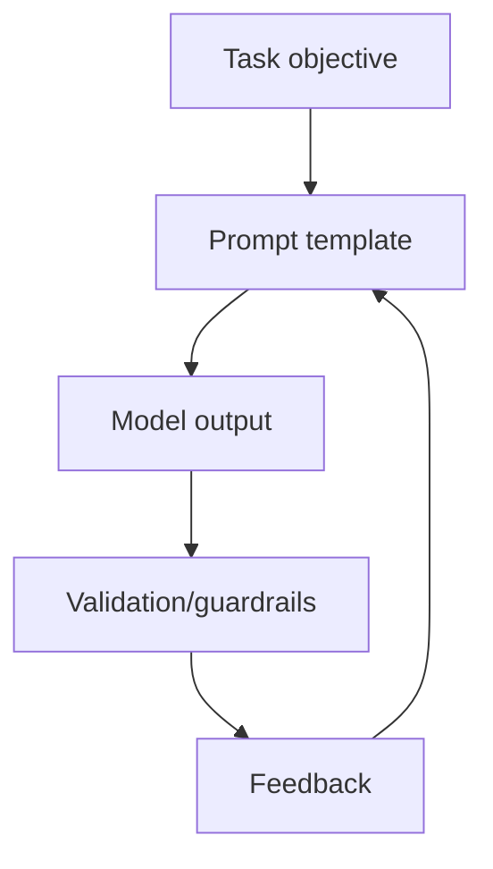

# Prompt Engineering Deep Dive

## Why prompt engineering matters
Prompt design controls behavior, reliability, cost, and safety for LLM systems without retraining.



## Core patterns
- Zero-shot: direct instruction.
- Few-shot: include examples matching edge cases.
- System prompt: policy and role constraints.

## Advanced reasoning patterns
- Chain-of-thought (CoT): asks model to reason stepwise.
- Zero-shot CoT: "Let's think step by step".
- Self-consistency: sample multiple CoT paths and vote.
- Tree-of-thought: branch and evaluate reasoning states.
- ReAct: reasoning + tool action loop.
- PAL: generate code to compute precise answers.

## Structured outputs
- JSON mode or schema-constrained decoding.
- Function/tool calling with JSON schema.
- Parser-level validation and retry on format violation.

## Prompt optimization
- A/B prompt testing.
- Prompt version control.
- Automatic prompt search (APE, DSPy-style compilation).

## Prompt injection and defenses
- Input sanitization.
- Context separation (untrusted vs trusted text).
- Instruction hierarchy enforcement.
- Output filtering and allowlists for tool calls.

## Interview questions
1. How do you evaluate prompt quality?
2. How prevent prompt injection in production?
3. When to fine-tune vs prompt-engineer?

## Example: robust structured prompt
```python
SYSTEM = """
You are a logistics support assistant.
Always return strict JSON with keys: answer, confidence, citations.
If evidence is insufficient, answer='I do not know'.
"""

USER_TMPL = """
Question: {question}
Retrieved context:
{context}
"""
```

## Business-focused checklist
- latency budget
- token budget
- failure fallback
- escalation threshold
- observability and prompt drift tracking
