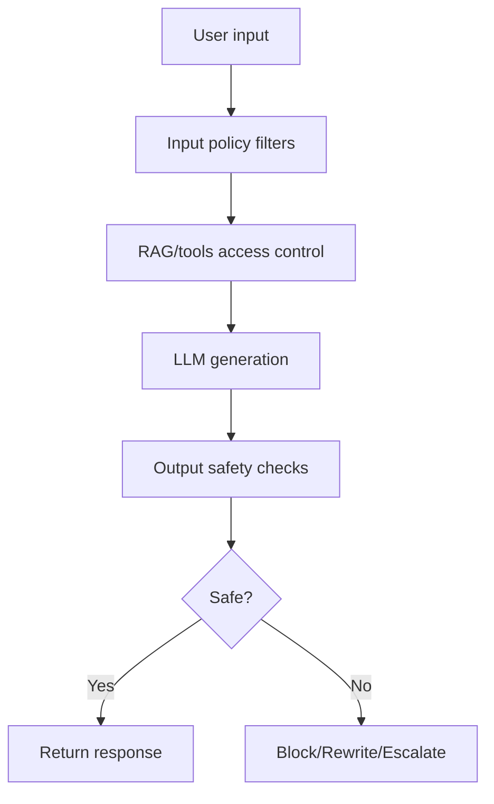

# LLM Safety and Guardrails

## Threat model
- Prompt injection
- Jailbreak attempts
- Data exfiltration
- Toxic or policy-violating outputs
- Hallucinated high-risk guidance

## Guardrail layers
1. Input guardrails (classification, PII detection).
2. Retrieval guardrails (scope and access control).
3. Generation constraints (system policies, structured outputs).
4. Output guardrails (toxicity/factual checks).
5. Human escalation.



## Enterprise compliance concerns
- GDPR/CCPA: PII minimization and retention control.
- HIPAA-like regulated domains: strict access and audit logs.
- Auditability: retain traces of sources and model version.

## Techniques
- Constitutional principles.
- RLHF-aligned instruction tuning.
- Allowlist function calling.
- Sandboxed tool execution.
- Adversarial red-team evaluation.

## Interview questions
1. How prevent prompt injection in production?
2. What guardrails for customer support bots?
3. Safety vs utility tradeoff examples?

## Minimal policy check pseudo-code
```python
def guardrail_check(user_text, model_output):
    if contains_pii(user_text):
        user_text = redact(user_text)
    if policy_violation(model_output):
        return "I can't help with that request.", "blocked"
    return model_output, "ok"
```
