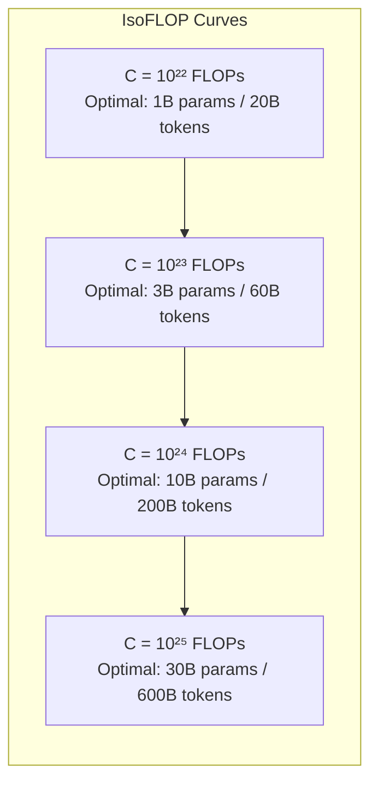
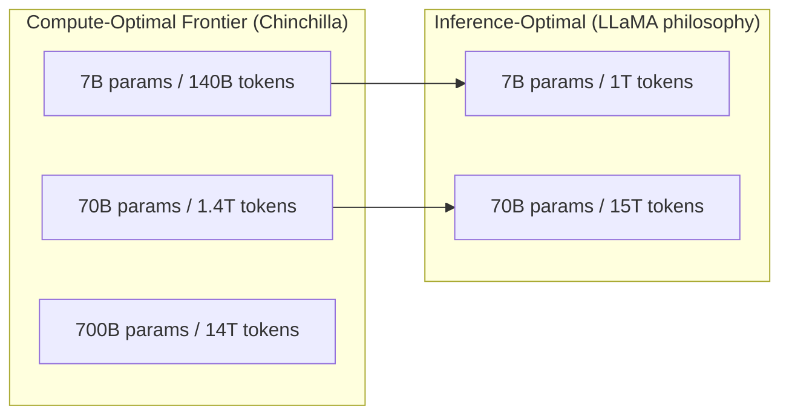

# Scaling Laws for Large Language Models

Scaling laws are the quantitative relationships between model size, training data, compute budget, and model performance. Understanding these laws is essential for making principled decisions about how to allocate resources for training and why modern LLMs are designed the way they are.

---

## The Central Question

**If you have a fixed compute budget, how should you allocate it between model parameters and training tokens?**

This question — deceptively simple — required two landmark papers to answer properly, and the answer changed the entire trajectory of LLM development.

---

## Part 1: Kaplan et al. 2020 — The Original Scaling Laws

**Paper:** "Scaling Laws for Neural Language Models" (Kaplan et al., OpenAI, 2020)

### The Core Finding

Performance (measured by cross-entropy loss on held-out text) follows **power laws** with respect to three quantities:

$$L(N) \approx \left(\frac{N_c}{N}\right)^{\alpha_N}, \quad L(D) \approx \left(\frac{D_c}{D}\right)^{\alpha_D}, \quad L(C) \approx \left(\frac{C_c}{C}\right)^{\alpha_C}$$

Where:
- $N$ = number of non-embedding parameters
- $D$ = dataset size in tokens
- $C$ = compute used in FLOPs
- $\alpha_N \approx 0.076$, $\alpha_D \approx 0.095$, $\alpha_C \approx 0.050$ (from the paper)
- $N_c$, $D_c$, $C_c$ are constants determined empirically

**Key results:**
1. Loss decreases predictably and smoothly as a power law in N, D, and C
2. The improvement from scale shows no sign of plateauing within the range studied
3. Architecture details (depth vs. width, attention heads) matter far less than raw scale
4. For a fixed compute budget, model size matters more than training data

### The Compute-Optimal Training Claim

Kaplan et al. found that for a fixed compute budget $C$, the optimal strategy is to scale model size $N$ roughly as $N^* \propto C^{0.73}$, with the training tokens $D \propto C^{0.27}$.

**Implication:** Scale the model faster than the data. Train large models on relatively few tokens.

This led to the design philosophy of GPT-3: 175B parameters trained on "only" 300B tokens.

### The Architecture-Agnosticism Finding

One of the most practically important results: within transformer architectures, the specific choices of depth, width, number of heads, and feedforward ratio **barely matter** as long as the total parameter count is fixed.

The bitter lesson in practice: engineers spent years searching for clever architectures, and the answer was "just use more parameters."

---

## Part 2: Chinchilla — Hoffmann et al. 2022

**Paper:** "Training Compute-Optimal Large Language Models" (Hoffmann et al., DeepMind, 2022)

This paper corrected a critical error in the Kaplan et al. analysis and fundamentally changed how LLMs are designed.

### What Chinchilla Found

Hoffmann et al. conducted a much more careful analysis using three different estimation approaches:
1. Fixed compute budget, vary N and D
2. IsoFLOP profiles: fix compute and find the minimum loss achievable
3. Parametric model fitting

**All three methods agreed:** The Kaplan et al. estimate was wrong about the optimal allocation.

**The Chinchilla result:**

$$N^* \propto C^{0.5}, \quad D^* \propto C^{0.5}$$

Both model size and training tokens should scale **equally** with compute. The exponent changed from 0.73/0.27 to 0.5/0.5.

**Optimal tokens-to-parameters ratio:**

$$D^* \approx 20 \times N$$

For a model with N parameters, the compute-optimal number of training tokens is approximately 20N.

### Why GPT-3 Was Undertrained

| Model | Parameters | Training Tokens | Chinchilla-Optimal Tokens |
|-------|-----------|-----------------|--------------------------|
| GPT-3 | 175B | 300B | ~3.5T |
| Gopher | 280B | 300B | ~5.6T |
| Megatron-Turing | 530B | 270B | ~10.6T |
| Chinchilla | 70B | 1.4T | ~1.4T (on budget) |

GPT-3 with 175B parameters should have been trained on 3.5 trillion tokens to be compute-optimal. It was trained on only 300B — roughly 10× too few. All previous large models were in the same boat.

**The Chinchilla model itself:** 70B parameters, 1.4T training tokens. Despite being 2.5× smaller than Gopher (280B), Chinchilla dramatically outperformed it on nearly all benchmarks because it was compute-optimally trained.

### The Chinchilla Scaling Law

More precisely, the optimal parameter count and token count given a compute budget $C$ are:

$$N^*(C) = G \cdot \left(\frac{C}{6}\right)^{0.5}, \quad D^*(C) = \frac{C}{6 \cdot N^*(C)}$$

Where $G \approx \frac{A^{0.5}}{B^{0.5}}$ from the parametric fitting of the loss surface.

The loss at compute-optimal training:

$$L(C) = E + \frac{A}{N^*(C)^{\alpha}} + \frac{B}{D^*(C)^{\beta}}$$

Where $E$ is the irreducible entropy of natural language, $A$, $B$, $\alpha$, $\beta$ are fitted constants.

### The Loss Surface

Each horizontal slice at fixed compute shows a U-shaped loss curve when you vary the split between N and D. The minimum of each curve traces the Chinchilla-optimal line.

---

## Part 3: Emergent Capabilities

### What Are Emergent Capabilities?

**Definition (Wei et al., 2022):** An ability is "emergent" if it is not present in smaller models but is present in larger models, in a way that is not predicted by simply extrapolating from smaller models.

Formally: a task exhibits emergence if its performance is near random for models below a threshold size, then rapidly improves to well-above-random at or above that threshold.

### Examples of Emergent Capabilities

| Capability | Approximate Scale Threshold |
|-----------|---------------------------|
| Arithmetic (3-digit addition) | ~10²²-10²³ FLOPs |
| Analogical reasoning | ~10²³ FLOPs |
| Chain-of-thought reasoning | ~10²³ FLOPs (with prompting) |
| Multi-step math (GSM8K) | ~10²³-10²⁴ FLOPs |
| Instruction following | ~10²³ FLOPs |
| BIG-Bench tasks (many) | varies, 10²²-10²⁴ FLOPs |
| Code generation | ~10²³ FLOPs |
| Theory of mind tasks | ~10²⁴ FLOPs |

### The Phase Transition Hypothesis

Many capabilities look like **phase transitions** — near-zero performance below a threshold, then rapid improvement. This is qualitatively different from the smooth power-law scaling of perplexity.

**Why do emergent capabilities appear suddenly?**

Hypothesis 1 (Decomposition): Complex tasks require multiple simpler sub-skills. Each sub-skill scales smoothly. But the composite task only works when ALL sub-skills are simultaneously present. The probability of all sub-skills being above threshold simultaneously creates a sharp threshold effect.

Hypothesis 2 (Measurement artifact): Many benchmarks use discrete metrics (correct/incorrect on multiple choice). The underlying capability may be improving smoothly, but only passes the discrete threshold at a certain scale. (This was argued by Schaeffer et al., 2023 — "Are Emergent Abilities of Large Language Models a Mirage?")

**The debate:** Schaeffer et al. showed that emergence often disappears when you use smooth (probabilistic) metrics instead of discrete (correct/wrong) metrics. This suggests many "emergent" phenomena are measurement artifacts. However, qualitatively new behaviors (e.g., in-context learning, multi-step reasoning) do appear to emerge in practice.

### In-Context Learning as an Emergent Capability

**In-context learning (ICL):** The ability to learn new tasks from a few examples in the prompt, without any gradient updates.

GPT-1 and GPT-2 showed essentially no ICL capability. GPT-3 (175B) showed strong ICL. This appears to be genuinely emergent — not just a measurement artifact.

**Why does ICL emerge?**
- Hypothesis: Large models learn to implement gradient descent implicitly within their forward pass (Akyürek et al., 2022; Garg et al., 2022)
- The model learns a "learning algorithm" during pretraining
- The attention layers form a meta-optimizer that adapts to the demonstrated distribution

---

## Part 4: The Bitter Lesson

Richard Sutton's 2019 essay "The Bitter Lesson" is the philosophical backbone of the scaling era.

**The bitter lesson:** The methods that have worked best in AI have been those that leverage computation, rather than those that incorporate human domain knowledge. Every time researchers have tried to inject structure, knowledge, or inductive biases, compute-general methods have eventually caught up and surpassed them.

**Examples:**
- Chess: hand-crafted evaluation functions → deep search → neural nets + search (AlphaZero)
- Go: domain knowledge (territory, ladders) → MCTS + value networks → scale
- Speech recognition: phoneme models, HMMs → end-to-end neural networks
- NLP: parse trees, grammar rules, WordNet → pretrained transformers + scale

**The implication for LLMs:** Rather than engineering clever architectures with inductive biases for language (hierarchical structure, syntax trees, semantic composition), simply scale the generic transformer. It works better.

**The counterargument (not disproven, but the bet is losing):** Scale has fundamental limits. At some point, data runs out, compute runs out, or the transformer architecture cannot represent certain concepts efficiently. Structured approaches may win at the frontier. This is still an open question.

---

## Part 5: Compute-Optimal vs. Inference-Optimal Training

Chinchilla solved compute-optimal training. But compute-optimal is not the same as **deployment-optimal**.

### The Meta LLaMA Insight

If your goal is to deploy a model to millions of users, the cost of inference dominates over the cost of training. Training is a one-time cost; inference is an ongoing cost.

**Inference cost scales with model size.** A 70B model costs roughly 10× more per inference than a 7B model.

**Inference-optimal strategy:** Train a smaller model on far more tokens than Chinchilla-optimal. The model will be "overtrained" relative to compute budget, but it will be cheaper to serve at inference time.

**LLaMA 1 (Touvron et al., 2023):** Explicitly designed for inference efficiency.
- LLaMA 7B trained on 1T tokens (Chinchilla optimal would be ~140B tokens)
- LLaMA 13B trained on 1T tokens
- LLaMA 65B trained on 1.4T tokens
- The key insight: a 7B model trained on 1T tokens reaches the same loss as a 13B model trained on 200B tokens, but is 2× cheaper at inference

**LLaMA 3 (Meta, 2024):**
- LLaMA 3 8B: trained on 15T tokens (107× Chinchilla optimal)
- LLaMA 3 70B: trained on 15T tokens (21× Chinchilla optimal, closer to optimal)
- LLaMA 3 405B: trained on 15T tokens
- LLaMA 3 8B outperforms LLaMA 2 70B despite being 9× smaller

### The Tradeoff Framework

| Strategy | Training Compute | Model Size | Inference Cost | Performance at size |
|----------|-----------------|-----------|----------------|---------------------|
| Chinchilla-optimal | Minimal for target loss | Large | High | Maximum for compute |
| Inference-optimal | Higher (intentional overtraining) | Small | Low | Maximum for size |
| Overparameterized (old GPT-3 style) | High | Large | High | Below Chinchilla |

**Decision rule:**
- Research: use Chinchilla-optimal (minimize compute for a given loss)
- Production/deployment: use inference-optimal (maximize quality given a serving cost budget)

---

## Part 6: Data Scaling Limits

### The Data Wall Hypothesis

As of 2024-2025, there is increasing concern that high-quality internet data is running low.

**Estimates:**
- Total English web data: ~5-10T high-quality tokens (after deduplication and filtering)
- LLaMA 3 used 15T tokens, suggesting some repetition even now
- GPT-4 and other frontier models likely use 10-15T+ tokens

**The data wall:** If scaling requires proportionally more data, and data supply is finite, we will hit a wall where more parameters don't help because there's no new data to train on.

### Responses to Data Scarcity

**Synthetic data generation:**
- Use LLMs to generate training data (self-play, distillation)
- Phi series (Microsoft): trained 1.3B-7B models mostly on synthetic "textbook quality" data
- Phi-1.5B matches much larger models on reasoning benchmarks
- Limitations: model collapse (iterative self-training degrades quality)

**Multi-epoch training:**
- Process the same data multiple times (already standard for SFT)
- For pretraining: multiple epochs hurt slightly but can be mitigated with regularization
- MosaicML found mild repetition (2-4 epochs) is acceptable with appropriate regularization

**Alternative data sources:**
- Mathematical reasoning: synthetic math problem generators
- Code: synthetic code generation, test suites
- Science: curated scientific literature
- Proprietary data: legal documents, medical records, enterprise data

**The Model Collapse Problem:**
When models train on AI-generated data iteratively, the tails of the distribution (rare, creative, unusual outputs) shrink. After many iterations, the model produces only generic, average outputs. This is a fundamental limit on synthetic data approaches.

**The research frontier:** Data mix optimization, quality-weighted data selection (rather than pure scale), and synthetic data quality control are active research areas as of 2025.

---

## Part 7: Scaling Laws Beyond Text

### Code Scaling

Code scaling laws differ from text:
- HumanEval (code generation) scales much more steeply with model size than MMLU
- Code is more "compressible" — a small amount of high-quality code goes far
- Chain-of-thought ability (required for complex code) emerges at higher scales

**CodeBERT, CodeT5, StarCoder, DeepSeek-Coder:** Specialized code models that demonstrate code scaling follows different laws than natural language.

### Multimodal Scaling

**LLaVA, GPT-4V, Gemini:** Multimodal models add image encoders to text transformers.

Image scaling laws:
- Visual capability scales with image encoder scale + LLM scale
- The "visual instruction tuning" dataset quality matters more than scale (similar to LIMA for text)
- There is no clear equivalent to Chinchilla for multimodal models yet

### The Scaling Hypothesis (Scaling to AGI)

The scaling hypothesis (Gwern, Sutton, others): if we continue to scale compute and data, we will achieve AGI. Intelligence is a function that can be learned from data with sufficient scale.

**Evidence for:** GPT-4 shows qualitative differences from GPT-3; emerging reasoning capabilities with o1/o3
**Evidence against:** Even large models fail on simple counting tasks, spatial reasoning, physical intuition — tasks that seem to require different inductive biases

---

## Part 8: Diminishing Returns and Open Questions

### Where Are the Diminishing Returns?

The power law scaling is remarkably consistent but has an irreducible floor: the entropy of natural language itself.

$$L(N \to \infty, D \to \infty) = E_\infty > 0$$

The best possible language model (with infinite compute and data) still has irreducible uncertainty — natural language is fundamentally ambiguous. Current estimates put $E_\infty$ around 1.5-2.0 nats (for English).

**Current frontier models (GPT-4 class)** are estimated to be within 1-2 nats of this limit on standard benchmarks. Further scaling may have diminishing returns on perplexity while still improving specific capabilities.

### Scaling vs. Reasoning

OpenAI's o1 and o3 models (2024-2025) introduced a new scaling dimension: **test-time compute**.

Rather than training a bigger model, allocate more compute at inference time — let the model "think" longer (via chain-of-thought search, MCTS, or iterative refinement).

**The new scaling regime:**
- Pretraining compute (training time)
- Test-time compute (inference time)
- Both can be scaled independently
- o3 on ARC-AGI: 87.5% using massive test-time compute vs. 25% for standard GPT-4

This opens an entirely new frontier beyond the data wall.

---

## Comparison: Kaplan vs. Chinchilla

| Aspect | Kaplan et al. 2020 | Chinchilla (Hoffmann et al. 2022) |
|--------|-------------------|---------------------------------|
| Optimal N scaling | $N^* \propto C^{0.73}$ | $N^* \propto C^{0.5}$ |
| Optimal D scaling | $D^* \propto C^{0.27}$ | $D^* \propto C^{0.5}$ |
| Token/param ratio | ~1.7 | ~20 |
| Recommendation | Scale model faster than data | Scale model and data equally |
| Models it justified | GPT-3 (175B, 300B tokens) | Chinchilla (70B, 1.4T tokens) |
| Key error | Fixed LR schedule across runs | Controlled for optimal training |
| Industry impact | Led to massive models | Led to smaller, better-trained models |

---

## Interview Questions

### "What are the Chinchilla scaling laws?"

**Strong answer:**
- Hoffmann et al. 2022 showed that compute-optimal training requires scaling model parameters and training tokens equally as compute scales (both proportional to $C^{0.5}$)
- The key practical result: train on ~20 tokens per parameter
- This contradicted Kaplan et al., who argued to scale models faster than data
- Chinchilla (70B, 1.4T tokens) outperformed Gopher (280B, 300B tokens) on nearly all tasks
- The practical implication: GPT-3 (175B, 300B tokens) was ~10× undertrained and could be matched by a ~35B model trained on 700B tokens

### "What is an emergent capability?"

**Strong answer:**
- A capability is emergent if it's near-random for smaller models but significantly above random for larger models, with a sharp transition
- Classic examples: 3-digit arithmetic, chain-of-thought reasoning, in-context learning
- The theoretical explanation: complex tasks require multiple sub-skills; all must be simultaneously present
- Schaeffer et al. (2023) argue some emergence is a measurement artifact — disappears with smooth metrics
- Genuine emergence (in-context learning, instruction following) does appear to be real and not just an artifact

### "Why was LLaMA designed the way it was?"

**Strong answer:**
- Meta designed LLaMA explicitly for inference efficiency, not compute-optimality
- Core insight: once training is done, inference cost dominates for deployed models
- LLaMA 7B trained on 1T tokens (7× Chinchilla-optimal) matches models 2-3× its size trained compute-optimally
- This makes LLaMA cheaper to serve at production scale
- LLaMA 3 pushed this further: 8B model trained on 15T tokens (107× Chinchilla), outperforms LLaMA 2 70B
- The result proved that "overtraining" small models is the right strategy for deployment

### "Where do scaling laws break down?"

**Strong answer:**
- The irreducible entropy floor: language model loss cannot go below the entropy of natural language
- Data scarcity: high-quality internet data is finite (~5-10T tokens), limiting pure data scaling
- Benchmark saturation: as models approach human performance, benchmarks become saturated
- Task-specific non-linearities: emergence means some capabilities don't scale smoothly
- The measurement problem: perplexity scales smoothly but task-specific performance may not
- Alternative scaling: test-time compute (o1/o3) opens new dimensions beyond pretraining scale

---

## Key Numbers to Memorize

| Fact | Value |
|------|-------|
| Chinchilla tokens/params ratio | ~20:1 |
| GPT-3 params / tokens | 175B / 300B (undertrained by ~10×) |
| Chinchilla params / tokens | 70B / 1.4T |
| LLaMA 3 8B training tokens | 15T (107× Chinchilla optimal) |
| Training compute rule of thumb | C ≈ 6ND FLOPs |
| Kaplan N scaling exponent | $C^{0.73}$ |
| Chinchilla N scaling exponent | $C^{0.5}$ |
| English web data (filtered) | ~5-10T high-quality tokens |
| Emergent ICL threshold | ~100B parameters |
