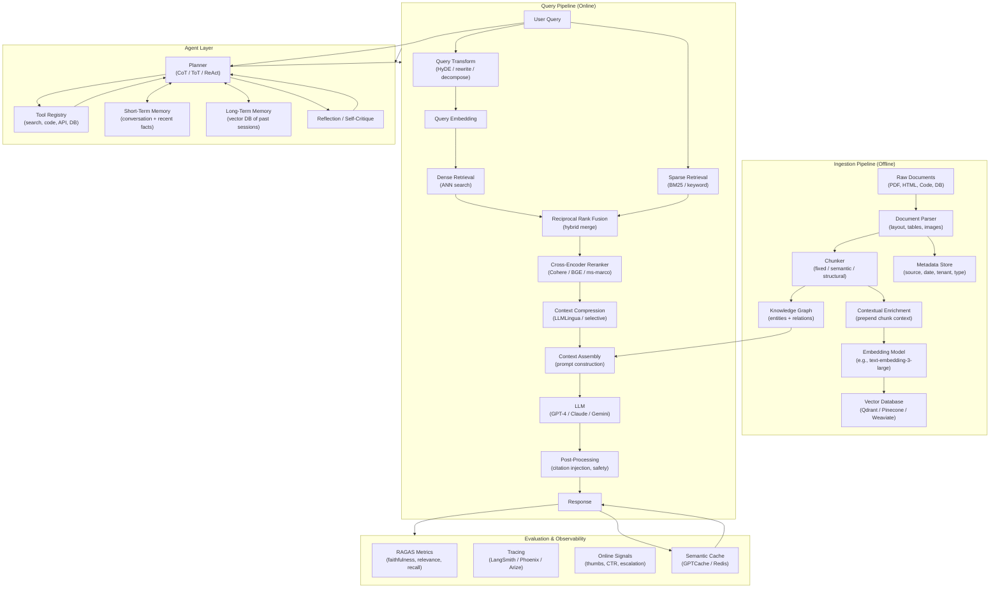

# RAG and Agent Systems

## Module Overview

This module covers Retrieval-Augmented Generation (RAG) and AI agent architectures at senior interview depth. These are among the most actively interviewed topics in applied AI/ML roles in 2024-2026, spanning ML engineer, AI engineer, and research engineer positions.

RAG has become the dominant architecture for grounding LLMs in proprietary or up-to-date knowledge. Agent systems extend LLMs with tools, memory, and planning for multi-step task execution. Together they form the backbone of production LLM applications.

---

## Study Order

Work through the files in the order below. Each file builds on concepts from the previous ones.

| Order | File | Core Concept | Estimated Study Time |
|-------|------|-------------|---------------------|
| 1 | `rag_fundamentals.md` | Why RAG, the full pipeline, major variants | 90 min |
| 2 | `chunking_strategies.md` | Document preprocessing, chunking methods | 60 min |
| 3 | `vector_databases.md` | ANN algorithms, DB comparison, operations | 90 min |
| 4 | `hybrid_search_and_reranking.md` | BM25 + dense, rerankers, query transforms | 75 min |
| 5 | `retrieval_evaluation.md` | Metrics, RAGAS, building eval datasets | 60 min |
| 6 | `production_rag_concerns.md` | Latency, cost, monitoring, multi-tenancy | 75 min |
| 7 | `agent_architectures.md` | ReAct, tool use, memory, planning | 90 min |
| 8 | `orchestration_frameworks.md` | LangChain, LlamaIndex, LangGraph, DSPy | 60 min |
| 9 | `graph_rag_and_advanced_retrieval.md` | GraphRAG, multi-hop, HyDE, ColBERT | 75 min |

---

## Complete RAG + Agent Ecosystem

The diagram below shows how all components in this module fit together into a complete production system.

---

## Why This Module Matters for Interviews

Production AI roles in 2024-2026 almost universally require deep knowledge of RAG and agents. Interviewers test across multiple layers:

**System design**: "Design a RAG system for an enterprise knowledge base supporting 10,000 concurrent users."

**Algorithm depth**: "What is the difference between HNSW and IVF? When would you choose one over the other?"

**Failure analysis**: "What are the main failure modes of RAG and how do you detect them in production?"

**Evaluation rigor**: "How do you measure the quality of a RAG system before and after deployment?"

**Trade-off reasoning**: "When should you use RAG vs fine-tuning?"

**Coding**: Implementing minimal but correct RAG pipelines, agent loops, and evaluation code.

---

## Key Mental Models

### RAG is a Search Problem First

The generation step of RAG is only as good as the retrieval step. Most RAG failures are retrieval failures. Think of RAG as a search engine that feeds its results to an LLM. All the hard problems of search (relevance, recall, latency, index freshness) apply.

### Agents are Stateful Loops

An agent is not a single LLM call. It is a control loop: observe state, reason about what to do next, take an action, observe the result, update state, repeat. The challenge is managing this loop reliably at scale.

### Evaluation Drives Everything

Without measurement, RAG/agent development is guesswork. Build your eval harness before tuning. Understand the difference between retrieval quality (did we get the right chunks?) and generation quality (did the LLM use them correctly?).

---

## Prerequisites

Before diving into this module, ensure you have covered:
- Transformer architecture and attention (`03_Modern_NLP_and_Transformers/`)
- Embedding models and semantic similarity
- LLM prompting and in-context learning (`04_Large_Language_Models/`)
- Basic Python: dataclasses, async, REST APIs

---

## Quick Reference: Most Common Interview Questions

| Topic | Question |
|-------|----------|
| RAG fundamentals | "Explain the RAG pipeline end to end" |
| RAG vs fine-tuning | "When do you choose RAG over fine-tuning?" |
| Chunking | "How do you choose chunk size?" |
| Vector DB | "Compare HNSW and IVF" |
| Hybrid search | "What is Reciprocal Rank Fusion?" |
| Reranking | "How does a cross-encoder differ from a bi-encoder?" |
| Evaluation | "What is RAGAS and how does it work?" |
| Agents | "Explain the ReAct pattern" |
| Production | "How do you reduce RAG latency below 2 seconds?" |
| Advanced | "What is GraphRAG and when is it better than vector RAG?" |

---

## Recommended External Resources

- Anthropic Contextual Retrieval blog post (2024)
- Microsoft GraphRAG paper (2024)
- RAGAS paper: "RAGAS: Automated Evaluation of Retrieval Augmented Generation"
- Self-RAG paper: "Self-RAG: Learning to Retrieve, Generate, and Critique through Self-Reflection"
- Corrective RAG (CRAG) paper
- LangChain documentation on LCEL
- LlamaIndex documentation on advanced retrieval
- Pinecone learning center articles on ANN algorithms
