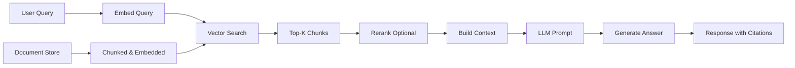

# 05 RAG and Agent Systems

## Overview

**Retrieval-Augmented Generation (RAG)** and **Agent Systems** represent the cutting edge of LLM applications. This section covers how to build production-ready systems that combine LLMs with external knowledge and tools.

**Why This Matters:**
- RAG is the #1 enterprise LLM use case
- Agents are the future of LLM applications
- These topics appear in almost every modern AI interview

---

## 📚 Contents

### RAG Fundamentals

1. [**RAG Architecture Overview**](./rag_fundamentals.md) ⭐⭐⭐
   - What is RAG and why use it?
   - RAG vs Fine-tuning vs Prompting
   - Basic RAG pipeline
   - Advanced RAG patterns

2. [**Vector Databases**](./vector_databases.md) ⭐⭐⭐
   - Why vector databases?
   - Popular options (Pinecone, Weaviate, Qdrant, ChromaDB, FAISS)
   - ANN algorithms (HNSW, IVF)
   - Choosing the right vector DB

3. [**Embeddings for RAG**](./embeddings_for_rag.md) ⭐⭐⭐
   - Choosing embedding models
   - Sentence transformers
   - OpenAI embeddings vs open-source
   - Embedding dimensionality tradeoffs
   - Similarity metrics (cosine vs dot product)

4. [**Chunking Strategies**](./chunking_strategies.md) ⭐⭐⭐
   - Fixed-size vs semantic chunking
   - Chunk size optimization
   - Overlap strategies
   - Document structure preservation

5. [**Retrieval Optimization**](./retrieval_optimization.md) ⭐⭐
   - Hybrid search (dense + sparse)
   - Query expansion
   - Metadata filtering
   - Multi-stage retrieval

6. [**Reranking**](./reranking.md) ⭐⭐
   - Why rerank?
   - Cross-encoders vs bi-encoders
   - Reranking models (Cohere, bge-reranker)
   - Cost-accuracy tradeoffs

7. [**Evaluation for RAG**](./rag_evaluation.md) ⭐⭐⭐
   - Retrieval metrics (Recall@K, MRR, NDCG)
   - Generation metrics (Faithfulness, Relevance)
   - End-to-end evaluation
   - RAGAs framework

### Advanced RAG

8. [**Graph RAG**](./graph_rag.md) ⭐⭐
   - When documents have relationships
   - Knowledge graph construction
   - Graph-based retrieval

9. [**Multi-Hop Retrieval**](./multi_hop_retrieval.md) ⭐
   - Complex queries needing multiple retrievals
   - Iterative retrieval patterns

10. [**RAG Failure Modes and Debugging**](./rag_debugging.md) ⭐⭐
    - Common failure patterns
    - How to diagnose issues
    - Mitigation strategies

### Agent Systems

11. [**Agent Architectures**](./agent_architectures.md) ⭐⭐⭐
    - What is an agent?
    - ReAct (Reasoning + Acting)
    - Plan-and-Execute
    - Reflection and self-correction
    - Multi-agent systems

12. [**Tool Use and Function Calling**](./tool_use.md) ⭐⭐
    - How agents use tools
    - Tool selection strategies
    - Error handling

13. [**Memory Systems**](./memory_systems.md) ⭐⭐
    - Short-term vs long-term memory
    - Conversation history management
    - Entity memory

14. [**Agent Orchestration**](./agent_orchestration.md) ⭐⭐
    - LangChain, LlamaIndex, AutoGPT
    - When to use frameworks vs custom
    - Production considerations

### Production RAG/Agents

15. [**Production RAG Systems**](./production_rag.md) ⭐⭐⭐
    - Architecture patterns
    - Latency optimization
    - Cost optimization
    - Monitoring and observability
    - Scaling strategies

16. [**RAG Security**](./rag_security.md) ⭐
    - Prompt injection via retrieved docs
    - Data poisoning
    - Access control

---

## 🎯 Learning Objectives

After this section, you should be able to:

- Design and implement a production RAG system
- Choose appropriate embedding models and vector databases
- Optimize retrieval quality and latency
- Evaluate RAG systems effectively
- Build agent systems with tool use
- Debug common RAG failure modes
- Scale RAG systems for production traffic

---

## ⏱️ Time Estimate

**Total: 10-12 hours**

**High Priority (Interview Critical):**
- RAG Fundamentals: 1.5 hours ⭐⭐⭐
- Vector Databases: 1 hour ⭐⭐⭐
- Embeddings for RAG: 1.5 hours ⭐⭐⭐
- Chunking Strategies: 1 hour ⭐⭐⭐
- RAG Evaluation: 1 hour ⭐⭐⭐
- Agent Architectures: 1.5 hours ⭐⭐⭐
- Production RAG: 1.5 hours ⭐⭐⭐

**Medium Priority:**
- Retrieval Optimization: 1 hour ⭐⭐
- Reranking: 45 min ⭐⭐
- Tool Use: 45 min ⭐⭐
- RAG Debugging: 30 min ⭐⭐

**Lower Priority:**
- Graph RAG: 30 min ⭐
- Multi-Hop Retrieval: 30 min ⭐
- RAG Security: 20 min ⭐

---

## 🔥 Interview Focus Areas

### Most Common Interview Questions

1. **"Design a RAG system for [company knowledge base / customer support / etc.]"**
   - See: [RAG Fundamentals](./rag_fundamentals.md), [Production RAG](./production_rag.md)

2. **"How do you choose chunk size?"**
   - See: [Chunking Strategies](./chunking_strategies.md)

3. **"What's the difference between RAG and fine-tuning?"**
   ```
   RAG:
   ✅ Up-to-date information (just update docs)
   ✅ Interpretable (can show sources)
   ✅ Cost-effective
   ❌ Retrieval quality dependency
   ❌ Added latency

   Fine-tuning:
   ✅ Knowledge baked into model
   ✅ Faster inference (no retrieval)
   ✅ Learns style and patterns
   ❌ Static knowledge (need retrain for updates)
   ❌ Expensive
   ❌ Less interpretable

   Often best: Hybrid (fine-tune for style, RAG for facts)
   ```

4. **"How do you evaluate RAG quality?"**
   - Retrieval: Recall@K, MRR, NDCG
   - Generation: Faithfulness, Answer Relevance
   - End-to-end: Human eval, LLM-as-judge
   - See: [RAG Evaluation](./rag_evaluation.md)

5. **"What causes poor RAG performance?"**
   - Bad retrieval (wrong chunks returned)
   - Poor chunking (split in wrong places)
   - Embedding model mismatch (query vs doc embeddings)
   - Context window limitations
   - See: [RAG Debugging](./rag_debugging.md)

6. **"Explain agent architectures"**
   - ReAct: Reason about what to do, Act (use tool), Observe result, repeat
   - Plan-and-Execute: Plan steps upfront, execute sequentially
   - See: [Agent Architectures](./agent_architectures.md)

---

## 🚀 Quick Start Paths

### Path 1: RAG-Focused (6-7 hours)

**For roles emphasizing RAG systems:**

1. [RAG Fundamentals](./rag_fundamentals.md) - 1.5 hours
2. [Embeddings for RAG](./embeddings_for_rag.md) - 1.5 hours
3. [Vector Databases](./vector_databases.md) - 1 hour
4. [Chunking Strategies](./chunking_strategies.md) - 1 hour
5. [RAG Evaluation](./rag_evaluation.md) - 1 hour
6. [Production RAG](./production_rag.md) - 1.5 hours

### Path 2: Agent-Focused (4-5 hours)

**For roles emphasizing autonomous systems:**

1. [Agent Architectures](./agent_architectures.md) - 1.5 hours
2. [Tool Use](./tool_use.md) - 45 min
3. [Memory Systems](./memory_systems.md) - 1 hour
4. [Agent Orchestration](./agent_orchestration.md) - 1 hour
5. Review agent case studies - 30-45 min

### Path 3: Complete Coverage (10-12 hours)

**Week 1: RAG Fundamentals**
- Days 1-2: RAG basics, embeddings, vector DBs
- Days 3-4: Chunking, retrieval, reranking
- Day 5: RAG evaluation

**Week 2: Advanced Topics**
- Days 1-2: Agent architectures and tool use
- Days 3-4: Production RAG systems
- Day 5: Practice with case studies

---

## 🎓 Key Concepts to Master

### 1. Basic RAG Pipeline



### 2. RAG vs Fine-Tuning Decision Matrix

| Consideration | Use RAG | Use Fine-Tuning | Use Both |
|--------------|---------|-----------------|----------|
| **Need up-to-date info** | ✅ | ❌ | ✅ |
| **Knowledge is static** | Either | ✅ | Either |
| **Need citations** | ✅ | ❌ | ✅ |
| **Have labeled data** | Not needed | Required ✅ | ✅ |
| **Need specific style/tone** | Prompting may suffice | ✅ | ✅ |
| **Budget limited** | ✅ (cheaper) | ❌ | Depends |
| **Latency critical** | ❌ (adds latency) | ✅ | ❌ |
| **Interpretability needed** | ✅ (show sources) | ❌ | ✅ |

### 3. Chunking Strategies Comparison

| Strategy | Pros | Cons | When to Use |
|----------|------|------|-------------|
| **Fixed-size (512 tokens)** | Simple, predictable | Might split mid-sentence | Quick start, simple docs |
| **Sentence-based** | Semantic integrity | Variable size | General purpose |
| **Paragraph-based** | Natural boundaries | Might be too large | Structured documents |
| **Semantic chunking** | Coherent topics | More complex | High-quality docs |
| **Sliding window (overlap)** | No info loss at boundaries | Redundancy | Critical context preservation |

### 4. Embedding Model Selection

| Model | Dimensions | Speed | Quality | Cost | Use Case |
|-------|-----------|-------|---------|------|----------|
| **OpenAI text-embedding-3-small** | 1536 | Fast | Great | $$$ | Production, high quality |
| **sentence-transformers/all-MiniLM-L6-v2** | 384 | Very Fast | Good | Free (self-host) | Cost-sensitive, fast retrieval |
| **bge-large-en-v1.5** | 1024 | Medium | Excellent | Free | Open-source, quality |
| **OpenAI text-embedding-3-large** | 3072 | Medium | Best | $$$$ | Maximum quality |

### 5. Vector Database Selection

| Database | Hosting | Scale | Speed | Features | Best For |
|----------|---------|-------|-------|----------|----------|
| **FAISS** | Self (in-memory) | Medium | Fastest | Minimal | Prototyping, small scale |
| **ChromaDB** | Self or cloud | Small-Medium | Fast | Simple API | Development, small prod |
| **Pinecone** | Cloud-only | Large | Fast | Managed, features | Production, no ops overhead |
| **Weaviate** | Both | Large | Fast | GraphQL, hybrid search | Complex queries |
| **Qdrant** | Both | Large | Fast | Filtering, payloads | Production, self-hosted |
| **pgvector** | Self (Postgres) | Medium | Medium | Familiar SQL | Existing Postgres users |

---

## 💡 Pro Tips for Interviews

### 1. Always Start with the Full Picture

**Bad:** "I'll use FAISS for vector search."

**Good:**
"Let me outline the RAG architecture:
1. **Ingestion**: Chunk documents (512 tokens, 50 overlap), embed with Sentence-BERT, store in vector DB
2. **Retrieval**: Embed query, vector search (top-10), rerank (top-3)
3. **Generation**: Build prompt with context, call LLM, return answer with citations

For vector DB, I'd start with ChromaDB for development (simple) and move to Pinecone for production (managed, scalable). I'd use bge-large for embeddings (good quality, free)."

### 2. Discuss Failure Modes Proactively

"Key risks with RAG:
- **Poor retrieval**: Wrong chunks returned → Fix with better embeddings, hybrid search, metadata filtering
- **Chunk boundaries**: Split context → Fix with overlap, better chunking
- **Hallucination**: LLM makes up info → Fix with stricter prompts, citations required, lower temperature
- **Latency**: Retrieval + generation slow → Fix with caching, parallel retrieval, faster embeddings"

### 3. Show You Think About Production

"For production:
- **Latency**: Target <2s end-to-end. Cache frequent queries, use fast embeddings, consider async where possible
- **Cost**: Embedding costs (e.g., $0.0001 per 1K tokens for OpenAI) × query volume. For 1M queries/month with avg 1K tokens → $100/month. LLM calls dominate cost.
- **Monitoring**: Track retrieval precision@K, answer relevance, latency p50/p99, cost per query
- **Evaluation**: Maintain eval set (100+ query-answer pairs), run before deploys"

### 4. Compare Approaches

**Interviewer:** "Should we use RAG or fine-tuning?"

**Your answer:**
"Let me think through the tradeoffs:

**Our requirements:**
- Customer support knowledge base (updated weekly)
- Need to cite sources for compliance
- Budget: $5K/month

**Analysis:**
- Fine-tuning: $2K one-time + $2K/week retraining = $10K/month, no citations
- RAG: $200/month vector DB + $1K/month LLM calls = $1.2K/month, built-in citations, instant updates

**Recommendation:** RAG is better here. We get citations (required), lower cost, and easy updates. If we later find style/tone issues, we can add instruction fine-tuning on top of RAG (hybrid approach)."

---

## 🔗 Connections to Other Sections

- **03 Modern NLP & Transformers**: Embeddings deep dive
- **04 Large Language Models**: LLMs used in generation phase
- **06 MLOps**: Deploying and monitoring RAG systems
- **07 System Design**: RAG system architecture patterns
- **08 Case Studies**: Real RAG applications (customer support, knowledge base)

---

## 📈 Success Metrics

You've mastered this section when you can:

- [ ] Design a complete RAG system architecture
- [ ] Choose appropriate chunking strategy and explain why
- [ ] Select embedding models and vector DBs with justification
- [ ] Implement retrieval optimization (hybrid search, reranking)
- [ ] Evaluate RAG systems using proper metrics
- [ ] Debug common RAG failure modes
- [ ] Explain agent architectures (ReAct, Plan-Execute)
- [ ] Discuss production considerations (latency, cost, monitoring)

---

## 🎯 Common Mistakes to Avoid

❌ "RAG is always better than fine-tuning" → Each has use cases, often best is hybrid
❌ "Bigger chunks are better" → Too big loses precision, too small loses context
❌ "Top-1 retrieval is enough" → Usually need top-3 to top-10, then rerank
❌ "Vector search is sufficient" → Hybrid search (dense + sparse) often better
❌ "Any embedding model works" → Quality varies significantly, domain matters
❌ "No need to evaluate retrieval separately" → Retrieval quality determines system ceiling

---

**Ready to start?** → [RAG Fundamentals](./rag_fundamentals.md) (Most interview-critical)

**Next Section:** [06 MLOps and Production AI](../06_MLOps_and_Production_AI/README.md)
