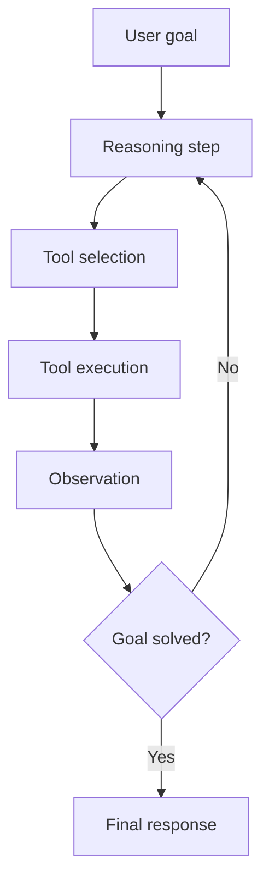

# Agent Architectures for LLM Systems

## What is an agent?
An agent is an LLM system that can plan, use tools, observe outcomes, and iterate toward a goal.

Core equation:
`Agent = LLM + Tools + Memory + Orchestration`

## ReAct loop
Reason -> Act -> Observe -> Repeat



## Patterns
- Tool-calling assistant (single-step).
- ReAct iterative agent.
- Plan-and-execute.
- Reflexion/self-critique.
- Multi-agent role collaboration.

## Tool use design
- Define strict JSON schemas.
- Validate parameters before execution.
- Add retries and idempotency for side-effect tools.
- Constrain high-risk tools with policy layer.

## Memory systems
- Short-term: conversation context.
- Episodic: prior interactions.
- Semantic: vectorized long-term memory.
- Procedural: learned policies/templates.

## Loop prevention
- Step limits.
- Confidence thresholds.
- Detect repeated tool calls with identical args.

## Interview questions
1. What is ReAct and why useful?
2. How handle tool failures?
3. How prevent infinite loops?

## Minimal ReAct pseudo-code
```python
def agent_loop(state, max_steps=8):
    for step in range(max_steps):
        thought, action = llm_plan(state)
        if action is None:
            return llm_finalize(state)
        obs = run_tool(action)
        state = update_state(state, thought, action, obs)
    return "Escalating: step limit reached"
```
