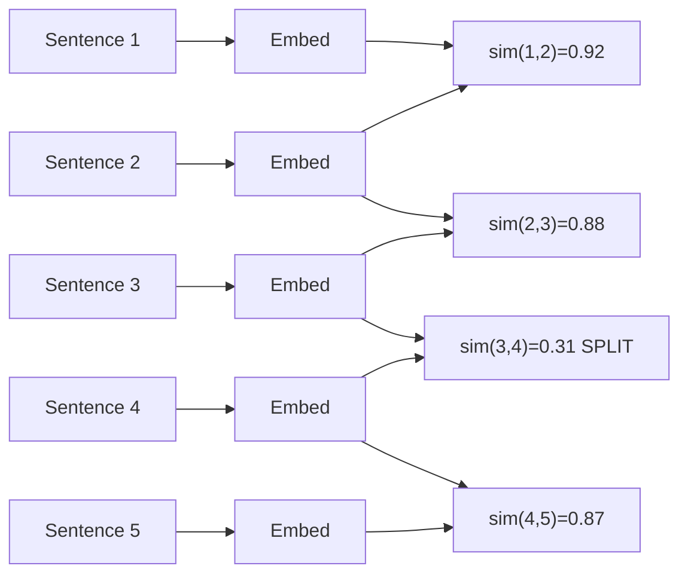
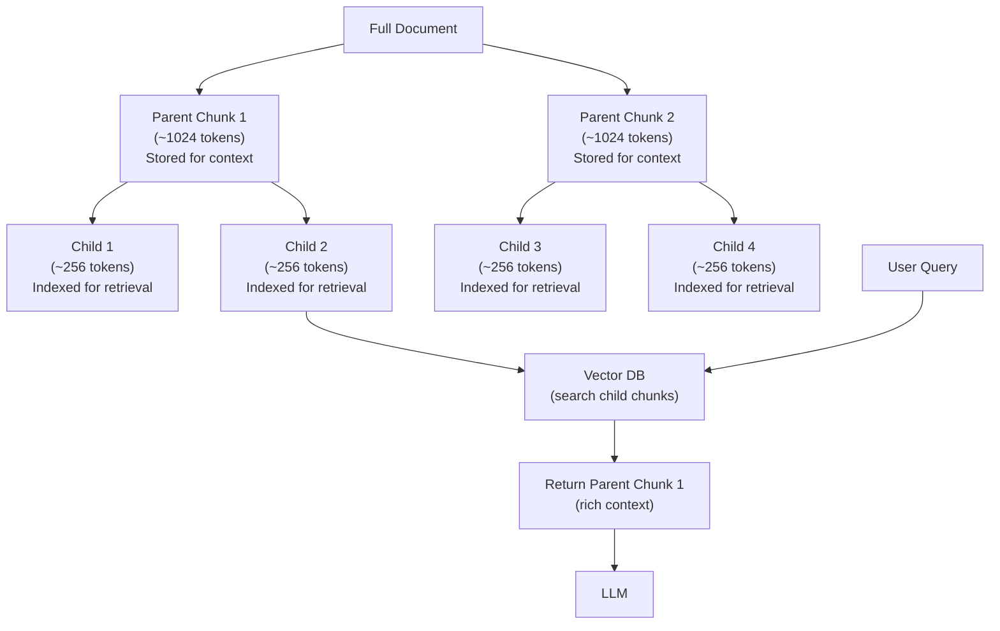
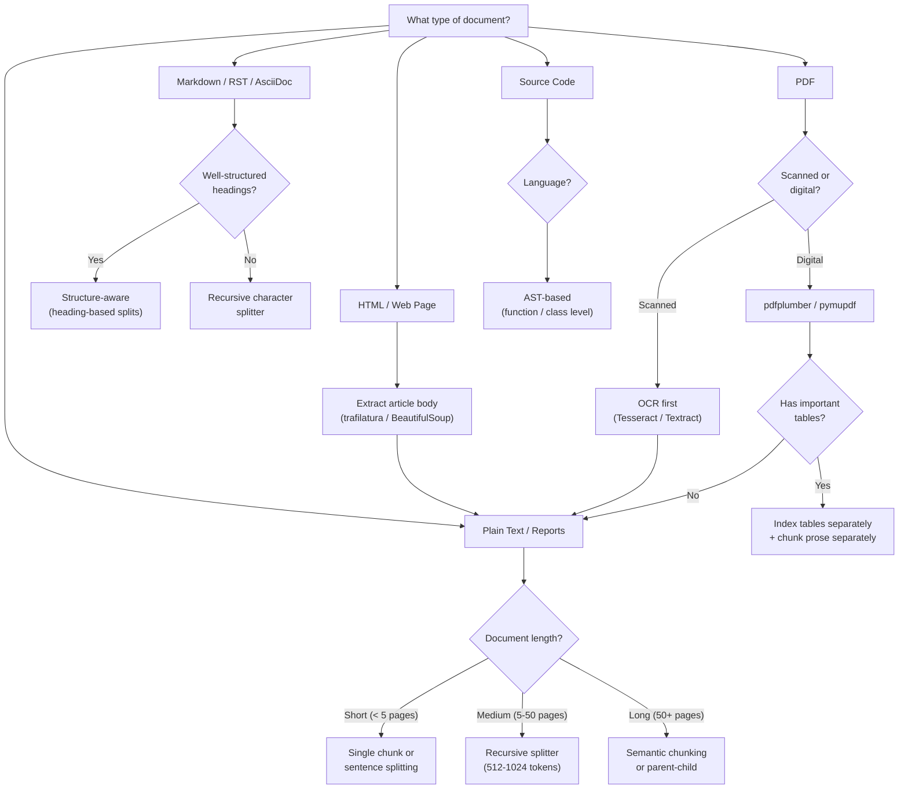

# Chunking Strategies

## Why Chunking is the Highest-Leverage Decision in RAG

Chunking -- breaking documents into smaller pieces before embedding and indexing -- is frequently underestimated by engineers new to RAG. In practice, chunking quality has more impact on retrieval accuracy than almost any other single decision.

The reason: embedding models are trained on text passages of a certain length distribution. When you pass in a chunk, the embedding captures the semantic content of that chunk. If the chunk is too large, the embedding averages over many topics and the query's specific topic may be diluted. If the chunk is too small, the embedding captures a narrow slice without enough context for the model to form a meaningful representation.

**The three failure modes of bad chunking:**
1. **Too large**: Retrieved chunk contains the relevant sentence plus many irrelevant sentences. The LLM has to filter out noise. Context window fills up faster. Retrieval embedding is blurry.
2. **Too small**: Relevant sentence is retrieved but lacks surrounding context. The LLM cannot answer because the chunk is incomplete. Adjacent sentences containing key facts are missed.
3. **Wrong boundaries**: Splitting mid-sentence or mid-paragraph destroys coherence. A chunk starting with "However, this approach..." has no referent for "this approach."

Chunking is not a one-size-fits-all decision. It depends on document type, embedding model, LLM context window, and the types of queries the system must answer.

---

## Chunking Methods

### 1. Fixed-Size Chunking

The simplest strategy: split text every N characters (or tokens), with optional overlap.

```python
def fixed_size_chunk(text: str, chunk_size: int = 512, overlap: int = 64) -> list[str]:
    """
    Character-based fixed-size chunking with overlap.
    In production, use token-based chunking (tiktoken or transformers tokenizer).
    """
    chunks = []
    start = 0
    while start < len(text):
        end = min(start + chunk_size, len(text))
        chunks.append(text[start:end])
        start += chunk_size - overlap
    return chunks
```

**Parameters:**
- `chunk_size`: Typically 256-1024 tokens depending on the embedding model and LLM context budget
- `overlap`: Typically 10-20% of chunk_size. Ensures content near chunk boundaries appears in at least two chunks.

**Advantages:**
- Extremely simple to implement
- Deterministic and reproducible
- No dependency on NLP libraries

**Disadvantages:**
- Completely ignores document structure (splits mid-sentence, mid-paragraph)
- The "optimal" chunk size must be tuned empirically
- Overlap creates redundant content in the index (higher storage cost)

**When to use fixed-size chunking:**
- Rapid prototyping where you want to get something working quickly
- Homogeneous documents where structure is not meaningful (e.g., continuous prose)
- When you need reproducible, content-independent splits for testing

**Interview gotcha**: Fixed-size chunking in characters vs tokens is very different. A 512-character chunk might be 100-150 tokens for normal English, or 400+ tokens for code. Always use the embedding model's tokenizer for token-based chunking.

```python
# Token-based fixed chunking with tiktoken
import tiktoken

def token_chunk(text: str, model: str = "text-embedding-3-large",
                chunk_tokens: int = 512, overlap_tokens: int = 64) -> list[str]:
    enc = tiktoken.encoding_for_model(model)
    tokens = enc.encode(text)
    chunks = []
    start = 0
    while start < len(tokens):
        end = min(start + chunk_tokens, len(tokens))
        chunk_tokens_slice = tokens[start:end]
        chunks.append(enc.decode(chunk_tokens_slice))
        start += chunk_tokens - overlap_tokens
    return chunks
```

---

### 2. Sentence Splitting

Split text at sentence boundaries detected by a sentence tokenizer.

```python
import nltk
from nltk.tokenize import sent_tokenize

nltk.download("punkt", quiet=True)

def sentence_chunk(text: str, sentences_per_chunk: int = 5,
                   overlap_sentences: int = 1) -> list[str]:
    """
    Split text into chunks, each containing a fixed number of sentences.
    Overlap by sharing sentences between adjacent chunks.
    """
    sentences = sent_tokenize(text)
    chunks = []
    i = 0
    while i < len(sentences):
        chunk_sentences = sentences[i:i + sentences_per_chunk]
        chunks.append(" ".join(chunk_sentences))
        i += sentences_per_chunk - overlap_sentences
    return chunks
```

**Libraries:**
- `nltk.sent_tokenize`: Good for general English text
- `spacy` with `nlp.pipe`: Better for complex sentences, multiple languages
- `pySBD` (Pragmatic Sentence Boundary Disambiguation): Handles abbreviations better

**Advantages:**
- Respects natural sentence boundaries
- Chunks are complete thoughts
- Variable chunk size naturally adapts to sentence length

**Disadvantages:**
- Sentence detection can fail on abbreviations ("Dr. Smith said..."), lists, and code
- Still ignores paragraph/section structure
- Chunk size is unpredictable (a chunk of 5 sentences might be 50 or 500 tokens)

**When to use:**
- General prose documents (news articles, reports, legal text)
- When sentence coherence is more important than uniform chunk size

---

### 3. Recursive Character Text Splitting (LangChain Default)

The most practical general-purpose chunking strategy. Attempts to split at larger semantic units first, falling back to smaller ones.

```python
from langchain.text_splitter import RecursiveCharacterTextSplitter

splitter = RecursiveCharacterTextSplitter(
    chunk_size=1000,      # target chunk size in characters
    chunk_overlap=200,    # overlap between chunks
    length_function=len,  # or use a token counter
    separators=[
        "\n\n",   # paragraph breaks (try first)
        "\n",     # line breaks
        ". ",     # sentence ends
        " ",      # word boundaries
        "",       # character-level (last resort)
    ],
)

chunks = splitter.split_text(long_document_text)
```

**How it works:**
1. Try to split on `"\n\n"` (paragraph breaks). If all resulting chunks are under `chunk_size`, done.
2. For any chunk that is still too large, try splitting on `"\n"`.
3. Continue recursively down the separator list.
4. If even character-level splitting cannot produce a chunk small enough, raise an error or truncate.

**Advantages:**
- Preserves semantic boundaries as much as possible
- Falls back gracefully when preferred separators produce chunks that are too large
- Good default for mixed document types

**Disadvantages:**
- Still character-based, not token-based, by default
- The separator hierarchy is arbitrary; different document types may need different hierarchies
- Doesn't understand document semantics

**When to use:**
- When you need a solid default that works reasonably well on diverse inputs
- LangChain pipelines where you want easy integration

---

### 4. Semantic Chunking

Detects topical shifts in the text by monitoring the cosine similarity between adjacent sentence embeddings. Splits at points where similarity drops sharply.



```python
import numpy as np
from sentence_transformers import SentenceTransformer
from nltk.tokenize import sent_tokenize

def semantic_chunk(
    text: str,
    model_name: str = "all-MiniLM-L6-v2",
    similarity_threshold: float = 0.7,
    min_chunk_sentences: int = 2,
) -> list[str]:
    """
    Split text into semantic chunks by detecting cosine similarity drops
    between adjacent sentence embeddings.
    """
    model = SentenceTransformer(model_name)
    sentences = sent_tokenize(text)

    if len(sentences) <= min_chunk_sentences:
        return [text]

    # Embed all sentences
    embeddings = model.encode(sentences, normalize_embeddings=True)

    # Compute cosine similarity between adjacent sentences
    similarities = [
        float(np.dot(embeddings[i], embeddings[i + 1]))
        for i in range(len(embeddings) - 1)
    ]

    # Find split points: where similarity drops below threshold
    split_indices = [0]
    for i, sim in enumerate(similarities):
        if sim < similarity_threshold:
            split_indices.append(i + 1)
    split_indices.append(len(sentences))

    # Build chunks from split points
    chunks = []
    for i in range(len(split_indices) - 1):
        start = split_indices[i]
        end = split_indices[i + 1]
        # Respect minimum chunk size
        if end - start >= min_chunk_sentences or i == len(split_indices) - 2:
            chunks.append(" ".join(sentences[start:end]))

    return chunks
```

**Advantages:**
- Chunks have coherent topics
- Adapts naturally to document structure
- Produces variable-size chunks that match the natural density of information

**Disadvantages:**
- Computationally expensive during ingestion (embed every sentence)
- Requires an embedding model at ingestion time
- Threshold is a hyperparameter that needs tuning per corpus
- Can produce very short chunks for rapidly-changing topics

**When to use:**
- Long documents covering multiple topics (research papers, long blog posts)
- When topic coherence is critical for retrieval quality
- When you can afford the compute at ingestion time

---

### 5. Document Structure-Aware Chunking

Parses the document's native structure (headings, sections, HTML tags) and uses it as the basis for chunking.

```python
import re
from dataclasses import dataclass

@dataclass
class StructuredChunk:
    text: str
    level: int        # heading level (1=H1, 2=H2, etc.)
    header: str       # the section header this chunk belongs to
    parent_header: str  # the parent section header

def markdown_chunk(text: str, max_tokens: int = 800) -> list[StructuredChunk]:
    """
    Split Markdown documents by heading structure.
    Each heading starts a new chunk. Long sections are further sub-chunked.
    """
    # Split on headings
    heading_pattern = re.compile(r'^(#{1,6})\s+(.+)$', re.MULTILINE)
    splits = []
    last_end = 0
    headers = []  # stack of (level, header_text)

    for match in heading_pattern.finditer(text):
        if last_end < match.start():
            splits.append((text[last_end:match.start()], headers.copy()))
        level = len(match.group(1))
        header_text = match.group(2).strip()
        # Pop headers at same or deeper level
        headers = [(l, h) for l, h in headers if l < level]
        headers.append((level, header_text))
        last_end = match.end()

    if last_end < len(text):
        splits.append((text[last_end:], headers.copy()))

    chunks = []
    for content, header_stack in splits:
        content = content.strip()
        if not content:
            continue
        header = header_stack[-1][1] if header_stack else ""
        parent = header_stack[-2][1] if len(header_stack) > 1 else ""
        level = header_stack[-1][0] if header_stack else 0
        chunks.append(StructuredChunk(
            text=content,
            level=level,
            header=header,
            parent_header=parent,
        ))

    return chunks
```

**Supported structures:**
- **Markdown**: `#`, `##`, `###` headings; `---` dividers; code blocks
- **HTML**: `<h1>` through `<h6>`, `<article>`, `<section>`, `<p>` tags
- **PDF with structure**: Named sections if PDF has a bookmark tree (via `pymupdf`)
- **RST / AsciiDoc**: Section underlines
- **Jupyter notebooks**: Cell-based chunking

**Advantages:**
- Produces chunks aligned with human-readable document structure
- Each chunk is contextually complete (you know which section it belongs to)
- Enables header-level retrieval and hierarchical search

**Disadvantages:**
- Requires correctly parsed document structure (PDF parsing often loses structure)
- Documents without explicit structure cannot use this approach
- Implementation varies significantly by document format

---

### 6. Agentic Chunking

Use an LLM to decide chunk boundaries, simulating how a human would break a document into logical pieces.

```python
from openai import OpenAI

client = OpenAI()

def agentic_chunk(text: str, chunk_guidance: str = "") -> list[str]:
    """
    Use an LLM to propose chunk boundaries for a document.
    This is expensive and slow -- only use for small, high-value documents.
    """
    prompt = f"""You are a document analysis expert. I will give you a document and you will
identify the best places to split it into coherent, self-contained chunks for a RAG system.

Rules:
- Each chunk should be a complete thought or topic
- Chunks should be 100-500 words
- Mark split boundaries with the exact string: <<<SPLIT>>>
{chunk_guidance}

DOCUMENT:
{text}

OUTPUT (the document with <<<SPLIT>>> markers inserted):"""

    response = client.chat.completions.create(
        model="gpt-4o-mini",  # use a cheap model for this
        messages=[{"role": "user", "content": prompt}],
        temperature=0,
    )

    chunked_text = response.choices[0].message.content
    chunks = [c.strip() for c in chunked_text.split("<<<SPLIT>>>") if c.strip()]
    return chunks
```

**When to use agentic chunking:**
- Small, high-value document collections (< 100 documents) where chunk quality is critical
- Complex documents with non-standard structure
- When you have time and budget to invest in the best possible chunking

**Why it's rare in production:**
- 10-50x more expensive than other chunking methods (LLM call per document)
- Slow (seconds per document at agentic chunking, vs milliseconds for rule-based)
- Output is non-deterministic (different chunks on different runs)

---

## Chunk Size Effects

Understanding how chunk size affects RAG performance is critical for interviews.

| Chunk Size (tokens) | Retrieval Precision | Context Richness | LLM Cost | Use Case |
|--------------------|--------------------|-----------------|----------|----------|
| 64-128 | Very high (narrow focus) | Very low (incomplete answers) | Low | Exact fact retrieval |
| 256-512 | High | Moderate | Moderate | Q&A, fact retrieval |
| 512-1024 | Moderate | Good | Moderate-High | General Q&A, explanations |
| 1024-2048 | Lower (noisy) | High | High | Summarization, synthesis |
| 2048+ | Low | Very high | Very high | Long-form generation, document comparison |

**The fundamental tension**: Smaller chunks retrieve more precisely but provide less context to the LLM. Larger chunks provide more context but dilute the retrieval signal.

**Task dependence:**
- **Factoid QA** ("What is the boiling point of water?"): Small chunks (256-512 tokens). The answer is a single fact; you want precise retrieval.
- **Explanatory QA** ("Explain how HNSW works"): Medium chunks (512-1024 tokens). You need enough context for a complete explanation.
- **Multi-document synthesis** ("Compare the approaches in these three papers"): Large chunks or parent-child retrieval. You need broad context.

---

## Parent-Child Chunking

The most important advanced chunking technique. Decouples retrieval granularity from context richness.



**How it works:**

1. Chunk the document at two levels:
   - **Child chunks**: Small (128-256 tokens), indexed in the vector store for precise retrieval
   - **Parent chunks**: Large (512-2048 tokens), stored in a document store (not in the vector index), linked to their child chunks
2. At query time: embed the query, retrieve the most relevant child chunks
3. For each retrieved child chunk: look up its parent chunk
4. Pass the parent chunks (not the child chunks) to the LLM

**Result**: The precision of small-chunk retrieval plus the context richness of large-chunk generation.

```python
from dataclasses import dataclass, field
from typing import Optional
import uuid

@dataclass
class ParentChunk:
    id: str
    text: str
    source: str
    metadata: dict = field(default_factory=dict)

@dataclass
class ChildChunk:
    id: str
    text: str
    parent_id: str      # link back to parent
    position: int       # position within parent
    embedding: Optional[list[float]] = None

class ParentChildChunker:
    def __init__(
        self,
        parent_chunk_size: int = 1000,   # characters
        child_chunk_size: int = 200,      # characters
        overlap: int = 20,
    ):
        self.parent_size = parent_chunk_size
        self.child_size = child_chunk_size
        self.overlap = overlap
        self.parent_store: dict[str, ParentChunk] = {}

    def chunk(self, text: str, source: str) -> tuple[list[ParentChunk], list[ChildChunk]]:
        parents = []
        children = []

        # Create parent chunks
        p_start = 0
        while p_start < len(text):
            p_end = min(p_start + self.parent_size, len(text))
            parent_id = str(uuid.uuid4())
            parent = ParentChunk(
                id=parent_id,
                text=text[p_start:p_end],
                source=source,
            )
            parents.append(parent)
            self.parent_store[parent_id] = parent

            # Create child chunks within this parent
            c_start = p_start
            position = 0
            while c_start < p_end:
                c_end = min(c_start + self.child_size, p_end)
                child = ChildChunk(
                    id=str(uuid.uuid4()),
                    text=text[c_start:c_end],
                    parent_id=parent_id,
                    position=position,
                )
                children.append(child)
                position += 1
                c_start += self.child_size - self.overlap

            p_start += self.parent_size - self.overlap

        return parents, children

    def get_parent(self, parent_id: str) -> Optional[ParentChunk]:
        return self.parent_store.get(parent_id)

    def retrieve_parents(self, child_chunks: list[ChildChunk]) -> list[ParentChunk]:
        """Given retrieved child chunks, return their unique parent chunks."""
        seen_parent_ids = set()
        parents = []
        for child in child_chunks:
            if child.parent_id not in seen_parent_ids:
                parent = self.get_parent(child.parent_id)
                if parent:
                    parents.append(parent)
                    seen_parent_ids.add(child.parent_id)
        return parents
```

### Sentence Window Retrieval

A simpler variant of parent-child chunking:

1. Index individual sentences in the vector store
2. At retrieval time, for each matched sentence, return a window of ±k sentences around it
3. The window provides context without requiring a separate parent store

```python
def sentence_window_retrieve(
    sentences: list[str],
    matched_index: int,
    window_size: int = 2,
) -> str:
    """Return a window of sentences around the matched sentence."""
    start = max(0, matched_index - window_size)
    end = min(len(sentences), matched_index + window_size + 1)
    return " ".join(sentences[start:end])
```

---

## Overlapping Chunks

Overlap between adjacent chunks ensures that content near chunk boundaries appears in at least two chunks.

**Why this matters:**

Without overlap, if the answer to a query spans the boundary between two chunks (e.g., the first chunk ends mid-sentence and the next chunk begins with the conclusion), neither chunk contains the complete answer. With overlap, the boundary region appears at the end of one chunk AND the beginning of the next.

**Typical overlap settings:**
- 10-20% of chunk size is the standard recommendation
- For chunk_size=512 tokens, use overlap=64-100 tokens
- Too much overlap (> 30%): excessive redundancy, larger index, marginal improvement

**Deduplication in context**: When multiple retrieved chunks have overlapping content (e.g., chunk A ends with sentences 10-12 and chunk B starts with sentences 10-12), the LLM receives the same content twice. This wastes context window tokens. Mitigations:
- Before assembling the prompt, detect and remove duplicate sentences across retrieved chunks
- Track which chunk_ids have been included; if parent-child chunking is used, deduplicate at the parent level

---

## Document-Specific Strategies

### PDFs

PDFs are notoriously difficult to parse correctly. PDF format encodes visual layout, not logical structure.

**Common problems:**
- Multi-column layout: text is extracted left-to-right, mixing columns
- Headers and footers: appear on every page, repeated throughout the extracted text
- Tables: row-by-row extraction loses the column relationships
- Equations, figures, charts: not extractable as text
- Scanned PDFs: require OCR

**Recommended tools:**
- `pymupdf` (fitz): fast, handles most PDFs correctly
- `pdfplumber`: excellent table extraction
- `unstructured`: full document parsing pipeline with layout detection
- `LlamaParse` (LlamaIndex): cloud API for intelligent PDF parsing, handles complex layouts

**Table handling in PDFs:**

Option 1: Serialize as pipe-delimited text
```
| Product | Revenue | Growth |
|---------|---------|--------|
| Widget A | $1.2M | +15% |
| Widget B | $0.8M | -3% |
```

Option 2: Convert to HTML `<table>` elements and embed as structured text

Option 3: Index tables separately in a structured store, query with SQL, merge results with vector search

### HTML

Parse the article body, strip navigation, ads, and boilerplate.

```python
from trafilatura import extract

def parse_html(html_content: str) -> str:
    """Extract main article content from HTML, stripping boilerplate."""
    text = extract(
        html_content,
        include_comments=False,
        include_tables=True,
        no_fallback=False,
    )
    return text or ""
```

`trafilatura` uses a set of heuristics (text density, link density, position in DOM) to identify the main content area.

### Code Files

Code requires function-level or class-level splitting, not character-level.

```python
import ast

def chunk_python_file(source_code: str) -> list[dict]:
    """Split a Python file into chunks at the function/class level."""
    tree = ast.parse(source_code)
    lines = source_code.split('\n')
    chunks = []

    for node in ast.walk(tree):
        if isinstance(node, (ast.FunctionDef, ast.AsyncFunctionDef, ast.ClassDef)):
            start_line = node.lineno - 1
            end_line = node.end_lineno
            chunk_text = '\n'.join(lines[start_line:end_line])
            chunks.append({
                "type": type(node).__name__,
                "name": node.name,
                "text": chunk_text,
                "start_line": start_line + 1,
                "end_line": end_line,
            })

    return chunks
```

For other languages: use tree-sitter with the appropriate language grammar for robust AST-based splitting.

### Multi-Modal Content

For documents with images (screenshots, diagrams, charts):

**Option 1**: Skip images; only index text
**Option 2**: Use a vision-capable model (GPT-4o, Claude) to generate a text description of each image, index the description
**Option 3**: Multi-modal embeddings (CLIP, OpenAI's multi-modal embeddings) to embed images directly alongside text

---

## Chunking Strategy Decision Tree



---

## Common Interview Questions and Model Answers

### "How do you choose chunk size for a RAG system?"

Start with the use case. For factoid QA (single-sentence answers), small chunks (256-512 tokens) give precise retrieval. For explanatory answers, use 512-1024 tokens. For synthesis, use parent-child chunking.

Then consider the embedding model's context window. Most dense embedding models handle up to 512 tokens optimally. Content beyond that is truncated or averaged over.

Then consider the LLM's context budget. If you're passing 10 chunks and each is 1024 tokens, that's 10k tokens just for context. Multiply by cost per token and concurrent requests.

Finally, run experiments: vary chunk size from 256 to 1024, measure retrieval metrics (Recall@5, NDCG@5) on a held-out QA set.

### "What is parent-child chunking and when is it useful?"

Parent-child chunking indexes small "child" chunks for retrieval precision but returns larger "parent" chunks to the LLM for context richness. The child chunk is the retrieval unit; the parent chunk is the generation unit.

It's useful when the answer to a query might be a specific sentence (high retrieval precision needed) but the LLM needs surrounding paragraphs to formulate a complete answer. Without parent-child, you'd have to choose between precision (small chunks) and context (large chunks). Parent-child gives you both.

Use it for: Q&A over long technical documents, legal documents, research papers.

### "How do you handle tables in RAG?"

Tables are one of the hardest challenges in RAG because they have relational structure that linear text chunking destroys.

Approach 1: Serialize tables as pipe-delimited Markdown and include them in the chunk. Works if the table is small and the LLM can parse Markdown tables.

Approach 2: For critical tables (financial data, configuration specs), store them in a structured database (SQL or JSON) and query them directly, bypassing the vector store. Merge structured results with vector search results in the context assembly step.

Approach 3: For complex tables with many rows, extract and summarize: "This table shows quarterly revenue by product line, with Widget A at $1.2M (up 15%) and Widget B at $0.8M (down 3%)." Index the summary, not the raw table.

Approach 4: Use a vision model to caption tables from PDF screenshots if text extraction is unreliable.

---

## Key Takeaways for Interviews

1. Chunking is the highest-leverage decision in RAG after embedding model quality.
2. No single chunking strategy is optimal for all document types. Match strategy to document structure.
3. Parent-child chunking solves the precision-vs-context tradeoff and is worth knowing deeply.
4. Table handling is always a special case; treat it explicitly.
5. Semantic chunking produces the best chunk quality but is expensive at ingestion time.
6. Overlap is necessary but adds index bloat; 10-20% is the practical range.
7. Always use token-based chunking in production, not character-based.
