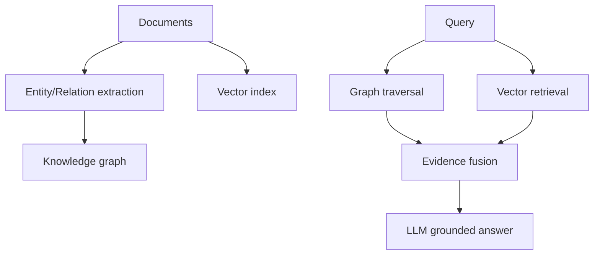

# GraphRAG and Advanced Retrieval Patterns

## Why GraphRAG
Vector similarity alone can miss explicit relationships needed for multi-hop reasoning.

## Knowledge graph basics
- Nodes: entities
- Edges: relations
- Triples: (subject, relation, object)

## GraphRAG pipeline
1. Extract entities/relations from corpus.
2. Build knowledge graph.
3. Community detection and summarization.
4. Query -> graph traversal + vector retrieval.
5. Compose evidence for generation.

## Multi-hop retrieval
Useful for questions requiring chained facts.
Approaches:
- iterative query reformulation
- sub-question decomposition
- graph neighborhood expansion

## HyDE
Generate hypothetical answer text, embed it, and retrieve similar documents to improve recall for underspecified queries.

## Late interaction (ColBERT)
Token-level similarity with MaxSim provides better relevance than single-vector document embeddings while remaining efficient via indexing tricks.

## When to use GraphRAG
- enterprise policy documentation with many cross-references
- supply chain relationship queries
- org knowledge requiring entity-level reasoning

## Interview questions
1. Vector RAG vs GraphRAG tradeoff?
2. How does multi-hop retrieval work?
3. Why HyDE can improve retrieval for ambiguous queries?
