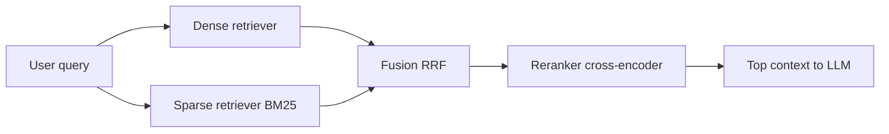

# Hybrid Search and Reranking

## Why hybrid retrieval
Dense retrieval captures semantic similarity; sparse retrieval captures exact terms and IDs. Enterprise search needs both.

## Dense vs sparse
- Dense: embedding similarity (cosine/dot).
- Sparse: BM25/TF-IDF lexical matching.

## Fusion strategies
- Reciprocal Rank Fusion (RRF): combine rank signals robustly.
- Weighted sum of normalized scores.



## Reranking
Use cross-encoder to jointly score query-document pairs after coarse retrieval.
Pipeline:
1. Retrieve top 50-200 candidates fast.
2. Rerank top candidates (e.g., top 50).
3. Send best 5-10 chunks to generator.

## Query transformation
- HyDE: generate hypothetical answer then retrieve by it.
- Query rewriting for clarity.
- Query decomposition for multi-hop questions.
- Multi-query expansion for recall boost.

## When reranking helps most
- Dense retrieval returns semantically close but not answer-bearing chunks.
- Corpus has many near-duplicates.
- Legal/policy docs with subtle distinctions.

## Interview questions
1. Explain RRF intuitively.
2. When dense-only retrieval fails?
3. Why cross-encoder reranking improves NDCG?

## Python sketch: RRF
```python
def rrf(rank, k=60):
    return 1.0 / (k + rank)

def fuse_rrf(dense_ids, sparse_ids):
    score = {}
    for i, doc in enumerate(dense_ids, start=1):
        score[doc] = score.get(doc, 0.0) + rrf(i)
    for i, doc in enumerate(sparse_ids, start=1):
        score[doc] = score.get(doc, 0.0) + rrf(i)
    return sorted(score.items(), key=lambda x: x[1], reverse=True)
```
