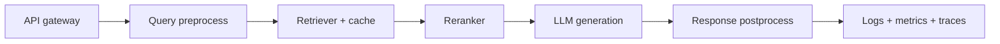

# Production RAG Concerns: Latency, Cost, Accuracy, Observability

## Architecture concerns
- P95 latency budgets
- retrieval quality drift
- index freshness
- tenant isolation
- cost per request

## Latency optimization
- Cache query embeddings.
- Cache frequent retrieval results.
- Parallelize dense+sparse retrieval.
- Reduce rerank candidate count adaptively.
- Stream generation tokens to client.

## Cost optimization
- Smaller embedding model for ingestion.
- Tiered LLM routing by complexity.
- Aggressive caching.
- Truncate context with compression.

## Accuracy vs latency tradeoff
- More chunks improves recall but increases prompt tokens and noise.
- Reranking improves precision but adds latency.
- Larger models improve quality but increase cost/tail latency.

## Observability metrics
- retrieval recall proxy
- hallucination/groundedness rate
- citations per answer
- p50/p95/p99 latency per component
- token cost per request

## Multi-tenancy
- namespace isolation per tenant
- metadata filters with mandatory tenant ID
- authz checks before retrieval and generation

## Failure modes
- empty retrieval
- stale index
- wrong language retrieval
- model ignores context

## Interview questions
1. How design RAG for 1000 enterprise tenants?
2. How monitor quality without full labels?
3. Plan to reduce P95 latency below 2 seconds?
